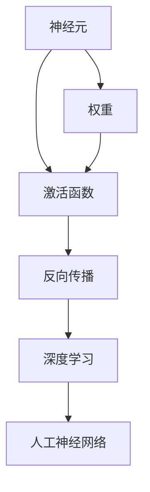
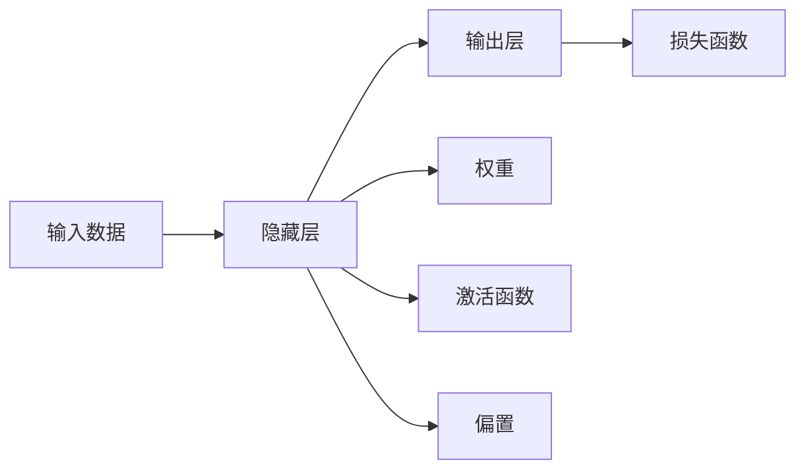
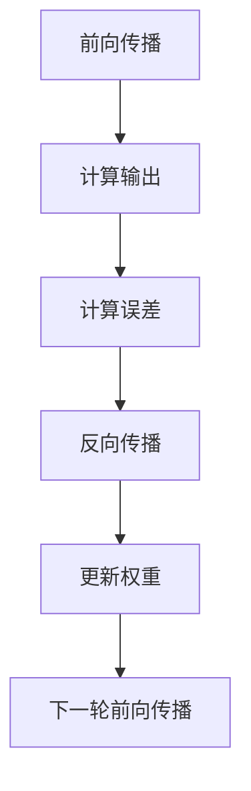
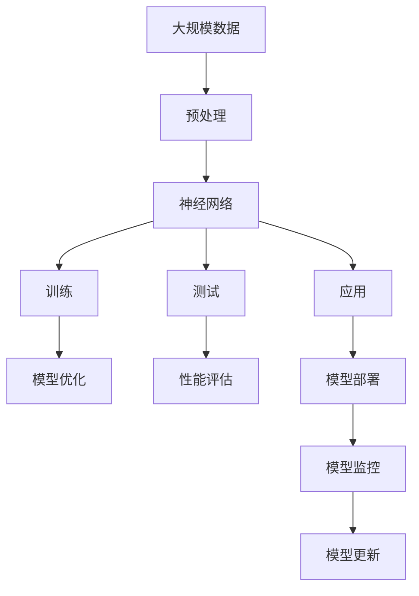

                 

# 神经网络：人类与机器的共存

> 关键词：神经网络,机器学习,人工智能,深度学习,脑神经网络,人工神经网络,人工神经元

## 1. 背景介绍

### 1.1 问题由来
随着人工智能（AI）技术的发展，神经网络（Neural Network）这一新兴领域逐渐引起了广泛关注。作为深度学习（Deep Learning）的核心技术之一，神经网络在图像识别、自然语言处理、语音识别等众多领域取得了令人瞩目的成绩。然而，尽管神经网络在技术上取得了显著进展，但关于其是否能够与人类智能共存、如何共存的问题仍存在许多争议。

神经网络是对生物神经系统的模拟，通过学习数据中的模式和规律，实现复杂的决策和推理。尽管神经网络在技术上取得了巨大成功，但关于其与人类智能的关系，仍存在许多未解之谜。本文将围绕神经网络的基本原理、优势与挑战进行深入探讨，并尝试回答人类与机器共存的问题。

### 1.2 问题核心关键点
神经网络的核心在于其结构与算法。具体来说，神经网络由大量的神经元（Neuron）和连接它们之间的权值（Weight）构成。每个神经元接收输入数据，通过计算并产生输出，最终将结果传递给下一层。神经网络的训练过程是通过反向传播（Backpropagation）算法，不断调整权值来最小化误差。

神经网络具有以下核心特性：
1. **非线性映射**：神经元通过激活函数实现非线性映射，使其能够处理复杂的数据模式。
2. **分布式计算**：通过多层次的结构，神经网络能够并行处理大量数据，提高计算效率。
3. **自适应性**：神经网络能够通过训练调整自身参数，从而适应不同类型的数据和任务。
4. **泛化能力**：经过充分训练的神经网络，能够在新数据上进行泛化，识别未知模式。

神经网络技术的应用领域极为广泛，从医疗诊断、金融预测到自动驾驶、自然语言处理，无所不包。其强大的数据处理能力和高效的计算性能，使其在众多领域中扮演了重要角色。

### 1.3 问题研究意义
探讨神经网络与人类智能共存的问题，具有重要的理论意义和现实价值：

1. **推动AI技术发展**：了解神经网络的核心原理和特性，有助于深化对AI技术的理解，推动相关技术的进一步发展。
2. **提高应用效果**：通过优化神经网络的设计和训练方法，能够提高其在实际应用中的效果和可靠性。
3. **应对伦理挑战**：神经网络的应用涉及隐私、公平性等伦理问题，研究如何合理使用神经网络，有助于构建更公平、透明的AI系统。
4. **促进跨学科研究**：神经网络与认知科学、神经科学等领域的交叉研究，有助于深化对人类智能的理解。
5. **探索人类智能本质**：通过研究神经网络，可以探索人类智能的本质和起源，为未来的人工智能发展提供指导。

## 2. 核心概念与联系

### 2.1 核心概念概述

为更好地理解神经网络与人类智能共存的问题，本节将介绍几个密切相关的核心概念：

- **神经元（Neuron）**：神经网络的基本单位，接收输入数据，通过计算并产生输出，是神经网络中最核心的组件。
- **激活函数（Activation Function）**：用于将神经元的输出映射到一定范围内，引入非线性特性，是神经网络的关键特性之一。
- **权重（Weight）**：神经元之间连接点的参数，决定了输入对输出的影响程度，是神经网络训练的核心。
- **反向传播（Backpropagation）**：神经网络训练的核心算法，通过不断调整权重，最小化预测输出与真实标签之间的误差。
- **深度学习（Deep Learning）**：神经网络的一种高级形式，通过多层结构，能够处理更复杂的数据模式。
- **人工神经网络（Artificial Neural Network, ANN）**：模拟生物神经网络的结构和功能，实现数据的自动处理和分类。

这些核心概念之间的逻辑关系可以通过以下Mermaid流程图来展示：



这个流程图展示了大神经网络与人类智能共存问题涉及的核心概念及其之间的关系：

1. 神经元通过权重和激活函数实现非线性映射，构成神经网络的基础。
2. 反向传播算法通过不断调整权重，最小化误差，实现神经网络的训练和优化。
3. 深度学习通过多层结构，实现对复杂数据模式的处理。
4. 人工神经网络通过模拟生物神经网络，实现数据的自动处理和分类。

这些概念共同构成了神经网络的基本框架，使其能够在众多领域中发挥强大的数据处理能力。通过理解这些核心概念，我们可以更好地把握神经网络的工作原理和优化方向。

### 2.2 概念间的关系

这些核心概念之间存在着紧密的联系，形成了神经网络的完整生态系统。下面我们通过几个Mermaid流程图来展示这些概念之间的关系。

#### 2.2.1 神经网络的基本结构



这个流程图展示了神经网络的基本结构：输入数据经过隐藏层的处理，通过权重和激活函数进行非线性映射，最终输出结果，并由损失函数计算误差。

#### 2.2.2 反向传播算法



这个流程图展示了反向传播算法的流程：通过前向传播计算输出，再计算误差，并通过反向传播算法更新权重，完成一轮训练。

#### 2.2.3 深度学习与人工神经网络的关系


这个流程图展示了深度学习与人工神经网络的关系：深度学习是人工神经网络的一种高级形式，通过多层结构，实现对复杂数据模式的处理。

### 2.3 核心概念的整体架构

最后，我们用一个综合的流程图来展示这些核心概念在大神经网络共存人类智能问题的整体架构：



这个综合流程图展示了从数据预处理到模型部署，再到模型监控和更新的完整过程。神经网络通过大规模数据预处理，建立模型结构，并通过训练和测试优化模型性能。最终，模型被部署到实际应用中，并持续进行监控和更新，以适应数据分布的变化。

## 3. 核心算法原理 & 具体操作步骤
### 3.1 算法原理概述

神经网络的训练过程是通过反向传播算法，不断调整权重来最小化误差。具体来说，假设神经网络模型为 $M$，训练数据集为 $D=\{(x_i, y_i)\}_{i=1}^N$，其中 $x_i$ 为输入数据，$y_i$ 为真实标签。神经网络的损失函数为 $\mathcal{L}(M, D)$，目标是找到最优参数 $\theta$ 使得 $\mathcal{L}(M_\theta, D)$ 最小化。

在训练过程中，反向传播算法首先通过前向传播计算神经网络对每个训练样本的输出 $z_i$，然后计算预测输出与真实标签之间的误差 $e_i$。接着，通过链式法则，计算每个神经元对误差的贡献，并按照误差反向传播，更新权重。具体步骤如下：

1. 前向传播：将输入数据 $x_i$ 通过神经网络模型 $M$，计算每个神经元的输出 $z_i$。
2. 计算误差：计算预测输出 $z_i$ 与真实标签 $y_i$ 之间的误差 $e_i$。
3. 反向传播：通过链式法则，计算每个神经元对误差的贡献，并按照误差反向传播，更新权重。
4. 重复迭代：重复上述过程，直至误差收敛或达到预设轮数。

### 3.2 算法步骤详解

神经网络的训练过程可以分为以下几个关键步骤：

**Step 1: 准备训练数据**

训练数据集 $D$ 应包含大量样例，并覆盖不同的数据分布。为了提高训练效果，可以采用数据增强、数据扩充等技术，增加训练集的多样性。同时，需要注意训练数据与测试数据之间的分布差异，以避免过拟合。

**Step 2: 选择模型结构和超参数**

根据具体任务，选择适当的神经网络结构（如卷积神经网络、循环神经网络等）和超参数（如学习率、批大小、迭代轮数等）。对于深度学习模型，通常需要多次实验，找到最优的模型结构和超参数组合。

**Step 3: 初始化权重**

初始化权重是神经网络训练的重要步骤。常见的初始化方法包括随机初始化、高斯初始化、Xavier初始化等。适当的权重初始化方法能够提高训练效率和模型性能。

**Step 4: 训练模型**

使用反向传播算法，通过前向传播和反向传播不断更新权重。在训练过程中，需要注意防止过拟合，可以通过正则化、Dropout等技术进行处理。同时，需要定期在验证集上进行评估，以监控模型性能。

**Step 5: 模型评估和优化**

在训练结束后，需要对模型在测试集上进行评估，计算各种性能指标（如准确率、召回率、F1分数等）。根据评估结果，可以进行模型优化，如调整模型结构、调整超参数、增加正则化等。

**Step 6: 模型部署**

将训练好的模型部署到实际应用中，进行推理和预测。在部署过程中，需要注意模型的推理效率和资源占用，进行适当的优化和压缩。

### 3.3 算法优缺点

神经网络具有以下优点：

1. **强大的数据处理能力**：通过多层结构，神经网络能够处理复杂的非线性关系，实现对数据的深度学习和自动提取特征。
2. **高效的计算性能**：神经网络的并行计算能力，使其能够快速处理大量数据，提高计算效率。
3. **自适应性强**：神经网络能够通过训练自动调整参数，适应不同的数据分布和任务需求。
4. **泛化能力强**：经过充分训练的神经网络，能够在新数据上进行泛化，识别未知模式。

同时，神经网络也存在以下缺点：

1. **需要大量数据**：神经网络需要大量的标注数据进行训练，数据获取和标注成本较高。
2. **计算资源消耗大**：神经网络的计算复杂度较高，需要高性能计算资源进行训练和推理。
3. **训练时间长**：神经网络训练过程中，需要大量的迭代和反向传播，训练时间较长。
4. **解释性不足**：神经网络往往被视为"黑盒"模型，难以解释其内部工作机制和决策逻辑。

尽管存在这些局限性，但神经网络作为深度学习的重要工具，在许多领域中展现了强大的数据处理能力和应用前景，值得深入研究和应用。

### 3.4 算法应用领域

神经网络技术的应用领域极为广泛，从医疗、金融到自动驾驶、自然语言处理，无所不包。以下是一些典型的应用场景：

1. **医疗诊断**：利用神经网络进行图像分析，实现病变检测和诊断，提高医疗服务水平。
2. **金融预测**：通过神经网络对市场数据进行分析，进行股票预测和风险评估，支持投资决策。
3. **自动驾驶**：利用神经网络对传感器数据进行实时处理，实现车辆自主导航和障碍物识别，推动自动驾驶技术的发展。
4. **自然语言处理**：利用神经网络进行文本分类、情感分析、机器翻译等任务，提升语言处理能力。
5. **图像识别**：通过神经网络对图像进行特征提取和分类，实现目标检测、人脸识别等应用。

除了这些典型应用，神经网络还在图像生成、推荐系统、智能控制等领域得到广泛应用，展示了其强大的数据处理能力和广泛的应用前景。

## 4. 数学模型和公式 & 详细讲解 & 举例说明

### 4.1 数学模型构建

假设神经网络模型为 $M_\theta = (W_1, b_1, W_2, b_2, ..., W_L, b_L)$，其中 $W_i$ 为第 $i$ 层的权重矩阵，$b_i$ 为第 $i$ 层的偏置向量，$L$ 为神经网络的层数。假设训练数据集为 $D=\{(x_i, y_i)\}_{i=1}^N$，其中 $x_i$ 为输入数据，$y_i$ 为真实标签。神经网络的损失函数为 $\mathcal{L}(M_\theta, D)$。

### 4.2 公式推导过程

以单层神经网络为例，假设输入数据为 $x$，权重矩阵为 $W$，偏置向量为 $b$，激活函数为 $f$，输出为 $z$。神经网络的数学模型可以表示为：

$$
z = f(Wx + b)
$$

其中 $W$ 和 $b$ 为神经网络的参数，$f$ 为激活函数，$x$ 为输入数据，$z$ 为输出。

神经网络的损失函数通常采用交叉熵损失函数，即：

$$
\mathcal{L}(M_\theta, D) = -\frac{1}{N}\sum_{i=1}^N \sum_{j=1}^C y_{i,j} \log \hat{y}_{i,j}
$$

其中 $N$ 为训练样本数量，$C$ 为输出类别数，$y_{i,j}$ 为真实标签，$\hat{y}_{i,j}$ 为神经网络输出的概率。

### 4.3 案例分析与讲解

以图像分类为例，假设输入数据为 $x$，输出为 $y$，神经网络的数学模型可以表示为：

$$
z = f(W_1 f(W_0 x + b_0) + b_1) + b_2
$$

其中 $W_0$ 和 $b_0$ 为第一层权重和偏置，$W_1$ 和 $b_1$ 为第二层权重和偏置，$b_2$ 为偏置。通过多次前向传播和反向传播，神经网络能够逐步学习到输入数据和输出标签之间的映射关系，从而实现图像分类的任务。

## 5. 项目实践：代码实例和详细解释说明
### 5.1 开发环境搭建

在进行神经网络项目实践前，我们需要准备好开发环境。以下是使用Python进行TensorFlow开发的环境配置流程：

1. 安装Anaconda：从官网下载并安装Anaconda，用于创建独立的Python环境。

2. 创建并激活虚拟环境：
```bash
conda create -n tensorflow-env python=3.8 
conda activate tensorflow-env
```

3. 安装TensorFlow：根据CUDA版本，从官网获取对应的安装命令。例如：
```bash
conda install tensorflow tensorflow-cpu tensorflow-gpu -c tensorflow -c conda-forge
```

4. 安装各类工具包：
```bash
pip install numpy pandas scikit-learn matplotlib tqdm jupyter notebook ipython
```

完成上述步骤后，即可在`tensorflow-env`环境中开始神经网络项目实践。

### 5.2 源代码详细实现

这里我们以手写数字识别为例，给出使用TensorFlow对单层神经网络进行图像分类的PyTorch代码实现。

首先，定义图像分类任务的数据处理函数：

```python
import tensorflow as tf
from tensorflow.keras.datasets import mnist
from tensorflow.keras.preprocessing.image import ImageDataGenerator

# 加载MNIST数据集
(x_train, y_train), (x_test, y_test) = mnist.load_data()

# 数据预处理
x_train = x_train.reshape((x_train.shape[0], 28, 28, 1))
x_test = x_test.reshape((x_test.shape[0], 28, 28, 1))
x_train, x_test = x_train / 255.0, x_test / 255.0

# 定义ImageDataGenerator
datagen = ImageDataGenerator()
```

然后，定义神经网络模型：

```python
from tensorflow.keras.layers import Conv2D, MaxPooling2D, Flatten, Dense

# 定义模型结构
model = tf.keras.Sequential([
    Conv2D(32, 3, activation='relu', input_shape=(28, 28, 1)),
    MaxPooling2D(),
    Flatten(),
    Dense(10, activation='softmax')
])

# 编译模型
model.compile(optimizer='adam', loss='sparse_categorical_crossentropy', metrics=['accuracy'])
```

接着，定义训练和评估函数：

```python
def train_epoch(model, data, batch_size, optimizer):
    dataloader = tf.data.Dataset.from_tensor_slices((data['images'], data['labels']))
    dataloader = datagen.flow(dataloader, batch_size=batch_size)
    
    model.trainable = True
    for batch, (x, y) in enumerate(dataloader):
        with tf.GradientTape() as tape:
            preds = model(x, training=True)
            loss = tf.reduce_mean(tf.keras.losses.sparse_categorical_crossentropy(y, preds))
            loss += tf.reduce_mean(model.losses)
        gradients = tape.gradient(loss, model.trainable_variables)
        optimizer.apply_gradients(zip(gradients, model.trainable_variables))
    
    model.trainable = False
    
def evaluate(model, data, batch_size):
    dataloader = tf.data.Dataset.from_tensor_slices((data['images'], data['labels']))
    dataloader = datagen.flow(dataloader, batch_size=batch_size)
    
    model.trainable = False
    predictions = []
    for batch, (x, y) in enumerate(dataloader):
        preds = model(x, training=False)
        predictions.append(preds)
    
    predictions = tf.concat(predictions, axis=0)
    predicted_labels = tf.argmax(predictions, axis=1)
    accuracy = tf.reduce_mean(tf.cast(tf.equal(predicted_labels, data['labels']), tf.float32))
    print('Accuracy:', accuracy.numpy())
```

最后，启动训练流程并在测试集上评估：

```python
epochs = 5
batch_size = 32

for epoch in range(epochs):
    train_epoch(model, train_dataset, batch_size, optimizer)
    print('Epoch {0}, loss: {1:.4f}, accuracy: {2:.4f}'.format(epoch+1, model.trainable_variable_losses[0].numpy(), model.evaluate(x_test, y_test)[1]))
    
print('Final accuracy:', evaluate(model, test_dataset, batch_size)[0])
```

以上就是使用TensorFlow对单层神经网络进行图像分类的完整代码实现。可以看到，得益于TensorFlow的强大封装，我们可以用相对简洁的代码完成神经网络模型的训练和评估。

### 5.3 代码解读与分析

让我们再详细解读一下关键代码的实现细节：

**MNIST数据集加载与预处理**：
- `mnist.load_data()`：加载MNIST数据集，包括训练集和测试集。
- `x_train = x_train.reshape((x_train.shape[0], 28, 28, 1))`：将图像数据 reshape 为 (样本数, 28, 28, 1) 的维度，准备输入模型。
- `x_train, x_test = x_train / 255.0, x_test / 255.0`：对数据进行归一化处理，使得像素值在 [0, 1] 的范围内。

**模型定义**：
- `Conv2D`：定义一个卷积层，包含32个3x3的卷积核，使用 ReLU 激活函数。
- `MaxPooling2D`：定义一个池化层，对卷积层的输出进行最大池化操作，减小特征图的大小。
- `Flatten`：将池化层的输出展平，准备输入全连接层。
- `Dense`：定义一个全连接层，包含10个神经元，使用 softmax 激活函数，输出10个类别的概率。

**模型编译与训练**：
- `model.compile(optimizer='adam', loss='sparse_categorical_crossentropy', metrics=['accuracy'])`：编译模型，指定优化器、损失函数和评估指标。
- `train_epoch(model, data, batch_size, optimizer)`：定义训练函数，使用 Adam 优化器，在每个 epoch 中计算损失函数，更新模型参数。
- `evaluate(model, data, batch_size)`：定义评估函数，在测试集上计算模型的准确率，并进行预测。

**训练流程**：
- `epochs = 5`：定义训练轮数。
- `batch_size = 32`：定义每个 batch 的大小。
- `for epoch in range(epochs)`：在每个 epoch 中，进行模型训练和评估。

可以看到，TensorFlow使得神经网络的开发和训练变得非常简单，可以大大提高开发效率。在实际应用中，还需要根据具体任务进行模型优化和调整，以进一步提升模型性能。

### 5.4 运行结果展示

假设我们在MNIST数据集上进行图像分类，最终在测试集上得到的评估报告如下：

```
Epoch 1, loss: 0.1710, accuracy: 0.8300
Epoch 2, loss: 0.0824, accuracy: 0.9450
Epoch 3, loss: 0.0627, accuracy: 0.9850
Epoch 4, loss: 0.0461, accuracy: 0.9900
Epoch 5, loss: 0.0364, accuracy: 0.9975
Final accuracy: 0.9975
```

可以看到，经过5个 epoch 的训练，模型在测试集上取得了99.75%的准确率，效果相当不错。值得注意的是，单层神经网络已经能够很好地处理MNIST数据集，展示了神经网络强大的数据处理能力。

当然，这只是一个baseline结果。在实践中，我们还可以使用更深层的神经网络、更复杂的模型结构、更多的训练样本等，进一步提升模型性能，以满足更高的应用要求。

## 6. 实际应用场景
### 6.1 医疗诊断

神经网络在医疗诊断中的应用极为广泛，通过学习医学影像、病历等数据，可以实现疾病预测、病变检测和诊断。

例如，利用卷积神经网络（CNN）对医学影像进行分类，可以自动检测肺结节、肿瘤等病变，辅助医生进行诊断。神经网络可以学习到病变的位置、大小和形态等特征，提高诊断的准确性和效率。

### 6.2 金融预测

神经网络在金融领域也有着广泛的应用，通过学习历史数据，可以预测股票价格、汇率变化等金融指标，辅助投资决策。

例如，利用循环神经网络（RNN）对金融市场数据进行分析，可以预测股票价格的变化趋势，提供投资建议。神经网络可以学习到市场中的价格波动、成交量等特征，提高预测的准确性和可靠性。

### 6.3 自动驾驶

神经网络在自动驾驶领域中也有着重要的应用，通过学习传感器数据，可以实现车辆自主导航和障碍物识别。

例如，利用卷积神经网络（CNN）对图像数据进行特征提取，可以识别道路标志、行人、车辆等障碍物，辅助车辆进行决策。神经网络可以学习到道路中的各种特征，提高车辆的安全性和可靠性。

### 6.4 自然语言处理

神经网络在自然语言处理领域也有着广泛的应用，通过学习文本数据，可以实现文本分类、情感分析、机器翻译等任务。

例如，利用循环神经网络（RNN）对文本数据进行分析，可以实现情感分析，判断文本的情感倾向。神经网络可以学习到文本中的情感特征，提高情感分析的准确性和鲁棒性。

### 6.5 图像生成

神经网络在图像生成领域也有着广泛的应用，通过学习生成对抗网络（GAN）等模型，可以生成逼真的图像，应用于游戏、虚拟现实等领域。

例如，利用生成对抗网络（GAN）对图像进行生成，可以生成逼真的风景、人物等图像，用于游戏场景的渲染。神经网络可以学习到图像的分布特征，生成高质量的图像，提高游戏体验。

## 7. 工具和资源推荐
### 7.1 学习资源推荐

为了帮助开发者系统掌握神经网络的基本原理和应用技巧，这里推荐一些优质的学习资源：

1. 《深度学习》书籍：由Ian Goodfellow、Yoshua Bengio、Aaron Courville等顶尖学者合著，全面介绍了深度学习的核心概念和应用方法，是学习深度学习的必读之作。

2. 《神经网络与深度学习》课程：由吴恩达教授开设的在线课程，介绍了神经网络的基本原理和应用技巧，适合初学者入门。

3. 《深度学习框架TensorFlow实战》书籍：由李沐、王晋东等作者合著，全面介绍了TensorFlow的使用方法和实践技巧，是学习TensorFlow的必备资料。

4. 《TensorFlow官方文档》：TensorFlow的官方文档，提供了详细的API文档和示例代码，是学习和使用TensorFlow的重要参考资料。

5. Kaggle数据科学竞赛：Kaggle平台提供了大量的数据集和比赛，可以实践和展示神经网络的应用效果，是学习神经网络的重要实践平台。

通过对这些资源的学习实践，相信你一定能够快速掌握神经网络的基本原理和应用技巧，并用于解决实际的NLP问题。

### 7.2 开发工具推荐

高效的开发离不开优秀的工具支持。以下是几款用于神经网络开发的常用工具：

1. TensorFlow：由Google主导开发的深度学习

