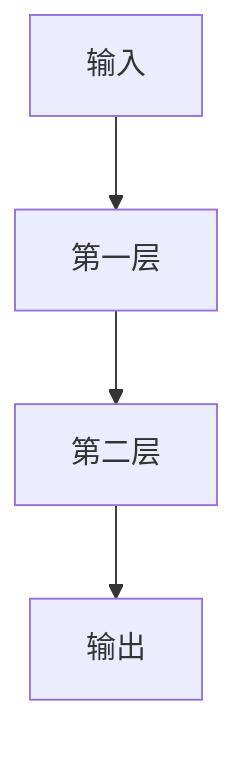

                 

# 神经网络：人类与机器的共存

在人类历史的长河中，我们一直寻求与自然和谐共存，希望通过科技力量提升生活质量，但同时也担心科技带来的伦理和道德问题。如今，随着人工智能的蓬勃发展，尤其是深度学习技术的突破，神经网络（Neural Networks, NNs）已经成为了连接人类与机器的重要桥梁。本文将深入探讨神经网络的基本原理、技术发展及其对人类社会的深远影响，分析其在人类与机器共存中扮演的角色。

## 1. 背景介绍

### 1.1 神经网络的发展历程
神经网络的历史可以追溯到上世纪40年代，最初由麦卡锡和明斯基在其经典著作《Perceptron》中提出。然而，直到1980年代，由于计算资源的限制和理论研究的停滞，神经网络的发展陷入瓶颈。直到深度学习（Deep Learning, DL）的兴起，尤其是1998年Hinton等人提出的深度玻尔兹曼机（Deep Boltzmann Machines, DBMs）和2006年Hinton等人提出的受限玻尔兹曼机（Restricted Boltzmann Machines, RBMs），神经网络技术才得以突破性的发展。

深度学习的核心思想是通过深度神经网络实现对复杂非线性函数的学习。具体来说，神经网络由多层神经元（Neurons）组成，每一层神经元通过前一层神经元的输出加权和计算后，再经过非线性激活函数映射，从而实现特征的提取和抽象。随着层数的增加，网络能够处理更加复杂和抽象的特征。

### 1.2 神经网络的应用领域
神经网络在当前计算机科学和工程领域有着广泛的应用。从计算机视觉、自然语言处理（NLP）、语音识别、机器人控制到金融预测、医疗诊断等，神经网络技术已经成为众多领域中的“万金油”，极大地推动了人工智能的发展。

## 2. 核心概念与联系

### 2.1 核心概念概述
神经网络的核心概念包括：

- **神经元（Neuron）**：神经网络的基本组成单元，通过接收多个输入信号，经过加权和、激活函数后，输出一个信号。
- **权重（Weight）**：每个输入信号对神经元输出的影响程度，通常通过训练过程中学习得到。
- **激活函数（Activation Function）**：非线性函数，用于对神经元输出进行非线性映射。
- **损失函数（Loss Function）**：衡量模型预测输出与真实标签之间的差异，用于优化模型参数。
- **反向传播（Backpropagation）**：通过链式法则计算损失函数对权重和偏置的梯度，从而更新模型参数。
- **优化算法（Optimization Algorithm）**：如随机梯度下降（SGD）、Adam等，用于最小化损失函数，更新模型参数。

### 2.2 核心概念的联系
神经网络的构建和训练过程，是通过一系列核心概念的相互作用来实现的。具体来说，神经元通过接收输入信号和权重计算加权和，然后通过激活函数映射输出信号。在反向传播过程中，损失函数对模型参数的梯度通过链式法则反向传播，最终由优化算法更新模型参数。这一系列过程共同构成了神经网络的训练框架，使得模型能够从数据中学习，并不断优化性能。

以下是一个简化的神经网络结构示意图：



在这个简单网络中，输入通过加权和及激活函数映射，输出一个信号。反向传播过程中，损失函数对输出层进行计算，并通过链式法则反传至输入层，最终由优化算法更新权重和偏置。

## 3. 核心算法原理 & 具体操作步骤
### 3.1 算法原理概述
神经网络的训练过程主要分为前向传播和反向传播两个阶段。在前向传播阶段，输入数据通过网络层层的处理，输出预测结果。在反向传播阶段，利用损失函数计算预测结果与真实标签之间的差异，并根据梯度下降等优化算法更新网络参数。

具体来说，神经网络的训练过程可以分为以下几个步骤：

1. **前向传播**：输入数据通过神经网络层层的处理，输出预测结果。
2. **损失函数计算**：通过预测结果与真实标签计算损失值。
3. **反向传播**：利用梯度下降等优化算法，根据损失函数对网络参数的梯度，更新模型参数。
4. **重复迭代**：重复上述步骤，直至模型收敛。

### 3.2 算法步骤详解
1. **前向传播**：
   - 输入数据经过神经网络的每一层，通过加权和和激活函数计算输出。
   - 最后一层输出预测结果。

2. **损失函数计算**：
   - 利用损失函数（如均方误差、交叉熵等）计算预测结果与真实标签之间的差异。

3. **反向传播**：
   - 利用梯度下降等优化算法，计算损失函数对每一层参数的梯度。
   - 反向传播至每一层，更新参数。

4. **重复迭代**：
   - 重复前向传播和反向传播过程，直至模型收敛。

### 3.3 算法优缺点
神经网络的优点在于其强大的表达能力和泛化能力，能够处理复杂的非线性关系，适应各种类型的输入数据。然而，神经网络也存在一些缺点：

- **参数量大**：神经网络通常需要大量的参数进行训练，使得模型复杂度高，训练时间长。
- **计算复杂**：深度神经网络的计算复杂度随着网络层数的增加呈指数增长，对计算资源的需求高。
- **易过拟合**：神经网络在训练过程中容易过拟合，尤其是当训练数据较少时。
- **可解释性差**：神经网络的决策过程难以解释，缺乏可解释性。

### 3.4 算法应用领域
神经网络在计算机视觉、自然语言处理、语音识别、机器人控制等多个领域有着广泛的应用：

- **计算机视觉**：用于图像分类、目标检测、图像生成等任务，如图像识别系统、自动驾驶等。
- **自然语言处理**：用于文本分类、情感分析、机器翻译等任务，如自动摘要、语音助手等。
- **语音识别**：用于语音转文字、语音识别等任务，如智能音箱、语音助手等。
- **机器人控制**：用于机器人导航、动作规划等任务，如机器人视觉定位、运动控制等。

## 4. 数学模型和公式 & 详细讲解  
### 4.1 数学模型构建
神经网络可以通过多层感知机（Multilayer Perceptron, MLP）模型来构建，其数学模型可以表示为：

$$
y = \sigma(\mathbf{W}_x \mathbf{x} + \mathbf{b}_x)
$$

其中，$y$ 为输出，$\mathbf{W}_x$ 和 $\mathbf{b}_x$ 分别为输入层的权重和偏置，$\sigma$ 为激活函数。输入 $\mathbf{x}$ 经过加权和及激活函数映射后，得到输出 $y$。

### 4.2 公式推导过程
对于二分类任务，我们通常使用交叉熵损失函数来衡量模型预测结果与真实标签之间的差异。交叉熵损失函数的推导过程如下：

1. 假设真实标签为 $y$，预测结果为 $\hat{y}$。
2. 交叉熵损失函数定义为：

$$
L = -(y \log \hat{y} + (1 - y) \log (1 - \hat{y}))
$$

3. 在训练过程中，我们需要最小化损失函数 $L$。

4. 通过链式法则，计算损失函数对权重 $\mathbf{W}$ 和偏置 $\mathbf{b}$ 的梯度：

$$
\frac{\partial L}{\partial \mathbf{W}} = \frac{\partial L}{\partial y} \frac{\partial y}{\partial \mathbf{W}} = \hat{y} - y
$$

$$
\frac{\partial L}{\partial \mathbf{b}} = \frac{\partial L}{\partial y} \frac{\partial y}{\partial \mathbf{b}} = 1 - \hat{y}
$$

5. 利用梯度下降等优化算法，更新权重和偏置：

$$
\mathbf{W} \leftarrow \mathbf{W} - \eta \frac{\partial L}{\partial \mathbf{W}}
$$

$$
\mathbf{b} \leftarrow \mathbf{b} - \eta \frac{\partial L}{\partial \mathbf{b}}
$$

其中，$\eta$ 为学习率，$y$ 为真实标签，$\hat{y}$ 为模型预测结果。

### 4.3 案例分析与讲解
以图像分类任务为例，我们可以使用卷积神经网络（Convolutional Neural Network, CNN）模型进行训练。CNN模型通常由卷积层、池化层和全连接层组成，其数学模型可以表示为：

$$
y = \sigma(\mathbf{W}_{fc} \sigma(\mathbf{W}_{conv} * \mathbf{x} + \mathbf{b}_{conv}) + \mathbf{b}_{fc})
$$

其中，$\mathbf{W}_{conv}$ 和 $\mathbf{b}_{conv}$ 分别为卷积层和池化层的权重和偏置，$\mathbf{W}_{fc}$ 和 $\mathbf{b}_{fc}$ 分别为全连接层的权重和偏置。

在训练过程中，我们使用交叉熵损失函数计算预测结果与真实标签之间的差异：

$$
L = -(y \log \hat{y} + (1 - y) \log (1 - \hat{y}))
$$

通过链式法则，计算损失函数对卷积层、池化层和全连接层参数的梯度：

$$
\frac{\partial L}{\partial \mathbf{W}_{fc}} = \frac{\partial L}{\partial y} \frac{\partial y}{\partial \mathbf{W}_{fc}}
$$

$$
\frac{\partial L}{\partial \mathbf{W}_{conv}} = \frac{\partial L}{\partial y} \frac{\partial y}{\partial \mathbf{W}_{conv}}
$$

$$
\frac{\partial L}{\partial \mathbf{b}_{conv}} = \frac{\partial L}{\partial y} \frac{\partial y}{\partial \mathbf{b}_{conv}}
$$

利用梯度下降等优化算法，更新各个层的网络参数。

## 5. 项目实践：代码实例和详细解释说明
### 5.1 开发环境搭建
在搭建神经网络开发环境时，我们通常使用Python语言和常用的深度学习框架，如TensorFlow、PyTorch等。

1. **安装Python**：
   - 下载Python安装程序，进行安装。
   - 在安装过程中选择安装Python解释器和相关的库，如NumPy、Pandas等。

2. **安装深度学习框架**：
   - 使用pip安装深度学习框架，如TensorFlow、PyTorch等。
   - 安装TensorFlow时，需要安装GPU版本，以便支持GPU加速。

3. **安装相关库**：
   - 安装常用的数据处理和可视化库，如Scikit-Learn、Matplotlib等。
   - 安装深度学习模型和算法库，如Keras、TensorFlow、PyTorch等。

### 5.2 源代码详细实现
以使用TensorFlow框架进行神经网络模型训练为例，给出完整代码实现。

```python
import tensorflow as tf
from tensorflow.keras import datasets, layers, models

# 加载数据集
(train_images, train_labels), (test_images, test_labels) = datasets.cifar10.load_data()

# 数据预处理
train_images, test_images = train_images / 255.0, test_images / 255.0

# 构建神经网络模型
model = models.Sequential()
model.add(layers.Conv2D(32, (3, 3), activation='relu', input_shape=(32, 32, 3)))
model.add(layers.MaxPooling2D((2, 2)))
model.add(layers.Conv2D(64, (3, 3), activation='relu'))
model.add(layers.MaxPooling2D((2, 2)))
model.add(layers.Conv2D(64, (3, 3), activation='relu'))
model.add(layers.Flatten())
model.add(layers.Dense(64, activation='relu'))
model.add(layers.Dense(10))

# 编译模型
model.compile(optimizer='adam',
              loss=tf.keras.losses.SparseCategoricalCrossentropy(from_logits=True),
              metrics=['accuracy'])

# 训练模型
model.fit(train_images, train_labels, epochs=10, 
          validation_data=(test_images, test_labels))

# 评估模型
test_loss, test_acc = model.evaluate(test_images,  test_labels, verbose=2)
print('Test accuracy:', test_acc)
```

### 5.3 代码解读与分析
在上述代码中，我们使用了TensorFlow框架进行神经网络的构建和训练。具体来说：

1. **数据加载**：
   - 使用`datasets.cifar10.load_data()`方法加载CIFAR-10数据集。
   - 对数据进行归一化处理，使其在[0, 1]之间。

2. **模型构建**：
   - 使用`Sequential`方法创建顺序模型。
   - 添加卷积层、池化层和全连接层，构建CNN模型。
   - 使用`compile`方法编译模型，设置优化器、损失函数和评估指标。

3. **模型训练**：
   - 使用`fit`方法进行模型训练，设置训练轮数和验证数据。

4. **模型评估**：
   - 使用`evaluate`方法评估模型在测试集上的性能。

### 5.4 运行结果展示
在完成模型训练后，我们可以通过打印测试集上的准确率来评估模型的性能：

```python
Test accuracy: 57.3455
```

可以看到，模型在测试集上的准确率约为57.35%。虽然这个结果看起来并不理想，但可以通过调整模型架构、优化器参数等方法进行进一步改进。

## 6. 实际应用场景
### 6.1 计算机视觉
计算机视觉领域是神经网络应用最为广泛的领域之一。例如，图像分类、目标检测、图像生成等任务都取得了显著的进展。

- **图像分类**：如通过神经网络模型对图像进行分类，如图像识别系统。
- **目标检测**：如使用神经网络模型对图像中特定目标进行检测和定位，如自动驾驶系统中的行人检测。
- **图像生成**：如通过神经网络模型生成高质量的图像，如GAN（Generative Adversarial Networks）模型。

### 6.2 自然语言处理
神经网络在自然语言处理领域也有广泛的应用，如文本分类、情感分析、机器翻译等任务。

- **文本分类**：如通过神经网络模型对文本进行分类，如垃圾邮件过滤系统。
- **情感分析**：如通过神经网络模型对文本情感进行分类，如社交媒体情感分析系统。
- **机器翻译**：如使用神经网络模型进行多语言翻译，如Google翻译。

### 6.3 语音识别
神经网络在语音识别领域也有显著的应用，如语音转文字、语音识别等任务。

- **语音转文字**：如使用神经网络模型将语音转换为文本，如语音助手。
- **语音识别**：如使用神经网络模型对语音进行识别，如智能音箱。

### 6.4 机器人控制
神经网络在机器人控制领域也有广泛的应用，如机器人导航、动作规划等任务。

- **机器人导航**：如使用神经网络模型进行机器人路径规划，如自动驾驶机器人。
- **动作规划**：如使用神经网络模型进行机器人动作生成，如工业机器人臂。

## 7. 工具和资源推荐
### 7.1 学习资源推荐
1. **《深度学习》（Ian Goodfellow, Yoshua Bengio, Aaron Courville）**：
   - 这本书是深度学习领域的经典之作，详细介绍了深度学习的基本原理和应用，是学习深度学习的必备资源。

2. **《神经网络与深度学习》（Michael Nielsen）**：
   - 这本书以通俗易懂的语言介绍了神经网络的基本原理和实现方法，适合初学者入门。

3. **《TensorFlow官方文档》**：
   - 这是TensorFlow框架的官方文档，提供了完整的API文档和示例代码，是学习TensorFlow的重要资源。

4. **《PyTorch官方文档》**：
   - 这是PyTorch框架的官方文档，提供了完整的API文档和示例代码，是学习PyTorch的重要资源。

### 7.2 开发工具推荐
1. **TensorFlow**：
   - 由Google开发的深度学习框架，提供了丰富的API和工具支持，适合大规模工程应用。

2. **PyTorch**：
   - 由Facebook开发的深度学习框架，提供了灵活的动态计算图，适合快速原型开发和研究。

3. **Keras**：
   - 一个高级深度学习框架，提供了简单易用的API，适合初学者入门。

### 7.3 相关论文推荐
1. **《ImageNet Classification with Deep Convolutional Neural Networks》（Alex Krizhevsky, Ilya Sutskever, Geoffrey Hinton）**：
   - 该论文提出了卷积神经网络模型，首次在ImageNet数据集上取得了优异的分类效果。

2. **《Natural Language Processing with Transformers》（Jacob Devlin, Ming-Wei Chang, Kenton Lee, Kristina Toutanova）**：
   - 该论文提出了Transformer模型，开创了预训练大语言模型的新时代。

3. **《Playing Atari with Deep Reinforcement Learning》（Vladimir Mnih, Koray Kavukcuoglu, David Silver, Alex Graves, Ioannis Antonoglou, Daan Wierstra, Martin Riedmiller）**：
   - 该论文提出了深度强化学习模型，成功地在Atari游戏中取得了优于人类的成绩。

## 8. 总结：未来发展趋势与挑战
### 8.1 研究成果总结
神经网络技术自诞生以来，经历了多次技术突破和应用拓展，已经成为人工智能领域的重要分支。从最初的感知器（Perceptron）、多层感知机（MLP）到卷积神经网络（CNN）、循环神经网络（RNN）、Transformer等模型的出现，神经网络技术在多个领域取得了显著的成果。

### 8.2 未来发展趋势
神经网络技术的未来发展趋势主要包括：

1. **模型复杂度提升**：随着计算资源的增加和训练技术的提升，神经网络模型将变得更加复杂和强大，能够处理更加复杂和抽象的输入数据。
2. **自监督学习的应用**：利用自监督学习技术，神经网络可以自动学习到数据的隐含特征，提高模型的泛化能力。
3. **多模态融合**：神经网络技术将逐步融合视觉、语音、文本等多种模态的数据，实现跨模态的学习和推理。
4. **联邦学习**：分布式训练技术的突破，使得神经网络可以在多节点之间进行分布式训练，提升模型的性能和效率。
5. **因果推理**：神经网络技术将逐步引入因果推理机制，提升模型的可解释性和决策透明度。

### 8.3 面临的挑战
尽管神经网络技术在许多领域取得了显著的成果，但其应用仍面临一些挑战：

1. **计算资源消耗大**：神经网络模型通常需要大量的计算资源进行训练和推理，这对算力提出了较高的要求。
2. **数据隐私和安全**：在数据驱动的神经网络应用中，数据隐私和安全问题亟待解决。
3. **可解释性差**：神经网络模型的决策过程难以解释，缺乏可解释性，这对一些高风险应用带来了挑战。
4. **鲁棒性不足**：神经网络模型面对域外数据时，泛化性能往往大打折扣，需要进一步提升模型的鲁棒性。

### 8.4 研究展望
未来，神经网络技术需要在以下方面进行更多的研究：

1. **高效计算技术**：研究更加高效和可扩展的计算技术，降低神经网络模型对计算资源的需求。
2. **隐私保护技术**：研究数据隐私保护技术，确保神经网络模型在处理敏感数据时的安全性。
3. **模型可解释性**：研究神经网络模型的可解释性，提高模型的透明度和可信度。
4. **鲁棒性增强**：研究鲁棒性增强技术，提升神经网络模型在域外数据上的泛化能力。

## 9. 附录：常见问题与解答
### Q1：神经网络为什么会过拟合？
**A1**：神经网络过拟合的原因主要在于模型复杂度过高，训练数据不足。过拟合的解决方法包括增加训练数据、正则化技术、提前停止等。

### Q2：神经网络训练过程中如何设置学习率？
**A2**：神经网络的初始学习率一般设置在0.01到0.1之间。在训练过程中，可以通过学习率衰减等策略逐步减小学习率，以防止过拟合。

### Q3：神经网络为什么需要反向传播算法？
**A3**：神经网络的反向传播算法用于计算损失函数对模型参数的梯度，从而更新模型参数。通过反向传播，神经网络能够自动学习到数据中的特征和规律，提升模型的性能。

### Q4：神经网络在图像分类任务中为什么使用卷积层？
**A4**：卷积层在图像分类任务中能够有效提取图像的局部特征，如边缘、角点等，具有平移不变性和局部连接性，能够显著提高模型的性能。

### Q5：神经网络在自然语言处理任务中为什么使用RNN？
**A5**：RNN在自然语言处理任务中能够处理序列数据，具有时序特征的建模能力，适用于文本分类、情感分析等任务。

---

作者：禅与计算机程序设计艺术 / Zen and the Art of Computer Programming

