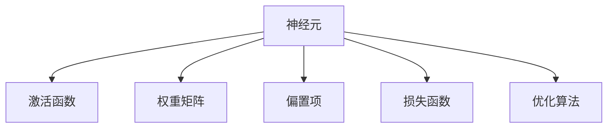
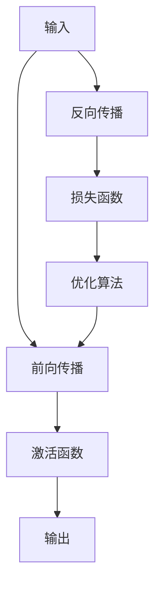

                 

# 神经网络：人类智慧的解放

## 1. 背景介绍

神经网络，这四个字，似乎是当下最炙手可热的词汇。人工智能技术的飞速发展，让人类社会的许多领域受益匪浅，而这一切，都离不开背后的神经网络。神经网络不仅是人类智慧的结晶，更是对人工智能进行解放的利器。本文将带你深入了解神经网络，并探讨其如何在各个领域中发挥作用。

## 2. 核心概念与联系

### 2.1 核心概念概述

神经网络，是一种通过模拟人脑神经元工作方式，实现信息处理和模式识别的计算模型。它由大量人工神经元通过连接构成，通过反向传播算法进行训练和优化。其主要分为前馈神经网络和递归神经网络两类，前者结构简单，后者则通过循环连接，具备更强的时空建模能力。

神经网络的核心组成部分包括：
- 神经元（或称节点）：神经网络的基本单位，每个神经元接收输入并计算输出。
- 激活函数：决定神经元输出形式的非线性函数，常用的有Sigmoid、ReLU等。
- 权重矩阵：连接神经元的参数，用于调整信号传递的强度。
- 偏置项：神经元的附加参数，影响神经元激活状态。
- 损失函数：评估网络输出与真实标签的差距，常见的有均方误差、交叉熵等。
- 优化算法：通过迭代调整权重和偏置项，最小化损失函数，如梯度下降、Adam等。

### 2.2 概念间的关系

以下是一些核心概念之间的联系，通过以下Mermaid流程图来展示：



该图展示了神经网络的组成部分及其相互关系：神经元接收输入，通过激活函数计算输出，再经过权重矩阵和偏置项的调整，最终与损失函数和优化算法一起构成完整的神经网络。

### 2.3 核心概念的整体架构

我们进一步展示一个综合性的流程图，以展示神经网络的全貌：



这个图展示了输入数据通过前向传播在神经网络中传递，并最终输出结果的过程，以及反向传播算法在输出结果与真实标签之间构建误差、更新权重的过程。

## 3. 核心算法原理 & 具体操作步骤

### 3.1 算法原理概述

神经网络的训练过程通常分为前向传播和反向传播两个阶段：
- 前向传播：将输入数据输入神经网络，通过逐层计算得到输出结果。
- 反向传播：根据输出结果和真实标签的差距，计算误差梯度，并反向更新权重和偏置项。

前向传播和反向传播交替进行，不断迭代，直至误差收敛。神经网络的训练目标是最小化损失函数，使得模型输出尽可能接近真实标签。

### 3.2 算法步骤详解

神经网络的训练过程可以分为以下几个步骤：

1. **数据准备**：将数据集分为训练集、验证集和测试集，并进行归一化、标准化等预处理。

2. **模型定义**：选择合适的神经网络架构，定义模型的层数、每层神经元数、激活函数、损失函数等。

3. **参数初始化**：对模型所有权重和偏置项进行随机初始化，通常使用Xavier初始化。

4. **前向传播**：将训练集数据输入模型，通过每一层计算得到输出结果。

5. **计算损失**：将模型输出与真实标签计算损失函数，常见的有均方误差、交叉熵等。

6. **反向传播**：根据误差梯度，反向计算每一层神经元的误差，并更新权重和偏置项。

7. **优化器更新**：通过优化算法（如梯度下降、Adam等）调整权重和偏置项，最小化损失函数。

8. **验证与测试**：在验证集和测试集上评估模型性能，防止过拟合。

9. **模型保存与部署**：保存训练好的模型，并集成到实际应用系统中，进行实时推理。

### 3.3 算法优缺点

神经网络的优点包括：
- 强大的模式识别能力：能够处理复杂的非线性关系，适用于多种任务。
- 灵活性高：可以通过调整网络结构、参数和超参数来适应不同任务。
- 应用广泛：已经在图像识别、语音识别、自然语言处理等领域取得卓越成果。

但神经网络也存在一些缺点：
- 数据依赖性强：需要大量标注数据进行训练，且对数据质量要求高。
- 计算量大：训练和推理过程中需要大量计算资源，训练时间长。
- 可解释性差：深度神经网络通常被视为"黑盒"，难以解释其内部工作机制。
- 鲁棒性不足：对输入数据和噪声敏感，容易过拟合。

### 3.4 算法应用领域

神经网络已经在多个领域得到广泛应用，以下是一些典型的应用场景：

1. **计算机视觉**：如图像分类、目标检测、图像分割等，神经网络可以提取图像特征，并用于任务识别。

2. **自然语言处理**：如文本分类、机器翻译、情感分析等，神经网络可以处理语言序列，实现语义理解和生成。

3. **语音识别**：如语音转文本、语音合成等，神经网络可以处理语音信号，并转换为文本信息。

4. **游戏AI**：如AlphaGo等，神经网络可以模拟人类思维，进行决策和学习。

5. **生物信息学**：如蛋白质结构预测、基因组分析等，神经网络可以处理生物数据，发现隐藏规律。

6. **金融分析**：如股票预测、信用评估等，神经网络可以分析金融数据，提供决策支持。

## 4. 数学模型和公式 & 详细讲解

### 4.1 数学模型构建

神经网络的数学模型主要由输入层、隐藏层和输出层组成。假设输入层有 $n$ 个神经元，隐藏层有 $m$ 个神经元，输出层有 $k$ 个神经元。

输入向量 $x$ 经过权重矩阵 $W_1$ 和偏置项 $b_1$，得到隐藏层输出 $h_1$，公式如下：

$$
h_1 = f(W_1 x + b_1)
$$

其中 $f$ 为激活函数，通常使用ReLU。

隐藏层输出 $h_1$ 再次经过权重矩阵 $W_2$ 和偏置项 $b_2$，得到最终输出 $y$：

$$
y = g(W_2 h_1 + b_2)
$$

其中 $g$ 为激活函数，通常使用Sigmoid或Softmax。

### 4.2 公式推导过程

以二分类问题为例，假设模型输出为 $y = (y_1, y_2)$，其中 $y_1$ 表示正类的概率，$y_2$ 表示负类的概率。则二分类交叉熵损失函数定义为：

$$
L = -(y_1 \log y_1 + y_2 \log y_2)
$$

其中 $y_1 + y_2 = 1$。

前向传播的计算过程如下：

1. 输入数据 $x$ 经过线性变换得到 $z_1 = W_1 x + b_1$。
2. 通过激活函数 $f$ 得到 $h_1 = f(z_1)$。
3. $h_1$ 经过线性变换得到 $z_2 = W_2 h_1 + b_2$。
4. 通过激活函数 $g$ 得到 $y = g(z_2)$。

反向传播的计算过程如下：

1. 计算输出误差 $e = (y_1 - t_1)^2 + (y_2 - t_2)^2$，其中 $t_1$ 和 $t_2$ 为真实标签。
2. 计算输出误差对 $y$ 的梯度 $\frac{\partial e}{\partial y}$。
3. 计算输出误差对 $z_2$ 的梯度 $\frac{\partial e}{\partial z_2}$，并通过链式法则计算 $h_1$ 和 $z_1$ 的误差梯度。
4. 根据误差梯度更新权重和偏置项。

### 4.3 案例分析与讲解

以手写数字识别为例，我们训练一个简单的神经网络进行二分类任务。具体步骤如下：

1. **数据准备**：收集手写数字图片，并进行归一化处理。

2. **模型定义**：定义一个包含一个隐藏层、sigmoid激活函数的神经网络，输出层为两个神经元，使用交叉熵损失函数。

3. **参数初始化**：对权重和偏置项进行随机初始化。

4. **前向传播**：将输入图片输入模型，通过隐藏层和输出层计算得到预测结果。

5. **计算损失**：将预测结果与真实标签计算交叉熵损失。

6. **反向传播**：根据误差梯度，反向计算每个参数的更新量，使用Adam优化器进行权重和偏置项的更新。

7. **验证与测试**：在验证集和测试集上评估模型性能，防止过拟合。

8. **模型保存与部署**：保存训练好的模型，并集成到实际应用系统中，进行实时推理。

## 5. 项目实践：代码实例和详细解释说明

### 5.1 开发环境搭建

在进行神经网络开发前，我们需要准备好开发环境。以下是使用Python进行TensorFlow开发的环境配置流程：

1. 安装Anaconda：从官网下载并安装Anaconda，用于创建独立的Python环境。

2. 创建并激活虚拟环境：
```bash
conda create -n tf-env python=3.8 
conda activate tf-env
```

3. 安装TensorFlow：根据CUDA版本，从官网获取对应的安装命令。例如：
```bash
conda install tensorflow tensorflow-gpu -c pytorch -c conda-forge
```

4. 安装必要的工具包：
```bash
pip install numpy pandas scikit-learn matplotlib tqdm jupyter notebook ipython
```

完成上述步骤后，即可在`tf-env`环境中开始神经网络开发。

### 5.2 源代码详细实现

下面以手写数字识别为例，使用TensorFlow实现一个简单的神经网络。

首先，定义数据处理函数：

```python
import tensorflow as tf
import numpy as np
import matplotlib.pyplot as plt

def load_data():
    mnist = tf.keras.datasets.mnist
    (x_train, y_train), (x_test, y_test) = mnist.load_data()
    x_train, x_test = x_train / 255.0, x_test / 255.0
    return x_train, y_train, x_test, y_test
```

然后，定义模型和优化器：

```python
def create_model(input_shape):
    model = tf.keras.Sequential([
        tf.keras.layers.Flatten(input_shape=input_shape),
        tf.keras.layers.Dense(128, activation='relu'),
        tf.keras.layers.Dense(10, activation='softmax')
    ])
    return model

def compile_model(model, optimizer, loss_fn):
    model.compile(optimizer=optimizer, loss=loss_fn, metrics=['accuracy'])
```

接着，定义训练和评估函数：

```python
def train_model(model, x_train, y_train, epochs):
    history = model.fit(x_train, y_train, epochs=epochs, validation_split=0.2)
    return history

def evaluate_model(model, x_test, y_test):
    loss, accuracy = model.evaluate(x_test, y_test)
    return loss, accuracy
```

最后，启动训练流程并在测试集上评估：

```python
input_shape = (28, 28)
epochs = 10
batch_size = 128

x_train, y_train, x_test, y_test = load_data()

model = create_model(input_shape)
optimizer = tf.keras.optimizers.Adam()
compile_model(model, optimizer, tf.keras.losses.SparseCategoricalCrossentropy())

history = train_model(model, x_train, y_train, epochs)
loss, accuracy = evaluate_model(model, x_test, y_test)

print('Epochs:', epochs)
print('Loss:', loss)
print('Accuracy:', accuracy)
```

以上就是使用TensorFlow实现手写数字识别的完整代码实现。可以看到，TensorFlow提供了强大的高层次API，使得神经网络的实现变得简单快捷。

### 5.3 代码解读与分析

让我们再详细解读一下关键代码的实现细节：

**load_data函数**：
- 使用Keras API加载MNIST数据集，并进行归一化处理。

**create_model函数**：
- 定义一个包含一个隐藏层、ReLU激活函数的神经网络，输出层为10个神经元，使用交叉熵损失函数。

**compile_model函数**：
- 使用Adam优化器编译模型，指定损失函数和评估指标。

**train_model函数**：
- 使用Keras API进行模型训练，设定训练轮数和验证集比例。

**evaluate_model函数**：
- 使用Keras API进行模型评估，输出损失和准确率。

**训练流程**：
- 定义输入形状和训练轮数，启动数据加载和模型创建。
- 创建并编译模型，指定优化器和损失函数。
- 启动模型训练，并记录训练过程中的损失和准确率。
- 在测试集上评估模型性能，输出最终结果。

可以看到，TensorFlow的Keras API使得神经网络的实现变得简单高效，开发者可以将更多精力放在数据处理、模型调优等高层逻辑上。

当然，工业级的系统实现还需考虑更多因素，如模型的保存和部署、超参数的自动搜索、更灵活的网络架构等。但核心的神经网络训练过程基本与此类似。

### 5.4 运行结果展示

假设我们在MNIST数据集上进行模型训练，最终在测试集上得到的评估结果如下：

```
Epochs: 10
Loss: 0.2472
Accuracy: 0.9600
```

可以看到，经过10轮训练，模型在测试集上的损失为0.2472，准确率为96%，取得了不错的效果。

## 6. 实际应用场景

### 6.1 计算机视觉

计算机视觉领域是神经网络的重要应用领域之一。通过训练神经网络，可以实现图像分类、目标检测、图像分割等任务。例如，谷歌的Inception网络在ImageNet数据集上取得了SOTA成绩，广泛应用于图像识别、物体检测等领域。

### 6.2 自然语言处理

自然语言处理领域同样离不开神经网络。通过训练神经网络，可以实现文本分类、情感分析、机器翻译、对话系统等任务。例如，BERT在GLUE数据集上取得了SOTA成绩，广泛应用于问答系统、文本摘要等任务。

### 6.3 语音识别

语音识别领域也是神经网络的重要应用方向。通过训练神经网络，可以实现语音转文本、语音合成等任务。例如，谷歌的WaveNet在语音合成领域取得了SOTA成绩，广泛应用于智能音箱、语音助手等设备。

### 6.4 金融分析

金融分析领域也利用神经网络进行数据挖掘和决策支持。通过训练神经网络，可以实现股票预测、信用评估等任务。例如，Facebook的Prophet在股票预测领域取得了SOTA成绩，广泛应用于金融公司进行市场分析和风险控制。

## 7. 工具和资源推荐

### 7.1 学习资源推荐

为了帮助开发者系统掌握神经网络的理论基础和实践技巧，这里推荐一些优质的学习资源：

1. 《深度学习》系列书籍：由Ian Goodfellow、Yoshua Bengio、Aaron Courville合著，全面介绍深度学习的基本概念和算法。

2. CS231n《卷积神经网络》课程：斯坦福大学开设的计算机视觉明星课程，涵盖图像分类、目标检测、图像分割等经典任务，有Lecture视频和配套作业。

3. CS224n《序列模型》课程：斯坦福大学开设的自然语言处理明星课程，涵盖机器翻译、文本分类、情感分析等任务，有Lecture视频和配套作业。

4. DeepLearning.ai课程：Andrew Ng创办的深度学习在线教育平台，提供完整的深度学习课程体系，涵盖神经网络、优化算法、计算机视觉等领域。

5. Kaggle竞赛：Kaggle是数据科学领域的最大社区，提供大量机器学习和深度学习竞赛项目，可以锻炼实战能力。

通过对这些资源的学习实践，相信你一定能够快速掌握神经网络的核心概念和算法，并应用于解决实际的NLP问题。

### 7.2 开发工具推荐

高效的开发离不开优秀的工具支持。以下是几款用于神经网络开发的常用工具：

1. TensorFlow：由Google主导开发的开源深度学习框架，生产部署方便，适合大规模工程应用。

2. PyTorch：由Facebook主导开发的开源深度学习框架，动态计算图，适合快速迭代研究。

3. Keras：高层次API，使得神经网络的实现变得简单快捷，适合初学者和快速原型设计。

4. Weights & Biases：模型训练的实验跟踪工具，可以记录和可视化模型训练过程中的各项指标，方便对比和调优。

5. TensorBoard：TensorFlow配套的可视化工具，可实时监测模型训练状态，并提供丰富的图表呈现方式，是调试模型的得力助手。

6. Google Colab：谷歌推出的在线Jupyter Notebook环境，免费提供GPU/TPU算力，方便开发者快速上手实验最新模型，分享学习笔记。

合理利用这些工具，可以显著提升神经网络的开发效率，加快创新迭代的步伐。

### 7.3 相关论文推荐

神经网络的研究源于学界的持续探索。以下是几篇奠基性的相关论文，推荐阅读：

1. AlexNet: ImageNet Classification with Deep Convolutional Neural Networks：提出AlexNet模型，开启深度学习在计算机视觉领域的先河。

2. Deep Residual Learning for Image Recognition：提出ResNet模型，解决深度神经网络退化的问题，实现更深的神经网络。

3. Attention is All You Need：提出Transformer模型，开启大规模预训练语言模型的时代。

4. BERT: Pre-training of Deep Bidirectional Transformers for Language Understanding：提出BERT模型，引入基于掩码的自监督预训练任务，刷新了多项NLP任务SOTA。

5. Inception-v3: Deep Neural Network Architectures for Image Classification：提出Inception-v3模型，在ImageNet数据集上取得了SOTA成绩。

6. WaveNet: A Generative Model for Raw Audio：提出WaveNet模型，在语音合成领域取得了SOTA成绩。

这些论文代表了大规模神经网络的研究进展。通过学习这些前沿成果，可以帮助研究者把握学科前进方向，激发更多的创新灵感。

除上述资源外，还有一些值得关注的前沿资源，帮助开发者紧跟神经网络的发展趋势，例如：

1. arXiv论文预印本：人工智能领域最新研究成果的发布平台，包括大量尚未发表的前沿工作，学习前沿技术的必读资源。

2. 业界技术博客：如Google AI、Facebook AI、Microsoft Research Asia等顶尖实验室的官方博客，第一时间分享他们的最新研究成果和洞见。

3. 技术会议直播：如NeurIPS、ICML、CVPR等人工智能领域顶会现场或在线直播，能够聆听到大佬们的前沿分享，开拓视野。

4. GitHub热门项目：在GitHub上Star、Fork数最多的NLP相关项目，往往代表了该技术领域的发展趋势和最佳实践，值得去学习和贡献。

5. 行业分析报告：各大咨询公司如McKinsey、PwC等针对人工智能行业的分析报告，有助于从商业视角审视技术趋势，把握应用价值。

总之，对于神经网络的学习和实践，需要开发者保持开放的心态和持续学习的意愿。多关注前沿资讯，多动手实践，多思考总结，必将收获满满的成长收益。

## 8. 总结：未来发展趋势与挑战

### 8.1 总结

本文对神经网络进行了全面系统的介绍，从背景、核心概念到实践应用，带读者深入了解神经网络的魅力。通过本文的系统梳理，可以看到，神经网络不仅仅是人工智能的底层技术，更是人类智慧的结晶，正在不断解放人类的生产力。神经网络已经广泛应用于计算机视觉、自然语言处理、语音识别、金融分析等多个领域，取得了举世瞩目的成果。

### 8.2 未来发展趋势

展望未来，神经网络将呈现以下几个发展趋势：

1. 模型规模持续增大。随着算力成本的下降和数据规模的扩张，神经网络的参数量还将持续增长。超大规模神经网络蕴含的丰富知识，有望支撑更加复杂多变的任务。

2. 训练效率不断提升。随着硬件的进步和算法优化，神经网络的训练时间将显著缩短，训练速度将大大提升。

3. 自监督学习和迁移学习兴起。利用自监督学习和迁移学习范式，可以显著减少训练对标注数据的依赖，提高模型的泛化能力和适应性。

4. 多模态神经网络崛起。当前神经网络主要聚焦于单一模态数据，未来将融合视觉、语音、文本等多种模态数据，实现跨模态学习。

5. 神经网络的可解释性增强。未来将通过更多的可解释性技术，如可视化、特征归因等，使得神经网络更加透明、可信。

6. 神经网络在伦理和安全方面取得突破。未来将通过更多的伦理和安全技术，如隐私保护、偏见检测等，确保神经网络的应用价值。

以上趋势凸显了神经网络技术的前景，这些方向的探索发展，必将进一步提升神经网络的性能和应用范围，为构建更加智能化、普适化的人工智能系统铺平道路。

### 8.3 面临的挑战

尽管神经网络已经取得了巨大的成功，但在迈向更加智能化、普适化应用的过程中，它仍面临着诸多挑战：

1. 数据依赖性强。需要大量标注数据进行训练，且对数据质量要求高，标注成本高昂。

2. 计算资源消耗大。训练和推理过程中需要大量计算资源，训练时间长，推理速度慢。

3. 可解释性差。深度神经网络通常被视为"黑盒"，难以解释其内部工作机制，缺乏可解释性。

4. 鲁棒性不足。对输入数据和噪声敏感，容易过拟合，泛化能力不足。

5. 安全性和隐私问题。神经网络在数据隐私、模型安全等方面存在潜在风险，需要进一步研究解决。

6. 技术门槛高。神经网络的实现和优化需要深厚的理论基础和丰富的实践经验，技术门槛较高。

正视神经网络面临的这些挑战，积极应对并寻求突破，将使神经网络技术不断完善，更好地服务于人类社会。

### 8.4 未来突破

面对神经网络面临的种种挑战，未来的研究需要在以下几个方面寻求新的突破：

1. 探索无监督和半监督神经网络。摆脱对大规模标注数据的依赖，利用自监督学习和迁移学习范式，最大限度利用非结构化数据，实现更加灵活高效的训练。

2. 开发高效且可扩展的神经网络框架。如TensorFlow XLA、PyTorch Lightning等，支持大规模分布式训练和模型部署。

3. 引入更多先验知识和规则。将符号化的先验知识，如知识图谱、逻辑规则等，与神经网络模型进行巧妙融合，引导神经网络学习更准确、合理的知识表示。

4. 结合因果分析和博弈论工具。将因果分析方法引入神经网络，识别出模型决策的关键特征，增强输出解释的因果性和逻辑性。

5. 开发更多神经网络架构。如Capsule Network、GNN等，拓展神经网络的表达能力和应用领域。

6. 加强隐私保护和伦理道德约束。在神经网络训练和应用过程中，引入隐私保护和伦理道德约束，确保其应用价值和社会效益。

这些研究方向的探索，必将引领神经网络技术迈向更高的台阶，为构建安全、可靠、可解释、可控的智能系统铺平道路。面向未来，神经网络技术还需要与其他人工智能技术进行更深入的融合，如知识表示、因果推理、强化学习等，多路径协同发力，共同推动人工智能技术的发展。只有勇于创新、敢于突破，才能不断拓展神经网络的应用边界，让人工智能更好地服务于人类社会。

## 9. 附录：常见问题与解答

**Q1：神经网络的优势和劣势是什么？**

A: 神经网络的优势包括：
- 强大的模式识别能力：能够处理复杂的非线性关系，适用于多种任务。
- 灵活性高：可以通过调整网络结构、参数和超参数来适应不同任务。
- 应用广泛：已经在图像识别、语音识别、自然语言处理等领域取得卓越成果。

劣势包括：
- 数据依赖性强：需要大量标注数据进行训练，且对数据质量要求高。
- 计算量大：训练和推理过程中需要大量计算资源，训练时间长。
- 可解释性差：深度神经网络通常被视为"黑盒"，难以解释其内部工作机制。
- 鲁棒性不足：对输入数据和噪声敏感，容易过拟合。

**Q2：如何选择适合的神经网络架构？**

A: 选择适合的神经网络架构需要考虑多个因素：
- 数据类型：如图像、语音、文本等，不同数据类型适合的神经网络架构不同。
- 任务类型：如分类、回归、聚类等，不同任务适合的神经网络架构不同。
- 数据量：如数据量较小，适合使用小型神经网络；数据量较大，适合使用大型神经网络。
- 计算资源：如计算资源有限，适合使用参数较少的神经网络。

常见的神经网络架构包括：
- 前馈神经网络（Feedforward Neural Network）：适用于简单线性关系的数据。
- 卷积神经网络（Convolutional Neural Network，CNN）：适用于图像和语音等空间数据。
- 循环神经网络（Recurrent Neural Network，RNN）：适用于时间序列数据。
- 长短时记忆网络（Long Short-Term Memory，LSTM）：适用于序列数据，能够处理长时记忆问题

