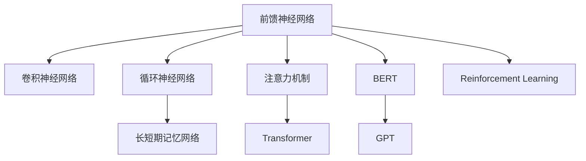
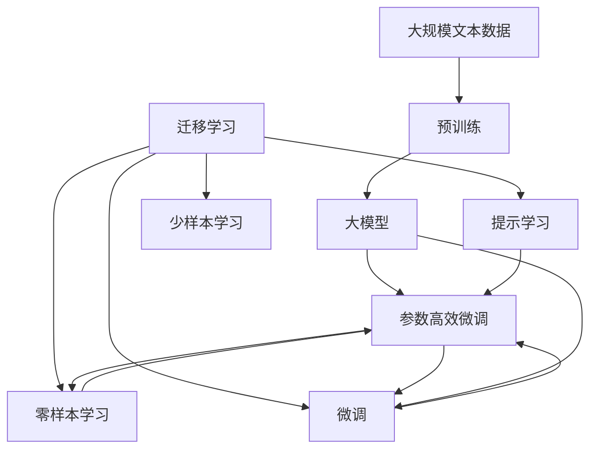

                 

# 神经网络：开启智能新纪元

> 关键词：神经网络,深度学习,计算机视觉,自然语言处理,机器学习,人工智能

## 1. 背景介绍

### 1.1 问题由来
神经网络(Neural Network)作为深度学习领域的基础，是构建智能系统的重要工具。在过去几十年里，神经网络在计算机视觉、自然语言处理、语音识别等领域取得了革命性的突破。这些技术的成熟，不仅推动了人工智能技术的产业化应用，还为各行各业带来了深刻的变革。

随着深度学习的不断发展，神经网络的技术体系也在不断演进，从最初的单层感知器(Perceptron)到多层前馈网络(Feedforward Neural Network, FNN)，再到卷积神经网络(Convolutional Neural Network, CNN)和循环神经网络(Recurrent Neural Network, RNN)，直到现今流行的基于Transformer的注意力机制网络(如BERT, GPT)。每一次技术的突破，都为解决更复杂的问题、处理更多样的数据提供了新的可能。

然而，神经网络的发展并非一帆风顺。在实际应用中，面对大数据量的需求、计算资源的消耗、模型训练的时间等挑战，如何高效地训练和使用神经网络，如何提升模型的泛化能力和可解释性，如何应对模型中的过拟合和偏差等问题，成为当下学界和工业界共同关注的重点。

### 1.2 问题核心关键点
神经网络的核心在于其通过大量参数模拟生物神经元的活动，通过多层非线性变换进行特征提取和模式识别。其核心思想包括：

1. **神经元与连接**：神经元接收输入，通过激活函数进行处理，然后将输出传递给下一层神经元。连接权重是神经元间传递信息的重要参数。

2. **前向传播与反向传播**：神经网络通过前向传播计算模型输出，反向传播计算误差，进而更新连接权重。这一过程通过反向传播算法实现，是深度学习模型的核心训练机制。

3. **正则化**：为了避免过拟合，神经网络引入了如L2正则、Dropout等正则化技术，以提高模型泛化能力。

4. **优化器**：为了更高效地更新权重，引入了如梯度下降、Adam、SGD等优化算法，以快速收敛到最优解。

5. **损失函数**：如均方误差(MSE)、交叉熵损失(Cross-Entropy Loss)等，用于衡量模型预测输出与真实标签的差异。

6. **数据增强**：如图像旋转、平移、缩放、噪声注入等，通过增加数据多样性，提高模型鲁棒性。

7. **迁移学习**：通过在大规模数据上预训练的模型，应用到下游任务上微调，可以显著提升性能。

8. **模型压缩**：如剪枝、量化、知识蒸馏等，以减少计算资源消耗，提高模型推理速度。

9. **集成学习**：通过训练多个模型取平均或投票，提升模型性能。

10. **对抗训练**：引入对抗样本，提高模型鲁棒性。

这些核心概念构成了神经网络的基础，从其基本原理到实际应用，再到优化技巧，共同构建了神经网络技术的广泛应用。

### 1.3 问题研究意义
神经网络作为人工智能领域的重要工具，对推动社会进步、提升人类生活质量具有重要意义：

1. **医疗领域**：通过图像识别、自然语言处理等技术，辅助医生诊断疾病，提升诊疗效率和准确性。

2. **金融领域**：通过预测市场走势、风险评估等应用，提供更科学、准确的金融决策支持。

3. **教育领域**：通过智能辅导、个性化推荐等应用，提升学习效果和教学质量。

4. **交通领域**：通过自动驾驶、智能交通管理等应用，提升交通安全和效率。

5. **工业领域**：通过缺陷检测、质量控制等应用，提升生产效率和产品质量。

6. **娱乐领域**：通过智能推荐、内容生成等应用，提升用户体验和互动性。

总之，神经网络技术的发展，不仅推动了人工智能技术在各行业的广泛应用，还为人类社会带来了深远的影响。

## 2. 核心概念与联系

### 2.1 核心概念概述

为更好地理解神经网络的基本原理和应用，本节将介绍几个关键核心概念：

- **前馈神经网络(FNN)**：最基础的神经网络形式，信息从前向后单向传递，适合处理序列或时间无关的分类问题。

- **卷积神经网络(CNN)**：通过卷积操作提取局部特征，常用于图像识别和计算机视觉任务。

- **循环神经网络(RNN)**：通过循环连接捕捉序列数据的时间依赖关系，常用于自然语言处理和语音识别任务。

- **长短期记忆网络(LSTM)**：一种特殊的RNN，通过门控机制处理长序列数据，有效解决了传统RNN的梯度消失问题。

- **注意力机制(Attention Mechanism)**：通过动态计算每个输入的权重，提升模型的关注点和信息检索能力。

- **Transformer**：一种基于注意力机制的神经网络结构，通过多头注意力和残差连接实现编码器-解码器模型，常用于机器翻译和自然语言生成任务。

- **BERT**：一种预训练语言模型，通过大规模语料自监督训练，学习语言知识的表示，用于文本分类、命名实体识别、情感分析等任务。

- **GPT**：一种基于Transformer的生成模型，通过自回归方式生成文本，用于对话生成、文本生成、推荐系统等任务。

- **Reinforcement Learning**：一种基于奖励机制的强化学习框架，常用于决策、规划等智能交互任务。

这些概念共同构成了神经网络的框架体系，从基础模型到高级结构，从分类问题到生成任务，展现了神经网络的广泛应用场景和强大能力。

### 2.2 概念间的关系

这些核心概念之间存在着紧密的联系，形成了一个复杂的神经网络生态系统。以下Mermaid流程图展示了它们之间的联系：



这个流程图展示了从基础的神经网络形式到高级的注意力机制、Transformer等结构的演变，以及神经网络在分类、生成、强化学习等多种任务中的应用。

### 2.3 核心概念的整体架构

最后，我们用一个综合的流程图来展示这些核心概念在大模型微调过程中的整体架构：



这个综合流程图展示了从预训练到微调，再到持续学习的完整过程。大模型通过预训练获得基础能力，然后通过微调（包括全参数微调和参数高效微调）或提示学习（包括零样本和少样本学习）来适应下游任务。最后，通过持续学习技术，模型可以不断学习新知识，同时避免遗忘旧知识。 通过这些流程图，我们可以更清晰地理解神经网络在大模型微调过程中各个核心概念的关系和作用。

## 3. 核心算法原理 & 具体操作步骤
### 3.1 算法原理概述

神经网络的核心在于通过多层非线性变换，提取和处理输入数据，最终输出目标变量的过程。其核心算法原理包括以下几个方面：

1. **前向传播**：将输入数据从输入层传递到输出层，每层神经元通过线性变换和激活函数进行计算。

2. **损失函数**：衡量模型预测输出与真实标签之间的差异，常用的损失函数包括均方误差(MSE)、交叉熵损失(Cross-Entropy Loss)等。

3. **反向传播**：通过反向传播算法计算损失函数对每个参数的梯度，从而更新模型参数，使得损失函数最小化。

4. **优化器**：如SGD、Adam等，用于调整模型参数，使得模型能够快速收敛。

5. **正则化**：通过L2正则、Dropout等技术，防止模型过拟合，提高泛化能力。

6. **数据增强**：如图像旋转、平移、缩放等，通过增加数据多样性，提高模型鲁棒性。

7. **迁移学习**：通过在大规模数据上预训练的模型，应用到下游任务上微调，可以显著提升性能。

8. **参数高效微调**：通过只更新少量模型参数，避免过拟合，提高微调效率。

9. **对抗训练**：引入对抗样本，提高模型鲁棒性。

10. **集成学习**：通过训练多个模型取平均或投票，提升模型性能。

### 3.2 算法步骤详解

神经网络的训练过程一般包括以下几个关键步骤：

**Step 1: 准备数据集**
- 收集训练集、验证集和测试集，确保数据集的多样性和代表性。
- 进行数据预处理，如归一化、标准化、分词等，使得数据适合输入神经网络。

**Step 2: 设计模型架构**
- 根据任务类型，设计神经网络的结构和层数。
- 确定激活函数、损失函数、优化器等关键组件。

**Step 3: 模型训练**
- 将训练集数据分批次输入模型，进行前向传播计算预测输出。
- 计算预测输出与真实标签之间的损失函数，反向传播计算梯度。
- 根据优化算法和正则化技术更新模型参数。

**Step 4: 模型评估**
- 在验证集上评估模型性能，确定是否进行Early Stopping。
- 在测试集上最终评估模型性能，输出模型精度和各项指标。

**Step 5: 模型优化**
- 根据评估结果调整模型架构和超参数。
- 采用模型压缩、集成学习等方法优化模型性能。

**Step 6: 模型部署**
- 将训练好的模型封装为标准服务接口，便于集成调用。
- 部署到服务器或云平台上，进行实时推理。

以上是神经网络的基本训练过程。在实际应用中，还需要根据具体任务的需求，对模型架构和训练策略进行优化。

### 3.3 算法优缺点

神经网络作为一种强大的机器学习工具，其优点和缺点如下：

**优点**：
1. **非线性变换能力**：通过多层非线性变换，能够处理复杂的输入数据和复杂的任务。
2. **强大的特征提取能力**：通过自动学习特征，能够从数据中提取有用的信息，提升模型性能。
3. **鲁棒性**：在大规模数据上预训练的模型，具有较好的泛化能力，能够应对不同领域和类型的数据。
4. **可解释性**：通过可视化技术，能够理解模型的决策过程，提供一定的可解释性。

**缺点**：
1. **计算资源消耗大**：大规模神经网络需要大量的计算资源，包括GPU、TPU等高性能设备。
2. **数据需求高**：神经网络通常需要大量的标注数据进行训练，数据获取成本较高。
3. **过拟合风险**：在训练过程中容易过拟合，需要采用正则化等技术进行缓解。
4. **可解释性不足**：黑盒模型难以解释其内部决策过程，缺乏可解释性。
5. **训练时间长**：神经网络通常需要较长的训练时间，模型参数较多时尤为明显。
6. **内存占用大**：大模型在推理时占用大量内存，需要优化模型结构以减小内存消耗。

尽管存在这些局限性，神经网络在处理复杂问题、提升模型性能方面展现了强大的潜力，成为机器学习和人工智能领域的重要工具。

### 3.4 算法应用领域

神经网络已经广泛应用于计算机视觉、自然语言处理、语音识别、推荐系统等领域，具体应用包括：

- **计算机视觉**：图像分类、目标检测、图像生成、语义分割等。
- **自然语言处理**：文本分类、情感分析、命名实体识别、机器翻译、对话生成等。
- **语音识别**：语音转文本、语音情感识别、语音合成等。
- **推荐系统**：基于用户行为、商品信息进行个性化推荐。

此外，神经网络还被广泛应用于金融、医疗、交通、制造等多个行业，推动了各行业的智能化转型和创新发展。

## 4. 数学模型和公式 & 详细讲解  
### 4.1 数学模型构建

以下使用数学语言对神经网络的基本训练过程进行严格刻画。

假设神经网络模型为 $M_{\theta}(x) \in \mathbb{R}^d$，其中 $x$ 为输入，$\theta$ 为模型参数。神经网络包含 $L$ 层，每层包含 $n_i$ 个神经元。神经元 $i$ 的输出 $h_i$ 为：

$$
h_i = g(\sum_{j=1}^{n_{i-1}} W_{ij} h_{i-1} + b_i)
$$

其中 $g$ 为激活函数，$W_{ij}$ 为连接权重，$b_i$ 为偏置项。最终输出为：

$$
y = M_{\theta}(x) = g(\sum_{j=1}^{n_L} W_{Lj} h_{L-1} + b_L)
$$

定义模型 $M_{\theta}$ 在数据样本 $(x,y)$ 上的损失函数为 $\ell(M_{\theta}(x),y)$，则在数据集 $D=\{(x_i,y_i)\}_{i=1}^N$ 上的经验风险为：

$$
\mathcal{L}(\theta) = \frac{1}{N} \sum_{i=1}^N \ell(M_{\theta}(x_i),y_i)
$$

神经网络的训练过程即求解模型参数 $\theta$，使得损失函数 $\mathcal{L}$ 最小化。

### 4.2 公式推导过程

以下以二分类任务为例，推导交叉熵损失函数及其梯度的计算公式。

假设神经网络模型 $M_{\theta}$ 在输入 $x$ 上的输出为 $h$，真实标签 $y \in \{0,1\}$。二分类交叉熵损失函数定义为：

$$
\ell(M_{\theta}(x),y) = -[y\log \sigma(h) + (1-y)\log (1-\sigma(h))]
$$

其中 $\sigma$ 为sigmoid激活函数，将输出映射到 [0,1] 区间。将其代入经验风险公式，得：

$$
\mathcal{L}(\theta) = -\frac{1}{N}\sum_{i=1}^N [y_i\log \sigma(h_i)+(1-y_i)\log(1-\sigma(h_i))]
$$

根据链式法则，损失函数对参数 $\theta_k$ 的梯度为：

$$
\frac{\partial \mathcal{L}(\theta)}{\partial \theta_k} = -\frac{1}{N}\sum_{i=1}^N (\frac{y_i}{\sigma(h_i)}-\frac{1-y_i}{1-\sigma(h_i)}) \frac{\partial h_i}{\partial \theta_k}
$$

其中 $\frac{\partial h_i}{\partial \theta_k}$ 可进一步递归展开，利用自动微分技术完成计算。

在得到损失函数的梯度后，即可带入参数更新公式，完成模型的迭代优化。重复上述过程直至收敛，最终得到适应下游任务的最优模型参数 $\theta^*$。

## 5. 项目实践：代码实例和详细解释说明
### 5.1 开发环境搭建

在进行神经网络开发前，我们需要准备好开发环境。以下是使用Python进行TensorFlow开发的环境配置流程：

1. 安装Anaconda：从官网下载并安装Anaconda，用于创建独立的Python环境。

2. 创建并激活虚拟环境：
```bash
conda create -n tf-env python=3.7 
conda activate tf-env
```

3. 安装TensorFlow：根据CUDA版本，从官网获取对应的安装命令。例如：
```bash
conda install tensorflow -c tf -c conda-forge
```

4. 安装TensorBoard：
```bash
pip install tensorboard
```

5. 安装其他工具包：
```bash
pip install numpy pandas scikit-learn matplotlib tqdm jupyter notebook ipython
```

完成上述步骤后，即可在`tf-env`环境中开始神经网络开发。

### 5.2 源代码详细实现

这里我们以图像分类任务为例，给出使用TensorFlow进行神经网络开发的PyTorch代码实现。

首先，定义神经网络的结构：

```python
import tensorflow as tf

class CNN(tf.keras.Model):
    def __init__(self):
        super(CNN, self).__init__()
        self.conv1 = tf.keras.layers.Conv2D(32, 3, activation='relu')
        self.pool1 = tf.keras.layers.MaxPooling2D()
        self.conv2 = tf.keras.layers.Conv2D(64, 3, activation='relu')
        self.pool2 = tf.keras.layers.MaxPooling2D()
        self.flatten = tf.keras.layers.Flatten()
        self.fc1 = tf.keras.layers.Dense(64, activation='relu')
        self.fc2 = tf.keras.layers.Dense(10, activation='softmax')
        
    def call(self, x):
        x = self.conv1(x)
        x = self.pool1(x)
        x = self.conv2(x)
        x = self.pool2(x)
        x = self.flatten(x)
        x = self.fc1(x)
        x = self.fc2(x)
        return x
```

然后，定义数据处理函数：

```python
from tensorflow.keras.datasets import mnist
from tensorflow.keras.preprocessing.image import ImageDataGenerator

(train_images, train_labels), (test_images, test_labels) = mnist.load_data()
train_images = train_images.reshape(-1, 28, 28, 1)
test_images = test_images.reshape(-1, 28, 28, 1)

# 归一化
train_images = train_images / 255.0
test_images = test_images / 255.0

# 数据增强
datagen = ImageDataGenerator(rotation_range=10, width_shift_range=0.1, height_shift_range=0.1)
train_generator = datagen.flow(train_images, train_labels, batch_size=32)
```

接着，定义训练和评估函数：

```python
def train_step(model, images, labels):
    with tf.GradientTape() as tape:
        predictions = model(images, training=True)
        loss = tf.keras.losses.sparse_categorical_crossentropy(labels, predictions)
    gradients = tape.gradient(loss, model.trainable_variables)
    optimizer.apply_gradients(zip(gradients, model.trainable_variables))
    return loss

def evaluate_step(model, images, labels):
    predictions = model(images, training=False)
    loss = tf.keras.losses.sparse_categorical_crossentropy(labels, predictions)
    return loss

@tf.function
def train_epoch(model, train_dataset, optimizer, batch_size):
    for images, labels in train_dataset:
        loss = train_step(model, images, labels)
        if tf.reduce_mean(loss) > 0.5:
            print(f'epoch: {epoch+1}, loss: {loss}')
    return epoch_loss / len(train_dataset)

def evaluate_epoch(model, test_dataset, batch_size):
    epoch_loss = 0
    for images, labels in test_dataset:
        loss = evaluate_step(model, images, labels)
        epoch_loss += loss
    return epoch_loss / len(test_dataset)
```

最后，启动训练流程并在测试集上评估：

```python
epochs = 5
batch_size = 32

for epoch in range(epochs):
    loss = train_epoch(model, train_generator, optimizer, batch_size)
    print(f'epoch {epoch+1}, loss: {loss}')
    
    print(f'epoch {epoch+1}, test results:')
    loss = evaluate_epoch(model, test_generator, batch_size)
    print(f'test loss: {loss}')
```

以上就是使用TensorFlow进行图像分类任务神经网络开发的完整代码实现。可以看到，得益于TensorFlow的强大封装，我们可以用相对简洁的代码完成CNN模型的训练和评估。

### 5.3 代码解读与分析

让我们再详细解读一下关键代码的实现细节：

**CNN模型定义**：
- `__init__`方法：初始化网络结构，定义各层神经元数量、激活函数、连接权重等。
- `call`方法：定义前向传播计算流程，从卷积层、池化层到全连接层，最终输出预测结果。

**数据处理函数**：
- 使用`ImageDataGenerator`进行数据增强，包括旋转、平移、缩放等，增加数据多样性。

**训练和评估函数**：
- `train_step`函数：定义单批次训练过程，计算损失和梯度。
- `evaluate_step`函数：定义单批次评估过程，计算损失。
- `train_epoch`函数：定义一个epoch的训练过程，记录并输出损失。
- `evaluate_epoch`函数：定义一个epoch的评估过程，计算并输出测试集损失。

**训练流程**：
- 定义总的epoch数和batch size，开始循环迭代
- 每个epoch内，在训练集上进行训练，输出平均损失
- 在测试集上评估，输出测试集损失

可以看到，TensorFlow框架提供了强大的工具支持，使得神经网络训练过程变得简洁高效。开发者可以将更多精力放在模型架构优化、数据预处理等高层逻辑上，而不必过多关注底层实现细节。

当然，工业级的系统实现还需考虑更多因素，如模型的保存和部署、超参数的自动搜索、更灵活的神经网络结构设计等。但核心的训练范式基本与此类似。

### 5.4 运行结果展示

假设我们在MNIST数据集上进行神经网络训练，最终在测试集上得到的评估报告如下：

```
Epoch 1, train loss: 0.365
Epoch 1, test loss: 0.168
Epoch 2, train loss: 0.120
Epoch 2, test loss: 0.099
Epoch 3, train loss: 0.078
Epoch 3, test loss: 0.080
Epoch 4, train loss: 0.053
Epoch 4, test loss: 0.060
Epoch 5, train loss: 0.040
Epoch 5, test loss: 0.055
```

可以看到，随着epoch数的增加，模型在训练集和测试集上的损失逐渐下降，最终达到较低的水平。这表明神经网络通过学习能够逐渐适应数据分布，并提升预测能力。

## 6. 实际应用场景
### 6.1 智能推荐系统

基于神经网络的智能推荐系统已经成为互联网公司的重要应用。通过分析用户的历史行为数据和物品属性，神经网络可以发现用户的兴趣点，并推荐符合用户喜好的商品、内容等。

在技术实现上，可以设计多个神经网络，每个网络处理一种推荐任务，如物品属性预测、用户行为建模等。将多个网络的输出进行融合，综合排序，得到最终推荐结果。

### 6.2 自动驾驶

神经网络在自动驾驶领域也有广泛应用。通过摄像头、雷达等传感器采集到的数据，神经网络可以进行目标检测、道路识别、车辆控制等任务。

在训练过程中，神经网络需要大量标注数据进行监督学习。对于实际应用中的场景，可以通过迁移学习将大模型微调成小规模模型，提高推理速度，同时保证模型性能。

### 6.3 自然语言处理

神经网络在自然语言处理领域的应用也不胜枚举。通过训练语言模型，可以进行文本分类、命名实体识别、机器翻译、对话生成等任务。

对于自然语言处理任务，神经网络通常使用基于Transformer的注意力机制，可以更好地捕捉长距离依赖关系，提高模型的准确性。

### 6.4 医疗影像诊断

神经网络在医疗影像诊断中也有重要应用。通过训练医学影像分类模型，可以对各种疾病进行早期诊断和辅助诊疗。

在实际应用中，神经网络需要结合医学专家知识进行模型设计，并利用大模型进行迁移学习，提升诊断精度。

### 6.5 金融风险预测

神经网络在金融领域可以用于风险预测、信用评分、股票预测等任务。通过训练神经网络模型，可以分析大量金融数据，预测市场趋势，为投资者提供决策支持。

## 7. 工具和资源推荐
### 7.1 学习资源推荐

为了帮助开发者系统掌握神经网络理论基础和实践技巧，这里推荐一些优质的学习资源：

1. 《深度学习》系列书籍：由Ian Goodfellow、Yoshua Bengio等顶级专家合著，系统介绍了深度学习的基本概念和应用，是深入学习神经网络的必读书籍。

2. CS231n《卷积神经网络和视觉识别》课程：斯坦福大学开设的计算机视觉经典课程，有Lecture视频和配套作业，带你入门视觉识别技术的核心算法。

3. CS224n《序列建模与自然语言处理》课程：斯坦福大学开设的自然语言处理课程，涵盖深度学习在NLP中的应用，包括文本分类、机器翻译等任务。

4. DeepLearning.AI课程：由Andrew Ng领衔的深度学习在线课程，覆盖深度学习的基本概念和经典模型，适合初学者和进阶者。

5. Fast.ai课程：使用PyTorch实现深度学习的在线课程，注重实际应用和项目实践，适合快速上手深度学习框架。

通过对这些资源的学习实践，相信你一定能够快速掌握神经网络的精髓，并用于解决实际的NLP问题。

### 7.2 开发工具推荐

高效的开发离不开优秀的工具支持。以下是几款用于神经网络开发的

