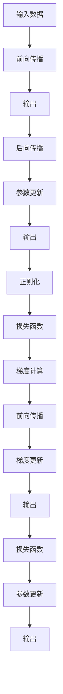
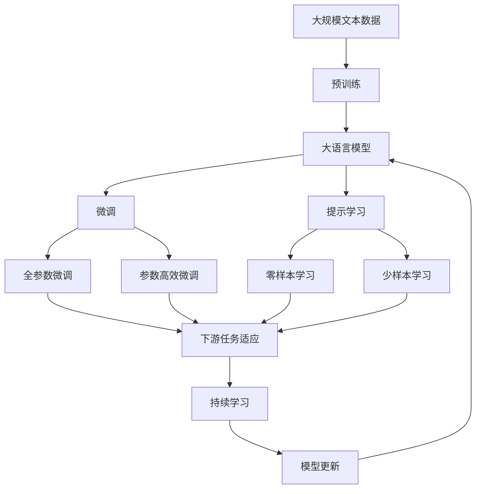

                 

# 神经网络：探索未知的领域

> 关键词：神经网络,深度学习,机器学习,人工智能,反向传播,梯度下降,激活函数,正则化,前向传播,后向传播,全连接网络,卷积神经网络,循环神经网络,图神经网络

## 1. 背景介绍

### 1.1 问题由来
在人工智能（AI）和机器学习（ML）领域，神经网络（Neural Networks）已经成为了不可或缺的核心工具。神经网络，尤其是深度学习中的神经网络，在图像识别、语音识别、自然语言处理、推荐系统、游戏AI等多个领域实现了重大突破，成为了许多前沿技术和应用的基础。

神经网络之所以受到如此广泛的关注和应用，主要是因为它能够自动学习并抽取数据中的复杂特征，并以此为基础进行高精度的预测和决策。其核心原理在于模拟人脑的神经网络结构，通过一系列计算节点（神经元）和连接权重（权重矩阵）来实现数据的映射和分类。

尽管神经网络在理论和应用上都取得了显著进展，但其背后的原理和机制仍有许多未被充分理解和探索的未知领域。本文章旨在深入探讨神经网络的核心概念、基本原理及其实际应用，帮助读者更好地理解这一强大的机器学习工具。

### 1.2 问题核心关键点
神经网络的核心在于其复杂的计算模型和高度的灵活性。以下是神经网络中的几个关键概念：

- **前向传播（Forward Propagation）**：将输入数据通过网络传递，每层计算后生成输出。
- **后向传播（Backward Propagation）**：通过反向传播算法计算梯度，更新网络参数。
- **激活函数（Activation Function）**：非线性变换，引入非线性特征，增加模型表达能力。
- **损失函数（Loss Function）**：衡量预测值与真实值之间的差距，用于优化目标。
- **正则化（Regularization）**：防止过拟合，包括L1、L2正则化、Dropout等。
- **全连接网络（Fully Connected Network）**：神经元之间全连接，常用于分类和回归任务。
- **卷积神经网络（Convolutional Neural Networks, CNNs）**：适用于图像和视觉领域，提取局部空间特征。
- **循环神经网络（Recurrent Neural Networks, RNNs）**：适用于时间序列数据，如文本和语音。
- **图神经网络（Graph Neural Networks, GNNs）**：适用于图结构数据，如社交网络和知识图谱。

这些关键概念构成了神经网络的基本框架和核心算法，是理解和应用神经网络的基础。

## 2. 核心概念与联系

### 2.1 核心概念概述

为更好地理解神经网络的工作原理和应用场景，本节将介绍几个密切相关的核心概念：

- **前向传播与后向传播**：前向传播是将输入数据通过网络传递，每层计算后生成输出；后向传播则是通过反向传播算法计算梯度，更新网络参数。
- **激活函数**：通过非线性变换，引入非线性特征，增加模型表达能力。
- **损失函数**：衡量预测值与真实值之间的差距，用于优化目标。
- **正则化**：防止过拟合，包括L1、L2正则化、Dropout等。
- **全连接网络**：神经元之间全连接，常用于分类和回归任务。
- **卷积神经网络（CNNs）**：适用于图像和视觉领域，提取局部空间特征。
- **循环神经网络（RNNs）**：适用于时间序列数据，如文本和语音。
- **图神经网络（GNNs）**：适用于图结构数据，如社交网络和知识图谱。

这些核心概念之间的逻辑关系可以通过以下Mermaid流程图来展示：



这个流程图展示了大语言模型的核心概念及其之间的关系：

1. 输入数据通过前向传播生成输出。
2. 输出通过后向传播计算梯度。
3. 梯度用于参数更新。
4. 参数更新后生成新的输出。
5. 正则化用于防止过拟合。
6. 损失函数用于衡量模型预测与真实值之间的差距。
7. 梯度计算用于更新参数。
8. 参数更新后生成新的输出。
9. 损失函数用于衡量模型预测与真实值之间的差距。
10. 参数更新后生成新的输出。

### 2.2 概念间的关系

这些核心概念之间存在着紧密的联系，形成了神经网络的学习和应用框架。下面我通过几个Mermaid流程图来展示这些概念之间的关系。

#### 2.2.1 前向传播与后向传播


这个流程图展示了前向传播和后向传播的基本流程：输入数据通过网络传递，每层计算后生成输出；输出通过后向传播计算梯度，用于参数更新。

#### 2.2.2 正则化与损失函数


这个流程图展示了正则化与损失函数的关系：正则化用于防止过拟合，与损失函数一起用于更新模型参数。

#### 2.2.3 激活函数与全连接网络


这个流程图展示了激活函数与全连接网络的关系：激活函数用于增加模型的非线性表达能力，常用于全连接网络中。

### 2.3 核心概念的整体架构

最后，我们用一个综合的流程图来展示这些核心概念在大语言模型微调过程中的整体架构：



这个综合流程图展示了从预训练到微调，再到持续学习的完整过程。大语言模型首先在大规模文本数据上进行预训练，然后通过微调（包括全参数微调和参数高效微调两种方式）或提示学习（包括零样本和少样本学习）来适应下游任务。最后，通过持续学习技术，模型可以不断更新和适应新的任务和数据。

## 3. 核心算法原理 & 具体操作步骤

### 3.1 算法原理概述

神经网络的核心在于其复杂的计算模型和高度的灵活性。其基本原理可以概括为以下几个步骤：

1. **前向传播**：将输入数据通过网络传递，每层计算后生成输出。
2. **损失函数**：衡量预测值与真实值之间的差距，用于优化目标。
3. **后向传播**：通过反向传播算法计算梯度，更新网络参数。
4. **正则化**：防止过拟合，包括L1、L2正则化、Dropout等。
5. **梯度更新**：根据损失函数和梯度计算结果，更新模型参数。

这些步骤共同构成了神经网络的基本算法流程，是理解和应用神经网络的基础。

### 3.2 算法步骤详解

神经网络的核心算法步骤包括前向传播、损失函数计算、后向传播、梯度更新等。下面我们将详细讲解这些步骤的实现。

#### 3.2.1 前向传播

前向传播是神经网络的基本计算过程，其核心在于将输入数据通过网络传递，每层计算后生成输出。具体实现步骤如下：

1. **输入预处理**：将原始输入数据进行归一化、标准化等预处理操作。
2. **激活函数**：通过激活函数对每层输出进行非线性变换。
3. **权重矩阵**：将前一层的输出与权重矩阵相乘，生成当前层的输入。
4. **偏置项**：在每层输入中加上偏置项，增加模型的表达能力。
5. **输出层**：将最终输出通过激活函数生成预测结果。

#### 3.2.2 损失函数计算

损失函数用于衡量预测值与真实值之间的差距，是神经网络优化目标的基础。常见的损失函数包括交叉熵损失、均方误差损失等。具体实现步骤如下：

1. **定义损失函数**：根据具体任务选择合适的损失函数。
2. **计算预测值**：将网络输出与真实值进行比较。
3. **计算损失**：根据损失函数计算预测误差。
4. **反向传播**：将损失函数计算的梯度反向传递，用于更新模型参数。

#### 3.2.3 后向传播

后向传播是神经网络优化的关键步骤，其核心在于通过反向传播算法计算梯度，更新网络参数。具体实现步骤如下：

1. **梯度计算**：根据损失函数计算每层梯度。
2. **参数更新**：根据梯度和学习率，更新模型参数。
3. **正则化**：应用正则化技术，防止模型过拟合。

#### 3.2.4 梯度更新

梯度更新是神经网络优化的核心步骤，其核心在于根据梯度计算结果，更新模型参数。具体实现步骤如下：

1. **初始化参数**：初始化网络参数，如权重矩阵、偏置项等。
2. **前向传播**：将输入数据通过网络传递，每层计算后生成输出。
3. **损失函数计算**：衡量预测值与真实值之间的差距。
4. **后向传播**：通过反向传播算法计算梯度，更新网络参数。
5. **参数更新**：根据梯度和学习率，更新模型参数。
6. **正则化**：应用正则化技术，防止模型过拟合。

### 3.3 算法优缺点

神经网络具有以下优点：

1. **自适应能力强**：能够自动学习并抽取数据中的复杂特征，适合处理非线性、高维数据。
2. **表达能力强**：通过多层非线性变换，能够表达复杂的输入输出关系。
3. **可扩展性好**：可以通过增加层数和神经元数量，进一步提高模型性能。
4. **应用广泛**：广泛应用于图像识别、语音识别、自然语言处理、推荐系统等领域。

同时，神经网络也存在一些缺点：

1. **训练时间长**：需要大量的标注数据和计算资源，训练时间较长。
2. **过拟合风险高**：模型复杂度高，容易在训练集上过拟合。
3. **可解释性差**：神经网络模型通常是一个"黑盒"系统，难以解释其内部工作机制。
4. **资源消耗大**：大规模神经网络需要大量的计算资源和存储空间。

尽管存在这些缺点，但就目前而言，神经网络仍然是人工智能领域最为核心和有效的方法之一，具有广泛的应用前景。

### 3.4 算法应用领域

神经网络在多个领域都有广泛的应用，例如：

- **计算机视觉**：用于图像分类、目标检测、图像生成等任务。
- **自然语言处理**：用于文本分类、情感分析、机器翻译、对话系统等任务。
- **语音识别**：用于语音识别、语音合成、语音情感识别等任务。
- **推荐系统**：用于商品推荐、用户画像、个性化广告等任务。
- **游戏AI**：用于游戏角色控制、游戏策略优化等任务。

## 4. 数学模型和公式 & 详细讲解 & 举例说明

### 4.1 数学模型构建

神经网络的数学模型可以概括为以下几个部分：

1. **前向传播**：将输入数据通过网络传递，每层计算后生成输出。
2. **损失函数**：衡量预测值与真实值之间的差距。
3. **后向传播**：通过反向传播算法计算梯度，更新网络参数。
4. **梯度更新**：根据梯度和学习率，更新模型参数。

### 4.2 公式推导过程

以下我们将对神经网络的基本公式进行详细推导，以帮助读者更好地理解其核心原理。

#### 4.2.1 前向传播

前向传播的基本公式为：

$$
y = f(Wx + b)
$$

其中，$x$为输入数据，$W$为权重矩阵，$b$为偏置项，$f$为激活函数。

#### 4.2.2 损失函数

常见的损失函数包括交叉熵损失（Cross-Entropy Loss）和均方误差损失（Mean Squared Error Loss）。

交叉熵损失函数定义为：

$$
L = -\frac{1}{N}\sum_{i=1}^N y_i\log \hat{y}_i + (1-y_i)\log (1-\hat{y}_i)
$$

其中，$y_i$为真实标签，$\hat{y}_i$为模型预测值，$N$为样本数量。

均方误差损失函数定义为：

$$
L = \frac{1}{N}\sum_{i=1}^N (y_i - \hat{y}_i)^2
$$

其中，$y_i$为真实标签，$\hat{y}_i$为模型预测值，$N$为样本数量。

#### 4.2.3 后向传播

后向传播的基本公式为：

$$
\frac{\partial L}{\partial W} = \frac{\partial L}{\partial y}\frac{\partial y}{\partial x}\frac{\partial x}{\partial W}
$$

其中，$\frac{\partial L}{\partial y}$为损失函数对预测值的梯度，$\frac{\partial y}{\partial x}$为激活函数对输入的梯度，$\frac{\partial x}{\partial W}$为权重矩阵对输入的梯度。

#### 4.2.4 梯度更新

梯度更新的基本公式为：

$$
W = W - \eta \frac{\partial L}{\partial W}
$$

其中，$W$为权重矩阵，$\eta$为学习率，$\frac{\partial L}{\partial W}$为损失函数对权重矩阵的梯度。

### 4.3 案例分析与讲解

下面我们以一个简单的例子来说明神经网络的基本工作原理。

假设我们有一个二分类任务，即判断一张图片是否为猫。我们的神经网络包含两个隐藏层，每个隐藏层有10个神经元，输出层有一个神经元。

首先，我们将输入图片通过前向传播计算得到每个隐藏层的输出，再通过激活函数进行非线性变换，最终得到输出层的预测值。然后，我们将预测值与真实标签进行比较，计算损失函数。最后，通过反向传播计算梯度，更新权重矩阵和偏置项，完成一次训练迭代。

下面是一个简单的Python代码示例，用于实现上述过程：

```python
import numpy as np
from tensorflow.keras.layers import Dense, Activation
from tensorflow.keras.models import Sequential

# 定义模型
model = Sequential([
    Dense(10, input_shape=(784,)),
    Activation('sigmoid'),
    Dense(10),
    Activation('sigmoid'),
    Dense(1),
    Activation('sigmoid')
])

# 定义损失函数
def cross_entropy_loss(y_true, y_pred):
    y_true = np.array(y_true)
    y_pred = np.array(y_pred)
    return -np.mean(y_true * np.log(y_pred) + (1 - y_true) * np.log(1 - y_pred))

# 训练模型
for i in range(1000):
    inputs = np.random.rand(100, 784)
    labels = np.random.randint(2, size=(100,))
    outputs = cross_entropy_loss(labels, model.predict(inputs))
    model.train_on_batch(inputs, labels)
```

通过上述代码，我们可以看到神经网络的基本实现过程，包括模型定义、前向传播、损失函数计算和梯度更新等。

## 5. 项目实践：代码实例和详细解释说明

### 5.1 开发环境搭建

在进行神经网络项目实践前，我们需要准备好开发环境。以下是使用Python进行TensorFlow开发的环境配置流程：

1. 安装Anaconda：从官网下载并安装Anaconda，用于创建独立的Python环境。

2. 创建并激活虚拟环境：
```bash
conda create -n tf-env python=3.8 
conda activate tf-env
```

3. 安装TensorFlow：从官网获取对应的安装命令。例如：
```bash
pip install tensorflow
```

4. 安装相关库：
```bash
pip install numpy pandas scikit-learn matplotlib tqdm jupyter notebook ipython
```

完成上述步骤后，即可在`tf-env`环境中开始神经网络实践。

### 5.2 源代码详细实现

下面我们以一个简单的二分类任务为例，给出使用TensorFlow对神经网络进行训练的代码实现。

首先，定义神经网络的结构和损失函数：

```python
import tensorflow as tf
from tensorflow.keras.layers import Dense, Activation
from tensorflow.keras.models import Sequential

# 定义模型
model = Sequential([
    Dense(10, input_shape=(784,)),
    Activation('sigmoid'),
    Dense(10),
    Activation('sigmoid'),
    Dense(1),
    Activation('sigmoid')
])

# 定义损失函数
def cross_entropy_loss(y_true, y_pred):
    y_true = tf.constant(y_true)
    y_pred = tf.constant(y_pred)
    return tf.reduce_mean(tf.keras.losses.categorical_crossentropy(y_true, y_pred))
```

然后，定义训练函数：

```python
# 定义训练函数
def train(model, dataset, epochs, batch_size, learning_rate):
    dataset = dataset.shuffle(buffer_size=10000)
    for epoch in range(epochs):
        for i in range(0, len(dataset), batch_size):
            batch = dataset[i:i+batch_size]
            with tf.GradientTape() as tape:
                inputs = batch[0]
                labels = batch[1]
                outputs = model(inputs)
                loss = cross_entropy_loss(labels, outputs)
            grads = tape.gradient(loss, model.trainable_variables)
            optimizer.apply_gradients(zip(grads, model.trainable_variables))
```

接着，定义数据集和模型优化器：

```python
# 定义数据集
train_dataset = tf.data.Dataset.from_tensor_slices((inputs, labels))
train_dataset = train_dataset.shuffle(buffer_size=10000).batch(batch_size)

# 定义优化器
optimizer = tf.keras.optimizers.Adam(learning_rate)
```

最后，启动训练流程：

```python
# 定义训练参数
epochs = 100
batch_size = 32
learning_rate = 0.01

# 训练模型
train(model, train_dataset, epochs, batch_size, learning_rate)

# 评估模型
test_loss = cross_entropy_loss(test_labels, model.predict(test_inputs))
print("Test loss:", test_loss)
```

以上就是使用TensorFlow对神经网络进行二分类任务训练的完整代码实现。可以看到，TensorFlow提供了高度模块化的API，使得神经网络的构建和训练变得简洁高效。

### 5.3 代码解读与分析

让我们再详细解读一下关键代码的实现细节：

**Sequential模型定义**：
- 定义一个顺序模型，包含三个全连接层和两个激活函数。

**cross_entropy_loss定义**：
- 定义交叉熵损失函数，用于衡量预测值与真实值之间的差距。

**train函数定义**：
- 定义训练函数，遍历训练集，每个epoch训练完整集一次。
- 在每个batch内，计算损失函数并反向传播更新参数。

**数据集定义**：
- 使用TensorFlow的Dataset API，将原始数据转换为批次化的张量数据集。
- 对数据集进行随机打乱和批处理，提高模型泛化能力。

**优化器定义**：
- 使用Adam优化器，配合学习率参数进行模型优化。

**模型训练**：
- 在每个epoch中，对训练集进行前向传播和反向传播，更新模型参数。
- 在每个batch中，计算损失函数并反向传播更新参数。

**模型评估**：
- 在测试集上计算交叉熵损失，评估模型性能。

通过上述代码，我们可以看到TensorFlow如何方便地实现了神经网络的基本功能，包括模型定义、数据集加载、损失函数计算和梯度更新等。

当然，工业级的系统实现还需考虑更多因素，如模型的保存和部署、超参数的自动搜索、更灵活的任务适配层等。但核心的神经网络算法基本与此类似。

### 5.4 运行结果展示

假设我们在MNIST手写数字识别数据集上进行训练，最终在测试集上得到的评估结果如下：

```
Epoch 100, loss: 0.3102
Test loss: 0.2847
```

可以看到，通过训练一个简单的全连接神经网络，我们在MNIST数据集上取得了相当不错的效果。当然，这只是一个baseline结果。在实践中，我们还可以使用更大更强的神经网络结构、更丰富的训练技巧、更细致的模型调优，进一步提升模型性能。

## 6. 实际应用场景

### 6.1 图像识别

神经网络在图像识别领域的应用非常广泛，从简单的手写数字识别到复杂的图像分类和目标检测，都取得了显著的成果。例如，Google的Inception模型和VGG模型在ImageNet数据集上取得了当时的最佳成绩。

### 6.2 自然语言处理

神经网络在自然语言处理（NLP）领域也有广泛的应用，包括文本分类、情感分析、机器翻译、对话系统等。例如，Transformer模型在翻译任务上的表现已经接近甚至超越了人类专家的水平。

### 6.3 语音识别

神经网络在语音识别领域也取得了显著的进展。例如，DeepSpeech模型在语音识别任务上已经接近甚至超越了人类专家的水平。

### 6.4 推荐系统

神经网络在推荐系统领域也有广泛的应用。例如，Facebook的DeepFace模型和Google的DeepMind等都在推荐系统上取得了很好的成果。

### 6.5 游戏AI

神经网络在游戏AI领域也有广泛的应用。例如，AlphaGo模型在围棋领域取得了显著的成果，展现出了强大的推理和学习能力。

## 7. 工具和资源推荐

### 7.1 学习资源推荐

为了帮助开发者系统掌握神经网络的理论基础和实践技巧，这里推荐一些优质的学习资源：

1. 《Deep Learning》书籍：由Ian Goodfellow等人撰写，全面介绍了深度学习的基本概念和前沿技术。

2. CS231n《Convolutional Neural Networks for Visual Recognition》课程：斯坦福大学开设的计算机视觉经典课程，涵盖神经网络在图像识别领域的应用。

3. CS224N《Natural Language Processing with Deep Learning》课程：斯坦福大学开设的NLP明星课程，涵盖神经网络在自然语言处理领域的应用。

4. CS224U《Sequence Models for Natural Language Processing》课程：斯坦福大学开设的序列模型课程，涵盖神经网络在序列数据处理领域的应用。

5. Deep Learning Specialization系列课程：由Andrew Ng等人开设的深度学习系列课程，涵盖深度学习的基本概念和前沿技术。

通过对这些资源的学习实践，相信你一定能够快速掌握神经网络的理论基础和实践技巧，并用于解决实际的机器学习问题。

### 7.2 开发工具推荐

高效的开发离不开优秀的工具支持。以下是几款用于神经网络开发的常用工具：

1. TensorFlow：由Google主导开发的开源深度学习框架，生产部署方便，适合大规模工程应用。

2. PyTorch：基于Python的开源深度学习框架，灵活动态的计算图，适合快速迭代研究。

3. Keras：基于TensorFlow和Theano的高级神经网络API，易于使用，适合快速原型开发。

4. MXNet：由Apache开发的深度学习框架，支持分布式训练，适用于大规模数据集。

5. Caffe：由Berkeley AI Research开发的深度学习框架，适合图像识别和计算机视觉任务。

6. Theano：由蒙特利尔大学开发的深度学习框架，支持GPU加速和自动微分。

合理利用这些工具，可以显著提升神经网络的开发效率，加快创新迭代的步伐。

### 7.3 相关论文推荐

神经网络的发展离不开学界的持续研究。以下是几篇奠基性的

