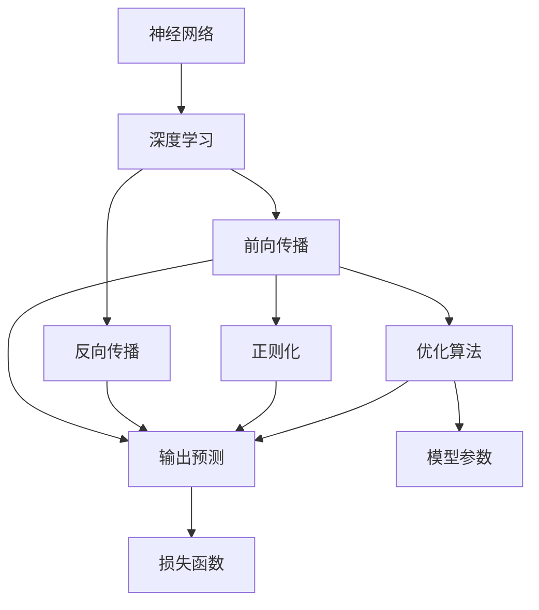
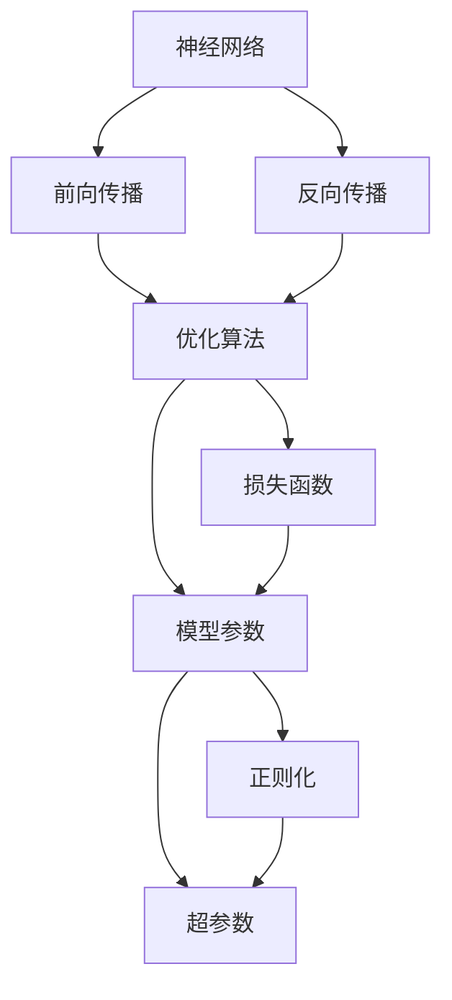
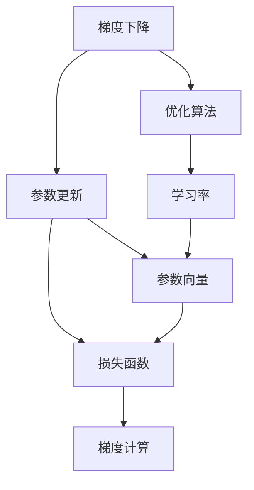
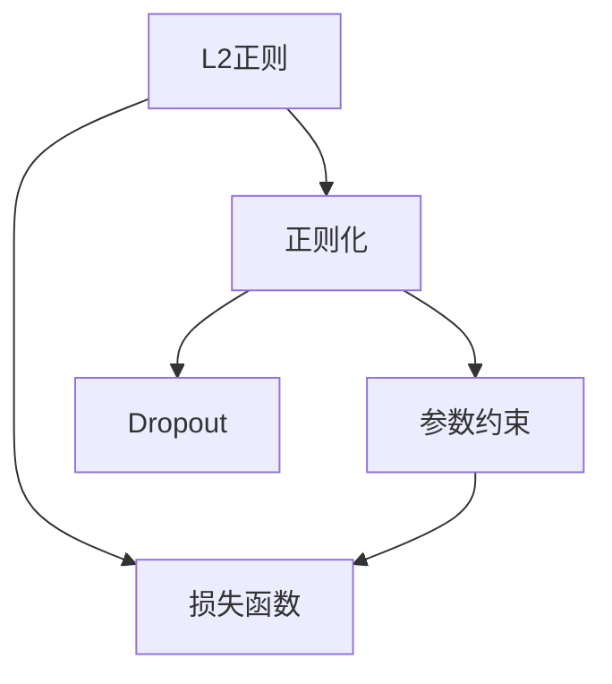
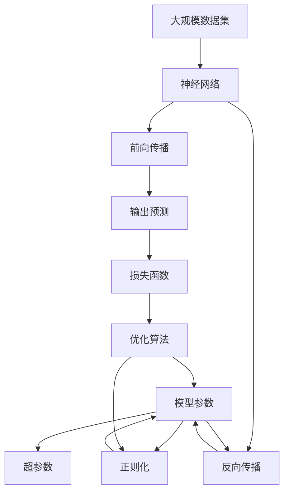

                 

# 神经网络：推动社会进步的力量

## 1. 背景介绍

### 1.1 问题由来
神经网络（Neural Networks, NNs）自上世纪80年代诞生以来，已经成为人工智能（AI）领域的核心技术。它通过模拟人脑神经元之间的连接，实现复杂的信号处理和模式识别，推动了计算机视觉、自然语言处理、语音识别、机器学习等多个领域的迅猛发展。今天，神经网络已经成为了驱动科技进步和社会变革的重要力量。

近年来，深度学习（Deep Learning, DL）的崛起，使得神经网络在处理大规模、高维度数据时，展现出远超传统机器学习算法的优越性。特别是2012年AlexNet在ImageNet图像识别竞赛上获得冠军，标志着深度学习时代的到来。自此，神经网络技术在NLP、图像处理、语音识别等领域大放异彩，成为了推动AI发展的强大引擎。

### 1.2 问题核心关键点
神经网络的核心在于其强大的表达能力和学习机制。通过多层非线性变换，神经网络可以捕捉数据中的复杂结构和关系，从而实现高效的特征提取和模式识别。深度学习范式通过堆叠多个非线性层，进一步增强了神经网络的表达能力和学习效果。

神经网络的训练过程主要包括前向传播和反向传播。前向传播将输入数据输入网络，逐层进行非线性变换，输出预测结果。反向传播则通过计算预测结果与真实标签之间的误差，利用链式法则反向传递梯度，更新模型参数。这种机制使得神经网络能够不断优化自身，适应复杂的任务需求。

神经网络的训练通常需要大量的标注数据和计算资源。目前，常用的训练方法包括随机梯度下降（SGD）、Adam、Adagrad等优化算法。这些方法通过不断迭代更新模型参数，使得模型能够逐步逼近最优解。同时，为了避免过拟合，神经网络还常引入正则化技术（如L2正则、Dropout）和早停法（Early Stopping）等策略。

### 1.3 问题研究意义
研究神经网络对于推动AI技术的发展和落地应用具有重要意义：

1. **提升数据处理能力**：神经网络通过学习大规模数据，能够高效提取数据特征，提高数据处理的准确性和效率。
2. **拓展应用领域**：神经网络技术已经被广泛应用于医疗、金融、教育、安全等多个领域，推动了各行各业的数字化转型和智能化升级。
3. **推动科研创新**：神经网络为科学计算和理论研究提供了新的工具和方法，加速了人工智能理论的发展。
4. **增强决策智能**：神经网络能够处理海量数据，通过机器学习算法，提供更科学、更精确的决策支持。
5. **促进社会进步**：神经网络技术的应用，使得机器能够理解和执行复杂任务，推动了社会的全面进步。

## 2. 核心概念与联系

### 2.1 核心概念概述

为更好地理解神经网络的工作原理和应用，本节将介绍几个密切相关的核心概念：

- **神经网络（Neural Networks, NNs）**：以人工神经元为基本单元构建的计算模型，通过学习训练数据，实现复杂的模式识别和决策。
- **深度学习（Deep Learning, DL）**：一种基于多层神经网络的学习范式，通过堆叠多个非线性层，进一步增强模型的表达能力。
- **前向传播（Forward Propagation）**：将输入数据输入神经网络，逐层进行非线性变换，最终输出预测结果的过程。
- **反向传播（Backward Propagation）**：利用链式法则，反向计算预测结果与真实标签之间的误差，更新模型参数的过程。
- **优化算法（Optimization Algorithms）**：如随机梯度下降（SGD）、Adam等，用于更新模型参数，最小化训练误差。
- **正则化（Regularization）**：如L2正则、Dropout等，用于避免过拟合，提高模型的泛化能力。
- **过拟合（Overfitting）**：模型在训练集上表现很好，但在测试集上表现差的现象，需要正则化和早停法等策略进行缓解。
- **超参数（Hyperparameters）**：如学习率、批大小、迭代轮数等，需要手动调参，对模型性能有重要影响。

这些核心概念之间的逻辑关系可以通过以下Mermaid流程图来展示：



这个流程图展示了大规模神经网络的训练过程：

1. 输入数据通过前向传播逐层传递，进行非线性变换。
2. 反向传播计算预测结果与真实标签之间的误差，反向更新模型参数。
3. 优化算法用于更新参数，最小化损失函数。
4. 正则化技术避免过拟合。
5. 超参数需要手动调优，影响模型性能。

### 2.2 概念间的关系

这些核心概念之间存在着紧密的联系，形成了神经网络的完整生态系统。下面我们通过几个Mermaid流程图来展示这些概念之间的关系。

#### 2.2.1 神经网络的学习范式



这个流程图展示了大规模神经网络的学习过程：

1. 前向传播进行数据处理，生成预测结果。
2. 反向传播计算误差，更新模型参数。
3. 优化算法用于参数更新。
4. 损失函数衡量预测结果的准确性。
5. 正则化和超参数控制模型性能。

#### 2.2.2 深度学习的核心思想


这个流程图展示了深度学习的基本原理：

1. 多层神经网络通过非线性变换，提取数据特征。
2. 特征提取后，进行模式识别，输出决策结果。

#### 2.2.3 优化算法的核心机制



这个流程图展示了优化算法的核心机制：

1. 梯度下降计算参数更新量。
2. 优化算法利用梯度更新参数。
3. 学习率控制参数更新的步长。

#### 2.2.4 正则化技术的核心思想



这个流程图展示了正则化技术的基本思想：

1. L2正则约束参数大小，防止过拟合。
2. Dropout随机丢弃部分神经元，减少过拟合风险。

### 2.3 核心概念的整体架构

最后，我们用一个综合的流程图来展示这些核心概念在大规模神经网络训练过程中的整体架构：



这个综合流程图展示了从数据预处理到模型训练，再到模型评估的完整过程。大规模神经网络首先在大规模数据集上进行前向传播和反向传播，优化模型参数，避免过拟合。同时，利用正则化技术和超参数调优，进一步提升模型性能。通过上述流程图，我们可以更清晰地理解大规模神经网络的训练过程和关键组件，为后续深入讨论具体的训练方法和技术奠定基础。

## 3. 核心算法原理 & 具体操作步骤
### 3.1 算法原理概述

神经网络的核心算法原理可以追溯到1960年代的人工神经元模型。随着计算技术的进步，人工神经元被集成到多层网络结构中，通过前向传播和反向传播进行参数优化，逐步提升模型的准确性和泛化能力。

深度学习范式进一步增强了神经网络的表达能力，通过堆叠多个非线性层，可以学习更加复杂的数据结构和关系。这种范式在图像识别、自然语言处理、语音识别等领域取得了显著的进展。

### 3.2 算法步骤详解

神经网络的训练过程主要包括以下几个关键步骤：

**Step 1: 准备数据集**
- 收集标注数据集，划分为训练集、验证集和测试集。
- 对数据进行预处理，包括归一化、数据增强等操作。

**Step 2: 定义模型架构**
- 选择合适的神经网络架构，如卷积神经网络（CNN）、循环神经网络（RNN）、变分自编码器（VAE）等。
- 确定各层的神经元数量、激活函数、正则化方式等超参数。

**Step 3: 设置优化算法**
- 选择合适的优化算法，如随机梯度下降（SGD）、Adam等。
- 设置学习率、批大小、迭代轮数等超参数。

**Step 4: 执行训练**
- 使用训练集进行模型训练，进行前向传播和反向传播，更新模型参数。
- 在验证集上评估模型性能，根据性能调整超参数。
- 重复迭代直至模型收敛。

**Step 5: 测试和部署**
- 在测试集上评估模型性能，对比训练前后的精度提升。
- 使用模型进行预测，集成到实际应用系统中。

以上是神经网络训练的一般流程。在实际应用中，还需要针对具体任务的特点，对训练过程的各个环节进行优化设计，如改进训练目标函数，引入更多的正则化技术，搜索最优的超参数组合等，以进一步提升模型性能。

### 3.3 算法优缺点

神经网络作为当前主流的机器学习算法，具有以下优点：

1. 强大的表达能力：通过多层非线性变换，可以学习到数据中的复杂结构和关系。
2. 自适应能力：神经网络能够自动学习输入数据的内在规律，适应复杂的任务需求。
3. 高精度：在大规模数据上进行训练，通常能够取得较高的预测准确性。
4. 应用广泛：广泛应用于计算机视觉、自然语言处理、语音识别等多个领域。

同时，神经网络也存在以下缺点：

1. 训练复杂度较高：需要大量的标注数据和计算资源。
2. 易过拟合：在训练集上表现好，但在测试集上泛化能力较差。
3. 黑盒模型：神经网络的决策过程难以解释，缺乏可解释性。
4. 计算资源需求大：大规模神经网络的计算和存储需求较高，需要高性能硬件支持。

尽管存在这些缺点，但神经网络依然是目前最强大的机器学习算法之一。通过不断优化训练方法和硬件设备，神经网络的局限性正在逐步被克服。

### 3.4 算法应用领域

神经网络在众多领域得到了广泛应用，以下是几个典型的应用场景：

- **计算机视觉**：如图像分类、物体检测、图像生成等任务。神经网络可以通过卷积神经网络（CNN）进行图像特征提取和识别。
- **自然语言处理**：如文本分类、语言翻译、文本生成等任务。神经网络可以通过循环神经网络（RNN）和Transformer等模型进行文本处理。
- **语音识别**：如语音转写、语音合成等任务。神经网络可以通过卷积神经网络（CNN）和递归神经网络（RNN）进行语音特征提取和识别。
- **机器人学**：如自主导航、人机交互等任务。神经网络可以通过深度强化学习（DRL）等技术进行机器人控制和决策。
- **医疗诊断**：如医学影像分析、疾病预测等任务。神经网络可以通过卷积神经网络（CNN）进行医学影像分析和病理诊断。
- **金融分析**：如股票预测、信用评分等任务。神经网络可以通过循环神经网络（RNN）进行金融数据分析和预测。

除了上述这些领域，神经网络技术还在众多其他领域得到了广泛应用，如推荐系统、游戏智能、智能控制等。未来，随着技术的不断进步，神经网络的应用场景将更加广泛。

## 4. 数学模型和公式 & 详细讲解  
### 4.1 数学模型构建

神经网络可以看作是由多个线性变换和非线性变换组成的计算图。设神经网络由$L$层组成，每层包含$n_i$个神经元。输入数据$x \in \mathbb{R}^{n_0}$，经过$L$层线性变换和非线性激活函数，最终输出$y \in \mathbb{R}^{n_L}$。

数学上，神经网络可以用一个前向传播函数$f$表示，每个神经元的状态$h_i$由前一层的输出$h_{i-1}$和权重矩阵$W_i$、偏置向量$b_i$计算得到：

$$
h_i = \sigma(W_ih_{i-1} + b_i)
$$

其中$\sigma$为激活函数，可以是ReLU、Sigmoid、Tanh等。

网络输出的计算公式为：

$$
y = f(x, \theta)
$$

其中$\theta$为所有权重矩阵和偏置向量的集合。

### 4.2 公式推导过程

以一个简单的两层神经网络为例，展示前向传播和反向传播的计算过程。设输入数据$x \in \mathbb{R}^2$，经过第一层线性变换得到中间状态$h_1 \in \mathbb{R}^3$，再经过第二层线性变换和激活函数得到输出$y \in \mathbb{R}^1$。

前向传播的计算过程如下：

$$
h_1 = W_1x + b_1
$$

$$
y = W_2h_1 + b_2
$$

其中$W_1 \in \mathbb{R}^{3 \times 2}$，$b_1 \in \mathbb{R}^3$，$W_2 \in \mathbb{R}^{1 \times 3}$，$b_2 \in \mathbb{R}^1$。

反向传播的计算过程如下：

1. 计算预测结果与真实标签之间的误差：

$$
\ell(y, t) = \frac{1}{2}(y - t)^2
$$

2. 计算输出层的梯度：

$$
\frac{\partial \ell(y, t)}{\partial y} = y - t
$$

3. 计算隐藏层的梯度：

$$
\frac{\partial \ell(y, t)}{\partial h_1} = W_2^T\frac{\partial \ell(y, t)}{\partial y}
$$

4. 计算权重矩阵和偏置向量的梯度：

$$
\frac{\partial \ell(y, t)}{\partial W_1} = \frac{\partial \ell(y, t)}{\partial h_1}\frac{\partial h_1}{\partial W_1} = h_1^T\frac{\partial \ell(y, t)}{\partial y}
$$

$$
\frac{\partial \ell(y, t)}{\partial b_1} = \frac{\partial \ell(y, t)}{\partial h_1}
$$

$$
\frac{\partial \ell(y, t)}{\partial W_2} = \frac{\partial \ell(y, t)}{\partial y}\frac{\partial y}{\partial h_1}\frac{\partial h_1}{\partial W_2} = h_1^T\frac{\partial \ell(y, t)}{\partial y}
$$

$$
\frac{\partial \ell(y, t)}{\partial b_2} = \frac{\partial \ell(y, t)}{\partial y}
$$

通过链式法则，计算得到各层的梯度，再利用梯度下降等优化算法更新模型参数，完成神经网络的训练过程。

### 4.3 案例分析与讲解

以图像分类任务为例，展示神经网络的前向传播和反向传播过程。设输入图像$x \in \mathbb{R}^{28 \times 28}$，经过卷积层、池化层和全连接层，得到输出结果$y \in \mathbb{R}^10$。

前向传播的计算过程如下：

1. 卷积层：通过卷积核进行特征提取，输出中间状态$h_1 \in \mathbb{R}^{26 \times 26 \times 32}$。

$$
h_1 = f(x, W_1, b_1)
$$

2. 池化层：对中间状态进行下采样，输出中间状态$h_2 \in \mathbb{R}^{13 \times 13 \times 32}$。

$$
h_2 = f(h_1, W_2, b_2)
$$

3. 全连接层：将池化层的输出展开为向量，经过全连接层进行分类，输出最终结果$y \in \mathbb{R}^10$。

$$
y = f(h_2, W_3, b_3)
$$

反向传播的计算过程如下：

1. 计算预测结果与真实标签之间的误差：

$$
\ell(y, t) = \frac{1}{2}(y - t)^2
$$

2. 计算输出层的梯度：

$$
\frac{\partial \ell(y, t)}{\partial y} = y - t
$$

3. 计算卷积层的梯度：

$$
\frac{\partial \ell(y, t)}{\partial h_2} = W_3^T\frac{\partial \ell(y, t)}{\partial y}
$$

$$
\frac{\partial \ell(y, t)}{\partial h_1} = W_2^T\frac{\partial \ell(y, t)}{\partial h_2}
$$

4. 计算卷积核的梯度：

$$
\frac{\partial \ell(y, t)}{\partial W_1} = h_1^T\frac{\partial \ell(y, t)}{\partial h_1}
$$

$$
\frac{\partial \ell(y, t)}{\partial b_1} = \frac{\partial \ell(y, t)}{\partial h_1}
$$

通过反向传播计算得到各层的梯度，再利用梯度下降等优化算法更新模型参数，完成神经网络的训练过程。

## 5. 项目实践：代码实例和详细解释说明
### 5.1 开发环境搭建

在进行神经网络训练之前，我们需要准备好开发环境。以下是使用Python进行PyTorch开发的环境配置流程：

1. 安装Anaconda：从官网下载并安装Anaconda，用于创建独立的Python环境。

2. 创建并激活虚拟环境：
```bash
conda create -n pytorch-env python=3.8 
conda activate pytorch-env
```

3. 安装PyTorch：根据CUDA版本，从官网获取对应的安装命令。例如：
```bash
conda install pytorch torchvision torchaudio cudatoolkit=11.1 -c pytorch -c conda-forge
```

4. 安装transformers库：
```bash
pip install transformers
```

5. 安装各类工具包：
```bash
pip install numpy pandas scikit-learn matplotlib tqdm jupyter notebook ipython
```

完成上述步骤后，即可在`pytorch-env`环境中开始神经网络训练的实践。

### 5.2 源代码详细实现

下面我们以图像分类任务为例，给出使用PyTorch对卷积神经网络（CNN）进行训练的PyTorch代码实现。

首先，定义数据集和数据加载器：

```python
from torch.utils.data import Dataset, DataLoader
from torchvision import transforms
import torchvision.datasets as datasets

# 定义数据集
class CIFAR10Dataset(Dataset):
    def __init__(self, root, train=True, transform=None):
        self.train = train
        self.transform = transform
        self.trainset = datasets.CIFAR10(root=root, train=train, download=True)
        self.trainloader = DataLoader(self.trainset, batch_size=64, shuffle=True)

    def __len__(self):
        return len(self.trainset)

    def __getitem__(self, idx):
        img, target = self.trainset[idx]
        if self.transform is not None:
            img = self.transform(img)
        return img, target

# 定义数据转换
transform = transforms.Compose([
    transforms.ToTensor(),
    transforms.Normalize((0.5, 0.5, 0.5), (0.5, 0.5, 0.5))
])

# 加载数据集
train_dataset = CIFAR10Dataset(root='data', train=True, transform=transform)
test_dataset = CIFAR10Dataset(root='data', train=False, transform=transform)
```

然后，定义神经网络模型：

```python
from torch import nn

# 定义卷积神经网络模型
class CNN(nn.Module):
    def __init__(self):
        super(CNN, self).__init__()
        self.conv1 = nn.Conv2d(3, 32, kernel_size=3, stride=1, padding=1)
        self.pool1 = nn.MaxPool2d(kernel_size=2, stride=2)
        self.conv2 = nn.Conv2d(32, 64, kernel_size=3, stride=1, padding=1)
        self.pool2 = nn.MaxPool2d(kernel_size=2, stride=2)
        self.fc1 = nn.Linear(64 * 8 * 8, 128)
        self.fc2 = nn.Linear(128, 10)

    def forward(self, x):
        x = nn.functional.relu(self.conv1(x))
        x = self.pool1(x)
        x = nn.functional.relu(self.conv2(x))
        x = self.pool2(x)
        x = x.view(-1, 64 * 8 * 8)
        x = nn.functional.relu(self.fc1(x))
        x = self.fc2(x)
        return x

# 创建模型实例
model = CNN()
```

接着，定义损失函数和优化器：

```python
from torch import nn
from torch.optim import SGD

# 定义损失函数
criterion = nn.CrossEntropyLoss()

# 定义优化器
optimizer = SGD(model.parameters(), lr=0.01)
```

最后，启动训练流程并在测试集上评估：

```python
# 定义训练函数
def train(model, device, train_loader, optimizer, criterion, epoch):
    model.train()
    for batch_idx, (data, target) in enumerate(train_loader):
        data, target = data.to(device), target.to(device)
        optimizer.zero_grad()
        output = model(data)
        loss = criterion(output, target)
        loss.backward()
        optimizer.step()

        if batch_idx % 100 == 0:
            print(f'Train Epoch: {epoch} [{batch_idx*len(data)}/{len(train_loader.dataset)} '
                  f'({100*batch_idx/len(train_loader.dataset):.0f}%)]\tLoss: {loss:.4f}')
    print('\n')

# 定义测试函数
def test(model, device, test_loader, criterion):
    model.eval()
    test_loss = 0
    correct = 0
    with torch.no_grad():
        for data, target in test_loader:
            data, target = data.to(device), target.to(device)
            output = model(data)
            test_loss += criterion(output, target).item()
            pred = output.argmax(dim=1, keepdim=True)
            correct += pred.eq(target.view_as(pred)).sum().item()

    test_loss /= len(test_loader.dataset)
    print(f'\nTest set: Average loss: {test_loss:.4f}, Accuracy: {100 * correct / len(test_loader.dataset):.0f}%\n')
```

完成上述步骤后，即可在CIFAR-10数据集上进行CNN模型的训练和测试。

### 5.3 代码解读与分析

让我们再详细解读一下关键代码的实现细节：

**CIFAR10Dataset类**：
- `__init__`方法：初始化训练集、验证集和测试集。
- `__len__`方法：返回数据集的样本数量。
- `__getitem__`方法：对单个样本进行处理，并进行数据增强和归一化。

**transform定义**：
- `transform.Compose`方法：定义数据转换，包括转换为张量并进行归一化。

**CNN模型定义**：
- `nn.Conv2d`方法：定义卷积层，包括卷积核大小、步长、填充等参数。
- `nn.MaxPool2d`方法：定义池化层，包括池化核大小、步长等参数。
- `nn.Linear`方法：定义全连接层，包括输入和输出维度。
- `nn.functional.relu`方法：定义激活函数。

**训练和测试函数**：
- `train`函数：定义训练循环，进行模型训练和验证。
- `test`函数：定义测试循环，计算模型在测试集上的性能。

**训练流程**：
- 每个epoch内，先在训练集上训练，输出损失和准确率。


