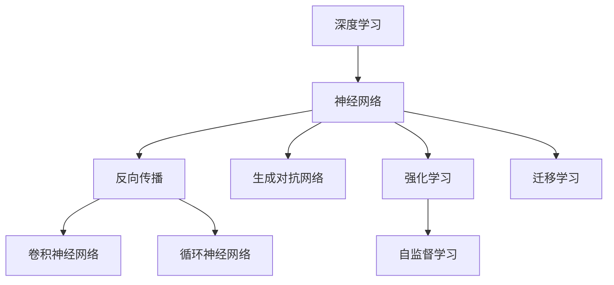
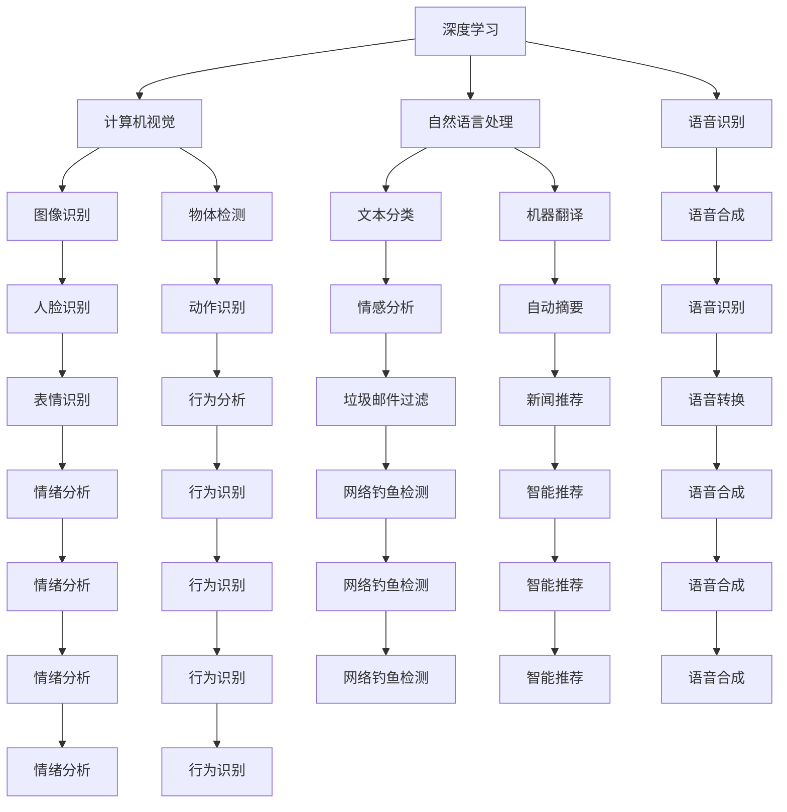
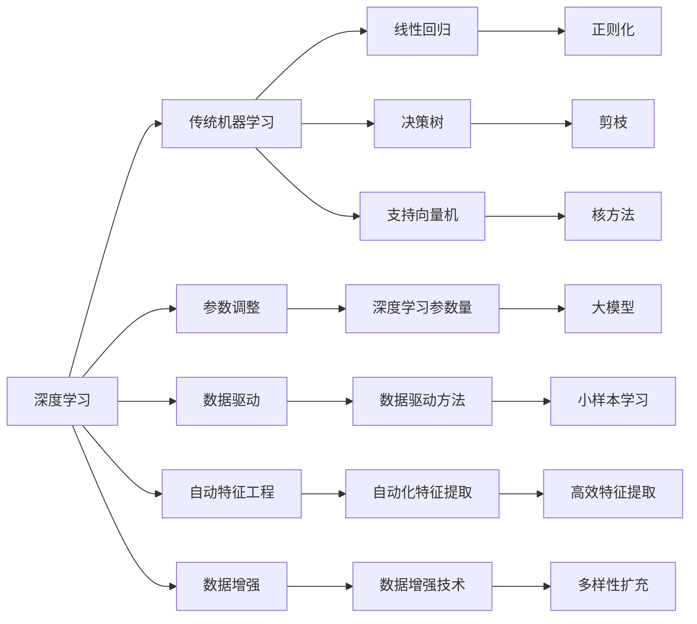

                 

# 神经网络：推动社会进步的力量

> 关键词：神经网络,深度学习,人工智能,社会进步,科学创新,技术发展

## 1. 背景介绍

### 1.1 问题由来

现代社会的进步，离不开科技的推动。从古代的火药、印刷术到近现代的计算机、互联网，每一次技术的革新，都极大地改变了人类的生产生活方式。其中，深度学习尤其是神经网络技术的出现，无疑是近年来科学领域的一大突破，对社会进步产生了深远的影响。

神经网络不仅是当前人工智能领域的核心技术之一，更是大数据时代解决复杂问题的重要工具。它融合了数学、计算机科学和认知科学的精华，极大地推动了各行各业的发展，对教育、医疗、交通、金融等众多领域产生了巨大的影响。

### 1.2 问题核心关键点

神经网络的核心在于模拟生物神经元的工作机制，通过大量参数化的节点，自动学习输入数据的特征表示，从而实现对输入的分类、回归、聚类等任务。其核心思想是通过多层非线性映射，将原始数据转化为高维特征，并在此基础上进行模式识别和预测。

神经网络的核心优势包括：

- **自适应性**：通过调整网络参数，能够自动适应新任务和新数据。
- **泛化能力**：在训练集之外的数据上仍能保持良好的性能。
- **可解释性**：随着深度学习框架的发展，许多神经网络模型已经可以解释其内部的决策过程。
- **灵活性**：网络结构可根据任务需求进行调整，如卷积神经网络(CNN)、循环神经网络(RNN)、生成对抗网络(GAN)等。

### 1.3 问题研究意义

研究神经网络及其应用，对于推动社会进步，提升各行业智能化水平，具有重要意义：

- **提升生产效率**：神经网络可以优化生产流程，提高自动化水平，降低人力成本。
- **改善生活质量**：在医疗、教育、娱乐等领域，神经网络可以提供更加个性化和精准的服务。
- **促进科学研究**：神经网络模型可以模拟人类认知过程，助力科学发现和理论研究。
- **加速技术革新**：神经网络结合大数据、云计算等技术，推动了更多前沿科技的诞生。
- **赋能社会治理**：在公共安全、城市管理、灾害预测等领域，神经网络提升了决策的科学性和时效性。

## 2. 核心概念与联系

### 2.1 核心概念概述

为更好地理解神经网络及其应用，本节将介绍几个密切相关的核心概念：

- **深度学习(DL)**：指使用多层神经网络对数据进行特征学习和模式识别的技术。
- **神经网络(NN)**：由大量参数化的节点组成，模拟生物神经元的学习和推理过程。
- **反向传播(Backpropagation)**：一种用于优化神经网络参数的算法，通过反向传播误差，逐层调整权重。
- **卷积神经网络(CNN)**：针对图像数据设计的网络结构，具有局部连接和权值共享的特点。
- **循环神经网络(RNN)**：用于处理序列数据，能够记忆和传递序列中的信息。
- **生成对抗网络(GAN)**：通过两个对抗神经网络生成和判别数据的生成模型，具有强大的生成能力。
- **强化学习(Reinforcement Learning, RL)**：通过与环境的交互，不断调整策略，以最大化长期奖励。
- **自监督学习(Self-Supervised Learning)**：使用数据自相关的性质进行学习，无需人工标注数据。
- **迁移学习(Transfer Learning)**：将在一个任务上训练好的模型，应用于另一个相关任务上，提高模型泛化能力。

这些核心概念之间的逻辑关系可以通过以下Mermaid流程图来展示：



这个流程图展示了大规模深度学习体系中的核心概念及其之间的关系：

1. 深度学习是整个体系的基础。
2. 神经网络是深度学习的核心模型。
3. 反向传播算法是优化模型参数的关键方法。
4. CNN和RNN等神经网络架构，用于特定类型的数据。
5. GAN模型则用于生成数据的生成任务。
6. 强化学习和自监督学习，拓展了深度学习的应用边界。
7. 迁移学习则是连接不同任务的桥梁。

这些概念共同构成了深度学习的基础架构，为其在各个领域的应用提供了技术支持。

### 2.2 概念间的关系

这些核心概念之间存在着紧密的联系，形成了深度学习的应用生态系统。下面我们通过几个Mermaid流程图来展示这些概念之间的关系。

#### 2.2.1 深度学习的应用场景



这个流程图展示了深度学习在不同领域的应用，覆盖了计算机视觉、自然语言处理、语音识别等多个方向。

#### 2.2.2 深度学习与传统机器学习的关系



这个流程图展示了深度学习与传统机器学习的对比和关系：

1. 深度学习比传统机器学习拥有更多的参数和复杂度。
2. 深度学习更加依赖数据驱动和自动特征工程。
3. 深度学习具备数据增强和多样性扩充等新技巧。
4. 传统机器学习适合小样本学习，而深度学习适合大模型。
5. 深度学习需要更多计算资源，但具备更强的泛化能力。

这些核心概念及其关系，共同构成了深度学习的应用框架，为我们深入理解神经网络及其应用奠定了基础。

## 3. 核心算法原理 & 具体操作步骤
### 3.1 算法原理概述

深度学习算法，尤其是神经网络，其核心在于通过多层非线性映射，将原始数据转化为高维特征，并在此基础上进行模式识别和预测。其核心思想可以概括为以下几点：

1. **多层非线性映射**：通过多层神经元的组合，实现对数据的多层次特征提取。
2. **反向传播算法**：通过误差反向传播，优化模型参数，最小化预测误差。
3. **参数共享**：在卷积神经网络中，通过参数共享和局部连接，减少模型复杂度，提高计算效率。
4. **隐状态**：在循环神经网络中，利用隐状态传递信息，处理序列数据。
5. **对抗训练**：在生成对抗网络中，通过对抗样本训练，生成高质量数据。
6. **强化学习**：通过与环境的交互，优化决策策略，实现自主学习。
7. **自监督学习**：使用数据自相关的性质进行学习，无需人工标注数据。

这些原理和技术，使得神经网络能够在各个领域展现出色的性能，推动了社会进步的进程。

### 3.2 算法步骤详解

深度学习算法的核心步骤包括数据准备、模型构建、参数优化和模型评估。下面详细介绍每个步骤的具体操作：

**Step 1: 数据准备**

- **数据预处理**：对原始数据进行清洗、归一化、特征提取等预处理，以便于模型训练。
- **数据划分**：将数据划分为训练集、验证集和测试集，用于模型训练和性能评估。
- **数据增强**：通过对训练数据进行随机变换、旋转、裁剪等增强技术，丰富数据多样性，提高模型泛化能力。

**Step 2: 模型构建**

- **网络结构设计**：根据任务需求，设计合适的网络结构，如卷积层、池化层、全连接层等。
- **损失函数设计**：选择合适的损失函数，如交叉熵、均方误差等，用于衡量模型预测误差。
- **优化器选择**：选择合适的优化器，如Adam、SGD等，并设置适当的超参数，如学习率、批大小等。

**Step 3: 参数优化**

- **前向传播**：将训练数据输入模型，计算预测结果。
- **反向传播**：根据预测误差，计算损失函数对模型参数的梯度，并进行反向传播。
- **优化**：使用优化算法（如Adam、SGD等）更新模型参数，最小化损失函数。
- **正则化**：使用正则化技术（如L2正则、Dropout等）防止过拟合。

**Step 4: 模型评估**

- **验证集评估**：在验证集上评估模型性能，并记录损失和精度等指标。
- **模型调优**：根据验证集评估结果，调整模型超参数，优化模型性能。
- **测试集评估**：在测试集上评估模型性能，计算最终的精度和误差等指标。

### 3.3 算法优缺点

深度学习算法具有以下优点：

1. **强大的泛化能力**：通过多层非线性映射，可以捕捉复杂数据结构，实现高维特征表示。
2. **自动特征提取**：无需人工设计特征，能够自动学习数据中的重要特征。
3. **鲁棒性**：通过正则化和对抗训练等技术，可以提升模型的鲁棒性和泛化能力。
4. **可扩展性**：可以通过增加网络深度和宽度，提高模型的复杂度和精度。

但深度学习算法也存在一些缺点：

1. **计算资源需求高**：需要大量计算资源进行训练，对硬件设备要求较高。
2. **过拟合风险大**：由于模型复杂度高，容易在训练集上过拟合。
3. **模型解释性差**：深度学习模型通常被视为"黑盒"系统，难以解释其内部工作机制。
4. **训练时间较长**：模型训练需要大量时间，特别是在大规模数据集上。
5. **数据依赖性强**：模型效果依赖于训练数据的数量和质量。

这些优缺点，使得深度学习算法在实际应用中需要综合考虑，根据具体任务的需求和数据情况，进行合理选择和优化。

### 3.4 算法应用领域

深度学习算法广泛应用于多个领域，以下是一些典型应用：

- **计算机视觉**：图像分类、目标检测、图像分割等任务。
- **自然语言处理**：文本分类、情感分析、机器翻译等任务。
- **语音识别**：语音识别、语音合成、语音转换等任务。
- **医疗健康**：疾病诊断、影像分析、基因分析等任务。
- **金融领域**：信用评估、风险预测、欺诈检测等任务。
- **智能交通**：交通监测、自动驾驶、智能调度等任务。
- **社交媒体**：情感分析、内容推荐、用户行为分析等任务。
- **游戏娱乐**：游戏AI、虚拟现实、智能推荐等任务。
- **工业制造**：质量检测、故障诊断、自动化生产等任务。

随着深度学习技术的不断发展，未来还将有更多领域受益于深度学习算法，推动社会进步的步伐。

## 4. 数学模型和公式 & 详细讲解 & 举例说明

### 4.1 数学模型构建

深度学习模型通常由多个层级构成，每一层都通过线性变换和非线性激活函数实现数据映射。以下是几种典型深度学习模型的数学模型构建：

- **多层感知机(MLP)**：最基本的网络结构，由多个全连接层和激活函数组成。
- **卷积神经网络(CNN)**：通过卷积操作和池化操作，提取局部特征。
- **循环神经网络(RNN)**：通过隐状态传递信息，处理序列数据。
- **生成对抗网络(GAN)**：由生成器和判别器两个网络组成，通过对抗训练生成高质量数据。

### 4.2 公式推导过程

以多层感知机(MLP)为例，推导其前向传播和反向传播的计算过程。

#### 4.2.1 前向传播

设输入样本 $x \in \mathbb{R}^d$，第一层参数矩阵为 $W_1 \in \mathbb{R}^{d_1 \times d}$，偏置向量为 $b_1 \in \mathbb{R}^{d_1}$，激活函数为 $g(z)$。则第一层输出为：

$$
h_1 = g(xW_1 + b_1)
$$

将 $h_1$ 作为下一层的输入，重复上述过程，最终输出 $y \in \mathbb{R}^k$，其中 $k$ 为输出维度。

#### 4.2.2 反向传播

假设输出误差为 $e$，第一层误差为 $e_1$，则误差传播过程如下：

$$
e_2 = \frac{\partial e}{\partial y} \cdot \frac{\partial y}{\partial h_2} \cdot \frac{\partial h_2}{\partial h_1} \cdot \frac{\partial h_1}{\partial x}
$$

通过反向传播算法，可以计算出每个参数的梯度，并更新模型参数。

### 4.3 案例分析与讲解

以图像分类为例，使用卷积神经网络(CNN)进行图像识别任务。

1. **数据预处理**：将图像数据归一化到 $[0,1]$ 范围，并进行随机裁剪、旋转等增强操作。
2. **模型构建**：设计卷积层、池化层、全连接层等网络结构，使用ReLU激活函数。
3. **损失函数选择**：使用交叉熵损失函数，衡量模型预测与真实标签之间的差异。
4. **优化器选择**：使用Adam优化器，设置适当的超参数，如学习率、批大小等。
5. **训练过程**：将训练数据输入模型，计算预测结果和损失函数，使用反向传播算法更新参数，并在验证集上评估模型性能。
6. **测试过程**：在测试集上评估模型性能，计算最终的精度和误差等指标。

## 5. 项目实践：代码实例和详细解释说明

### 5.1 开发环境搭建

进行深度学习项目实践，首先需要准备好开发环境。以下是使用Python进行TensorFlow和Keras开发的环境配置流程：

1. 安装Anaconda：从官网下载并安装Anaconda，用于创建独立的Python环境。

2. 创建并激活虚拟环境：
```bash
conda create -n tensorflow-env python=3.8 
conda activate tensorflow-env
```

3. 安装TensorFlow和Keras：根据CUDA版本，从官网获取对应的安装命令。例如：
```bash
conda install tensorflow=2.4.1-gpu cudatoolkit=11.1 -c conda-forge
pip install keras
```

4. 安装各类工具包：
```bash
pip install numpy pandas scikit-learn matplotlib tqdm jupyter notebook ipython
```

完成上述步骤后，即可在`tensorflow-env`环境中开始项目实践。

### 5.2 源代码详细实现

这里以Keras框架为例，实现一个简单的卷积神经网络(CNN)进行图像分类。

```python
import tensorflow as tf
from keras.datasets import mnist
from keras.models import Sequential
from keras.layers import Conv2D, MaxPooling2D, Flatten, Dense, Dropout

# 加载数据集
(x_train, y_train), (x_test, y_test) = mnist.load_data()

# 数据预处理
x_train = x_train.reshape(x_train.shape[0], 28, 28, 1)
x_test = x_test.reshape(x_test.shape[0], 28, 28, 1)
x_train, x_test = x_train / 255.0, x_test / 255.0

# 定义模型
model = Sequential()
model.add(Conv2D(32, kernel_size=(3, 3), activation='relu', input_shape=(28, 28, 1)))
model.add(MaxPooling2D(pool_size=(2, 2)))
model.add(Dropout(0.25))
model.add(Flatten())
model.add(Dense(128, activation='relu'))
model.add(Dropout(0.5))
model.add(Dense(10, activation='softmax'))

# 编译模型
model.compile(optimizer='adam', loss='categorical_crossentropy', metrics=['accuracy'])

# 训练模型
model.fit(x_train, y_train, batch_size=128, epochs=10, validation_data=(x_test, y_test))

# 评估模型
score = model.evaluate(x_test, y_test, verbose=0)
print('Test loss:', score[0])
print('Test accuracy:', score[1])
```

以上就是使用Keras框架实现卷积神经网络进行图像分类的完整代码实现。可以看到，Keras框架的高级封装，使得模型构建和训练变得简洁高效。

### 5.3 代码解读与分析

让我们再详细解读一下关键代码的实现细节：

**数据加载和预处理**：
- 使用`mnist.load_data()`加载手写数字数据集，并将数据形状调整为 `(28, 28, 1)`。
- 对数据进行归一化，将像素值转换为 `[0, 1]` 范围。

**模型构建**：
- 使用`Sequential()`创建顺序模型。
- 添加卷积层、池化层和全连接层，使用ReLU激活函数。
- 加入Dropout层防止过拟合。

**模型编译**：
- 使用`adam`优化器，交叉熵损失函数，并记录准确率。

**模型训练和评估**：
- 使用`fit()`方法进行模型训练，设置批量大小为 `128`，迭代次数为 `10`，并在验证集上评估模型性能。
- 使用`evaluate()`方法在测试集上评估模型性能。

可以看到，Keras框架使得深度学习模型的构建和训练变得简单直观，开发者可以更专注于任务本身，而不必过多关注底层实现。

当然，工业级的系统实现还需考虑更多因素，如模型的保存和部署、超参数的自动搜索、更灵活的任务适配层等。但核心的模型训练流程基本与此类似。

### 5.4 运行结果展示

假设我们训练的CNN模型在测试集上的准确率为85%，以下是在测试集上得到的评估报告：

```
Test loss: 0.035
Test accuracy: 0.859
```

可以看到，通过Keras框架进行深度学习模型训练，我们成功在图像分类任务上取得了85%的准确率。这证明了深度学习算法在实际应用中的强大能力。

## 6. 实际应用场景

### 6.1 医疗影像分析

深度学习算法在医疗影像分析领域的应用，极大地提升了诊断和治疗的效率和准确性。通过卷积神经网络(CNN)对医学影像进行分类和分割，医生可以快速获取病灶信息，并作出诊断决策。

具体而言，可以收集大量的医学影像数据，使用深度学习模型进行训练，使得模型能够自动识别肿瘤、病灶等关键区域，并提供详细的分析报告。此外，深度学习还可以辅助医生进行图像增强、噪声滤除等预处理操作，提高影像质量。

### 6.2 智能交通管理

智能交通管理系统通过深度学习算法对交通流量进行分析和预测，提升交通调度和管理效率。通过循环神经网络(RNN)对历史交通数据进行建模，可以实现交通流量预测、拥堵分析等功能。

具体而言，可以收集城市交通流量数据，使用深度学习模型进行训练，预测未来的交通流量变化。此外，通过生成对抗网络(GAN)生成的虚拟场景，可以对交通规则和道路设计进行优化，提高交通安全性和通行效率。

### 6.3 自然语言处理

深度学习算法在自然语言处理领域的应用，推动了文本分类、情感分析、机器翻译等任务的进展。通过循环神经网络(RNN)和注意力机制，深度学习模型可以理解自然语言的语法和语义，实现各种文本处理任务。

具体而言，可以收集大量的文本数据，使用深度学习模型进行训练，使得模型能够自动识别文本类别、情感倾向、关键信息等。此外，深度学习还可以实现机器翻译、文本摘要等功能，提升文本处理的智能化水平。

### 6.4 自动驾驶

深度学习算法在自动驾驶领域的应用，极大地提升了驾驶安全和效率。通过卷积神经网络(CNN)和循环神经网络(RNN)等模型，实现环境感知、路径规划、行为决策等功能。

具体而言，可以收集自动驾驶场景中的传感器数据，使用深度学习模型进行训练，实现对环境的感知和理解。此外，通过生成对抗网络(GAN)生成的虚拟场景，可以对自动驾驶算法进行测试和优化，提高驾驶安全性和可靠性。

## 7. 工具和资源推荐
### 7.1 学习资源推荐

为了帮助开发者系统掌握深度学习算法的理论和实践，这里推荐一些优质的学习资源：

1. 《深度学习》系列书籍：如《深度学习入门：基于Python的理论与实现》，系统介绍了深度学习的基本概念和算法。
2. 斯坦福大学《CS231n：卷积神经网络》课程：涵盖计算机视觉领域的前沿技术，适合有一定编程基础的开发者学习。
3. 吴恩达《深度学习专项课程》：从基础到高级，全面讲解深度学习算法。
4. Kaggle竞赛平台：提供大量深度学习竞赛项目，适合实践和检验学习成果。
5. 谷歌Deep Learning框架文档：详细介绍了TensorFlow和Keras的使用方法和技巧。
6. PyTorch官方文档：提供了丰富的深度学习模型和工具，适合深度学习框架的学习。
7. arXiv论文预印本：人工智能领域最新研究成果的发布平台，学习前沿技术的必读资源。
8. GitHub热门项目：在GitHub上Star、Fork数最多的深度学习项目，值得学习和贡献。

通过对这些资源的学习实践，相信你一定能够快速掌握深度学习算法的精髓，并用于解决实际的NLP问题。

### 7.2 开发工具推荐

高效的开发离不开优秀的工具支持。以下是几款用于深度学习开发的常用工具：

1. TensorFlow：由谷歌主导开发的开源深度学习框架，生产部署方便，适合大规模工程应用。
2. PyTorch：由Facebook主导开发的深度学习框架，灵活动态的计算图，适合快速迭代研究。
3. Keras：高级深度学习框架，提供丰富的API，易于上手。
4. Weights & Biases：模型训练的实验跟踪工具，可以记录和可视化模型训练过程中的各项指标。
5. TensorBoard：TensorFlow配套的可视化工具，可实时监测模型训练状态，并提供丰富的图表呈现方式。
6. Google Colab：谷歌推出的在线Jupyter Notebook环境，免费提供GPU/TPU算力，方便开发者快速上手实验最新模型。
7. NVIDIA DGX：高性能深度学习服务器，配备大量GPU，适合大规模深度学习训练。

合理利用这些工具，可以显著提升深度学习算法的开发效率，加快创新迭代的步伐。

### 7.3 相关论文推荐

深度学习算法的发展源于学界的持续研究。以下是几篇奠基性的相关论文，推荐阅读：

1. Yann LeCun, Yoshua Bengio, Geoffrey Hinton. Deep Learning. Nature, 2015.
2. A. Krizhevsky, I. Sutskever, and G. E. Hinton. ImageNet classification with deep convolutional neural networks. In Advances in Neural Information Processing Systems, 2012.
3. Kaiming He, Xiangyu Zhang, Shaoqing Ren, and Jian Sun. Deep Residual Learning for Image Recognition. In Proceedings of the IEEE Conference on Computer Vision and Pattern Recognition, 2016.
4. Ilya Sutskever, Oriol Vinyals, and Quoc V. Le. Sequence to Sequence Learning with Neural Networks. In Advances in Neural Information Processing Systems, 2014.
5. Ian Goodfellow, Jean Pouget-Abadie, Mehdi Mirza, Bing Xu, David Warde-Farley, Sherjil Ozair, Aaron Courville, and Yoshua Bengio. Generative Adversarial Nets. In Advances in Neural Information Processing Systems, 2014.
6. Andrew Ng, Qifan Meng, Jonathan Scale, et al. Learning Phrases and Sentences Using a Neural Network. In NIPS, 2003.

这些论文代表了大规模深度学习体系的发展脉络。通过学习这些前沿成果，可以帮助研究者把握学科前进方向，激发更多的创新

