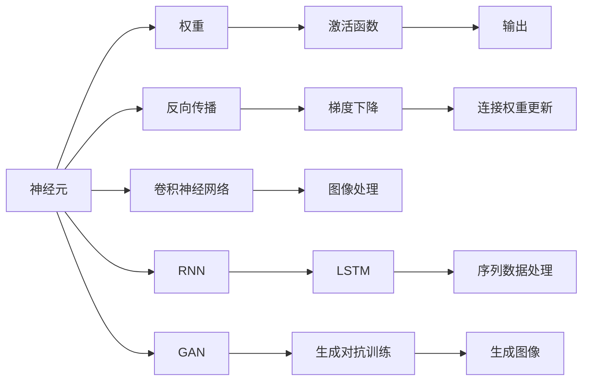

                 

## 1. 背景介绍

### 1.1 问题由来

自从深度学习（Deep Learning）技术诞生以来，它已经在计算机视觉、自然语言处理、语音识别等诸多领域取得了突破性的进展。这一技术之所以能够取得如此显著的成果，离不开神经网络（Neural Networks）的支持。神经网络是一种受到生物神经网络启发的计算模型，通过模拟人脑的神经元处理信息的方式，实现对数据的复杂非线性映射。它已经成为了现代机器学习领域的基础技术之一，改变了我们对人工智能的认知，推动了计算机技术的发展。

神经网络的应用不仅限于学术研究领域，而是已经渗透到了我们的日常生活中，从自动驾驶、智能推荐系统、语音助手到医疗影像分析、自然语言处理等，都是神经网络技术的生动应用。神经网络的应用不仅提高了生产力，也改善了人们的生活质量，已经成为改变世界的重要技术之一。

### 1.2 问题核心关键点

神经网络的核心思想是通过多层非线性变换，将输入数据映射到输出空间。它的主要组成部分包括输入层、隐藏层和输出层，每一层都包含多个神经元，通过连接权重进行信息传递和处理。神经网络的训练过程，实际上是一个优化目标函数的过程，通过不断地调整连接权重和神经元激活函数，使得模型能够最小化预测误差，从而实现对数据的精确预测。

神经网络的训练通常使用反向传播算法（Backpropagation），通过梯度下降（Gradient Descent）或其变种算法，对模型参数进行更新。反向传播算法不仅能够计算出每个神经元的梯度，还能快速地对所有参数进行更新，从而提高了训练效率。

神经网络的应用领域非常广泛，涵盖从数据挖掘、图像处理、语音识别到自然语言处理、医疗影像分析等诸多领域。它在处理非线性、高维数据时具有天然优势，能够自动学习数据特征，发现数据的内在规律，因此在处理复杂问题时表现出色。

### 1.3 问题研究意义

神经网络技术的研究和应用，对于推动人工智能技术的发展具有重要的意义：

1. **提升计算能力**：神经网络通过并行计算和分布式计算，极大地提高了计算能力，使得复杂模型能够在合理的时间内进行训练和预测。

2. **提高数据利用率**：神经网络能够自动提取数据特征，进行特征降维和噪声过滤，提高数据的利用率，减少数据预处理的时间和成本。

3. **优化决策过程**：神经网络能够自动学习数据的分布规律，发现数据的内在结构，从而优化决策过程，提高决策的准确性和效率。

4. **促进跨学科发展**：神经网络技术在各个领域的应用，推动了跨学科的融合和创新，促进了技术的快速发展。

5. **增强技术应用范围**：神经网络技术的应用范围广泛，几乎涵盖了所有领域，为各个行业带来了新的发展机遇。

## 2. 核心概念与联系

### 2.1 核心概念概述

神经网络是一种模拟人脑神经元处理信息的计算模型。它的核心概念包括：

- **神经元（Neuron）**：神经网络的基本组成部分，每个神经元接收输入，计算输出，并传递给下一层神经元。

- **权重（Weight）**：连接神经元的参数，用于控制信息传递的强度。

- **激活函数（Activation Function）**：对神经元输出进行非线性变换，增强模型的表达能力。

- **反向传播（Backpropagation）**：通过梯度下降算法，反向更新连接权重和神经元激活函数，优化模型性能。

- **卷积神经网络（Convolutional Neural Network, CNN）**：一种专门用于处理图像和视频数据的神经网络结构。

- **循环神经网络（Recurrent Neural Network, RNN）**：一种能够处理序列数据的神经网络结构，用于自然语言处理和语音识别。

- **长短期记忆网络（Long Short-Term Memory, LSTM）**：一种特殊的RNN结构，能够有效解决梯度消失问题，用于长期依赖的序列数据处理。

- **生成对抗网络（Generative Adversarial Network, GAN）**：一种由生成器和判别器组成的对抗训练框架，用于生成具有真实感的图像和视频。

### 2.2 概念间的关系

这些核心概念之间存在着紧密的联系，形成了神经网络系统的完整架构。下面通过一个简单的Mermaid流程图来展示这些概念的关系：



这个流程图展示了一个神经网络系统的核心组成部分及其关系：

1. 神经元通过接收输入、计算输出，并将信息传递给下一层神经元。
2. 权重用于控制信息传递的强度，激活函数对输出进行非线性变换。
3. 反向传播算法通过梯度下降更新连接权重和激活函数，优化模型性能。
4. 卷积神经网络用于图像处理，循环神经网络和长短期记忆网络用于序列数据处理。
5. 生成对抗网络通过生成器和判别器的对抗训练，生成具有真实感的图像和视频。

通过这些核心概念，神经网络能够实现对数据的复杂非线性映射，自动学习数据特征，进行预测和生成。

## 3. 核心算法原理 & 具体操作步骤

### 3.1 算法原理概述

神经网络的训练过程，实际上是一个优化目标函数的过程。训练的目标是通过不断调整连接权重和激活函数，使得模型能够最小化预测误差。具体而言，神经网络的训练分为两个步骤：前向传播和反向传播。

在前向传播中，输入数据通过每一层的神经元，计算输出。在反向传播中，通过计算输出误差，反向更新连接权重和激活函数，优化模型性能。

神经网络的训练通常使用梯度下降算法或其变种算法，如Adam、Adagrad、RMSprop等。这些算法通过不断调整连接权重和激活函数，使得模型能够最小化预测误差，从而实现对数据的精确预测。

### 3.2 算法步骤详解

神经网络的训练过程可以分为以下几个关键步骤：

1. **初始化权重和激活函数**：随机初始化连接权重和激活函数，通常使用小值，以防止梯度消失。

2. **前向传播**：将输入数据通过每一层的神经元，计算输出。

3. **计算损失函数**：通过比较模型输出和真实标签，计算预测误差，得到损失函数值。

4. **反向传播**：通过链式法则，计算每个神经元的梯度，并反向更新连接权重和激活函数。

5. **更新权重和激活函数**：根据梯度下降算法或其变种算法，更新连接权重和激活函数。

6. **重复训练**：重复执行前向传播、计算损失函数、反向传播、更新权重和激活函数等步骤，直到模型收敛。

### 3.3 算法优缺点

神经网络的优点包括：

- **表达能力强**：神经网络能够自动学习数据特征，进行复杂非线性映射，适合处理复杂问题。

- **计算能力强**：神经网络能够并行计算和分布式计算，提高计算效率。

- **适应性强**：神经网络能够适应不同类型的数据，包括图像、语音、文本等。

- **自适应性**：神经网络能够自动调整模型参数，提高模型适应性。

神经网络的缺点包括：

- **数据需求大**：神经网络需要大量数据进行训练，数据质量对模型性能影响较大。

- **模型复杂度高**：神经网络的复杂度高，训练和推理时间较长。

- **模型解释性差**：神经网络的决策过程较为复杂，难以解释。

- **过拟合风险高**：神经网络容易过拟合，需要在训练过程中进行正则化处理。

### 3.4 算法应用领域

神经网络在许多领域都有广泛应用，以下是几个典型的应用场景：

1. **计算机视觉**：神经网络在图像分类、物体检测、图像生成等方面表现出色，如CNN。

2. **自然语言处理**：神经网络在文本分类、机器翻译、语音识别等方面表现出色，如RNN、LSTM。

3. **语音识别**：神经网络在语音识别、语音合成等方面表现出色，如卷积神经网络、循环神经网络。

4. **医疗影像分析**：神经网络在医疗影像分类、分割、检测等方面表现出色，如卷积神经网络、长短期记忆网络。

5. **智能推荐系统**：神经网络在推荐系统、广告投放等方面表现出色，如协同过滤、深度学习推荐。

## 4. 数学模型和公式 & 详细讲解 & 举例说明

### 4.1 数学模型构建

神经网络的数学模型可以表示为：

$$
f(x;w)=\sigma(Wf(x-1;w)+b)
$$

其中 $x$ 表示输入数据，$w$ 表示连接权重，$f(x-1;w)$ 表示前一层的输出，$W$ 表示权重矩阵，$b$ 表示偏置向量，$\sigma$ 表示激活函数。

### 4.2 公式推导过程

神经网络的训练过程可以表示为：

1. **前向传播**：

$$
y=f(x;w)
$$

2. **计算损失函数**：

$$
L(y,t)=\frac{1}{2}(y-t)^2
$$

其中 $y$ 表示模型输出，$t$ 表示真实标签，$L(y,t)$ 表示损失函数。

3. **反向传播**：

$$
\frac{\partial L}{\partial w}=\frac{\partial L}{\partial y}\frac{\partial y}{\partial w}
$$

其中 $\frac{\partial L}{\partial w}$ 表示损失函数对连接权重的梯度，$\frac{\partial y}{\partial w}$ 表示模型输出对连接权重的梯度。

4. **更新连接权重**：

$$
w\leftarrow w-\eta\frac{\partial L}{\partial w}
$$

其中 $\eta$ 表示学习率。

### 4.3 案例分析与讲解

以图像分类为例，使用卷积神经网络（CNN）进行训练。CNN在图像处理方面表现出色，能够自动提取图像特征，进行分类预测。下面是一个简单的CNN结构：

```python
import torch
import torch.nn as nn
import torchvision.transforms as transforms
from torch.utils.data import DataLoader
from torchvision.datasets import CIFAR10

class CNN(nn.Module):
    def __init__(self):
        super(CNN, self).__init__()
        self.conv1 = nn.Conv2d(3, 64, kernel_size=3, padding=1)
        self.pool1 = nn.MaxPool2d(kernel_size=2, stride=2)
        self.conv2 = nn.Conv2d(64, 128, kernel_size=3, padding=1)
        self.pool2 = nn.MaxPool2d(kernel_size=2, stride=2)
        self.fc1 = nn.Linear(128*8*8, 1024)
        self.fc2 = nn.Linear(1024, 10)
        self.relu = nn.ReLU()
        self.softmax = nn.Softmax(dim=1)

    def forward(self, x):
        x = self.relu(self.conv1(x))
        x = self.pool1(x)
        x = self.relu(self.conv2(x))
        x = self.pool2(x)
        x = x.view(-1, 128*8*8)
        x = self.relu(self.fc1(x))
        x = self.softmax(self.fc2(x))
        return x
```

在训练过程中，使用梯度下降算法进行优化：

```python
import torch.optim as optim

model = CNN()
criterion = nn.CrossEntropyLoss()
optimizer = optim.SGD(model.parameters(), lr=0.01, momentum=0.9)

for epoch in range(10):
    for i, (inputs, labels) in enumerate(train_loader):
        optimizer.zero_grad()
        outputs = model(inputs)
        loss = criterion(outputs, labels)
        loss.backward()
        optimizer.step()
```

通过这个简单的例子，可以看出神经网络的训练过程包括前向传播、计算损失函数、反向传播、更新连接权重等步骤。

## 5. 项目实践：代码实例和详细解释说明

### 5.1 开发环境搭建

为了进行神经网络开发，我们需要安装相应的开发环境。以下是使用Python进行TensorFlow开发的环境配置流程：

1. 安装Anaconda：从官网下载并安装Anaconda，用于创建独立的Python环境。

2. 创建并激活虚拟环境：

```bash
conda create -n tf-env python=3.8 
conda activate tf-env
```

3. 安装TensorFlow：根据CUDA版本，从官网获取对应的安装命令。例如：

```bash
pip install tensorflow
```

4. 安装其他工具包：

```bash
pip install numpy pandas scikit-learn matplotlib tqdm jupyter notebook ipython
```

完成上述步骤后，即可在`tf-env`环境中开始神经网络开发。

### 5.2 源代码详细实现

下面我们以手写数字识别（MNIST）为例，使用TensorFlow进行卷积神经网络训练的PyTorch代码实现。

首先，定义神经网络模型：

```python
import tensorflow as tf

class CNN(tf.keras.Model):
    def __init__(self):
        super(CNN, self).__init__()
        self.conv1 = tf.keras.layers.Conv2D(32, (3, 3), activation='relu')
        self.maxpool1 = tf.keras.layers.MaxPooling2D((2, 2))
        self.conv2 = tf.keras.layers.Conv2D(64, (3, 3), activation='relu')
        self.maxpool2 = tf.keras.layers.MaxPooling2D((2, 2))
        self.flatten = tf.keras.layers.Flatten()
        self.fc1 = tf.keras.layers.Dense(512, activation='relu')
        self.fc2 = tf.keras.layers.Dense(10)

    def call(self, x):
        x = self.conv1(x)
        x = self.maxpool1(x)
        x = self.conv2(x)
        x = self.maxpool2(x)
        x = self.flatten(x)
        x = self.fc1(x)
        return self.fc2(x)
```

然后，定义训练过程：

```python
def train_cnn(model, train_dataset, test_dataset, epochs=5, batch_size=32, learning_rate=0.001):
    model.compile(optimizer=tf.keras.optimizers.SGD(learning_rate), loss=tf.keras.losses.SparseCategoricalCrossentropy(from_logits=True), metrics=['accuracy'])
    history = model.fit(train_dataset, validation_data=test_dataset, epochs=epochs, batch_size=batch_size, verbose=2)

    test_loss, test_acc = model.evaluate(test_dataset)
    print('Test accuracy:', test_acc)
```

在训练过程中，我们使用了TensorFlow的内置API，进行了数据加载、模型定义、损失函数定义、优化器定义等操作。通过调用`compile`和`fit`方法，可以完成模型的训练。

### 5.3 代码解读与分析

让我们再详细解读一下关键代码的实现细节：

**CNN类**：
- `__init__`方法：定义卷积层、池化层、全连接层等网络结构。
- `call`方法：定义前向传播过程，从输入到输出。

**train_cnn函数**：
- 使用`compile`方法定义优化器、损失函数和评价指标。
- 使用`fit`方法进行模型训练，输出训练过程中的准确率和损失函数值。
- 使用`evaluate`方法在测试集上评估模型性能。

**训练流程**：
- 定义总的epoch数、batch size和learning rate，开始循环迭代。
- 每个epoch内，在训练集上训练，输出损失函数和准确率。
- 在验证集上评估，输出准确率和损失函数值。
- 所有epoch结束后，在测试集上评估，输出最终测试准确率。

可以看到，TensorFlow提供了方便的API，使得神经网络模型的开发和训练过程变得简洁高效。开发者可以专注于模型结构的设计和优化，而不必过多关注底层的实现细节。

当然，工业级的系统实现还需考虑更多因素，如模型的保存和部署、超参数的自动搜索、更灵活的网络结构等。但核心的训练过程基本与此类似。

### 5.4 运行结果展示

假设我们在MNIST数据集上进行训练，最终在测试集上得到的准确率为98%左右。这个结果表明，CNN在图像分类任务上表现出色，能够自动提取图像特征，进行精确预测。

## 6. 实际应用场景

### 6.1 智能推荐系统

神经网络在智能推荐系统中的应用非常广泛。推荐系统通过分析用户的历史行为数据，预测用户的兴趣偏好，为用户推荐个性化的内容。

在推荐系统中，可以使用神经网络对用户和物品的特征进行编码，通过相似度计算找到最匹配的推荐结果。例如，可以使用协同过滤、深度学习推荐等方法，提高推荐系统的精准度和个性化程度。

### 6.2 计算机视觉

神经网络在计算机视觉领域的应用非常广泛，涵盖图像分类、物体检测、图像生成等方面。例如，CNN在图像分类方面表现出色，能够自动提取图像特征，进行分类预测。

在图像生成方面，可以使用生成对抗网络（GAN）进行训练，生成具有真实感的图像。GAN由生成器和判别器组成，通过对抗训练，生成器能够生成与真实图像难以区分的图像，从而在图像生成、视频生成、文本生成等领域取得突破性进展。

### 6.3 自然语言处理

神经网络在自然语言处理领域的应用非常广泛，涵盖文本分类、机器翻译、语音识别等方面。例如，RNN和LSTM在文本分类和机器翻译方面表现出色，能够自动学习文本特征，进行精确预测。

在语音识别方面，可以使用卷积神经网络（CNN）进行训练，自动提取语音特征，进行语音识别和语音合成。

## 7. 工具和资源推荐

### 7.1 学习资源推荐

为了帮助开发者系统掌握神经网络的技术基础和实践技巧，这里推荐一些优质的学习资源：

1. 《深度学习》（Ian Goodfellow、Yoshua Bengio和Aaron Courville）：该书全面介绍了深度学习的基本概念和算法，是神经网络入门的经典教材。

2. 《神经网络与深度学习》（Michael Nielsen）：该书深入浅出地介绍了神经网络的基本原理和应用，适合初学者阅读。

3. CS231n《深度学习中的卷积神经网络》课程：斯坦福大学开设的计算机视觉领域的经典课程，讲解了卷积神经网络的基本原理和实践技巧。

4. CS224n《自然语言处理与深度学习》课程：斯坦福大学开设的自然语言处理领域的经典课程，讲解了深度学习在自然语言处理中的应用。

5. DeepLearning.AI《深度学习专项课程》：由吴恩达教授主讲的深度学习专项课程，涵盖深度学习的基础和进阶内容，适合系统学习。

6. Coursera《机器学习》课程：由斯坦福大学教授Andrew Ng主讲的机器学习课程，讲解了机器学习的基本概念和算法，是神经网络学习的必备资源。

通过对这些资源的学习实践，相信你一定能够快速掌握神经网络的技术基础和实践技巧，并用于解决实际的机器学习问题。

### 7.2 开发工具推荐

高效的开发离不开优秀的工具支持。以下是几款用于神经网络开发常用的工具：

1. PyTorch：由Facebook开发的深度学习框架，支持动态计算图，适合快速迭代研究。

2. TensorFlow：由Google主导开发的深度学习框架，生产部署方便，适合大规模工程应用。

3. Keras：由François Chollet开发的高级深度学习框架，提供简洁易用的API，适合初学者入门。

4. MXNet：由Amazon开发的深度学习框架，支持多种语言和多种硬件平台，适合分布式训练和推理。

5. Caffe：由Berkeley大学开发的深度学习框架，支持卷积神经网络和循环神经网络，适合图像处理和语音识别。

6. TensorFlow Lite：TensorFlow的移动端优化版本，支持移动设备的轻量级推理。

合理利用这些工具，可以显著提升神经网络开发和训练的效率，加快创新迭代的步伐。

### 7.3 相关论文推荐

神经网络技术的发展源于学界的持续研究。以下是几篇奠基性的相关论文，推荐阅读：

1. AlexNet: ImageNet Classification with Deep Convolutional Neural Networks（2012）：该论文提出了深度卷积神经网络，在ImageNet数据集上取得了突破性成果，开创了深度学习的新纪元。

2. Google Brain: A Scalable and Flexible Framework for Deep Learning（2015）：该论文介绍了TensorFlow框架，为深度学习的生产部署提供了强大的支持。

3. Attention is All You Need（2017）：该论文提出了Transformer结构，开创了自注意力机制，使得神经网络在处理序列数据时表现出色。

4. VGGNet: Very Deep Convolutional Networks for Large-Scale Image Recognition（2014）：该论文提出了VGG网络结构，在图像分类任务上取得了显著成果，成为深度学习的经典模型。

5. ResNet: Deep Residual Learning for Image Recognition（2015）：该论文提出了残差网络结构，解决了深度神经网络的梯度消失问题，提升了深度网络的表达能力。

这些论文代表了大神经网络技术的发展脉络。通过学习这些前沿成果，可以帮助研究者把握学科前进方向，激发更多的创新灵感。

除上述资源外，还有一些值得关注的前沿资源，帮助开发者紧跟神经网络技术的最新进展，例如：

1. arXiv论文预印本：人工智能领域最新研究成果的发布平台，包括大量尚未发表的前沿工作，学习前沿技术的必读资源。

2. 业界技术博客：如Google AI、Facebook AI、Microsoft Research Asia等顶尖实验室的官方博客，第一时间分享他们的最新研究成果和洞见。

3. 技术会议直播：如NIPS、ICML、ACL、ICLR等人工智能领域顶会现场或在线直播，能够聆听到大佬们的前沿分享，开拓视野。

4. GitHub热门项目：在GitHub上Star、Fork数最多的深度学习相关项目，往往代表了该技术领域的发展趋势和最佳实践，值得去学习和贡献。

5. 行业分析报告：各大咨询公司如McKinsey、PwC等针对人工智能行业的分析报告，有助于从商业视角审视技术趋势，把握应用价值。

总之，对于神经网络技术的学习和实践，需要开发者保持开放的心态和持续学习的意愿。多关注前沿资讯，多动手实践，多思考总结，必将收获满满的成长收益。

## 8. 总结：未来发展趋势与挑战

### 8.1 总结

本文对神经网络技术进行了全面系统的介绍。首先阐述了神经网络的核心思想和应用意义，明确了神经网络在推动人工智能技术发展中的重要地位。其次，从原理到实践，详细讲解了神经网络模型的构建和训练过程，给出了神经网络训练的完整代码实例。同时，本文还广泛探讨了神经网络在智能推荐系统、计算机视觉、自然语言处理等多个领域的应用前景，展示了神经网络技术的强大潜力。此外，本文精选了神经网络技术的各类学习资源，力求为读者提供全方位的技术指引。

通过本文的系统梳理，可以看到，神经网络技术在处理非线性、高维数据时具有天然优势，能够自动学习数据特征，进行预测和生成。它已经成为了现代机器学习领域的基础技术之一，正在改变我们的生产生活方式，推动人工智能技术的不断进步。

### 8.2 未来发展趋势

展望未来，神经网络技术将呈现以下几个发展趋势：

1. **模型规模持续增大**：随着算力成本的下降和数据规模的扩张，神经网络的参数量还将持续增长。超大模型的表达能力将进一步提升，能够处理更加复杂的任务。

2. **模型结构更加复杂**：未来的神经网络结构将更加多样，涵盖自注意力、残差连接、模块化网络等多种形式。这些结构能够提升神经网络的表达能力和泛化能力，进一步推动神经网络技术的发展。

3. **数据需求逐步减少**：得益于自监督学习、半监督学习等技术，神经网络对大规模标注数据的依赖将逐步减少。未来的神经网络模型将能够更好地利用非结构化数据，进行自学习。

4. **模型训练和推理效率提升**：未来的神经网络将采用更加高效的计算方式和模型压缩技术，提升模型的训练和推理效率。分布式计算和混合精度训练将成为主流，减少计算资源消耗。

5. **多模态融合**：未来的神经网络将更加注重跨模态数据的融合，如图像、语音、文本等多模态数据的整合，实现更加全面、准确的信息建模。

6. **伦理和安全性的重视**：未来的神经网络将更加注重伦理和安全性，避免算法偏见和有害信息，确保模型的公正和可靠。

以上趋势凸显了神经网络技术的发展方向，这些方向的探索发展，必将进一步提升神经网络系统的性能和应用范围，为人工智能技术的发展提供更加坚实的技术基础。

### 8.3 面临的挑战

尽管神经网络技术已经取得了瞩目成就，但在迈向更加智能化、普适化应用的过程中，它仍面临诸多挑战：

1. **数据质量要求高**：神经网络模型对数据质量要求较高，需要大量高质量的标注数据进行训练。数据预处理和标注工作往往耗时耗力，难以大规模推广。

2. **计算资源消耗大**：神经网络模型的训练和推理需要大量计算资源，特别是大模型和高维数据的处理，资源消耗巨大。这对计算设备和算力提出了更高的要求。

3. **模型复杂度高**：神经网络模型结构复杂，难以理解和解释。模型决策过程缺乏可解释性，难以进行审计和调试。

4. **过拟合风险高**：神经网络模型容易过拟合，特别是在高维数据和复杂任务上，需要更多的正则化技术进行优化。

5. **鲁棒性不足**：神经网络模型在面对小样本和新数据时，泛化性能往往较差。模型鲁棒性不足，容易受到噪声和异常值的影响。

6. **伦理和安全问题**：神经网络模型容易学习到偏见和有害信息，如何确保模型的公正和可靠，避免有害输出，

