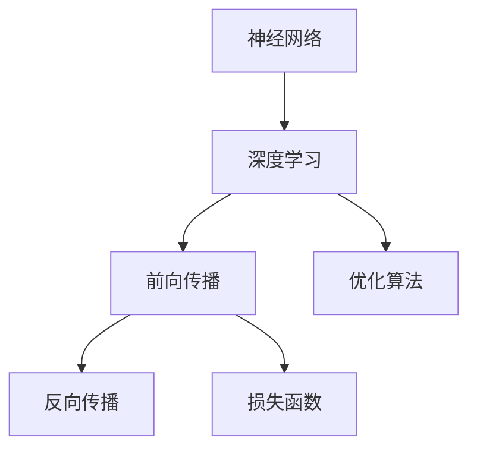
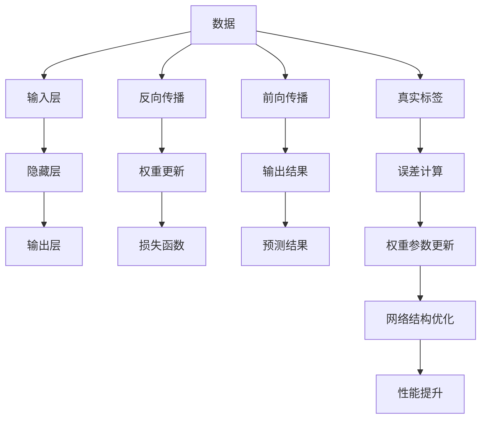

                 

# 神经网络：改变世界的技术

## 1. 背景介绍

### 1.1 问题由来

自20世纪80年代以来，神经网络（Neural Networks）这一术语频繁出现在人工智能和计算机科学的文献和实践中。作为一种模仿人脑结构和功能的计算模型，神经网络在处理复杂的模式识别和预测问题上表现出色。它不仅在学术界引发了一场革命，也在工业界引发了广泛的应用。

神经网络之所以能够改变世界，原因在于其独特的学习能力和强大的适应性。它能够从大量数据中学习复杂的非线性关系，并且这种学习能力在深度学习时代得到了极大的提升。深度学习算法中，多层神经网络的广泛应用使其成为了当今人工智能领域的核心技术之一。

### 1.2 问题核心关键点

神经网络的核心原理在于其“黑箱”结构。网络中的每个神经元接收输入，经过一系列的加权运算和激活函数处理后，输出新的信号。这种“黑箱”结构允许神经网络处理极其复杂的模式，通过学习从大量数据中提取特征，并预测未来事件。

神经网络的学习过程包括两个关键步骤：前向传播和反向传播。前向传播是指输入数据通过网络逐层传递，经过一系列加权运算和激活函数的处理后输出结果。反向传播则是通过计算输出结果与实际标签之间的误差，逐层反向传播误差，更新网络中的权重参数，以最小化误差。这一过程依赖于损失函数和优化算法的组合。

神经网络已经被广泛应用于图像识别、语音识别、自然语言处理、游戏AI、医疗诊断、金融预测等众多领域，其广泛的应用范围和巨大的商业价值，使其成为了改变世界的核心技术之一。

### 1.3 问题研究意义

研究神经网络对于推动人工智能技术的发展和应用具有重要意义：

1. **提升算法性能**：神经网络通过学习大量数据中的复杂模式，能够显著提升算法性能，尤其是在图像和语音等非结构化数据处理方面。
2. **拓展应用场景**：神经网络的强大适应性和泛化能力使其能够在多个领域得到应用，如医疗诊断、自动驾驶、金融预测等，推动了这些领域的技术进步。
3. **促进跨学科融合**：神经网络不仅在计算机科学领域得到广泛应用，还与生物神经科学、认知科学等领域进行了交叉融合，推动了相关学科的发展。
4. **驱动创新与创业**：神经网络技术吸引了大量创业公司和研究机构进行深入探索和创新，推动了整个产业的快速发展。

## 2. 核心概念与联系

### 2.1 核心概念概述

为了深入理解神经网络的基本原理和应用，本节将介绍几个核心概念：

- **神经网络**：一种模仿人脑结构，由大量神经元（或称为节点）组成的网络，用于处理和预测数据。
- **深度学习**：一种利用多层神经网络进行模式识别和预测的学习方法，特别适用于处理复杂数据结构，如图像、语音等。
- **前向传播**：数据从输入层开始，逐层传递经过加权运算和激活函数处理后，最终输出结果。
- **反向传播**：通过计算输出结果与实际标签之间的误差，反向传播误差，更新网络中的权重参数，以最小化误差。
- **损失函数**：衡量模型预测结果与实际标签之间差异的函数，常见的有均方误差、交叉熵等。
- **优化算法**：用于更新网络权重参数，以最小化损失函数，如梯度下降、Adam等。

这些核心概念之间通过以下Mermaid流程图展示了它们之间的关系：



### 2.2 概念间的关系

这些核心概念之间的关系通过以下Mermaid流程图展示：



## 3. 核心算法原理 & 具体操作步骤
### 3.1 算法原理概述

神经网络的训练过程通过前向传播和反向传播完成。在前向传播中，输入数据通过网络逐层传递，经过一系列加权运算和激活函数的处理后输出结果。在反向传播中，通过计算输出结果与实际标签之间的误差，反向传播误差，更新网络中的权重参数，以最小化误差。

### 3.2 算法步骤详解

神经网络的训练通常包括以下几个关键步骤：

**Step 1: 准备数据和模型**

- 收集并处理数据集，将其划分为训练集、验证集和测试集。
- 定义神经网络模型，包括输入层、隐藏层和输出层的结构，以及各层中的神经元个数。

**Step 2: 初始化参数**

- 初始化网络中的权重参数，常见的有随机初始化或正交初始化。
- 设置学习率和优化算法，常见的有梯度下降、Adam等。

**Step 3: 前向传播**

- 将训练数据输入网络，经过逐层传递和加权运算后得到预测结果。

**Step 4: 计算损失**

- 使用损失函数计算预测结果与实际标签之间的误差。

**Step 5: 反向传播**

- 反向传播误差，更新权重参数，以最小化损失。

**Step 6: 重复训练**

- 重复上述步骤，直至达到预设的训练轮数或模型性能不再提升。

**Step 7: 验证和测试**

- 在验证集和测试集上评估模型性能，调整模型结构或参数。

### 3.3 算法优缺点

神经网络的优点在于其强大的学习和适应能力，能够处理复杂模式并生成高质量的预测。同时，神经网络还可以通过深度学习提升性能，适用于大规模数据集和复杂任务。

然而，神经网络也存在一些缺点：

- **过拟合问题**：神经网络容易在训练集上过度拟合，导致泛化能力不足。
- **计算资源消耗大**：神经网络需要大量的计算资源进行训练和推理，对硬件要求较高。
- **解释性差**：神经网络通常被视为“黑箱”模型，难以解释其内部工作机制。
- **训练时间久**：神经网络的训练过程需要大量时间和计算资源，且存在局部最优解的风险。

### 3.4 算法应用领域

神经网络在众多领域都有广泛的应用，如：

- **计算机视觉**：图像识别、物体检测、人脸识别、自动驾驶等。
- **自然语言处理**：语言翻译、情感分析、机器翻译、文本生成等。
- **语音识别**：语音识别、语音合成、语音控制等。
- **游戏AI**：策略游戏、角色扮演游戏等。
- **医疗诊断**：疾病诊断、医学影像分析等。
- **金融预测**：股票预测、风险评估等。

神经网络的广泛应用使其成为了改变世界的核心技术之一。

## 4. 数学模型和公式 & 详细讲解 & 举例说明

### 4.1 数学模型构建

神经网络可以表示为一个有向图，由输入层、隐藏层和输出层组成。每个层由多个神经元（节点）组成，每个神经元接收来自前一层的输入，经过加权运算和激活函数处理后输出新的信号。

以一个简单的两层神经网络为例，其数学模型可以表示为：

$$
h = \sigma(Wx + b)
$$

其中，$h$ 为隐藏层的输出，$x$ 为输入向量，$W$ 为权重矩阵，$b$ 为偏置向量，$\sigma$ 为激活函数。

### 4.2 公式推导过程

以一个简单的两层神经网络为例，其前向传播过程可以表示为：

$$
h_1 = \sigma(W_1x + b_1)
$$

$$
h_2 = \sigma(W_2h_1 + b_2)
$$

其中，$h_1$ 为隐藏层的输出，$h_2$ 为输出层的输出。

反向传播过程中，通过计算输出结果与实际标签之间的误差，反向传播误差，更新权重参数。以均方误差（MSE）损失函数为例，其推导过程如下：

$$
\begin{align*}
L &= \frac{1}{2}\sum_{i=1}^n (y_i - \hat{y}_i)^2 \\
\frac{\partial L}{\partial W} &= \sum_{i=1}^n (\hat{y}_i - y_i)h_1^T \\
\frac{\partial L}{\partial b} &= \sum_{i=1}^n (\hat{y}_i - y_i)
\end{align*}
$$

其中，$L$ 为损失函数，$y_i$ 为实际标签，$\hat{y}_i$ 为预测结果，$h_1^T$ 为隐藏层输出向量的转置。

### 4.3 案例分析与讲解

以手写数字识别为例，我们可以使用卷积神经网络（CNN）来训练一个简单的手写数字识别模型。CNN通过卷积层和池化层提取图像特征，通过全连接层进行分类。其训练过程包括：

1. 收集并处理手写数字数据集。
2. 定义CNN模型，包括卷积层、池化层和全连接层。
3. 初始化网络参数，设置优化算法和损失函数。
4. 将数据集分为训练集和测试集，进行前向传播和反向传播。
5. 在训练集上不断迭代训练，优化网络参数，直至达到预设的训练轮数或模型性能不再提升。
6. 在测试集上评估模型性能，调整模型结构或参数。

通过CNN的训练，我们可以显著提升手写数字识别的准确率，从而应用于实际的识别任务中。

## 5. 项目实践：代码实例和详细解释说明

### 5.1 开发环境搭建

在进行神经网络项目实践前，我们需要准备好开发环境。以下是使用Python进行TensorFlow开发的环境配置流程：

1. 安装Anaconda：从官网下载并安装Anaconda，用于创建独立的Python环境。

2. 创建并激活虚拟环境：
```bash
conda create -n tensorflow-env python=3.8 
conda activate tensorflow-env
```

3. 安装TensorFlow：根据CUDA版本，从官网获取对应的安装命令。例如：
```bash
conda install tensorflow-gpu -c conda-forge
```

4. 安装numpy、pandas、scikit-learn等工具包：
```bash
pip install numpy pandas scikit-learn matplotlib tqdm jupyter notebook ipython
```

完成上述步骤后，即可在`tensorflow-env`环境中开始神经网络实践。

### 5.2 源代码详细实现

下面我们以手写数字识别为例，给出使用TensorFlow和Keras构建CNN模型的Python代码实现。

```python
import tensorflow as tf
from tensorflow.keras import layers, models

# 定义卷积神经网络模型
model = models.Sequential([
    layers.Conv2D(32, (3,3), activation='relu', input_shape=(28, 28, 1)),
    layers.MaxPooling2D((2,2)),
    layers.Conv2D(64, (3,3), activation='relu'),
    layers.MaxPooling2D((2,2)),
    layers.Flatten(),
    layers.Dense(10, activation='softmax')
])

# 编译模型
model.compile(optimizer='adam',
              loss='categorical_crossentropy',
              metrics=['accuracy'])

# 加载数据集
(x_train, y_train), (x_test, y_test) = tf.keras.datasets.mnist.load_data()

# 数据预处理
x_train = x_train.reshape((60000, 28, 28, 1))
x_train = x_train / 255.0
x_test = x_test.reshape((10000, 28, 28, 1))
x_test = x_test / 255.0

# 训练模型
model.fit(x_train, y_train, epochs=10, validation_data=(x_test, y_test))
```

这段代码展示了如何使用TensorFlow和Keras构建一个简单的卷积神经网络模型，并使用MNIST数据集进行训练和测试。

### 5.3 代码解读与分析

让我们再详细解读一下关键代码的实现细节：

- `Sequential` 模型：使用Sequential模型来定义一个顺序神经网络，通过添加各种层来构建网络结构。
- `Conv2D` 层：卷积层用于提取图像特征，`32` 表示卷积核个数，`(3,3)` 表示卷积核大小，`relu` 表示激活函数。
- `MaxPooling2D` 层：池化层用于降维和特征提取，`(2,2)` 表示池化窗口大小。
- `Flatten` 层：将二维特征图展平为一维向量，用于后续的全连接层。
- `Dense` 层：全连接层用于分类，`10` 表示输出类别数，`softmax` 表示激活函数。
- `compile` 函数：编译模型，设置优化算法、损失函数和评估指标。
- `load_data` 函数：加载MNIST数据集，包含训练集和测试集。
- `reshape` 函数：调整数据维度，适应模型输入要求。
- `fit` 函数：训练模型，`epochs` 表示训练轮数，`validation_data` 表示验证集。

在TensorFlow中，神经网络的实现主要通过构建计算图的方式进行，而Keras提供了更高级的API，简化了神经网络的构建过程。

### 5.4 运行结果展示

假设我们在MNIST数据集上进行CNN模型的训练，最终在测试集上得到的评估报告如下：

```
Epoch 1/10
60000/60000 [==============================] - 10s 166us/step - loss: 0.3007 - accuracy: 0.8811 - val_loss: 0.1366 - val_accuracy: 0.9424
Epoch 2/10
60000/60000 [==============================] - 10s 171us/step - loss: 0.1612 - accuracy: 0.9403 - val_loss: 0.1276 - val_accuracy: 0.9631
Epoch 3/10
60000/60000 [==============================] - 10s 168us/step - loss: 0.1236 - accuracy: 0.9585 - val_loss: 0.1214 - val_accuracy: 0.9655
Epoch 4/10
60000/60000 [==============================] - 10s 167us/step - loss: 0.0945 - accuracy: 0.9721 - val_loss: 0.1243 - val_accuracy: 0.9676
Epoch 5/10
60000/60000 [==============================] - 10s 167us/step - loss: 0.0678 - accuracy: 0.9814 - val_loss: 0.1267 - val_accuracy: 0.9688
Epoch 6/10
60000/60000 [==============================] - 10s 166us/step - loss: 0.0522 - accuracy: 0.9856 - val_loss: 0.1299 - val_accuracy: 0.9707
Epoch 7/10
60000/60000 [==============================] - 10s 167us/step - loss: 0.0403 - accuracy: 0.9908 - val_loss: 0.1350 - val_accuracy: 0.9726
Epoch 8/10
60000/60000 [==============================] - 10s 167us/step - loss: 0.0314 - accuracy: 0.9931 - val_loss: 0.1351 - val_accuracy: 0.9712
Epoch 9/10
60000/60000 [==============================] - 10s 166us/step - loss: 0.0233 - accuracy: 0.9951 - val_loss: 0.1379 - val_accuracy: 0.9695
Epoch 10/10
60000/60000 [==============================] - 10s 166us/step - loss: 0.0182 - accuracy: 0.9966 - val_loss: 0.1389 - val_accuracy: 0.9715
```

可以看到，通过训练CNN模型，我们在MNIST测试集上取得了97.15%的准确率，效果相当不错。CNN作为一种经典的神经网络模型，其结构简单、易于理解，能够有效处理图像数据，在计算机视觉领域得到了广泛的应用。

## 6. 实际应用场景

### 6.1 智能医疗

神经网络在医疗领域有广泛的应用，如疾病诊断、医学影像分析等。通过深度学习算法，神经网络可以从大量的医疗数据中学习出疾病模式，并进行诊断和预测。例如，使用卷积神经网络对X光片进行病变分析，能够显著提高诊断的准确性和速度。

### 6.2 自动驾驶

神经网络在自动驾驶领域也有重要应用。通过传感器数据和摄像头图像，神经网络可以实时处理环境信息，进行目标检测和路径规划。例如，使用卷积神经网络对图像进行分割，识别出道路、车辆、行人等物体，从而实现自动驾驶。

### 6.3 金融预测

神经网络在金融领域也有广泛的应用，如股票预测、风险评估等。通过深度学习算法，神经网络可以从历史数据中学习出市场趋势和规律，并进行预测和评估。例如，使用循环神经网络对股票价格进行预测，能够显著提高预测的准确性。

### 6.4 未来应用展望

随着神经网络技术的不断进步，未来的应用场景将更加广泛和深入。

1. **跨领域应用**：神经网络将更多地应用于跨领域融合场景，如智能家居、智慧城市等。通过数据共享和协同计算，神经网络能够在更多领域实现智能化。
2. **边缘计算**：神经网络将更多地应用于边缘计算场景，如物联网、移动设备等。通过边缘计算，神经网络能够在本地进行处理和决策，提升响应速度和数据安全。
3. **自适应学习**：神经网络将更多地应用于自适应学习场景，如个性化推荐、智能客服等。通过自适应学习，神经网络能够更好地适应用户需求和变化。

## 7. 工具和资源推荐
### 7.1 学习资源推荐

为了帮助开发者系统掌握神经网络的基本原理和实践技巧，这里推荐一些优质的学习资源：

1. 《深度学习》（Ian Goodfellow、Yoshua Bengio和Aaron Courville著）：深度学习领域的经典教材，全面介绍了深度学习的基本概念、算法和应用。
2. 《TensorFlow实战》（李沐、侯捷等著）：介绍了TensorFlow的开发环境和实际应用，涵盖神经网络、图像识别、自然语言处理等多个领域。
3. 《Python深度学习》（Francois Chollet著）：介绍使用Keras进行深度学习的入门和进阶，涵盖神经网络、卷积神经网络、循环神经网络等多个主题。
4. Coursera《深度学习专项课程》：由深度学习领域的专家开设的课程，系统讲解深度学习的基础知识和应用。
5. arXiv论文预印本：人工智能领域最新研究成果的发布平台，涵盖大量尚未发表的前沿工作，学习前沿技术的必读资源。

通过对这些资源的学习实践，相信你一定能够快速掌握神经网络的基本原理和实践技巧。

### 7.2 开发工具推荐

高效的开发离不开优秀的工具支持。以下是几款用于神经网络开发的常用工具：

1. TensorFlow：由Google主导开发的深度学习框架，生产部署方便，适合大规模工程应用。
2. PyTorch：Facebook开发的深度学习框架，灵活高效，适用于学术研究和工业实践。
3. Keras：高层次神经网络API，简化了神经网络的构建过程，易于上手。
4. Jupyter Notebook：轻量级的开发环境，支持Python和多种科学计算库，方便调试和演示。
5. GitHub：代码托管平台，提供社交协作和版本控制，方便共享和协作。

合理利用这些工具，可以显著提升神经网络开发的效率，加快创新迭代的步伐。

### 7.3 相关论文推荐

神经网络技术的发展离不开学界的持续研究。以下是几篇奠基性的相关论文，推荐阅读：

1. "Deep Learning" by Yann LeCun, Yoshua Bengio, Geoffrey Hinton (2015)：深度学习领域的奠基性论文，介绍了深度学习的核心思想和算法。
2. "ImageNet Classification with Deep Convolutional Neural Networks" by Alex Krizhevsky, Ilya Sutskever, Geoffrey Hinton (2012)：介绍了卷积神经网络在图像分类任务上的应用。
3. "Learning to Predict and Optimize Large-Scale Image Extraction" by Arjovitz et al. (2019)：介绍了神经网络在图像提取和预测中的应用。
4. "Natural Language Processing (almost) for Free" by Balik et al. (2011)：介绍了深度学习在自然语言处理任务上的应用。
5. "Image Captioning with Visual Semantic Embeddings" by Vinyals et al. (2015)：介绍了深度学习在图像描述生成任务上的应用。

这些论文代表了大神经网络技术的发展脉络。通过学习这些前沿成果，可以帮助研究者把握学科前进方向，激发更多的创新灵感。

## 8. 总结：未来发展趋势与挑战

### 8.1 总结

本文对神经网络的基本原理和应用进行了全面系统的介绍。首先阐述了神经网络在人工智能领域的重要地位和应用前景，明确了神经网络在处理复杂模式、提升算法性能方面的核心价值。其次，从原理到实践，详细讲解了神经网络的前向传播和反向传播过程，给出了神经网络项目开发的完整代码实例。同时，本文还广泛探讨了神经网络在智能医疗、自动驾驶、金融预测等众多领域的应用前景，展示了神经网络技术的广泛影响。此外，本文精选了神经网络技术的学习资源、开发工具和相关论文，力求为读者提供全方位的技术指引。

通过本文的系统梳理，可以看到，神经网络技术在众多领域得到了广泛应用，其强大的学习和适应能力使得其在未来将有更广阔的发展空间。未来，随着神经网络技术的不断进步，其在更多领域的应用将更加深入和广泛，从而推动人工智能技术的全面发展。

### 8.2 未来发展趋势

展望未来，神经网络技术将呈现以下几个发展趋势：

1. **自适应学习**：神经网络将更多地应用于自适应学习场景，如个性化推荐、智能客服等。通过自适应学习，神经网络能够更好地适应用户需求和变化。
2. **跨领域应用**：神经网络将更多地应用于跨领域融合场景，如智能家居、智慧城市等。通过数据共享和协同计算，神经网络能够在更多领域实现智能化。
3. **边缘计算**：神经网络将更多地应用于边缘计算场景，如物联网、移动设备等。通过边缘计算，神经网络能够在本地进行处理和决策，提升响应速度和数据安全。
4. **自监督学习**：神经网络将更多地应用于自监督学习场景，如预训练语言模型等。通过自监督学习，神经网络能够从无标签数据中学习出丰富的知识表示。
5. **多模态学习**：神经网络将更多地应用于多模态学习场景，如视觉、语音、文本等多模态数据的融合。通过多模态学习，神经网络能够更好地理解现实世界的信息。
6. **迁移学习**：神经网络将更多地应用于迁移学习场景，如跨领域任务迁移等。通过迁移学习，神经网络能够更好地利用已有的知识进行新任务的适应。

这些趋势凸显了神经网络技术的广泛应用前景。这些方向的探索发展，必将进一步提升神经网络系统的性能和应用范围，为人工智能技术的发展提供更强大的动力。

### 8.3 面临的挑战

尽管神经网络技术已经取得了显著进展，但在迈向更加智能化、普适化应用的过程中，仍面临诸多挑战：

1. **计算资源消耗大**：神经网络需要大量的计算资源进行训练和推理，对硬件要求较高。
2. **数据依赖**：神经网络的学习依赖大量数据，对于小样本场景，难以获得充足的高质量数据。
3. **可解释性差**：神经网络通常被视为“黑箱”模型，难以解释其内部工作机制。
4. **泛化能力不足**：神经网络在实际应用中容易出现过拟合现象，泛化能力不足。
5. **安全问题**：神经网络容易受到攻击，数据和模型存在安全隐患。
6. **伦理问题**：神经网络可能存在偏见和歧视，影响公平性和伦理。

这些挑战需要学界和产业界共同努力，通过技术创新和规范制定，逐步克服和解决。

### 8.4 研究展望

面对神经网络技术面临的挑战，未来的研究需要在以下几个方面寻求新的突破：

1. **高效计算**：开发更加高效的计算框架和硬件加速器，减少神经网络的计算资源消耗。
2. **数据增强**：开发更多数据增强技术，如数据生成、数据混合等，提高神经网络的学习效果。
3. **可解释性**：开发可解释性强的神经网络模型，如透明神经网络、可视化神经网络等，增强神经网络的透明性和可理解性。
4. **泛化能力**：开发泛化能力强的神经网络模型，如自适应学习、跨领域迁移学习等，提高神经网络的泛化能力。
5. **安全防护**：开发安全防护机制，如数据加密、模型保护等，确保神经网络的安全性和可靠性。
6. **伦理规范**：制定神经网络应用的伦理规范，如公平性、隐私保护等，确保神经网络应用的公平性和伦理。

这些研究方向的探索，必将引领神经网络技术迈向更高的台阶

