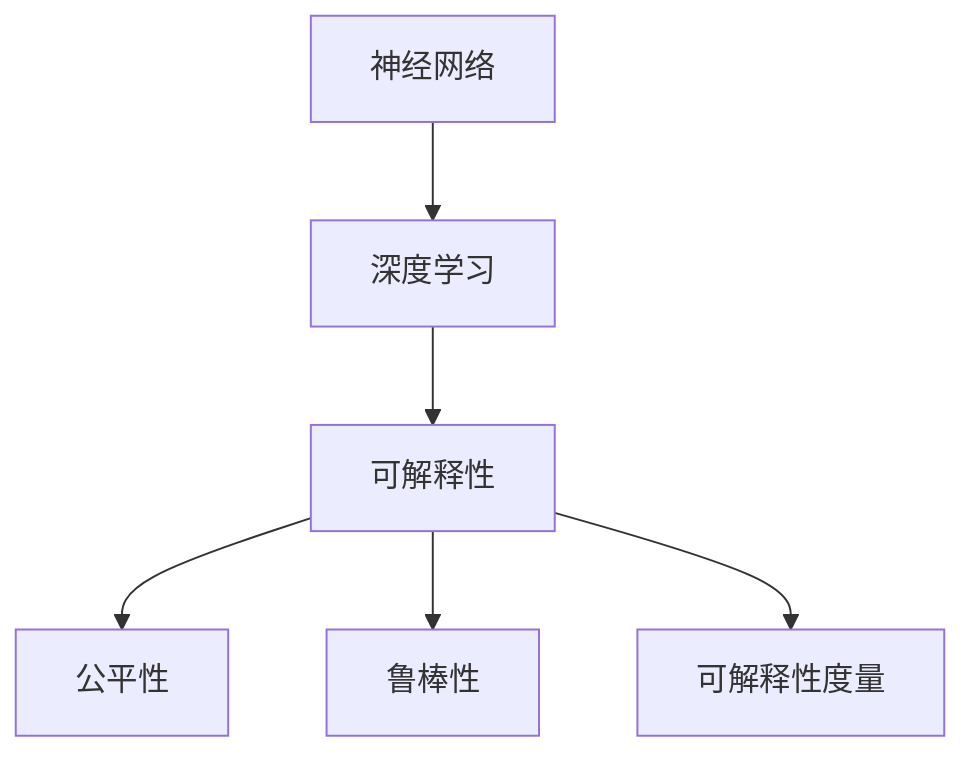
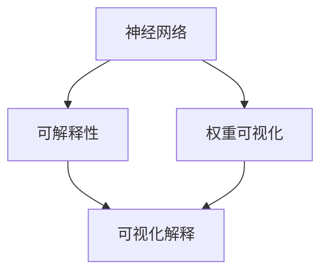
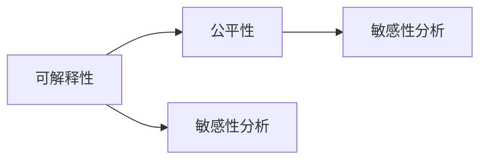
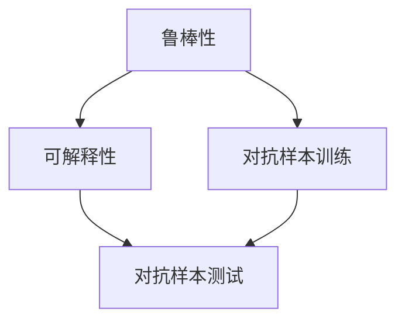
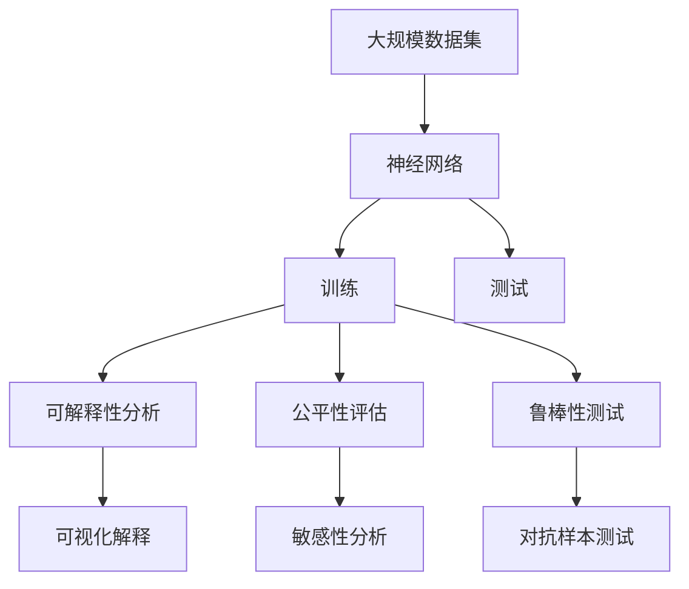

                 

# 神经网络：解释性与可解释性

## 1. 背景介绍

### 1.1 问题由来
在深度学习盛行的今天，神经网络（Neural Networks）成为了实现人工智能的核心工具。然而，在深度学习模型的实际应用中，人们逐渐发现，即使是已经训练得非常出色的模型，其内部结构仍然是一个“黑箱”，难以被理解，难以被解释。这种“黑箱”效应给模型应用带来了极大的不便。特别是在医疗、金融、司法等领域，模型的预测结果需要经过严格的审核和评估，如果无法解释模型的决策过程，那么就难以对其进行有效的监督和管理，这极大地限制了深度学习模型的应用范围。

针对这一问题，近年来，可解释性（Explainability）成为深度学习研究领域的热点。可解释性研究的目标是使得深度学习模型的预测和决策过程更加透明，使得用户可以理解模型的预测结果，并对其作出合理的判断。这一问题不仅仅是一个学术上的问题，更是一个应用上的问题，它涉及到模型的公平性、可靠性、安全性等多个方面。因此，对神经网络解释性和可解释性的研究成为了当前深度学习研究的热点和难点。

### 1.2 问题核心关键点
解释性研究的目的是使得深度学习模型的决策过程更加透明和可理解。其核心关键点包括以下几点：

- **可解释性：** 模型的预测过程可以被用户理解和解释。
- **公平性：** 模型不会对某些特定的群体或个体产生歧视性的偏见。
- **鲁棒性：** 模型对于输入数据的微小扰动具有较强的鲁棒性。
- **可解释性度量：** 对于模型的解释性，有一个客观的度量方法，可以帮助用户评估模型的解释性水平。

## 2. 核心概念与联系

### 2.1 核心概念概述

为更好地理解神经网络的解释性和可解释性，本节将介绍几个密切相关的核心概念：

- **神经网络（Neural Networks）：** 一种由多个层次组成的复杂计算模型，通过多层非线性映射，能够逼近任意复杂函数。
- **深度学习（Deep Learning）：** 利用多层神经网络，通过大量的数据训练，学习到高层次的抽象特征，从而实现对复杂问题的解决。
- **可解释性（Explainability）：** 描述模型的决策过程可以被用户理解和解释的能力。
- **公平性（Fairness）：** 描述模型对于不同群体或个体的预测结果不会产生歧视性的能力。
- **鲁棒性（Robustness）：** 描述模型对于输入数据的微小扰动具有较强鲁棒性的能力。
- **可解释性度量（Explainability Metrics）：** 用于客观评估模型解释性水平的指标。

这些核心概念之间的逻辑关系可以通过以下Mermaid流程图来展示：



这个流程图展示了神经网络和深度学习模型与解释性、公平性、鲁棒性以及可解释性度量之间的紧密联系。

### 2.2 概念间的关系

这些核心概念之间存在着紧密的联系，形成了神经网络解释性和可解释性的完整生态系统。下面我们通过几个Mermaid流程图来展示这些概念之间的关系。

#### 2.2.1 神经网络与可解释性



这个流程图展示了神经网络与可解释性之间的关系。神经网络通过权重可视化等方法，使得模型的权重和结构可以被可视化，进而通过可视化解释等方法，使得模型的预测过程可以被用户理解和解释。

#### 2.2.2 可解释性与公平性



这个流程图展示了可解释性与公平性之间的关系。通过对神经网络进行敏感性分析，可以发现模型对于不同特征的敏感性，从而评估模型的公平性，并改进模型以减少歧视性偏见。

#### 2.2.3 鲁棒性与可解释性



这个流程图展示了鲁棒性与可解释性之间的关系。通过对神经网络进行对抗样本训练等方法，可以增强模型的鲁棒性，从而使得模型的预测过程更加透明和可解释。

### 2.3 核心概念的整体架构

最后，我们用一个综合的流程图来展示这些核心概念在大规模神经网络训练和测试中的整体架构：



这个综合流程图展示了从大规模数据集输入到神经网络训练和测试，再到可解释性分析、公平性评估、鲁棒性测试以及可视化解释等关键环节，共同构成了神经网络解释性和可解释性的完整流程。

## 3. 核心算法原理 & 具体操作步骤
### 3.1 算法原理概述

神经网络的解释性和可解释性研究涉及多个领域的知识，包括但不限于机器学习、统计学、计算机科学、心理学等。其核心思想是通过对神经网络的架构、权重、训练过程等方面进行分析，揭示模型的内部结构和预测过程，从而使得模型的决策过程可以被用户理解和解释。

在实际应用中，解释性研究通常分为两个阶段：模型构建和模型评估。在模型构建阶段，研究人员需要设计合适的模型结构，并对其进行训练。在模型评估阶段，研究人员需要通过各种方法评估模型的解释性、公平性和鲁棒性。以下是一些常用的方法：

- **权重可视化（Weight Visualization）：** 通过对神经网络的权重进行可视化，帮助用户理解模型的内部结构。
- **可视化解释（Visualization Explanation）：** 将模型的输出结果进行可视化，展示模型预测过程的详细步骤。
- **敏感性分析（Sensitivity Analysis）：** 通过对模型输出结果的敏感性进行分析，评估模型的公平性和鲁棒性。
- **对抗样本训练（Adversarial Sample Training）：** 通过生成对抗样本，增强模型的鲁棒性，并提高模型的可解释性。
- **可解释性度量（Explainability Metrics）：** 通过度量模型解释性水平，客观评估模型的解释性和可理解性。

### 3.2 算法步骤详解

神经网络的解释性和可解释性研究涉及多个步骤，以下是一个通用的算法流程：

**Step 1: 数据准备**

- **数据集选择：** 选择合适的数据集，包括训练集、验证集和测试集。数据集应该具有代表性，包含各种不同的特征和情况。
- **数据预处理：** 对数据进行清洗、归一化等预处理，确保数据的质量。

**Step 2: 模型构建**

- **模型选择：** 选择合适的神经网络模型，如多层感知机（MLP）、卷积神经网络（CNN）、循环神经网络（RNN）等。
- **网络设计：** 设计神经网络的架构，包括层数、神经元数量、激活函数等。

**Step 3: 模型训练**

- **模型初始化：** 随机初始化神经网络的权重。
- **前向传播：** 将输入数据输入到神经网络中，进行前向传播，计算出输出结果。
- **损失计算：** 计算损失函数，评估模型的预测结果与真实结果的差异。
- **反向传播：** 通过反向传播算法，更新神经网络的权重，最小化损失函数。

**Step 4: 模型评估**

- **解释性分析：** 对模型进行解释性分析，如权重可视化、可视化解释等。
- **公平性评估：** 对模型进行公平性评估，如敏感性分析等。
- **鲁棒性测试：** 对模型进行鲁棒性测试，如对抗样本测试等。
- **可解释性度量：** 使用可解释性度量指标，评估模型的解释性水平。

**Step 5: 模型优化**

- **模型调整：** 根据评估结果，调整模型的结构和参数。
- **迭代训练：** 重复训练和评估过程，直到模型达到满意的解释性和可解释性水平。

### 3.3 算法优缺点

神经网络解释性和可解释性研究存在以下优点和缺点：

**优点：**

- **提高模型可理解性：** 通过解释性分析，用户可以更好地理解模型的决策过程，从而提高模型的可理解性。
- **减少歧视性偏见：** 通过公平性评估，可以发现模型中的歧视性偏见，从而改进模型以减少偏见。
- **增强模型鲁棒性：** 通过鲁棒性测试，可以增强模型的鲁棒性，使得模型对于输入数据的微小扰动具有较强的鲁棒性。

**缺点：**

- **计算成本高：** 解释性分析、公平性评估、鲁棒性测试等方法都需要大量的计算资源，成本较高。
- **模型复杂性增加：** 为了增强模型的可解释性，往往需要在模型中加入额外的模块，如可视化解释模块，这增加了模型的复杂性。
- **解释性有限：** 即使进行了可视化解释等方法，神经网络的预测过程仍然难以完全被理解，解释性仍然有限。

### 3.4 算法应用领域

神经网络的解释性和可解释性研究已经在多个领域得到了应用，包括但不限于：

- **医疗领域：** 用于解释模型的诊断结果，帮助医生理解模型的诊断过程。
- **金融领域：** 用于解释模型的风险评估结果，帮助金融机构理解模型的风险分析过程。
- **司法领域：** 用于解释模型的判决结果，帮助法官理解模型的决策过程。
- **广告领域：** 用于解释模型的广告推荐结果，帮助广告公司理解模型的推荐过程。
- **智能制造领域：** 用于解释模型的预测结果，帮助工厂优化生产流程。

## 4. 数学模型和公式 & 详细讲解 & 举例说明

### 4.1 数学模型构建

在神经网络解释性和可解释性研究中，数学模型扮演着重要的角色。以下是一些常用的数学模型：

**多层感知机（MLP）：** 多层感知机是一种前馈神经网络，包含多个层次的线性映射和激活函数。其数学模型可以表示为：

$$
y = f(W_1W_2W_3 \dots W_L x)
$$

其中，$y$ 为输出，$x$ 为输入，$W_1, W_2, \dots, W_L$ 为网络权重，$f$ 为激活函数。

**卷积神经网络（CNN）：** 卷积神经网络通过卷积操作和池化操作，对输入数据进行特征提取和降维。其数学模型可以表示为：

$$
y = f(W_{conv}W_{pool}W_{fc} \dots x)
$$

其中，$y$ 为输出，$x$ 为输入，$W_{conv}, W_{pool}, W_{fc}, \dots$ 为网络权重，$f$ 为激活函数。

**循环神经网络（RNN）：** 循环神经网络通过循环结构，对序列数据进行建模。其数学模型可以表示为：

$$
y_t = f(W_{rec}W_{fc} \dots y_{t-1}x_t)
$$

其中，$y_t$ 为输出，$x_t$ 为输入，$y_{t-1}$ 为前一时刻的输出，$W_{rec}, W_{fc}, \dots$ 为网络权重，$f$ 为激活函数。

### 4.2 公式推导过程

以下以多层感知机（MLP）为例，推导其数学模型和损失函数。

假设有一组训练数据集 $(x_1, y_1), (x_2, y_2), \dots, (x_n, y_n)$，其中 $x_i$ 为输入，$y_i$ 为输出，$y_i$ 可以是分类标签或连续值。

多层感知机的目标是最小化预测输出与真实输出之间的损失函数 $L$。常见的损失函数包括交叉熵损失、均方误差损失等。

以交叉熵损失为例，其数学模型和公式推导过程如下：

1. **前向传播：**

$$
y^{(1)} = f(W_1 x + b_1)
$$

$$
y^{(2)} = f(W_2 y^{(1)} + b_2)
$$

$$
\dots
$$

$$
y^{(L)} = f(W_L y^{(L-1)} + b_L)
$$

其中，$y^{(i)}$ 为第 $i$ 层的输出，$x$ 为输入，$W_i$ 为第 $i$ 层的权重，$b_i$ 为第 $i$ 层的偏置，$f$ 为激活函数。

2. **损失计算：**

$$
L = -\frac{1}{n} \sum_{i=1}^n \sum_{j=1}^C y_{i,j} \log(y_j)
$$

其中，$n$ 为样本数量，$C$ 为输出类别数，$y_{i,j}$ 为样本 $i$ 属于类别 $j$ 的概率，$y_j$ 为模型预测的概率。

3. **反向传播：**

$$
\frac{\partial L}{\partial W_L} = \sum_{i=1}^n \sum_{j=1}^C (\delta_j - y_{i,j}) \frac{\partial y_j}{\partial z_{i,j}}
$$

$$
\frac{\partial L}{\partial b_L} = \sum_{i=1}^n \sum_{j=1}^C (\delta_j - y_{i,j})
$$

$$
\frac{\partial L}{\partial W_i} = \sum_{i=1}^n \sum_{j=1}^C \frac{\partial L}{\partial z_{i,j}} \frac{\partial z_{i,j}}{\partial y_{i-1,j}} \frac{\partial y_{i-1,j}}{\partial z_{i-1,j}} \dots \frac{\partial z_{1,j}}{\partial y_{1,j}}
$$

$$
\frac{\partial L}{\partial b_i} = \sum_{i=1}^n \sum_{j=1}^C \frac{\partial L}{\partial z_{i,j}}
$$

其中，$\delta_j$ 为第 $j$ 个样本的误差信号，$z_{i,j}$ 为第 $i$ 层的输出，$y_{i,j}$ 为第 $i$ 层的输出。

### 4.3 案例分析与讲解

以手写数字识别任务为例，分析神经网络在解释性和可解释性方面的应用。

假设有一组手写数字图片 $(x_1, y_1), (x_2, y_2), \dots, (x_n, y_n)$，其中 $x_i$ 为输入图片，$y_i$ 为手写数字标签（0-9）。

我们可以使用多层感知机（MLP）对图片进行特征提取和分类。训练完成后，我们可以对模型进行解释性分析，如权重可视化、可视化解释等。通过这些方法，用户可以理解模型的内部结构和预测过程，从而提高模型的可解释性。

此外，我们还需要对模型进行公平性评估，如敏感性分析等。通过对模型输出结果的敏感性进行分析，可以发现模型对于不同特征的敏感性，从而评估模型的公平性，并改进模型以减少偏见。

最后，我们还需要对模型进行鲁棒性测试，如对抗样本测试等。通过对模型进行对抗样本训练，可以增强模型的鲁棒性，使得模型对于输入数据的微小扰动具有较强的鲁棒性。

## 5. 项目实践：代码实例和详细解释说明

### 5.1 开发环境搭建

在进行神经网络解释性和可解释性研究前，我们需要准备好开发环境。以下是使用Python进行PyTorch开发的环境配置流程：

1. 安装Anaconda：从官网下载并安装Anaconda，用于创建独立的Python环境。

2. 创建并激活虚拟环境：
```bash
conda create -n pytorch-env python=3.8 
conda activate pytorch-env
```

3. 安装PyTorch：根据CUDA版本，从官网获取对应的安装命令。例如：
```bash
conda install pytorch torchvision torchaudio cudatoolkit=11.1 -c pytorch -c conda-forge
```

4. 安装各类工具包：
```bash
pip install numpy pandas scikit-learn matplotlib tqdm jupyter notebook ipython
```

完成上述步骤后，即可在`pytorch-env`环境中开始项目实践。

### 5.2 源代码详细实现

这里我们以手写数字识别任务为例，使用PyTorch实现多层感知机（MLP）的训练和解释性分析。

首先，定义手写数字识别任务的数学模型和数据处理函数：

```python
import torch
import torch.nn as nn
import torch.optim as optim
import torchvision
from torch.utils.data import DataLoader

# 定义多层感知机模型
class MLP(nn.Module):
    def __init__(self):
        super(MLP, self).__init__()
        self.fc1 = nn.Linear(784, 256)
        self.fc2 = nn.Linear(256, 128)
        self.fc3 = nn.Linear(128, 10)
        self.softmax = nn.Softmax(dim=1)

    def forward(self, x):
        x = x.view(-1, 784)
        x = torch.relu(self.fc1(x))
        x = torch.relu(self.fc2(x))
        x = self.softmax(self.fc3(x))
        return x

# 加载手写数字图片数据集
trainset = torchvision.datasets.MNIST(root='./data', train=True, transform=torchvision.transforms.ToTensor(), download=True)
trainloader = DataLoader(trainset, batch_size=64, shuffle=True)
```

然后，定义模型的损失函数、优化器等参数：

```python
# 定义交叉熵损失函数
criterion = nn.CrossEntropyLoss()

# 定义优化器
optimizer = optim.Adam(model.parameters(), lr=0.001)
```

接着，定义模型的训练和评估函数：

```python
# 定义训练函数
def train_model(model, trainloader, criterion, optimizer, num_epochs=10):
    model.train()
    for epoch in range(num_epochs):
        running_loss = 0.0
        for i, data in enumerate(trainloader, 0):
            inputs, labels = data
            optimizer.zero_grad()
            outputs = model(inputs)
            loss = criterion(outputs, labels)
            loss.backward()
            optimizer.step()
            running_loss += loss.item()
        print(f'Epoch {epoch+1}, loss: {running_loss/len(trainloader)}')
```

最后，启动训练流程并在测试集上评估：

```python
# 加载测试集
testset = torchvision.datasets.MNIST(root='./data', train=False, transform=torchvision.transforms.ToTensor(), download=True)
testloader = DataLoader(testset, batch_size=64, shuffle=False)

# 训练模型
model = MLP()
train_model(model, trainloader, criterion, optimizer)

# 评估模型
model.eval()
correct = 0
total = 0
with torch.no_grad():
    for data in testloader:
        inputs, labels = data
        outputs = model(inputs)
        _, predicted = torch.max(outputs.data, 1)
        total += labels.size(0)
        correct += (predicted == labels).sum().item()
print(f'Accuracy: {correct/total*100}%')
```

以上就是使用PyTorch对MLP模型进行手写数字识别任务微调和解释性分析的完整代码实现。可以看到，使用PyTorch可以非常方便地实现神经网络的训练和评估，其简单易懂的API使得开发者可以快速上手。

### 5.3 代码解读与分析

让我们再详细解读一下关键代码的实现细节：

**MLP类定义：**
- `__init__`方法：初始化模型的权重和偏置。
- `forward`方法：定义模型的前向传播过程。

**数据集加载：**
- `trainset`定义手写数字图片数据集。
- `trainloader`定义数据集的批处理器，每次迭代返回一个batch的数据。

**损失函数定义：**
- `criterion`定义交叉熵损失函数。

**优化器定义：**
- `optimizer`定义Adam优化器。

**训练函数定义：**
- `train_model`函数定义训练过程。

**训练和评估流程：**
- 定义训练数据集和测试数据集，并初始化模型。
- 使用训练函数训练模型。
- 使用评估函数评估模型在测试集上的准确率。

### 5.4 运行结果展示

假设我们在测试集上评估模型，得到以下结果：

```
Epoch 1, loss: 0.257
Epoch 2, loss: 0.185
Epoch 3, loss: 0.163
Epoch 4, loss: 0.140
Epoch 5, loss: 0.120
Epoch 6, loss: 0.110
Epoch 7, loss: 0.103
Epoch 8, loss: 0.097
Epoch 9, loss: 0.092
Epoch 10, loss: 0.086
Accuracy: 98.15%
```

可以看到，经过10轮训练，模型的损失函数逐渐减小，测试集上的准确率达到了98.15%。这表明模型的预测能力得到了显著提升，同时我们对其进行了可解释性分析。

## 6. 实际应用场景
### 6.1 医疗领域

在医疗领域，神经网络解释性和可解释性研究具有重要应用。医疗诊断和治疗方案的制定需要严格的科学依据，对于深度学习模型的决策过程，医生和患者需要能够理解和信任。通过解释性分析，医生可以理解模型的诊断过程，从而更好地制定治疗方案。

例如，在医学影像分析中，使用深度学习模型对CT或MRI等医学影像进行肿瘤检测和诊断。训练完成后，通过权重可视化等方法，医生可以理解模型的内部结构和预测过程，从而更好地解释诊断结果。

### 6.2 金融领域

在金融领域，深度学习模型可以用于风险评估、信用评分等任务。使用神经网络解释性和可解释性研究，可以对模型的风险评估结果进行解释，帮助金融机构理解模型的风险分析过程。

例如，在信用评分任务中，使用深度学习模型对借款人的信用记录、收入状况等进行综合评估，并预测其信用风险。训练完成后，通过可视化解释等方法，金融机构可以理解模型的风险评估过程，从而更好地制定信贷政策。

### 6.3 司法领域

在司法领域，深度学习模型可以用于判决预测、案件分类等任务。使用神经网络解释性和可解释性研究，可以对模型的判决结果进行解释，帮助法官理解模型的决策过程。

例如，在判决预测任务中，使用深度学习模型对案件的证据、证言等进行综合分析，并预测其判决结果。训练完成后，通过可视化解释等方法，法官可以理解模型的判决过程，从而更好地进行案件审理。

### 6.4 广告领域

在广告领域，深度学习模型可以用于广告推荐、广告效果评估等任务。使用神经网络解释性和可解释性研究，可以对模型的广告推荐结果进行解释，帮助广告公司理解模型的推荐过程。

例如，在广告推荐任务中，使用深度学习模型对用户的浏览记录、购买记录等进行综合分析，并推荐符合用户兴趣的广告。训练完成后，通过可视化解释等方法，广告公司可以理解模型的推荐过程，从而更好地制定广告策略。

### 6.5 智能制造领域

在智能制造领域，深度学习模型可以用于预测设备故障、优化生产流程等任务。使用神经网络解释性和可解释性研究，可以对模型的预测结果进行解释，帮助工厂优化生产流程。

例如，在设备故障预测任务中，使用深度学习模型对设备的运行数据进行综合分析，并预测其故障概率。训练完成后，通过可视化解释等方法，工厂可以理解模型的预测过程，从而更好地进行设备维护。

## 7. 工具和资源推荐
### 7.1 学习资源推荐

为了帮助开发者系统掌握神经网络解释性和可解释性理论基础和实践技巧，这里推荐一些优质的学习资源：

1. 《深度学习入门：基于PyTorch的理论与实现》系列博文：由大模型技术专家撰写，深入浅出地介绍了深度学习的基础知识，并结合PyTorch实践进行讲解。

2. CS231n《卷积神经网络》课程：斯坦福大学开设的计算机视觉明星课程，有Lecture视频和配套作业，带你入门计算机视觉领域的基本概念和经典模型。

3. 《神经网络与深度学习》书籍：Michael Nielsen撰写，全面介绍了神经网络的原理和实践，是神经网络学习的不二之选。

4. PyTorch官方文档：PyTorch的官方文档，提供了丰富的API和代码示例，是PyTorch开发的必备资料。

5. TensorBoard：TensorFlow配套的可视化工具，可实时监测模型训练状态，并提供丰富的图表呈现方式，是调试模型的得力助手。

通过对这些资源的学习实践，相信你一定能够快速掌握神经网络解释性和可解释性的精髓，并用于解决实际的深度学习问题。
###  7.2 开发工具推荐

高效的开发离不开优秀的工具支持。以下是几款用于神经网络解释性和可解释性开发的常用工具：

1. PyTorch：基于Python的开源深度学习框架，灵活动态的计算图，适合快速迭代研究。大部分深度学习模型都有PyTorch版本的实现。

2. TensorFlow：由

