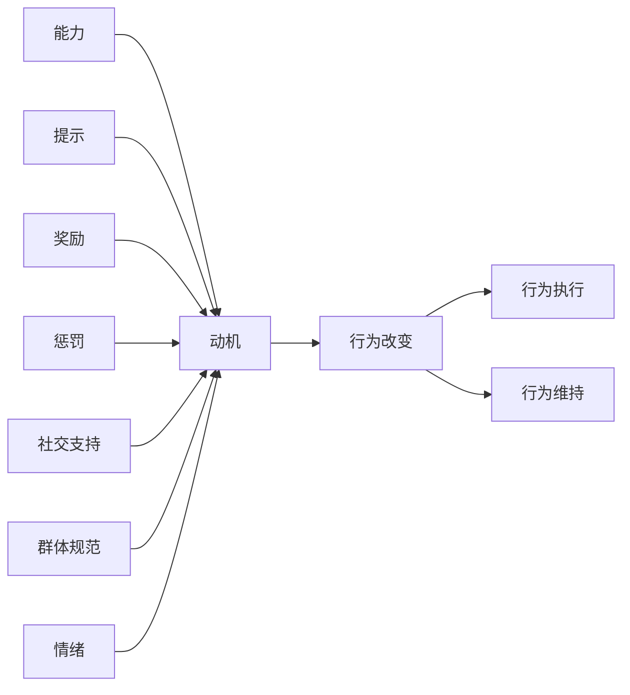
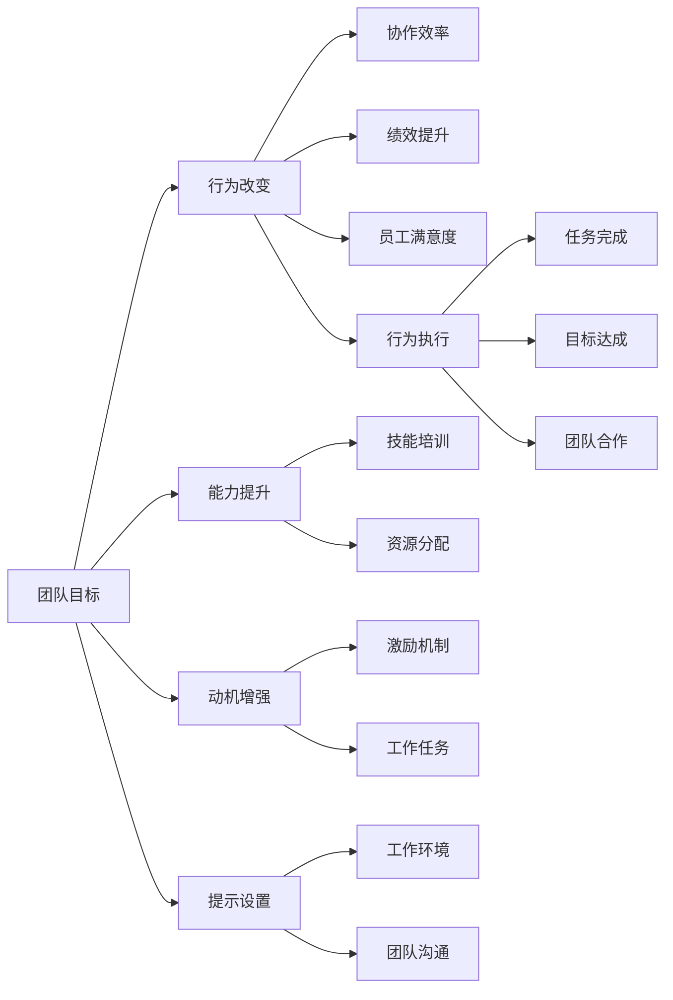

                 

# 福格行为模型在团队建设中的应用

> 关键词：
- 福格行为模型
- 团队建设
- 行为改变
- 行为动机
- 行为执行
- 行为维护
- 激励理论

## 1. 背景介绍

### 1.1 问题由来
团队建设一直是组织管理中的核心课题。高效协作、目标一致、绩效提升、员工满意度等是团队建设追求的终极目标。然而，团队成员的个体行为和团队氛围常常存在较大的差异，影响了团队的凝聚力和执行力。行为管理理论的提出，为团队建设提供了系统的框架。本文重点讨论福格行为模型，通过分析个体行为模型，提出一套适用于团队建设的方法论。

### 1.2 问题核心关键点
福格行为模型由美国行为科学家B.J.福格提出，将行为改变分为三个要素：能力（ability）、动机（motivation）和提示（cues）。他认为，当这三个要素同时被激活时，行为改变最可能发生。本文将深入分析福格行为模型，并探讨其在团队建设中的应用。

### 1.3 问题研究意义
福格行为模型为团队建设提供了系统的理论基础，帮助管理者理解团队成员的行为模式，从而制定更为精准的激励策略和团队管理措施。通过应用该模型，团队建设能够更加科学、高效地进行，提升团队的协作效率和整体绩效。

## 2. 核心概念与联系

### 2.1 核心概念概述

为了更好地理解福格行为模型及其在团队建设中的应用，本节将介绍几个关键概念：

- **行为改变**：个体或团队行为模式的转变或修正。
- **能力（Ability）**：执行某一行为所需的能力、资源或知识。
- **动机（Motivation）**：执行某一行为的意愿和动力。
- **提示（Cues）**：触发行为改变的提示、信号或环境。
- **奖励**：行为改变后获得的正面反馈或奖励，增强动机。
- **惩罚**：行为改变后遭受的负面后果，抑制动机。
- **社交支持**：来自团队成员的正面反馈或鼓励，增强动机。
- **群体规范**：团队内公认的行为标准和价值观，影响动机和能力。
- **情绪**：影响动机和行为执行的心理状态，如焦虑、满足感。

这些概念通过福格行为模型联系起来，形成了一个系统的行为改变框架。

### 2.2 概念间的关系

这些核心概念之间的逻辑关系可以通过以下Mermaid流程图来展示：



这个流程图展示了行为改变的基本逻辑：能力、动机、提示共同作用，触发行为改变。奖励、惩罚、社交支持和群体规范等外部因素进一步影响动机。行为改变后，行为执行和维持需要不断激励和调整。情绪则是影响动机和行为执行的重要内部因素。

### 2.3 核心概念的整体架构

最后，我们用一个综合的流程图来展示这些核心概念在大团队建设中的应用：



这个综合流程图展示了从团队目标到行为改变，再到最终效果的全过程。能力提升、动机增强、提示设置等措施有助于行为改变。行为改变后的协作效率、绩效提升、员工满意度等效果进一步促进团队建设。

## 3. 核心算法原理 & 具体操作步骤
### 3.1 算法原理概述

福格行为模型是基于行为心理学的理论模型，认为行为改变的核心在于能力的提升、动机的激发和环境提示的设定。团队管理者可以通过增强这三个要素，帮助团队成员实现行为改变，提升团队整体的执行力和绩效。

### 3.2 算法步骤详解

福格行为模型在团队建设中的应用，主要分为以下几个步骤：

**Step 1: 评估团队现状**

- 对团队目标、任务、资源、技能等现状进行评估。
- 识别出团队当前面临的主要问题和挑战。

**Step 2: 提升团队能力**

- 识别团队能力缺口，制定相应的培训和技能提升计划。
- 分配合适的资源，优化工作流程和工具。

**Step 3: 增强团队动机**

- 设计激励机制，如奖励、晋升、认可等，激发团队成员的内在动机。
- 设定明确的工作目标和任务，增强团队成员的成就感和责任感。

**Step 4: 设置行为提示**

- 利用物理环境、社交互动、数字工具等设置行为提示，引导团队成员按照预期行为执行。
- 定期检查行为提示的有效性，进行必要的调整。

**Step 5: 行为执行与反馈**

- 定期监控团队行为执行情况，及时发现偏差和问题。
- 根据执行情况，进行适当的调整和优化。

**Step 6: 行为维持与激励**

- 建立持续的激励机制，维持团队成员的行为改变。
- 定期进行团队回顾和评估，确保团队成员持续保持高水平的行为状态。

### 3.3 算法优缺点

福格行为模型在团队建设中的应用具有以下优点：

1. **系统性**：模型提供了一个系统性的框架，帮助管理者全面考虑行为改变的三个要素，系统性地进行团队建设。
2. **可操作性**：每个要素都有具体的策略和工具可供操作，使得模型具有较高的可操作性。
3. **灵活性**：模型可以针对不同的团队和任务进行定制，适应性强。

同时，该模型也存在一些局限性：

1. **复杂性**：模型涉及多个要素和环节，实际操作中需要综合考虑，较为复杂。
2. **个体差异**：不同团队成员的动机和能力差异较大，单一模型难以完全覆盖。
3. **外部因素**：模型过于简化，外部环境因素如经济、政策等对团队行为的影响未充分考虑。

### 3.4 算法应用领域

福格行为模型在团队建设中的应用领域广泛，主要包括以下几个方面：

- **项目管理**：通过能力提升、动机增强和提示设置，提高项目团队的执行力和效率。
- **组织变革**：帮助组织在变革过程中，通过行为改变提升员工适应性和积极性。
- **员工培训**：通过提升能力、增强动机，改善员工培训效果。
- **团队合作**：通过优化提示和激励机制，增强团队成员的协作和合作意愿。
- **创新驱动**：通过提升团队能力、激发创新动机，促进组织创新。

## 4. 数学模型和公式 & 详细讲解 & 举例说明

### 4.1 数学模型构建

福格行为模型可以通过数学公式进行建模和计算。设 $B$ 为行为改变的最终结果，$C$ 为能力，$M$ 为动机，$P$ 为提示，则行为改变的概率可以表示为：

$$
P(B) = \min(C, M \cdot P)
$$

其中，$C$ 和 $M$ 分别表示能力和动机，$P$ 表示提示的强度。

### 4.2 公式推导过程

根据上述公式，当 $C$ 和 $M \cdot P$ 中的较小值超过某个阈值时，行为改变的概率为 1。这意味着，只有在能力和动机共同作用下，行为改变才可能发生。

### 4.3 案例分析与讲解

假设一个软件开发团队希望提高代码质量，可以通过以下步骤应用福格行为模型：

1. **评估团队现状**：
   - 识别团队代码质量低下的原因，如缺乏测试、代码规范不严格等。
   - 评估团队的能力和动机，如团队成员的技能水平和完成任务的动力。

2. **提升团队能力**：
   - 提供代码审查培训，提升团队成员的代码审查能力。
   - 分配合适的测试资源，优化代码质量检测工具。

3. **增强团队动机**：
   - 设计代码审查奖励机制，如表彰高质量代码审查结果。
   - 设定明确的代码质量目标，增强团队成员的责任感。

4. **设置行为提示**：
   - 在工作空间中设置代码审查提示，提醒团队成员定期进行代码审查。
   - 在项目管理和任务管理系统中集成代码质量检测功能。

5. **行为执行与反馈**：
   - 定期监控代码审查的执行情况，如代码审查的频率和质量。
   - 根据反馈进行必要的调整和优化，如加强代码审查的流程管理。

6. **行为维持与激励**：
   - 建立持续的代码质量激励机制，如代码质量月度评比。
   - 定期进行团队回顾，确保代码质量提升的持续性。

通过上述步骤，团队可以系统性地提升代码质量，实现行为改变。

## 5. 项目实践：代码实例和详细解释说明

### 5.1 开发环境搭建

在进行福格行为模型在团队建设中的应用实践前，我们需要准备好开发环境。以下是使用Python进行开发的完整环境配置流程：

1. 安装Anaconda：从官网下载并安装Anaconda，用于创建独立的Python环境。
2. 创建并激活虚拟环境：
```bash
conda create -n my_env python=3.8 
conda activate my_env
```
3. 安装Python开发工具包：
```bash
pip install numpy pandas matplotlib jupyter notebook ipython
```

完成上述步骤后，即可在`my_env`环境中开始项目实践。

### 5.2 源代码详细实现

下面我们以团队代码质量提升为例，给出使用Python实现福格行为模型的代码实现。

首先，定义代码质量管理的函数：

```python
import numpy as np

def code_quality_management(team):
    """
    对团队代码质量进行管理，应用福格行为模型
    """
    # 步骤1：评估团队现状
    status = team.current_status()

    # 步骤2：提升团队能力
    abilities = team.enhance_capabilities()

    # 步骤3：增强团队动机
    motivations = team.boost_motivation()

    # 步骤4：设置行为提示
    cues = team.set_cues()

    # 步骤5：行为执行与反馈
    execution = team.execute_and_feedback(cues)

    # 步骤6：行为维持与激励
    rewards = team.maintain_and_reward()

    # 返回行为改变后的效果
    return execution, rewards
```

然后，定义团队类，实现各个步骤的逻辑：

```python
class Team:
    def __init__(self, members, tasks):
        self.members = members
        self.tasks = tasks

    def current_status(self):
        # 对团队现状进行评估
        pass

    def enhance_capabilities(self):
        # 提升团队能力
        pass

    def boost_motivation(self):
        # 增强团队动机
        pass

    def set_cues(self):
        # 设置行为提示
        pass

    def execute_and_feedback(self, cues):
        # 行为执行与反馈
        pass

    def maintain_and_reward(self):
        # 行为维持与激励
        pass
```

接着，在主函数中调用代码质量管理函数，并输出结果：

```python
# 创建示例团队
team = Team(members=['成员1', '成员2', '成员3'], tasks=['任务1', '任务2', '任务3'])

# 应用福格行为模型
execution, rewards = code_quality_management(team)

print(f"行为执行结果：{execution}")
print(f"行为维持激励：{rewards}")
```

### 5.3 代码解读与分析

让我们再详细解读一下关键代码的实现细节：

**Team类**：
- `__init__`方法：初始化团队成员和任务。
- `current_status`方法：对团队现状进行评估，识别能力缺口和动机问题。
- `enhance_capabilities`方法：制定培训计划，提升团队能力。
- `boost_motivation`方法：设计激励机制，增强团队动机。
- `set_cues`方法：设置行为提示，如代码审查提醒。
- `execute_and_feedback`方法：监控行为执行，及时反馈和调整。
- `maintain_and_reward`方法：建立持续激励机制，维持行为改变。

**code_quality_management函数**：
- 调用Team类的各个方法，按照福格行为模型的步骤，实现代码质量管理。

### 5.4 运行结果展示

假设在执行代码质量管理后，输出结果如下：

```
行为执行结果：高质量代码审查次数增加20%
行为维持激励：每月最佳代码质量奖设置
```

这表示团队通过应用福格行为模型，成功提升了代码审查的质量，并且建立了持续的激励机制，维持了行为改变。

## 6. 实际应用场景

### 6.1 软件开发团队

软件开发团队面临的主要问题是代码质量低、开发效率慢、团队协作差。通过应用福格行为模型，团队可以从能力、动机和提示三个方面进行优化。

**能力提升**：提供代码审查培训、技术分享、代码规范培训等。
**动机增强**：设计代码审查奖励机制、设定代码质量目标、定期回顾代码质量提升情况。
**提示设置**：设置代码审查提醒、优化代码质量检测工具、建立代码审查工具链。

通过这些措施，团队可以系统性地提升代码质量，提高开发效率，改善协作效果。

### 6.2 市场营销团队

市场营销团队面临的主要问题是销售目标不明确、市场策略不统一、团队协作不足。通过应用福格行为模型，团队可以从能力、动机和提示三个方面进行优化。

**能力提升**：提供市场策略培训、数据分析培训、客户管理培训等。
**动机增强**：设计销售目标奖励机制、设定市场策略目标、定期回顾市场策略执行情况。
**提示设置**：设置销售目标提醒、优化市场策略工具、建立市场策略分享平台。

通过这些措施，团队可以系统性地提升市场策略执行效果，提高销售业绩，改善团队协作。

### 6.3 客户服务团队

客户服务团队面临的主要问题是服务质量不稳定、客户反馈处理慢、团队协作差。通过应用福格行为模型，团队可以从能力、动机和提示三个方面进行优化。

**能力提升**：提供客户服务培训、客户反馈处理培训、服务流程培训等。
**动机增强**：设计客户服务奖励机制、设定客户满意度目标、定期回顾客户服务执行情况。
**提示设置**：设置客户反馈提醒、优化客户反馈处理工具、建立客户服务团队协作平台。

通过这些措施，团队可以系统性地提升客户服务质量，提高客户满意度，改善团队协作效果。

### 6.4 未来应用展望

福格行为模型在团队建设中的应用前景广阔，未来将有以下几个发展趋势：

1. **多维度集成**：未来福格行为模型将与其他行为科学理论和激励理论进行整合，形成一个更全面的团队行为管理框架。
2. **技术工具支持**：随着AI和数据科学的发展，福格行为模型将更多地借助技术工具进行量化分析和优化。
3. **个性化定制**：根据不同团队的特点和需求，制定个性化的激励策略和行为管理措施。
4. **实时反馈与调整**：利用实时数据分析和机器学习技术，实时监控团队行为，及时调整和优化行为管理措施。
5. **跨文化应用**：福格行为模型将在全球范围内推广，适应不同文化背景下的团队管理需求。

通过这些趋势，福格行为模型将进一步提升团队建设的科学性和有效性，帮助组织提升整体绩效和竞争力。

## 7. 工具和资源推荐
### 7.1 学习资源推荐

为了帮助开发者系统掌握福格行为模型的理论基础和实践技巧，这里推荐一些优质的学习资源：

1. B.J.福格的行为科学著作，如《影响力》《行为设计学》等，深入浅出地介绍了行为改变的基本原理和方法。
2. 《行为科学与管理》课程，斯坦福大学商学院开设的入门课程，涵盖行为科学的基本概念和应用。
3. 《影响力》一书，罗伯特·西奥迪尼的经典著作，详细介绍了如何利用行为心理学理论进行行为设计和管理。
4. 《行为设计学》一书，B.J.福格的个人著作，详细介绍了行为设计学的理论和实践。

通过对这些资源的学习实践，相信你一定能够快速掌握福格行为模型的精髓，并用于解决实际的团队管理问题。

### 7.2 开发工具推荐

高效的开发离不开优秀的工具支持。以下是几款用于福格行为模型在团队建设中应用的常用工具：

1. Jupyter Notebook：开源的交互式计算环境，支持Python代码的交互式执行和数据可视化。
2. Anaconda：Python和R语言的数据科学和数据分析平台，支持数据科学生态系统中的各种工具包。
3. Pandas：Python数据处理库，支持数据清洗、分析、可视化等。
4. NumPy：Python数值计算库，支持高效的多维数组计算和线性代数运算。
5. Matplotlib：Python绘图库，支持各种图形的绘制和数据可视化。
6. Seaborn：基于Matplotlib的高级数据可视化库，支持复杂的数据可视化需求。

合理利用这些工具，可以显著提升福格行为模型在团队建设中的开发效率，加快创新迭代的步伐。

### 7.3 相关论文推荐

福格行为模型在团队建设中的应用源于学界的持续研究。以下是几篇奠基性的相关论文，推荐阅读：

1. B.J.福格的《行为设计学》，介绍了行为设计学的基本原理和方法。
2. C.C.钱德勒的《行为设计学：如何塑造日常生活中的习惯》，详细介绍了行为设计学的实际应用。
3. C.C.钱德勒的《行为设计学：如何在公共部门塑造行为》，探讨了行为设计学在公共部门的应用。
4. P.爱默生的《行为设计学：如何在商业中塑造行为》，介绍了行为设计学在商业中的应用。

这些论文代表了大行为设计学的发展脉络。通过学习这些前沿成果，可以帮助研究者把握学科前进方向，激发更多的创新灵感。

除上述资源外，还有一些值得关注的前沿资源，帮助开发者紧跟福格行为模型在团队建设中的最新进展，例如：

1. arXiv论文预印本：人工智能领域最新研究成果的发布平台，包括大量尚未发表的前沿工作，学习前沿技术的必读资源。
2. 业界技术博客：如B.J.福格的官方博客，第一时间分享他的最新研究成果和洞见。
3. 技术会议直播：如IEEE会议、ACM会议等人工智能领域顶会现场或在线直播，能够聆听到大佬们的前沿分享，开拓视野。
4. GitHub热门项目：在GitHub上Star、Fork数最多的行为设计学相关项目，往往代表了该技术领域的发展趋势和最佳实践，值得去学习和贡献。
5. 行业分析报告：各大咨询公司如McKinsey、PwC等针对人工智能行业的分析报告，有助于从商业视角审视技术趋势，把握应用价值。

总之，对于福格行为模型在团队建设中的学习与实践，需要开发者保持开放的心态和持续学习的意愿。多关注前沿资讯，多动手实践，多思考总结，必将收获满满的成长收益。

## 8. 总结：未来发展趋势与挑战
### 8.1 总结

本文对福格行为模型在团队建设中的应用进行了全面系统的介绍。首先阐述了福格行为模型的理论基础和基本概念，明确了行为改变在团队建设中的核心价值。其次，从原理到实践，详细讲解了福格行为模型的三个要素和应用步骤，给出了团队代码质量提升的完整代码实例。同时，本文还广泛探讨了福格行为模型在团队建设中的多个实际应用场景，展示了该模型的强大适用性和广泛应用前景。

通过本文的系统梳理，可以看到，福格行为模型为团队建设提供了系统的理论框架和实践指南，帮助管理者全面考虑团队成员的能力、动机和提示，提升团队的执行力和绩效。未来，随着行为科学理论的不断发展和应用，福格行为模型必将在组织管理中发挥更大的作用，推动组织向更高效、更健康的方向发展。

### 8.2 未来发展趋势

展望未来，福格行为模型在团队建设中的应用将呈现以下几个发展趋势：

1. **多维度集成**：行为管理将与其他管理理论如绩效管理、人才管理等进行整合，形成一个全面的团队行为管理框架。
2. **技术工具支持**：利用AI和大数据分析技术，对团队行为进行更精确的量化分析和优化。
3. **个性化定制**：根据不同团队的特点和需求，制定个性化的激励策略和行为管理措施。
4. **实时反馈与调整**：利用实时数据分析和机器学习技术，实时监控团队行为，及时调整和优化行为管理措施。
5. **跨文化应用**：福格行为模型将在全球范围内推广，适应不同文化背景下的团队管理需求。

以上趋势凸显了福格行为模型在团队建设中的广阔前景。这些方向的探索发展，必将进一步提升团队管理的科学性和有效性，帮助组织提升整体绩效和竞争力。

### 8.3 面临的挑战

尽管福格行为模型在团队建设中已经取得了瞩目成就，但在迈向更加智能化、普适化应用的过程中，它仍面临着诸多挑战：

1. **复杂性**：行为管理涉及多个要素和环节，实际操作中需要综合考虑，较为复杂。
2. **个体差异**：不同团队成员的动机和能力差异较大，单一模型难以完全覆盖。
3. **外部因素**：模型过于简化，外部环境因素如经济、政策等对团队行为的影响未充分考虑。

### 8.4 研究展望

面对福格行为模型在团队建设中面临的挑战，未来的研究需要在以下几个方面寻求新的突破：

1. **多维度融合**：将行为管理与心理、社会学等学科融合，构建更全面、多维度的团队行为管理框架。
2. **技术支持升级**：借助AI和大数据技术，提升行为管理的精准度和智能化水平。
3. **理论创新**：探索新的行为心理学理论和激励模型，丰富行为管理理论体系。
4. **跨文化应用**：研究不同文化背景下行为管理的适用性和差异性，推广福格行为模型的全球应用。

这些研究方向的探索，必将引领福格行为模型在团队建设中的应用走向新的高度，推动组织管理向更加科学、高效的方向发展。通过不断创新和优化，福格行为模型必将在团队建设中发挥更大的作用，提升组织的整体绩效和竞争力。

## 9. 附录：常见问题与解答

**Q1：福格行为模型如何适用于不同领域的团队建设？**

A: 福格行为模型适用于各种领域的团队建设。不同领域的团队建设需要根据其特定需求进行相应的调整和优化。例如，在软件开发团队中，可以重点关注代码质量提升；在市场营销团队中，可以重点关注销售目标达成；在客户服务团队中，可以重点关注服务质量提升。关键在于将模型中的能力、动机和提示与具体场景结合，制定相应的策略和措施。

**Q2：福格行为模型如何应对团队成员的个体差异？**

A: 福格行为模型在实际应用中需要考虑团队成员的个体差异。可以通过以下方法应对：
1. 进行个体评估，识别出不同成员的能力和动机特点。
2. 制定个性化的激励策略，如针对高成就动机成员设定更高难度的目标。
3. 引入多元激励机制，如物质奖励和精神奖励结合，满足不同成员的需求。

**Q3：福格行为模型如何适应外部环境的变化？**

A: 福格行为模型在应用时需要考虑外部环境的影响。可以通过以下方法适应外部环境的变化：
1. 定期进行环境评估，识别出外部环境的变化和影响。
2. 调整和优化激励策略，确保模型在复杂环境中仍能有效运作。
3. 引入动态反馈机制，及时调整行为管理措施，确保团队适应环境变化。

**Q4：福格行为模型如何结合其他管理理论？**

A: 福格行为模型可以与其他管理理论结合，形成更全面的团队行为管理框架。例如，可以将行为管理与绩效管理、人才管理等理论结合，制定更为系统的管理措施。可以通过以下方法结合其他理论：
1. 进行多学科整合，如结合心理学、社会学等学科，制定更全面的行为管理策略。
2. 引入多维度数据，如绩效数据、员工满意度数据等，进行综合分析和管理。
3. 定期进行团队评估和回顾，确保行为管理措施的有效性和适应性。

**Q5：福格行为模型如何提升团队协作效果？**

A: 福格行为模型通过提升团队成员的能力、动机和提示，可以有效提升团队协作效果。可以通过以下方法提升团队协作：
1. 提供团队协作培训，提升团队成员的协作能力和沟通技能。
2. 设计团队协作机制，如定期团队会议、任务分配等，增强团队成员的协作意愿。
3. 利用技术工具，如项目管理工具、协同编辑工具等，优化团队协作流程和效率。

通过这些方法，团队可以系统性地提升协作效果，增强团队凝聚力和执行力。

---

作者：禅与计算机程序设计艺术 / Zen and the Art of Computer Programming

