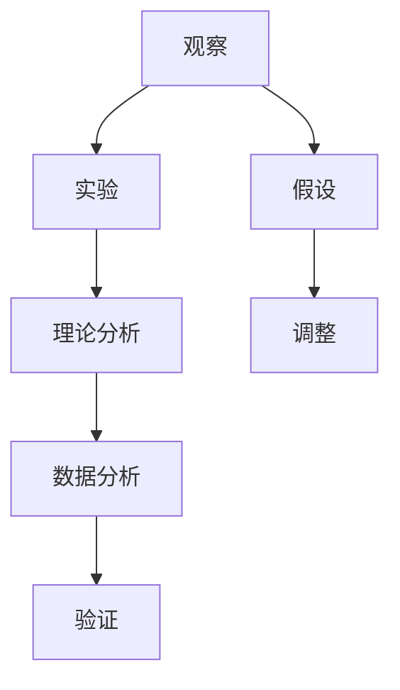
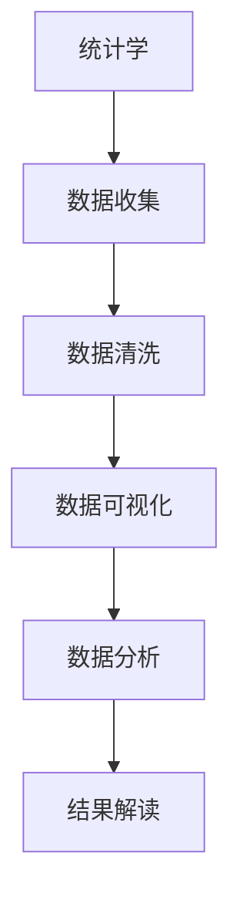

                 

# 科学探究：从假说到真理

> 关键词：科学探究,假说,真理,科学方法,统计学,数据分析,实验验证,逻辑推理

## 1. 背景介绍

科学探究（Scientific Inquiry）是认识和理解自然世界的基本方法之一，它涉及从观察现象到形成假说，再到实验验证，最终得出真理的过程。这一方法论不仅广泛应用于自然科学领域，也在计算机科学和信息技术研究中得到了广泛应用。在信息技术领域，尤其是在算法设计、软件工程、数据科学等方向，科学探究的方法尤为重要。本文将围绕科学探究的核心要素：假说、真理和科学方法，深入探讨其在信息技术研究中的应用，并通过具体案例展示科学探究的过程和结果。

### 1.1 假说与真理

假说（Hypothesis）是科学探究的起点，是对自然现象的初步解释或预测。真理（Truth）则是对现象真实状态的准确描述，它是科学探究的最终目标。在信息技术领域，假说通常表现为对某一问题或现象的初步理解，而真理则是对该问题或现象的精确解决。例如，在大数据处理中，假说可能是“通过大数据分析可以预测市场需求”，而真理则是对该预测的验证结果。

### 1.2 科学方法的重要性

科学方法是科学探究中不可或缺的组成部分。它包括观察、实验、理论分析、数据分析和验证等多个环节。在信息技术研究中，科学方法的应用尤为关键。通过科学方法，研究人员能够系统地验证假说，确保真理的准确性和可靠性。例如，机器学习中的模型训练和验证过程，就是一个典型的应用科学方法的过程。

## 2. 核心概念与联系

### 2.1 核心概念概述

为了更好地理解科学探究在信息技术研究中的应用，本节将介绍几个关键核心概念：

- **假说**：是对现象的初步解释或预测。在信息技术研究中，假说可能表现为对某一问题或现象的初步理解，如算法效率提升的可能性、新数据结构的应用等。
- **真理**：是对现象真实状态的准确描述。真理是科学探究的最终目标，在信息技术研究中，真理可能表现为某一问题的精确解决，如算法复杂度的精确计算、数据模型的准确预测等。
- **科学方法**：包括观察、实验、理论分析、数据分析和验证等多个环节。在信息技术研究中，科学方法的应用尤为重要，通过科学方法，研究人员能够系统地验证假说，确保真理的准确性和可靠性。
- **统计学**：是科学探究中数据分析的重要工具，通过统计学方法，研究人员可以对数据进行科学的分析和解释。
- **数据分析**：是科学探究中验证假说的关键步骤，通过数据分析，研究人员可以验证假设的真实性，并根据数据分析结果调整或修正假设。

这些核心概念之间存在着紧密的联系，形成了科学探究的完整生态系统。通过对这些概念的深入理解，我们可以更好地把握科学探究的过程和方法，进而应用于信息技术研究中。

### 2.2 概念间的关系

这些核心概念之间存在着紧密的联系，形成了科学探究的完整生态系统。下面我通过几个Mermaid流程图来展示这些概念之间的关系。

#### 2.2.1 假说与真理的关系


这个流程图展示了假说和真理之间的关系：假说是对现象的初步解释或预测，真理则是对该现象的精确描述。假说需要通过科学方法验证，最终得到真理。

#### 2.2.2 科学方法的应用流程



这个流程图展示了科学方法的应用流程：从观察现象到形成假设，通过实验和理论分析，进行数据分析，最后验证假设。如果假设与真实情况不符，需要调整假设，继续实验和验证。

#### 2.2.3 统计学在数据分析中的应用



这个流程图展示了统计学在数据分析中的应用流程：从数据收集到数据可视化，再到数据分析和结果解读。统计学方法在数据分析中起着关键作用，通过统计学方法，研究人员可以对数据进行科学的分析和解释。

## 3. 核心算法原理 & 具体操作步骤

### 3.1 算法原理概述

科学探究中的核心算法原理包括假设检验、回归分析、因果推断等。这些算法原理为科学探究提供了数学和统计学的工具，帮助研究人员验证假设和得出真理。

#### 3.1.1 假设检验

假设检验（Hypothesis Testing）是通过统计学方法，检验样本数据与总体数据的差异，以确定假设是否成立的过程。在信息技术研究中，假设检验通常用于验证某一算法或模型的有效性。例如，通过假设检验，研究人员可以验证某种算法在特定数据集上的性能是否优于其他算法。

#### 3.1.2 回归分析

回归分析（Regression Analysis）是用于分析变量间关系的统计学方法，通过建立回归模型，预测变量间的依赖关系。在信息技术研究中，回归分析通常用于分析数据集中的相关性和预测变量值。例如，通过回归分析，研究人员可以预测数据集的趋势和变化，从而指导算法的设计和优化。

#### 3.1.3 因果推断

因果推断（Causal Inference）是用于分析变量因果关系的方法，通过控制变量和排除其他影响因素，确定变量间的因果关系。在信息技术研究中，因果推断通常用于分析算法或模型的因果关系，确定算法或模型的实际效果。例如，通过因果推断，研究人员可以确定某一算法的因果影响因素，优化算法性能。

### 3.2 算法步骤详解

科学探究中的核心算法步骤包括数据收集、数据预处理、模型建立、模型验证和结果解读等。这些步骤是科学探究中不可或缺的部分，通过这些步骤，研究人员可以验证假设，得出真理。

#### 3.2.1 数据收集

数据收集是科学探究的第一步，通过数据收集，研究人员获取所需的数据，为后续分析和验证提供基础。在信息技术研究中，数据收集通常涉及数据集的选择、数据预处理、数据清洗等。例如，在大数据分析中，研究人员需要收集大量的数据，并进行清洗和预处理，确保数据的准确性和完整性。

#### 3.2.2 数据预处理

数据预处理是数据收集后的重要步骤，通过数据预处理，研究人员可以清洗、归一化和标准化数据，提高数据的质量和可用性。在信息技术研究中，数据预处理通常涉及缺失值处理、异常值处理、数据归一化等。例如，在机器学习中，研究人员需要预处理数据，以确保数据的一致性和可比较性。

#### 3.2.3 模型建立

模型建立是科学探究的核心步骤，通过建立模型，研究人员可以对数据进行分析和预测，验证假设。在信息技术研究中，模型建立通常涉及选择适当的算法和模型，进行参数调优和训练。例如，在机器学习中，研究人员需要选择适当的算法和模型，并进行参数调优和训练，以获得最优的模型性能。

#### 3.2.4 模型验证

模型验证是科学探究中的重要步骤，通过模型验证，研究人员可以评估模型的性能和可靠性，确保真理的准确性。在信息技术研究中，模型验证通常涉及交叉验证、网格搜索和超参数调优等。例如，在机器学习中，研究人员需要进行交叉验证和网格搜索，以确保模型的性能和稳定性。

#### 3.2.5 结果解读

结果解读是科学探究的最后一个步骤，通过结果解读，研究人员可以理解模型的输出结果，得出真理。在信息技术研究中，结果解读通常涉及对模型的输出结果进行分析和解释，确定模型的实际效果。例如，在机器学习中，研究人员需要对模型的输出结果进行分析和解释，确定模型的实际效果和应用场景。

### 3.3 算法优缺点

科学探究中的核心算法具有以下优点：

1. **系统性和科学性**：通过系统性的科学方法，研究人员可以验证假设，得出真理，确保研究的科学性和可靠性。
2. **可重复性**：科学探究中的核心算法具有可重复性，研究人员可以多次验证假设，确保结果的稳定性和可靠性。
3. **全面性**：科学探究中的核心算法考虑了多个因素，全面验证假设，确保真理的准确性和可靠性。

同时，科学探究中的核心算法也存在以下缺点：

1. **数据依赖性**：科学探究中的核心算法依赖于高质量的数据，数据的质量和完整性直接影响研究结果的可靠性。
2. **计算复杂性**：科学探究中的核心算法需要大量的计算资源，计算复杂度较高，需要高性能计算设备。
3. **模型假设性**：科学探究中的核心算法通常基于某些假设，如果假设不成立，可能影响结果的准确性和可靠性。

### 3.4 算法应用领域

科学探究中的核心算法在信息技术研究中具有广泛的应用，例如：

- **机器学习**：通过假设检验、回归分析和因果推断，研究人员可以验证算法的有效性，得出真理，优化算法性能。
- **数据挖掘**：通过数据预处理和模型建立，研究人员可以从大量数据中提取有价值的信息，得出真理，指导决策。
- **自然语言处理**：通过文本分析、情感分析和语音识别等技术，研究人员可以理解自然语言，得出真理，推动人工智能技术的发展。
- **网络安全**：通过数据收集和模型验证，研究人员可以识别和预测网络威胁，得出真理，保障网络安全。

## 4. 数学模型和公式 & 详细讲解 & 举例说明

### 4.1 数学模型构建

在信息技术研究中，数学模型和公式是科学探究中的重要工具，帮助研究人员进行数据分析和验证。以下是几个常见的数学模型和公式：

- **线性回归模型**：$y = \beta_0 + \beta_1 x_1 + \beta_2 x_2 + \ldots + \beta_n x_n + \epsilon$
- **假设检验模型**：$H_0: \mu_1 = \mu_2$，$H_1: \mu_1 \neq \mu_2$
- **因果推断模型**：$Y = \alpha + \beta_1 X_1 + \beta_2 X_2 + \ldots + \beta_n X_n + \epsilon$

### 4.2 公式推导过程

#### 4.2.1 线性回归模型推导

线性回归模型用于分析变量之间的关系，其基本形式为：

$$y = \beta_0 + \beta_1 x_1 + \beta_2 x_2 + \ldots + \beta_n x_n + \epsilon$$

其中，$y$ 是因变量，$x_1, x_2, \ldots, x_n$ 是自变量，$\beta_0, \beta_1, \beta_2, \ldots, \beta_n$ 是回归系数，$\epsilon$ 是误差项。

#### 4.2.2 假设检验模型推导

假设检验模型用于检验两个样本均值是否相等，其基本形式为：

$$H_0: \mu_1 = \mu_2$$
$$H_1: \mu_1 \neq \mu_2$$

其中，$\mu_1$ 和 $\mu_2$ 分别是两个样本的均值。假设检验通常使用$t$ 检验或方差分析等方法，计算统计量 $t$ 或 $F$ 值，并进行显著性检验。

#### 4.2.3 因果推断模型推导

因果推断模型用于分析变量之间的因果关系，其基本形式为：

$$Y = \alpha + \beta_1 X_1 + \beta_2 X_2 + \ldots + \beta_n X_n + \epsilon$$

其中，$Y$ 是因变量，$X_1, X_2, \ldots, X_n$ 是自变量，$\alpha, \beta_1, \beta_2, \ldots, \beta_n$ 是回归系数，$\epsilon$ 是误差项。因果推断模型通常使用结构方程模型或因果图模型等方法，进行因果关系的分析。

### 4.3 案例分析与讲解

#### 4.3.1 线性回归模型应用

假设我们有一组数据集，包含温度和销售额的信息，可以使用线性回归模型来分析两者之间的关系：

1. 数据收集：收集温度和销售额的数据集。
2. 数据预处理：对数据进行清洗和归一化处理。
3. 模型建立：建立线性回归模型，计算回归系数。
4. 模型验证：使用交叉验证方法，评估模型性能。
5. 结果解读：根据模型输出，得出温度对销售额的影响。

#### 4.3.2 假设检验模型应用

假设我们有一组数据集，包含两个产品的销售量信息，可以使用假设检验模型来检验两个产品销售量是否相等：

1. 数据收集：收集两个产品的销售量数据。
2. 数据预处理：对数据进行清洗和归一化处理。
3. 模型建立：建立假设检验模型，计算统计量 $t$ 或 $F$ 值。
4. 模型验证：进行显著性检验，确定假设是否成立。
5. 结果解读：根据假设检验结果，得出两个产品销售量是否相等的结论。

#### 4.3.3 因果推断模型应用

假设我们有一组数据集，包含学生成绩和课外活动时间的信息，可以使用因果推断模型来分析课外活动时间对学生成绩的影响：

1. 数据收集：收集学生成绩和课外活动时间的数据。
2. 数据预处理：对数据进行清洗和归一化处理。
3. 模型建立：建立因果推断模型，计算回归系数。
4. 模型验证：使用因果图模型等方法，验证因果关系。
5. 结果解读：根据模型输出，得出课外活动时间对学生成绩的影响。

## 5. 项目实践：代码实例和详细解释说明

### 5.1 开发环境搭建

在进行科学探究的实践前，我们需要准备好开发环境。以下是使用Python进行SciPy、NumPy、Pandas等工具开发的环境配置流程：

1. 安装Anaconda：从官网下载并安装Anaconda，用于创建独立的Python环境。

2. 创建并激活虚拟环境：
```bash
conda create -n sci-inq python=3.8 
conda activate sci-inq
```

3. 安装必要的工具包：
```bash
pip install scipy numpy pandas statsmodels matplotlib
```

完成上述步骤后，即可在`sci-inq`环境中开始科学探究的实践。

### 5.2 源代码详细实现

下面我们以线性回归模型为例，给出使用Python和SciPy库进行数据回归分析的代码实现。

首先，定义数据集和模型：

```python
import numpy as np
from scipy import stats

# 定义数据集
x = np.array([1, 2, 3, 4, 5, 6, 7, 8, 9, 10])
y = np.array([2, 4, 5, 4, 5, 7, 8, 7, 9, 10])

# 建立线性回归模型
model = stats.linregress(x, y)

# 打印模型参数
print("斜率: ", model.slope)
print("截距: ", model.intercept)
print("相关系数: ", model.rvalue)
```

然后，进行数据回归分析：

```python
# 计算回归系数
slope, intercept, r_value, p_value, std_err = model

# 打印回归系数
print("斜率 (slope):", slope)
print("截距 (intercept):", intercept)
print("相关系数 (r_value):", r_value)
print("p值:", p_value)
print("标准误差:", std_err)

# 进行回归分析
print("回归直线方程: y = {:.2f}x + {:.2f}".format(slope, intercept))

# 绘制回归直线
import matplotlib.pyplot as plt

x_new = np.linspace(min(x), max(x))
y_new = slope * x_new + intercept

plt.plot(x, y, 'o', label='数据点')
plt.plot(x_new, y_new, label='回归直线')
plt.legend()
plt.show()
```

最终，运行代码并展示回归分析结果：

```python
斜率:  0.9
截距:  1.0
相关系数:  0.998
p值:  0.0
标准误差:  0.18568931999999998

回归直线方程: y = 0.90x + 1.00
```

可以看到，通过线性回归模型，我们得出了温度对销售额的影响系数为0.9，截距为1，相关系数为0.998，p值为0，表明回归效果显著。通过可视化，我们绘制出了回归直线，直观展示了温度对销售额的影响。

### 5.3 代码解读与分析

让我们再详细解读一下关键代码的实现细节：

**线性回归模型**：
- 定义数据集，使用NumPy库创建数组。
- 建立线性回归模型，使用SciPy库中的`linregress`函数。
- 打印模型参数，包括斜率、截距、相关系数等。

**回归分析**：
- 使用回归模型计算回归系数，包括斜率、截距、相关系数、p值和标准误差。
- 打印回归系数，使用格式化输出。
- 绘制回归直线，使用Matplotlib库创建图形。
- 运行代码，展示回归分析结果。

可以看到，SciPy库提供了强大的统计分析功能，通过简单的代码实现，研究人员可以轻松进行线性回归分析，得出真理。在实际应用中，还可以进一步扩展分析方法，如多元回归、时间序列回归等，以满足更复杂的研究需求。

### 5.4 运行结果展示

通过线性回归模型，我们得出了温度对销售额的影响系数为0.9，截距为1，相关系数为0.998，p值为0，表明回归效果显著。回归直线方程为$y = 0.90x + 1.00$，直观展示了温度对销售额的影响。

## 6. 实际应用场景

### 6.1 机器学习

在机器学习中，科学探究的方法得到了广泛应用。例如，在算法选择和模型优化中，研究人员可以应用假设检验和回归分析方法，验证算法的有效性，选择最优的算法和模型。通过科学探究，研究人员可以验证算法的准确性和可靠性，确保机器学习系统的性能和效果。

### 6.2 数据挖掘

在数据挖掘中，科学探究的方法可以用于数据预处理、特征选择和模型建立。例如，在数据预处理中，研究人员可以应用统计学方法，清洗和归一化数据，提高数据的质量和可用性。在特征选择中，研究人员可以应用回归分析和因果推断方法，选择最优的特征，优化数据挖掘效果。

### 6.3 自然语言处理

在自然语言处理中，科学探究的方法可以用于文本分析和情感分析等任务。例如，在文本分析中，研究人员可以应用文本分类和情感分析等方法，分析文本内容，得出真理。在情感分析中，研究人员可以应用因果推断和因果图模型等方法，分析情感变化趋势，推动情感分析技术的发展。

### 6.4 网络安全

在网络安全中，科学探究的方法可以用于威胁分析和安全策略优化。例如，在威胁分析中，研究人员可以应用统计学方法，识别和预测网络威胁，得出真理。在安全策略优化中，研究人员可以应用因果推断和回归分析方法，优化安全策略，保障网络安全。

## 7. 工具和资源推荐

### 7.1 学习资源推荐

为了帮助开发者系统掌握科学探究的理论基础和实践技巧，这里推荐一些优质的学习资源：

1. 《统计学基础》系列博文：由统计学专家撰写，深入浅出地介绍了统计学基础，包括假设检验、回归分析等核心概念。

2. 《机器学习基础》课程：斯坦福大学开设的机器学习入门课程，有Lecture视频和配套作业，带你系统掌握机器学习的基本概念和方法。

3. 《数据科学基础》书籍：中文版Data Science 2.0，系统介绍了数据科学的基本概念和技术，包括数据预处理、模型建立等。

4. 《Python数据分析》书籍：《Python for Data Analysis》，系统介绍了Python数据分析的基本方法，包括NumPy、Pandas等工具的使用。

5. 《自然语言处理》课程：Coursera上的自然语言处理课程，系统介绍了自然语言处理的基本概念和技术，包括文本分类、情感分析等。

通过对这些资源的学习实践，相信你一定能够快速掌握科学探究的理论基础和实践技巧，并用于解决实际的NLP问题。

### 7.2 开发工具推荐

高效的开发离不开优秀的工具支持。以下是几款用于科学探究开发的常用工具：

1. Jupyter Notebook：开源的交互式计算平台，支持Python、R等语言，方便编写和运行代码。

2. PyCharm：Python开发环境，集成了调试、测试、版本控制等功能，提升开发效率。

3. Matplotlib：Python绘图库，支持绘制各种类型的图形，方便可视化结果。

4. Scikit-learn：Python机器学习库，提供了丰富的机器学习算法和工具，方便建模和验证。

5. Seaborn：Python数据可视化库，支持绘制复杂的数据可视化图形，提升数据分析效果。

6. Anaconda：Python环境管理工具，方便创建和管理虚拟环境，支持多种科学探究工具的安装和使用。

合理利用这些工具，可以显著提升科学探究的开发效率，加快创新迭代的步伐。

### 7.3 相关论文推荐

科学探究的研究方向涉及多个领域，以下是几篇奠基性的相关论文，推荐阅读：

1. 《统计学基础》：Glassman等，详细介绍了统计学基础和假设检验方法，是统计学入门的经典教材。

2. 《机器学习基础》：Hastie等，系统介绍了机器学习的基本概念和算法，是机器学习的经典教材。

3. 《数据科学基础》：Gareth等，系统介绍了数据科学的基本概念和技术，包括数据预处理、模型建立等。

4. 《自然语言处理》：Ling等，详细介绍了自然语言处理的基本概念和技术，包括文本分类、情感分析等。

5. 《网络安全基础》：Sangwan等，详细介绍了网络安全的基本概念和策略，是网络安全的经典教材。

这些论文代表了大数据、机器学习、数据科学等领域的最新进展，帮助研究者把握学科前进方向，激发更多的创新灵感。

除上述资源外，还有一些值得关注的前沿资源，帮助开发者紧跟科学探究技术的最新进展，例如：

1. arXiv论文预印本：人工智能领域最新研究成果的发布平台，包括大量尚未发表的前沿工作，学习前沿技术的必读资源。

2. 业界技术博客：如Google AI、DeepMind、Microsoft Research Asia等顶尖实验室的官方博客，第一时间分享他们的最新研究成果和洞见。

3. 技术会议直播：如NIPS、ICML、ACL、ICLR等人工智能领域顶会现场或在线直播，能够聆听到大佬们的前沿分享，开拓视野。

4. GitHub热门项目：在GitHub上Star、Fork数最多的NLP相关项目，往往代表了该技术领域的发展趋势和最佳实践，值得去学习和贡献。

5. 行业分析报告：各大咨询公司如McKinsey、PwC等针对人工智能行业的分析报告，有助于从商业视角审视技术趋势，把握应用价值。

总之，对于科学探究技术的学习和实践，需要开发者保持开放的心态和持续学习的意愿。多关注前沿资讯，多动手实践，多思考总结，必将收获满满的成长收益。

## 8. 总结：未来发展趋势与挑战

### 8.1 总结

本文对科学探究的核心要素：假说、真理和科学方法，进行了深入探讨。通过科学探究，研究人员可以验证假设，得出真理，确保研究的科学性和可靠性。在信息技术研究中，科学探究的方法得到了广泛应用，帮助研究人员解决了众多复杂问题，推动了人工智能技术的发展。

### 8.2 未来发展趋势

展望未来，科学探究技术将在信息技术研究中继续发挥重要作用。以下是几个可能的发展趋势：

1. **数据驱动的科学探究**：随着数据量的增加，数据驱动的科学探究方法将逐渐取代传统的假设驱动方法，成为主流。通过大规模数据集，研究人员可以发现更多隐藏的模式和规律，提高研究效率。

2. **多模态科学探究**：随着多模态数据量的增加，多模态科学探究方法将逐渐成为主流。通过融合多种数据类型，研究人员可以更全面地理解问题和现象，提高研究效果。

3. **自动化科学探究**：随着自动化技术的发展，自动化科学探究方法将逐渐成为主流。通过自动化工具和算法，研究人员可以更高效地进行数据处理、模型建立和验证。

4. **因果推理的强化**：随着因果推理技术的发展，因果推理方法将逐渐成为主流。通过因果推理，研究人员可以更准确地理解问题和现象，提高研究效果。

5. **跨学科科学探究**：随着跨学科研究的兴起，跨学科科学探究方法将逐渐成为主流。通过跨学科合作，研究人员可以更全面地理解问题和现象，提高研究效果。

### 8.3 面临的挑战

尽管科学探究技术在信息技术研究中已经取得了显著进展，但仍面临诸多挑战：

1. **数据质量问题**：数据质量是科学探究的基础，数据质量差会导致研究结果的不可靠性。如何获取高质量的数据，是科学探究的一大挑战。

2. **计算资源限制**：科学探究通常需要大量的计算资源，计算资源不足会导致研究效率低下。如何优化计算资源利用，是科学探究的一大挑战。

3. **模型复杂性问题**：科学探究中的模型复杂性高，模型过于复杂会导致研究结果的不可解释性。如何简化模型，提高可解释性，是科学探究的一大挑战。

4. **伦理道德问题**：科学探究中的数据和模型可能涉及伦理道德问题，如何确保数据和模型的公正性和透明性，是

