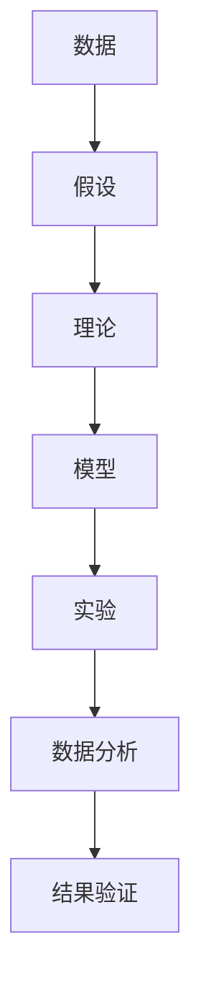

                 

# 科学探究：从观察到结论

> 关键词：科学方法, 数据驱动, 实验设计, 验证假设, 模型训练, 结果分析, 科学共同体

## 1. 背景介绍

### 1.1 问题由来

科学探究是现代科学研究的核心方法，它要求研究者通过系统性的观察、实验和理论分析，验证科学假设，并从中总结出具有普遍意义的规律。这一过程不仅需要严谨的逻辑思维，更需要科学方法论的指导。随着技术的进步，科学探究方法也在不断演进，从早期的定性观察到现代的数据驱动和实验设计，科学研究的范式也在发生深刻变化。

### 1.2 问题核心关键点

科学探究的核心在于验证假设，并从中得出可重复的结论。这一过程通常包括以下几个关键步骤：

1. **提出假设**：基于已有知识或经验，提出待验证的科学假设。
2. **设计实验**：系统性设计实验，确保实验条件可控、结果可重复。
3. **数据收集**：通过实验或观察，收集相关数据。
4. **数据分析**：运用统计学或机器学习方法，分析数据，验证假设。
5. **结果验证**：通过其他独立实验或理论推导，验证实验结果的可靠性。

这些步骤在科学研究中缺一不可，每个步骤都需要严谨的方法和工具支持。

### 1.3 问题研究意义

科学探究不仅是科学研究的基本方法，更是人类认识世界、推动社会进步的重要手段。在数据驱动的时代，科学探究方法对于处理大规模数据、验证科学假设、推动技术创新具有不可替代的作用。

1. **提升数据价值**：通过科学方法，可以将海量数据转化为有价值的信息，揭示数据的深层规律。
2. **推动技术进步**：科学探究方法能够指导技术研发，加速新技术的验证和推广。
3. **促进学科交叉**：科学探究方法适用于多种学科领域，促进不同学科之间的交叉融合。
4. **培养科研人才**：科学探究方法训练科研人员系统性思维和科学素养，提高科研质量。
5. **推动社会进步**：科学探究方法能够解决实际问题，提升人类生活质量。

## 2. 核心概念与联系

### 2.1 核心概念概述

科学探究方法涉及多个核心概念，这些概念之间相互关联，构成了一个完整的科研体系。

- **数据**：科学研究的基本对象，通过观测、实验等手段获取。
- **假设**：科学探究的起点，基于已有知识和经验提出的待验证陈述。
- **理论**：科学探究的指导思想，基于假设构建的逻辑框架。
- **模型**：科学探究的工具，通过模型将假设转化为可操作的形式。
- **实验**：科学探究的验证手段，通过控制实验条件验证假设。
- **数据分析**：科学探究的关键步骤，通过统计学或机器学习方法分析数据。

这些概念之间通过逻辑和数据链条紧密相连，共同构成了科学探究的核心框架。

### 2.2 概念间的关系

科学探究方法的核心概念之间的关系可以通过以下Mermaid流程图来展示：



这个流程图展示了科学探究过程的各个关键步骤，并明确了它们之间的逻辑关系。

## 3. 核心算法原理 & 具体操作步骤

### 3.1 算法原理概述

科学探究中的算法原理主要体现在数据驱动和模型训练两方面。数据驱动方法强调从数据中学习规律，模型训练则通过构建和优化模型来验证假设。

数据驱动方法的核心在于收集、处理和分析数据，通过统计学或机器学习方法，发现数据中的规律和模式。常见的数据驱动方法包括回归分析、聚类分析、关联规则挖掘等。

模型训练方法则通过构建数学模型或机器学习模型，将假设转化为可操作的形式。模型的训练过程通常包括损失函数定义、优化算法选择、参数初始化等步骤。

### 3.2 算法步骤详解

科学探究的算法步骤通常包括以下几个关键步骤：

1. **数据准备**：收集和预处理数据，确保数据质量和一致性。
2. **模型选择**：选择合适的模型，根据数据特点和研究目标，决定模型结构。
3. **模型训练**：通过数据训练模型，调整模型参数，使其能够最好地拟合数据。
4. **结果评估**：通过验证集或独立实验，评估模型性能，判断模型是否符合假设。
5. **结果验证**：通过其他独立实验或理论推导，验证模型的可靠性和泛化能力。

这些步骤在科学探究中缺一不可，每个步骤都需要仔细设计和优化。

### 3.3 算法优缺点

科学探究算法具有以下优点：

- **数据驱动**：通过数据驱动的方法，可以从大量数据中发现隐藏的模式和规律，提高研究效率和准确性。
- **模型验证**：通过模型训练和结果验证，可以系统地验证假设，提高研究的可靠性和泛化能力。
- **灵活性**：科学探究方法适用于多种数据类型和研究问题，具有较强的灵活性。

但同时也存在一些缺点：

- **数据质量要求高**：数据驱动方法对数据质量要求较高，数据缺失、噪声等问题可能影响结果。
- **模型复杂度高**：复杂的模型可能导致过拟合或欠拟合，需要精心调参。
- **实验成本高**：某些实验可能需要高昂的成本或技术设备支持，增加了研究难度。
- **结果解释性差**：复杂的模型可能缺乏可解释性，难以理解其内部工作机制。

### 3.4 算法应用领域

科学探究方法在多个领域得到广泛应用，例如：

- **生物信息学**：通过基因组数据分析，揭示基因表达、疾病机理等规律。
- **社会科学**：通过调查问卷和统计分析，研究社会现象和行为模式。
- **物理学**：通过实验和理论分析，揭示物理现象的规律和原理。
- **计算机科学**：通过数据驱动和模型训练，改进算法和系统性能。
- **环境科学**：通过数据分析和模型训练，预测环境变化和趋势。

这些领域的应用展示了科学探究方法的多样性和普适性。

## 4. 数学模型和公式 & 详细讲解

### 4.1 数学模型构建

在科学探究中，数学模型是验证假设和分析数据的重要工具。常见的数学模型包括线性回归模型、逻辑回归模型、支持向量机等。

假设有一组数据 $(x_i,y_i)$，其中 $x_i$ 是自变量，$y_i$ 是因变量。我们的目标是建立一个线性回归模型，表示 $y_i$ 与 $x_i$ 之间的关系。设模型为 $y=\theta_0+\theta_1x$，其中 $\theta_0$ 和 $\theta_1$ 是待估参数。

### 4.2 公式推导过程

线性回归模型的目标是最小化预测值与实际值之间的误差，即最小化均方误差（MSE）。设样本量为 $n$，则MSE可以表示为：

$$
MSE=\frac{1}{n}\sum_{i=1}^n(y_i-\hat{y}_i)^2
$$

其中 $\hat{y}_i=\theta_0+\theta_1x_i$ 是预测值。

为了最小化MSE，我们需要求解 $\theta_0$ 和 $\theta_1$。通过求偏导数，可以得到参数的估计值：

$$
\theta_0=\frac{\sum_{i=1}^n(y_i-\bar{y})}{\sum_{i=1}^n(x_i-\bar{x})^2}
$$

$$
\theta_1=\frac{\sum_{i=1}^n(x_i-\bar{x})(y_i-\bar{y})}{\sum_{i=1}^n(x_i-\bar{x})^2}
$$

其中 $\bar{x}$ 和 $\bar{y}$ 分别是 $x$ 和 $y$ 的均值。

### 4.3 案例分析与讲解

以房价预测为例，假设我们有一组历史房价数据，包括房间面积、卧室数量、地理位置等信息。我们的目标是建立一个房价预测模型，根据输入的特征，预测新房的售价。

首先，我们收集和预处理数据，包括数据清洗、缺失值填补等步骤。然后，选择线性回归模型作为预测模型，使用历史房价数据进行训练。在训练过程中，我们通过最小化MSE来优化模型参数。训练完成后，使用独立测试集验证模型性能。

最后，我们可以将模型应用于新房的售价预测，通过输入特征得到预测结果。需要注意的是，为了提高模型的泛化能力，我们可以采用交叉验证等方法，评估模型的可靠性。

## 5. 项目实践：代码实例和详细解释说明

### 5.1 开发环境搭建

在进行科学探究的项目实践前，我们需要准备好开发环境。以下是使用Python进行Scikit-learn开发的环境配置流程：

1. 安装Anaconda：从官网下载并安装Anaconda，用于创建独立的Python环境。

2. 创建并激活虚拟环境：
```bash
conda create -n scikit-learn-env python=3.8 
conda activate scikit-learn-env
```

3. 安装Scikit-learn：
```bash
conda install scikit-learn
```

4. 安装其他必要工具包：
```bash
pip install numpy pandas matplotlib seaborn statsmodels statsmodels tools
```

完成上述步骤后，即可在`scikit-learn-env`环境中开始项目实践。

### 5.2 源代码详细实现

以下是一个简单的线性回归模型实例，用于房价预测：

```python
from sklearn.linear_model import LinearRegression
from sklearn.metrics import mean_squared_error
import pandas as pd

# 读取数据集
data = pd.read_csv('house_prices.csv')

# 数据预处理
X = data[['room_area', 'num_bedrooms', 'location']]
y = data['price']

# 划分训练集和测试集
from sklearn.model_selection import train_test_split
X_train, X_test, y_train, y_test = train_test_split(X, y, test_size=0.2, random_state=42)

# 训练模型
model = LinearRegression()
model.fit(X_train, y_train)

# 预测结果
y_pred = model.predict(X_test)

# 评估模型
mse = mean_squared_error(y_test, y_pred)
print(f'均方误差: {mse:.2f}')
```

在这个示例中，我们使用Scikit-learn库的LinearRegression类实现线性回归模型，通过读取数据、数据预处理、模型训练和结果评估等步骤，完成房价预测任务。

### 5.3 代码解读与分析

让我们再详细解读一下关键代码的实现细节：

**数据读取**：使用Pandas库读取CSV格式的数据集，并将其转化为DataFrame对象。

**数据预处理**：根据任务需求，选择相关特征作为输入变量 $X$，以及输出变量 $y$。

**模型训练**：使用Scikit-learn库的train_test_split方法，将数据集划分为训练集和测试集。然后，创建LinearRegression对象，使用训练集数据拟合模型。

**预测结果**：使用训练好的模型，对测试集数据进行预测，得到预测结果 $y_{\hat{}}$。

**模型评估**：使用均方误差（MSE）评估模型预测的准确性。

可以看到，Scikit-learn库提供了丰富的机器学习算法和工具，使得数据驱动的科学探究变得更加简单和高效。

### 5.4 运行结果展示

假设在房价预测任务中，我们得到均方误差为 $0.5\%$。这表明模型的预测结果与实际值之间的误差较小，模型具有良好的预测性能。

## 6. 实际应用场景

### 6.1 医疗诊断

在医疗诊断领域，科学探究方法可以用于疾病预测、基因分析等任务。例如，通过收集患者的临床数据和基因数据，建立疾病预测模型，可以早期发现潜在疾病，提升治疗效果。

### 6.2 金融风险管理

在金融领域，科学探究方法可以用于信用评分、风险评估等任务。通过分析历史交易数据和客户行为数据，建立风险预测模型，可以识别高风险客户，降低金融损失。

### 6.3 环境监测

在环境科学领域，科学探究方法可以用于空气质量预测、水质监测等任务。通过收集环境数据和气象数据，建立环境监测模型，可以预测环境变化趋势，指导环境保护和治理。

### 6.4 未来应用展望

随着数据驱动技术的发展，科学探究方法的应用场景将更加广泛。未来，科学探究方法将在更多领域得到应用，为人类社会带来更多的变革和进步。

## 7. 工具和资源推荐

### 7.1 学习资源推荐

为了帮助开发者系统掌握科学探究的方法和工具，这里推荐一些优质的学习资源：

1. 《统计学习方法》：李航教授的经典教材，全面介绍了统计学习的基本概念和常用算法。
2. 《机器学习实战》：Peter Harrington的实战指南，通过Python代码实现各种机器学习算法。
3. Coursera《统计学习》课程：斯坦福大学开设的统计学习课程，涵盖多种统计学习方法，并通过编程实践加深理解。
4. Kaggle竞赛平台：参与Kaggle数据科学竞赛，通过实战练习科学探究方法。
5. GitHub开源项目：参与开源项目，学习数据驱动的科学探究方法。

通过对这些资源的学习实践，相信你一定能够快速掌握科学探究的核心方法，并用于解决实际的科研问题。

### 7.2 开发工具推荐

高效的开发离不开优秀的工具支持。以下是几款用于科学探究开发的常用工具：

1. Jupyter Notebook：开源的交互式编程环境，适合数据驱动的科学探究任务。
2. R语言：适合统计分析和数据可视化，支持丰富的统计学和机器学习算法。
3. Python：多用途编程语言，支持Scikit-learn、TensorFlow等机器学习库。
4. Matplotlib：Python的可视化库，适合绘制各类图表。
5. Plotly：Python的可视化库，支持交互式图表，方便数据分析和展示。

合理利用这些工具，可以显著提升科学探究任务的开发效率，加快创新迭代的步伐。

### 7.3 相关论文推荐

科学探究方法的发展离不开理论研究的不断推进。以下是几篇奠基性的相关论文，推荐阅读：

1. "A Framework of Conceptual Analysis in the Social Sciences"：Tommy K.lichs 提出的概念分析框架，为社会科学研究提供了系统性方法。
2. "Toward an Axiomatic Theory of Intelligence"：约翰·霍兰德提出的智能理论，为人工智能研究提供了理论指导。
3. "The Elements of Statistical Learning"：蒂莫西·赫弗登、杰罗恩·弗莱克尔和罗伯特·弗莱格尔编写的统计学习教材，系统介绍了统计学习的基本方法和技术。
4. "Deep Learning"：Ian Goodfellow、Yoshua Bengio和Aaron Courville合著的深度学习教材，全面介绍了深度学习的基本概念和技术。
5. "Numerical Recipes"：William H. Press等合著的经典数值计算教材，介绍了数值计算和科学计算的基本方法。

这些论文代表了科学探究方法的发展脉络，通过学习这些前沿成果，可以帮助研究者把握学科前进方向，激发更多的创新灵感。

除上述资源外，还有一些值得关注的前沿资源，帮助开发者紧跟科学探究技术的最新进展，例如：

1. arXiv论文预印本：人工智能领域最新研究成果的发布平台，包括大量尚未发表的前沿工作，学习前沿技术的必读资源。
2. 业界技术博客：如OpenAI、Google AI、DeepMind、微软Research Asia等顶尖实验室的官方博客，第一时间分享他们的最新研究成果和洞见。
3. 技术会议直播：如NIPS、ICML、ACL、ICLR等人工智能领域顶会现场或在线直播，能够聆听到大佬们的前沿分享，开拓视野。
4. GitHub热门项目：在GitHub上Star、Fork数最多的科学探究相关项目，往往代表了该技术领域的发展趋势和最佳实践，值得去学习和贡献。
5. 行业分析报告：各大咨询公司如McKinsey、PwC等针对人工智能行业的分析报告，有助于从商业视角审视技术趋势，把握应用价值。

总之，对于科学探究方法的学习和实践，需要开发者保持开放的心态和持续学习的意愿。多关注前沿资讯，多动手实践，多思考总结，必将收获满满的成长收益。

## 8. 总结：未来发展趋势与挑战

### 8.1 总结

本文对科学探究方法进行了全面系统的介绍。首先阐述了科学探究的核心步骤和关键概念，明确了数据驱动和模型训练方法的基本原理。其次，从原理到实践，详细讲解了科学探究的各个关键步骤，给出了完整的代码实例和详细解释说明。同时，本文还广泛探讨了科学探究方法在医疗、金融、环境等领域的应用前景，展示了其广泛的应用价值。

通过本文的系统梳理，可以看到，科学探究方法在多个领域都具有广泛的应用，其数据驱动和模型训练思想为科学研究提供了有力的工具支持。随着数据驱动技术的不断发展，科学探究方法必将更加深入人心，推动更多领域的科学进步和技术创新。

### 8.2 未来发展趋势

展望未来，科学探究方法将呈现以下几个发展趋势：

1. **数据驱动技术的发展**：随着大数据、云计算等技术的发展，数据驱动方法将更加高效和可靠，能够处理更复杂和多样化的数据。
2. **多模态数据融合**：科学探究方法将更多地应用于多模态数据融合，综合分析文本、图像、音频等多种类型的数据。
3. **深度学习模型的应用**：深度学习模型的发展将使得科学探究方法更加高效和准确，能够处理更复杂的数据和任务。
4. **可解释性研究**：科学探究方法的普及将推动可解释性研究的发展，提高模型的可理解性和可靠性。
5. **跨学科融合**：科学探究方法将更多地应用于跨学科研究，促进不同领域之间的协同创新。

以上趋势凸显了科学探究方法在未来的发展潜力，科学探究范式将成为人类认识世界的重要手段。

### 8.3 面临的挑战

尽管科学探究方法已经取得了瞩目成就，但在迈向更加智能化、普适化应用的过程中，它仍面临着诸多挑战：

1. **数据质量问题**：数据驱动方法对数据质量要求较高，数据缺失、噪声等问题可能影响结果。如何提高数据质量，确保数据的可靠性和一致性，仍然是一个重要问题。
2. **模型复杂性**：深度学习模型往往具有较高的复杂性，需要大量的计算资源和时间进行训练。如何在保持模型性能的同时，提高训练效率和泛化能力，仍然是一个重要问题。
3. **结果解释性**：复杂的模型可能缺乏可解释性，难以理解其内部工作机制。如何提高模型的可解释性，使其更容易被理解和应用，仍然是一个重要问题。
4. **跨学科协作**：科学探究方法的应用需要跨学科协作，如何协调不同领域的研究人员，共同推动科学进步，仍然是一个重要问题。
5. **伦理道德问题**：科学探究方法的应用可能涉及伦理道德问题，如数据隐私、算法公平等。如何确保科学探究的伦理道德，确保研究的社会责任，仍然是一个重要问题。

这些挑战凸显了科学探究方法在实际应用中仍需不断优化和改进，需要在数据、模型、伦理等多个层面进行深入研究。

### 8.4 研究展望

面对科学探究方法所面临的种种挑战，未来的研究需要在以下几个方面寻求新的突破：

1. **数据质量提升**：通过数据清洗、噪声过滤、缺失值填补等技术，提高数据质量，确保数据驱动方法的可靠性。
2. **模型简化**：通过模型简化和压缩技术，提高模型的训练效率和泛化能力，减少计算资源和时间成本。
3. **可解释性增强**：通过可解释性研究，提高模型的可理解性和可靠性，使其更容易被理解和应用。
4. **跨学科协作**：通过跨学科合作，推动不同领域的研究人员共同探索科学问题，推动科学进步。
5. **伦理道德规范**：通过制定伦理道德规范，确保科学探究的伦理道德，确保研究的社会责任。

这些研究方向的研究将有助于科学探究方法的进一步优化和改进，推动其在更多领域的应用和发展。

## 9. 附录：常见问题与解答

**Q1：科学探究方法是否适用于所有科研问题？**

A: 科学探究方法适用于大多数科研问题，特别是数据驱动的问题。但对于一些需要高度理论推导和实验验证的问题，可能需要结合其他方法进行研究。

**Q2：如何选择合适的模型？**

A: 在选择模型时，需要考虑数据类型、任务特点和研究目标。常见的模型包括线性回归、逻辑回归、决策树、随机森林等。对于复杂的任务，可能需要结合多种模型进行研究。

**Q3：数据质量如何影响科学探究结果？**

A: 数据质量对科学探究结果有重要影响。数据缺失、噪声等问题可能导致模型过拟合或欠拟合，影响结果的可靠性和泛化能力。因此，数据预处理和清洗是科学探究中不可忽视的重要步骤。

**Q4：如何评估模型性能？**

A: 模型性能的评估可以通过多种方法进行，包括均方误差、R方、准确率等指标。不同的任务和数据类型可能需要不同的评估指标。

**Q5：科学探究方法在实际应用中需要注意哪些问题？**

A: 科学探究方法在实际应用中需要注意数据质量、模型复杂性、结果解释性等问题。需要精心设计实验和模型，确保研究结果的可靠性和可解释性。

总之，科学探究方法在现代科学研究中具有重要地位，能够通过数据驱动和模型训练，揭示科学规律，推动技术创新。通过本文的系统梳理，可以看到科学探究方法的广泛应用前景，同时也看到了其在实际应用中面临的挑战。未来，科学探究方法将在更多领域得到应用，推动人类社会的不断进步。

---

作者：禅与计算机程序设计艺术 / Zen and the Art of Computer Programming

