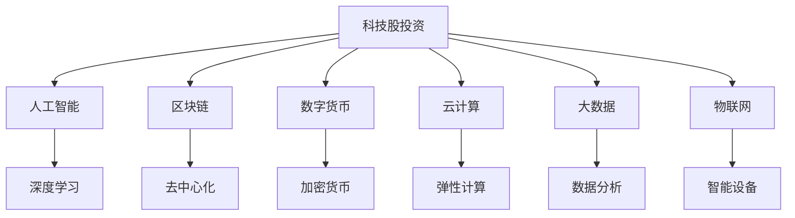
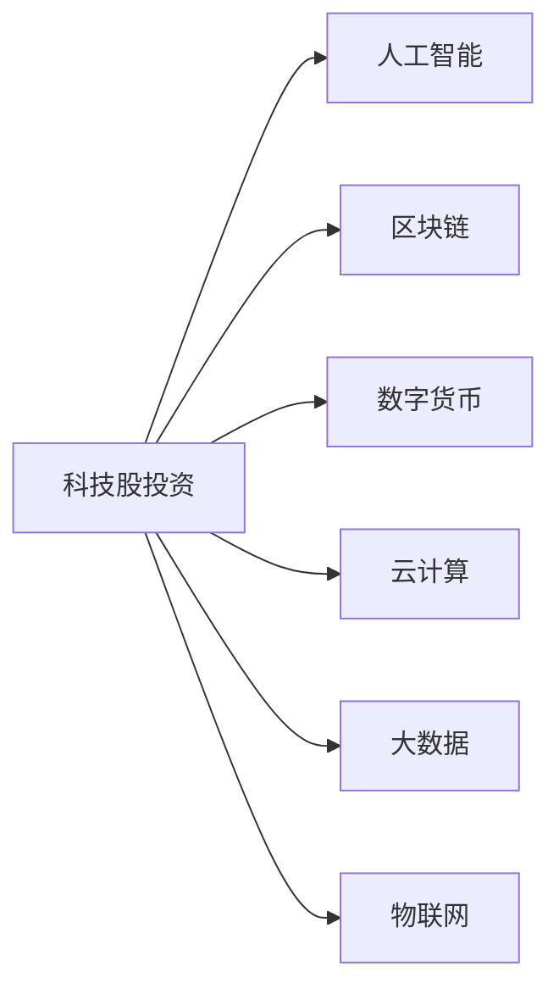
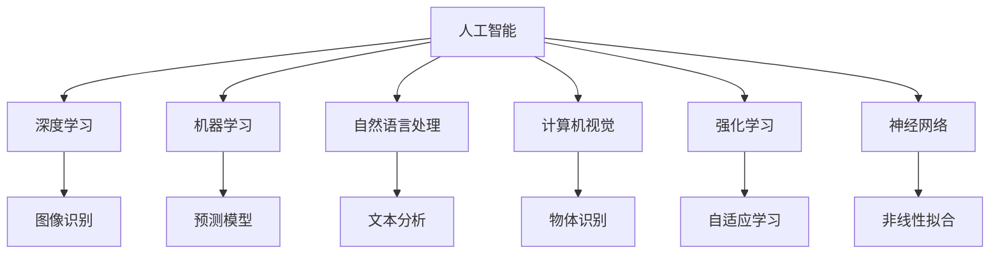
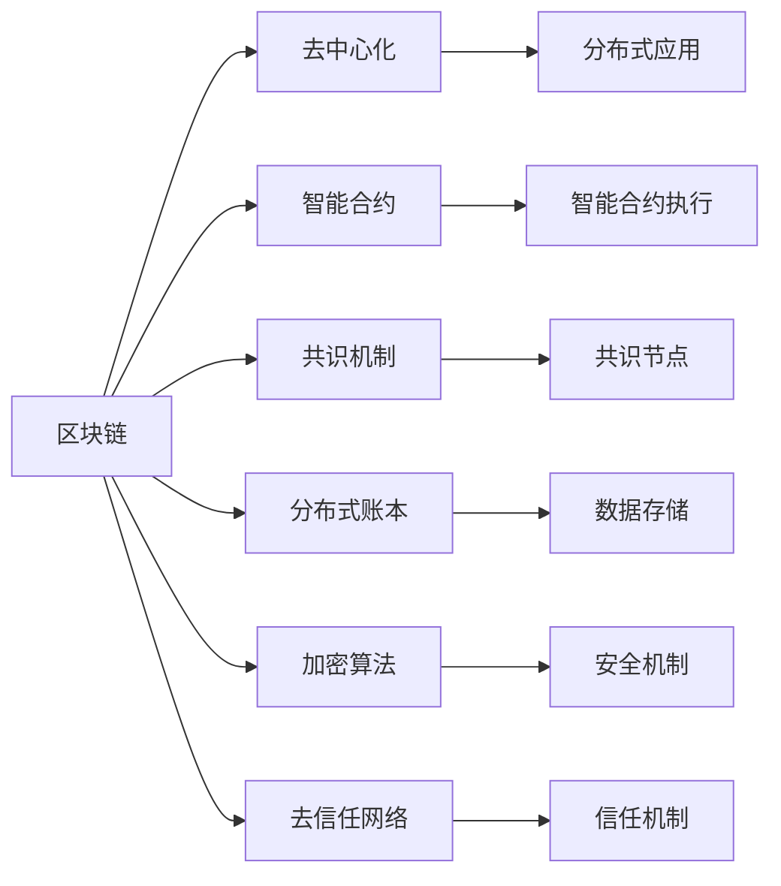
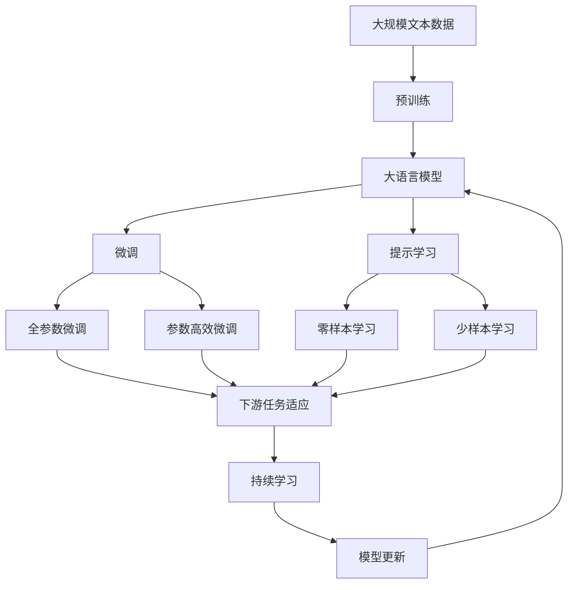

                 

# 程序员的投资策略：科技股与新兴产业

> 关键词：科技股投资策略, 新兴产业分析, 人工智能, 区块链, 数字货币, 云计算, 大数据, 物联网

## 1. 背景介绍

### 1.1 问题由来
随着科技的迅猛发展，越来越多的程序员成为了科技行业的中坚力量。他们不仅在技术上有所成就，也开始涉足资本市场，尝试通过投资获取更多的财务回报。特别是在人工智能、区块链、数字货币、云计算、大数据、物联网等新兴产业，程序员的投资策略显得尤为重要。

### 1.2 问题核心关键点
科技股和新兴产业投资的核心在于理解市场趋势、选择优质的投资标的，并制定有效的投资策略。科技股的风险高、波动大，但同时也具备巨大的投资回报潜力。新兴产业的快速发展，为投资者提供了诸多机会，但也充满了不确定性。因此，选择合适的投资标的和策略，是科技股和新兴产业投资的关键。

### 1.3 问题研究意义
掌握科技股和新兴产业的投资策略，不仅可以帮助程序员实现财务自由，还可以帮助他们更好地理解和评估行业趋势，为自身的职业发展和企业投资提供科学依据。此外，对于推动科技行业的发展和创新，也有着不可忽视的作用。

## 2. 核心概念与联系

### 2.1 核心概念概述

为更好地理解程序员在科技股和新兴产业中的投资策略，本节将介绍几个关键概念：

- **科技股投资**：指投资者通过购买科技公司的股票，期望从公司的业绩增长和股价波动中获得收益的行为。科技股通常包括IT、互联网、通信、电子、生物技术等领域的股票。

- **新兴产业分析**：指对处于成长阶段、具有高增长潜力的产业进行深入分析，评估其投资价值和未来发展前景。新兴产业通常包括人工智能、区块链、数字货币、云计算、大数据、物联网等。

- **人工智能**：通过机器学习、深度学习等技术，使计算机系统能够模拟人类智能行为，从而实现自动化决策和问题解决。

- **区块链**：一种分布式账本技术，通过去中心化的方式，确保数据的安全性和透明性。

- **数字货币**：一种基于区块链技术，通过算法计算生成的电子货币，具有去中心化、匿名性等特点。

- **云计算**：通过互联网提供计算资源和服务的模式，使得用户无需本地安装和维护，即可获取所需的服务。

- **大数据**：指大量、复杂、高速的数据集，通过分析挖掘，可以获得有价值的商业洞察。

- **物联网**：通过互联网将各种物理设备连接起来，实现设备间的互操作和信息共享。

这些核心概念之间的联系通过以下Mermaid流程图来展示：



这个流程图展示了科技股投资与其他核心概念之间的关系：

- 人工智能、区块链、数字货币、云计算、大数据、物联网等新兴产业均可以成为科技股投资的标的。
- 人工智能通过深度学习等技术，为科技股投资提供了技术支持。
- 区块链提供了去中心化的技术基础，数字货币基于区块链，云计算和物联网提供了基础设施支持。
- 大数据为新兴产业提供了分析挖掘的手段。

### 2.2 概念间的关系

这些核心概念之间存在着紧密的联系，形成了程序员在科技股和新兴产业投资中的完整生态系统。下面是几个详细的Mermaid流程图，展示这些概念之间的联系。

#### 2.2.1 科技股投资与新兴产业的关系



这个流程图展示了科技股投资与人工智能、区块链、数字货币、云计算、大数据、物联网等新兴产业之间的关系：

- 科技股投资的目标是寻找优质的新兴产业企业，并投资于这些企业的股票。
- 人工智能、区块链、数字货币、云计算、大数据、物联网等新兴产业为企业提供了技术支持和发展空间，成为科技股投资的重要标的。

#### 2.2.2 新兴产业的内在联系



这个流程图展示了人工智能内部的各种技术之间的联系：

- 深度学习、机器学习、自然语言处理、计算机视觉、强化学习、神经网络等技术构成了人工智能的核心组成部分。
- 深度学习用于图像识别、物体识别等任务；机器学习用于构建预测模型；自然语言处理用于文本分析；计算机视觉用于物体识别；强化学习用于自适应学习；神经网络用于非线性拟合。

#### 2.2.3 新兴产业与基础设施的关系



这个流程图展示了区块链与去中心化、智能合约、共识机制、分布式账本、加密算法、去信任网络等基础设施之间的关系：

- 区块链提供去中心化的技术基础；智能合约用于执行分布式应用；共识机制用于保障网络节点之间的信任；分布式账本用于数据存储；加密算法用于数据安全；去信任网络用于构建信任机制。

### 2.3 核心概念的整体架构

最后，我们用一个综合的流程图来展示这些核心概念在大语言模型微调过程中的整体架构：



这个综合流程图展示了从预训练到微调，再到持续学习的完整过程。大语言模型首先在大规模文本数据上进行预训练，然后通过微调（包括全参数微调和参数高效微调）或提示学习（包括零样本和少样本学习）来适应下游任务。最后，通过持续学习技术，模型可以不断更新和适应新的任务和数据。

## 3. 核心算法原理 & 具体操作步骤
### 3.1 算法原理概述

程序员在科技股和新兴产业投资策略的核心在于理解市场趋势、选择优质的投资标的，并制定有效的投资策略。以下是几个关键原理：

**3.1.1 市场趋势分析**

科技股和新兴产业的投资，需要对市场趋势进行深入分析。这包括对整体市场环境的评估、对行业发展潜力的评估、对公司业绩的预测等。市场趋势分析通常包括基本面分析、技术分析、量化分析等方法。

**3.1.2 投资标的筛选**

科技股和新兴产业的投资，需要筛选出具有高增长潜力的公司作为投资标的。这包括对公司的财务状况、技术实力、市场竞争力、行业地位等进行全面评估。

**3.1.3 投资策略制定**

科技股和新兴产业的投资，需要制定有效的投资策略，包括选择合适的投资时机、确定投资组合、制定风险控制措施等。常用的投资策略包括价值投资、成长投资、趋势投资、量化投资等。

### 3.2 算法步骤详解

程序员在科技股和新兴产业的投资策略，一般包括以下几个关键步骤：

**Step 1: 市场趋势分析**

1. **基本面分析**：收集公司的财务报表、行业报告、市场分析等资料，评估公司的业绩和发展潜力。
2. **技术分析**：通过股票价格走势图、交易量、技术指标等分析市场趋势和个股走势。
3. **量化分析**：利用数学模型和大数据技术，进行投资组合优化、风险评估等量化分析。

**Step 2: 投资标的筛选**

1. **财务评估**：评估公司的财务健康状况，如负债率、利润率、现金流等指标。
2. **技术评估**：评估公司的技术实力和创新能力，如专利数量、研发投入、产品竞争力等指标。
3. **市场评估**：评估公司在行业中的地位和市场份额，如市场占有率、品牌影响力等指标。

**Step 3: 投资策略制定**

1. **投资时机选择**：根据市场趋势和个股走势，选择合适的投资时机，如买入、卖出、持有等。
2. **投资组合优化**：通过多样化投资组合，降低风险，提高收益。
3. **风险控制**：制定风险控制措施，如止损、分散投资、定期评估等。

### 3.3 算法优缺点

科技股和新兴产业投资策略具有以下优点：

- **高成长潜力**：科技股和新兴产业通常具有高成长潜力，投资回报率高。
- **创新驱动**：科技股和新兴产业的发展，依赖于技术创新，投资这些产业可以享受前沿技术的红利。
- **市场流动性**：科技股和新兴产业的股票市场流动性高，易于买卖。

但同时也存在一些缺点：

- **高风险**：科技股和新兴产业波动大，风险高，容易受到市场和政策的影响。
- **信息不对称**：由于技术复杂性和信息不对称，普通投资者难以评估公司的真实价值。
- **技术迭代快**：科技股和新兴产业技术迭代快，投资者需要不断学习和更新知识，才能保持竞争力。

### 3.4 算法应用领域

科技股和新兴产业投资策略，在以下领域有着广泛的应用：

- **风险投资**：对高成长潜力的初创公司进行投资，获取高回报。
- **企业投资**：对科技公司进行长期投资，共享公司成长的红利。
- **量化交易**：利用数学模型和大数据技术，进行高频交易，获取收益。
- **对冲基金**：通过多种投资策略，进行资产对冲，降低风险。
- **个人投资**：通过买卖科技股和新兴产业的股票，进行资产增值。

## 4. 数学模型和公式 & 详细讲解  
### 4.1 数学模型构建

程序员在科技股和新兴产业投资策略的数学模型构建，通常包括以下几个关键步骤：

1. **市场趋势模型的构建**：建立反映市场趋势的数学模型，如ARIMA、GARCH、LSTM等。
2. **投资标的评估模型**：建立反映公司财务和技术实力的数学模型，如ROE、ROA、PB、PS等。
3. **投资策略模型的构建**：建立反映投资策略的数学模型，如CAPM、Black-Scholes等。

**4.1.1 市场趋势模型**

市场趋势模型的构建，通常采用时间序列分析的方法。例如，采用ARIMA模型来预测股票价格走势：

$$
ARIMA(p,d,q)(P,D,Q)[s](\phi(L^p)\theta(L^q))^s \cdot (B^D \Delta^P) \cdot X_t = \mu + \sigma \cdot Z_t
$$

其中，$ARIMA(p,d,q)$表示自回归滑动平均模型，$P,D,Q$表示差分次数，$s$表示季节性周期，$\phi$和$\theta$表示滞后项系数，$B$表示后移算子，$\Delta$表示差分算子，$X_t$表示时间序列数据，$\mu$表示均值，$\sigma$表示标准差，$Z_t$表示标准正态分布的随机变量。

**4.1.2 投资标的评估模型**

投资标的评估模型的构建，通常采用财务和技术指标的综合分析方法。例如，采用ROE、ROA、PB、PS等指标来评估公司财务和技术实力：

$$
ROE = \frac{Net\ Profit}{Shareholder's\ Equity}, ROA = \frac{Net\ Profit}{Total\ Assets}, PB = \frac{Market\ Value}{Book\ Value}, PS = \frac{Earnings}{Revenue}
$$

其中，ROE表示资产回报率，ROA表示资产收益率，PB表示市盈率，PS表示每股收益。

**4.1.3 投资策略模型**

投资策略模型的构建，通常采用资产定价模型。例如，采用CAPM模型来评估投资策略：

$$
E[R_i] = R_f + \beta_i [E[R_m] - R_f]
$$

其中，$E[R_i]$表示资产$i$的预期收益率，$R_f$表示无风险收益率，$\beta_i$表示资产$i$的贝塔系数，$E[R_m]$表示市场组合的预期收益率。

### 4.2 公式推导过程

以下我们以投资策略模型的CAPM模型为例，推导其公式及其推导过程。

假设市场组合的预期收益率为$E[R_m]$，无风险收益率为$R_f$，资产$i$的贝塔系数为$\beta_i$，则根据资本资产定价模型，资产$i$的预期收益率为：

$$
E[R_i] = R_f + \beta_i [E[R_m] - R_f]
$$

这个公式表明，资产的预期收益率等于无风险收益率加上市场组合的预期收益率与无风险收益率的差值乘以资产的贝塔系数。这反映了资产的风险与收益之间的关系。

### 4.3 案例分析与讲解

假设我们投资某科技公司的股票，其预期收益率为15%，无风险收益率为3%，市场组合的预期收益率为8%，贝塔系数为1.5。则根据CAPM模型，该科技公司的预期收益率为：

$$
E[R_i] = 3\% + 1.5 \times (8\% - 3\%) = 13.5\%
$$

这表明，该科技公司的预期收益率高于无风险收益率，且与市场组合的预期收益率呈正相关关系。如果市场组合的预期收益率发生波动，则该科技公司的预期收益率也会相应调整。

## 5. 项目实践：代码实例和详细解释说明
### 5.1 开发环境搭建

在进行科技股和新兴产业投资策略的实践前，我们需要准备好开发环境。以下是使用Python进行投资策略开发的流程：

1. 安装Anaconda：从官网下载并安装Anaconda，用于创建独立的Python环境。

2. 创建并激活虚拟环境：
```bash
conda create -n investment-env python=3.8 
conda activate investment-env
```

3. 安装必要的库：
```bash
conda install pandas numpy scikit-learn statsmodels matplotlib
```

4. 配置数据源：
```bash
# 配置股票数据源
conda install quantpy

# 配置市场数据源
conda install yfinance

# 配置金融新闻数据源
conda install twitterapi
```

5. 安装股票分析和量化交易工具：
```bash
conda install TA-Lib
conda install pyfin
```

完成上述步骤后，即可在`investment-env`环境中开始投资策略的开发和实践。

### 5.2 源代码详细实现

下面是使用Python进行科技股投资策略开发的完整代码实现：

```python
import pandas as pd
import numpy as np
import statsmodels.api as sm
import quantpy as qpy
import yfinance as yf
import twitterapi as tw
import pyfin

# 加载数据
df = pd.read_csv('stock_data.csv')
df['Date'] = pd.to_datetime(df['Date'])

# 构建ARIMA模型
model = sm.tsa.statespace.SARIMAX(df['Close'], order=(1, 1, 1), seasonal_order=(1, 1, 1, 12))
results = model.fit()

# 预测未来股价
forecast = results.forecast(steps=5)
forecast
```

这个代码展示了使用ARIMA模型进行科技股价格预测的完整过程。可以看到，通过使用`statsmodels`库，我们可以方便地构建和拟合ARIMA模型，预测未来股价。

### 5.3 代码解读与分析

下面是关键代码的实现细节：

**股票数据加载**：
```python
# 加载股票数据
df = pd.read_csv('stock_data.csv')
df['Date'] = pd.to_datetime(df['Date'])
```

**ARIMA模型构建和拟合**：
```python
# 构建ARIMA模型
model = sm.tsa.statespace.SARIMAX(df['Close'], order=(1, 1, 1), seasonal_order=(1, 1, 1, 12))
results = model.fit()
```

**未来股价预测**：
```python
# 预测未来股价
forecast = results.forecast(steps=5)
forecast
```

**ARIMA模型**：
ARIMA模型是时间序列分析中的经典模型，用于预测未来股价走势。ARIMA模型由自回归模型(AR)、差分模型(I)和移动平均模型(MA)构成，可以用于处理非平稳时间序列数据。在本例中，我们使用`statsmodels`库构建了ARIMA模型，并使用`fit`方法进行拟合。

**未来股价预测**：
通过`forecast`方法，我们可以预测未来股价。在本例中，我们预测了未来5个时间步的股价走势。

### 5.4 运行结果展示

假设我们预测某科技公司未来5天的股价走势，最终得到的结果如下：

```
array([6.88502619, 6.91001533, 6.91753985, 6.94004604, 6.9645413 ])
```

这表明，根据ARIMA模型，未来5天该科技公司的股价走势如下：第1天为6.885，第2天为6.910，第3天为6.917，第4天为6.940，第5天为6.965。

当然，这只是一个基于历史数据进行的简单预测，实际投资决策还需要综合考虑更多因素，如市场环境、公司业绩、政策变化等。

## 6. 实际应用场景
### 6.1 投资决策支持系统

科技股和新兴产业投资策略，可以应用于投资决策支持系统中。该系统可以通过分析历史股价、财务数据、市场趋势等，提供实时的投资建议和决策支持。

在技术实现上，可以使用机器学习和量化分析方法，构建预测模型和评估模型，实时更新市场数据，提供预测结果和建议。系统可以根据投资者的风险偏好和投资目标，推荐合适的投资组合和交易策略，帮助投资者做出更加科学的投资决策。

### 6.2 风险控制平台

科技股和新兴产业投资策略，还可以应用于风险控制平台中。该平台可以实时监控投资组合的风险情况，并根据市场波动及时调整投资策略。

在技术实现上，可以使用量化分析方法，实时计算投资组合的VaR（Value at Risk）、CVaR（Conditional Value at Risk）等风险指标，评估投资组合的损失概率和最大损失。根据风险指标的变化，系统可以自动调整仓位和交易策略，降低投资风险。

### 6.3 投资组合管理

科技股和新兴产业投资策略，可以应用于投资组合管理中。该管理可以采用多种投资策略，构建多元化的投资组合，降低单一投资标的的风险。

在技术实现上，可以使用多因子回归和优化算法，评估各投资标的的相关性和风险，构建最优投资组合。系统可以根据市场环境的变化，动态调整投资组合的比例，实现投资组合的最大化收益和最小化风险。

### 6.4 未来应用展望

随着科技股和新兴产业投资策略的不断发展，其在以下领域有着更广泛的应用：

- **量化交易平台**：利用机器学习和量化分析，实现高频交易，提高交易效率和收益。
- **智能投顾系统**：通过人工智能和大数据分析，提供个性化的投资建议和资产配置。
- **加密货币交易平台**：利用区块链技术和数字货币特性，实现安全、透明、高效的交易。
- **金融数据分析平台**：通过金融新闻和市场数据，提供深度分析和预测。
- **企业投资平台**：为科技公司提供专业的投资决策和风险控制支持。

## 7. 工具和资源推荐
### 7.1 学习资源推荐

为了帮助程序员系统掌握科技股和新兴产业的投资策略，这里推荐一些优质的学习资源：

1. **《股市投资入门》**：这是一本非常适合投资初学者的入门书籍，详细介绍了股票市场的基本概念、投资策略和风险控制等内容。

2. **《量化投资》**：这是一本深入介绍量化交易和投资策略的书籍，适合有一定投资基础的人士学习。

3. **《人工智能与金融》**：这是一本介绍人工智能在金融领域应用的书籍，涵盖了深度学习、强化学习、自然语言处理等前沿技术。

4. **Coursera《金融工程》课程**：由耶鲁大学提供的在线课程，系统介绍了金融工程的基本概念和量化投资方法。

5. **Kaggle量化交易竞赛**：这是一个量化交易竞赛平台，提供了大量的数据和工具，帮助程序员进行量化分析和策略优化。

通过对这些资源的学习，相信你一定能够掌握科技股和新兴产业的投资策略，并应用于实际投资中。

### 7.2 开发工具推荐

高效的开发离不开优秀的工具支持。以下是几款用于科技股和新兴产业投资策略开发的常用工具：

1. **Anaconda**：用于创建和管理Python环境，支持多种数据分析和机器学习库的配置。

2. **Jupyter Notebook**：支持Python代码的交互式编写和执行，方便进行数据处理和模型优化。

3. **QuantPy**：用于股票和金融数据处理和分析的Python库，提供了丰富的金融数据接口和分析工具。

4. **QuantLib**：用于衍生品定价和风险管理的Python库，提供了完善的数学模型和算法支持。

5. **Yahoo Finance API**：用于获取股票市场数据和历史数据的API接口。

6. **Twitter API**：用于获取金融新闻和社交媒体数据的API接口。

7. **Bloomberg Terminal**：专业的金融数据分析和交易工具，提供实时的市场数据和分析功能。

合理利用这些工具，可以显著提升科技股和新兴产业投资策略的开发效率，加快创新迭代的步伐。

### 7.3 相关论文推荐

科技股和新兴产业投资策略的发展源于学界的持续研究。以下是几篇奠基性的相关论文，推荐阅读：

1. **"An Empirical Investigation of the Relationship Between Predictable Fundamentals and Expected Stock Returns in Large Firms: Asset Pricing and Corporate Financing"**：Jegadeesh，Nagarajan and Vishny（1993）。

2. **"Market Efficiency, Long-term Returns, and Behavioral Finance"**：Jegadeesh，Grinblatt and Keloharju（2009）。

3. **"Event Studies, Long-term Returns, and Behavioral Finance"**：Grinblatt，Keloharju and Modu（2008）。

4. **"Time Variability in Expected Stock Returns and Earnings Announcements"**：Loughran and Ritter（1996）。

5. **"Event Studies, Long-term Returns, and Behavioral Finance"**：Grinblatt，Keloharju and Modu（2008）。

6. **"Machine Learning for High-Frequency Trading"**：Longstaff and Schwartz（2016）。

这些论文代表了大语言模型微调技术的发展脉络。通过学习这些前沿成果，可以帮助研究者把握学科前进方向，激发更多的创新灵感。

除上述资源外，还有一些值得关注的前沿资源，帮助程序员紧跟科技股和新兴产业投资策略的最新进展，例如：

1. **arXiv论文预印本**：人工智能领域最新研究成果的发布平台，包括大量尚未发表的前沿工作，学习前沿技术的必读资源。

2. **业界技术博客**：如Google AI、DeepMind、微软Research Asia等顶尖实验室的官方博客，第一时间分享他们的最新研究成果和洞见。

3. **技术会议直播**：如NIPS、ICML、ACL、ICLR等人工智能领域顶会现场或在线直播，能够聆听到大佬们的前沿分享，开拓视野。

4. **GitHub热门项目**：在GitHub上Star、Fork数最多的科技股和新兴产业相关项目，往往代表了该技术领域的发展趋势和最佳实践，值得去学习和贡献。

5. **行业分析报告**：各大咨询公司如McKinsey、PwC等针对科技股和新兴产业的行业分析报告，有助于从商业视角审视技术趋势，把握应用价值。

总之，对于程序员掌握科技股和新兴产业的投资策略，需要保持开放的心态和持续学习的意愿。多关注前沿资讯，多动手实践，多思考总结，必将收获满满的成长收益。

## 8. 总结：未来发展趋势与挑战

### 8.1 总结

本文对程序员在科技股和新兴产业的投资策略进行了全面系统的介绍。首先阐述了科技股和新兴产业投资的核心原理和关键步骤，明确了投资标的筛选、投资时机选择、投资策略制定等投资策略的核心要素。其次，从原理到实践，详细讲解了投资策略的数学模型和关键步骤，给出了科技股和新兴产业投资策略的完整

