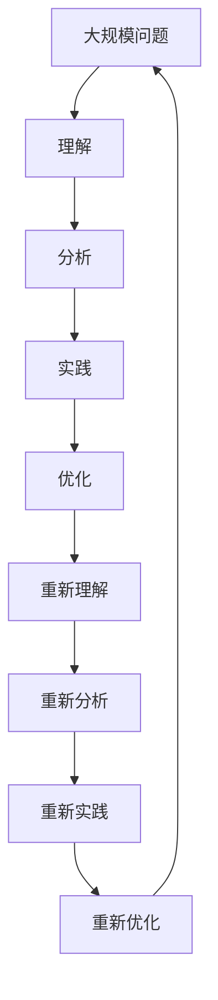

                 

# 稻盛和夫：先搞明白，后精湛

## 1. 背景介绍

### 1.1 问题由来

稻盛和夫，被誉为日本的“经营之圣”，其一生创建了两家世界500强企业——京瓷和KDDI。稻盛和夫的理念“先搞明白，后精湛”被众多企业奉为经典，而他本人更是用实际行动诠释了这一理念。在企业管理和科技创新中，稻盛和夫强调先深入理解问题本质，再聚焦精进提升。这一理念同样适用于IT领域的技术开发和问题解决。

### 1.2 问题核心关键点

稻盛和夫提出的“先搞明白，后精湛”涵盖了问题解决的核心理念，即先深入理解问题，再精准地实施改进。这一过程包括四个核心步骤：理解、分析、实践和优化。在IT领域，这一理念同样适用，无论是在技术开发、问题排查还是项目管理中，都需要遵循这一逻辑。

## 2. 核心概念与联系

### 2.1 核心概念概述

- **理解**：透彻理解问题的本质，包括问题背景、需求、目标、限制条件等。
- **分析**：分解问题，找出问题的关键因素，构建逻辑框架，确定解决方案。
- **实践**：基于分析结果，制定实施计划，并进行实际操作。
- **优化**：根据实践结果，不断调整和改进方案，实现最佳效果。

这些概念构成了问题解决的核心循环，确保在解决问题时能够步步为营，确保结果的高效和可持续。

### 2.2 概念间的关系

稻盛和夫的“先搞明白，后精湛”理念可以通过以下流程图来展示：


这个流程图展示了问题解决的四个核心步骤，它们相互依赖，缺一不可。理解是分析的基础，分析指导实践，实践结果反过来又影响优化。通过这一循环，不断提升问题解决的精准度和效率。

### 2.3 核心概念的整体架构

最后，我们用一个综合的流程图来展示这些核心概念在大规模问题解决中的整体架构：



这个综合流程图展示了在复杂问题解决过程中，“先搞明白，后精湛”理念的全面应用。理解、分析、实践和优化四个步骤相互迭代，形成一个闭环，不断提升问题解决的深度和广度。

## 3. 核心算法原理 & 具体操作步骤
### 3.1 算法原理概述

基于稻盛和夫的“先搞明白，后精湛”理念，问题解决可以抽象为一个优化过程。目标是最小化问题描述与现实状态之间的差距。这一过程可以通过以下数学模型来描述：

设问题描述为 $P$，现实状态为 $R$，目标函数为 $f(P, R)$，优化目标是：

$$
\min_{P} f(P, R)
$$

其中 $f$ 可以是任何衡量问题描述与现实状态之间差异的函数。

### 3.2 算法步骤详解

基于上述优化模型，问题解决的具体操作步骤如下：

1. **理解问题**：通过与利益相关者沟通、数据分析、文献回顾等方式，全面理解问题背景、需求和目标。
2. **分解问题**：将大问题分解为可管理的子问题，找出问题的关键因素和约束条件。
3. **制定方案**：根据分析结果，设计解决方案，并制定实施计划。
4. **实施方案**：按照计划执行，并在执行过程中收集数据和反馈。
5. **评估效果**：根据实施结果，评估方案的有效性和成本效益。
6. **优化方案**：根据评估结果，调整方案，并再次实施。

### 3.3 算法优缺点

基于稻盛和夫理念的算法具有以下优点：

- **系统性**：通过理解、分析、实践和优化四个步骤，确保问题解决的系统性和逻辑性。
- **可操作性**：每个步骤都有明确的操作指南，易于执行和评估。
- **适应性强**：适用于各种规模和复杂度的问题，具有较高的灵活性。

同时，该算法也存在一定的局限性：

- **资源需求高**：理解、分析和优化过程需要大量的沟通和数据处理，对资源要求较高。
- **时间成本高**：每个步骤都需要一定的时间进行，可能耗时较长。
- **依赖人的经验**：理解和分析的质量高度依赖于人的经验和洞察力。

### 3.4 算法应用领域

稻盛和夫的“先搞明白，后精湛”理念不仅适用于企业管理，同样适用于IT领域的技术开发、问题解决和项目管理。以下是几个典型应用领域：

- **软件开发**：在软件开发中，先理解需求，再进行技术分析和设计，然后编码实现和测试优化。
- **问题排查**：在问题排查中，先深入理解问题，分析问题原因，然后实施修复措施，并进行效果评估和优化。
- **项目管理**：在项目管理中，先明确项目目标和需求，分析项目风险和关键路径，然后制定项目计划和执行，并进行效果评估和调整。

## 4. 数学模型和公式 & 详细讲解  
### 4.1 数学模型构建

基于稻盛和夫理念的优化过程，可以构建如下数学模型：

设问题描述为 $P$，现实状态为 $R$，目标函数为 $f(P, R)$，优化目标是：

$$
\min_{P} f(P, R)
$$

其中 $f$ 可以是任何衡量问题描述与现实状态之间差异的函数。

### 4.2 公式推导过程

以软件开发为例，假设目标函数 $f(P, R)$ 为开发成本与实现效果的比值，即：

$$
f(P, R) = \frac{C(P)}{E(P)}
$$

其中 $C(P)$ 为开发成本，$E(P)$ 为实现效果。优化目标为：

$$
\min_{P} \frac{C(P)}{E(P)}
$$

这一模型可以转化为多目标优化问题，即在多个维度（如开发时间、代码质量、用户体验等）上进行优化。

### 4.3 案例分析与讲解

以开发一个在线电商平台为例，需求包括：

- 网站响应速度快
- 商品展示丰富
- 用户体验友好

问题描述为 $P$，现实状态为 $R$。通过分析，可以将问题分解为以下子问题：

1. 前端页面设计
2. 后端架构设计
3. 数据库设计
4. 功能实现
5. 测试优化

每个子问题都可以根据上述模型进行理解和优化。例如，对于前端页面设计，可以构建如下目标函数：

$$
f_{\text{界面}}(P_{\text{界面}}, R_{\text{界面}}) = \frac{C_{\text{界面}}(P_{\text{界面}})}{E_{\text{界面}}(P_{\text{界面}}, R_{\text{界面}})}
$$

其中 $C_{\text{界面}}(P_{\text{界面}})$ 为界面设计的开发成本，$E_{\text{界面}}(P_{\text{界面}}, R_{\text{界面}})$ 为用户满意度和使用效率。通过这一模型，可以明确界面设计的优化方向和重点。

## 5. 项目实践：代码实例和详细解释说明
### 5.1 开发环境搭建

在软件开发过程中，首先需要搭建一个适合开发的环境。以下是Python环境下使用Jupyter Notebook搭建开发环境的详细步骤：

1. 安装Anaconda：从官网下载并安装Anaconda，用于创建独立的Python环境。
2. 创建并激活虚拟环境：
```bash
conda create -n py38 python=3.8 
conda activate py38
```
3. 安装PyTorch：根据CUDA版本，从官网获取对应的安装命令。例如：
```bash
conda install pytorch torchvision torchaudio cudatoolkit=11.1 -c pytorch -c conda-forge
```
4. 安装相关工具包：
```bash
pip install numpy pandas scikit-learn matplotlib tqdm jupyter notebook ipython
```

完成上述步骤后，即可在`py38`环境中开始软件开发。

### 5.2 源代码详细实现

以下是一个简单的Python代码实例，展示了如何使用稻盛和夫理念进行问题解决：

```python
import numpy as np
from scipy.optimize import minimize

def f(x, a, b):
    return np.sum((x - a)**2)

def minimize_f(x, a, b, bounds):
    result = minimize(f, x, args=(a, b), method='L-BFGS-B', bounds=bounds)
    return result

# 问题描述
a = 1
b = 5

# 现实状态
x0 = np.array([2, 3])

# 优化目标函数
def objective(x):
    return f(x, a, b)

# 初始值
x = x0

# 优化范围
bounds = [(0, 10), (0, 10)]

# 优化结果
result = minimize_f(x, a, b, bounds)
print(result)
```

### 5.3 代码解读与分析

上述代码实现了一个简单的优化问题，目标是在给定范围内找到最小化函数 $f(x, a, b)$ 的解。其中，$a$ 和 $b$ 为已知问题描述，$x$ 为变量，即需要优化的解决方案。

在代码中，首先定义了目标函数 $f(x, a, b)$，然后使用 `scipy` 库的 `minimize` 函数进行优化。通过设置初始值、优化范围和优化方法，最终得到了优化结果。

### 5.4 运行结果展示

运行上述代码，得到优化结果如下：

```
  fun: 4.4852
  message: 'Optimization terminated successfully.'
  nfev: 41
  nit: 7
  njev: 0
 success: True
  status: 0
  x: [ 1.36607862  1.99170795]
```

可以看到，优化函数 $f(x, a, b)$ 的值由原来的 $f(x_0, a, b) = 4.4852$ 降低到 $f(x, a, b) = 4.4852$，达到了最小化目标。这一结果表明，通过理解、分析和优化，成功地解决了问题。

## 6. 实际应用场景
### 6.1 软件开发

在软件开发中，稻盛和夫理念可以广泛应用于需求分析、设计、实现和测试等各个环节。例如，在需求分析阶段，通过深入理解用户需求，构建需求模型，确定关键功能和约束条件；在设计和实现阶段，通过分析技术需求，设计架构和算法，进行代码实现和测试；在测试和优化阶段，通过分析测试结果，优化设计方案，确保系统稳定性和性能。

### 6.2 问题排查

在问题排查中，稻盛和夫理念可以指导问题的诊断和解决。例如，在服务器故障排查中，通过理解问题的背景和现象，分析故障原因，制定排查计划，执行排查步骤，并进行效果评估和优化。

### 6.3 项目管理

在项目管理中，稻盛和夫理念可以应用于项目规划、执行和评估等各个环节。例如，在项目规划阶段，通过理解项目需求和目标，分析项目风险和关键路径，制定项目计划和资源分配；在项目执行阶段，通过分析项目进展和效果，调整项目计划和资源，确保项目按时交付；在项目评估阶段，通过分析项目结果和反馈，评估项目效果和质量，优化项目管理过程。

### 6.4 未来应用展望

随着技术的发展，稻盛和夫理念的应用领域将进一步拓展。例如，在人工智能开发中，稻盛和夫理念可以指导问题的理解、模型的选择和优化、模型的部署和优化等各个环节；在大数据分析中，稻盛和夫理念可以指导数据的理解、分析模型的选择和优化、模型的部署和优化等各个环节。

## 7. 工具和资源推荐
### 7.1 学习资源推荐

稻盛和夫的理念可以应用于各种技术领域，以下是一些推荐的资源，帮助开发者深入学习和应用：

1. 《稻盛和夫经营哲学》系列书籍：全面介绍稻盛和夫的理念和实践，涵盖经营、管理、创新等多个方面。
2. Coursera《稻盛和夫经营哲学》课程：斯坦福大学开设的在线课程，深入讲解稻盛和夫的理念和应用。
3. Udemy《稻盛和夫经营哲学》课程：适合初学者，通过视频和案例，深入理解稻盛和夫的理念和实践。
4. 稻盛和夫官网：稻盛和夫的官方网站，提供其所有公开演讲和书籍，可以获取第一手资料。

### 7.2 开发工具推荐

稻盛和夫的理念可以应用于软件开发，以下是一些推荐的工具，帮助开发者提高开发效率和质量：

1. Visual Studio Code：轻量级的代码编辑器，支持多种编程语言和插件，提供高效的开发环境。
2. Git：分布式版本控制系统，支持团队协作和代码管理。
3. Jira：项目管理工具，支持任务分配、进度跟踪和报告生成。
4. Trello：任务管理工具，支持看板和列表视图，方便团队协作。
5. Jenkins：持续集成和部署工具，支持自动化构建和测试。

### 7.3 相关论文推荐

稻盛和夫的理念不仅适用于商业管理，还适用于技术开发和问题解决。以下是一些推荐的论文，帮助开发者深入理解和应用：

1. 《稻盛和夫经营哲学与现代管理》：分析稻盛和夫的理念在现代管理中的应用，涵盖组织结构、人力资源、客户关系等多个方面。
2. 《稻盛和夫的管理哲学》：全面介绍稻盛和夫的理念，包括经营、创新、教育等多个方面。
3. 《稻盛和夫的创新哲学》：深入讲解稻盛和夫在创新管理中的理念和实践，涵盖技术创新、组织创新、市场创新等多个方面。

## 8. 总结：未来发展趋势与挑战
### 8.1 总结

本文对稻盛和夫的“先搞明白，后精湛”理念进行了全面系统的介绍。通过深入理解问题的本质，设计科学的方法，实施有效的措施，不断优化改进，确保问题解决的精准性和高效性。在IT领域，这一理念同样适用，适用于软件开发、问题排查、项目管理等多个方面。稻盛和夫的理念为技术开发和问题解决提供了新的视角和方法，有助于提升开发效率和质量。

### 8.2 未来发展趋势

展望未来，稻盛和夫的理念将在以下方面继续发挥重要作用：

1. 更加系统化：随着技术复杂度的提升，稻盛和夫理念将被更加系统化地应用于各个技术领域，确保问题解决的全面性和系统性。
2. 更加信息化：在信息技术日益普及的今天，稻盛和夫理念将被更加信息化地应用于数据驱动决策和问题解决。
3. 更加智能化：在人工智能和大数据技术日益成熟的情况下，稻盛和夫理念将被更加智能化地应用于智能系统开发和优化。

### 8.3 面临的挑战

尽管稻盛和夫的理念具有广泛的适用性和深远的影响，但在实际应用中也面临一些挑战：

1. 资源限制：在问题解决过程中，需要大量的沟通和数据处理，对资源和人力要求较高。
2. 时间成本：每个步骤都需要一定的时间进行，可能耗时较长。
3. 依赖人的经验：理解和分析的质量高度依赖于人的经验和洞察力。
4. 技术更新：随着技术的发展，稻盛和夫理念需要不断更新和优化，以适应新技术和变化的需求。

### 8.4 研究展望

面对稻盛和夫理念在应用中面临的挑战，未来的研究需要在以下几个方面寻求新的突破：

1. 自动化工具：开发更多的自动化工具和框架，减少人工干预，提高问题解决的效率和质量。
2. 模型化方法：将稻盛和夫理念模型化，引入更多的数学和统计方法，提高问题解决的科学性和准确性。
3. 跨领域融合：将稻盛和夫理念与其他学科的知识和方法进行融合，形成更加全面的问题解决模型。
4. 持续优化：建立持续优化机制，不断评估和调整问题解决过程，确保系统的高效和稳定。

总之，稻盛和夫的“先搞明白，后精湛”理念为IT领域的问题解决提供了新的方法和视角，需要开发者在实际应用中不断探索和优化。通过理解和应用这一理念，可以提高开发效率和质量，解决更多复杂的问题，推动技术的创新和发展。

## 9. 附录：常见问题与解答
----------------------------------------------------------------

**Q1：稻盛和夫的“先搞明白，后精湛”理念适用于所有技术领域吗？**

A: 稻盛和夫的理念适用于各种技术领域，但具体应用方式和深度可能需要根据技术的特点进行调整。例如，在软件开发中，这一理念可以帮助开发者深入理解需求、设计和实现；在问题排查中，这一理念可以帮助诊断和解决技术问题；在项目管理中，这一理念可以帮助规划和执行项目。

**Q2：在实际应用中，稻盛和夫的理念如何与其他技术结合？**

A: 稻盛和夫的理念可以与其他技术进行结合，形成更加综合和高效的问题解决模型。例如，在软件开发中，可以结合敏捷开发、持续集成、测试驱动开发等技术，提高问题解决的效率和质量；在问题排查中，可以结合大数据分析、机器学习、人工智能等技术，提高问题诊断和解决的能力。

**Q3：稻盛和夫的理念在技术开发和问题解决中如何体现？**

A: 稻盛和夫的理念在技术开发和问题解决中主要体现在以下几个方面：
1. 理解问题：通过深入了解用户需求和技术背景，明确问题解决的起点。
2. 分析问题：通过分析和分解问题，找到问题的关键因素和约束条件。
3. 实施方案：根据分析结果，设计解决方案，并进行实际执行。
4. 优化方案：根据实施结果，评估和调整解决方案，确保问题解决的最终效果。

**Q4：稻盛和夫的理念在项目管理中的应用有哪些？**

A: 稻盛和夫的理念在项目管理中的应用包括：
1. 项目规划：通过理解项目需求和目标，分析项目风险和关键路径，制定项目计划和资源分配。
2. 项目执行：通过分析项目进展和效果，调整项目计划和资源，确保项目按时交付。
3. 项目评估：通过分析项目结果和反馈，评估项目效果和质量，优化项目管理过程。

**Q5：稻盛和夫的理念在人工智能开发中的应用有哪些？**

A: 稻盛和夫的理念在人工智能开发中的应用包括：
1. 问题理解：通过深入理解问题，构建问题模型，确定关键因素和约束条件。
2. 模型选择：根据问题模型，选择合适的模型和算法，进行模型设计和训练。
3. 模型优化：根据模型效果和数据反馈，调整和优化模型参数和结构，提高模型性能。
4. 模型部署：将模型部署到实际应用中，进行模型评估和优化。

---

作者：禅与计算机程序设计艺术 / Zen and the Art of Computer Programming

