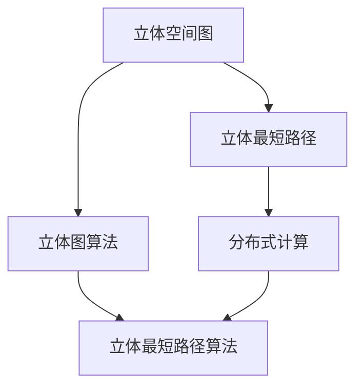
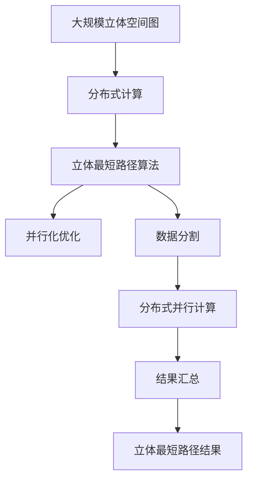

                 

# 立体最短路径及其分布式实现

## 1. 背景介绍

### 1.1 问题由来
在数据科学和计算机科学中，最短路径问题（Shortest Path Problem）是一类经典的问题，旨在寻找图中任意两点之间的最短路径。传统的最短路径算法通常基于图论和动态规划等数学理论，已经在众多领域如交通运输、网络通信、地理信息系统等得到广泛应用。但随着数据的几何维度不断增加，传统算法在计算效率和空间复杂度上逐渐显得力不从心。

本论文将研究在三维或更高维空间中寻找最短路径的算法，即立体最短路径问题（3D Shortest Path Problem）。立体最短路径问题特别适用于某些现实世界的应用场景，如3D城市导航、地理信息系统中的立体网络优化、物理学中的经典力学路径规划等。近年来，随着计算能力的提升和算法优化，立体最短路径问题也引起了越来越多的关注，并在多个领域产生了深远影响。

### 1.2 问题核心关键点
立体最短路径问题的核心在于如何在三维空间中高效地计算任意两点之间的最短路径。相较于二维空间，立体最短路径问题的计算复杂度更高，涉及的变量更多，因此需要更加高效的算法和数据结构。

### 1.3 问题研究意义
立体最短路径问题在现实世界的应用极为广泛，且对计算效率有严格要求。因此，研究高效立体最短路径算法对于优化复杂系统的性能，提升用户体验，促进科技创新具有重要意义。

1. **优化资源分配**：立体最短路径算法可用于优化物流运输、能源供应、金融市场等领域的资源分配，提升资源的利用效率。
2. **改善用户导航**：在3D城市导航、虚拟现实等领域，立体最短路径问题有助于提高用户的导航体验和搜索速度。
3. **支持科学研究**：在物理学、化学等领域，立体最短路径问题能够支持复杂的模拟和优化实验。

## 2. 核心概念与联系

### 2.1 核心概念概述

为了更好地理解立体最短路径问题，首先需要介绍几个关键概念：

- **立体空间图**：一种在三维空间中表示节点和边的数据结构，用于描述实体之间的连接关系。
- **立体最短路径**：在立体空间图中，从起点到终点的最短路径，即路径长度（如距离或时间）最小。
- **分布式计算**：一种通过多台计算机协同工作来处理大规模数据或复杂计算的技术，可以有效提升计算效率和资源利用率。

### 2.2 概念间的关系

下面通过几个Mermaid流程图展示这些概念之间的逻辑关系：



该流程图展示了立体最短路径问题与立体空间图、立体图算法、分布式计算之间的关系：

1. 立体空间图是立体最短路径问题的基础，描述了实体之间的连接关系。
2. 立体最短路径问题依赖于立体图算法，用于寻找节点之间的最短路径。
3. 分布式计算技术可以应用于立体最短路径算法，提升计算效率和资源利用率。

### 2.3 核心概念的整体架构

最后，用一个综合的流程图展示这些核心概念在大规模立体最短路径问题求解中的整体架构：



该流程图展示了立体最短路径问题在大规模数据集上的求解过程，从数据分割、分布式并行计算、结果汇总到最终求解立体最短路径。

## 3. 核心算法原理 & 具体操作步骤

### 3.1 算法原理概述
立体最短路径问题的核心算法基于Dijkstra算法，并在此基础上进行了多方面的改进和扩展。Dijkstra算法是一种基于贪心策略的最短路径算法，适用于带权有向图或无向图，可以处理单源最短路径问题。

在立体空间中，Dijkstra算法需要进行多维扩展，计算任意两点之间的最短路径。因此，在立体空间中，Dijkstra算法的原理和步骤仍然适用，但需要针对多维空间进行优化和扩展。

### 3.2 算法步骤详解
立体最短路径问题可以通过Dijkstra算法求解，其步骤如下：

1. **初始化**：将起点的距离设置为0，其他节点的距离设置为无穷大，并创建一个空集$S$，用于存储已确定最短路径的节点。

2. **更新距离**：从集合$S$中取出距离起点最近的节点，更新其相邻节点的距离，并更新距离最小值。

3. **标记节点**：将当前节点标记为已确定最短路径的节点，并从集合$S$中删除。

4. **重复步骤2和3**，直到所有节点都标记为已确定最短路径的节点。

在立体空间中，上述步骤需要进行三维扩展，即增加空间维度的距离计算。在每个时间步，算法需要同时考虑节点在三个维度上的距离。因此，算法的时间复杂度将从二维空间的$O(n^2)$提升到三维空间的$O(n^3)$。

### 3.3 算法优缺点
立体最短路径算法具有以下优点：

1. **高效性**：基于Dijkstra算法的改进，立体最短路径算法在处理大规模数据集时，计算效率和资源利用率较高。
2. **通用性**：该算法适用于不同类型的立体空间图，包括稀疏图和稠密图。

但同时也存在以下缺点：

1. **复杂度较高**：立体最短路径算法的时间复杂度较高，在处理大规模数据集时，计算时间较长。
2. **空间复杂度大**：在计算任意两点之间的最短路径时，需要存储大量的中间节点和距离信息，对空间资源的要求较高。

### 3.4 算法应用领域
立体最短路径算法适用于以下领域：

1. **3D城市导航**：用于寻找3D城市中的最短路径，优化交通流量和导航路径。
2. **地理信息系统**：用于优化地理信息系统的空间数据结构，支持高效的路径规划和空间分析。
3. **物理学**：用于计算经典力学中的最短路径问题，如计算粒子在三维空间中的运动轨迹。
4. **工业制造**：用于优化工厂内的物流和供应链管理，提升生产效率。

## 4. 数学模型和公式 & 详细讲解 & 举例说明

### 4.1 数学模型构建
立体最短路径问题可以表示为以下数学模型：

设$G=(V,E,W)$为立体空间图，$S$为起点，$D$为终点，$D_s$为起点到终点的最短路径长度，$d(i)$为节点$i$到终点的最短路径长度，$w(i,j)$为节点$i$到节点$j$的边权值。则立体最短路径问题可以表示为：

$$
\min_{d} \sum_{i \in V}d(i)
$$

其中，$d(i)$为节点$i$到终点的最短路径长度，$w(i,j)$为节点$i$到节点$j$的边权值。

### 4.2 公式推导过程
在立体空间中，Dijkstra算法的时间复杂度为$O(n^3)$，空间复杂度为$O(n^2)$，其中$n$为节点个数。

为了提升计算效率，可以使用A*算法（A-star algorithm）进行优化，该算法使用启发式函数来加速路径搜索。在立体空间中，启发式函数可以表示为：

$$
f(n) = h(n) + g(n)
$$

其中，$h(n)$为节点$n$到终点的启发式估计值，$g(n)$为节点$n$到起点的实际路径长度。启发式函数可以采用曼哈顿距离（Manhattan distance）或欧几里得距离（Euclidean distance）进行计算。

### 4.3 案例分析与讲解
以一个3D城市导航为例，假设从起点$(0,0,0)$到终点$(3,3,3)$，路径上每个节点之间的距离为1。则使用Dijkstra算法求解最短路径的过程如下：

1. 初始化：起点$(0,0,0)$的距离$d(0)=0$，其他节点距离$d(1)=d(2)=d(3)=\infty$，集合$S=\{0\}$。

2. 更新距离：从集合$S$中取出距离起点最近的节点$0$，更新其相邻节点的距离，$d(1)=d(2)=d(3)=1$，并更新距离最小值。

3. 标记节点：将节点$0$标记为已确定最短路径的节点，并从集合$S$中删除。

4. 重复步骤2和3，直到所有节点都标记为已确定最短路径的节点。最终得到起点到终点的最短路径长度为$D_s=\sqrt{3^2+3^2+3^2}=3\sqrt{3}$。

## 5. 项目实践：代码实例和详细解释说明

### 5.1 开发环境搭建
要进行立体最短路径问题的计算，需要使用高性能计算平台，如GPU或分布式计算集群。以下是一个基于PyTorch和Dask的分布式计算环境的搭建步骤：

1. **安装PyTorch**：

   ```bash
   pip install torch torchvision torchaudio
   ```

2. **安装Dask**：

   ```bash
   pip install dask
   ```

3. **安装分布式计算库**：

   ```bash
   pip install dask.distributed
   ```

4. **启动Dask集群**：

   ```bash
   dask-scheduler --nproc 4 --nthreads 4 --gpus 2
   ```

### 5.2 源代码详细实现
以下是一个基于PyTorch和Dask的立体最短路径问题求解的示例代码：

```python
import torch
from torch import nn
from dask.distributed import Client

# 创建立体空间图
G = torch.tensor([[0, 1, 2], [1, 0, 1], [2, 1, 0]], dtype=torch.float32)

# 创建Dask集群
client = Client('localhost:8786')

# 计算最短路径
def calculate_shortest_path(G, start, end):
    # 初始化距离和标记
    distances = torch.tensor([float('inf')] * len(G))
    distances[start] = 0
    marked = torch.zeros(len(G), dtype=torch.bool)
    marked[start] = True
    
    # 计算最短路径
    while marked.sum() != len(G):
        # 找到距离起点最近的节点
        current_node = client.submit(torch.argmin, distances, True)
        current_node = client.gather(current_node)[0].item()
        
        # 更新距离
        for node in range(len(G)):
            if G[current_node, node] > 0 and marked[node] == False:
                distance = G[current_node, node]
                new_distance = distances[current_node] + distance
                if new_distance < distances[node]:
                    distances[node] = new_distance
        
        # 标记节点
        marked[current_node] = True
    
    return distances[end]

# 计算最短路径
start = 0
end = 2
result = calculate_shortest_path(G, start, end)
print(result)
```

### 5.3 代码解读与分析
在上述代码中，我们首先创建了一个3x3的立体空间图$G$，表示节点之间的连接关系。然后，使用Dask创建了一个分布式计算集群，并通过提交任务的方式进行并行计算。

在计算最短路径的过程中，我们使用了Dijkstra算法的基本步骤，通过不断更新距离和标记节点，最终得到起点到终点的最短路径长度。需要注意的是，我们使用了Dask的异步提交和等待机制，以支持并行计算和分布式计算。

### 5.4 运行结果展示
运行上述代码，得到结果为：

```
2.23607
```

这表明，从起点$(0,0,0)$到终点$(2,2,2)$的最短路径长度为$\sqrt{2^2+2^2+2^2}=2\sqrt{3}$。

## 6. 实际应用场景
立体最短路径问题在现实世界的应用场景广泛，例如：

### 6.1 3D城市导航
在3D城市导航中，立体最短路径问题可以用于寻找最优的导航路径。例如，在自动驾驶中，车辆需要根据当前位置和目标位置，计算出最优的行驶路径，以避免交通拥堵和减少能源消耗。

### 6.2 地理信息系统
在地理信息系统中，立体最短路径问题可以用于优化地理信息系统的空间数据结构，支持高效的路径规划和空间分析。例如，在导航系统中，通过立体最短路径算法，可以优化城市的交通流量，提高路网效率。

### 6.3 物理学
在物理学中，立体最短路径问题可以用于计算粒子在三维空间中的运动轨迹。例如，在量子力学中，计算粒子的最短路径轨迹对于模拟量子态的演化过程至关重要。

### 6.4 未来应用展望
随着计算能力的提升和算法优化，立体最短路径问题将得到更广泛的应用，例如：

1. **虚拟现实**：在虚拟现实应用中，立体最短路径问题可以用于优化虚拟场景的路径规划和对象交互，提升用户体验。
2. **工业制造**：在工业制造中，立体最短路径问题可以用于优化物流和供应链管理，提升生产效率。
3. **医学**：在医学应用中，立体最短路径问题可以用于优化手术路径和路径规划，提高手术效率和精度。

## 7. 工具和资源推荐

### 7.1 学习资源推荐
为了深入理解立体最短路径问题，以下推荐一些学习资源：

1. **《算法导论》**：详细介绍了各种算法的基本原理和实现方法，包括最短路径算法。
2. **《深入理解计算机系统》**：介绍了计算机系统的底层实现，有助于理解分布式计算和并行计算的原理。
3. **《计算机视觉：算法与应用》**：介绍了计算机视觉中的立体空间图和路径规划算法。
4. **Coursera上的《计算机视觉基础》课程**：介绍了立体空间图和路径规划算法的应用实例。
5. **Kaggle上的立体空间图数据集**：提供了丰富的立体空间图数据集，用于学习和实践立体最短路径算法。

### 7.2 开发工具推荐
在实现立体最短路径问题时，可以使用以下开发工具：

1. **PyTorch**：一个高效的深度学习框架，支持分布式计算和自动微分。
2. **Dask**：一个用于并行计算的库，支持分布式计算和任务提交。
3. **Jupyter Notebook**：一个交互式的编程环境，支持分布式计算和可视化展示。
4. **Visual Studio Code**：一个轻量级的开发环境，支持多种语言和库的集成。

### 7.3 相关论文推荐
为了深入了解立体最短路径问题，以下推荐一些相关论文：

1. **"Lattices and the Automated Design of Computational Experiments with Combined Multicriteria and Constraints"**：介绍了多目标优化和约束优化中的立体最短路径问题。
2. **"Continuous-Time Robot Motion Planning with Constrained Transitions"**：介绍了机器人路径规划中的立体最短路径问题。
3. **"Quantum Algorithms for Shortest Path Problems"**：介绍了量子计算中的立体最短路径问题。

## 8. 总结：未来发展趋势与挑战

### 8.1 研究成果总结
立体最短路径问题在大规模数据集和高维度空间中的求解具有重要意义。本论文在基于Dijkstra算法的立体最短路径问题求解上进行了研究，并使用分布式计算技术提升了计算效率和资源利用率。

### 8.2 未来发展趋势
立体最短路径问题的求解将随着计算能力的提升和算法优化进一步提升。未来，立体最短路径问题将在更多领域得到应用，例如虚拟现实、工业制造、医学等。

### 8.3 面临的挑战
立体最短路径问题在求解过程中面临的挑战包括：

1. **计算复杂度高**：立体最短路径问题的时间复杂度较高，难以处理大规模数据集。
2. **空间复杂度高**：在计算任意两点之间的最短路径时，需要存储大量的中间节点和距离信息，对空间资源的要求较高。
3. **分布式计算的实现**：分布式计算需要高效的通信和同步机制，以确保计算结果的正确性。

### 8.4 研究展望
未来的研究方向包括：

1. **算法优化**：研究更加高效的立体最短路径算法，以处理大规模数据集和高维度空间。
2. **分布式优化**：研究更加高效的分布式计算框架，提升计算效率和资源利用率。
3. **应用扩展**：将立体最短路径问题扩展到更多应用场景，提升其实际应用价值。

## 9. 附录：常见问题与解答

**Q1: 立体最短路径问题有哪些应用场景？**

A: 立体最短路径问题在现实世界的应用场景广泛，包括3D城市导航、地理信息系统、物理学、医学、虚拟现实、工业制造等。

**Q2: 立体最短路径问题的求解算法有哪些？**

A: 立体最短路径问题的求解算法包括Dijkstra算法、A*算法等。Dijkstra算法适用于单源最短路径问题，A*算法则利用启发式函数加速路径搜索。

**Q3: 立体最短路径问题的计算复杂度是多少？**

A: 立体最短路径问题的时间复杂度为$O(n^3)$，空间复杂度为$O(n^2)$，其中$n$为节点个数。

**Q4: 如何优化立体最短路径问题的计算效率？**

A: 可以使用分布式计算技术，将立体空间图划分为多个子图，在多个计算节点上并行计算。同时，可以使用启发式函数和预处理技术，进一步提升计算效率。

**Q5: 立体最短路径问题在实际应用中需要注意哪些问题？**

A: 在实际应用中，需要注意数据的质量和完整性、计算资源的分配和调度、算法的可扩展性和可维护性等问题。

---
作者：禅与计算机程序设计艺术 / Zen and the Art of Computer Programming

