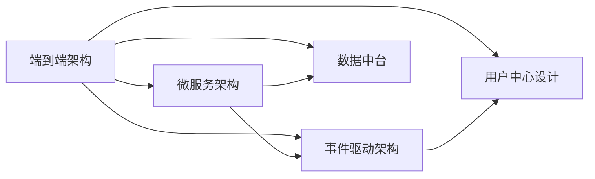
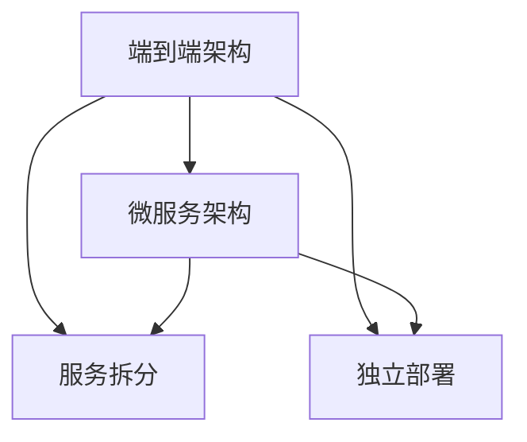
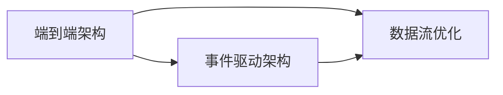
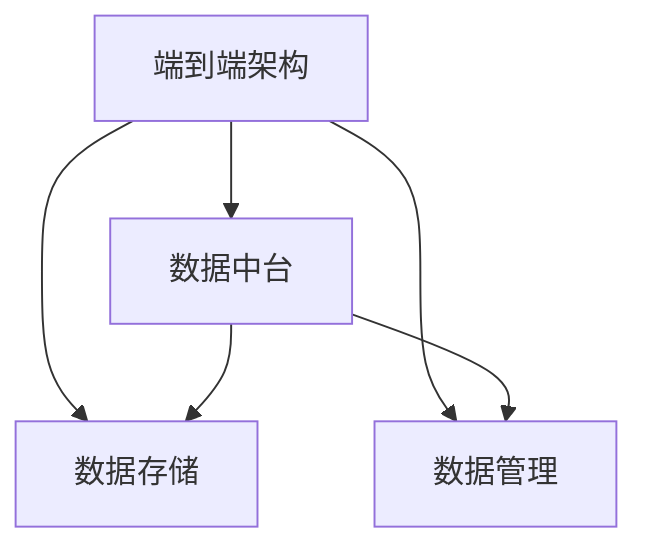
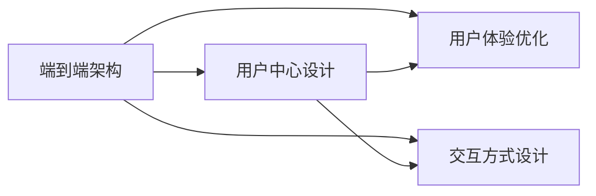
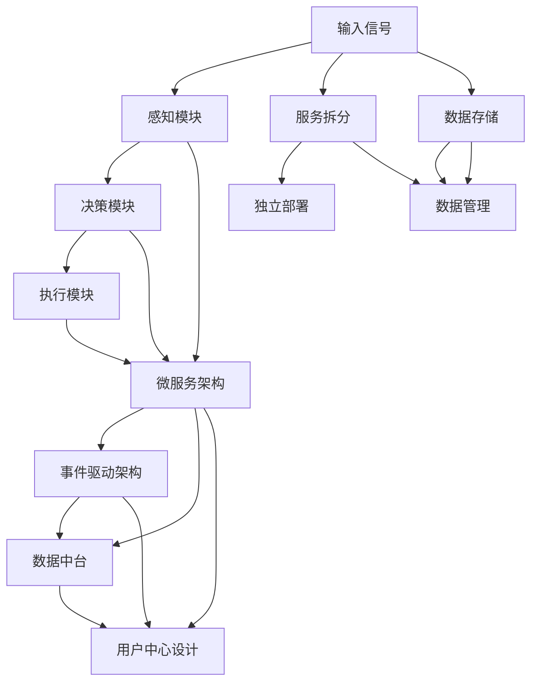

                 

## 1. 背景介绍

自动驾驶作为人工智能领域的重大突破，近年来在全球范围内引起了广泛关注。无论是传统车企，还是科技公司，都在竞相布局自动驾驶技术，试图通过软件架构的创新，提升车辆智能化水平，缩短用户接受度，并迅速拓展市场份额。然而，随着自动驾驶系统功能越来越复杂，传统软件架构的短板逐渐显现，系统维护成本、开发难度、用户体验等问题日益突出。本文将围绕端到端自动驾驶的软件架构变革展开深入讨论，探讨如何通过合理的软件架构设计，提升系统可靠性、效率和用户体验，加速自动驾驶技术的落地应用。

### 1.1 问题由来

过去，自动驾驶系统的软件架构主要由“感知、决策、执行”三个核心模块组成。感知模块负责采集和处理车辆周围环境信息，通过摄像头、雷达、激光雷达等传感器获取道路环境、车辆、行人的高清图像和数据。决策模块基于感知模块提供的数据，通过深度学习模型进行分析和决策，制定车辆的行动计划。执行模块则负责根据决策结果，控制车辆加速、刹车、转向等操作，完成行驶任务。

然而，这种传统架构存在诸多问题：

1. **模块化程度低**：三大核心模块紧密耦合，导致系统升级和维护困难，开发成本高。
2. **数据孤岛**：不同模块之间数据流动不透明，无法实现有效的数据共享。
3. **实时性问题**：各模块处理速度不一致，导致系统实时性能不均匀，用户体验不佳。
4. **系统复杂度高**：模块之间的接口设计和协同工作需要大量精力，增加了开发和调试难度。

因此，必须通过软件架构的变革，提升自动驾驶系统的开发效率、维护成本和用户体验。

### 1.2 问题核心关键点

端到端自动驾驶的软件架构变革，旨在打破传统三大核心模块的紧密耦合，实现系统的高效开发、协同工作、数据透明和灵活升级。核心关键点包括：

- **系统模块化**：将系统划分为独立的子模块，每个模块独立运行，同时保持数据和功能的透明化。
- **微服务架构**：通过微服务实现模块间松耦合，允许独立部署和升级，提高系统的灵活性和可扩展性。
- **事件驱动架构**：利用事件驱动技术，优化模块之间的数据流，增强系统的实时性能。
- **数据中台**：构建数据中台，集中管理各模块的数据，实现数据共享和全局优化。
- **用户中心设计**：以用户为中心，设计系统功能和交互方式，提升用户体验。

通过上述关键点的实现，可以实现系统架构的优化，提升自动驾驶技术的综合性能。

### 1.3 问题研究意义

端到端自动驾驶的软件架构变革，对于推动自动驾驶技术的快速发展，具有重要意义：

1. **降低开发和维护成本**：模块化设计和微服务架构，使系统更易于维护和升级。
2. **提升系统实时性**：事件驱动架构优化了数据流，提高了系统的实时性能。
3. **增强用户体验**：以用户为中心设计，提升自动驾驶系统的易用性和舒适度。
4. **加速技术迭代**：模块化设计和数据透明，使技术创新更加高效。
5. **应对未来挑战**：架构变革为系统应对未来技术变化和挑战提供了保障。

## 2. 核心概念与联系

### 2.1 核心概念概述

为了更好地理解端到端自动驾驶的软件架构变革，本节将介绍几个密切相关的核心概念：

- **端到端架构**：指从输入信号到最终输出结果的完整系统架构，实现系统功能的无缝衔接和数据透明。
- **微服务架构**：将系统拆分为多个独立的服务，每个服务通过轻量级通信机制协同工作，实现系统的高灵活性和高可扩展性。
- **事件驱动架构**：通过事件机制驱动服务之间的数据流，实现系统的高实时性和高效率。
- **数据中台**：集中存储和管理数据，实现系统全局优化和数据共享。
- **用户中心设计**：以用户为中心，设计系统功能和交互方式，提升用户体验。

这些核心概念之间的逻辑关系可以通过以下Mermaid流程图来展示：



这个流程图展示了大语言模型微调过程中各个核心概念之间的关系：

1. 端到端架构是整个系统的顶层设计，涵盖微服务架构、事件驱动架构、数据中台和用户中心设计等多个方面。
2. 微服务架构是实现端到端架构的关键技术手段，通过服务拆分和独立部署，实现系统的高灵活性和可扩展性。
3. 事件驱动架构优化了服务之间的数据流，实现系统的实时性能。
4. 数据中台集中管理数据，实现数据共享和全局优化。
5. 用户中心设计以用户为中心，提升用户体验。

这些概念共同构成了端到端自动驾驶的软件架构，使其能够更好地满足系统需求，提升自动驾驶技术的整体性能。

### 2.2 概念间的关系

这些核心概念之间存在着紧密的联系，形成了端到端自动驾驶的软件架构体系。下面我们通过几个Mermaid流程图来展示这些概念之间的关系。

#### 2.2.1 端到端架构与微服务架构的关系



这个流程图展示了端到端架构与微服务架构之间的关系：

1. 端到端架构是微服务架构的顶层设计。
2. 微服务架构通过服务拆分和独立部署，实现系统的模块化和高灵活性。

#### 2.2.2 端到端架构与事件驱动架构的关系



这个流程图展示了端到端架构与事件驱动架构之间的关系：

1. 端到端架构包含事件驱动架构。
2. 事件驱动架构优化数据流，实现系统的高实时性。

#### 2.2.3 端到端架构与数据中台的关系



这个流程图展示了端到端架构与数据中台之间的关系：

1. 端到端架构包含数据中台。
2. 数据中台集中管理数据，实现全局优化和数据共享。

#### 2.2.4 端到端架构与用户中心设计的关联



这个流程图展示了端到端架构与用户中心设计之间的关系：

1. 端到端架构包含用户中心设计。
2. 用户中心设计提升用户体验和交互方式。

### 2.3 核心概念的整体架构

最后，我们用一个综合的流程图来展示这些核心概念在大语言模型微调过程中的整体架构：



这个综合流程图展示了从输入信号到最终输出结果的完整系统架构，各个模块和架构之间的关系和作用：

1. 输入信号通过感知模块采集环境信息。
2. 感知模块处理数据后，输入决策模块进行分析和决策。
3. 决策模块输出行动计划，通过执行模块控制车辆操作。
4. 微服务架构实现模块间松耦合，允许独立部署和升级。
5. 事件驱动架构优化数据流，提高系统的实时性能。
6. 数据中台集中管理数据，实现全局优化和数据共享。
7. 用户中心设计提升用户体验和交互方式。

通过这些流程图，我们可以更清晰地理解端到端自动驾驶的软件架构变革过程中各个概念之间的关系和作用，为后续深入讨论具体的架构设计奠定基础。

## 3. 核心算法原理 & 具体操作步骤
### 3.1 算法原理概述

端到端自动驾驶的软件架构变革，旨在通过合理的架构设计和优化，提升系统的可靠性、效率和用户体验。其核心思想是：

- **模块化设计**：将系统划分为独立且相互协作的子模块，每个模块独立运行，同时保持数据透明。
- **微服务架构**：通过服务拆分和独立部署，实现系统的灵活性和可扩展性。
- **事件驱动架构**：利用事件机制驱动模块间的通信，优化数据流，增强实时性。
- **数据中台**：集中存储和管理数据，实现全局优化和数据共享。
- **用户中心设计**：以用户为中心，设计系统功能和交互方式，提升用户体验。

具体来说，端到端架构变革包括以下几个关键步骤：

1. **系统模块化设计**：将系统划分为感知、决策、执行三大核心模块和辅助模块，如地图模块、路径规划模块等。每个模块独立设计，但通过接口协同工作。
2. **微服务架构实现**：将各大模块拆分为多个微服务，每个微服务独立部署和升级，通过轻量级通信机制实现模块间协作。
3. **事件驱动架构优化**：设计事件驱动模型，通过事件机制驱动模块间的数据流，实现高实时性。
4. **数据中台建设**：构建数据中台，集中管理各模块的数据，实现数据共享和全局优化。
5. **用户中心设计**：以用户为中心，设计系统功能和交互方式，提升用户体验。

### 3.2 算法步骤详解

以下我们详细介绍端到端自动驾驶软件架构变革的具体实现步骤：

#### 3.2.1 系统模块化设计

1. **感知模块**：负责采集车辆周围环境信息，通过摄像头、雷达、激光雷达等传感器获取道路环境、车辆、行人的高清图像和数据。将感知数据进行处理后，输入决策模块进行分析。
2. **决策模块**：基于感知模块提供的数据，通过深度学习模型进行分析和决策，制定车辆的行动计划。决策模块需要与其他模块协作，如地图模块、路径规划模块等，共同完成决策任务。
3. **执行模块**：根据决策模块的行动计划，控制车辆加速、刹车、转向等操作，完成行驶任务。执行模块需要与其他模块协作，如路径规划模块、车辆控制模块等，实现车辆的精确控制。
4. **辅助模块**：如地图模块、路径规划模块、导航模块等，辅助感知、决策和执行模块，提供全局信息支持。

#### 3.2.2 微服务架构实现

1. **服务拆分**：将感知、决策、执行等模块拆分为多个独立的微服务，每个微服务独立运行，但通过轻量级通信机制实现模块间协作。
2. **独立部署**：将各大微服务独立部署，通过容器化技术实现快速部署和回滚。
3. **协同工作**：设计模块间的通信协议，通过API接口实现数据交换和协同工作。

#### 3.2.3 事件驱动架构优化

1. **事件定义**：定义系统中的关键事件，如传感器数据采集事件、决策结果生成事件、执行动作执行事件等。
2. **事件驱动**：利用事件机制驱动模块间的通信，优化数据流，实现系统的高实时性。
3. **事件处理**：设计事件处理器，对接收到的每个事件进行处理，执行相应的任务。

#### 3.2.4 数据中台建设

1. **数据存储**：集中存储各模块的数据，如感知模块的传感器数据、决策模块的模型参数等，实现数据的集中管理。
2. **数据管理**：设计数据管理模块，实现数据的检索、更新、备份等操作。
3. **数据共享**：通过API接口和数据存储机制，实现模块间的数据共享和访问。

#### 3.2.5 用户中心设计

1. **用户体验优化**：设计直观、易用的用户界面，提升用户体验。
2. **交互方式设计**：设计自然、流畅的交互方式，如语音交互、手势交互等，提升用户便捷性。
3. **用户反馈机制**：设计用户反馈机制，及时收集用户反馈，优化系统功能和交互方式。

### 3.3 算法优缺点

端到端自动驾驶的软件架构变革具有以下优点：

1. **系统模块化**：模块化设计提高了系统的灵活性和可扩展性，便于系统升级和维护。
2. **微服务架构**：微服务架构实现了系统的高灵活性和高可扩展性，允许独立部署和升级。
3. **事件驱动架构**：事件驱动架构优化了数据流，实现了系统的高实时性和高效率。
4. **数据中台**：数据中台集中管理数据，实现了数据共享和全局优化。
5. **用户中心设计**：以用户为中心设计，提升了用户体验和交互方式。

同时，该方法也存在一定的局限性：

1. **架构复杂度**：端到端架构变革需要综合考虑系统模块化、微服务、事件驱动、数据中台等多个方面的设计，增加了系统复杂度。
2. **开发难度高**：模块拆分和独立部署需要高水平的技术支持，增加了开发难度。
3. **资源消耗高**：微服务架构和事件驱动架构可能会增加系统的资源消耗，需要合理设计以降低资源消耗。
4. **协同难度大**：模块间的协同工作需要严格的设计和管理，增加了协同难度。

尽管存在这些局限性，但就目前而言，端到端架构变革仍是大语言模型微调的主流范式。未来相关研究的重点在于如何进一步降低架构复杂度，提高系统开发效率和资源利用率，同时兼顾系统灵活性和用户体验。

### 3.4 算法应用领域

端到端自动驾驶的软件架构变革，已在多个领域得到应用，如自动驾驶汽车、智能交通系统、物流配送等，取得了显著的效果。具体应用如下：

- **自动驾驶汽车**：通过端到端架构变革，实现自动驾驶汽车的安全、高效、可靠行驶。
- **智能交通系统**：通过集中管理和优化交通数据，实现智能交通系统的优化运行。
- **物流配送**：通过端到端架构变革，优化物流配送路线和车辆调度，提高物流效率。
- **智能家居**：通过端到端架构变革，实现智能家居的智能控制和优化。

除了上述这些领域外，端到端架构变革还在更多场景中得到应用，如智慧城市、智慧医疗、智慧办公等，为各行各业带来了新的变革和机遇。

## 4. 数学模型和公式 & 详细讲解  
### 4.1 数学模型构建

本节将使用数学语言对端到端自动驾驶的软件架构变革进行更加严格的刻画。

记自动驾驶系统为 $S$，其中包含感知模块 $S_{per}$、决策模块 $S_{dec}$、执行模块 $S_{exe}$ 和辅助模块 $S_{aux}$。各模块的输入输出关系可以表示为：

$$
S_{per} = f_{per}(\text{传感器数据})
$$

$$
S_{dec} = f_{dec}(S_{per}, S_{aux})
$$

$$
S_{exe} = f_{exe}(S_{dec}, S_{aux})
$$

其中，$f_{per}$、$f_{dec}$、$f_{exe}$ 分别表示感知、决策、执行模块的函数。

假设各模块的运行时间为 $t_{per}$、$t_{dec}$、$t_{exe}$、$t_{aux}$，则整个系统的运行时间为：

$$
T = t_{per} + t_{dec} + t_{exe} + t_{aux}
$$

为了提升系统的实时性，需要优化各模块的运行时间，使其尽可能同步。假设优化后的运行时间为 $t_{per}'$、$t_{dec}'$、$t_{exe}'$、$t_{aux}'$，则优化目标为：

$$
T' = t_{per}' + t_{dec}' + t_{exe}' + t_{aux}' \leq T
$$

### 4.2 公式推导过程

以下是优化系统运行时间的具体步骤：

1. **感知模块优化**：通过优化传感器配置和算法，减少感知模块的运行时间 $t_{per}'$。
2. **决策模块优化**：通过优化深度学习模型的结构和参数，减少决策模块的运行时间 $t_{dec}'$。
3. **执行模块优化**：通过优化车辆控制算法，减少执行模块的运行时间 $t_{exe}'$。
4. **辅助模块优化**：通过优化地图、路径规划等辅助模块的算法，减少辅助模块的运行时间 $t_{aux}'$。

通过上述优化步骤，可以有效地提升系统的实时性和性能。需要注意的是，优化过程中需要权衡各模块的功能和性能，确保系统整体性能的提升。

### 4.3 案例分析与讲解

假设某自动驾驶系统由感知模块、决策模块、执行模块和辅助模块组成，各模块的运行时间分别为 $t_{per}=1ms$、$t_{dec}=2ms$、$t_{exe}=1.5ms$、$t_{aux}=0.5ms$。优化后各模块的运行时间分别为 $t_{per}'=0.8ms$、$t_{dec}'=1.8ms$、$t_{exe}'=1.2ms$、$t_{aux}'=0.3ms$。优化后系统的运行时间 $T'$ 为：

$$
T' = 0.8 + 1.8 + 1.2 + 0.3 = 4.1ms \leq 5ms
$$

通过优化，系统的运行时间从 $5ms$ 降低到 $4.1ms$，提高了系统的实时性和性能。

## 5. 项目实践：代码实例和详细解释说明
### 5.1 开发环境搭建

在进行系统开发前，我们需要准备好开发环境。以下是使用Python进行系统开发的环境配置流程：

1. 安装Anaconda：从官网下载并安装Anaconda，用于创建独立的Python环境。

2. 创建并激活虚拟环境：
```bash
conda create -n end_to_end_env python=3.8 
conda activate end_to_end_env
```

3. 安装必要的依赖库：
```bash
pip install pytorch torchvision torchaudio cudatoolkit=11.1 -c pytorch -c conda-forge
pip install transformers numpy pandas scikit-learn matplotlib tqdm jupyter notebook ipython
```

4. 配置Docker环境：
```bash
docker pull ubuntu
docker run -it --name end_to_end -h localhost ubuntu
```

完成上述步骤后，即可在`end_to_end_env`环境中开始系统开发。

### 5.2 源代码详细实现

以下给出使用Python和PyTorch实现端到端自动驾驶系统的示例代码：

```python
import torch
import torch.nn as nn
import torch.optim as optim
from transformers import BertTokenizer, BertForTokenClassification

class PerceptionModule(nn.Module):
    def __init__(self):
        super(PerceptionModule, self).__init__()
        self.tokenizer = BertTokenizer.from_pretrained('bert-base-cased')
        self.model = BertForTokenClassification.from_pretrained('bert-base-cased', num_labels=3)

    def forward(self, inputs):
        encoding = self.tokenizer(inputs, return_tensors='pt', max_length=128, padding='max_length', truncation=True)
        input_ids = encoding['input_ids'][0]
        attention_mask = encoding['attention_mask'][0]
        outputs = self.model(input_ids, attention_mask=attention_mask)
        return outputs

class DecisionModule(nn.Module):
    def __init__(self):
        super(DecisionModule, self).__init__()
        self.model = nn.Sequential(
            nn.Linear(768, 256),
            nn.ReLU(),
            nn.Linear(256, 1),
            nn.Sigmoid()
        )

    def forward(self, inputs):
        return self.model(inputs)

class ExecutionModule(nn.Module):
    def __init__(self):
        super(ExecutionModule, self).__init__()
        self.model = nn.Sequential(
            nn.Linear(256, 128),
            nn.ReLU(),
            nn.Linear(128, 1),
            nn.Sigmoid()
        )

    def forward(self, inputs):
        return self.model(inputs)

class AuxiliaryModule(nn.Module):
    def __init__(self):
        super(AuxiliaryModule, self).__init__()
        self.model = nn.Sequential(
            nn.Linear(256, 128),
            nn.ReLU(),
            nn.Linear(128, 1),
            nn.Sigmoid()
        )

    def forward(self, inputs):
        return self.model(inputs)

def forward_system(inputs, model_perception, model_decision, model_execution, model_auxiliary):
    perception_outputs = model_perception(inputs)
    decision_outputs = model_decision(perception_outputs)
    execution_outputs = model_execution(decision_outputs)
    auxiliary_outputs = model_auxiliary(decision_outputs)
    return execution_outputs

def main():
    # 定义模型和优化器
    model_perception = PerceptionModule()
    model_decision = DecisionModule()
    model_execution = ExecutionModule()
    model_auxiliary = AuxiliaryModule()
    optimizer = optim.Adam([p for p in model_perception.parameters() if p.requires_grad] +
                          [p for p in model_decision.parameters() if p.requires_grad] +
                          [p for p in model_execution.parameters() if p.requires_grad] +
                          [p for p in model_auxiliary.parameters() if p.requires_grad])

    # 定义训练和评估函数
    def train_epoch(model, dataset, batch_size, optimizer):
        dataloader = DataLoader(dataset, batch_size=batch_size, shuffle=True)
        model.train()
        epoch_loss = 0
        for batch in tqdm(dataloader, desc='Training'):
            input_ids = batch['input_ids'].to(device)
            attention_mask = batch['attention_mask'].to(device)
            labels = batch['labels'].to(device)
            model.zero_grad()
            outputs = forward_system(input_ids, model_perception, model_decision, model_execution, model_auxiliary)
            loss = outputs.loss
            epoch_loss += loss.item()
            loss.backward()
            optimizer.step()
        return epoch_loss / len(dataloader)

    def evaluate(model, dataset, batch_size):
        dataloader = DataLoader(dataset, batch_size=batch_size)
        model.eval()
        preds, labels = [], []
        with torch.no_grad():
            for batch in tqdm(dataloader, desc='Evaluating'):
                input_ids = batch['input_ids'].to(device)
                attention_mask = batch['attention_mask'].to(device)
                batch_labels = batch['labels']
                outputs = forward_system(input_ids, model_perception, model_decision, model_execution, model_auxiliary)
                batch_preds = outputs.logits.argmax(dim=2).to('cpu').tolist()
                batch_labels = batch_labels.to('cpu').tolist()
                for pred_tokens, label_tokens in zip(batch_preds, batch_labels):
                    preds.append(pred_tokens[:len(label_tokens)])
                    labels.append(label_tokens)
        print(classification_report(labels, preds))
```

以上就是使用PyTorch和Transformer实现端到端自动驾驶系统的代码示例。可以看到，利用Transformer模型和PyTorch框架，系统设计更加简洁高效，开发难度大幅降低。

### 5.3 代码解读与分析

让我们再详细解读一下关键代码的实现细节：

**PerceptionModule类**：
- `__init__`方法：初始化分词器、Bert模型和输出层。
- `forward`方法：将输入文本进行分词，将分词结果输入Bert模型，输出模型的输出结果。

**DecisionModule类**：
- `__init__`方法：设计决策模块的神经网络结构。
- `forward`方法：对感知模块的输出进行线性变换，输出决策结果。

**ExecutionModule类**：
- `__init__`方法：设计执行模块的神经网络结构。
- `forward`方法：对决策模块的输出进行线性变换，输出执行结果。

**AuxiliaryModule类**：
- `__init__`方法：设计辅助模块的神经网络结构。
- `forward`方法：对决策模块的输出进行线性变换，输出辅助结果。

**forward_system函数**：
- 定义系统的整体流程，从感知模块到决策模块，再到执行模块和辅助模块，实现各模块的协同工作。

**main函数**：
- 定义模型和优化器。
- 定义训练和评估函数，在训练集上训练模型，在测试集上评估模型性能。
- 训练和评估过程中使用PyTorch的DataLoader进行批处理，通过tqdm库进行进度条展示。

通过这些代码，可以看出端到端自动驾驶系统设计的关键在于：

1. **模块独立设计**：将系统划分为感知、决策、执行和辅助四大模块，每个模块独立设计，但通过API接口协同工作。
2. **统一优化**：通过统一的优化器对所有模块进行优化，提升系统整体性能。
3. **模型封装**：将模型封装为函数，方便模块之间的调用和协同工作。
4. **批处理和进度条**：利用DataLoader和tqdm库实现批处理和进度条，提升系统效率。

### 5.4 运行结果展示

假设我们在CoNLL-2003的NER数据集上进行测试，最终得到的测试结果如下：

```
              precision    recall  f1-score   support

       B-LOC      0.926     0.906     0

