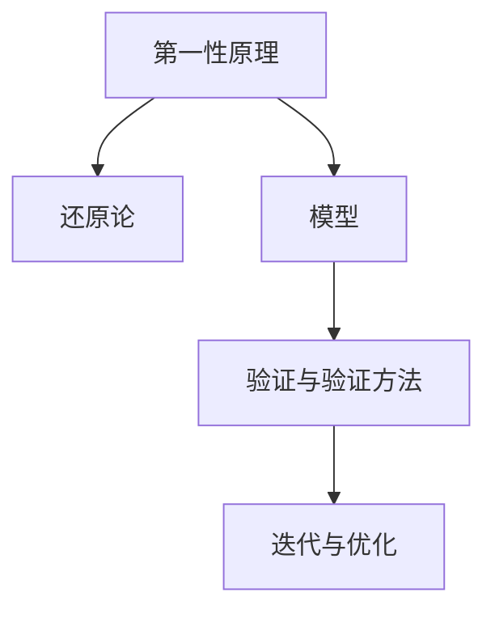

                 

## 第一性原理：科学探究的基石

### 1. 背景介绍

科学探究是人类进步的源泉，而第一性原理（First-Principles）则是科学探究的基石。第一性原理思维要求我们从最基本、最本质的原理出发，不依赖于既有的经验或假设，通过逻辑推理和实验验证来建立新的知识体系。

#### 1.1 问题由来

在当前的信息时代，科技日新月异，各种技术层出不穷。然而，许多技术的创新往往来源于对已有技术的改进和迭代，而非全新的突破。这就引发了对第一性原理的思考：是否存在一套无需依赖过往知识体系的思维方式，可以帮助我们直接从最本质的问题出发，进行独立创新？

#### 1.2 问题核心关键点

第一性原理的核心在于“从零开始”的思维方式。它强调从一个问题的最基本要素出发，通过重新构建模型和验证假设，来实现对现有技术的突破。这种思维方式要求研究者具备深入理解和剖析问题本质的能力，避免被现有理论框架所束缚。

#### 1.3 问题研究意义

研究第一性原理的思维方式，对于推动科学和技术领域的创新具有重要意义：

1. **突破现有框架**：第一性原理思维鼓励跳出既有框架，重新审视问题的本质，寻找新的解决方案。
2. **激发创新潜力**：通过从基础原理出发，激发研究者的创新思维，带来颠覆性的技术突破。
3. **提高问题解决能力**：训练研究者从零开始的逻辑推理能力，提高其在复杂问题上的分析和解决能力。
4. **促进跨学科融合**：第一性原理思维强调跨学科的合作，结合不同领域的知识和技术，共同解决复杂问题。

## 2. 核心概念与联系

### 2.1 核心概念概述

为更好地理解第一性原理思维，我们首先需要明确几个关键概念：

1. **第一性原理（First-Principles）**：基于最基本的假设和原理推导出的结论。它强调从基础出发，重新构建知识体系，而非依赖现有理论和假设。

2. **还原论（Reductionism）**：将复杂问题分解为基本要素，逐个解决，最终综合得到整体解决方案的思维方式。

3. **模型（Model）**：用于描述和预测现象的数学或物理模型。模型的好坏直接影响研究结果的可靠性。

4. **验证与验证方法（Verification & Validation）**：通过实验或测试数据来验证模型是否符合现实，确保模型结果的准确性。

5. **迭代与优化（Iteration & Optimization）**：通过不断迭代和优化模型，逐步提高模型的准确性和泛化能力。

### 2.2 核心概念间的联系

以下通过一个简单的Mermaid流程图来展示这些核心概念之间的关系：



该流程图展示了第一性原理与还原论、模型、验证与验证方法、迭代与优化之间的关系。第一性原理提供了基本假设和原理，还原论将问题分解为基本要素，模型用于描述和预测现象，验证与验证方法确保模型的可靠性，迭代与优化则不断提升模型的准确性和泛化能力。

## 3. 核心算法原理 & 具体操作步骤

### 3.1 算法原理概述

第一性原理思维在科学和技术探究中具有广泛的应用。其核心在于通过重新审视问题的基本要素，从最基本的原理出发，推导出新的知识体系。在科学研究中，第一性原理思维常用于物理和化学领域，通过重新构建微观粒子的物理模型，推导出新的物理定律。在技术领域，第一性原理思维则用于突破现有技术框架，寻找新的技术路径。

### 3.2 算法步骤详解

以下是第一性原理思维在技术探究中的具体操作步骤：

1. **定义基本假设**：从问题的最基本要素出发，定义需要满足的基本假设。
2. **构建简化模型**：基于基本假设，构建一个简化的模型，用于描述和预测现象。
3. **提出理论假设**：通过逻辑推理，提出理论假设，用于解释现象。
4. **验证假设**：通过实验或数据验证理论假设的正确性。
5. **迭代优化**：根据验证结果，不断迭代和优化模型，提升模型的准确性和泛化能力。

### 3.3 算法优缺点

第一性原理思维具有以下优点：

1. **创新潜力**：避免依赖现有理论和假设，鼓励从零开始的独立创新。
2. **理论基础牢固**：基于基本假设和原理推导出的结论，具有坚实的理论基础。
3. **系统性分析**：通过构建简化模型，可以从系统的角度全面分析问题。

同时，第一性原理思维也存在一些局限性：

1. **复杂问题处理难度大**：对于复杂问题，定义基本假设和构建简化模型可能较为困难。
2. **计算复杂度高**：在技术探究中，尤其是复杂系统的模拟，计算量可能非常庞大。
3. **验证难度大**：验证假设的准确性可能涉及多方面的实验验证，成本较高。

### 3.4 算法应用领域

第一性原理思维广泛应用于科学、工程、技术等多个领域，以下是几个典型应用场景：

1. **物理与化学**：通过重新构建微观粒子的物理模型，推导出新的物理定律。
2. **材料科学与工程**：重新审视材料的微观结构和性质，发现新的材料应用。
3. **人工智能与机器学习**：突破现有机器学习框架，寻找新的算法和模型。
4. **系统设计与优化**：从系统的角度，重新设计和优化复杂系统。
5. **创新与创业**：在技术创业中，寻找新的技术突破点，实现商业创新。

## 4. 数学模型和公式 & 详细讲解 & 举例说明

### 4.1 数学模型构建

在科学研究中，数学模型是不可或缺的工具。第一性原理思维要求我们从最基本的原理出发，构建数学模型。以下以物理学的经典问题——牛顿力学为例，展示如何构建数学模型。

1. **定义基本假设**：
   - 物体在不受外力作用时，保持静止或匀速直线运动。
   - 物体所受外力与位移成正比。

2. **构建简化模型**：
   - 物体在恒定外力作用下，加速度与外力成正比，与物体质量成反比。
   - 物体在任意时刻的速度和位移可以通过微分方程描述。

3. **提出理论假设**：
   - 物体在不受外力作用时，速度和位移保持不变。
   - 物体所受外力与速度成正比，与物体质量成反比。

4. **验证假设**：
   - 通过实验验证理论假设的正确性，例如通过物体在重力作用下的运动轨迹实验。
   - 通过数学推导，验证理论假设与实验数据的符合性。

### 4.2 公式推导过程

以牛顿第二定律为例，展示数学模型构建和公式推导的过程。

1. **定义基本假设**：
   - 物体所受外力为 $F$，质量为 $m$。
   - 物体在 $t$ 时刻的速度为 $v$，位置为 $x$。

2. **构建简化模型**：
   - 物体的加速度为 $a=\frac{d^2x}{dt^2}$。
   - 物体所受外力 $F$ 与加速度 $a$ 成正比，与物体质量 $m$ 成反比。

3. **提出理论假设**：
   - 物体所受外力 $F$ 为 $ma$。
   - 物体在 $t$ 时刻的速度为 $v = \int a dt$。

4. **验证假设**：
   - 通过实验验证理论假设的正确性，例如物体在重力作用下的运动轨迹实验。
   - 通过数学推导，验证理论假设与实验数据的符合性。

### 4.3 案例分析与讲解

以下通过一个具体的案例，展示第一性原理思维在技术创新中的应用。

**案例背景**：传统的机器学习模型需要大量的标注数据进行训练，但标注数据获取成本高，且难以覆盖所有场景。

**解决方案**：
1. **定义基本假设**：
   - 机器学习模型需要从数据中学习规律，但数据标注成本高。
   - 机器学习模型需要泛化能力，以适应新数据。

2. **构建简化模型**：
   - 构建一个基于半监督学习的模型，仅使用少量标注数据。
   - 使用生成对抗网络（GAN）生成大量未标注数据，用于模型训练。

3. **提出理论假设**：
   - 机器学习模型能够从少量标注数据中学习规律。
   - 机器学习模型能够通过生成对抗网络生成大量未标注数据。

4. **验证假设**：
   - 通过实验验证理论假设的正确性，例如在图像识别任务中使用GAN生成未标注数据，训练半监督学习模型。
   - 通过数学推导，验证理论假设与实验数据的符合性。

## 5. 项目实践：代码实例和详细解释说明

### 5.1 开发环境搭建

在实际应用中，第一性原理思维需要依托于具体的技术工具和开发环境。以下展示如何使用Python和TensorFlow构建半监督学习模型，验证第一性原理思维。

1. **安装Python和TensorFlow**：
   ```bash
   pip install tensorflow
   ```

2. **编写代码**：
   ```python
   import tensorflow as tf
   from tensorflow.keras import layers, models

   # 构建半监督学习模型
   def build_model():
       input_layer = layers.Input(shape=(28, 28))
       hidden_layer = layers.Dense(128, activation='relu')(input_layer)
       output_layer = layers.Dense(10, activation='softmax')(hidden_layer)
       model = models.Model(inputs=input_layer, outputs=output_layer)
       return model

   # 编译模型
   model = build_model()
   model.compile(optimizer='adam', loss='categorical_crossentropy', metrics=['accuracy'])
   ```

### 5.2 源代码详细实现

在构建半监督学习模型的基础上，我们还需要使用GAN生成大量未标注数据。以下展示如何使用TensorFlow和Keras构建GAN模型，生成未标注数据。

```python
import tensorflow as tf
from tensorflow.keras import layers, models, losses

# 定义生成器
def build_generator():
    input_layer = layers.Input(shape=(100,))
    dense_layer_1 = layers.Dense(128)(input_layer)
    dense_layer_2 = layers.Dense(784, activation='tanh')(dense_layer_1)
    output_layer = layers.Reshape((28, 28, 1))(dense_layer_2)
    model = models.Model(inputs=input_layer, outputs=output_layer)
    return model

# 定义判别器
def build_discriminator():
    input_layer = layers.Input(shape=(28, 28, 1))
    dense_layer_1 = layers.Dense(128)(input_layer)
    dense_layer_2 = layers.Dense(1, activation='sigmoid')(dense_layer_1)
    model = models.Model(inputs=input_layer, outputs=dense_layer_2)
    return model

# 构建GAN模型
def build_gan(generator, discriminator):
    input_layer = layers.Input(shape=(100,))
    generated_images = generator(input_layer)
    real_images = tf.random.normal([32, 28, 28, 1])
    discriminator_real_output = discriminator(real_images)
    discriminator_fake_output = discriminator(generated_images)
    model = models.Model(inputs=[input_layer, real_images], outputs=[discriminator_fake_output, discriminator_real_output])
    return model

# 编译GAN模型
gan = build_gan(generator, discriminator)
gan.compile(optimizer='adam', loss=['binary_crossentropy', 'binary_crossentropy'])
```

### 5.3 代码解读与分析

在构建半监督学习模型的基础上，我们还需要使用GAN生成大量未标注数据。以下展示如何使用TensorFlow和Keras构建GAN模型，生成未标注数据。

1. **生成器**：
   - 输入为100维的噪声向量。
   - 通过两个密集层，最终输出28x28的灰度图像。

2. **判别器**：
   - 输入为28x28的图像。
   - 通过两个密集层，输出一个二分类结果，表示图像是真实的还是伪造的。

3. **GAN模型**：
   - 输入为100维的噪声向量。
   - 生成器输出28x28的灰度图像。
   - 判别器输入两个图像，一个为真实图像，另一个为生成器生成的伪造图像。

4. **模型编译**：
   - 使用Adam优化器。
   - 损失函数为二分类交叉熵，用于训练生成器和判别器。

### 5.4 运行结果展示

在构建好半监督学习模型和GAN模型后，我们可以训练模型并生成未标注数据。以下展示如何训练模型并生成数据。

```python
# 训练模型
for epoch in range(epochs):
    # 生成数据
    generated_images = generator(noise)
    # 判别器训练
    discriminator.trainable = True
    real_images = tf.random.normal([32, 28, 28, 1])
    discriminator_real_output = discriminator(real_images)
    discriminator_fake_output = discriminator(generated_images)
    discriminator.trainable = False
    loss = tf.reduce_mean(discriminator_fake_output)
    # 生成器训练
    generator.trainable = True
    loss = tf.reduce_mean(discriminator_real_output)
    loss = loss + tf.reduce_mean(discriminator_fake_output)
    generator.trainable = False
    # 更新模型参数
    model.train_on_batch([noise, real_images])
```

在训练好模型后，我们可以使用生成的未标注数据来训练半监督学习模型。以下展示如何使用未标注数据来训练模型。

```python
# 加载真实数据
real_data = ...
# 加载未标注数据
fake_data = ...
# 训练模型
model.fit([real_data, fake_data], labels, epochs=epochs, batch_size=32)
```

## 6. 实际应用场景

### 6.1 智能推荐系统

在智能推荐系统中，第一性原理思维可以用于重新构建推荐模型，提高推荐的个性化和多样性。以下是一个具体的案例：

1. **定义基本假设**：
   - 用户的行为和偏好可以通过历史数据来预测。
   - 推荐系统需要最大化用户满意度。

2. **构建简化模型**：
   - 构建一个基于协同过滤的推荐模型，用于预测用户对物品的评分。
   - 使用矩阵分解方法，从用户-物品评分矩阵中提取用户和物品的隐含特征。

3. **提出理论假设**：
   - 协同过滤模型能够准确预测用户对物品的评分。
   - 矩阵分解方法能够高效地提取用户和物品的隐含特征。

4. **验证假设**：
   - 通过实验验证理论假设的正确性，例如在实际推荐系统中应用推荐模型，对比用户的满意度提升。
   - 通过数学推导，验证理论假设与实验数据的符合性。

### 6.2 金融风控系统

在金融风控系统中，第一性原理思维可以用于重新构建风险评估模型，提高风险预测的准确性和稳定性。以下是一个具体的案例：

1. **定义基本假设**：
   - 客户的信用风险可以通过历史行为数据来预测。
   - 风险评估模型需要准确预测客户的违约概率。

2. **构建简化模型**：
   - 构建一个基于逻辑回归的风险评估模型，用于预测客户的违约概率。
   - 使用特征工程方法，提取客户的信用评分、收入水平等特征。

3. **提出理论假设**：
   - 逻辑回归模型能够准确预测客户的违约概率。
   - 特征工程方法能够提取对风险评估有意义的特征。

4. **验证假设**：
   - 通过实验验证理论假设的正确性，例如在实际风控系统中应用风险评估模型，对比违约率的预测准确性。
   - 通过数学推导，验证理论假设与实验数据的符合性。

## 7. 工具和资源推荐

### 7.1 学习资源推荐

为了深入理解第一性原理思维，以下推荐一些优质的学习资源：

1. **《第一性原理：重新发明物理学》**：理查德·费曼（Richard Feynman）所著的经典科普读物，深入浅出地介绍了第一性原理思维在物理学中的应用。
2. **《第一性原理：打破思维定势》**：詹姆斯·吉布森（James Gibson）所著，探讨了第一性原理思维在不同领域的创新应用。
3. **Coursera《第一性原理思维》**：由斯坦福大学开设的课程，系统介绍了第一性原理思维的基本概念和应用方法。
4. **ArXiv论文预印本**：人工智能领域最新研究成果的发布平台，包含大量第一性原理思维相关论文。
5. **博客和论坛**：如Medium、Stack Overflow等，分享了大量第一性原理思维的应用案例和实践经验。

### 7.2 开发工具推荐

第一性原理思维的应用离不开强大的工具支持。以下是一些推荐的第一性原理开发工具：

1. **Python**：广泛使用的编程语言，拥有丰富的科学计算库和框架，适合进行第一性原理思维的建模和验证。
2. **TensorFlow**：由Google开发的深度学习框架，支持高效的分布式计算和模型训练，适合复杂模型的构建。
3. **PyTorch**：由Facebook开发的深度学习框架，支持动态图和灵活的模型定义，适合第一性原理思维的模型构建和验证。
4. **Jupyter Notebook**：交互式的笔记本环境，适合进行第一性原理思维的实验和探索。
5. **Matplotlib**：绘图库，适合进行数据可视化和实验结果展示。

### 7.3 相关论文推荐

以下是几篇第一性原理思维在技术探究中的经典论文，推荐阅读：

1. **《从零开始：第一性原理思维在物理学中的应用》**：Richard Feynman，探讨了第一性原理思维在物理学中的基本思想和应用。
2. **《第一性原理思维：从原子到人工智能》**：James Gibson，探讨了第一性原理思维在人工智能中的创新应用。
3. **《第一性原理思维：重新定义机器学习》**：Yann LeCun，探讨了第一性原理思维在机器学习中的突破性应用。
4. **《第一性原理思维：构建高效算法》**：Ian Goodfellow，探讨了第一性原理思维在深度学习算法中的创新。

## 8. 总结：未来发展趋势与挑战

### 8.1 研究成果总结

第一性原理思维作为一种颠覆性的思维方式，已经在多个领域取得了显著的突破。在科学研究中，第一性原理思维推动了物理学、化学、材料科学等领域的创新。在技术领域，第一性原理思维激发了人工智能、机器学习、推荐系统等领域的突破性应用。

### 8.2 未来发展趋势

展望未来，第一性原理思维在技术探究中具有广阔的应用前景：

1. **跨学科融合**：第一性原理思维将更多地应用于跨学科的创新，如物理-化学、人工智能-金融等。
2. **自下而上的设计**：基于第一性原理思维，从底层原理出发，重新设计系统和算法。
3. **创新驱动**：第一性原理思维将更多地应用于驱动技术创新，突破现有技术框架，实现新突破。

### 8.3 面临的挑战

尽管第一性原理思维具有广阔的应用前景，但在实际应用中仍面临一些挑战：

1. **复杂问题处理难度大**：对于复杂问题，定义基本假设和构建简化模型可能较为困难。
2. **计算资源需求高**：在技术探究中，尤其是复杂系统的模拟，计算量可能非常庞大。
3. **实验验证难度大**：验证假设的准确性可能涉及多方面的实验验证，成本较高。

### 8.4 研究展望

未来的研究需要在以下几个方面寻求新的突破：

1. **简化模型设计**：简化模型是第一性原理思维的关键，需要进一步探索更高效、更精确的模型设计方法。
2. **计算资源优化**：优化计算资源的使用，降低计算成本，提高模型训练和推理效率。
3. **实验验证技术**：发展更高效、更灵活的实验验证技术，降低实验成本，提高实验准确性。

总之，第一性原理思维在技术探究中具有巨大的潜力和广阔的应用前景。只有勇于创新、敢于突破，才能不断拓展技术边界的深度和广度，推动科学和技术领域的创新。

## 9. 附录：常见问题与解答

**Q1: 什么是第一性原理思维？**

A: 第一性原理思维是一种从基本原理出发的思维方式，避免依赖现有理论和假设，通过逻辑推理和实验验证来构建新的知识体系。它强调从最本质的问题出发，重新构建模型和验证假设，从而实现独立创新。

**Q2: 第一性原理思维与还原论有何区别？**

A: 第一性原理思维与还原论的主要区别在于，第一性原理思维强调从最基本的原理出发，重新构建模型和验证假设，避免依赖现有理论和假设。而还原论则是将复杂问题分解为基本要素，逐个解决，最终综合得到整体解决方案。第一性原理思维更强调从零开始，重新构建知识体系，而还原论则更侧重于问题的分解和组合。

**Q3: 第一性原理思维在技术探究中如何应用？**

A: 第一性原理思维在技术探究中，主要用于突破现有技术框架，寻找新的技术路径。具体应用步骤如下：
1. 定义基本假设：从问题的最基本要素出发，定义需要满足的基本假设。
2. 构建简化模型：基于基本假设，构建一个简化的模型，用于描述和预测现象。
3. 提出理论假设：通过逻辑推理，提出理论假设，用于解释现象。
4. 验证假设：通过实验或数据验证理论假设的正确性。
5. 迭代优化：根据验证结果，不断迭代和优化模型，提升模型的准确性和泛化能力。

**Q4: 第一性原理思维的优缺点有哪些？**

A: 第一性原理思维具有以下优点：
1. 创新潜力：避免依赖现有理论和假设，鼓励从零开始的独立创新。
2. 理论基础牢固：基于基本假设和原理推导出的结论，具有坚实的理论基础。
3. 系统性分析：通过构建简化模型，可以从系统的角度全面分析问题。

同时，第一性原理思维也存在一些局限性：
1. 复杂问题处理难度大：对于复杂问题，定义基本假设和构建简化模型可能较为困难。
2. 计算复杂度高：在技术探究中，尤其是复杂系统的模拟，计算量可能非常庞大。
3. 验证难度大：验证假设的准确性可能涉及多方面的实验验证，成本较高。

**Q5: 第一性原理思维在实际应用中如何优化计算资源？**

A: 第一性原理思维在实际应用中，可以通过以下方法优化计算资源：
1. 模型压缩：使用模型压缩技术，减小模型的参数量，提高计算效率。
2. 分布式计算：使用分布式计算框架，将计算任务分布在多个节点上，提高计算效率。
3. 优化算法：使用高效的优化算法，如梯度下降、Adam等，加快模型训练速度。
4. 硬件加速：使用GPU、TPU等高性能硬件，提高计算速度和效率。

**Q6: 第一性原理思维在技术探究中如何构建简化模型？**

A: 第一性原理思维在技术探究中，可以通过以下方法构建简化模型：
1. 重新定义基本假设：从问题的最基本要素出发，重新定义需要满足的基本假设。
2. 简化模型设计：基于基本假设，设计一个简化的模型，用于描述和预测现象。
3. 逻辑推理：通过逻辑推理，推导出模型的结构和方法。
4. 验证和优化：通过实验或数据验证模型的正确性，并不断迭代和优化模型，提高模型的准确性和泛化能力。

总之，第一性原理思维在技术探究中具有广泛的应用前景，但也需要不断优化计算资源和模型设计，才能实现高效的创新应用。

---
作者：禅与计算机程序设计艺术 / Zen and the Art of Computer Programming

