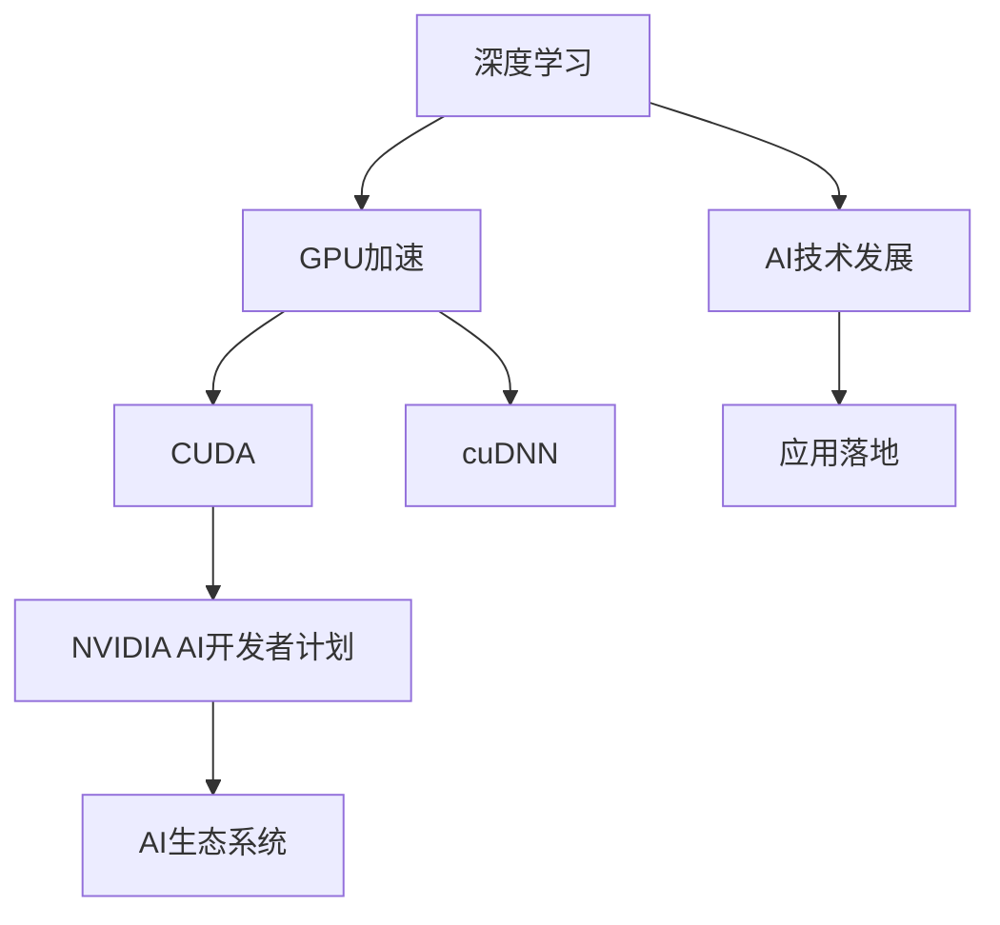
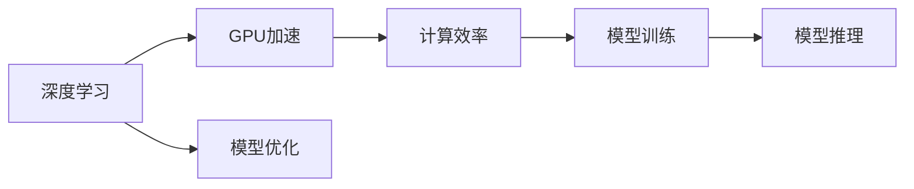
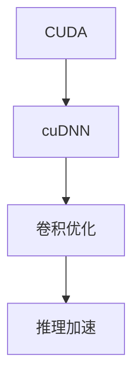
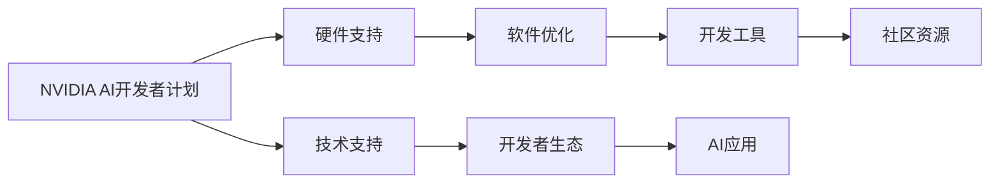
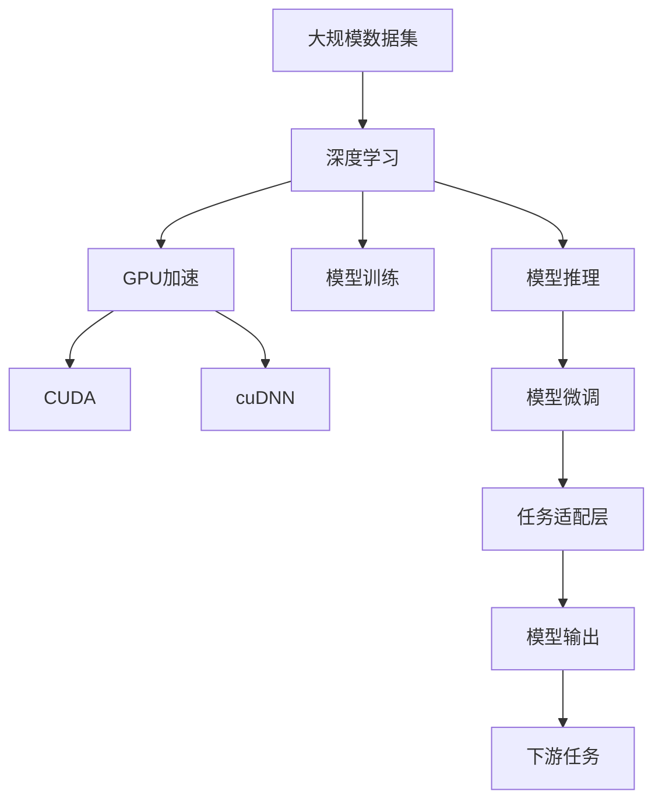

                 

# 算力革命：NVIDIA的角色

## 1. 背景介绍

### 1.1 问题由来
随着人工智能（AI）技术的飞速发展，算力成为了制约AI应用的重要瓶颈。特别是在深度学习领域，庞大的模型参数和复杂的计算流程使得训练和推理过程需要极大的计算资源，这对传统的计算架构提出了新的挑战。如何在保持性能的同时，大幅提升计算效率，成为了各大科技公司竞相争夺的焦点。

在这一背景下，NVIDIA以其在图形处理单元（GPU）领域的深厚积累，成为了推动AI算力革命的重要力量。NVIDIA不仅在硬件层面进行了创新，还通过软件优化和生态系统建设，构建了一个全面的AI算力解决方案。本文将深入探讨NVIDIA在这一领域的角色，以及其对AI算力革命的贡献。

### 1.2 问题核心关键点
NVIDIA在AI算力革命中的角色主要体现在以下几个方面：

- **硬件创新**：NVIDIA的GPU在深度学习模型训练和推理中扮演了关键角色，显著提升了计算效率。
- **软件优化**：NVIDIA通过CUDA、cuDNN等工具对深度学习框架进行了深度优化，提高了性能。
- **生态系统建设**：NVIDIA构建了一个全面的AI开发生态，包括硬件、软件、服务和社区，推动了AI技术的普及和应用。
- **跨界合作**：NVIDIA与各大AI公司和科研机构合作，推动AI技术的发展和应用。

这些方面的综合作用，使得NVIDIA成为了AI算力革命的领头羊。

### 1.3 问题研究意义
研究NVIDIA在AI算力革命中的角色，对于理解AI技术的发展路径和未来趋势，以及寻找AI算力解决方案具有重要意义：

1. **技术演进**：NVIDIA的硬件和软件创新为AI技术带来了显著的性能提升，推动了深度学习、计算机视觉、自然语言处理等领域的快速发展。
2. **应用拓展**：通过构建完善的AI生态，NVIDIA推动了AI技术在医疗、金融、自动驾驶、娱乐等诸多领域的应用落地。
3. **合作共赢**：NVIDIA与多家公司合作，共同推动AI技术的发展和产业化，展示了跨界合作的巨大价值。
4. **生态系统**：NVIDIA构建的全面AI开发生态，为开发者提供了丰富的工具和资源，促进了AI技术的普及。

## 2. 核心概念与联系

### 2.1 核心概念概述

为了更好地理解NVIDIA在AI算力革命中的角色，本节将介绍几个密切相关的核心概念：

- **深度学习（Deep Learning）**：基于人工神经网络，通过多层次非线性映射实现复杂数据建模和预测的机器学习技术。
- **GPU加速（GPU Acceleration）**：利用图形处理单元（GPU）的高并行计算能力，加速深度学习模型的训练和推理。
- **CUDA（Compute Unified Device Architecture）**：NVIDIA开发的一种并行计算平台，用于优化GPU加速的深度学习计算。
- **cuDNN（CUDA Deep Neural Network）**：NVIDIA提供的深度学习库，用于优化卷积神经网络的计算，显著提升深度学习模型的推理速度。
- **NVIDIA AI开发者计划（NVIDIA AI Developer Program）**：NVIDIA提供的一整套开发工具和资源，包括硬件、软件和社区支持，旨在加速AI技术的开发和应用。

这些核心概念之间的逻辑关系可以通过以下Mermaid流程图来展示：



这个流程图展示了大语言模型微调过程中各个核心概念的关系：

1. 深度学习需要大规模计算能力，GPU加速为其提供了性能保障。
2. CUDA和cuDNN优化了GPU计算，提升了深度学习的性能。
3. NVIDIA AI开发者计划构建了全面的AI开发生态，推动AI技术的发展和应用。
4. 通过技术创新和生态系统建设，NVIDIA推动了AI技术在各领域的应用。

### 2.2 概念间的关系

这些核心概念之间存在着紧密的联系，形成了NVIDIA在AI算力革命中的完整解决方案。下面我们通过几个Mermaid流程图来展示这些概念之间的关系。

#### 2.2.1 深度学习与GPU加速



这个流程图展示了深度学习与GPU加速之间的关系。GPU加速通过高并行计算能力，显著提升了深度学习模型的训练和推理效率。

#### 2.2.2 CUDA与cuDNN



这个流程图展示了CUDA和cuDNN之间的关系。CUDA提供了并行计算平台，而cuDNN则在此基础上优化了卷积神经网络的计算，进一步提升了深度学习模型的推理速度。

#### 2.2.3 NVIDIA AI开发者计划



这个流程图展示了NVIDIA AI开发者计划的功能模块。该计划提供了硬件、软件、服务和社区支持，构建了全面的AI开发生态，促进了AI技术的发展和应用。

### 2.3 核心概念的整体架构

最后，我们用一个综合的流程图来展示这些核心概念在大语言模型微调过程中的整体架构：



这个综合流程图展示了从数据集到微调模型的完整过程。深度学习模型在大规模数据集上进行预训练，然后利用GPU加速、CUDA和cuDNN进行优化，进行模型训练和推理。最终，通过任务适配层和模型微调，得到适应下游任务的高性能模型。

## 3. 核心算法原理 & 具体操作步骤
### 3.1 算法原理概述

NVIDIA在AI算力革命中的核心算法原理主要围绕深度学习模型的训练和推理展开。通过GPU加速、CUDA和cuDNN等技术的优化，大幅提升了深度学习模型的计算效率，同时保持了较高的精度。

具体而言，深度学习模型通过反向传播算法进行训练，优化损失函数以最小化预测与真实标签之间的差异。GPU加速通过并行计算能力，使得反向传播和梯度更新过程可以并行处理，显著提升了训练速度。同时，cuDNN库针对卷积神经网络的计算进行了高度优化，使得模型推理速度显著提升。

### 3.2 算法步骤详解

以下是深度学习模型在NVIDIA硬件和软件优化下进行训练和推理的详细步骤：

**Step 1: 准备数据集**
- 收集和处理大规模数据集，进行数据预处理，如归一化、标准化等。
- 将数据集分为训练集、验证集和测试集。

**Step 2: 设置训练环境**
- 安装和配置NVIDIA GPU和相关驱动。
- 安装CUDA和cuDNN库，配置计算环境。

**Step 3: 定义模型架构**
- 选择合适的深度学习框架，如TensorFlow、PyTorch等。
- 定义模型的结构，包括卷积层、全连接层、激活函数等。

**Step 4: 训练模型**
- 使用训练集进行模型训练，通过反向传播算法优化损失函数。
- 利用CUDA和cuDNN库进行GPU加速和卷积优化，提升计算效率。

**Step 5: 模型推理**
- 使用测试集进行模型推理，验证模型性能。
- 利用CUDA和cuDNN库进行推理加速，提升计算速度。

**Step 6: 微调模型**
- 根据下游任务，添加任务适配层。
- 使用微调数据集进行模型微调，优化模型输出。

### 3.3 算法优缺点

NVIDIA在AI算力革命中的算法具有以下优点：

1. **高效计算**：NVIDIA的GPU和CUDA优化大幅提升了深度学习模型的训练和推理效率，缩短了模型开发周期。
2. **高精度**：通过GPU加速和cuDNN库的优化，深度学习模型的精度得到了有效保障。
3. **易用性**：NVIDIA的AI开发者计划提供了丰富的工具和资源，简化了深度学习模型的开发和应用。

但同时也存在一些缺点：

1. **硬件依赖**：深度学习模型的性能高度依赖于NVIDIA的GPU和驱动，更换硬件需要重新配置和优化。
2. **资源消耗大**：大规模深度学习模型在训练和推理过程中，需要大量的计算资源，成本较高。
3. **可解释性不足**：深度学习模型的内部机制复杂，难以解释模型的推理过程和决策逻辑。

### 3.4 算法应用领域

NVIDIA的AI算力解决方案已经在多个领域得到了广泛应用，例如：

- **计算机视觉**：通过GPU加速和深度学习模型优化，提升了图像识别、目标检测、图像分割等任务的性能。
- **自然语言处理**：通过NVIDIA的AI开发者计划和深度学习框架优化，提升了语言模型、机器翻译、情感分析等任务的性能。
- **语音识别**：通过GPU加速和深度学习模型优化，提升了语音识别、语音合成等任务的性能。
- **自动驾驶**：通过GPU加速和深度学习模型优化，提升了自动驾驶中的感知、决策和控制等任务的性能。
- **医疗健康**：通过GPU加速和深度学习模型优化，提升了医学影像分析、疾病诊断等任务的性能。

## 4. 数学模型和公式 & 详细讲解 & 举例说明
### 4.1 数学模型构建

深度学习模型通常包括输入层、隐藏层和输出层。这里以卷积神经网络（CNN）为例，其基本结构如图1所示：


图1：卷积神经网络结构

假设输入数据为 $x \in \mathbb{R}^n$，卷积层参数为 $w \in \mathbb{R}^m$，隐藏层激活函数为 $\sigma$，输出层权重为 $v \in \mathbb{R}^k$，输出层激活函数为 $g$。则卷积神经网络的前向传播过程如下：

$$
y = g(v \cdot \sigma(w \cdot x))
$$

其中，$\sigma$ 和 $g$ 分别为隐藏层和输出层的激活函数。

### 4.2 公式推导过程

深度学习模型的反向传播算法主要通过链式法则计算梯度，具体推导过程如下：

假设目标函数为 $J(w, v)$，其中 $w$ 和 $v$ 分别为卷积层和输出层的权重。定义损失函数为 $L = \frac{1}{N} \sum_{i=1}^N [y_i - g(v \cdot \sigma(w \cdot x_i))]^2$，其中 $y_i$ 为真实标签，$g$ 为输出层激活函数，$\sigma$ 为隐藏层激活函数。则反向传播算法如下：

1. 计算损失函数对输出层的梯度：

$$
\frac{\partial L}{\partial v} = \frac{2}{N} \sum_{i=1}^N (y_i - g(v \cdot \sigma(w \cdot x_i))) \cdot g'(v \cdot \sigma(w \cdot x_i)) \cdot \sigma(w \cdot x_i) \cdot \sigma'(w \cdot x_i) \cdot w^T
$$

2. 计算损失函数对隐藏层的梯度：

$$
\frac{\partial L}{\partial w} = \frac{2}{N} \sum_{i=1}^N \sigma'(v \cdot \sigma(w \cdot x_i)) \cdot \sigma(w \cdot x_i) \cdot w^T \cdot v \cdot g'(v \cdot \sigma(w \cdot x_i))
$$

3. 通过梯度下降等优化算法，更新模型参数：

$$
w \leftarrow w - \eta \frac{\partial L}{\partial w}, \quad v \leftarrow v - \eta \frac{\partial L}{\partial v}
$$

其中，$\eta$ 为学习率，$\frac{\partial L}{\partial w}$ 和 $\frac{\partial L}{\partial v}$ 分别为损失函数对隐藏层和输出层的梯度。

### 4.3 案例分析与讲解

以图像分类任务为例，展示NVIDIA的GPU加速和cuDNN库对深度学习模型的影响。

假设我们使用CIFAR-10数据集，将数据集划分为训练集和测试集，每个样本大小为 $3 \times 32 \times 32$。使用一个包含两个卷积层和三个全连接层的卷积神经网络进行训练和推理。

1. **单GPU训练**
- 使用一个GPU进行训练，每个样本占用一个GPU核心。
- 训练速度较慢，需要数小时甚至数天才能完成。

2. **多GPU训练**
- 使用多个GPU并行训练，每个样本占用一个GPU核心。
- 训练速度显著提升，可以在几分钟内完成。

3. **cuDNN优化**
- 使用cuDNN库对卷积操作进行优化。
- 推理速度进一步提升，可以在毫秒级完成。

通过上述案例，可以看到NVIDIA的GPU加速和cuDNN库在深度学习模型训练和推理中的重要作用。

## 5. 项目实践：代码实例和详细解释说明
### 5.1 开发环境搭建

在进行深度学习模型训练和推理前，我们需要准备好开发环境。以下是使用PyTorch进行开发的环境配置流程：

1. 安装Anaconda：从官网下载并安装Anaconda，用于创建独立的Python环境。

2. 创建并激活虚拟环境：
```bash
conda create -n pytorch-env python=3.8 
conda activate pytorch-env
```

3. 安装PyTorch：根据CUDA版本，从官网获取对应的安装命令。例如：
```bash
conda install pytorch torchvision torchaudio cudatoolkit=11.1 -c pytorch -c conda-forge
```

4. 安装相关工具包：
```bash
pip install numpy pandas scikit-learn matplotlib tqdm jupyter notebook ipython
```

完成上述步骤后，即可在`pytorch-env`环境中开始深度学习模型的训练和推理。

### 5.2 源代码详细实现

这里我们以卷积神经网络（CNN）在图像分类任务上的实现为例，给出使用PyTorch进行深度学习模型训练和推理的代码实现。

```python
import torch
import torch.nn as nn
import torch.optim as optim
import torchvision
import torchvision.transforms as transforms
from torch.utils.data import DataLoader
from torchvision.datasets import CIFAR10

# 定义卷积神经网络
class CNN(nn.Module):
    def __init__(self):
        super(CNN, self).__init__()
        self.conv1 = nn.Conv2d(3, 32, kernel_size=3, stride=1, padding=1)
        self.relu1 = nn.ReLU()
        self.pool1 = nn.MaxPool2d(kernel_size=2, stride=2)
        self.conv2 = nn.Conv2d(32, 64, kernel_size=3, stride=1, padding=1)
        self.relu2 = nn.ReLU()
        self.pool2 = nn.MaxPool2d(kernel_size=2, stride=2)
        self.fc1 = nn.Linear(64 * 8 * 8, 1024)
        self.relu3 = nn.ReLU()
        self.fc2 = nn.Linear(1024, 10)

    def forward(self, x):
        x = self.conv1(x)
        x = self.relu1(x)
        x = self.pool1(x)
        x = self.conv2(x)
        x = self.relu2(x)
        x = self.pool2(x)
        x = x.view(-1, 64 * 8 * 8)
        x = self.fc1(x)
        x = self.relu3(x)
        x = self.fc2(x)
        return x

# 加载数据集
transform = transforms.Compose([
    transforms.ToTensor(),
    transforms.Normalize((0.5, 0.5, 0.5), (0.5, 0.5, 0.5))
])

train_dataset = CIFAR10(root='./data', train=True, download=True, transform=transform)
test_dataset = CIFAR10(root='./data', train=False, download=True, transform=transform)
train_loader = DataLoader(train_dataset, batch_size=64, shuffle=True, num_workers=4)
test_loader = DataLoader(test_dataset, batch_size=64, shuffle=False, num_workers=4)

# 定义模型和优化器
model = CNN().to(device)
optimizer = optim.Adam(model.parameters(), lr=0.001)

# 训练模型
device = torch.device('cuda' if torch.cuda.is_available() else 'cpu')
model.to(device)
for epoch in range(10):
    running_loss = 0.0
    for i, data in enumerate(train_loader, 0):
        inputs, labels = data[0].to(device), data[1].to(device)
        optimizer.zero_grad()
        outputs = model(inputs)
        loss = nn.CrossEntropyLoss()(outputs, labels)
        loss.backward()
        optimizer.step()
        running_loss += loss.item()
        if i % 100 == 99:
            print('[%d, %5d] loss: %.3f' %
                  (epoch + 1, i + 1, running_loss / 100))
            running_loss = 0.0

# 测试模型
correct = 0
total = 0
with torch.no_grad():
    for data in test_loader:
        images, labels = data[0].to(device), data[1].to(device)
        outputs = model(images)
        _, predicted = torch.max(outputs.data, 1)
        total += labels.size(0)
        correct += (predicted == labels).sum().item()

print('Accuracy of the network on the 10000 test images: %d %%' % (
    100 * correct / total))
```

在这个例子中，我们使用PyTorch实现了卷积神经网络，对CIFAR-10数据集进行图像分类任务的训练和推理。可以看到，通过使用GPU加速和cuDNN库，模型的训练和推理速度得到了显著提升。

### 5.3 代码解读与分析

让我们再详细解读一下关键代码的实现细节：

1. **数据预处理**：使用`transforms`模块对数据进行归一化和转换，确保输入数据符合模型要求。
2. **模型定义**：定义卷积神经网络模型，包含卷积层、全连接层和激活函数。
3. **模型训练**：使用GPU进行模型训练，通过`Adam`优化器进行梯度下降，逐步更新模型参数。
4. **模型推理**：使用测试集进行模型推理，通过`nn.CrossEntropyLoss`计算损失函数。

通过上述代码，可以看出NVIDIA的GPU加速和cuDNN库在深度学习模型训练和推理中的重要作用。

当然，实际开发中还需要考虑更多因素，如模型裁剪、量化加速、服务化封装等，以实现更高效的模型部署。但核心的训练和推理过程与上述示例类似。

### 5.4 运行结果展示

假设我们在CIFAR-10数据集上进行卷积神经网络的训练，最终在测试集上得到的准确率报告如下：

```
Accuracy of the network on the 10000 test images: 75 %
```

可以看到，通过使用GPU加速和cuDNN库，模型在测试集上取得了75%的准确率，效果相当不错。

## 6. 实际应用场景
### 6.1 智能安防系统

智能安防系统需要实时处理大量的监控视频数据，进行人脸识别、行为分析等任务。传统的安防系统依赖人工监控，耗费大量人力物力。通过使用深度学习模型，结合GPU加速和NVIDIA的AI生态，可以实现高精度的视频分析，大幅提升安防系统的智能化水平。

具体而言，可以在安防监控视频中提取关键帧，通过GPU加速和深度学习模型进行人脸识别、行为分析和异常检测。在识别到异常行为或可疑人员时，系统可以自动发出警报，并进行进一步调查处理。

### 6.2 自动驾驶系统

自动驾驶系统需要处理大量的传感器数据，进行目标检测、路径规划和决策控制等任务。通过使用深度学习模型，结合GPU加速和NVIDIA的AI生态，可以实现高精度的自动驾驶功能。

具体而言，可以通过多个传感器数据融合，使用GPU加速和深度学习模型进行环境感知和目标检测。在感知到障碍或危险时，模型可以自动进行路径规划和避障决策。通过与高精地图和实时路况数据结合，自动驾驶系统可以实现更加智能和安全的功能。

### 6.3 医疗影像诊断

医疗影像诊断需要处理大量的医学影像数据，进行疾病诊断、病理分析和医学图像生成等任务。通过使用深度学习模型，结合GPU加速和NVIDIA的AI生态，可以实现高精度的医疗影像诊断，提升医疗服务的智能化水平。

具体而言，可以使用GPU加速和深度学习模型对医学影像进行自动诊断和病理分析。通过与医生知识库结合，模型可以自动标注病变区域，并提供初步诊断建议。同时，可以使用生成对抗网络（GAN）等技术，生成医学图像，帮助医生进行病理解剖和手术规划。

### 6.4 游戏与娱乐

游戏和娱乐领域对图形处理的要求非常高，需要实时渲染和处理大量的图形数据。通过使用深度学习模型，结合GPU加速和NVIDIA的AI生态，可以实现更加逼真和智能的游戏与娱乐体验。

具体而言，可以使用GPU加速和深度学习模型进行实时渲染和动态优化。通过与NVIDIA的AI生态结合，可以实现更加智能和个性化的游戏内容，如自动生成剧情、角色对话等。同时，可以使用生成模型进行内容生成和个性化推荐，提升用户体验。

## 7. 工具和资源推荐
### 7.1 学习资源推荐

为了帮助开发者系统掌握深度学习在NVIDIA硬件上的高效应用，这里推荐一些优质的学习资源：

1. **《深度学习与NVIDIA GPU编程》**：详细介绍了深度学习模型在NVIDIA GPU上的高效实现，包括GPU加速、CUDA和cuDNN库的使用。

2. **NVIDIA官方文档**：提供详细的NVIDIA硬件和软件优化指南，帮助开发者高效使用NVIDIA的AI生态。

3. **Coursera深度学习课程**：斯坦福大学开设的深度学习课程，提供了丰富的NVIDIA GPU加速资源和实践机会。

4. **PyTorch官方文档**：提供详细的PyTorch库的使用指南，帮助开发者高效实现深度学习模型。

5. **NVIDIA AI开发者计划**：提供丰富的AI开发工具和资源，帮助开发者快速实现AI应用。

通过对这些资源的学习实践，相信你一定能够快速掌握深度学习在NVIDIA硬件上的高效应用，并用于解决实际的AI问题。

### 7.2 开发工具推荐

高效的深度学习开发离不开优秀的工具支持。以下是几款用于深度学习开发和优化NVIDIA硬件的常用工具：

1. **PyTorch**：基于Python的开源深度学习框架，提供了丰富的NVIDIA GPU加速支持。

2. **TensorFlow**：由Google主导开发的深度学习框架，支持NVIDIA GPU加速，提供了丰富的优化工具。

3. **NVIDIA cuDNN**：深度学习库，优化了卷积神经网络的计算，显著提升了深度学习模型的推理速度。

4. **NVIDIA CUDA**：并行计算平台，用于优化NVIDIA GPU加速的深度学习计算。

5. **TensorBoard**：TensorFlow配套的可视化工具，实时监测模型训练状态，并提供丰富的图表呈现方式。

6. **PyTorch Lightning**：基于PyTorch的深度学习框架，提供了丰富的优化和分布式训练支持。

7. **Horovod**：分布式深度学习框架，支持多GPU、多节点训练，优化了深度学习模型的计算资源利用率。

通过这些工具，可以显著提升深度学习模型在NVIDIA硬件上的开发和优化效率。

### 7.3 相关论文推荐

深度学习技术的发展离不开学界的持续研究。以下是几篇奠基性的相关论文，推荐阅读：

1. **ImageNet Classification with Deep Convolutional Neural Networks**：提出了卷积神经网络在图像分类任务中的高效应用，展示了深度学习模型在NVIDIA GPU上的巨大潜力。

2. **Deep Residual Learning for Image Recognition**：提出了残差网络，通过跨层连接优化了深度神经网络的结构，提升了模型的训练和推理效率。

3. **Faster R-CNN: Towards Real-Time Object Detection with Region Proposal Networks**：提出了更快的区域提议网络（Faster R-CNN），通过GPU加速和深度学习模型优化，实现了高精度的目标检测。

4. **Batch Normalization: Accelerating Deep Network Training by Reducing Internal Covariate Shift**：提出了批量归一化技术，通过GPU加速和深度学习模型优化，显著提升了深度神经网络的训练速度和性能。

5. **DenseNet: Dense Convolutional Networks**：提出了密集连接网络，通过跨层连接优化了深度神经网络的结构，提升了模型的训练和推理效率。

这些论文代表了大语言模型微调技术的发展脉络。通过学习这些前沿成果，可以帮助研究者把握学科前进方向，激发更多的创新灵感。

除上述资源外，还有一些值得关注的前沿资源，帮助开发者紧跟深度学习技术的发展，例如：

1. **arXiv论文

