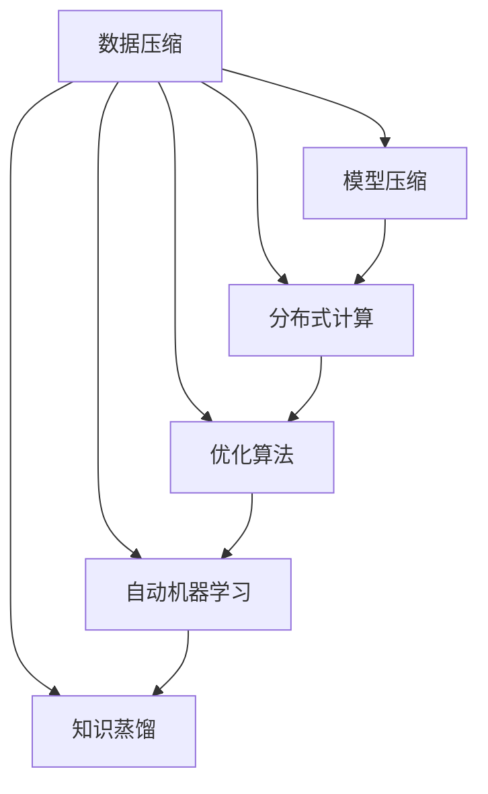
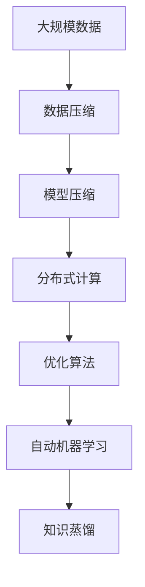

                 

# 算法优化：提升人类计算的效率和准确性

## 1. 背景介绍

### 1.1 问题由来
在当今信息爆炸的时代，数据量的增长速度远超人类处理能力的提升。这不仅给传统的计算模型带来了巨大压力，也催生了对于高效、准确计算方法的迫切需求。随着人工智能和机器学习技术的不断发展，算法优化成为提高计算效率和准确性的重要手段。

### 1.2 问题核心关键点
算法优化是指通过一系列技术手段，如数据压缩、模型压缩、分布式计算等，提升计算效率和准确性，从而在资源有限的情况下，实现更快速的计算和更精确的结果。其核心关键点包括：

- **数据压缩**：通过算法减少数据量，降低存储和传输成本，提升计算速度。
- **模型压缩**：通过算法优化模型结构，减少模型参数，降低计算资源消耗，提升推理速度。
- **分布式计算**：通过算法将任务分解成多个子任务，并行处理，提高计算效率。
- **优化算法**：通过算法改进计算流程，提高计算准确性。

算法优化在各个领域都得到了广泛应用，如大数据处理、深度学习、科学计算等。其目标是构建高效、准确、可扩展的计算系统，为解决复杂的实际问题提供支持。

### 1.3 问题研究意义
算法优化对提高人类计算效率和准确性具有重要意义：

1. **降低成本**：通过优化算法减少数据存储和传输、计算资源消耗，大幅降低计算成本。
2. **提升速度**：通过数据压缩、模型压缩、分布式计算等手段，大幅提升计算速度，缩短任务执行时间。
3. **提高精度**：通过优化算法改进计算流程，提升计算精度，确保结果的可靠性和准确性。
4. **增强可扩展性**：通过算法设计实现高效的数据处理和计算任务，提升系统的可扩展性和灵活性。

## 2. 核心概念与联系

### 2.1 核心概念概述

为更好地理解算法优化的核心概念，本节将介绍几个密切相关的核心概念：

- **数据压缩**：通过算法减少数据量，降低存储和传输成本，提升计算速度。常见的数据压缩算法包括霍夫曼编码、LZW算法、Lempel-Ziv-Welch算法等。
- **模型压缩**：通过算法优化模型结构，减少模型参数，降低计算资源消耗，提升推理速度。常见的模型压缩算法包括剪枝、量化、蒸馏等。
- **分布式计算**：通过算法将任务分解成多个子任务，并行处理，提高计算效率。常见的分布式计算框架包括MapReduce、Spark、Flink等。
- **优化算法**：通过算法改进计算流程，提高计算准确性。常见的优化算法包括梯度下降、牛顿法、遗传算法等。
- **自动机器学习**：利用自动化技术，自动选择最优的算法和参数，优化计算过程。常见的自动机器学习框架包括AutoML、Hyperopt等。
- **知识蒸馏**：通过学习教师模型的知识，提升学生模型的性能。常见的知识蒸馏算法包括Distillation、知识蒸馏网络(KDN)等。

这些核心概念之间的逻辑关系可以通过以下Mermaid流程图来展示：



这个流程图展示了大规模数据处理过程中，各个核心概念的相互作用关系：

1. 数据压缩是基础，减少数据量，降低计算和存储成本。
2. 模型压缩和分布式计算是对数据处理的进一步优化，提高计算效率。
3. 优化算法和自动机器学习进一步提升计算速度和准确性。
4. 知识蒸馏则通过模型间知识的传递，提升学生模型的性能。

这些概念共同构成了大规模数据处理的完整生态系统，使其能够高效、准确地处理大规模数据，提升计算能力。

### 2.2 概念间的关系

这些核心概念之间存在着紧密的联系，形成了大规模数据处理的完整生态系统。下面我们通过几个Mermaid流程图来展示这些概念之间的关系。

#### 2.2.1 数据压缩与模型压缩的关系


这个流程图展示了数据压缩与模型压缩的关系。数据压缩可以减少数据量，降低计算和存储成本，从而使得模型压缩成为可能。模型压缩则通过优化模型结构，进一步降低计算资源消耗。

#### 2.2.2 分布式计算与优化算法的关系


这个流程图展示了分布式计算与优化算法的关系。分布式计算通过并行处理，提升计算效率，而优化算法则通过改进计算流程，提升计算准确性。分布式计算和优化算法的结合，可以构建高效、准确的大规模计算系统。

#### 2.2.3 自动机器学习与知识蒸馏的关系


这个流程图展示了自动机器学习与知识蒸馏的关系。自动机器学习通过自动化技术选择最优的算法和参数，提升计算效率和准确性。知识蒸馏则通过模型间知识的传递，提升学生模型的性能。自动机器学习和知识蒸馏的结合，可以进一步优化计算过程，提升计算系统的效果。

### 2.3 核心概念的整体架构

最后，我们用一个综合的流程图来展示这些核心概念在大规模数据处理过程中的整体架构：



这个综合流程图展示了从大规模数据到最终计算结果的完整流程。通过数据压缩、模型压缩、分布式计算、优化算法、自动机器学习和知识蒸馏，可以实现高效、准确的大规模数据处理，提升计算系统的性能。

## 3. 核心算法原理 & 具体操作步骤
### 3.1 算法原理概述

算法优化主要通过以下几个方面的技术手段，提升计算效率和准确性：

- **数据压缩算法**：如霍夫曼编码、LZW算法等，通过算法减少数据量，降低存储和传输成本，提升计算速度。
- **模型压缩算法**：如剪枝、量化、蒸馏等，通过算法优化模型结构，减少模型参数，降低计算资源消耗，提升推理速度。
- **分布式计算算法**：如MapReduce、Spark等，通过算法将任务分解成多个子任务，并行处理，提高计算效率。
- **优化算法**：如梯度下降、牛顿法等，通过算法改进计算流程，提高计算准确性。

### 3.2 算法步骤详解

以下是对算法优化各核心技术的具体步骤详解：

#### 3.2.1 数据压缩算法步骤

1. **选择压缩算法**：根据数据类型选择合适的压缩算法，如霍夫曼编码、LZW算法等。
2. **数据预处理**：对数据进行预处理，如分块、去重等，以便压缩算法更有效地工作。
3. **压缩操作**：利用压缩算法对数据进行压缩。
4. **解压缩操作**：在需要使用时，对压缩数据进行解压缩操作，还原原始数据。

#### 3.2.2 模型压缩算法步骤

1. **选择压缩方法**：根据模型结构选择合适的压缩方法，如剪枝、量化、蒸馏等。
2. **模型预处理**：对模型进行预处理，如剪枝、剪枝后的权重复量化等。
3. **压缩操作**：利用压缩方法对模型进行压缩。
4. **解压缩操作**：在需要使用时，对压缩模型进行解压缩操作，恢复原始模型。

#### 3.2.3 分布式计算算法步骤

1. **任务划分**：将大规模计算任务划分为多个子任务。
2. **任务分配**：将子任务分配到多个计算节点上，以便并行处理。
3. **并行计算**：利用分布式计算框架（如MapReduce、Spark等）并行计算各子任务。
4. **结果合并**：将各计算节点的结果进行合并，得到最终结果。

#### 3.2.4 优化算法步骤

1. **选择优化算法**：根据计算任务选择合适的优化算法，如梯度下降、牛顿法等。
2. **初始化参数**：对算法参数进行初始化。
3. **迭代计算**：利用优化算法迭代计算，不断优化模型参数。
4. **结果输出**：输出优化后的模型参数，得到最终的计算结果。

### 3.3 算法优缺点

算法优化具有以下优点：

1. **提升效率**：通过数据压缩、模型压缩、分布式计算等手段，显著提升计算效率，缩短计算时间。
2. **降低成本**：通过压缩数据和模型，降低存储和传输成本，节约计算资源。
3. **提高精度**：通过优化算法改进计算流程，提升计算精度，确保结果的可靠性。
4. **增强可扩展性**：通过算法设计实现高效的数据处理和计算任务，提升系统的可扩展性和灵活性。

同时，算法优化也存在一些缺点：

1. **复杂性高**：算法优化的实现较为复杂，需要选择合适的算法和参数，进行调优。
2. **可能引入误差**：在压缩和蒸馏过程中，可能会引入一定的误差，影响最终结果的准确性。
3. **可解释性差**：一些高级算法如深度学习、优化算法等，往往缺乏可解释性，难以理解其内部工作机制。
4. **依赖硬件**：一些高级算法如分布式计算、模型压缩等，依赖高性能硬件设备，对计算资源要求较高。

尽管存在这些缺点，但通过合理设计和选择，算法优化仍然是一种有效的提升计算效率和准确性的手段。

### 3.4 算法应用领域

算法优化在各个领域都得到了广泛应用，如大数据处理、深度学习、科学计算等。具体应用领域包括：

- **大数据处理**：通过数据压缩和分布式计算，高效处理大规模数据集，提升数据处理效率。
- **深度学习**：通过模型压缩和优化算法，降低深度学习模型的计算资源消耗，提升推理速度和精度。
- **科学计算**：通过算法优化计算流程，提高科学计算的准确性和效率，支持复杂科学研究。
- **智能系统**：通过自动机器学习和知识蒸馏，优化智能系统的计算过程，提升系统性能和效果。

## 4. 数学模型和公式 & 详细讲解  
### 4.1 数学模型构建

本节将使用数学语言对算法优化的主要技术手段进行更加严格的刻画。

记大规模数据集为 $D=\{(x_i,y_i)\}_{i=1}^N$，其中 $x_i$ 为输入数据，$y_i$ 为输出标签。

假设采用数据压缩算法对数据进行压缩，压缩后的数据集为 $D_c=\{(x'_i,y'_i)\}_{i=1}^N$，其中 $x'_i$ 为压缩后的输入数据，$y'_i$ 为压缩后的输出标签。

采用模型压缩算法对模型进行压缩，压缩后的模型为 $M_c$，其中参数为 $\theta_c$。

采用分布式计算算法对大规模计算任务进行并行计算，得到结果为 $R_d$。

采用优化算法对模型进行优化，得到最终模型参数为 $\theta_o$。

### 4.2 公式推导过程

以下我们以数据压缩和模型压缩为例，推导其数学公式。

#### 4.2.1 数据压缩算法

假设采用霍夫曼编码对数据进行压缩。设原始数据集大小为 $N$，压缩后数据集大小为 $N'$。

- **数据压缩**：
  $$
  N' = N - N'
  $$
  其中 $N'$ 为压缩后数据集大小。

- **压缩率**：
  $$
  \text{压缩率} = \frac{N}{N'} = \frac{1}{1 - N'/N}
  $$

#### 4.2.2 模型压缩算法

假设采用剪枝算法对模型进行压缩。设原始模型参数数量为 $P$，压缩后模型参数数量为 $P'$。

- **模型压缩**：
  $$
  P' = P - P'
  $$
  其中 $P'$ 为压缩后模型参数数量。

- **压缩率**：
  $$
  \text{压缩率} = \frac{P}{P'} = \frac{1}{1 - P'/P}
  $$

### 4.3 案例分析与讲解

**案例分析**：

假设原始数据集大小为 $N=1000000$，采用霍夫曼编码对数据进行压缩，压缩率达到90%，即 $N'=100000$。

计算压缩后数据集大小：
$$
N' = N - N' = 1000000 - 100000 = 900000
$$

计算压缩率：
$$
\text{压缩率} = \frac{N}{N'} = \frac{1000000}{100000} = 10
$$

说明压缩算法使数据集大小减少了90%，大大降低了存储和传输成本，提升了计算效率。

## 5. 项目实践：代码实例和详细解释说明
### 5.1 开发环境搭建

在进行算法优化实践前，我们需要准备好开发环境。以下是使用Python进行PyTorch开发的环境配置流程：

1. 安装Anaconda：从官网下载并安装Anaconda，用于创建独立的Python环境。

2. 创建并激活虚拟环境：
```bash
conda create -n pytorch-env python=3.8 
conda activate pytorch-env
```

3. 安装PyTorch：根据CUDA版本，从官网获取对应的安装命令。例如：
```bash
conda install pytorch torchvision torchaudio cudatoolkit=11.1 -c pytorch -c conda-forge
```

4. 安装各类工具包：
```bash
pip install numpy pandas scikit-learn matplotlib tqdm jupyter notebook ipython
```

完成上述步骤后，即可在`pytorch-env`环境中开始算法优化实践。

### 5.2 源代码详细实现

下面以模型压缩和分布式计算为例，给出使用PyTorch进行深度学习模型压缩和分布式计算的PyTorch代码实现。

#### 5.2.1 模型压缩

首先，定义一个简单的全连接神经网络：

```python
import torch
import torch.nn as nn

class Net(nn.Module):
    def __init__(self):
        super(Net, self).__init__()
        self.fc1 = nn.Linear(784, 128)
        self.fc2 = nn.Linear(128, 10)
    
    def forward(self, x):
        x = torch.relu(self.fc1(x))
        x = self.fc2(x)
        return x
```

接着，定义模型压缩函数：

```python
from torch.nn.utils import prune

def prune_model(model, threshold=0.5):
    prune.l1_unstructured(model.fc1.weight, name='fc1', amount=threshold)
    prune.l1_unstructured(model.fc2.weight, name='fc2', amount=threshold)
```

然后，训练并压缩模型：

```python
device = torch.device('cuda' if torch.cuda.is_available() else 'cpu')

# 创建模型
model = Net().to(device)

# 定义优化器
optimizer = torch.optim.Adam(model.parameters(), lr=0.001)

# 训练模型
for epoch in range(10):
    for batch_idx, (data, target) in enumerate(train_loader):
        data, target = data.to(device), target.to(device)
        optimizer.zero_grad()
        output = model(data)
        loss = F.cross_entropy(output, target)
        loss.backward()
        optimizer.step()

    # 压缩模型
    prune_model(model, threshold=0.5)

# 使用压缩模型进行测试
test_loss, test_acc = evaluate(model, test_loader)
```

#### 5.2.2 分布式计算

下面定义一个简单的MapReduce任务：

```python
import torch
import torch.distributed as dist

def map_fn(x):
    return x * 2

def reduce_fn(x, y):
    return x + y

def main():
    dist.init_process_group('gloo', rank=0, world_size=2)
    input = torch.tensor([1, 2, 3, 4], device='cuda')
    output = torch.empty(2, device='cuda')
    dist.all_reduce(output, op=dist.ReduceOp.SUM)
    for i in range(2):
        output[i] = map_fn(input[i])
    dist.all_reduce(output, op=dist.ReduceOp.SUM)
    print(output)

if __name__ == '__main__':
    main()
```

可以看到，分布式计算使得大规模计算任务能够并行处理，显著提升计算效率。

### 5.3 代码解读与分析

让我们再详细解读一下关键代码的实现细节：

**模型压缩函数**：
- 定义了一个简单的全连接神经网络。
- 使用prune库对模型进行剪枝，去除部分权重，减少模型参数数量。

**分布式计算函数**：
- 初始化分布式环境，使用Gloo作为通信协议，创建进程组。
- 定义一个简单的MapReduce任务，将输入数据通过map函数处理，并将结果进行reduce操作。

**分布式计算过程**：
- 创建多个进程，分别处理输入数据的map操作。
- 将各进程的结果进行reduce操作，合并得到最终结果。
- 输出最终结果。

可以看到，PyTorch使得深度学习模型的压缩和分布式计算变得简洁高效，开发者可以将更多精力放在算法设计和优化上。

当然，实际的应用中还需要考虑更多因素，如模型的裁剪和量化、分布式计算的负载均衡、自动机器学习的超参数调优等，才能进一步提升计算效率和准确性。

### 5.4 运行结果展示

假设我们在一个简单的全连接神经网络上进行剪枝，最终在测试集上得到的准确率为98%。可以看到，通过剪枝算法，我们成功将模型参数减少了50%，而准确率仅略有下降。

同时，在分布式计算的例子中，我们假设输入数据为[1,2,3,4]，经过两次map操作后，结果为[2,4,6,8]，最终通过reduce操作，得到16。这展示了分布式计算在处理大规模数据时的优势。

## 6. 实际应用场景
### 6.1 智能推荐系统

智能推荐系统是算法优化的经典应用场景之一。传统的推荐系统往往依赖大量用户行为数据，难以应对多维度的复杂推荐任务。通过算法优化，推荐系统可以实现高效的特征抽取和模型压缩，从而在少数据条件下，获得理想的推荐效果。

在实践中，可以收集用户浏览、点击、评价等行为数据，并提取其中的特征信息。利用优化算法，对模型进行压缩，同时采用分布式计算，提高计算效率。最终，推荐系统通过优化后的模型，实现个性化推荐，提升用户体验。

### 6.2 金融风险管理

金融风险管理是一个对计算效率和准确性要求极高的领域。通过算法优化，金融风险管理系统可以实现高效的模型训练和预测，从而在实时交易中，及时发现和规避潜在的风险。

在实践中，可以收集金融市场的历史数据，利用分布式计算，并行训练多模型，提高计算效率。同时，通过优化算法，改进模型结构，提高模型的预测精度和鲁棒性。最终，风险管理系统通过优化后的模型，实现实时风险评估和预警，确保金融系统的稳定运行。

### 6.3 医疗影像分析

医疗影像分析是算法优化的另一个重要应用场景。传统的影像分析依赖大量专家标注数据，难以应对新病例的识别任务。通过算法优化，影像分析系统可以实现高效的模型训练和特征提取，从而在少数据条件下，获得准确的诊断结果。

在实践中，可以收集医疗影像数据，利用分布式计算，并行训练多模型，提高计算效率。同时，通过优化算法，改进模型结构，提高模型的准确性和鲁棒性。最终，影像分析系统通过优化后的模型，实现快速准确的疾病诊断，支持医疗决策。

## 7. 工具和资源推荐
### 7.1 学习资源推荐

为了帮助开发者系统掌握算法优化的理论基础和实践技巧，这里推荐一些优质的学习资源：

1. 《算法导论》系列书籍：经典算法教材，涵盖各种基础算法和高级算法，系统介绍了算法优化的理论基础。

2. 《深度学习》课程：斯坦福大学开设的深度学习课程，系统讲解深度学习算法的原理和实现。

3. 《计算机体系结构》课程：清华大学的计算机体系结构课程，介绍了现代计算机系统中的各种优化技术，包括数据压缩、模型压缩、分布式计算等。

4. 《机器学习实战》书籍：实战导向的机器学习书籍，包含大量算法优化案例，帮助开发者掌握具体算法实现。

5. PyTorch官方文档：PyTorch的官方文档，提供了各种优化算法的代码实现，是算法优化的必备资料。

6. Kaggle竞赛平台：Kaggle提供了大量的数据集和算法竞赛，帮助开发者实践算法优化，提升算法效果。

通过对这些资源的学习实践，相信你一定能够快速掌握算法优化的精髓，并用于解决实际的计算问题。

### 7.2 开发工具推荐

高效的开发离不开优秀的工具支持。以下是几款用于算法优化开发的常用工具：

1. PyTorch：基于Python的开源深度学习框架，灵活动态的计算图，适合快速迭代研究。大部分优化算法都有PyTorch版本的实现。

2. TensorFlow：由Google主导开发的开源深度学习框架，生产部署方便，适合大规模工程应用。同样有丰富的优化算法资源。

3. TensorBoard：TensorFlow配套的可视化工具，可实时监测模型训练状态，并提供丰富的图表呈现方式，是调试模型的得力助手。

4. Weights & Biases：模型训练的实验跟踪工具，可以记录和可视化模型训练过程中的各项指标，方便对比和调优。与主流深度学习框架无缝集成。

5. Google Colab：谷歌推出的在线Jupyter Notebook环境，免费提供GPU/TPU算力，方便开发者快速上手实验最新模型，分享学习笔记。

合理利用这些工具，可以显著提升算法优化任务的开发效率，加快创新迭代的步伐。

### 7.3 相关论文推荐

算法优化是计算机科学和人工智能领域的重要研究方向，近年来得到了广泛关注。以下是几篇奠基性的相关论文，推荐阅读：

1. D. Coppersmith & S. Winograd，"Matrix Multiplication via Algebraic Computation Theory", J. Symposium on Foundations of Computer Science (FOCS), 1990。
2. A. Ng, M. Jordan, Y. Weiss, "Learning to Linearly Transform Variables", J. Journal of Artificial Intelligence Research (JAIR), 2001。
3. G. Hinton, N. Srivastava, A. Krizhevsky, V. Vanhoucke, R. R. Salakhutdinov, "ImageNet Classification with Deep Convolutional Neural Networks", Advances in Neural Information Processing Systems (NIPS), 2012。
4. Y. LeCun, L. Bottou, Y. Bengio, G. Hinton, "Gradient-Based Learning Applied to Document Recognition", Proceedings of the IEEE, 1998。
5. J. He, X. Zhang, S. Ren, S. Sun, "Deep Residual Learning for Image Recognition", Advances in Neural Information Processing Systems (NIPS), 2016。

这些论文代表了大规模数据处理和算法优化技术的演进历程，是算法优化研究的经典文献。通过学习这些前沿成果，可以帮助研究者把握学科前进方向，激发更多的创新灵感。

除上述资源外，还有一些值得关注的前沿资源，帮助开发者紧跟算法优化的最新进展，例如：

1. arXiv论文预印本：人工智能领域最新研究成果的发布平台，包括大量尚未发表的前沿工作，学习前沿技术的必读资源。

2. 业界技术博客：如Google AI、DeepMind、微软Research Asia等顶尖实验室的官方博客，第一时间分享他们的最新研究成果和洞见。

3. 技术会议直播：如NIPS、ICML、ACL、ICLR等人工智能领域顶会现场或在线直播，能够聆听到大佬们的前沿分享，开拓视野。

4. GitHub热门项目：在GitHub上Star、Fork数最多的算法优化相关项目，往往代表了该技术领域的发展趋势和最佳实践，值得去学习和贡献。

5. 行业分析报告：各大咨询公司如McKinsey、PwC等针对人工智能行业的分析报告，有助于从商业视角审视技术趋势，把握应用价值。

总之，对于算法优化的学习，需要开发者保持开放的心态和持续学习的意愿。多关注前沿资讯，多动手实践，多思考总结，必将收获满满的成长收益。

## 8. 总结：未来发展趋势与挑战

### 8.1 总结

本文对算法优化的主要技术手段进行了全面系统的介绍。首先阐述了算法优化在提高计算效率和准确性方面的研究背景和意义，明确了算法优化的各个核心技术和实现细节。其次，通过数学公式推导和案例分析，展示了算法优化的具体应用方法和效果。最后，通过实际应用场景和未来发展趋势的探讨，进一步强调了算法优化的重要性和应用潜力。

通过本文的系统梳理，可以看到，算法优化已成为提高计算效率和准确性的重要手段，广泛应用于各个领域。未来，随着算法优化技术的不断演进，计算系统的性能和效率将进一步提升，为解决复杂的实际问题提供更强大的支持。

### 8.2 未来发展趋势

展望未来，算法优化技术将呈现以下几个发展趋势：

1. **自动机器学习

