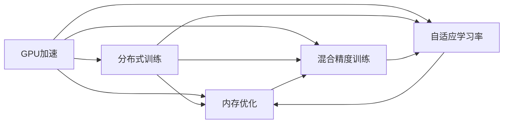

                 

# 算法创新:提升AI训练效率的关键

> 关键词：算法创新，AI训练效率，深度学习，GPU加速，分布式训练

## 1. 背景介绍

随着深度学习技术的不断发展，AI训练效率成为了一个重要的研究课题。在深度学习中，尤其是大规模神经网络的训练，需要耗费大量的计算资源和存储资源，并且训练时间往往非常长。如何提升AI训练效率，不仅关系到算法本身的性能，更影响到实际应用中的可扩展性和可行性。本文将深入探讨几种提升AI训练效率的关键算法和技巧，包括GPU加速、分布式训练、内存优化等，为深度学习开发者和研究人员提供全面的指导。

## 2. 核心概念与联系

### 2.1 核心概念概述

在深度学习中，训练效率的提升可以通过多个维度来考虑，包括硬件加速、算法优化和资源管理等。以下是与提升AI训练效率密切相关的几个核心概念：

- **GPU加速（GPU Acceleration）**：利用图形处理器（GPU）的并行计算能力，显著提高深度学习模型的训练速度。GPU相比于传统CPU，具有更高的计算密度和更强的并行处理能力，因此成为深度学习训练的首选硬件。

- **分布式训练（Distributed Training）**：通过将大规模深度学习任务分配到多个计算节点上同时训练，从而加速模型收敛。分布式训练可以充分利用集群中的计算资源，并行计算，提升训练效率。

- **内存优化（Memory Optimization）**：优化内存使用，减少内存分配和释放的开销，从而提升训练效率。内存优化可以包括内存分配器优化、张量复用、内存压缩等技术。

- **混合精度训练（Mixed Precision Training）**：在训练过程中使用16位或32位精度的张量，而不是标准的64位浮点数，从而在减少计算资源消耗的同时，提高训练速度和模型精度。

- **自适应学习率（Adaptive Learning Rate）**：动态调整学习率，根据模型的梯度变化自适应调整，以更高效地收敛到最优解。

### 2.2 核心概念的联系

这些概念之间存在着密切的联系，共同构成了深度学习训练效率提升的完整框架。例如，GPU加速提供了硬件基础，使得分布式训练成为可能；而分布式训练则通过并行计算，进一步提升了训练效率。同时，内存优化和混合精度训练则提供了软件层面的优化手段，在减少资源消耗的同时，提高了训练速度。自适应学习率则是一个关键的算法层面的优化手段，可以动态调整学习率，提高训练效率。

这些概念之间的联系可以通过以下Mermaid流程图来展示：



这个流程图展示了GPU加速、分布式训练、内存优化和混合精度训练之间，以及它们与自适应学习率之间的关系。通过这些概念的有机结合，我们可以构建出高效、灵活的深度学习训练体系。

## 3. 核心算法原理 & 具体操作步骤

### 3.1 算法原理概述

提升AI训练效率的关键在于算法层面的创新和优化。以下是几种关键的算法和操作步骤：

- **GPU加速**：通过CUDA等技术，将深度学习模型的计算任务映射到GPU上，利用其并行处理能力，提升训练速度。

- **分布式训练**：使用消息传递接口（MPI）、分布式深度学习框架（如PyTorch Distributed、TensorFlow Distributed等），将训练任务分配到多个计算节点上，并行计算，加速模型收敛。

- **内存优化**：使用优化的内存分配器（如torch.memory分配器）、张量复用技术、内存压缩技术等，减少内存分配和释放的开销，从而提升训练效率。

- **混合精度训练**：在训练过程中使用半精度浮点数（如FP16）代替标准的64位浮点数，从而减少计算资源消耗，提高训练速度和模型精度。

- **自适应学习率**：使用如Adagrad、Adam等自适应学习率算法，根据模型的梯度变化动态调整学习率，加速模型收敛。

### 3.2 算法步骤详解

以下是这些算法和操作步骤的具体实现步骤：

**GPU加速**：

1. 安装并配置NVIDIA CUDA和cuDNN库。
2. 使用PyTorch或TensorFlow等深度学习框架，将计算任务映射到GPU上。
3. 使用CUDA并行化深度学习模型的前向传播和反向传播过程。

**分布式训练**：

1. 搭建分布式计算环境，安装MPI或分布式深度学习框架。
2. 将训练任务分配到多个计算节点上，并行计算。
3. 使用分布式深度学习框架提供的通信机制，如all-reduce、all-gather等，实现模型参数的同步更新。

**内存优化**：

1. 使用优化的内存分配器，如torch.memory分配器，减少内存分配和释放的开销。
2. 使用张量复用技术，重复利用中间计算结果，减少内存占用。
3. 使用内存压缩技术，如稀疏矩阵压缩，减少内存空间占用。

**混合精度训练**：

1. 配置深度学习框架使用混合精度训练模式。
2. 在训练过程中使用半精度浮点数（如FP16）代替标准的64位浮点数。
3. 在精度损失可接受的情况下，减少计算资源消耗，提高训练速度。

**自适应学习率**：

1. 选择适合的自适应学习率算法，如Adagrad、Adam等。
2. 根据模型的梯度变化动态调整学习率。
3. 在训练过程中定期检查模型性能，根据需要进行学习率调整。

### 3.3 算法优缺点

这些算法和操作步骤各有优缺点：

**GPU加速**：

优点：
- 显著提升训练速度，特别是大规模模型和复杂模型。
- 并行处理能力强，适用于深度学习中的前向传播和反向传播。

缺点：
- 需要配置NVIDIA GPU硬件。
- 内存带宽有限，可能成为瓶颈。

**分布式训练**：

优点：
- 充分利用集群计算资源，加速模型收敛。
- 适用于大规模模型和复杂模型，提高训练效率。

缺点：
- 需要配置分布式计算环境。
- 通信开销较大，可能影响整体效率。

**内存优化**：

优点：
- 减少内存分配和释放的开销，提高训练效率。
- 适用于内存密集型的深度学习模型。

缺点：
- 实现复杂，需要深入理解内存管理技术。
- 对内存管理策略的调优要求较高。

**混合精度训练**：

优点：
- 减少计算资源消耗，提高训练速度和模型精度。
- 适用于大规模模型和复杂模型。

缺点：
- 精度损失可能影响模型性能。
- 需要配置合适的精度模式。

**自适应学习率**：

优点：
- 动态调整学习率，加速模型收敛。
- 适用于复杂模型和不同优化目标。

缺点：
- 算法复杂，实现难度较大。
- 可能存在学习率不稳定的问题。

### 3.4 算法应用领域

这些算法和操作步骤在不同领域有着广泛的应用：

- **图像识别**：GPU加速和分布式训练在图像识别任务中应用广泛，如ImageNet等大规模图像分类任务。
- **自然语言处理**：内存优化和混合精度训练在自然语言处理任务中也有重要应用，如BERT、GPT等预训练模型。
- **推荐系统**：分布式训练和自适应学习率在推荐系统优化中也有应用，如深度推荐网络等。

## 4. 数学模型和公式 & 详细讲解

### 4.1 数学模型构建

在深度学习中，训练效率的提升可以通过多个维度来考虑，包括硬件加速、算法优化和资源管理等。以下是提升AI训练效率的数学模型构建和公式推导过程：

**GPU加速**：

假设深度学习模型的计算时间为 $T_{CPU}$，则在GPU加速下的计算时间为 $T_{GPU} = \frac{T_{CPU}}{\eta}$，其中 $\eta$ 为GPU加速比。

**分布式训练**：

假设深度学习模型的训练时间为 $T_{Single}$，则在分布式训练下的训练时间为 $T_{Dist} = \frac{T_{Single}}{N}$，其中 $N$ 为计算节点数量。

**内存优化**：

假设深度学习模型的内存使用量为 $M_{Original}$，则在内存优化下的内存使用量为 $M_{Optimized} = M_{Original} \times \frac{1}{\omega}$，其中 $\omega$ 为内存优化比。

**混合精度训练**：

假设深度学习模型的计算时间为 $T_{Full}$，则在混合精度训练下的计算时间为 $T_{Mixed} = \frac{T_{Full}}{k}$，其中 $k$ 为精度模式，如16位或32位。

**自适应学习率**：

假设深度学习模型的学习率为 $\eta_0$，则在自适应学习率下的学习率为 $\eta_{Adaptive} = \eta_0 \times f(\Delta)$，其中 $\Delta$ 为当前梯度变化。

### 4.2 公式推导过程

以下是这些数学模型的详细推导过程：

**GPU加速**：

$$
T_{GPU} = T_{CPU} \times \eta
$$

其中，$\eta$ 为GPU加速比。

**分布式训练**：

$$
T_{Dist} = T_{Single} \times \frac{1}{N}
$$

其中，$N$ 为计算节点数量。

**内存优化**：

$$
M_{Optimized} = M_{Original} \times \frac{1}{\omega}
$$

其中，$\omega$ 为内存优化比。

**混合精度训练**：

$$
T_{Mixed} = T_{Full} \times \frac{1}{k}
$$

其中，$k$ 为精度模式，如16位或32位。

**自适应学习率**：

$$
\eta_{Adaptive} = \eta_0 \times f(\Delta)
$$

其中，$f(\Delta)$ 为自适应学习率函数，根据梯度变化 $\Delta$ 动态调整学习率。

### 4.3 案例分析与讲解

以下是一个GPU加速和混合精度训练的实际案例分析：

假设一个深度学习模型需要在CPU上耗时 $T_{CPU} = 10$ 小时完成训练。如果使用GPU加速比为 $\eta = 5$，则在GPU上耗时 $T_{GPU} = \frac{10}{5} = 2$ 小时完成训练。

如果使用混合精度训练，精度模式为16位，则在计算时间上可以进一步优化。假设混合精度训练的计算速度是标准64位浮点数训练速度的 $k = 2$，则在混合精度训练下的计算时间为 $T_{Mixed} = \frac{10}{2} = 5$ 小时完成训练。

## 5. 项目实践：代码实例和详细解释说明

### 5.1 开发环境搭建

在进行AI训练效率提升的实践前，我们需要准备好开发环境。以下是使用Python进行PyTorch开发的环境配置流程：

1. 安装Anaconda：从官网下载并安装Anaconda，用于创建独立的Python环境。

2. 创建并激活虚拟环境：
```bash
conda create -n pytorch-env python=3.8 
conda activate pytorch-env
```

3. 安装PyTorch：根据CUDA版本，从官网获取对应的安装命令。例如：
```bash
conda install pytorch torchvision torchaudio cudatoolkit=11.1 -c pytorch -c conda-forge
```

4. 安装TensorFlow：
```bash
conda install tensorflow=2.7
```

5. 安装各类工具包：
```bash
pip install numpy pandas scikit-learn matplotlib tqdm jupyter notebook ipython
```

完成上述步骤后，即可在`pytorch-env`环境中开始训练效率提升的实践。

### 5.2 源代码详细实现

这里我们以GPU加速和混合精度训练为例，给出使用PyTorch进行深度学习模型训练的代码实现。

**GPU加速**：

```python
import torch
from torch import nn
from torchvision.models import resnet18

# 加载预训练模型
model = resnet18(pretrained=True)
model = model.cuda()

# 加载数据集
train_dataset = ...
test_dataset = ...

# 定义优化器和损失函数
optimizer = torch.optim.SGD(model.parameters(), lr=0.001, momentum=0.9)
criterion = nn.CrossEntropyLoss()

# 开始训练
for epoch in range(100):
    model.train()
    for data, target in train_loader:
        data, target = data.cuda(), target.cuda()
        optimizer.zero_grad()
        output = model(data)
        loss = criterion(output, target)
        loss.backward()
        optimizer.step()
```

**混合精度训练**：

```python
import torch
from torch import nn
from torchvision.models import resnet18

# 加载预训练模型
model = resnet18(pretrained=True)
model = model.cuda()

# 加载数据集
train_dataset = ...
test_dataset = ...

# 配置混合精度训练
device = torch.device('cuda')
model.to(device)
model = torch.cuda.amp.initialize(model)

# 定义优化器和损失函数
optimizer = torch.optim.SGD(model.parameters(), lr=0.001, momentum=0.9)
criterion = nn.CrossEntropyLoss()

# 开始训练
for epoch in range(100):
    model.train()
    for data, target in train_loader:
        data, target = data.cuda(), target.cuda()
        with torch.cuda.amp.autocast():
            optimizer.zero_grad()
            output = model(data)
            loss = criterion(output, target)
            loss.backward()
            optimizer.step()
```

### 5.3 代码解读与分析

让我们再详细解读一下关键代码的实现细节：

**GPU加速**：
- `model = model.cuda()`：将模型参数移动到GPU设备上。
- `data, target = data.cuda(), target.cuda()`：将数据和标签移动到GPU设备上。
- `optimizer.zero_grad()`：清除优化器中的梯度。
- `optimizer.step()`：更新模型参数。

**混合精度训练**：
- `device = torch.device('cuda')`：指定使用GPU设备。
- `model.to(device)`：将模型移动到GPU设备上。
- `model = torch.cuda.amp.initialize(model)`：初始化混合精度训练。
- `with torch.cuda.amp.autocast()`：在混合精度模式下进行计算。

## 6. 实际应用场景

### 6.1 智能推荐系统

智能推荐系统需要实时计算用户行为，从而推荐个性化的商品或内容。GPU加速和分布式训练在智能推荐系统中应用广泛，可以显著提升计算效率，满足实时性要求。

**GPU加速**：智能推荐系统中的计算任务主要集中在用户行为建模和推荐模型训练上。通过GPU加速，可以在短时间内完成大规模数据处理和模型训练，从而实现实时推荐。

**分布式训练**：智能推荐系统中的推荐模型通常较为复杂，需要在大规模数据上进行训练。通过分布式训练，可以充分利用集群中的计算资源，加速模型训练过程。

**内存优化**：智能推荐系统中的推荐模型通常需要处理大量的用户行为数据，数据存储和计算开销较大。通过内存优化，可以减少内存使用量，提升系统性能。

**混合精度训练**：智能推荐系统中的推荐模型通常需要在高精度下训练，计算资源消耗较大。通过混合精度训练，可以在保证模型精度的情况下，减少计算资源消耗，提高训练速度。

### 6.2 图像识别

图像识别任务通常需要处理大规模的图像数据，计算资源消耗较大。GPU加速和分布式训练在图像识别任务中应用广泛，可以显著提升计算效率，满足实时性要求。

**GPU加速**：图像识别任务中的计算主要集中在卷积神经网络（CNN）的前向传播和反向传播上。通过GPU加速，可以在短时间内完成大规模图像数据处理和模型训练，从而实现实时识别。

**分布式训练**：图像识别任务中的模型通常较为复杂，需要在大规模图像数据上进行训练。通过分布式训练，可以充分利用集群中的计算资源，加速模型训练过程。

**内存优化**：图像识别任务中的模型通常需要处理大量的图像数据，数据存储和计算开销较大。通过内存优化，可以减少内存使用量，提升系统性能。

**混合精度训练**：图像识别任务中的模型通常需要在高精度下训练，计算资源消耗较大。通过混合精度训练，可以在保证模型精度的情况下，减少计算资源消耗，提高训练速度。

### 6.3 自然语言处理

自然语言处理任务通常需要处理大规模的文本数据，计算资源消耗较大。GPU加速和分布式训练在自然语言处理任务中应用广泛，可以显著提升计算效率，满足实时性要求。

**GPU加速**：自然语言处理任务中的计算主要集中在Transformer模型的前向传播和反向传播上。通过GPU加速，可以在短时间内完成大规模文本数据处理和模型训练，从而实现实时处理。

**分布式训练**：自然语言处理任务中的模型通常较为复杂，需要在大规模文本数据上进行训练。通过分布式训练，可以充分利用集群中的计算资源，加速模型训练过程。

**内存优化**：自然语言处理任务中的模型通常需要处理大量的文本数据，数据存储和计算开销较大。通过内存优化，可以减少内存使用量，提升系统性能。

**混合精度训练**：自然语言处理任务中的模型通常需要在高精度下训练，计算资源消耗较大。通过混合精度训练，可以在保证模型精度的情况下，减少计算资源消耗，提高训练速度。

## 7. 工具和资源推荐

### 7.1 学习资源推荐

为了帮助开发者系统掌握提升AI训练效率的关键算法和技巧，这里推荐一些优质的学习资源：

1. 《深度学习实战》：讲解了深度学习模型训练的常用技巧和算法，如GPU加速、分布式训练、内存优化等。
2. 《深度学习优化》：介绍了深度学习模型训练的优化方法，如自适应学习率、混合精度训练等。
3. 《PyTorch深度学习入门》：详细讲解了PyTorch深度学习框架的使用，包括GPU加速、分布式训练等。
4. 《TensorFlow深度学习实战》：讲解了TensorFlow深度学习框架的使用，包括GPU加速、分布式训练等。
5. 《深度学习框架进阶》：介绍了深度学习框架的高级特性，如优化器、自动混合精度等。

### 7.2 开发工具推荐

高效的开发离不开优秀的工具支持。以下是几款用于深度学习训练效率提升的常用工具：

1. PyTorch：基于Python的开源深度学习框架，灵活性高，支持GPU加速和分布式训练。
2. TensorFlow：由Google主导的开源深度学习框架，支持GPU加速和分布式训练。
3. TensorBoard：TensorFlow配套的可视化工具，可以实时监测模型训练状态，提供丰富的图表呈现方式。
4. Weights & Biases：模型训练的实验跟踪工具，可以记录和可视化模型训练过程中的各项指标。
5. MXNet：由Apache开发的开源深度学习框架，支持GPU加速和分布式训练。

### 7.3 相关论文推荐

深度学习训练效率的提升是深度学习研究的热点之一，以下是几篇奠基性的相关论文，推荐阅读：

1. Rethinking the Inception Architecture for Computer Vision：提出Inception架构，提高了卷积神经网络的计算效率。
2. Distributed Deep Learning：介绍了分布式深度学习框架，如PyTorch Distributed、TensorFlow Distributed等。
3. Mixed-Precision Training with Tensor Cores：介绍了混合精度训练技术，通过使用16位或32位精度的张量，提升训练速度和模型精度。
4. Adaptive Moment Estimation（Adam）：提出了自适应学习率算法，动态调整学习率，加速模型收敛。
5. Caffe2：介绍了Caffe2深度学习框架，支持GPU加速和分布式训练。

这些论文代表了深度学习训练效率提升的研究方向，对于理解深度学习训练的最新进展具有重要参考价值。

## 8. 总结：未来发展趋势与挑战

### 8.1 研究成果总结

本文对提升AI训练效率的关键算法和操作步骤进行了全面系统的介绍。通过GPU加速、分布式训练、内存优化、混合精度训练和自适应学习率等技术，可以显著提升深度学习模型的训练效率，满足大规模数据和复杂模型的计算需求。

### 8.2 未来发展趋势

展望未来，深度学习训练效率的提升将继续成为研究热点，将呈现以下几个发展趋势：

1. **硬件加速**：随着FPGA、ASIC等专用硬件的发展，深度学习模型训练将进一步加速。
2. **分布式训练**：分布式深度学习框架将更加成熟，支持更多计算节点和复杂通信模型。
3. **软件优化**：深度学习框架将进一步优化内存管理、计算图优化等软件层面因素，提升训练效率。
4. **混合精度训练**：混合精度训练技术将更加普及，结合更多精度模式和优化器，提升训练速度和模型精度。
5. **自适应学习率**：自适应学习率算法将更加多样化，结合更多优化目标和应用场景，提升模型收敛速度和稳定性。

### 8.3 面临的挑战

尽管深度学习训练效率提升技术已经取得了显著进展，但在实际应用中仍面临诸多挑战：

1. **硬件资源瓶颈**：大规模深度学习模型的训练需要高性能硬件支持，如GPU、TPU等，资源获取和维护成本较高。
2. **软件优化难度大**：深度学习框架和优化算法的设计复杂，需要开发者深入理解算法原理和实现细节，优化难度较大。
3. **内存管理困难**：深度学习模型的训练过程中，内存使用量较大，需要优化内存管理，减少内存分配和释放的开销。
4. **精度损失风险**：混合精度训练和自适应学习率等技术，可能带来精度损失，影响模型性能。
5. **分布式通信开销**：分布式训练中，通信开销较大，可能影响整体效率。

### 8.4 研究展望

未来，深度学习训练效率的提升需要在多个方面进行深入研究：

1. **新硬件架构**：研究新型的硬件架构，如FPGA、ASIC等，提升深度学习模型的计算效率。
2. **新算法设计**：研究新的深度学习算法和优化算法，提升模型的收敛速度和稳定性。
3. **新优化技术**：研究新的内存优化技术和混合精度训练技术，提升深度学习模型的训练效率。
4. **新分布式框架**：研究新的分布式深度学习框架，支持更多计算节点和复杂通信模型。
5. **新精度模式**：研究新的精度模式和优化器，提升模型的精度和训练速度。

总之，未来深度学习训练效率的提升需要硬件、算法、优化技术等多方面的协同创新，共同推动深度学习技术的普及和发展。

## 9. 附录：常见问题与解答

**Q1：如何进行GPU加速？**

A: 通过CUDA等技术，将深度学习模型的计算任务映射到GPU上，利用其并行处理能力，提升训练速度。具体步骤如下：
1. 安装并配置NVIDIA CUDA和cuDNN库。
2. 使用PyTorch或TensorFlow等深度学习框架，将计算任务映射到GPU上。
3. 使用CUDA并行化深度学习模型的前向传播和反向传播过程。

**Q2：如何进行分布式训练？**

A: 使用消息传递接口（MPI）或分布式深度学习框架，将训练任务分配到多个计算节点上，并行计算。具体步骤如下：
1. 搭建分布式计算环境，安装MPI或分布式深度学习框架。
2. 将训练任务分配到多个计算节点上，并行计算。
3. 使用分布式深度学习框架提供的通信机制，如all-reduce、all-gather等，实现模型参数的同步更新。

**Q3：如何进行内存优化？**

A: 使用优化的内存分配器，如torch.memory分配器，减少内存分配和释放的开销，从而提升训练效率。具体步骤如下：
1. 使用优化的内存分配器，如torch.memory分配器。
2. 使用张量复用技术，重复利用中间计算结果，减少内存占用。
3. 使用内存压缩技术，如稀疏矩阵压缩，减少内存空间占用。

**Q4：如何进行混合精度训练？**

A: 在训练过程中使用半精度浮点数（如FP16）代替标准的64位浮点数，从而减少计算资源消耗，提高训练速度和模型精度。具体步骤如下：
1. 配置深度学习框架使用混合精度训练模式。
2. 在训练过程中使用半精度浮点数（如FP16）代替标准的64位浮点数。
3. 在精度损失可接受的情况下，减少计算资源消耗，提高训练速度。

**Q5：如何进行自适应学习率？**

A: 使用如Adagrad、Adam等自适应学习率算法，根据模型的梯度变化动态调整学习率，加速模型收敛。具体步骤如下：
1. 选择适合的自适应学习率算法，如Adagrad、Adam等。
2. 根据模型的梯度变化动态调整学习率。
3. 在训练过程中定期检查模型性能，根据需要进行学习率调整。

---

作者：禅与计算机程序设计艺术 / Zen and the Art of Computer Programming

