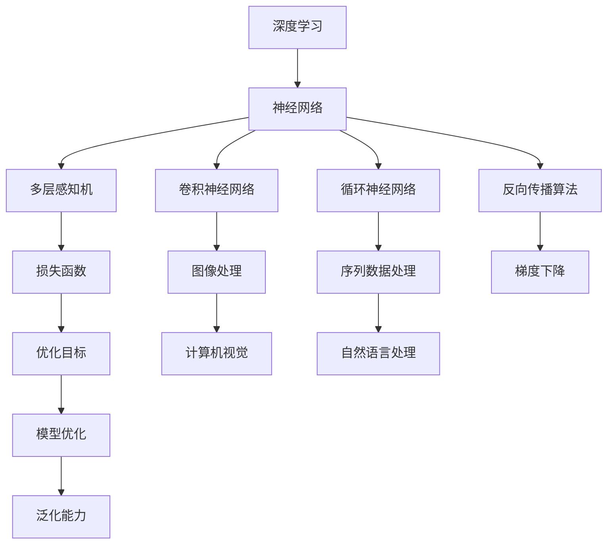

                 

# 算法创新：Hinton、LeCun与Bengio

人工智能（AI）领域的三位大师级人物，分别是Geoffrey Hinton、Yann LeCun和Yoshua Bengio，他们对深度学习、机器学习领域做出了深远的影响。从深度学习的基本概念到应用领域的广泛探索，这三位科学家带领人工智能走向了一个新的时代。本文将详细解析Hinton、LeCun与Bengio的贡献及其对人工智能领域的深远影响，帮助读者理解深度学习的核心原理及其在实际应用中的成功应用。

## 1. 背景介绍

### 1.1 问题由来

深度学习作为人工智能领域的重要分支，其背后蕴含着复杂而强大的数学模型和计算架构。从最初的浅层感知机（Perceptron），到多层感知机（MLP），再到卷积神经网络（CNN）、循环神经网络（RNN）等，深度学习在图像识别、语音识别、自然语言处理等领域取得了显著成果。

Hinton、LeCun与Bengio在这片领域的发展中扮演了至关重要的角色，他们不仅推动了深度学习理论的发展，还通过实际应用展示了其在不同场景下的巨大潜力。

### 1.2 问题核心关键点

本文聚焦于深度学习的核心问题，如深度神经网络的构建、反向传播算法、损失函数的选择以及深度学习在各种应用场景下的成功应用。我们还将探讨这三位科学家的贡献如何影响了深度学习的发展，以及未来AI领域可能的创新方向。

### 1.3 问题研究意义

深度学习已成为人工智能领域的主流技术之一，其理论基础和技术应用不断发展，引领了众多行业技术的升级与创新。Hinton、LeCun与Bengio的贡献不仅丰富了深度学习的理论体系，还推动了其在实际应用中的突破。研究他们的思想和贡献，对于理解深度学习的发展脉络和未来趋势具有重要意义。

## 2. 核心概念与联系

### 2.1 核心概念概述

- **深度学习（Deep Learning）**：基于多层神经网络的学习模型，能够自动学习输入数据的抽象特征表示，以解决复杂的非线性问题。

- **反向传播算法（Backpropagation）**：一种基于链式法则的优化算法，用于计算和更新深度神经网络的权重。

- **损失函数（Loss Function）**：用于评估模型预测输出与真实标签之间的差异，通常用于指导模型优化。

- **卷积神经网络（CNN）**：一种特殊的神经网络，通过卷积层、池化层等结构，用于图像处理和计算机视觉任务。

- **循环神经网络（RNN）**：能够处理序列数据（如时间序列、文本序列等）的神经网络，通过记忆单元保存状态信息。

- **对抗样本（Adversarial Examples）**：针对模型的一种攻击方式，通过精心构造的扰动样本，欺骗模型产生错误判断。

- **泛化（Generalization）**：模型在未见过的数据上表现良好，即能够将学习到的知识应用于新数据的能力。

### 2.2 概念间的关系

这些核心概念之间存在着紧密的联系，形成了深度学习的基础架构。通过以下Mermaid流程图，可以直观地展示它们之间的关系：



这个流程图展示了大规模深度学习的核心组件及其相互作用：

- 深度学习的基础是神经网络，包括多层感知机、卷积神经网络和循环神经网络等。
- 反向传播算法用于计算和更新神经网络的权重，优化损失函数。
- 损失函数衡量模型的预测输出与真实标签之间的差异，指导模型优化。
- 卷积神经网络和循环神经网络分别用于图像处理和序列数据处理。
- 通过损失函数定义优化目标，反向传播算法用于梯度下降，最终实现模型的泛化能力。

### 2.3 核心概念的整体架构

深度学习的核心架构由多层神经网络、反向传播算法、损失函数和优化目标组成。通过这些核心组件的协同工作，深度学习模型能够自动学习数据的复杂特征，并进行有效预测和分类。

## 3. 核心算法原理 & 具体操作步骤

### 3.1 算法原理概述

深度学习算法的核心在于构建多层神经网络，并通过反向传播算法计算和更新权重，最小化损失函数。以多层感知机（MLP）为例，其基本结构如下：

1. 输入层：接收原始数据。
2. 隐藏层：通过线性变换和非线性激活函数提取特征。
3. 输出层：根据任务定义输出结果。

在训练过程中，反向传播算法通过计算各层权重对损失函数的梯度，更新模型参数，以最小化预测输出与真实标签之间的差异。

### 3.2 算法步骤详解

以下以多层感知机（MLP）为例，介绍深度学习的基本训练步骤：

1. **数据预处理**：对原始数据进行归一化、标准化等预处理，以适应模型的输入要求。

2. **模型构建**：选择适当的神经网络结构和参数初始化方法，构建多层感知机模型。

3. **前向传播**：将预处理后的数据输入模型，通过隐藏层进行特征提取，最终输出预测结果。

4. **计算损失**：将模型的预测结果与真实标签进行比较，计算损失函数。

5. **反向传播**：通过反向传播算法计算各层权重对损失函数的梯度，更新模型参数。

6. **参数更新**：使用梯度下降等优化算法，更新模型的权重和偏置，以最小化损失函数。

7. **重复训练**：多次迭代训练，直到模型收敛或达到预设的训练轮数。

### 3.3 算法优缺点

深度学习的优点在于其强大的自适应能力，能够自动提取数据的复杂特征，并应用于多种应用场景。但同时，深度学习也存在计算复杂度高、模型易过拟合、参数难以解释等缺点。

### 3.4 算法应用领域

深度学习在图像识别、语音识别、自然语言处理、推荐系统、自动驾驶等多个领域取得了显著成果。例如：

- **图像识别**：通过卷积神经网络（CNN）进行图像分类、目标检测等任务。
- **语音识别**：通过循环神经网络（RNN）或卷积神经网络（CNN）进行语音识别和生成。
- **自然语言处理**：通过循环神经网络（RNN）或Transformer等架构进行文本分类、语言生成、机器翻译等任务。
- **推荐系统**：通过深度学习模型进行用户行为预测和物品推荐。
- **自动驾驶**：通过卷积神经网络（CNN）和循环神经网络（RNN）进行传感器数据处理和决策制定。

## 4. 数学模型和公式 & 详细讲解  
### 4.1 数学模型构建

假设有一个输入样本 $x \in \mathbb{R}^d$，一个深度神经网络模型 $f_\theta(x)$，其中 $\theta$ 表示模型的参数。模型的输出 $y$ 可以表示为：

$$
y = f_\theta(x) = \sigma(W_l \sigma(W_{l-1} \sigma(\cdots \sigma(W_1 x)\cdots)) + b_l)
$$

其中 $\sigma$ 为非线性激活函数（如ReLU、Sigmoid等），$W$ 和 $b$ 为权重和偏置参数。

模型的损失函数通常使用交叉熵损失函数：

$$
L(y, \hat{y}) = -\sum_{i=1}^n y_i \log \hat{y}_i
$$

在训练过程中，目标是最小化损失函数 $L$，即：

$$
\theta^* = \arg\min_\theta L(y, f_\theta(x))
$$

### 4.2 公式推导过程

以二分类任务为例，推导深度神经网络的损失函数：

假设输入 $x$，输出 $y$ 为二值向量，$y_i$ 表示第 $i$ 个样本的真实标签，$\hat{y}_i$ 表示模型对样本 $x_i$ 的预测结果。二分类交叉熵损失函数为：

$$
L(y, \hat{y}) = -(y \log \hat{y} + (1 - y) \log (1 - \hat{y}))
$$

对于多个样本的批量数据 $D=\{(x_i, y_i)\}_{i=1}^N$，经验风险最小化问题可以表示为：

$$
\min_\theta \frac{1}{N} \sum_{i=1}^N L(y_i, f_\theta(x_i))
$$

### 4.3 案例分析与讲解

以图像分类任务为例，分析深度学习模型的实现。假设我们使用LeNet-5模型进行手写数字识别，输入为28x28的灰度图像。

首先，输入图像经过卷积层提取特征，通过池化层减小尺寸，再通过全连接层输出预测结果。

在训练过程中，通过反向传播算法计算各层权重对损失函数的梯度，更新模型参数。经过多次迭代，模型能够学习到输入图像的复杂特征，并进行准确分类。

## 5. 项目实践：代码实例和详细解释说明

### 5.1 开发环境搭建

深度学习的项目实践需要一定的硬件和软件环境。以下是使用Python和PyTorch进行深度学习开发的简单环境配置：

1. 安装Python：下载并安装Python 3.x版本，配置环境变量。

2. 安装PyTorch：通过pip安装PyTorch库。

3. 安装其他依赖库：安装Numpy、Pandas、Matplotlib等常用库。

4. 安装GPU支持：安装CUDA和cuDNN库，以支持GPU加速计算。

5. 创建虚拟环境：使用virtualenv或conda创建虚拟环境。

### 5.2 源代码详细实现

以下是一个简单的深度学习项目，使用PyTorch库实现手写数字识别：

```python
import torch
import torch.nn as nn
import torch.optim as optim
import torchvision.transforms as transforms
from torchvision import datasets

# 定义模型
class Net(nn.Module):
    def __init__(self):
        super(Net, self).__init__()
        self.conv1 = nn.Conv2d(1, 10, kernel_size=5)
        self.conv2 = nn.Conv2d(10, 20, kernel_size=5)
        self.conv2_drop = nn.Dropout2d()
        self.fc1 = nn.Linear(320, 50)
        self.fc2 = nn.Linear(50, 10)

    def forward(self, x):
        x = F.relu(F.max_pool2d(self.conv1(x), 2))
        x = F.relu(F.max_pool2d(self.conv2_drop(self.conv2(x)), 2))
        x = x.view(-1, 320)
        x = F.relu(self.fc1(x))
        x = F.dropout(x, training=self.training)
        x = self.fc2(x)
        return F.log_softmax(x, dim=1)

# 加载数据集
transform = transforms.Compose([
    transforms.ToTensor(),
    transforms.Normalize((0.5,), (0.5,))
])

trainset = datasets.MNIST('mnist_data/', train=True, download=True, transform=transform)
trainloader = torch.utils.data.DataLoader(trainset, batch_size=64, shuffle=True)

testset = datasets.MNIST('mnist_data/', train=False, download=True, transform=transform)
testloader = torch.utils.data.DataLoader(testset, batch_size=64, shuffle=False)

# 定义模型、损失函数和优化器
net = Net()
criterion = nn.CrossEntropyLoss()
optimizer = optim.SGD(net.parameters(), lr=0.01, momentum=0.5)

# 训练模型
for epoch in range(2):
    running_loss = 0.0
    for i, data in enumerate(trainloader, 0):
        inputs, labels = data
        optimizer.zero_grad()
        outputs = net(inputs)
        loss = criterion(outputs, labels)
        loss.backward()
        optimizer.step()

        running_loss += loss.item()
        if i % 2000 == 1999:
            print('[%d, %5d] loss: %.3f' %
                  (epoch + 1, i + 1, running_loss / 2000))
            running_loss = 0.0

print('Finished Training')

# 测试模型
correct = 0
total = 0
with torch.no_grad():
    for data in testloader:
        images, labels = data
        outputs = net(images)
        _, predicted = torch.max(outputs.data, 1)
        total += labels.size(0)
        correct += (predicted == labels).sum().item()

print('Accuracy of the network on the 10000 test images: %d %%' % (
    100 * correct / total))
```

### 5.3 代码解读与分析

以上代码实现了手写数字识别任务，使用PyTorch库和MNIST数据集。

- 定义了简单的多层感知机（MLP）模型，包含两个卷积层和两个全连接层。
- 使用交叉熵损失函数和随机梯度下降（SGD）优化器进行模型训练。
- 加载MNIST数据集，并进行预处理。
- 在训练过程中，计算损失函数并反向传播更新模型参数。
- 在测试过程中，计算模型预测结果，并计算准确率。

## 6. 实际应用场景

### 6.1 智能医疗

深度学习在智能医疗领域有着广泛应用，如疾病诊断、医学影像分析、基因组分析等。通过深度神经网络，可以处理和分析海量的医学数据，辅助医生进行诊断和治疗。

例如，使用深度卷积神经网络（DCNN）对医学影像进行分类和分割，使用循环神经网络（RNN）对患者病历进行自然语言处理，提取有用信息辅助诊断。

### 6.2 自动驾驶

自动驾驶是深度学习的重要应用领域之一。通过卷积神经网络（CNN）和循环神经网络（RNN），可以处理传感器数据，提取特征，进行目标检测和路径规划。

例如，使用卷积神经网络（CNN）对摄像头图像进行目标检测，使用循环神经网络（RNN）对传感器数据进行融合和决策制定，实现自动驾驶。

### 6.3 金融预测

深度学习在金融预测领域也有重要应用。通过深度学习模型，可以分析市场数据，预测股票价格、利率变化等。

例如，使用深度神经网络对历史金融数据进行建模，预测未来市场趋势，辅助投资决策。

## 7. 工具和资源推荐

### 7.1 学习资源推荐

- **Coursera深度学习课程**：由斯坦福大学教授Andrew Ng讲授的深度学习课程，涵盖了深度学习的基本概念和算法。
- **Deep Learning with Python**：由Francois Chollet撰写的书籍，介绍了如何使用Keras库进行深度学习开发。
- **Deep Learning Specialization**：由Andrew Ng讲授的深度学习专业课程，涵盖深度学习的基础和高级内容。

### 7.2 开发工具推荐

- **PyTorch**：由Facebook开发的深度学习框架，支持动态计算图，易于进行模型迭代和调试。
- **TensorFlow**：由Google开发的深度学习框架，支持静态计算图和分布式训练，适合大规模工程应用。
- **Keras**：由Francois Chollet开发的深度学习框架，提供了高层次的API，适合快速开发和原型设计。

### 7.3 相关论文推荐

- **ImageNet Classification with Deep Convolutional Neural Networks**：Hinton等人提出的卷积神经网络（CNN）在图像识别任务中的应用。
- **Learning Phrases and Sentences from Scratch**：Bengio等人提出的无监督学习方法，通过字符级建模进行语言理解。
- **Deep Residual Learning for Image Recognition**：He等人提出的残差网络（ResNet），解决了深度神经网络中的梯度消失问题。

## 8. 总结：未来发展趋势与挑战

### 8.1 研究成果总结

深度学习已经成为人工智能领域的重要技术，Hinton、LeCun与Bengio的贡献推动了深度学习的发展，使得其在图像识别、语音识别、自然语言处理等众多领域取得了显著成果。

### 8.2 未来发展趋势

未来的深度学习将更加关注模型可解释性、鲁棒性和泛化能力。通过引入因果推理、对抗训练等方法，提高深度模型的可靠性和安全性。

### 8.3 面临的挑战

深度学习面临着计算资源消耗高、模型复杂度高、泛化能力不足等问题。未来需要优化计算架构，提高模型可解释性，增强模型的泛化能力。

### 8.4 研究展望

未来的深度学习研究将进一步推动人工智能技术的发展，如语音合成、视觉识别、自然语言处理等。同时，需要在伦理学、安全性等方面进行深入探索，确保深度学习技术的健康发展。

## 9. 附录：常见问题与解答

### Q1: 深度学习为什么能够处理复杂任务？

A: 深度学习通过多层神经网络构建复杂特征表示，能够自动学习输入数据的复杂模式，并进行有效预测和分类。

### Q2: 深度学习模型如何避免过拟合？

A: 可以通过数据增强、正则化、早停等方法避免深度学习模型的过拟合问题。

### Q3: 深度学习在实际应用中面临哪些挑战？

A: 深度学习在实际应用中面临计算资源消耗高、模型复杂度高、泛化能力不足等问题。

### Q4: 深度学习未来有哪些新的研究方向？

A: 未来的深度学习研究将进一步推动人工智能技术的发展，如语音合成、视觉识别、自然语言处理等。同时，需要在伦理学、安全性等方面进行深入探索，确保深度学习技术的健康发展。

---

作者：禅与计算机程序设计艺术 / Zen and the Art of Computer Programming

