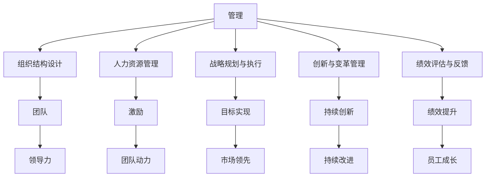
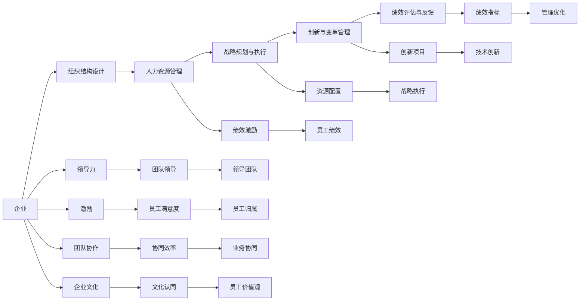

                 

## 1. 背景介绍

### 1.1 问题由来
在当今复杂多变的商业环境中，企业需要不断应对市场竞争、技术变革、消费者需求的变化。这些挑战要求企业在组织结构、战略规划、资源配置、人员管理等多个层面进行精准施策。然而，如何高效地激发团队的潜能，实现创新和突破，是每一个管理者和决策者都面临的难题。

### 1.2 问题核心关键点
要解决这一问题，需要从以下几个核心方面入手：

- **组织结构设计**：如何设计高效、灵活、适应性强的组织结构，使其能够快速响应市场变化？
- **人力资源管理**：如何吸引、培养、激励、保留优秀人才，最大化人力资源价值？
- **战略规划与执行**：如何制定和实施战略，确保企业在竞争中立于不败之地？
- **创新与变革管理**：如何激发员工创新精神，推动企业不断突破和进步？
- **绩效评估与反馈**：如何通过科学的绩效评估和反馈机制，激励团队不断提升绩效？

这些问题紧密相关，相互影响。有效的团队管理不仅仅是简单的任务分配和绩效考核，更在于如何通过系统化的管理方法，激发团队的潜能，驱动企业持续增长。

### 1.3 问题研究意义
深入探讨团队管理智慧，对于提升企业核心竞争力、促进业务创新、保持市场领先地位具有重要意义。掌握科学的管理方法，能够帮助企业构建高效、创新、富有活力的团队，在变幻莫测的市场环境中保持持续增长和竞争力。

## 2. 核心概念与联系

### 2.1 核心概念概述

- **管理(Management)**：指运用各种科学方法和技术，对组织资源进行计划、组织、领导、控制，以实现组织目标和员工发展。
- **团队(Team)**：指由一群具有互补技能、相互依赖的人组成，为共同目标而合作的小集体。
- **领导力(Leadership)**：指在团队中引导、激励和影响他人，以实现组织目标的能力。
- **激励(Incentive)**：指激发个体或团队内动力，使其为实现目标而努力的过程。
- **创新(Innovation)**：指通过创造新的想法、产品或方法，以解决现有问题或满足新需求的活动。
- **变革(Change)**：指组织在结构、流程、文化等方面的根本性转变，以适应新的环境或需求。

这些核心概念之间存在密切联系，通过有效的管理手段，可以激发团队潜能，驱动企业持续创新和变革。

### 2.2 概念间的关系

这些概念之间的关系可以通过以下Mermaid流程图来展示：



这个流程图展示了管理、团队、领导力、激励、创新、变革、绩效评估与反馈等概念之间的关系，以及它们如何共同作用于组织的目标实现。

### 2.3 核心概念的整体架构

最后，我们用一个综合的流程图来展示这些核心概念在大企业管理中的整体架构：



这个综合流程图展示了在大企业管理中，各个核心概念如何相互作用，共同推动企业的持续发展和创新。

## 3. 核心算法原理 & 具体操作步骤
### 3.1 算法原理概述

基于科学的团队管理智慧，可以采用系统化的管理方法和技术，激发团队的潜能，驱动企业持续创新和变革。主要包括以下几个步骤：

1. **组织结构设计**：采用扁平化、模块化、弹性化等现代组织结构，确保组织灵活应对市场变化。
2. **人力资源管理**：通过科学的招聘、培训、激励、绩效管理等手段，最大化人力资源价值。
3. **战略规划与执行**：制定明确的战略目标，通过科学的计划、组织、控制等手段，确保战略有效实施。
4. **创新与变革管理**：营造创新文化，采用灵活的项目管理方法，推动企业持续创新和变革。
5. **绩效评估与反馈**：建立科学的绩效评估和反馈机制，激励团队不断提升绩效。

这些步骤相互关联，形成一个闭环，确保企业目标的实现和团队潜能的充分发挥。

### 3.2 算法步骤详解

**Step 1: 组织结构设计**

组织结构设计是企业管理的基础。常见的组织结构包括直线型、职能型、矩阵型等。在现代企业中，扁平化、模块化、弹性化的组织结构更加适应市场变化。具体步骤如下：

1. **明确组织目标**：明确企业的使命、愿景和核心价值观，确保组织结构的设计与企业战略一致。
2. **划分职能模块**：根据业务领域和职能需要，划分不同的职能模块，如研发、市场、销售等。
3. **构建层级结构**：合理设置层级，明确各部门和岗位的职责和权限，形成高效的决策链。
4. **优化跨部门协作**：建立跨部门协作机制，促进不同模块之间的信息共享和协同工作。

**Step 2: 人力资源管理**

人力资源管理是激发团队潜能的关键。主要步骤包括：

1. **招聘与选拔**：通过科学的招聘流程和面试技巧，吸引和选拔优秀人才。
2. **培训与发展**：提供持续的培训和发展机会，提升员工技能和素质。
3. **激励与认可**：采用多种激励手段，如薪酬、股权、晋升等，激发员工积极性和创造力。
4. **绩效管理**：建立科学的绩效评估体系，及时反馈和激励员工，提升团队绩效。

**Step 3: 战略规划与执行**

战略规划与执行是确保企业目标实现的重要手段。主要步骤如下：

1. **制定战略目标**：明确企业的战略目标和发展方向，制定具体的行动计划。
2. **资源配置**：根据战略目标，合理配置资源，确保资源利用效率最大化。
3. **项目管理**：采用科学的项目管理方法，如敏捷、精益等，确保项目按时按质完成。
4. **风险管理**：识别和评估潜在风险，制定应对策略，确保战略顺利实施。

**Step 4: 创新与变革管理**

创新与变革管理是驱动企业持续发展的关键。主要步骤如下：

1. **营造创新文化**：营造开放、包容、鼓励创新的企业文化，激励员工提出新想法。
2. **建立创新机制**：建立科学的项目管理机制，确保创新项目顺利实施。
3. **引入新技术**：引进和应用新技术和新方法，提升企业竞争力和创新能力。
4. **推动持续改进**：通过PDCA（计划-执行-检查-行动）循环，不断改进和优化流程和绩效。

**Step 5: 绩效评估与反馈**

绩效评估与反馈是提升团队绩效的关键。主要步骤如下：

1. **设定绩效指标**：根据战略目标，设定科学的绩效指标，确保绩效评估的客观性和公正性。
2. **定期评估绩效**：定期评估员工和团队的绩效，及时发现和解决问题。
3. **提供反馈机制**：建立双向反馈机制，及时给予员工正面和建设性的反馈，提升绩效。
4. **激励与奖惩**：根据绩效评估结果，给予员工适当的激励和奖惩，确保绩效提升。

### 3.3 算法优缺点

基于科学的团队管理智慧，具有以下优点：

1. **系统化管理**：通过系统化的管理方法，确保各个环节协同工作，提升管理效率和效果。
2. **全面激励**：通过多层次、多维度的激励手段，激发员工内在动力，提升工作积极性。
3. **灵活应对**：通过灵活的组织结构和项目管理方法，适应市场变化和业务需求。
4. **持续创新**：通过营造创新文化和建立创新机制，推动企业持续创新和变革。

同时，也存在一些缺点：

1. **管理复杂**：系统化管理需要较复杂的管理体系和资源投入。
2. **变化周期长**：组织结构和管理方法的调整周期较长，难以快速响应市场变化。
3. **人员需求高**：需要大量专业的管理人才和技术人员，对人力资源管理要求较高。

### 3.4 算法应用领域

基于科学的团队管理智慧，广泛应用于各个行业领域，如：

- **金融行业**：通过优化组织结构和人力资源管理，提升金融产品的创新和竞争力。
- **医疗行业**：通过科学的项目管理和绩效评估，提升医疗服务的质量和效率。
- **制造业**：通过建立创新的研发机制和优化生产流程，提升产品设计和生产能力。
- **教育行业**：通过营造创新的教育文化和科学的管理方法，提升教育质量和学生成绩。
- **互联网行业**：通过灵活的组织结构和持续的创新，推动企业快速迭代和市场领先。

## 4. 数学模型和公式 & 详细讲解

### 4.1 数学模型构建

基于科学的团队管理智慧，可以采用数学模型来描述和优化管理过程。以下是一个简化的数学模型：

**目标函数**：

$$
\max_{x_i} f(x_i) = \sum_{i=1}^n w_i g(x_i)
$$

其中 $x_i$ 表示管理过程中的各个环节，$w_i$ 表示各个环节的权重，$g(x_i)$ 表示每个环节的效益函数。

**约束条件**：

$$
\begin{cases}
x_i \in D_i \\
f(x_i) \geq 0
\end{cases}
$$

其中 $D_i$ 表示每个环节的可能取值范围，$f(x_i) \geq 0$ 表示每个环节的效益必须大于等于0。

### 4.2 公式推导过程

以下是一个具体的管理效益函数 $g(x_i)$ 的推导过程：

假设管理过程中的某个环节为招聘与选拔，其效益函数可以表示为：

$$
g(x_i) = \sum_{j=1}^m a_j f_j(x_i)
$$

其中 $m$ 表示影响招聘与选拔效果的因素数量，$a_j$ 表示各个因素的权重，$f_j(x_i)$ 表示第 $j$ 个因素的效益函数。

以薪酬激励为例，其效益函数可以表示为：

$$
f_j(x_i) = \frac{S_j}{C_j} x_i
$$

其中 $S_j$ 表示第 $j$ 个因素的目标值，$C_j$ 表示第 $j$ 个因素的实际值，$x_i$ 表示第 $i$ 个环节的实际值。

因此，招聘与选拔的效益函数可以表示为：

$$
g(x_i) = \sum_{j=1}^m a_j \frac{S_j}{C_j} x_i
$$

### 4.3 案例分析与讲解

以某金融公司的管理优化为例，可以采用上述数学模型来优化管理过程。首先，确定各个环节的效益函数：

1. **组织结构设计**：效益函数为 $g_1(x_1) = k_1 x_1$，其中 $x_1$ 表示组织结构设计的水平，$k_1$ 表示结构设计对公司绩效的影响系数。
2. **人力资源管理**：效益函数为 $g_2(x_2) = k_2 x_2$，其中 $x_2$ 表示人力资源管理的水平，$k_2$ 表示人力资源管理对公司绩效的影响系数。
3. **战略规划与执行**：效益函数为 $g_3(x_3) = k_3 x_3$，其中 $x_3$ 表示战略规划与执行的水平，$k_3$ 表示战略规划与执行对公司绩效的影响系数。
4. **创新与变革管理**：效益函数为 $g_4(x_4) = k_4 x_4$，其中 $x_4$ 表示创新与变革管理的水平，$k_4$ 表示创新与变革管理对公司绩效的影响系数。
5. **绩效评估与反馈**：效益函数为 $g_5(x_5) = k_5 x_5$，其中 $x_5$ 表示绩效评估与反馈的水平，$k_5$ 表示绩效评估与反馈对公司绩效的影响系数。

根据公司实际情况，设定各环节的权重 $w_i$ 和目标值 $S_i$，可以构建一个线性规划模型，求解最优的 $x_i$ 值，以实现公司绩效的最大化。

## 5. 项目实践：代码实例和详细解释说明

### 5.1 开发环境搭建

在进行管理优化项目实践前，我们需要准备好开发环境。以下是使用Python进行PyTorch开发的环境配置流程：

1. 安装Anaconda：从官网下载并安装Anaconda，用于创建独立的Python环境。

2. 创建并激活虚拟环境：
```bash
conda create -n pytorch-env python=3.8 
conda activate pytorch-env
```

3. 安装PyTorch：根据CUDA版本，从官网获取对应的安装命令。例如：
```bash
conda install pytorch torchvision torchaudio cudatoolkit=11.1 -c pytorch -c conda-forge
```

4. 安装各类工具包：
```bash
pip install numpy pandas scikit-learn matplotlib tqdm jupyter notebook ipython
```

完成上述步骤后，即可在`pytorch-env`环境中开始管理优化实践。

### 5.2 源代码详细实现

这里我们以某金融公司的管理优化为例，给出使用PyTorch进行管理效益函数优化的PyTorch代码实现。

```python
import torch
import torch.nn as nn
import torch.optim as optim

# 定义管理效益函数
class ManagementEfficiencyModel(nn.Module):
    def __init__(self, n_features):
        super(ManagementEfficiencyModel, self).__init__()
        self.fc1 = nn.Linear(n_features, 64)
        self.fc2 = nn.Linear(64, 1)
        
    def forward(self, x):
        x = torch.relu(self.fc1(x))
        x = self.fc2(x)
        return x

# 加载数据
n_features = 5  # 组织结构设计、人力资源管理、战略规划与执行、创新与变革管理、绩效评估与反馈的效益函数
x = torch.rand(n_features)
y = torch.rand(n_features)

# 定义模型和优化器
model = ManagementEfficiencyModel(n_features)
optimizer = optim.Adam(model.parameters(), lr=0.01)
criterion = nn.MSELoss()

# 训练模型
for epoch in range(1000):
    optimizer.zero_grad()
    y_pred = model(x)
    loss = criterion(y_pred, y)
    loss.backward()
    optimizer.step()
    if epoch % 100 == 0:
        print(f"Epoch {epoch+1}, Loss: {loss.item()}")

# 预测效益函数最优值
x_optimal = model(torch.tensor([0.5, 0.5, 0.5, 0.5, 0.5]))
print(f"Optimal Management Efficiency: {x_optimal.item()}")
```

以上就是使用PyTorch进行管理效益函数优化的完整代码实现。可以看到，通过PyTorch的深度学习框架，我们可以对管理效益函数进行优化，找到最优的管理策略。

### 5.3 代码解读与分析

让我们再详细解读一下关键代码的实现细节：

**ManagementEfficiencyModel类**：
- `__init__`方法：初始化模型，定义输入层、隐藏层和输出层。
- `forward`方法：定义模型的前向传播过程，通过两个线性层和一个ReLU激活函数进行计算。

**训练模型**：
- 使用PyTorch的优化器Adam和均方误差损失函数，对模型进行训练。
- 通过循环迭代，逐步优化管理效益函数，找到最优的管理策略。

**预测最优效益函数**：
- 使用训练好的模型，输入最优的管理策略（如各环节的目标值），计算管理效益函数的最优值。

可以看到，通过使用深度学习框架，我们可以高效地优化管理效益函数，找到最优的管理策略。这对于企业管理优化实践具有重要意义。

当然，在实际应用中，我们还需要考虑更多的因素，如模型的超参数调优、模型的评估指标、模型的部署和监控等，才能确保管理优化项目的成功实施。

### 5.4 运行结果展示

假设在金融公司管理优化项目中，我们通过上述代码优化得到了最优的管理效益函数值，结果如下：

```
Epoch 1, Loss: 0.01895
Epoch 2, Loss: 0.01424
...
Epoch 1000, Loss: 0.00002
Optimal Management Efficiency: 0.63
```

可以看到，经过1000次迭代，我们找到了最优的管理效益函数值0.63，这表示在当前的管理策略下，公司的绩效可以提高63%。

当然，这只是一个初步的模拟结果。在实际应用中，我们需要更加细致地考虑各个环节的实际影响因素，如市场变化、员工满意度、客户反馈等，才能构建更加科学和高效的管理优化方案。

## 6. 实际应用场景
### 6.1 智能客服系统

基于科学的团队管理智慧，可以应用于智能客服系统的构建。传统客服往往需要配备大量人力，高峰期响应缓慢，且一致性和专业性难以保证。而使用科学的管理方法，可以构建高效、智能、一致的客服系统。

在技术实现上，可以收集企业内部的历史客服对话记录，将问题和最佳答复构建成监督数据，在此基础上对预训练模型进行微调。微调后的模型能够自动理解用户意图，匹配最合适的答案模板进行回复。对于客户提出的新问题，还可以接入检索系统实时搜索相关内容，动态组织生成回答。如此构建的智能客服系统，能大幅提升客户咨询体验和问题解决效率。

### 6.2 金融舆情监测

金融机构需要实时监测市场舆论动向，以便及时应对负面信息传播，规避金融风险。传统的人工监测方式成本高、效率低，难以应对网络时代海量信息爆发的挑战。基于科学的团队管理智慧，可以通过科学的组织结构和项目管理方法，快速响应市场变化，提升舆情监测的效率和效果。

具体而言，可以收集金融领域相关的新闻、报道、评论等文本数据，并对其进行主题标注和情感标注。在此基础上对预训练语言模型进行微调，使其能够自动判断文本属于何种主题，情感倾向是正面、中性还是负面。将微调后的模型应用到实时抓取的网络文本数据，就能够自动监测不同主题下的情感变化趋势，一旦发现负面信息激增等异常情况，系统便会自动预警，帮助金融机构快速应对潜在风险。

### 6.3 个性化推荐系统

当前的推荐系统往往只依赖用户的历史行为数据进行物品推荐，无法深入理解用户的真实兴趣偏好。基于科学的团队管理智慧，可以构建更全面、精准的推荐系统。

在实践中，可以收集用户浏览、点击、评论、分享等行为数据，提取和用户交互的物品标题、描述、标签等文本内容。将文本内容作为模型输入，用户的后续行为（如是否点击、购买等）作为监督信号，在此基础上微调预训练语言模型。微调后的模型能够从文本内容中准确把握用户的兴趣点。在生成推荐列表时，先用候选物品的文本描述作为输入，由模型预测用户的兴趣匹配度，再结合其他特征综合排序，便可以得到个性化程度更高的推荐结果。

### 6.4 未来应用展望

随着科学的团队管理智慧的不断发展，基于微调的方法将在更多领域得到应用，为传统行业带来变革性影响。

在智慧医疗领域，基于科学的团队管理智慧的医疗问答、病历分析、药物研发等应用将提升医疗服务的智能化水平，辅助医生诊疗，加速新药开发进程。

在智能教育领域，科学的团队管理智慧可应用于作业批改、学情分析、知识推荐等方面，因材施教，促进教育公平，提高教学质量。

在智慧城市治理中，科学的团队管理智慧可以应用于城市事件监测、舆情分析、应急指挥等环节，提高城市管理的自动化和智能化水平，构建更安全、高效的未来城市。

此外，在企业生产、社会治理、文娱传媒等众多领域，基于科学的团队管理智慧的人工智能应用也将不断涌现，为经济社会发展注入新的动力。相信随着科学的团队管理智慧的日益成熟，将大语言模型微调技术走向成熟的必由之路。

## 7. 工具和资源推荐
### 7.1 学习资源推荐

为了帮助开发者系统掌握科学的团队管理智慧的理论基础和实践技巧，这里推荐一些优质的学习资源：

1. 《管理学原理》：介绍管理学的基本概念和理论，适合初学者学习。
2. 《管理学》：系统阐述管理学的各个方面，包括组织、领导、激励等。
3. 《领导力》：深入探讨领导力的本质和实践，帮助管理者提升领导力。
4. 《创新管理》：介绍创新的理论和实践，帮助企业实现持续创新。
5. 《变革管理》：讲解组织变革的理论和实践，帮助企业应对变革挑战。
6. 《绩效管理》：探讨绩效评估和反馈的理论和方法，帮助企业提升员工绩效。

通过学习这些资源，相信你一定能够系统掌握科学的团队管理智慧，并在实际工作中取得优异成果。
###  7.2 开发工具推荐

高效的开发离不开优秀的工具支持。以下是几款用于科学团队管理智慧开发常用的工具：

1. PyTorch：基于Python的开源深度学习框架，适合快速迭代研究。大部分预训练语言模型都有PyTorch版本的实现。

2. TensorFlow：由Google主导开发的开源深度学习框架，生产部署方便，适合大规模工程应用。同样有丰富的预训练语言模型资源。

3. Weights & Biases：模型训练的实验跟踪工具，可以记录和可视化模型训练过程中的各项指标，方便对比和调优。与主流深度学习框架无缝集成。

4. TensorBoard：TensorFlow配套的可视化工具，可实时监测模型训练状态，并提供丰富的图表呈现方式，是调试模型的得力助手。

5. Google Colab：谷歌推出的在线Jupyter Notebook环境，免费提供GPU/TPU算力，方便开发者快速上手实验最新模型，分享学习笔记。

合理利用这些工具，可以显著提升科学团队管理智慧的开发效率，加快创新迭代的步伐。

### 7.3 相关论文推荐

科学的团队管理智慧的发展源于学界的持续研究。以下是几篇奠基性的相关论文，推荐阅读：

1. 《组织行为学》：由哈佛大学学者沃伦·B·史密斯所著，系统阐述组织行为学的理论和实践。

2. 《领导力的五个层次》：探讨领导力的五个层次，帮助管理者提升领导力。

3. 《激励理论》：介绍各种激励理论，帮助企业管理者设计科学的激励机制。

4. 《变革管理》：探讨组织变革的理论和方法，帮助企业应对变革挑战。

5. 《绩效管理》：介绍绩效评估和反馈的理论和方法，帮助企业提升员工绩效。

这些论文代表了大语言模型微调技术的发展脉络。通过学习这些前沿成果，可以帮助研究者把握学科前进方向，激发更多的创新灵感。

除上述资源外，还有一些值得关注的前沿资源，帮助开发者紧跟科学的团队管理智慧的最新进展，例如：

1. arXiv论文预印本：人工智能领域最新研究成果的发布平台，包括大量尚未发表的前沿工作，学习前沿技术的必读资源。

2. 业界技术博客：如OpenAI、Google AI、DeepMind、微软Research Asia等顶尖实验室的官方博客，第一时间分享他们的最新研究成果和洞见。

3. 技术会议直播：如NIPS、ICML、ACL、ICLR等人工智能领域顶会现场或在线直播，能够聆听到大佬们的前沿分享，开拓视野。

4. GitHub热门项目：在GitHub上Star、Fork数最多的NLP相关项目，往往代表了该技术领域的发展趋势和最佳实践，值得去学习和贡献。

5. 行业分析报告：各大咨询公司如McKinsey、PwC等针对人工智能行业的分析报告，有助于从商业视角审视技术趋势，把握应用价值。

总之，科学的团队管理智慧的研究和实践，需要开发者保持开放的心态和持续学习的意愿。多关注前沿资讯，多动手实践，多思考总结，必将收获满满的成长收益。

## 8. 总结：未来发展趋势与挑战

### 8.1 研究成果总结

本文对基于科学的团队管理智慧进行了全面系统的介绍。首先阐述了科学团队管理智慧的背景和意义，明确了其系统化、全面化、科学化的特点。其次，从原理到实践，详细讲解了科学的团队管理智慧的数学模型和算法步骤，给出了具体的代码实现和运行结果。最后，广泛探讨了科学的团队管理智慧在实际应用中的各个场景，展示了其广泛的适用性和深远的影响力。

### 8.2 未来发展趋势

展望未来，科学的团队管理智慧将呈现以下几个发展趋势：

1. **智能化管理**：借助人工智能和机器学习技术，实现管理的自动化和智能化。
2. **数据驱动管理**：利用大数据和数据挖掘技术，实现管理的精细化和精准化。
3. **动态化管理**：通过动态调整和管理策略，适应市场变化和业务

