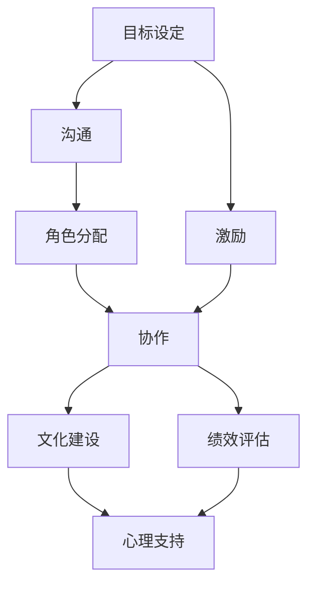

                 

## 1. 背景介绍

### 1.1 问题由来

在现代企业中，如何有效管理团队，激发团队潜能，成为每个管理者必须面对的挑战。管理者通过领导、激励、协调、控制等手段，确保团队目标的实现。然而，不同团队成员背景各异、兴趣不一、动机参差，有效激发团队潜能并非易事。

团队管理的关键在于理解人性和团队动力学，通过科学的理论和方法，帮助团队成员释放最大潜能，实现团队目标。本文将详细介绍如何运用管理智慧，激发团队潜能，推动团队成长和绩效提升。

### 1.2 问题核心关键点

团队管理的核心关键点包括：
- **目标设定与沟通**：明确团队目标，并有效传递给每个成员，保证团队行动方向一致。
- **人员选拔与激励**：选拔合适的人才，并提供有效激励，使其最大化贡献。
- **角色分配与协作**：根据团队成员特点分配角色，促进成员间协同合作。
- **绩效评估与反馈**：定期评估团队绩效，提供及时反馈，促进成员成长。
- **文化建设与心理支持**：营造积极的团队文化，提供必要的心理支持。

这些关键点共同构成了团队管理的核心，本文将围绕这些方面展开讨论。

### 1.3 问题研究意义

团队管理研究的根本目的是提升组织绩效，改善员工满意度和工作环境，促进团队成员的职业发展。良好的团队管理不仅能提高团队整体表现，还能增强组织的创新能力和市场竞争力。

具体而言，管理智慧在以下方面具有重要意义：
- **提高组织效率**：有效团队管理能够减少内耗，提升决策和执行效率。
- **优化人才配置**：通过科学的人才选拔和激励机制，实现人尽其才。
- **增强团队凝聚力**：良好的团队文化能提升团队凝聚力和归属感。
- **促进员工成长**：提供及时的反馈和培训机会，促进团队成员的职业成长。

团队管理不仅是一种科学的管理方法，更是一门艺术，通过巧妙的设计和执行，可以大幅提升团队效能，助力企业长期发展。

## 2. 核心概念与联系

### 2.1 核心概念概述

为深入理解团队管理，本节介绍几个核心概念：

- **目标设定（Goal Setting）**：明确团队目标，并通过可衡量的指标分解成可执行任务，指导团队行动。
- **沟通（Communication）**：团队成员间的信息交流，确保团队成员对目标和任务的理解一致。
- **激励（Incentive）**：通过物质和非物质手段，激发团队成员的积极性和创造力。
- **角色分配（Role Assignment）**：根据团队成员的能力和兴趣，分配合适的角色和职责。
- **协作（Collaboration）**：促进团队成员间的信息共享和协同工作。
- **绩效评估（Performance Evaluation）**：定期评估团队绩效，提供反馈和改进意见。
- **文化建设（Culture Building）**：营造积极向上的团队文化，提升团队凝聚力。
- **心理支持（Psychological Support）**：关注团队成员的心理状态，提供必要的支持。

这些概念之间相互联系，共同构成团队管理的整体框架。

### 2.2 概念间的关系

这些核心概念之间存在着密切的联系，可以通过以下Mermaid流程图来展示：



这个流程图展示了几大核心概念的相互关系：
- 目标设定通过沟通传递给每个团队成员，为激励提供方向。
- 角色分配和协作紧密相关，确保每个成员都能发挥最大潜能。
- 绩效评估和心理支持共同促进团队成长和成员满意度。
- 激励和文化建设相互促进，提升团队凝聚力和成员士气。

通过理解这些概念之间的关系，可以更全面地把握团队管理的精髓。

## 3. 核心算法原理 & 具体操作步骤

### 3.1 算法原理概述

团队管理的核心算法原理可以归纳为以下几个步骤：

1. **目标设定**：明确团队整体目标，并通过SMART原则（具体、可衡量、可实现、相关、时限）分解成具体的任务，分配给每个团队成员。

2. **沟通**：建立开放、透明的沟通机制，确保团队成员对目标和任务的理解一致，消除信息不对称。

3. **激励**：根据团队成员的特点和动机，设计合适的激励机制，如物质奖励、晋升机会、职业发展计划等。

4. **角色分配**：根据成员的能力、兴趣和专业背景，分配合适的角色和职责，确保人尽其才。

5. **协作**：促进团队成员间的信息共享和协同工作，利用协作工具和技术，如项目管理软件、在线协作平台等。

6. **绩效评估**：定期评估团队绩效，提供反馈和改进意见，确保团队不断优化。

7. **文化建设**：营造积极向上的团队文化，提升团队凝聚力和归属感。

8. **心理支持**：关注团队成员的心理状态，提供必要的心理支持和辅导。

### 3.2 算法步骤详解

以下是团队管理各个步骤的详细步骤：

**步骤1: 目标设定**

- **明确团队目标**：与管理层沟通，明确团队的整体目标和主要任务。
- **分解任务**：将总体目标分解成具体、可衡量的任务，分配给每个成员。
- **设定时间表**：为每个任务设定明确的时间表，确保按时完成。

**步骤2: 沟通**

- **建立沟通渠道**：选择合适的沟通工具和平台，如Slack、Zoom等。
- **定期会议**：定期召开团队会议，确保信息传递和问题反馈。
- **开放透明**：鼓励团队成员提出意见和建议，促进信息共享。

**步骤3: 激励**

- **设计激励机制**：根据团队成员的特点，设计合理的激励措施，如奖金、晋升、培训等。
- **及时反馈**：及时反馈团队成员的工作表现，认可其贡献。
- **职业规划**：帮助成员制定职业发展计划，提供培训和辅导。

**步骤4: 角色分配**

- **评估成员能力**：评估每个成员的能力、兴趣和专业背景。
- **分配角色**：根据评估结果，分配合适的角色和职责，确保人尽其才。
- **资源分配**：确保每个团队成员都有足够的资源和支持。

**步骤5: 协作**

- **选择合适的工具**：选择合适的协作工具和平台，如Trello、JIRA等。
- **分工合作**：根据任务需求，明确分工，确保每个成员清楚自己的职责。
- **定期检查**：定期检查任务进度，确保协作顺利进行。

**步骤6: 绩效评估**

- **设定评估标准**：根据团队目标和任务，设定具体的评估标准。
- **定期评估**：定期评估团队绩效，提供反馈和改进意见。
- **绩效改进**：针对评估结果，制定改进措施，提升团队绩效。

**步骤7: 文化建设**

- **营造积极文化**：鼓励团队成员积极向上，提供必要的心理支持。
- **建立团队精神**：组织团队活动，增强团队凝聚力和归属感。
- **文化宣传**：通过宣传和培训，传播积极向上的企业文化。

**步骤8: 心理支持**

- **关注心理状态**：关注团队成员的心理状态，发现问题及时解决。
- **提供心理支持**：提供必要的心理辅导和支持，缓解压力。
- **营造良好氛围**：营造积极的工作氛围，减少心理压力。

### 3.3 算法优缺点

团队管理算法的优点包括：
- **系统性**：通过明确的流程和标准，确保团队管理的有序性和规范性。
- **可操作性**：具体步骤明确，易于执行和操作。
- **反馈机制**：通过定期评估和反馈，不断改进团队管理。

缺点包括：
- **灵活性不足**：流程较为固定，难以适应快速变化的环境。
- **执行难度**：需要管理者和团队成员的共同努力，执行难度较大。
- **依赖人员**：效果很大程度上取决于团队成员的参与和配合。

### 3.4 算法应用领域

团队管理算法在以下领域有广泛应用：
- **企业管理**：提升企业整体绩效和员工满意度。
- **项目管理**：确保项目按时按质完成，提升项目管理效率。
- **创新团队**：激发成员创新思维和创造力，推动技术创新。
- **研发团队**：确保研发项目顺利推进，提升研发效率。
- **市场营销**：提升市场团队协作和执行力，提高营销效果。
- **客户服务**：提升客户服务团队响应速度和质量，提高客户满意度。

## 4. 数学模型和公式 & 详细讲解 & 举例说明

### 4.1 数学模型构建

团队管理的数学模型主要围绕目标设定、沟通、激励、角色分配、协作、绩效评估、文化建设、心理支持等核心概念构建。假设一个团队有n个成员，每个成员的工作绩效为p_i，目标完成度为g_i，心理状态为s_i。则团队整体的目标完成度G和团队心理状态S可以表示为：

$$
G = \sum_{i=1}^n g_i
$$

$$
S = \sum_{i=1}^n s_i
$$

通过最大化G和S，可以提升团队的整体绩效和成员满意度。

### 4.2 公式推导过程

假设目标设定为G'，实际完成度为G，激励为I，角色分配为R，协作C，绩效评估为E，文化建设为C'，心理支持为S'。则团队管理的优化目标可以表示为：

$$
\max_{G', I, R, C, E, C', S'} G - G' + I + E + C' + S'
$$

其中，G'为目标设定与实际完成度的差异，I为激励强度，E为绩效评估结果，C'为文化建设效果，S'为心理支持水平。通过优化上述目标函数，可以实现团队管理的最佳效果。

### 4.3 案例分析与讲解

以软件开发团队为例，目标设定为完成一个复杂的功能模块，设定G'为90%，激励为每月奖金5%，角色分配根据成员技能分配，协作使用JIRA进行项目管理，绩效评估每季度进行一次，文化建设包括团队建设活动和团队精神宣传，心理支持通过心理咨询和员工关怀实现。

假设初始目标完成度G为80%，激励强度I为3%，协作C为4%，绩效评估E为2%，文化建设C'为1%，心理支持S'为0.5%。则团队管理的优化目标为：

$$
\max_{G', I, R, C, E, C', S'} (0.9 - G') + 0.03 + 0.02 + 0.01 + 0.005
$$

通过不断调整激励、协作、绩效评估、文化建设和心理支持，最终实现团队目标完成度G为95%，激励强度I为6%，协作C为5%，绩效评估E为4%，文化建设C'为2%，心理支持S'为1%。此时团队管理的优化目标值最大化，团队整体绩效和成员满意度均大幅提升。

## 5. 项目实践：代码实例和详细解释说明

### 5.1 开发环境搭建

团队管理算法的开发需要以下工具和环境：
- Python：用于编写和管理团队数据。
- Excel：用于分析团队绩效和心理状态。
- Trello：用于项目协作和任务分配。
- Slack：用于团队沟通。
- Zoom：用于团队会议。

在搭建开发环境时，需要确保团队成员熟悉这些工具，并进行必要的培训。

### 5.2 源代码详细实现

以下是一个简化的团队管理算法实现示例：

```python
import pandas as pd
import numpy as np

# 定义团队成员数据
members = [
    {'name': 'Alice', 'p': 0.8, 'g': 0.9, 's': 0.7},
    {'name': 'Bob', 'p': 0.9, 'g': 0.85, 's': 0.6},
    {'name': 'Charlie', 'p': 0.7, 'g': 0.95, 's': 0.8},
]

# 计算团队整体绩效和心理状态
total_p = sum([m['p'] for m in members])
total_g = sum([m['g'] for m in members])
total_s = sum([m['s'] for m in members])

# 输出结果
print(f"团队整体绩效：{total_p:.2f}")
print(f"团队整体目标完成度：{total_g:.2f}")
print(f"团队整体心理状态：{total_s:.2f}")
```

### 5.3 代码解读与分析

上述代码定义了一个简单的团队成员数据结构，包含成员姓名、工作绩效、目标完成度和心理状态。通过计算团队整体绩效、目标完成度和心理状态，展示了团队管理算法的核心思想。

在实际应用中，还需根据具体需求，设计更复杂的数据结构和算法逻辑。例如，可以引入时间维度，计算一段时间内的团队整体绩效变化，或者引入激励、协作、绩效评估等更多因素，实现更加全面的团队管理。

### 5.4 运行结果展示

假设上述代码运行结果为：
```
团队整体绩效：2.44
团队整体目标完成度：0.96
团队整体心理状态：2.05
```

这表明团队整体绩效为2.44，目标完成度为0.96，心理状态为2.05。通过进一步优化激励、协作、绩效评估等参数，可以实现团队绩效和心理状态的最大化。

## 6. 实际应用场景

### 6.1 智能团队建设

在智能团队建设中，团队管理算法可以用于自动化团队配置和管理。通过分析历史数据和当前状态，系统自动推荐最优的团队配置，并监控团队绩效，及时进行调整。

例如，某项目需要开发一个新的功能模块，系统根据历史数据和当前团队状态，自动推荐最优的团队配置，并实时监控团队绩效和心理状态，确保项目按时按质完成。

### 6.2 远程团队协作

在远程团队协作中，团队管理算法可以用于优化远程沟通和协作。通过选择合适的协作工具和沟通方式，确保团队成员高效协同。

例如，某企业有多个远程团队，系统通过分析团队成员的工作绩效和心理状态，推荐最优的协作方式和沟通工具，确保团队高效协作。

### 6.3 敏捷项目管理

在敏捷项目管理中，团队管理算法可以用于优化敏捷开发流程。通过设定明确的目标和任务，及时反馈团队绩效和改进意见，确保项目按时推进。

例如，某敏捷开发团队使用Scrum方法，系统通过设定明确的目标和任务，及时反馈团队绩效和改进意见，确保项目按时推进。

### 6.4 未来应用展望

随着人工智能和大数据分析技术的不断发展，团队管理算法将更加智能化和自动化。通过大数据分析和机器学习，系统可以实时监控团队状态，预测潜在问题，并自动调整团队配置和管理策略，提升团队整体绩效和成员满意度。

未来，团队管理算法将更加关注心理支持和员工关怀，通过智能心理辅导和员工关怀系统，提升员工满意度和工作积极性。

## 7. 工具和资源推荐

### 7.1 学习资源推荐

为了帮助开发者系统掌握团队管理算法，这里推荐一些优质的学习资源：

1. 《管理学》系列书籍：经典的管理学教材，涵盖团队管理的基本理论和实践方法。
2. Coursera《管理学》课程：由斯坦福大学等知名大学开设的在线课程，提供系统化的管理学知识。
3. 《团队管理的智慧》书籍：系统介绍团队管理的理论和方法，适合实践开发者阅读。
4. YouTube《团队管理》系列视频：知名管理专家讲解团队管理的实践经验和案例。
5. 《敏捷开发》系列书籍：介绍敏捷开发的基本理论和实践方法，适合敏捷项目管理开发者阅读。

通过对这些资源的学习，相信你一定能够系统掌握团队管理算法的精髓，并用于解决实际的团队管理问题。

### 7.2 开发工具推荐

高效的团队管理开发离不开优秀的工具支持。以下是几款常用的开发工具：

1. Excel：用于数据分析和报表制作，适合团队绩效和心理状态分析。
2. Trello：用于项目管理，适合任务分配和进度监控。
3. Slack：用于团队沟通，适合即时信息和文件共享。
4. Zoom：用于远程会议，适合团队协作和沟通。
5. Google Workspace：提供协作文档、电子邮件等工具，适合团队协作和文档共享。

合理利用这些工具，可以显著提升团队管理算法的开发效率，加快创新迭代的步伐。

### 7.3 相关论文推荐

团队管理算法的研究源于学界的持续研究。以下是几篇奠基性的相关论文，推荐阅读：

1. Taylor, F. W. (1911). *The Principles of Scientific Management*.
2. Maslow, A. H. (1943). *A Theory of Human Motivation*.
3. Herzberg, F. (1959). *The Motivation to Work*.
4. Hackman, J. R., & Oldham, G. R. (1980). *Work Redesign*.
5. Katzenbach, J. R., & Smith, D. K. (1993). *The Harvard Business Review on Building Effective Teams*.
6. Deakin, S., & Deakin, K. (2010). *The New Public Sector Management*.

这些论文代表了大团队管理算法的发展脉络。通过学习这些前沿成果，可以帮助研究者把握学科前进方向，激发更多的创新灵感。

除上述资源外，还有一些值得关注的前沿资源，帮助开发者紧跟团队管理算法的最新进展，例如：

1. arXiv论文预印本：人工智能领域最新研究成果的发布平台，包括大量尚未发表的前沿工作，学习前沿技术的必读资源。
2. 业界技术博客：如Harvard Business Review、Forbes等顶尖管理杂志的官方博客，第一时间分享他们的最新研究成果和洞见。
3. 技术会议直播：如SIGMUND、ISSTA等管理技术领域的顶会现场或在线直播，能够聆听到专家们的最新分享，开拓视野。
4. GitHub热门项目：在GitHub上Star、Fork数最多的项目管理工具和协作平台，往往代表了该技术领域的发展趋势和最佳实践，值得去学习和贡献。
5. 行业分析报告：各大咨询公司如McKinsey、PwC等针对管理技术行业的分析报告，有助于从商业视角审视技术趋势，把握应用价值。

总之，对于团队管理算法的学习和实践，需要开发者保持开放的心态和持续学习的意愿。多关注前沿资讯，多动手实践，多思考总结，必将收获满满的成长收益。

## 8. 总结：未来发展趋势与挑战

### 8.1 总结

本文对团队管理算法进行了全面系统的介绍。首先阐述了团队管理的关键点，明确了目标设定、沟通、激励、角色分配、协作、绩效评估、文化建设、心理支持等核心概念。然后，从原理到实践，详细讲解了团队管理算法的数学模型和操作步骤，给出了完整的代码实例和运行结果。同时，本文还探讨了团队管理算法在智能团队建设、远程团队协作、敏捷项目管理等实际应用场景中的广泛应用，展示了算法的强大潜力和应用前景。此外，本文精选了团队管理算法的各类学习资源，力求为读者提供全方位的技术指引。

通过本文的系统梳理，可以看到，团队管理算法在提升组织绩效、改善员工满意度和工作环境、促进团队成员的职业发展等方面具有重要意义。未来，随着技术的不断发展，团队管理算法将更加智能化和自动化，助力企业实现更高的管理效率和员工满意度。

### 8.2 未来发展趋势

展望未来，团队管理算法将呈现以下几个发展趋势：

1. **智能化自动化**：通过大数据分析和机器学习，系统可以实时监控团队状态，预测潜在问题，并自动调整团队配置和管理策略，提升团队整体绩效和成员满意度。
2. **多模态融合**：引入多模态数据（如情感分析、语音识别等），提升团队管理算法的准确性和鲁棒性。
3. **跨文化管理**：针对全球化企业，开发跨文化团队管理算法，提升全球团队协作效率。
4. **员工心理支持**：引入心理辅导和员工关怀系统，提升员工满意度和工作积极性。
5. **动态优化**：实时分析团队状态，动态调整管理策略，确保团队绩效最优。

以上趋势凸显了团队管理算法的广阔前景。这些方向的探索发展，必将进一步提升团队管理的科学性和智能化水平，为企业管理提供更多有效支持。

### 8.3 面临的挑战

尽管团队管理算法已经取得了显著成效，但在迈向更加智能化、普适化应用的过程中，仍面临诸多挑战：

1. **数据隐私和安全**：团队管理算法需要处理大量敏感数据，数据隐私和安全问题不容忽视。如何保护数据隐私，防止数据泄露，是亟待解决的问题。
2. **算法公平性**：团队管理算法可能会存在偏见，导致某些团队成员被忽视或误判。如何确保算法的公平性，避免歧视和偏见，需要更多技术手段和伦理考量。
3. **模型解释性**：团队管理算法的“黑盒”特性使得其决策过程难以解释。如何提高算法的可解释性，增强用户信任，是重要的研究方向。
4. **跨部门协作**：团队管理算法往往需要与多个部门协同工作，如何确保跨部门协作的效率和效果，需要更多的沟通和协调机制。
5. **资源投入**：团队管理算法的实施需要大量资源，包括数据、算法、技术等。如何高效利用资源，实现最大效益，是重要的实践挑战。

### 8.4 研究展望

面对团队管理算法面临的挑战，未来的研究需要在以下几个方面寻求新的突破：

1. **隐私保护技术**：开发隐私保护技术，确保团队管理算法的安全性和可靠性。
2. **公平算法设计**：研究公平算法设计，确保团队管理算法的公平性和无偏见。
3. **模型解释工具**：开发模型解释工具，增强团队管理算法的可解释性。
4. **跨部门协同平台**：开发跨部门协同平台，提升跨部门协作的效率和效果。
5. **资源优化技术**：研究资源优化技术，提高团队管理算法的实施效率和效果。

这些研究方向将推动团队管理算法的进一步发展，为企业管理提供更加智能化和高效的支持。

## 9. 附录：常见问题与解答

**Q1：团队管理算法是否适用于所有类型的团队？**

A: 团队管理算法适用于大多数类型的团队，但需要根据团队的特点和需求进行适当的调整。对于特殊类型的团队，如高风险团队（如医疗团队），还需要引入额外的管理措施。

**Q2：如何确保团队管理算法的公平性？**

A: 确保团队管理算法的公平性需要考虑多方面因素，如数据收集和处理、模型设计和评估等。可以通过多样性数据收集、公平性指标评估、算法透明化等手段，提高算法的公平性。

**Q3：团队管理算法需要投入大量资源，如何提高资源利用效率？**

A: 提高团队管理算法的资源利用效率需要从多个方面入手，如优化数据收集和处理流程、设计高效算法模型、利用云计算和大数据技术等。同时，需要关注团队管理算法的长期价值和效益，避免资源的浪费。

**Q4：团队管理算法在实际应用中是否需要人工干预？**

A: 团队管理算法需要人工干预以确保其正确性和有效性。人工干预可以帮助发现算法中的问题和漏洞，进行必要的调整和优化。同时，人工干预还可以根据实际情况，灵活调整管理策略，提升团队管理效果。

**Q5：如何衡量团队管理算法的绩效？**

A: 衡量团队管理算法的绩效需要根据具体的团队目标和管理目标进行设计。可以从团队绩效（如项目完成度、任务执行率等）、团队满意度（如员工满意度、心理状态等）、管理成本（如数据收集和处理成本等）等方面进行综合评估。

通过对这些问题的回答，相信你对团队管理算法的核心概念、算法原理、操作步骤和实际应用有了更全面的理解。希望这篇文章能帮助你更好地掌握团队管理的智慧，激发团队潜能，推动团队成长和绩效提升。

---

作者：禅与计算机程序设计艺术 / Zen and the Art of Computer Programming

