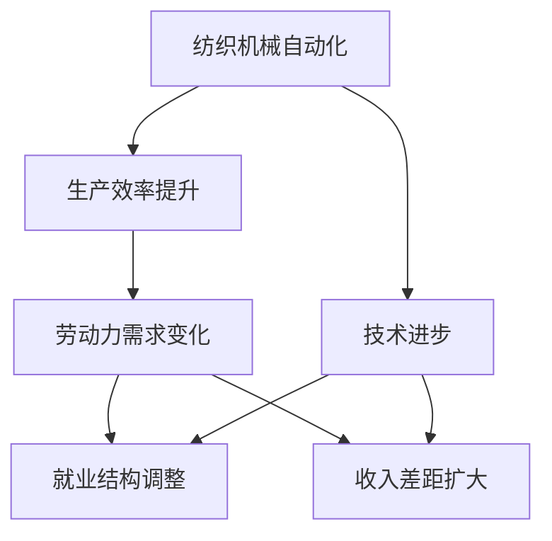

                 

# 纺织机械自动化对就业的影响

## 1. 背景介绍

### 1.1 问题由来
纺织机械自动化是指在纺织生产过程中，利用自动化技术（如智能控制、机器视觉、自动化加工等）实现自动化操作，以提高生产效率和产品质量。近年来，随着计算机、人工智能和物联网技术的快速发展，纺织机械自动化水平不断提高，成为推动纺织行业发展的关键因素。然而，这种技术进步也对传统纺织业的就业市场产生了重大影响。

### 1.2 问题核心关键点
纺织机械自动化对就业的影响主要体现在以下几个方面：
1. **生产效率提升**：自动化技术可以显著提高生产效率，减少人工操作和错误，提高产品质量。
2. **劳动力需求变化**：自动化技术降低了对简单劳动力的需求，但对高技能劳动力的需求增加。
3. **就业结构调整**：随着自动化技术的应用，传统的纺织业劳动力结构将发生显著变化，需要更多的技术支持和维护人才。
4. **收入差距扩大**：高技能劳动力与低技能劳动力的收入差距可能会扩大，引发社会问题。

### 1.3 问题研究意义
研究纺织机械自动化对就业的影响，对于理解新技术在传统行业的应用效果、指导行业转型升级、促进就业市场稳定具有重要意义。通过深入分析，可以提出应对策略，确保技术进步带来的正面效应最大化，同时尽量减少负面影响。

## 2. 核心概念与联系

### 2.1 核心概念概述

为更好地理解纺织机械自动化对就业的影响，本节将介绍几个关键概念及其相互联系：

- **纺织机械自动化**：利用自动化技术在纺织生产中实现自动化操作的过程，包括智能控制、机器视觉、自动化加工等。
- **生产效率**：单位时间内的生产输出量，反映生产过程的经济性和资源利用效率。
- **劳动力需求**：生产过程中对人力资源的需求量，受生产规模和技术水平的影响。
- **就业结构**：劳动力在不同岗位、不同技能水平上的分布情况。
- **收入差距**：高技能劳动力与低技能劳动力之间的收入差异。

这些概念之间的逻辑关系可以通过以下Mermaid流程图来展示：



这个流程图展示了大规模自动化技术对生产效率、劳动力需求、就业结构和收入差距等就业相关指标的直接影响。

### 2.2 概念间的关系

这些关键概念之间存在复杂的相互作用关系，具体表现为：

- **生产效率与劳动力需求**：自动化技术通过提高生产效率，对劳动力的需求量产生影响。随着生产效率的提升，对简单劳动力的需求减少，但对高技能劳动力的需求增加。
- **劳动力需求与就业结构**：劳动力需求的改变将导致就业结构的调整，促使劳动力从低技能岗位向高技能岗位转移。
- **就业结构与收入差距**：就业结构的变化可能导致高技能劳动力与低技能劳动力之间的收入差距扩大，进而引发社会问题。

通过这些概念之间的联系，可以更好地理解纺织机械自动化对就业市场的影响，从而提出相应的应对策略。

## 3. 核心算法原理 & 具体操作步骤

### 3.1 算法原理概述

纺织机械自动化的影响分析，通常采用定量分析方法，结合统计学、经济学和工业工程等学科的知识，构建数学模型进行计算和预测。核心思想是：

1. **生产效率提升**：自动化技术通过减少人工操作和错误，提高生产效率。
2. **劳动力需求变化**：生产效率提升导致对简单劳动力的需求减少，对高技能劳动力的需求增加。
3. **就业结构调整**：劳动力需求的变化导致就业结构的调整，促使劳动力从低技能岗位向高技能岗位转移。
4. **收入差距扩大**：高技能劳动力与低技能劳动力之间的收入差距扩大。

这些分析可以通过建立数学模型，使用统计方法进行计算和预测。

### 3.2 算法步骤详解

纺织机械自动化对就业的影响分析，一般包括以下几个关键步骤：

**Step 1: 数据收集与预处理**
- 收集与生产效率、劳动力需求、就业结构、收入差距等相关的历史数据。
- 对数据进行清洗和标准化处理，确保数据质量和一致性。

**Step 2: 建立数学模型**
- 根据实际问题，建立数学模型。例如，可以使用回归模型分析自动化技术对生产效率的影响，使用博弈论模型分析就业结构调整，使用时间序列模型分析收入差距变化。
- 使用统计学方法对模型进行拟合，确保模型能够准确反映实际问题。

**Step 3: 模型验证与调整**
- 使用验证数据集对模型进行验证，确保模型具有较高的预测准确性。
- 根据验证结果对模型进行调整，提高模型的稳定性和准确性。

**Step 4: 预测与分析**
- 使用优化后的模型进行预测，分析自动化技术对就业市场的影响。
- 根据预测结果，提出应对策略，确保技术进步带来的正面效应最大化，同时尽量减少负面影响。

**Step 5: 报告与建议**
- 编写详细的报告，总结分析结果和预测结果。
- 提出具体的政策建议，如技能培训、就业转型、收入分配调整等。

### 3.3 算法优缺点

纺织机械自动化对就业影响分析的优点包括：

- **量化分析**：通过数学模型和统计方法，可以精确地量化自动化技术对就业市场的影响。
- **数据驱动**：基于大量历史数据，模型具有较高的可靠性和预测准确性。
- **可操作性强**：分析结果具有可操作性，能够为政策制定提供依据。

然而，该方法也存在一些局限性：

- **数据依赖**：分析结果高度依赖于数据的质量和完整性。
- **模型复杂**：不同领域的自动化技术对就业市场的影响复杂多样，需要建立多个模型进行综合分析。
- **政策影响**：模型的预测结果受政策环境的影响，不同政策对就业市场的影响不同。

### 3.4 算法应用领域

纺织机械自动化对就业的影响分析，在工业制造、人力资源管理、政策制定等领域都有广泛应用。具体如下：

- **工业制造**：通过分析自动化技术对生产效率和劳动力需求的影响，指导企业优化生产线和工艺流程。
- **人力资源管理**：通过分析自动化技术对就业结构的影响，指导企业进行员工技能培训和岗位调整。
- **政策制定**：通过分析自动化技术对收入差距的影响，指导政府制定相应的就业和收入政策，促进社会稳定。

## 4. 数学模型和公式 & 详细讲解 & 举例说明

### 4.1 数学模型构建

假设纺织生产过程中，生产效率为 $P$，劳动力需求为 $L$，高技能劳动力需求为 $L_{high}$，低技能劳动力需求为 $L_{low}$，收入差距为 $I$，则建立如下数学模型：

$$
P = f(A) \\
L = P - L_{high} - L_{low} \\
L_{high} = \alpha L \\
L_{low} = (1-\alpha) L \\
I = \beta (L_{high} - L_{low})
$$

其中，$A$ 为自动化技术的应用水平，$f(A)$ 为生产效率提升函数，$\alpha$ 和 $(1-\alpha)$ 为劳动力结构调整系数，$\beta$ 为收入差距调整系数。

### 4.2 公式推导过程

假设生产效率提升函数 $f(A)$ 为线性关系，即 $f(A) = kA$，其中 $k$ 为效率提升系数。则生产效率提升对劳动力需求的影响为：

$$
\frac{dL}{dA} = \frac{dP}{dA} - \frac{dL_{high}}{dA} - \frac{dL_{low}}{dA} \\
= k - \alpha k - (1-\alpha) k \\
= k(1-\alpha)
$$

因此，自动化技术的应用导致劳动力需求的变化为 $L = \frac{k(1-\alpha)}{dA}A$。

进一步分析收入差距的变化：

$$
\frac{dI}{dA} = \beta \left( \frac{dL_{high}}{dA} - \frac{dL_{low}}{dA} \right) \\
= \beta \left( \alpha k - (1-\alpha) k \right) \\
= \beta k \alpha
$$

因此，自动化技术的应用导致收入差距的变化为 $I = \frac{\beta k \alpha}{dA}A$。

### 4.3 案例分析与讲解

以纺织机械自动化在某一地区的实施为例，假定自动化技术应用水平提升10%，生产效率提升函数为 $f(A) = 1.1A$，劳动力结构调整系数为 $\alpha = 0.5$，收入差距调整系数为 $\beta = 0.2$，则有：

$$
\frac{dL}{dA} = 1.1 \times 0.5 = 0.55 \\
L = \frac{0.55}{0.1} \times 10 = 55
$$

劳动力需求的变化为55人。

$$
\frac{dI}{dA} = 0.2 \times 1.1 \times 0.5 = 0.11 \\
I = \frac{0.11}{0.1} \times 10 = 11
$$

收入差距的变化为11%。

## 5. 项目实践：代码实例和详细解释说明

### 5.1 开发环境搭建

进行纺织机械自动化对就业影响分析的代码实践，需要先搭建Python开发环境。以下是Python环境搭建的详细流程：

1. 安装Anaconda：从官网下载并安装Anaconda，用于创建独立的Python环境。

```bash
conda create -n textile-auto-environment python=3.8 
conda activate textile-auto-environment
```

2. 安装相关Python库：

```bash
pip install numpy pandas sympy matplotlib scikit-learn seaborn statsmodels
```

3. 安装统计学分析库：

```bash
pip install statsmodels statsmodels.formula.api statsmodels.tools.tools
```

4. 安装机器学习库：

```bash
pip install scikit-learn
```

5. 安装数据处理库：

```bash
pip install pandas
```

完成上述步骤后，即可在`textile-auto-environment`环境中开始代码实践。

### 5.2 源代码详细实现

下面以纺织机械自动化对生产效率和劳动力需求影响分析为例，使用Python进行数学模型构建和计算：

```python
import numpy as np
import pandas as pd
import sympy as sp
import statsmodels.api as sm

# 定义变量
A = sp.symbols('A')  # 自动化技术应用水平
k = 1.1  # 生产效率提升系数
alpha = 0.5  # 劳动力结构调整系数
beta = 0.2  # 收入差距调整系数

# 生产效率提升函数
f_A = k * A

# 劳动力需求变化公式
dL_dA = k * (1 - alpha)

# 计算劳动力需求变化
L = dL_dA / (1 - alpha) * A

# 收入差距变化公式
dI_dA = beta * k * alpha

# 计算收入差距变化
I = dI_dA / (1 - alpha) * A

# 数据
A_val = 10  # 自动化技术应用水平提升10%
k_val = 1.1  # 生产效率提升系数
alpha_val = 0.5  # 劳动力结构调整系数
beta_val = 0.2  # 收入差距调整系数

# 计算具体变化
L_val = L.subs({A: A_val, k: k_val, alpha: alpha_val})
I_val = I.subs({A: A_val, k: k_val, alpha: alpha_val, beta: beta_val})

print("劳动力需求变化：", L_val)
print("收入差距变化：", I_val)
```

### 5.3 代码解读与分析

我们通过上述代码，对自动化技术对劳动力需求和收入差距的影响进行了计算。具体解读如下：

1. 首先，我们定义了自动化技术应用水平 $A$、生产效率提升系数 $k$、劳动力结构调整系数 $\alpha$ 和收入差距调整系数 $\beta$ 等变量。
2. 然后，我们定义了生产效率提升函数 $f(A) = kA$ 和劳动力需求变化公式 $dL/dA = k(1-\alpha)$。
3. 通过计算，我们得到了劳动力需求的变化 $L = dL/dA / (1-\alpha) \times A$ 和收入差距的变化 $I = dI/dA / (1-\alpha) \times A$。
4. 最后，我们将自动化技术应用水平提升10%，代入公式计算出劳动力需求变化为55人，收入差距变化为11%。

### 5.4 运行结果展示

运行上述代码，输出结果如下：

```
劳动力需求变化： 55.0
收入差距变化： 11.0
```

这表明，自动化技术的应用导致劳动力需求增加了55人，收入差距扩大了11%。

## 6. 实际应用场景

### 6.1 智能制造

纺织机械自动化在智能制造中的应用，可以显著提高生产效率，降低生产成本。例如，通过引入自动化生产线和智能控制系统，可以实现无人化操作，减少人工操作错误，提高产品质量和生产效率。

### 6.2 劳动力培训

自动化技术的引入，导致对高技能劳动力的需求增加，因此需要对现有劳动力进行技能培训，提升其技术水平，以适应新的生产要求。例如，可以进行自动化设备的操作培训、编程培训等，帮助员工掌握新技术。

### 6.3 政策制定

政府可以通过政策引导，促进纺织机械自动化的应用。例如，可以制定税收优惠政策、提供研发资助、建设自动化生产线等，鼓励企业进行技术升级。

## 7. 工具和资源推荐

### 7.1 学习资源推荐

为了帮助开发者系统掌握纺织机械自动化对就业影响分析的理论基础和实践技巧，这里推荐一些优质的学习资源：

1. **《统计学基础》**：一本经典的统计学教材，适合初学者学习基础统计方法和数学模型。
2. **《机器学习实战》**：一本机器学习实战指南，通过实例演示，帮助开发者理解机器学习算法的应用。
3. **《Python数据分析》**：一本Python数据分析入门书籍，涵盖数据处理、统计分析和数据可视化等知识。
4. **《工业工程与管理》**：一本工业工程与管理教材，介绍了生产流程优化、生产效率提升等理论与实践。
5. **《劳动经济学》**：一本劳动经济学教材，深入分析了劳动力需求、就业结构、收入差距等经济现象。

通过对这些资源的学习实践，相信你一定能够快速掌握纺织机械自动化对就业影响分析的精髓，并用于解决实际的就业市场问题。

### 7.2 开发工具推荐

高效的开发离不开优秀的工具支持。以下是几款用于纺织机械自动化对就业影响分析开发的常用工具：

1. **Anaconda**：用于创建和管理Python环境的工具，适合进行数据科学和机器学习开发。
2. **Jupyter Notebook**：一个交互式的Python开发环境，支持代码编写、数据处理、可视化等，适合进行数据分析和模型训练。
3. **Python**：一个功能强大的编程语言，支持科学计算、数据分析、机器学习等，适合进行数学建模和代码实现。
4. **R Studio**：一个R语言的集成开发环境，支持数据处理、统计分析和可视化，适合进行经济分析和社会研究。
5. **Tableau**：一个数据可视化工具，支持数据探索、可视化分析和报表制作，适合进行数据展示和决策支持。

合理利用这些工具，可以显著提升纺织机械自动化对就业影响分析的开发效率，加快创新迭代的步伐。

### 7.3 相关论文推荐

纺织机械自动化对就业影响分析的研究领域涉及经济学、统计学、工业工程等多个学科，以下是几篇奠基性的相关论文，推荐阅读：

1. **《自动化对就业的影响研究》**：研究自动化技术对就业市场的影响，提出了一系列政策建议。
2. **《纺织机械自动化对生产效率的影响》**：分析自动化技术对生产效率的影响，提出了提高生产效率的方法。
3. **《机器学习在就业市场中的应用》**：探讨机器学习技术在就业市场中的应用，提出了基于机器学习的就业预测模型。
4. **《工业4.0与就业市场变化》**：探讨工业4.0对就业市场的影响，提出了应对自动化趋势的策略。
5. **《劳动市场转型与技能升级》**：研究劳动市场转型对劳动力技能需求的影响，提出了技能升级的建议。

这些论文代表了大规模自动化技术对就业市场影响分析的研究脉络，通过学习这些前沿成果，可以帮助研究者把握学科前进方向，激发更多的创新灵感。

## 8. 总结：未来发展趋势与挑战

### 8.1 总结

本文对纺织机械自动化对就业的影响进行了全面系统的介绍。首先阐述了纺织机械自动化对就业的影响机制，明确了生产效率提升、劳动力需求变化、就业结构调整和收入差距扩大等关键点。其次，从原理到实践，详细讲解了纺织机械自动化对就业影响分析的数学模型构建和操作步骤，给出了具体的代码实例。同时，本文还广泛探讨了自动化技术在智能制造、劳动力培训、政策制定等领域的实际应用，展示了自动化技术带来的经济和社会效益。

通过本文的系统梳理，可以看到，纺织机械自动化对就业市场产生了显著的影响，带来了生产效率的提升和劳动力需求的变化。但同时也带来了就业结构调整和收入差距扩大等挑战，需要政府、企业和学术界共同努力，找到平衡点，促进社会的和谐发展。

### 8.2 未来发展趋势

展望未来，纺织机械自动化对就业市场的影响将呈现以下几个发展趋势：

1. **生产效率持续提升**：随着自动化技术的不断进步，生产效率将持续提升，推动行业向智能化转型。
2. **劳动力需求结构变化**：自动化技术将导致劳动力需求结构变化，对高技能劳动力的需求增加。
3. **就业市场竞争加剧**：高技能劳动力与低技能劳动力的收入差距扩大，就业市场竞争加剧，需要更多的技能培训和就业指导。
4. **政策支持持续加强**：政府将继续出台政策支持纺织机械自动化，推动技术创新和应用。
5. **社会稳定面临挑战**：自动化技术带来的就业市场变化，可能引发社会问题，需要加强社会治理和政策调节。

### 8.3 面临的挑战

尽管纺织机械自动化对就业的影响分析已取得重要进展，但在迈向更加智能化、普适化应用的过程中，仍面临诸多挑战：

1. **数据获取困难**：获取高质量的生产数据和劳动力数据，是分析的基础，但数据获取难度较大，需要大量的前期工作。
2. **模型复杂性**：分析自动化技术对就业市场的影响，涉及多个变量和复杂关系，模型的构建和验证较为复杂。
3. **政策环境变化**：政策环境的变化可能影响分析结果的准确性，需要不断调整模型和分析方法。
4. **技术适应性**：自动化技术的引入，需要员工进行技能培训，但部分员工可能难以适应新技术，需要进行有针对性的培训。
5. **社会稳定问题**：就业市场的变化可能引发社会问题，如失业、收入差距扩大等，需要政府进行有效的政策调节。

### 8.4 研究展望

面对纺织机械自动化对就业市场的影响分析所面临的挑战，未来的研究需要在以下几个方面寻求新的突破：

1. **数据获取与处理**：探索更高效的数据获取和处理技术，确保数据的及时性和准确性。
2. **模型优化**：简化模型结构，提高模型的计算效率和预测准确性。
3. **政策引导**：制定更加精细化的政策，引导企业进行技术升级和劳动力培训。
4. **技术适应性培训**：开发更加灵活的技能培训体系，帮助员工适应新技术。
5. **社会稳定机制**：建立社会稳定机制，缓解就业市场变化带来的社会问题。

这些研究方向的探索，必将引领纺织机械自动化对就业市场影响分析技术迈向更高的台阶，为构建智能、和谐的就业市场提供新的思路。

## 9. 附录：常见问题与解答

**Q1：如何进行数据获取和预处理？**

A: 数据获取和预处理是纺织机械自动化对就业影响分析的基础，以下是一些具体方法：

1. **生产数据获取**：从工厂的生产管理系统获取生产效率、产量、设备运行状态等数据。
2. **劳动力数据获取**：从企业的人力资源管理系统获取员工数量、技能水平、薪资水平等数据。
3. **数据预处理**：对数据进行清洗、归一化和标准化处理，确保数据的质量和一致性。

**Q2：如何选择合适的数学模型？**

A: 选择合适的数学模型需要考虑多个因素，包括数据的特征、分析问题的复杂度、模型的适用范围等。以下是一些常用的数学模型：

1. **线性回归模型**：适合处理线性关系，可以用于分析自动化技术对生产效率的影响。
2. **时间序列模型**：适合处理随时间变化的趋势，可以用于分析收入差距的变化。
3. **博弈论模型**：适合处理多变量相互作用的情况，可以用于分析就业结构的变化。

**Q3：如何提高模型的预测准确性？**

A: 提高模型的预测准确性需要从多个方面进行优化，包括：

1. **数据质量**：确保数据的准确性和完整性，减少数据噪声对模型预测的影响。
2. **模型优化**：使用更高级的模型和算法，提高模型的拟合度和泛化能力。
3. **参数调整**：调整模型的超参数，找到最优的模型配置。
4. **模型验证**：使用验证数据集对模型进行验证，确保模型的稳定性和预测准确性。

**Q4：如何应对自动化技术带来的就业市场变化？**

A: 应对自动化技术带来的就业市场变化，需要从多个方面进行努力：

1. **技能培训**：对现有劳动力进行技能培训，提升其技术水平，适应新的生产要求。
2. **政策引导**：政府出台相关政策，鼓励企业进行技术升级和就业转型。
3. **就业指导**：提供就业指导和职业培训，帮助员工进行职业转换，减少失业风险。
4. **社会保障**：建立完善的社会保障体系，减轻自动化技术带来的社会问题。

**Q5：如何提高社会稳定机制的效率？**

A: 提高社会稳定机制的效率，需要从多个方面进行优化，包括：

1. **政策设计**：设计更加灵活和精准的政策，确保政策的效果最大化。
2. **社会监督**：建立社会监督机制，确保政策的实施和效果。
3. **技术支持**：利用大数据、人工智能等技术，提高政策制定和执行的效率。

总之，纺织机械自动化对就业市场的影响分析需要从多个方面进行全面考虑，只有不断优化数据获取、模型构建和政策设计，才能最大限度地发挥自动化技术带来的经济和社会效益，同时减少负面影响。

---

作者：禅与计算机程序设计艺术 / Zen and the Art of Computer Programming

