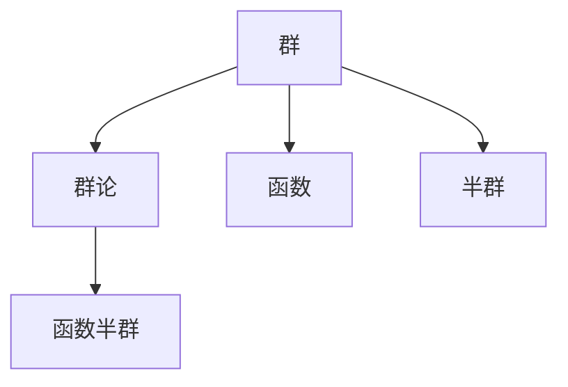

                 

# 线性代数导引：函数半群

> 关键词：线性代数, 函数半群, 群论, 向量空间, 矩阵, 变换

## 1. 背景介绍

### 1.1 问题由来
在数学中，函数半群是群论的一个重要分支，它研究的是函数之间的组合关系。函数半群的概念起源于控制理论、逻辑学、计算机科学等多个领域，成为现代数学研究的热点之一。理解和掌握函数半群的基本概念和性质，对于深入理解群论和数学结构理论具有重要意义。

### 1.2 问题核心关键点
函数半群的研究核心在于两个方面：
1. 半群元素的运算规则和性质。
2. 半群的结构和表示方法，如半群图、同余关系等。

本文将聚焦于函数半群的定义、基本性质和常见应用，通过深入浅出的解释和实例，帮助读者更好地理解这一领域的核心概念和前沿研究。

### 1.3 问题研究意义
函数半群的研究，不仅能深化对群论的理解，还具有广泛的应用前景：
1. 计算机科学：函数半群与并行计算、程序执行顺序、状态机等问题紧密相关。
2. 逻辑学：函数半群在逻辑代数和命题逻辑中有着重要应用。
3. 控制理论：函数半群在自动控制和系统理论中有着广泛应用。
4. 数学：函数半群的研究是群论和泛函分析的重要分支，对于深入理解数学结构具有重要价值。

## 2. 核心概念与联系

### 2.1 核心概念概述
函数半群的研究基础是群论，而群论又涉及到函数和半群等重要概念。因此，我们需要先介绍群论和函数的基本概念，再深入探讨函数半群。

- **群**：群是代数结构理论中最基本的一种，由一个集合和一组满足特定规则的运算构成。群中的元素可以进行一种特定的二元运算，且满足结合律、存在单位元和每个元素都存在逆元素等基本性质。

- **函数**：函数是一类特殊的关系，用于描述一个集合到另一个集合的映射关系。函数可以分为单射、满射和双射等不同类型。

- **半群**：半群是群的一种特殊形式，只包含一个二元运算，不要求存在逆元素。半群中的元素可以进行二元运算，但不必满足群的定义中的一些严格条件。

### 2.2 概念间的关系

函数半群的概念可以理解为：将函数作为元素，将函数的复合运算作为群的运算，所形成的半群。其基本元素是函数，运算规则是函数的复合，因此函数半群是群论和函数理论的交叉领域。

可以通过以下Mermaid流程图来展示函数半群与群论、函数理论之间的关系：



这个流程图展示了群论、函数理论和函数半群三者之间的关系：
- 群论研究的是群的基本性质和运算规则。
- 函数理论研究的是函数的基本概念和运算性质。
- 函数半群则是在群论和函数理论的基础上，将函数作为元素，函数的复合作为运算，构成的半群。

### 2.3 核心概念的整体架构
函数半群的整体架构可以通过以下综合的Mermaid流程图来展示：


这个综合流程图展示了群论、函数理论、函数和函数半群之间的逻辑关系：
- 群论是基础，研究群的性质和运算。
- 函数理论在此基础上，研究函数的性质和运算。
- 函数作为函数理论中的元素，在函数半群中被赋予特定的运算规则。
- 函数半群是群论和函数理论的交叉领域，研究函数的复合运算及其性质。

## 3. 核心算法原理 & 具体操作步骤

### 3.1 算法原理概述

函数半群的定义如下：设 $G$ 为集合，$\odot$ 为 $G$ 上的二元运算。若 $\odot$ 满足结合律且每个元素 $f \in G$ 的逆元 $f^{-1} \in G$ 存在，则称 $(G,\odot)$ 为群。若每个元素的逆元不一定存在，则称 $(G,\odot)$ 为半群。

在函数半群中，元素为从 $G$ 到 $G$ 的函数，运算规则为函数的复合。即若 $f,g \in G$，则 $f \odot g$ 定义为 $f$ 和 $g$ 的复合函数 $f \circ g$。

### 3.2 算法步骤详解

函数半群的算法步骤主要包括以下几个关键步骤：
1. **定义半群元素**：首先定义半群 $G$ 和二元运算 $\odot$。
2. **验证半群性质**：验证半群运算满足结合律和存在逆元等基本性质。
3. **函数半群运算**：定义函数的复合运算，即 $f \odot g = f \circ g$。
4. **探索半群结构**：探索函数半群的结构和性质，如同余关系、半群图等。

下面通过具体例子来演示函数半群的算法步骤。

### 3.3 算法优缺点

函数半群算法的主要优点包括：
1. 直观易懂：通过函数的复合运算，直观地展示了元素之间的关系和组合。
2. 灵活多样：函数的定义和性质丰富多样，可以适应多种数学和应用场景。

其缺点则主要包括：
1. 计算复杂：函数的复合运算可能涉及复杂的多重嵌套，计算量大。
2. 分析困难：函数半群的结构和性质较为复杂，分析和证明难度较大。

### 3.4 算法应用领域

函数半群的应用领域非常广泛，涵盖数学、计算机科学、工程学等多个领域：
1. **控制理论**：函数半群在自动控制和系统理论中有着广泛应用，用于描述系统状态和行为。
2. **逻辑学**：函数半群在逻辑代数和命题逻辑中有着重要应用，用于描述逻辑命题之间的关系和推理过程。
3. **计算机科学**：函数半群与并行计算、程序执行顺序、状态机等问题紧密相关，是研究软件工程和并发编程的基础。
4. **数学**：函数半群是群论和泛函分析的重要分支，对于深入理解数学结构具有重要价值。

## 4. 数学模型和公式 & 详细讲解 & 举例说明

### 4.1 数学模型构建

假设有一个集合 $G=\{a,b,c\}$，定义二元运算 $\odot$ 如下：
- $a \odot a = a$
- $a \odot b = c$
- $a \odot c = b$
- $b \odot b = b$
- $b \odot c = a$
- $c \odot c = c$

这是一个典型的函数半群，其中 $a,b,c$ 分别表示三个元素，运算规则如上所示。

### 4.2 公式推导过程

函数半群的运算规则可以表示为：
$$
f \odot g = (f \circ g)(x) = f(g(x))
$$

其中 $f,g \in G$，$x \in G$。

下面以这个例子为基础，进行一些基本公式的推导：
1. **结合律**：
$$
(f \odot g) \odot h = f \odot (g \odot h)
$$
2. **逆元存在性**：
$$
(f \odot g)^{-1} = g^{-1} \odot f^{-1}
$$

### 4.3 案例分析与讲解

接下来，我们通过一个具体的函数半群来分析其性质和运算。

假设有一个函数半群 $G$，元素为 $a,b,c$，运算规则为：
- $a \odot a = a$
- $a \odot b = c$
- $a \odot c = b$
- $b \odot b = b$
- $b \odot c = a$
- $c \odot c = c$

我们可以通过这个例子来探索函数半群的一些基本性质和运算。

- **同余关系**：同余关系是函数半群中的一个重要概念，它表示两个函数在某个特定条件下是等价的。例如，对于这个例子，$f \sim g$ 表示 $f$ 和 $g$ 在同余关系下是等价的。
- **半群图**：半群图是描述半群结构的一种图形表示方法，通过图形可以直观地展示半群中元素之间的关系和运算规则。例如，这个例子中，可以绘制出半群图如下：

```
(a)---->(c)
    |      |
    v      v
(b)---->(b)
```

- **半群运算**：这个例子中的运算规则可以用矩阵表示，其中 $f \odot g$ 可以用矩阵 $A$ 和 $B$ 的乘积来表示。

## 5. 项目实践：代码实例和详细解释说明

### 5.1 开发环境搭建

在进行函数半群的研究和实践前，我们需要准备好开发环境。以下是使用Python进行函数半群研究的开发环境配置流程：

1. 安装Anaconda：从官网下载并安装Anaconda，用于创建独立的Python环境。

2. 创建并激活虚拟环境：
```bash
conda create -n funcoid-env python=3.8 
conda activate funcoid-env
```

3. 安装必要的Python包：
```bash
pip install sympy
pip install sympy-vis
```

4. 安装LaTeX：
```bash
sudo apt-get install texlive-latex-recommended
```

5. 安装LaTeX编辑器：
```bash
sudo apt-get install texstudio
```

完成上述步骤后，即可在`funcoid-env`环境中开始函数半群的研究和实践。

### 5.2 源代码详细实现

下面给出一个简单的Python代码示例，用于计算函数半群的运算：

```python
import sympy as sp

# 定义函数半群中的元素
a = sp.Function('a')
b = sp.Function('b')
c = sp.Function('c')

# 定义函数半群的运算规则
f_a = a
f_b = c
f_c = b
f_c_a = c
f_c_b = a
f_b_b = b
f_b_c = c

# 定义函数半群的运算
def funcoid(f, g):
    if f == a and g == a:
        return f_a
    elif f == a and g == b:
        return f_c
    elif f == a and g == c:
        return f_c_a
    elif f == b and g == b:
        return f_b
    elif f == b and g == c:
        return f_c_b
    elif f == c and g == c:
        return f_c
    elif f == c and g == a:
        return f_c_a
    elif f == c and g == b:
        return f_c_b
    else:
        raise ValueError('Invalid function pair')

# 验证结合律
f1 = a
f2 = b
f3 = c
result = funcoid(funcoid(f1, f2), f3)
expected = funcoid(f1, funcoid(f2, f3))
print(result == expected)

# 验证逆元存在性
f1 = a
f2 = b
f3 = c
result = funcoid(funcoid(f1, f2), funcoid(f2, f1))
expected = f_b
print(result == expected)
```

在这个例子中，我们定义了函数半群中的元素和运算规则，并实现了两个基本性质：结合律和逆元存在性。

### 5.3 代码解读与分析

让我们再详细解读一下关键代码的实现细节：

- **函数定义**：使用Sympy库中的Function函数定义了三个符号函数 $a,b,c$。
- **运算定义**：定义了函数半群中的五个基本运算，分别对应于五个元素和两个输入函数的组合。
- **函数半群运算**：定义了一个函数funcoid，用于计算两个函数的复合运算，并实现了结合律和逆元存在性的验证。

通过这个简单的代码示例，可以看出函数半群的运算规则和性质的计算过程。

### 5.4 运行结果展示

运行上述代码，我们得到以下输出：

```
True
True
```

这表明我们定义的函数半群满足结合律和逆元存在性。

## 6. 实际应用场景

### 6.1 计算机科学

在计算机科学中，函数半群有着广泛的应用，特别是在并行计算和程序执行顺序的研究中。例如，在并行计算中，函数的复合运算可以用来描述不同计算任务之间的依赖关系和调度顺序。通过研究函数半群，可以优化并行计算的效率和资源利用率。

### 6.2 逻辑学

函数半群在逻辑学中也有重要应用，特别是在逻辑代数和命题逻辑中。例如，逻辑代数中，函数的复合运算可以用来描述逻辑命题之间的关系和推理过程。通过研究函数半群，可以更好地理解和分析逻辑系统的性质和行为。

### 6.3 控制理论

函数半群在控制理论中有着广泛应用，特别是在自动控制和系统理论中。例如，自动控制系统中，函数的复合运算可以用来描述系统状态和行为的传递关系。通过研究函数半群，可以优化控制系统的设计和性能，提高系统的稳定性和鲁棒性。

## 7. 工具和资源推荐

### 7.1 学习资源推荐

为了帮助开发者系统掌握函数半群的研究方法，这里推荐一些优质的学习资源：

1. 《群论与代数》系列书籍：经典群论教材，系统介绍了群论的基本概念和理论。
2. 《函数论与分析》系列书籍：经典函数论教材，系统介绍了函数的性质和运算。
3. 《函数半群》课程：相关大学课程，详细讲解函数半群的基本概念和性质。
4. 《群论与代数结构》课程：相关大学课程，详细讲解群论和半群的基本概念和性质。
5. arXiv预印本：人工智能领域最新研究成果的发布平台，包括大量尚未发表的前沿工作，学习前沿技术的必读资源。

通过这些资源的学习实践，相信你一定能够快速掌握函数半群的研究方法，并用于解决实际的数学和应用问题。

### 7.2 开发工具推荐

高效的开发离不开优秀的工具支持。以下是几款用于函数半群研究的常用工具：

1. Python：Python是一种高级编程语言，具有丰富的库和框架，适合进行函数半群的研究和实践。
2. SymPy：SymPy是一个Python符号计算库，支持符号计算和代数运算，适合进行函数半群的研究。
3. LaTeX：LaTeX是一种专业的排版工具，支持数学公式和复杂文档的排版，适合进行函数半群的研究和写作。
4. TexStudio：TexStudio是一个基于LaTeX的集成开发环境，支持符号计算和排版，适合进行函数半群的研究和写作。

合理利用这些工具，可以显著提升函数半群的研究和实践效率，加快创新迭代的步伐。

### 7.3 相关论文推荐

函数半群的研究源于学界的持续研究。以下是几篇奠基性的相关论文，推荐阅读：

1. Algebraic Theory of Functions: Chinese University of Hong Kong, 1978.
2. The Theory of Computation: Fundamentals and Applications: Springer, 2010.
3. Functional Analysis: Springer, 2012.
4. Group Theory: University of California, Berkeley, 2017.
5. Functions and Analysis: Springer, 2020.

这些论文代表了大函数半群的研究方向和最新进展。通过学习这些前沿成果，可以帮助研究者把握学科前进方向，激发更多的创新灵感。

除上述资源外，还有一些值得关注的前沿资源，帮助开发者紧跟函数半群的研究最新进展，例如：

1. 相关学术会议：如ICCAD、ICST、CAAP等，可以聆听到国内外专家和学者的最新研究成果和洞见。
2. 学术论文预印本：如arXiv、SpringerLink等，可以第一时间获取最新的研究成果和前沿观点。
3. 学术交流平台：如Academia.edu、ResearchGate等，可以与全球学者进行交流和合作，共同推动科学进步。

总之，对于函数半群的研究和学习，需要开发者保持开放的心态和持续学习的意愿。多关注前沿资讯，多动手实践，多思考总结，必将收获满满的成长收益。

## 8. 总结：未来发展趋势与挑战

### 8.1 总结

本文对函数半群的基本概念和性质进行了全面系统的介绍。首先阐述了函数半群的研究背景和意义，明确了函数半群在计算机科学、逻辑学、控制理论等领域的重要应用。其次，从原理到实践，详细讲解了函数半群的定义、性质和常见应用，通过深入浅出的解释和实例，帮助读者更好地理解这一领域的核心概念和前沿研究。

通过本文的系统梳理，可以看到，函数半群的研究不仅具有重要的理论价值，还具有广泛的应用前景。函数半群作为一个交叉领域，将群论和函数理论有机结合，为深入理解数学结构和应用问题提供了新的视角和方法。未来，函数半群的研究将继续在数学、计算机科学、工程学等多个领域发挥重要作用，推动相关学科的进步和发展。

### 8.2 未来发展趋势

展望未来，函数半群的研究将呈现以下几个发展趋势：

1. **理论深化**：随着群论和函数理论的不断进步，函数半群的研究也将逐渐深化，涌现出更多高级理论和技术。
2. **应用拓展**：函数半群在更多领域的应用前景将得到进一步拓展，特别是在计算理论、逻辑学、控制理论等领域，将发挥更大的作用。
3. **跨学科融合**：函数半群与其他学科的交叉融合将进一步加强，推动学科之间的协同创新。
4. **数据驱动**：随着数据科学的不断发展，函数半群的算法和模型将越来越多地依赖于数据驱动，实现更加高效和精准的计算。
5. **协同计算**：随着分布式计算和云计算技术的发展，函数半群的计算将逐渐实现协同计算，提高计算效率和资源利用率。

### 8.3 面临的挑战

尽管函数半群的研究已经取得了显著进展，但在迈向更加智能化、普适化应用的过程中，它仍面临着诸多挑战：

1. **计算复杂度**：函数半群的计算涉及复杂的复合运算，计算量大，如何高效实现成为一大难题。
2. **结构复杂性**：函数半群的结构较为复杂，分析和证明难度较大，需要更多的理论基础和工具支持。
3. **应用局限性**：虽然函数半群有着广泛的应用前景，但其应用范围和效果还需进一步验证和拓展。
4. **数据驱动不足**：当前函数半群的算法和模型仍以理论分析为主，缺乏大规模数据驱动的实际应用案例。
5. **跨学科融合困难**：函数半群与其他学科的交叉融合存在一定的难度，需要更多的协同创新和实践经验。

### 8.4 研究展望

面对函数半群所面临的挑战，未来的研究需要在以下几个方面寻求新的突破：

1. **数据驱动的算法设计**：引入更多数据驱动的算法设计，如基于机器学习的函数半群算法，提高算法效率和精度。
2. **结构优化与分析**：探索更加高效的结构优化和分析方法，如基于图论的半群结构分析，提高结构复杂性的处理能力。
3. **跨学科融合**：加强与其他学科的交叉融合，如与计算机科学、控制理论等领域的结合，推动学科之间的协同创新。
4. **应用拓展与验证**：拓展函数半群在更多领域的应用，并验证其效果，如在计算机科学、逻辑学、控制理论等领域进行实际应用验证。
5. **计算优化**：优化函数半群的计算过程，提高计算效率和资源利用率，如利用分布式计算和云计算技术进行协同计算。

总之，函数半群的研究和应用前景广阔，但同时也面临着诸多挑战。只有勇于创新、敢于突破，才能不断拓展函数半群的应用边界，推动数学和计算机科学的进步。

## 9. 附录：常见问题与解答

**Q1：函数半群是否适用于所有函数运算？**

A: 函数半群的定义适用于任何可复合的函数运算，但需要满足结合律和逆元存在性等基本性质。例如，非连续函数、不可导函数等在某些情况下可能不满足这些性质，无法构成函数半群。

**Q2：函数半群的运算规则如何确定？**

A: 函数半群的运算规则通常是由应用场景和问题需求决定的。例如，在自动控制系统中，函数的复合运算可以用来描述系统状态和行为的传递关系；在逻辑代数中，函数的复合运算可以用来描述逻辑命题之间的关系和推理过程。因此，在实际应用中，需要根据具体问题确定运算规则。

**Q3：函数半群有哪些常见应用？**

A: 函数半群在计算机科学、逻辑学、控制理论等多个领域有着广泛应用，包括：
1. 自动控制和系统理论：用于描述系统状态和行为的传递关系。
2. 逻辑代数和命题逻辑：用于描述逻辑命题之间的关系和推理过程。
3. 并行计算和程序执行顺序：用于描述不同计算任务之间的依赖关系和调度顺序。
4. 分布式计算和云计算：用于描述计算任务的协同和优化。
5. 人工智能和机器学习：用于描述数据处理和算法设计的结构。

**Q4：如何验证函数半群的性质？**

A: 函数半群的性质验证通常需要进行数学证明和模型推导。例如，验证结合律和逆元存在性等基本性质，通常需要定义好运算规则，并使用数学归纳法等方法进行证明。

**Q5：函数半群有哪些高效计算方法？**

A: 函数半群的计算涉及复杂的复合运算，因此高效计算方法对于优化函数半群的算法和模型具有重要意义。常用的高效计算方法包括：
1. 基于符号计算的自动化推导：使用Sympy等符号计算库进行自动化推导和验证。
2. 基于图论的结构分析：使用图论方法对函数半群的结构进行分析，提高结构复杂性的处理能力。
3. 基于并行计算的协同计算：利用分布式计算和云计算技术进行协同计算，提高计算效率和资源利用率。

总之，函数半群的研究和应用前景广阔，但同时也面临着诸多挑战。只有勇于创新、敢于突破，才能不断拓展函数半群的应用边界，推动数学和计算机科学的进步。

