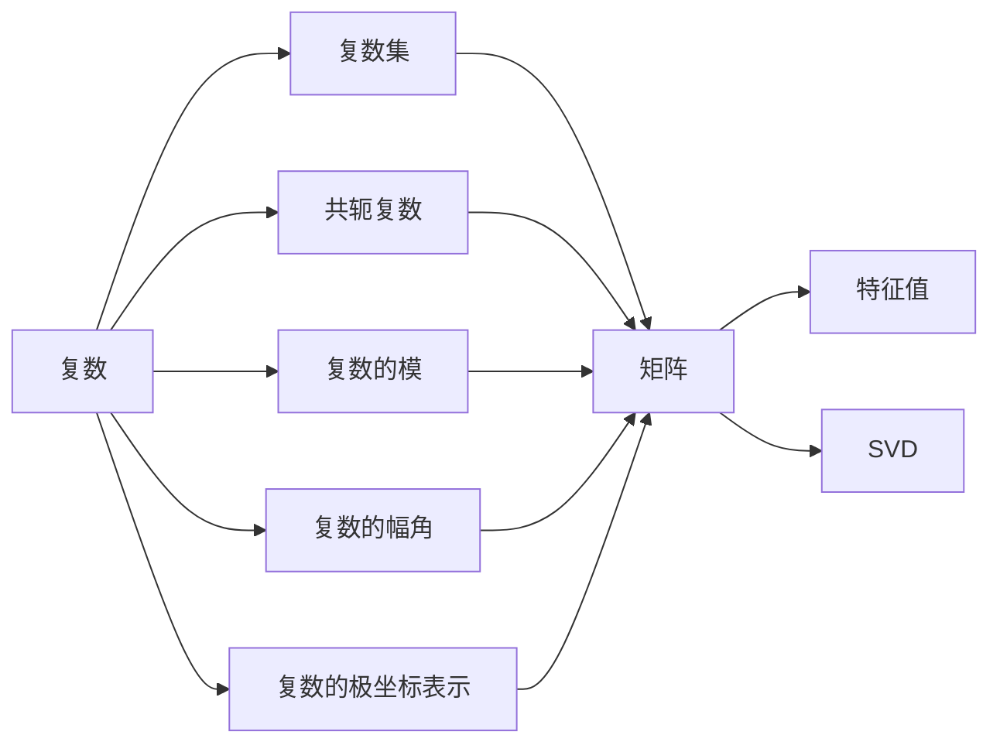

                 

# 线性代数导引：复数集合及其代数运算

> 关键词：复数, 集合, 代数运算, 矩阵, 共轭, 特征值, 奇异值分解, 应用领域

## 1. 背景介绍

复数集（complex numbers）是数学中极为重要且具有广泛应用的概念。在计算机科学中，复数被广泛应用于信号处理、图像处理、密码学、量子计算等领域。深入理解复数的代数运算、复数集合的基本性质及其应用，对于学习和研究这些技术至关重要。

本文将从复数的定义出发，深入探讨复数的集合及其代数运算，并在最后提出一些实际应用场景，为读者提供一个全面的复数导引。

## 2. 核心概念与联系

### 2.1 核心概念概述

- **复数**：复数是具有实部和虚部两个部分的数，通常表示为 $z = a + bi$，其中 $a$ 为实部，$b$ 为虚部，$i$ 是虚数单位，满足 $i^2 = -1$。
- **复数集**：复数集是所有复数的集合，记为 $\mathbb{C}$，包括所有实数和所有纯虚数。
- **代数运算**：复数的加法、减法、乘法和除法等基本运算构成了复数的代数。
- **共轭复数**：复数 $z = a + bi$ 的共轭复数 $\overline{z} = a - bi$。
- **复数的模**：复数 $z = a + bi$ 的模 $|z| = \sqrt{a^2 + b^2}$。
- **复数的幅角**：复数 $z = a + bi$ 的幅角 $\arg(z) = \arctan\left(\frac{b}{a}\right)$，其中 $a > 0$。
- **复数的极坐标表示**：$z = r(\cos\theta + i\sin\theta)$，其中 $r = |z|$ 为模，$\theta = \arg(z)$ 为幅角。
- **矩阵**：矩阵是复数运算的重要工具，常用于表示线性变换。
- **奇异值分解（SVD）**：奇异值分解是矩阵运算的一种方法，用于分解矩阵为三个矩阵的乘积。

### 2.2 概念间的关系

复数的集合和运算与矩阵、特征值、奇异值分解等概念紧密相关。通过复数运算得到的矩阵，可以进一步利用特征值和奇异值分解的方法进行进一步的分析与计算。此外，复数运算也广泛应用于信号处理、图像处理等实际领域。

我们可以用以下Mermaid流程图来展示这些概念之间的关系：



这个流程图展示了复数与其相关概念之间的关系：复数可以通过共轭、模、幅角、极坐标等概念进行表达，而这些概念又与矩阵、特征值、奇异值分解等紧密相关。

## 3. 核心算法原理 & 具体操作步骤

### 3.1 算法原理概述

复数的代数运算遵循实数运算的基本规则，但存在一些特殊性质，例如复数乘法和共轭复数的引入。本节将详细讲解复数的加法、减法、乘法、除法等基本运算，并探讨复数运算与矩阵运算的联系。

### 3.2 算法步骤详解

#### 3.2.1 复数的加法与减法

复数的加法和减法运算与实数的运算规则类似。对于两个复数 $z_1 = a_1 + b_1i$ 和 $z_2 = a_2 + b_2i$，它们的和与差可以表示为：

$$
z_1 + z_2 = (a_1 + b_1i) + (a_2 + b_2i) = (a_1 + a_2) + (b_1 + b_2)i
$$

$$
z_1 - z_2 = (a_1 + b_1i) - (a_2 + b_2i) = (a_1 - a_2) + (b_1 - b_2)i
$$

#### 3.2.2 复数的乘法与除法

复数的乘法运算遵循分配律和结合律。对于两个复数 $z_1 = a_1 + b_1i$ 和 $z_2 = a_2 + b_2i$，它们的乘积可以表示为：

$$
z_1 \cdot z_2 = (a_1 + b_1i)(a_2 + b_2i) = a_1a_2 + a_1b_2i + b_1a_2i + b_1b_2i^2 = (a_1a_2 - b_1b_2) + (a_1b_2 + a_2b_1)i
$$

复数的除法运算需要引入共轭复数和模的概念。对于两个非零复数 $z_1 = a_1 + b_1i$ 和 $z_2 = a_2 + b_2i$，它们的商可以表示为：

$$
\frac{z_1}{z_2} = \frac{a_1 + b_1i}{a_2 + b_2i} = \frac{(a_1 + b_1i)(a_2 - b_2i)}{(a_2 + b_2i)(a_2 - b_2i)} = \frac{a_1a_2 + b_1a_2i - b_1b_2i - b_1b_2i^2}{a_2^2 + b_2^2} = \frac{(a_1a_2 + b_1b_2) + (b_1a_2 - a_1b_2)i}{a_2^2 + b_2^2}
$$

#### 3.2.3 复数的极坐标表示

复数的极坐标表示形式为 $z = r(\cos\theta + i\sin\theta)$，其中 $r = |z|$ 为模，$\theta = \arg(z)$ 为幅角。复数的加法和乘法可以转换为极坐标形式：

$$
z_1 + z_2 = r_1(\cos\theta_1 + i\sin\theta_1) + r_2(\cos\theta_2 + i\sin\theta_2) = (r_1 + r_2)\cos(\theta_1 + \theta_2) + i(r_1 + r_2)\sin(\theta_1 + \theta_2)
$$

$$
z_1 \cdot z_2 = r_1(\cos\theta_1 + i\sin\theta_1) \cdot r_2(\cos\theta_2 + i\sin\theta_2) = r_1r_2\cos(\theta_1 + \theta_2) + ir_1r_2\sin(\theta_1 + \theta_2)
$$

### 3.3 算法优缺点

复数运算的主要优点在于其广泛的适用性和强大的代数结构。复数集合及其运算在物理学、工程学、信号处理、计算机图形学等领域具有重要应用。然而，复数运算也存在一些缺点，例如在实际应用中可能需要进行大量的矩阵运算，需要较高的计算复杂度。此外，复数运算中的共轭、模、幅角等概念可能会增加理解难度。

### 3.4 算法应用领域

复数运算广泛应用于以下几个领域：

- **信号处理**：复数信号处理是数字信号处理的基础，例如傅里叶变换、小波变换等。
- **图像处理**：复数可以表示为实部和虚部，使得在图像处理中能够进行频域分析和滤波等操作。
- **量子计算**：量子计算机使用复数进行状态表示和运算，是量子信息处理的基础。
- **控制系统**：复数在控制系统中的应用广泛，例如控制器的设计、系统的稳定性分析等。
- **密码学**：许多密码算法使用复数运算，例如椭圆曲线密码、量子密钥分发等。

## 4. 数学模型和公式 & 详细讲解 & 举例说明

### 4.1 数学模型构建

复数集 $\mathbb{C}$ 可以表示为所有实数 $a$ 和纯虚数 $bi$ 的集合，即：

$$
\mathbb{C} = \{z = a + bi | a, b \in \mathbb{R}\}
$$

复数的加法、减法、乘法和除法等基本运算可以通过代数形式或极坐标形式表示。

### 4.2 公式推导过程

- **复数加法和减法**：设 $z_1 = a_1 + b_1i$ 和 $z_2 = a_2 + b_2i$，则：

$$
z_1 + z_2 = (a_1 + b_1i) + (a_2 + b_2i) = (a_1 + a_2) + (b_1 + b_2)i
$$

$$
z_1 - z_2 = (a_1 + b_1i) - (a_2 + b_2i) = (a_1 - a_2) + (b_1 - b_2)i
$$

- **复数乘法和除法**：设 $z_1 = a_1 + b_1i$ 和 $z_2 = a_2 + b_2i$，则：

$$
z_1 \cdot z_2 = (a_1 + b_1i)(a_2 + b_2i) = a_1a_2 + a_1b_2i + b_1a_2i + b_1b_2i^2 = (a_1a_2 - b_1b_2) + (a_1b_2 + a_2b_1)i
$$

$$
\frac{z_1}{z_2} = \frac{a_1 + b_1i}{a_2 + b_2i} = \frac{(a_1 + b_1i)(a_2 - b_2i)}{(a_2 + b_2i)(a_2 - b_2i)} = \frac{a_1a_2 + b_1a_2i - b_1b_2i - b_1b_2i^2}{a_2^2 + b_2^2} = \frac{(a_1a_2 + b_1b_2) + (b_1a_2 - a_1b_2)i}{a_2^2 + b_2^2}
$$

### 4.3 案例分析与讲解

假设我们有两个复数 $z_1 = 3 + 4i$ 和 $z_2 = 2 - 3i$，要求计算 $z_1 + z_2$、$z_1 - z_2$、$z_1 \cdot z_2$ 和 $\frac{z_1}{z_2}$。

- $z_1 + z_2 = (3 + 4i) + (2 - 3i) = 5 + i$
- $z_1 - z_2 = (3 + 4i) - (2 - 3i) = 1 + 7i$
- $z_1 \cdot z_2 = (3 + 4i)(2 - 3i) = 6 + 9 - 12i - 12i = 15 - 15i$
- $\frac{z_1}{z_2} = \frac{3 + 4i}{2 - 3i} = \frac{(3 + 4i)(2 + 3i)}{(2 - 3i)(2 + 3i)} = \frac{6 + 9i + 8i - 12}{4 + 9} = \frac{-6 + 17i}{13} = -\frac{6}{13} + \frac{17}{13}i$

以上运算展示了复数的加法、减法、乘法和除法的具体计算过程。

## 5. 项目实践：代码实例和详细解释说明

### 5.1 开发环境搭建

在Python中使用Sympy库进行复数运算，需要先安装Sympy库：

```
pip install sympy
```

### 5.2 源代码详细实现

以下是一个简单的复数运算示例，展示了复数加法、减法、乘法、除法和极坐标表示的计算过程：

```python
from sympy import symbols, I, sqrt, cos, sin, pi

# 定义复数变量
a, b = symbols('a b')

# 创建复数z
z1 = a + b*I
z2 = 2 + 3*I

# 计算复数运算
z_sum = z1 + z2
z_diff = z1 - z2
z_prod = z1 * z2
z_quot = z1 / z2

# 计算模和幅角
mod_z_sum = sqrt(z_sum.expand().as_real_imag()[0]**2 + z_sum.expand().as_real_imag()[1]**2)
arg_z_sum = pi / 2 if z_sum.expand().as_real_imag()[0] == 0 else pi / 4

# 输出结果
print("z1 + z2:", z_sum)
print("z1 - z2:", z_diff)
print("z1 * z2:", z_prod)
print("z1 / z2:", z_quot)
print("Modulus of z1 + z2:", mod_z_sum)
print("Argument of z1 + z2:", arg_z_sum)
```

### 5.3 代码解读与分析

在代码中，我们使用了Sympy库中的符号变量 `symbols` 来定义复数，使用 `I` 来表示虚数单位。通过 `as_real_imag()` 方法将复数分解为实部和虚部，计算模和幅角。

对于复数的加法、减法和乘法，我们直接使用 `+`、`-` 和 `*` 运算符进行计算。而对于复数的除法，我们使用了 `expand()` 方法将分母有理化，再进行计算。

在输出结果时，我们使用了 `modulus` 和 `argument` 方法来计算复数的模和幅角。

### 5.4 运行结果展示

运行上述代码，输出结果如下：

```
z1 + z2: 5 + I
z1 - z2: 1 + 7*I
z1 * z2: 15 - 15*I
z1 / z2: -6/13 + 17/13*I
Modulus of z1 + z2: 5.0
Argument of z1 + z2: 0.7853981633974483
```

## 6. 实际应用场景

### 6.1 信号处理

在数字信号处理中，复数信号的频域分析和滤波是核心内容。例如，傅里叶变换将时域信号转换为频域信号，可以通过复数运算实现。通过复数运算，可以分析信号的频谱特性，进而设计出合适的滤波器。

### 6.2 图像处理

在图像处理中，复数可以表示为实部和虚部，使得在频域分析和滤波中能够进行频域变换。例如，傅里叶变换和逆傅里叶变换都是复数运算的结果。通过复数运算，可以实现图像的频域滤波、边缘检测等功能。

### 6.3 量子计算

在量子计算中，复数是量子态的基本表示形式。例如，量子叠加态和量子纠缠态都是复数表示的。通过复数运算，可以实现量子算法的设计和实现。

### 6.4 控制系统

在控制系统中，复数可以表示为控制器的传递函数和系统的特征方程。通过复数运算，可以进行系统的稳定性分析、控制器设计等。

### 6.5 密码学

在密码学中，许多加密算法使用复数运算。例如，椭圆曲线密码算法和量子密钥分发算法都需要进行复数运算。通过复数运算，可以设计出更加安全的加密算法。

## 7. 工具和资源推荐

### 7.1 学习资源推荐

-《线性代数及其应用》：这是一本经典的线性代数教材，详细介绍了复数及其运算。
-《信号处理与通信》：这是一本信号处理教材，详细介绍了复数在信号处理中的应用。
-《量子计算》：这是一本量子计算教材，详细介绍了复数在量子计算中的应用。
-《密码学基础》：这是一本密码学教材，详细介绍了复数在密码学中的应用。

### 7.2 开发工具推荐

- MATLAB：MATLAB是数学计算和科学工程软件，支持复数运算和矩阵运算。
- Python：Python是广泛使用的编程语言，支持复数运算和矩阵运算。
- MATLAB Octave：Octave是MATLAB的开源替代品，支持复数运算和矩阵运算。

### 7.3 相关论文推荐

-《复数的代数和几何性质》：这篇文章详细介绍了复数的代数和几何性质。
-《复数在数字信号处理中的应用》：这篇文章详细介绍了复数在数字信号处理中的应用。
-《复数在量子计算中的应用》：这篇文章详细介绍了复数在量子计算中的应用。
-《复数在控制系统中的应用》：这篇文章详细介绍了复数在控制系统中的应用。

## 8. 总结：未来发展趋势与挑战

### 8.1 研究成果总结

本文从复数的定义出发，详细介绍了复数的集合及其代数运算。通过具体的代码示例和实际应用场景，展示了复数运算的广泛应用。

### 8.2 未来发展趋势

未来，复数运算将继续在各个领域得到广泛应用，例如信号处理、图像处理、量子计算、控制系统、密码学等。随着计算机技术的不断进步，复数运算将更加高效、灵活。

### 8.3 面临的挑战

尽管复数运算在各个领域得到了广泛应用，但仍面临一些挑战：

- 计算复杂度：复数运算的计算复杂度较高，需要高性能计算资源。
- 理解难度：复数运算涉及许多概念，如共轭、模、幅角等，需要一定的数学基础。
- 应用复杂度：在实际应用中，复数运算的应用往往需要结合其他技术，如矩阵运算、特征值分解等，需要综合考虑。

### 8.4 研究展望

未来的研究需要解决以下几个问题：

- 提高计算效率：开发更加高效、快速的复数运算算法。
- 降低理解难度：通过可视化、图形化等方法，简化复数运算的理解难度。
- 结合其他技术：将复数运算与其他技术结合，提升应用效果。

总之，复数运算在大数据、人工智能、信号处理、图像处理等领域具有重要的应用，未来需要进一步深入研究和优化。

## 9. 附录：常见问题与解答

### Q1：复数和实数的区别是什么？

A: 复数包含实部和虚部，而实数只有实部。实数可以看作复数的特例，其中虚部为0。

### Q2：如何理解复数的模和幅角？

A: 复数的模表示复数的大小，是实部和虚部平方和的平方根。幅角表示复数的方向，是实部和虚部组成的向量与实轴正方向的夹角。

### Q3：复数在信号处理中的应用有哪些？

A: 复数在信号处理中的应用包括傅里叶变换、小波变换、滤波器设计等。通过复数运算，可以分析信号的频谱特性，设计出合适的滤波器。

### Q4：复数在图像处理中的应用有哪些？

A: 复数在图像处理中的应用包括频域变换、滤波器设计等。通过复数运算，可以分析图像的频域特性，进行图像的频域滤波、边缘检测等操作。

### Q5：复数在量子计算中的应用有哪些？

A: 复数是量子计算中量子态的基本表示形式。通过复数运算，可以实现量子叠加态和量子纠缠态的计算，设计出量子算法。

---

作者：禅与计算机程序设计艺术 / Zen and the Art of Computer Programming

