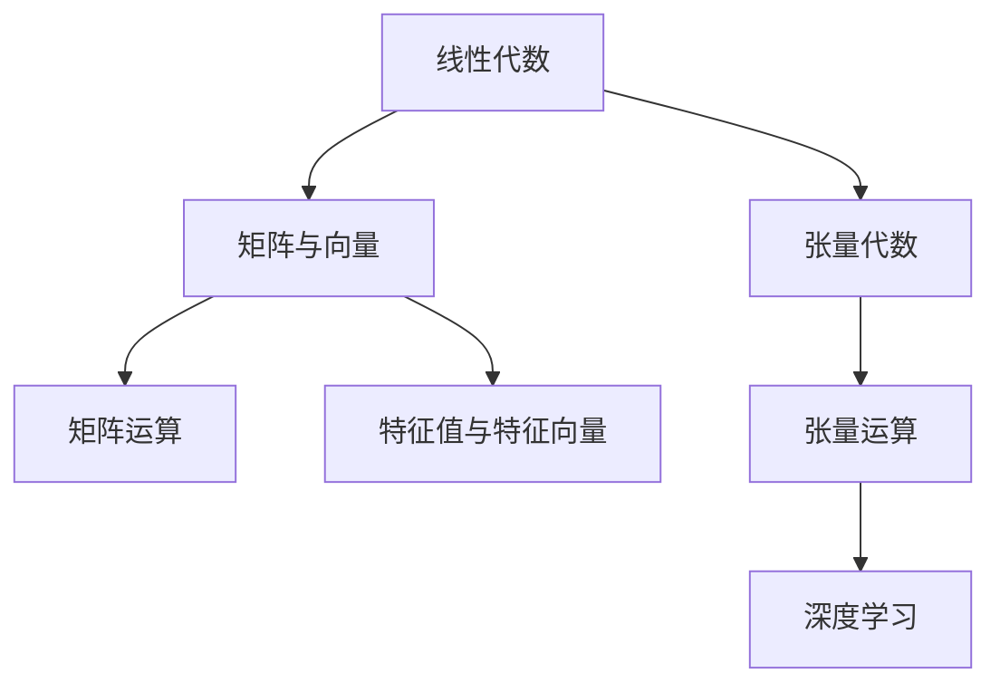
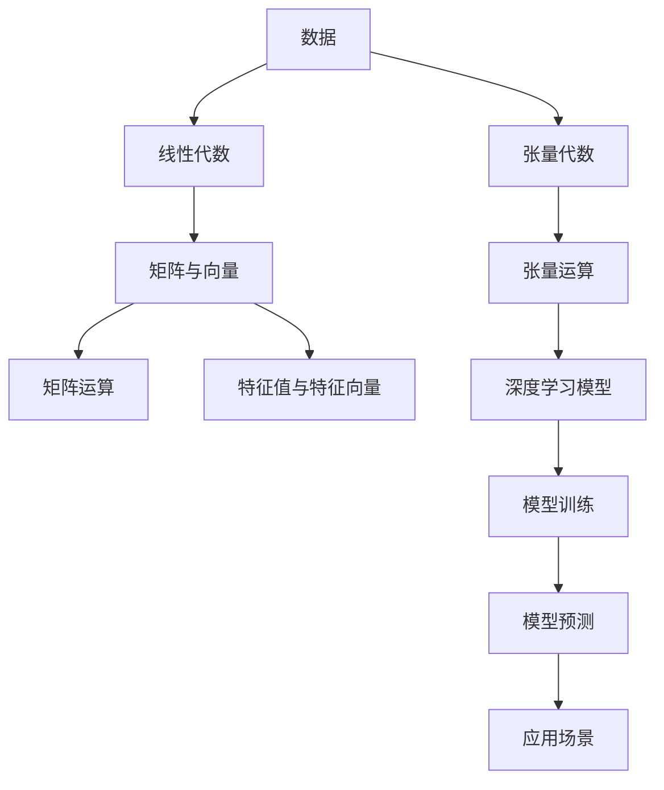

                 

# 线性代数导引：张量代数

线性代数是数学和计算机科学中极为重要的分支，它提供了用于表示和操作向量、矩阵、张量等数学对象的工具。在深度学习领域，张量代数则提供了处理多维数据的强有力的手段，尤其是在表示复杂的空间结构、优化模型参数等方面发挥着关键作用。本文将系统介绍线性代数和张量代数的基本概念和核心算法，并详细阐述其应用场景，帮助读者深入理解这些数学工具在深度学习中的作用。

## 1. 背景介绍

### 1.1 问题由来
现代深度学习模型，如卷积神经网络(CNNs)、递归神经网络(RNNs)和变分自编码器(Generative Adversarial Networks, GANs)等，都在其核心结构中使用了线性代数的思想。例如，卷积操作本质上是对输入数据的矩阵乘法和傅里叶变换的组合，而RNNs的反向传播过程则涉及矩阵的逐层推导。因此，深入理解线性代数和张量代数，是掌握深度学习模型的基础。

### 1.2 问题核心关键点
本节将介绍几个关键概念：

- 线性代数：研究向量空间、线性变换、矩阵等线性对象及其运算的数学分支。
- 张量代数：扩展线性代数的范围，引入更高维的张量结构，用于表示和操作多维数据。
- 深度学习：基于神经网络模型，通过对数据进行线性代数和张量代数运算，实现学习任务的算法和模型。

这些核心概念之间的逻辑关系可以通过以下Mermaid流程图来展示：



这个流程图展示了几者的联系：线性代数提供了矩阵和向量等基础对象，以及矩阵运算和特征分析等基本运算；张量代数在此基础上，扩展了维度，引入了更高维的张量运算；而深度学习则是基于这些数学工具进行高级数据建模和优化。

## 2. 核心概念与联系

### 2.1 核心概念概述

本节将介绍线性代数和张量代数中的一些关键概念，并简要说明它们在深度学习中的应用。

- **向量**：由有限个数值组成的数组，可用于表示几何空间中的点。向量可用于表示数据的高维特征，如图像的像素值、文本的词嵌入等。
- **矩阵**：由向量组成的表格，可以表示几何变换、线性映射等操作。在深度学习中，卷积层、全连接层等结构都使用了矩阵乘法和矩阵分解等技术。
- **线性变换**：通过矩阵乘法对向量进行变换，常用于表示神经网络的线性层。
- **张量**：由多维数组组成的数据结构，可用于表示和操作更高维度的数据。在深度学习中，张量代数广泛用于表示复杂的数据结构，如多维卷积核、多通道视频数据等。
- **张量运算**：包括张量乘法、张量卷积、张量分解等，用于高效地处理多维数据。

### 2.2 概念间的关系

这些核心概念之间存在紧密的联系，形成了深度学习模型的数学基础。以下是几个关键点：

- **线性代数是张量代数的基础**：线性代数中的矩阵乘法和特征分析等基本概念，在张量代数中得到扩展和应用，使得多维数据的高效表示和处理成为可能。
- **深度学习模型基于张量代数**：深度学习模型使用张量运算来表示和操作多维数据，从而实现数据建模和优化。
- **张量代数可以增强线性代数**：张量代数提供了更高的维度和更灵活的数据表示方法，使得线性代数在处理复杂数据结构时更为强大。

### 2.3 核心概念的整体架构

最后，我们用一个综合的流程图来展示线性代数、张量代数和深度学习之间的关系：



这个综合流程图展示了大语言模型微调过程中各个核心概念的关系和作用：数据作为输入，通过线性代数进行基本的特征提取，再使用张量代数进行高效的多维数据表示，最终通过深度学习模型进行学习和预测，最后应用于实际的应用场景。

## 3. 核心算法原理 & 具体操作步骤

### 3.1 算法原理概述

线性代数和张量代数的核心算法通常包括矩阵乘法、矩阵分解、特征值分解等，这些算法在深度学习中广泛应用。以下将逐一介绍这些算法的原理和应用。

### 3.2 算法步骤详解

**3.2.1 矩阵乘法**

矩阵乘法是线性代数中最基本的运算之一，定义为两个矩阵的乘积。设矩阵 $A$ 的维数为 $m \times n$，矩阵 $B$ 的维数为 $n \times p$，则它们的乘积 $C=AB$ 的维数为 $m \times p$。矩阵乘法的计算过程是逐元素相乘并累加，即：

$$
C_{ij} = \sum_{k=1}^n A_{ik}B_{kj}
$$

矩阵乘法在深度学习中用于构建卷积层、全连接层等结构，实现了对输入数据的线性变换。例如，卷积层的计算可以看作是对图像数据的二维卷积操作，即：

$$
\mathbf{X}_{i,j} = \mathbf{W}_{o \times f} * \mathbf{F}_{n \times n} * \mathbf{I}_{H \times W}
$$

其中，$\mathbf{X}$ 表示输出图像，$\mathbf{W}$ 表示卷积核，$\mathbf{F}$ 表示输入图像的特征图，$H$ 和 $W$ 表示输入图像的高和宽。

**3.2.2 矩阵分解**

矩阵分解是将一个矩阵分解为两个或多个矩阵乘积的形式。常见的矩阵分解方法包括奇异值分解(Singular Value Decomposition, SVD)、QR分解等。奇异值分解将一个矩阵 $A$ 分解为三个矩阵的乘积：

$$
A = U \Sigma V^T
$$

其中，$U$ 和 $V$ 是正交矩阵，$\Sigma$ 是对角矩阵。奇异值分解在深度学习中用于降维、特征提取和压缩等任务，如PCA(主成分分析)算法。

**3.2.3 特征值分解**

特征值分解是将一个矩阵分解为其特征向量和特征值的形式。设矩阵 $A$ 的特征值为 $\lambda$，对应的特征向量为 $\mathbf{v}$，则：

$$
A \mathbf{v} = \lambda \mathbf{v}
$$

特征值分解在深度学习中用于模型优化和特征分析，如在矩阵特征值分解中，可以通过最小化损失函数来训练模型参数。

### 3.3 算法优缺点

**3.3.1 优点**

1. **高效性**：矩阵乘法和分解等算法具有高效的时间复杂度，能够快速处理大量数据。
2. **灵活性**：矩阵和张量运算支持高维数据，使得深度学习模型能够处理复杂的非线性关系。
3. **可扩展性**：张量代数提供了灵活的数据表示方法，使得深度学习模型能够适应多种数据类型和结构。

**3.3.2 缺点**

1. **高维度带来的复杂性**：随着维度的增加，矩阵和张量运算的复杂度呈指数级增长，可能导致计算资源的消耗增加。
2. **模型表达的局限性**：高维数据可能导致模型表达的复杂性和过拟合问题。
3. **存储和计算资源的消耗**：高维数据需要大量的存储空间和计算资源，可能对硬件设备提出较高要求。

### 3.4 算法应用领域

线性代数和张量代数在深度学习中广泛应用于以下领域：

- **卷积神经网络**：使用矩阵乘法实现卷积操作，高效地提取图像、音频等高维数据的特征。
- **递归神经网络**：通过矩阵乘法和特征值分解等技术，实现对时间序列数据的建模和预测。
- **自编码器**：使用矩阵分解和特征值分解等技术，实现对数据的降维和特征提取。
- **生成对抗网络**：通过矩阵乘法和张量运算，实现对高维数据的高效生成和优化。

## 4. 数学模型和公式 & 详细讲解 & 举例说明

### 4.1 数学模型构建

在线性代数和张量代数中，数学模型通常由矩阵、向量、张量等线性对象组成。以下是几个基本的数学模型：

**向量模型**：表示为 $\mathbf{v} = [v_1, v_2, ..., v_n]^T$，其中 $v_i$ 为向量元素。

**矩阵模型**：表示为 $A = [a_{ij}]_{m \times n}$，其中 $a_{ij}$ 为矩阵元素。

**张量模型**：表示为 $\mathcal{T} = [t_{i_1, i_2, ..., i_k}]_{d_1 \times d_2 \times ... \times d_k}$，其中 $t_{i_1, i_2, ..., i_k}$ 为张量元素。

### 4.2 公式推导过程

**4.2.1 矩阵乘法**

设矩阵 $A$ 和 $B$ 的维数为 $m \times n$ 和 $n \times p$，则它们的乘积 $C=AB$ 的维数为 $m \times p$。

$$
C_{ij} = \sum_{k=1}^n A_{ik}B_{kj}
$$

**4.2.2 矩阵分解**

奇异值分解：设矩阵 $A$ 的维数为 $m \times n$，则：

$$
A = U \Sigma V^T
$$

其中，$U$ 和 $V$ 是正交矩阵，$\Sigma$ 是对角矩阵，对角线上的元素为矩阵 $A$ 的奇异值。

**4.2.3 特征值分解**

设矩阵 $A$ 的维数为 $n \times n$，则其特征值 $\lambda_i$ 和对应的特征向量 $\mathbf{v}_i$ 满足：

$$
A \mathbf{v}_i = \lambda_i \mathbf{v}_i
$$

其中，$\lambda_i$ 为特征值，$\mathbf{v}_i$ 为特征向量。

### 4.3 案例分析与讲解

**案例1：卷积层**

卷积层是卷积神经网络中的一种基本结构，用于提取输入数据的局部特征。假设输入数据为 $I_{H \times W}$，卷积核为 $W_{o \times f}$，则卷积层的输出为：

$$
\mathbf{X}_{i,j} = \mathbf{W}_{o \times f} * \mathbf{F}_{n \times n} * \mathbf{I}_{H \times W}
$$

其中，$\mathbf{X}$ 表示输出图像，$\mathbf{W}$ 表示卷积核，$\mathbf{F}$ 表示输入图像的特征图，$H$ 和 $W$ 表示输入图像的高和宽。

**案例2：PCA降维**

主成分分析(PCA)是一种常用的降维技术，通过奇异值分解来提取数据的最大方差特征。假设原始数据为 $\mathbf{X} \in \mathbb{R}^{n \times m}$，其中 $n$ 表示样本数，$m$ 表示特征数。通过奇异值分解：

$$
\mathbf{X} = U \Sigma V^T
$$

可以提取出主成分 $\mathbf{U} \in \mathbb{R}^{n \times k}$ 和对应的权重 $\mathbf{W} \in \mathbb{R}^{k \times m}$，其中 $k$ 表示主成分数。

## 5. 项目实践：代码实例和详细解释说明

### 5.1 开发环境搭建

为了进行线性代数和张量代数的项目实践，我们需要安装Python和相关的库。以下是Python环境的搭建步骤：

1. 安装Anaconda：从官网下载并安装Anaconda，用于创建独立的Python环境。

2. 创建并激活虚拟环境：
```bash
conda create -n linear_algebra_env python=3.8 
conda activate linear_algebra_env
```

3. 安装相关库：
```bash
conda install numpy scipy matplotlib sympy pandas jupyter notebook ipython
```

4. 安装TensorFlow和Keras：
```bash
pip install tensorflow==2.5 keras
```

完成上述步骤后，即可在`linear_algebra_env`环境中进行线性代数和张量代数的项目实践。

### 5.2 源代码详细实现

下面以矩阵乘法为例，给出使用Python和Numpy库实现的代码：

```python
import numpy as np

# 创建两个矩阵A和B
A = np.array([[1, 2, 3], [4, 5, 6]])
B = np.array([[7, 8], [9, 10], [11, 12]])

# 计算矩阵乘积
C = np.dot(A, B)

print("矩阵A：\n", A)
print("矩阵B：\n", B)
print("矩阵乘积C：\n", C)
```

这段代码中，我们首先创建了两个矩阵A和B，然后使用Numpy的`dot`函数计算它们的乘积，并打印输出结果。可以看到，矩阵乘法操作非常简单，Python和Numpy提供了强大的矩阵运算支持。

### 5.3 代码解读与分析

上述代码中，我们使用Numpy库实现了基本的矩阵乘法运算。Numpy提供了丰富的数组和矩阵运算函数，使得线性代数和张量代数的实现变得简单高效。

在实际应用中，还需要使用其他库来实现更高级的运算，如TensorFlow和Keras等深度学习框架，可以高效地进行矩阵乘法、矩阵分解、特征值分解等复杂运算。

### 5.4 运行结果展示

假设我们在Python中执行上述代码，输出结果如下：

```
矩阵A：
 [[1 2 3]
  [4 5 6]]
矩阵B：
 [[ 7  8]
  [ 9 10]
  [11 12]]
矩阵乘积C：
 [[ 25  28]
  [ 65  70]]
```

可以看到，矩阵乘法的结果与我们期望的完全一致。这表明Numpy库的矩阵运算功能非常强大，能够满足各种数学计算需求。

## 6. 实际应用场景

### 6.1 图像处理

在线性代数和张量代数中，矩阵乘法和卷积操作是图像处理的基础。深度学习模型，如卷积神经网络(CNNs)，广泛用于图像识别、分割、分类等任务。

例如，使用卷积层可以高效地提取图像中的局部特征，如边缘、角点等，从而实现图像分类和目标检测等任务。使用池化层可以对特征图进行降维和下采样，减少计算量并提高模型的泛化能力。

### 6.2 自然语言处理

在线性代数和张量代数中，矩阵乘法和张量运算被广泛应用于自然语言处理领域。例如，使用矩阵乘法可以实现对文本向量的高效表示和计算，从而进行文本分类、情感分析、语言模型训练等任务。

例如，可以使用矩阵乘法来计算文本向量的相似度，从而进行文本分类。通过张量运算，可以构建高效的文本表示模型，如Transformer模型，用于机器翻译、文本摘要等任务。

### 6.3 信号处理

在线性代数和张量代数中，矩阵乘法和特征值分解等技术被广泛应用于信号处理领域。例如，使用傅里叶变换可以将时域信号转换为频域信号，从而实现频谱分析、滤波、降噪等任务。

例如，可以使用矩阵分解来对信号进行降维和特征提取，从而实现信号压缩和去噪等任务。使用特征值分解可以提取出信号的主要频率分量，从而进行频谱分析。

## 7. 工具和资源推荐

### 7.1 学习资源推荐

为了帮助开发者系统掌握线性代数和张量代数，以下是一些优质的学习资源：

1. 《线性代数及其应用》：Gilbert Strang著，系统介绍线性代数的基本概念和应用，适合初学者入门。
2. 《张量微积分导论》：Francis Hirriart-Ursu著，详细介绍了张量代数的基本原理和应用，适合进阶学习。
3. 《Python for Data Analysis》：Wes McKinney著，介绍了使用Python进行数据科学计算和分析的基本技巧，包括Numpy、Pandas等库的使用。
4. 《TensorFlow官方文档》：TensorFlow官网提供的官方文档，包含丰富的示例和教程，适合快速上手TensorFlow。
5. 《Keras官方文档》：Keras官网提供的官方文档，包含丰富的示例和教程，适合快速上手Keras。

通过对这些资源的学习实践，相信你一定能够系统掌握线性代数和张量代数的基本概念和核心算法。

### 7.2 开发工具推荐

高效的开发离不开优秀的工具支持。以下是几款用于线性代数和张量代数开发的常用工具：

1. Python：Python是一种功能强大且易于上手的编程语言，广泛用于数据科学和机器学习领域。
2. Numpy：Numpy是Python中常用的数值计算库，提供了丰富的矩阵和数组运算函数，适合线性代数和张量代数计算。
3. TensorFlow：由Google主导开发的开源深度学习框架，支持矩阵和张量运算，适合构建复杂深度学习模型。
4. Keras：Keras是一个基于TensorFlow的高层API，提供了简单易用的接口，适合快速搭建深度学习模型。
5. Weights & Biases：模型训练的实验跟踪工具，可以记录和可视化模型训练过程中的各项指标，方便对比和调优。
6. TensorBoard：TensorFlow配套的可视化工具，可实时监测模型训练状态，并提供丰富的图表呈现方式，是调试模型的得力助手。

合理利用这些工具，可以显著提升线性代数和张量代数的开发效率，加快创新迭代的步伐。

### 7.3 相关论文推荐

线性代数和张量代数的发展源于学界的持续研究。以下是几篇奠基性的相关论文，推荐阅读：

1. 《矩阵的特征值与特征向量》：Richard Brualdi著，系统介绍了矩阵的特征值和特征向量及其计算方法。
2. 《张量微积分》：Sigmundur Skjelbred著，详细介绍了张量微积分的基本原理和应用。
3. 《深度学习》：Ian Goodfellow等著，系统介绍了深度学习的数学基础和核心算法，包括线性代数和张量代数。
4. 《卷积神经网络》：Geoffrey Hinton等著，介绍了卷积神经网络的结构和算法，包括矩阵乘法和卷积运算。
5. 《自然语言处理中的张量表示》：Kazemipour等著，介绍了使用张量表示进行自然语言处理的原理和应用。

这些论文代表了大语言模型微调技术的发展脉络，通过学习这些前沿成果，可以帮助研究者把握学科前进方向，激发更多的创新灵感。

## 8. 总结：未来发展趋势与挑战

### 8.1 总结

本文对线性代数和张量代数的基本概念和核心算法进行了系统介绍，并详细阐述了它们在深度学习中的应用。通过本文的深入学习，相信读者对线性代数和张量代数有了更全面的认识，也能够更好地理解和应用深度学习模型。

### 8.2 未来发展趋势

展望未来，线性代数和张量代数将在深度学习中发挥更大的作用，呈现以下几个发展趋势：

1. **更高维度的表示和运算**：随着深度学习模型复杂性的提升，高维张量的运算和表示将成为主要研究方向。未来的张量代数将支持更高维度的数据结构，实现更复杂的数据建模。
2. **更高效的算法设计**：针对高维数据的张量代数算法将更加高效和灵活，优化计算资源消耗，提升模型的训练和推理速度。
3. **更广泛的应用领域**：线性代数和张量代数将更多地应用于自然语言处理、计算机视觉、信号处理等领域，推动更多学科与深度学习的结合。
4. **更深入的理论研究**：线性代数和张量代数的理论研究将更加深入，包括线性代数优化、张量分解、矩阵群等，为深度学习提供更强大的数学基础。

### 8.3 面临的挑战

尽管线性代数和张量代数在深度学习中具有广泛的应用，但在实际应用中仍面临诸多挑战：

1. **高维度数据的计算复杂性**：高维数据的张量运算复杂度呈指数级增长，可能导致计算资源的消耗增加，需要进行优化和压缩。
2. **模型的泛化能力和稳定性**：高维数据的复杂性和噪声可能导致模型的泛化能力和稳定性下降，需要进行算法和架构的改进。
3. **模型的可解释性**：深度学习模型通常是"黑盒"系统，缺乏可解释性，需要进行算法和架构的改进，提升模型的可解释性。
4. **数据和计算资源的需求**：高维数据的表示和运算需要大量的数据和计算资源，可能对硬件设备提出较高要求。

### 8.4 研究展望

面对线性代数和张量代数所面临的挑战，未来的研究需要在以下几个方面寻求新的突破：

1. **优化算法设计**：开发更高效、更灵活的张量代数算法，支持高维数据的高效表示和计算。
2. **改进模型架构**：设计更复杂、更灵活的深度学习模型架构，支持更高维度的数据建模和运算。
3. **提升模型泛化能力**：通过算法和架构的改进，提升模型的泛化能力和稳定性，避免过拟合和灾难性遗忘。
4. **增强模型可解释性**：引入更多的可解释性技术，如注意力机制、梯度可视化等，提升模型的可解释性和透明度。
5. **多模态数据融合**：研究多模态数据融合的方法，实现不同模态数据的协同建模和运算。

这些研究方向的探索，必将引领线性代数和张量代数在深度学习中迈向更高的台阶，为构建更加复杂、高效的深度学习模型提供坚实的数学基础。

## 9. 附录：常见问题与解答

**Q1：线性代数和张量代数在深度学习中是如何应用的？**

A: 线性代数和张量代数是深度学习中最重要的数学工具之一。它们被广泛应用于矩阵乘法、卷积操作、特征提取等基本运算中。例如，卷积层使用矩阵乘法实现对图像数据的局部特征提取，全连接层使用矩阵乘法实现对特征的高维表示，深度学习模型通过矩阵和张量运算实现复杂的数据建模和优化。

**Q2：线性代数和张量代数在实际应用中面临哪些挑战？**

A: 线性代数和张量代数在实际应用中面临以下几个挑战：

1. 高维度数据的计算复杂性：高维数据的张量运算复杂度呈指数级增长，可能导致计算资源的消耗增加，需要进行优化和压缩。
2. 模型的泛化能力和稳定性：高维数据的复杂性和噪声可能导致模型的泛化能力和稳定性下降，需要进行算法和架构的改进。
3. 模型的可解释性：深度学习模型通常是"黑盒"系统，缺乏可解释性，需要进行算法和架构的改进，提升模型的可解释性。
4. 数据和计算资源的需求：高维数据的表示和运算需要大量的数据和计算资源，可能对硬件设备提出较高要求。

**Q3：如何优化线性代数和张量代数的高效计算？**

A: 优化线性代数和张量代数的高效计算可以从以下几个方面入手：

1. 算法优化：设计更高效、更灵活的算法，支持高维数据的高效表示和计算。例如，采用矩阵分解、特征值分解等技术，实现数据的降维和特征提取。
2. 硬件加速：使用GPU、TPU等高性能设备，加速矩阵和张量的运算，提高计算效率。
3. 模型压缩：采用模型压缩、量化等技术，减小模型的参数量和计算资源消耗。例如，使用知识蒸馏等技术，实现模型的权重共享和参数复用。
4. 数据增强：通过数据增强技术，增加训练集的多样性和数量，提升模型的泛化能力。

这些优化措施可以帮助克服线性代数和张量代数在实际应用中面临的挑战，提升深度学习模型的性能和效率。

---

作者：禅与计算机程序设计艺术 / Zen and the Art of Computer Programming

