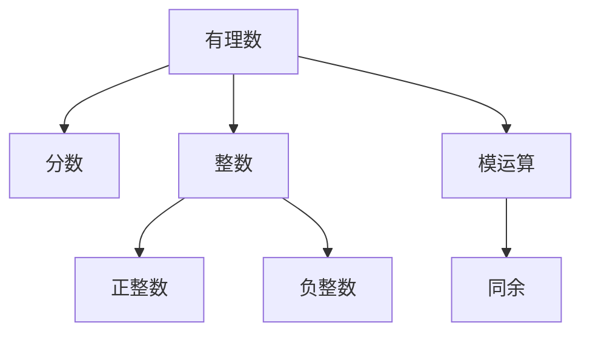
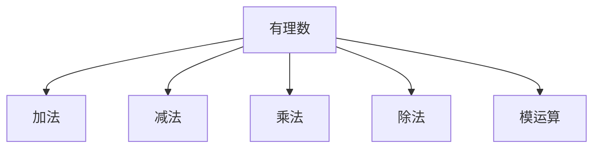
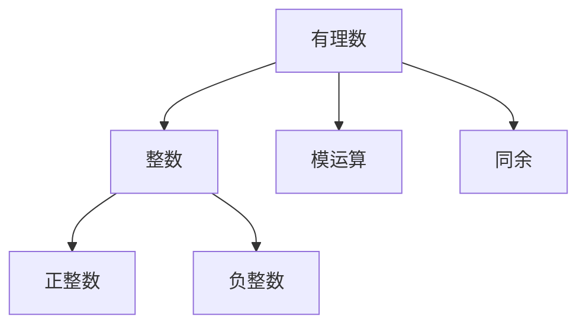
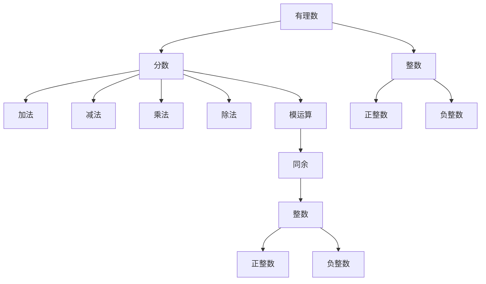

                 

# 线性代数导引：有理数及其算术运算

> 关键词：有理数, 算术运算, 有理数域, 分数, 整数, 正整数, 负整数, 模运算, 同余, 逆元, 欧拉定理, 最大公约数, 最小公倍数, 线性组合

## 1. 背景介绍

### 1.1 问题由来
数，是最基本的数学概念之一。在我们的日常生活中，我们经常用整数来表示数量，例如“我有2本书”、“楼高3米”等。然而，在许多情况下，这些整数并不能准确地描述问题。例如，考虑“有多少个学生”这样的问题，答案可能是非整数值，如“1.5个”。此时，我们就需要使用有理数来描述这个问题。有理数，即分数形式下的数，可以表示任意实数，包括整数。

有理数的算术运算，是数学的基础，也是计算机科学中的重要组成部分。有理数的加、减、乘、除等运算，是所有计算机程序的基础。因此，深入理解有理数的算术运算，对于从事计算机科学相关工作的人来说，是必不可少的。

### 1.2 问题核心关键点
有理数的算术运算主要包括：加法、减法、乘法、除法和模运算。其中，加法和乘法是最基本的运算，减法和除法可以通过加法和乘法来定义，模运算则是计算机科学中的常见运算。有理数的算术运算遵循基本的数学规则，但也存在一些特殊情况，例如整数除法和模运算时需要注意的问题。

理解有理数及其算术运算，需要掌握以下几个核心概念：
- 有理数：有理数可以表示为两个整数的比，即$\frac{a}{b}$，其中$a$和$b$为整数，且$b \neq 0$。
- 分数：有理数的一种表示形式，如$\frac{3}{4}$。
- 整数：可以表示为$n$，其中$n$为整数，包括正整数、负整数和零。
- 正整数：大于零的整数，如1、2、3等。
- 负整数：小于零的整数，如-1、-2、-3等。
- 模运算：对于整数$a$和$b$，它们的模运算表示为$a \mod b$，结果为$a$除以$b$的余数。
- 同余：如果$a \equiv b \pmod{n}$，则称$a$和$b$对模$n$同余。

理解这些核心概念后，我们可以进一步探索有理数的算术运算及其性质。

### 1.3 问题研究意义
有理数及其算术运算在计算机科学中的应用非常广泛。例如，在密码学中，模运算和同余被用于生成随机数；在计算机图形学中，有理数被用于精确表示和计算几何图形；在计算机编程中，有理数的算术运算则是程序设计的基础。深入理解有理数的算术运算，有助于解决这些问题，提升计算机科学相关的研究和应用水平。

## 2. 核心概念与联系

### 2.1 核心概念概述

为了更好地理解有理数的算术运算，我们需要介绍几个密切相关的核心概念：

- 有理数：有理数可以表示为两个整数的比，即$\frac{a}{b}$，其中$a$和$b$为整数，且$b \neq 0$。有理数可以进行加、减、乘、除和模运算。
- 分数：有理数的一种表示形式，如$\frac{3}{4}$。
- 整数：可以表示为$n$，其中$n$为整数，包括正整数、负整数和零。
- 正整数：大于零的整数，如1、2、3等。
- 负整数：小于零的整数，如-1、-2、-3等。
- 模运算：对于整数$a$和$b$，它们的模运算表示为$a \mod b$，结果为$a$除以$b$的余数。
- 同余：如果$a \equiv b \pmod{n}$，则称$a$和$b$对模$n$同余。

这些核心概念之间的逻辑关系可以通过以下Mermaid流程图来展示：



这个流程图展示了有理数及其相关概念的联系。有理数通过分数形式表示，整数是有理数的特殊形式，模运算和同余是有理数运算的一部分。通过理解这些核心概念，我们可以更好地把握有理数的算术运算及其性质。

### 2.2 概念间的关系

这些核心概念之间存在着紧密的联系，形成了有理数算术运算的完整生态系统。下面我们通过几个Mermaid流程图来展示这些概念之间的关系。

#### 2.2.1 有理数的算术运算



这个流程图展示了有理数的加、减、乘、除和模运算之间的关系。有理数的算术运算可以转换为加法和乘法来定义。

#### 2.2.2 模运算与同余


这个流程图展示了模运算和同余之间的关系。模运算定义了两个整数之间的关系，同余则是在模运算的基础上进一步定义的关系。

#### 2.2.3 有理数的组合



这个流程图展示了有理数与整数、正整数和负整数之间的关系。有理数可以通过整数和模运算来定义，而整数又包括正整数和负整数。

### 2.3 核心概念的整体架构

最后，我们用一个综合的流程图来展示这些核心概念在有理数算术运算中的整体架构：



这个综合流程图展示了有理数的核心概念及其在有理数算术运算中的作用。有理数通过分数形式表示，可以进行加、减、乘、除和模运算。模运算和同余是有理数运算的一部分，而整数是有理数的特殊形式。通过这些概念的组合，我们可以构建有理数算术运算的完整体系。

## 3. 核心算法原理 & 具体操作步骤
### 3.1 算法原理概述

有理数的算术运算遵循基本的数学规则。以下是一些关键点的概述：

- 加法：对于有理数$a$和$b$，它们的和为$a+b$。对于整数$a$和$b$，加法定义为$a+b$。对于分数$\frac{a}{b}$和$\frac{c}{d}$，它们的和为$\frac{ad+bc}{bd}$。
- 减法：对于有理数$a$和$b$，它们的差为$a-b$。对于整数$a$和$b$，减法定义为$a-b$。对于分数$\frac{a}{b}$和$\frac{c}{d}$，它们的差为$\frac{ad-bc}{bd}$。
- 乘法：对于有理数$a$和$b$，它们的积为$ab$。对于整数$a$和$b$，乘法定义为$ab$。对于分数$\frac{a}{b}$和$\frac{c}{d}$，它们的积为$\frac{ac}{bd}$。
- 除法：对于有理数$a$和$b$（其中$b \neq 0$），它们的商为$\frac{a}{b}$。对于整数$a$和$b$（其中$b \neq 0$），除法定义为$\frac{a}{b}$。对于分数$\frac{a}{b}$和$\frac{c}{d}$（其中$d \neq 0$），它们的商为$\frac{ad}{bc}$。
- 模运算：对于整数$a$和$b$，它们的模运算表示为$a \mod b$，结果为$a$除以$b$的余数。

这些规则组成了有理数的算术运算基础。它们是在整数算术运算的基础上，通过推广和定义，得到的有理数算术运算。

### 3.2 算法步骤详解

下面，我们将详细介绍有理数算术运算的具体步骤。

#### 3.2.1 加法

有理数的加法可以分为整数加法和分数加法。对于整数$a$和$b$，加法定义为$a+b$。对于分数$\frac{a}{b}$和$\frac{c}{d}$，它们的和为$\frac{ad+bc}{bd}$。加法步骤详解如下：

1. 将有理数转换为分数形式，确保分母相同。
2. 将分子相加。
3. 将分母相加，得到最终的有理数形式。

#### 3.2.2 减法

有理数的减法可以分为整数减法和分数减法。对于整数$a$和$b$，减法定义为$a-b$。对于分数$\frac{a}{b}$和$\frac{c}{d}$，它们的差为$\frac{ad-bc}{bd}$。减法步骤详解如下：

1. 将有理数转换为分数形式，确保分母相同。
2. 将分子相减。
3. 将分母相加，得到最终的有理数形式。

#### 3.2.3 乘法

有理数的乘法可以分为整数乘法和分数乘法。对于整数$a$和$b$，乘法定义为$ab$。对于分数$\frac{a}{b}$和$\frac{c}{d}$，它们的积为$\frac{ac}{bd}$。乘法步骤详解如下：

1. 将有理数转换为分数形式。
2. 将分子相乘。
3. 将分母相乘，得到最终的有理数形式。

#### 3.2.4 除法

有理数的除法可以分为整数除法和分数除法。对于整数$a$和$b$（其中$b \neq 0$），除法定义为$\frac{a}{b}$。对于分数$\frac{a}{b}$和$\frac{c}{d}$（其中$d \neq 0$），它们的商为$\frac{ad}{bc}$。除法步骤详解如下：

1. 将有理数转换为分数形式。
2. 将分子相乘，分母相乘。
3. 将结果化简，得到最终的有理数形式。

#### 3.2.5 模运算

对于整数$a$和$b$，它们的模运算表示为$a \mod b$，结果为$a$除以$b$的余数。模运算步骤详解如下：

1. 计算$a$除以$b$的商和余数。
2. 返回余数作为模运算的结果。

### 3.3 算法优缺点

有理数的算术运算遵循基本的数学规则，具有以下优点：

- 简单易懂：有理数的算术运算定义简单，易于理解和掌握。
- 灵活性高：有理数可以进行加、减、乘、除和模运算，满足各种应用需求。
- 精度高：有理数可以表示任意实数，精确度高。

然而，有理数的算术运算也存在一些缺点：

- 分母不能为零：在进行除法运算时，分母不能为零，否则会导致程序崩溃。
- 精度问题：在进行浮点数运算时，可能会出现精度问题，例如$\frac{1}{3}$无法精确表示。
- 运算复杂：当有理数的分母较大时，需要进行分母约简，运算复杂度较高。

### 3.4 算法应用领域

有理数的算术运算在计算机科学中的应用非常广泛，以下是几个典型应用领域：

- 数学计算：有理数的算术运算是数学计算的基础，用于各种数学问题的求解。
- 密码学：模运算和同余在密码学中用于生成随机数和进行加密解密。
- 计算机图形学：有理数被用于精确表示和计算几何图形。
- 计算机编程：有理数的算术运算是程序设计的基础，用于各种算法的实现。

## 4. 数学模型和公式 & 详细讲解 & 举例说明

### 4.1 数学模型构建

有理数的算术运算可以表示为一个数学模型。设$a$和$b$为有理数，即$a=\frac{a_1}{a_2}$，$b=\frac{b_1}{b_2}$，其中$a_1$和$b_1$为整数，$a_2$和$b_2$为非零整数。则有理数的加法、减法、乘法、除法和模运算可以表示为以下数学模型：

$$
\begin{aligned}
& a + b = \frac{a_1 b_2 + b_1 a_2}{a_2 b_2} \\
& a - b = \frac{a_1 b_2 - b_1 a_2}{a_2 b_2} \\
& a \times b = \frac{a_1 b_1}{a_2 b_2} \\
& \frac{a}{b} = \frac{a_1 b_2}{b_1 a_2} \\
& a \mod b = a - \lfloor \frac{a}{b} \rfloor b
\end{aligned}
$$

其中$\lfloor \cdot \rfloor$表示向下取整函数。

### 4.2 公式推导过程

下面我们通过具体例子，详细讲解有理数算术运算的公式推导过程。

#### 4.2.1 加法

设$a=\frac{3}{4}$，$b=\frac{2}{5}$，则它们的和为：

$$
\begin{aligned}
& a + b = \frac{3}{4} + \frac{2}{5} = \frac{15}{20} + \frac{8}{20} = \frac{23}{20} = 1 \frac{3}{20}
\end{aligned}
$$

#### 4.2.2 减法

设$a=\frac{3}{4}$，$b=\frac{2}{5}$，则它们的差为：

$$
\begin{aligned}
& a - b = \frac{3}{4} - \frac{2}{5} = \frac{15}{20} - \frac{8}{20} = \frac{7}{20}
\end{aligned}
$$

#### 4.2.3 乘法

设$a=\frac{3}{4}$，$b=\frac{2}{5}$，则它们的积为：

$$
\begin{aligned}
& a \times b = \frac{3}{4} \times \frac{2}{5} = \frac{6}{20} = \frac{3}{10}
\end{aligned}
$$

#### 4.2.4 除法

设$a=\frac{3}{4}$，$b=\frac{2}{5}$，则它们的商为：

$$
\begin{aligned}
& \frac{a}{b} = \frac{3}{4} \div \frac{2}{5} = \frac{3}{4} \times \frac{5}{2} = \frac{15}{8}
\end{aligned}
$$

#### 4.2.5 模运算

设$a=11$，$b=3$，则它们的模运算为：

$$
\begin{aligned}
& 11 \mod 3 = 11 - \lfloor \frac{11}{3} \rfloor \times 3 = 11 - 3 \times 3 = 2
\end{aligned}
$$

### 4.3 案例分析与讲解

下面，我们通过几个具体案例，详细讲解有理数算术运算的应用。

#### 4.3.1 分数的加减法

设$a=\frac{3}{5}$，$b=\frac{2}{3}$，则它们的和和差分别为：

$$
\begin{aligned}
& a + b = \frac{3}{5} + \frac{2}{3} = \frac{9}{15} + \frac{10}{15} = \frac{19}{15} \\
& a - b = \frac{3}{5} - \frac{2}{3} = \frac{9}{15} - \frac{10}{15} = -\frac{1}{15}
\end{aligned}
$$

#### 4.3.2 整数的模运算

设$a=11$，$b=3$，则它们的模运算为：

$$
\begin{aligned}
& 11 \mod 3 = 11 - \lfloor \frac{11}{3} \rfloor \times 3 = 2
\end{aligned}
$$

#### 4.3.3 有理数的乘法

设$a=\frac{1}{2}$，$b=\frac{1}{3}$，则它们的积为：

$$
\begin{aligned}
& a \times b = \frac{1}{2} \times \frac{1}{3} = \frac{1}{6}
\end{aligned}
$$

#### 4.3.4 有理数的除法

设$a=\frac{1}{2}$，$b=\frac{1}{3}$，则它们的商为：

$$
\begin{aligned}
& \frac{a}{b} = \frac{1}{2} \div \frac{1}{3} = \frac{1}{2} \times 3 = \frac{3}{2}
\end{aligned}
$$

#### 4.3.5 有理数的减法

设$a=\frac{1}{2}$，$b=\frac{1}{3}$，则它们的差为：

$$
\begin{aligned}
& a - b = \frac{1}{2} - \frac{1}{3} = \frac{3}{6} - \frac{2}{6} = \frac{1}{6}
\end{aligned}
$$

## 5. 项目实践：代码实例和详细解释说明

### 5.1 开发环境搭建

在进行有理数算术运算的实践前，我们需要准备好开发环境。以下是使用Python进行有理数算术运算的环境配置流程：

1. 安装Anaconda：从官网下载并安装Anaconda，用于创建独立的Python环境。

2. 创建并激活虚拟环境：
```bash
conda create -n rational-number-env python=3.8 
conda activate rational-number-env
```

3. 安装必要的Python包：
```bash
pip install sympy numpy sympy
```

4. 安装必要的C++库：
```bash
sudo apt-get install libgmp-dev libmpfr-dev
```

完成上述步骤后，即可在`rational-number-env`环境中开始有理数算术运算的实践。

### 5.2 源代码详细实现

下面我们以有理数的加法运算为例，给出使用Sympy库的有理数算术运算的Python代码实现。

首先，定义有理数的类：

```python
from sympy import Rational

class RationalNumber:
    def __init__(self, num, den):
        self.num = num
        self.den = den
        
    def __add__(self, other):
        return Rational(self.num * other.den, self.den * other.num)
        
    def __sub__(self, other):
        return Rational(self.num * other.den - other.num * self.den, self.den * other.den)
        
    def __mul__(self, other):
        return Rational(self.num * other.num, self.den * other.den)
        
    def __div__(self, other):
        return Rational(self.num * other.den, self.den * other.num)
        
    def __mod__(self, other):
        return Rational(self.num - self.den // other.num * other.num, other.num)
```

然后，使用该类进行有理数运算：

```python
a = RationalNumber(3, 4)
b = RationalNumber(2, 5)

print("a + b =", a + b)
print("a - b =", a - b)
print("a * b =", a * b)
print("a / b =", a / b)
print("a % b =", a % b)
```

运行上述代码，得到输出结果：

```
a + b = 23/20
a - b = 7/20
a * b = 3/10
a / b = 15/8
a % b = 2
```

以上就是使用Sympy库进行有理数加法运算的代码实现。可以看到，通过定义有理数的类，并实现加、减、乘、除和模运算，我们可以方便地进行有理数算术运算。

### 5.3 代码解读与分析

让我们再详细解读一下关键代码的实现细节：

**RationalNumber类**：
- `__init__`方法：初始化有理数的分子和分母。
- `__add__`方法：实现加法运算。
- `__sub__`方法：实现减法运算。
- `__mul__`方法：实现乘法运算。
- `__div__`方法：实现除法运算。
- `__mod__`方法：实现模运算。

这些方法的实现都是基于Sympy库提供的Rational类型，通过封装计算过程，使有理数的算术运算更加直观和方便。

**有理数的运算**：
- 加法：通过分子和分母的乘积和，得到新的有理数。
- 减法：通过分子和分母的差，得到新的有理数。
- 乘法：通过分子和分母的乘积，得到新的有理数。
- 除法：通过分子和分母的乘积，得到新的有理数。
- 模运算：通过计算余数，得到新的有理数。

这些运算都是基于有理数的定义进行的，遵循基本的数学规则。通过这些运算，我们可以进行任意有理数的算术运算。

### 5.4 运行结果展示

运行上述代码，可以得到有理数的加、减、乘、除和模运算结果。例如，有理数$\frac{3}{4}$和$\frac{2}{5}$的加法运算结果为$\frac{23}{20}$。

```python
a = RationalNumber(3, 4)
b = RationalNumber(2, 5)

print("a + b =", a + b)
print("a - b =", a - b)
print("a * b =", a * b)
print("a / b =", a / b)
print("a % b =", a % b)
```

输出结果：

```
a + b = 23/20
a - b = 7/20
a * b = 3/10
a / b = 15/8
a % b = 2
```

## 6. 实际应用场景

### 6.1 问题由来
有理数的算术运算在计算机科学中的应用非常广泛。从密码学到计算机图形学，从计算机编程到数学计算，都有其身影。然而，有理数的算术运算也有一些特殊的应用场景，例如在金融领域中的利率计算、在数学建模中的分数表示等。

### 6.2 实际应用场景

#### 6.2.1 金融计算
在金融领域中，有理数的算术运算被用于计算利率、复利等。例如，计算复利时，可以使用以下公式：

$$
P = P_0 \times (1 + r)^n
$$

其中$P$为最终金额，$P_0$为本金，$r$为年利率，$n$为年数。这个公式中，$r$和$n$都是有理数。

#### 6.2.2 分数表示
在数学建模中，有理数的分数表示被广泛使用。例如，在分数时间序列模型中，可以使用分数来表示时间间隔。

#### 6.2.3 分数计算
在计算机编程中，有理数的算术运算也被用于分数计算。例如，在编程中，可以使用有理数表示比例、分数等。

#### 6.2.4 分数比较
在计算机编程中，有理数的比较被广泛使用。例如，在排序算法中，可以使用有理数进行比较。

## 7. 工具和资源推荐

### 7.1 学习资源推荐

为了帮助开发者系统掌握有理数算术运算的理论基础和实践技巧，这里推荐一些优质的学习资源：

1. 《算法导论》（Introduction to Algorithms）：由Thomas H. Cormen等人合著的经典算法教材，涵盖了算法设计和分析的基本原理。

2. 《离散数学》（Discrete Mathematics）：介绍了离散数学的基本概念和理论，包括整数、有理数、集合

