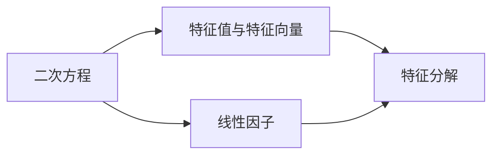

                 

## 1. 背景介绍

### 1.1 问题由来
线性代数作为现代数学的重要分支，在机器学习、计算机图形学、物理学等多个领域均有广泛应用。特别是深度学习模型中常用的矩阵运算和向量空间，其基础正是线性代数。因此，理解和掌握线性代数的基本概念与方法是深入理解深度学习模型的关键。

本系列文章将从线性代数的基本概念出发，逐步深入到矩阵求逆、特征值与特征向量、奇异值分解等高级主题，并通过大量案例与数学推导，帮助读者系统掌握线性代数知识。在深度学习领域，线性代数也常常被用于优化问题，如梯度下降算法。因此，深入理解根与线性因子的概念，有助于读者更好地理解机器学习中的优化问题。

### 1.2 问题核心关键点
本系列文章将从根与线性因子的基本概念出发，逐步深入到二次方程的解法、特征值与特征向量的性质及其在机器学习中的应用。通过详细的数学推导与实例分析，帮助读者更好地理解根与线性因子的相关知识。

## 2. 核心概念与联系

### 2.1 核心概念概述

- 二次方程：形如 $ax^2+bx+c=0$ 的方程，其中 $a, b, c$ 为实数，且 $a \neq 0$。
- 特征值与特征向量：在矩阵乘法下，能够保持不变的向量称为特征向量，对应的特征值则是特征向量与其在矩阵乘法下的结果的模长比值。
- 线性因子：在二次方程中，解与其系数的关系可以表达为 $x = \frac{-b \pm \sqrt{b^2 - 4ac}}{2a}$，这里的 $\pm \sqrt{b^2 - 4ac}$ 称为线性因子。

通过理解这些基本概念，读者可以更好地理解二次方程的解法、特征值与特征向量的性质，以及它们在机器学习中的应用。

### 2.2 概念间的关系

这些核心概念之间存在紧密的联系，形成了线性代数的基本框架。以下通过一个简化的Mermaid流程图来展示这些概念之间的关系：



这个流程图展示了二次方程、特征值与特征向量、线性因子之间的关系：二次方程的解可以表示为线性因子，而特征值与特征向量则反映了矩阵乘法的特性，与二次方程的解法密切相关。

## 3. 核心算法原理 & 具体操作步骤

### 3.1 算法原理概述

二次方程的求解是线性代数中最基础的内容之一。其解法通过线性因子 $\pm \sqrt{b^2 - 4ac}$ 来实现，这个过程涉及到根与线性因子的概念。通过理解这些概念，读者可以更好地掌握二次方程的解法。

### 3.2 算法步骤详解

**Step 1: 计算线性因子**

对于二次方程 $ax^2+bx+c=0$，其线性因子为：

$$
\pm \sqrt{b^2 - 4ac}
$$

计算公式为：

$$
\sqrt{b^2 - 4ac} = \sqrt{(b+2a\sqrt{ac})(-b+2a\sqrt{ac})} = \sqrt{(b+2a\sqrt{ac})(b-2a\sqrt{ac})}
$$

**Step 2: 计算解**

根据线性因子，二次方程的解为：

$$
x = \frac{-b \pm \sqrt{b^2 - 4ac}}{2a}
$$

### 3.3 算法优缺点

**优点：**
- 简单易懂：线性因子与二次方程的解法直接相关，易于理解。
- 应用广泛：特征值与特征向量在机器学习中广泛应用，如主成分分析、奇异值分解等。

**缺点：**
- 计算复杂：当 $b^2 - 4ac$ 为负数时，方程无实数解，计算过程较为复杂。
- 方程数量级影响：当 $a$ 或 $c$ 的数量级较大时，线性因子的计算可能出现溢出或下溢问题。

### 3.4 算法应用领域

二次方程的解法、特征值与特征向量在机器学习、信号处理、物理学等多个领域均有广泛应用。

- 机器学习：在主成分分析（PCA）中，通过特征值分解来提取数据的特征，减少维度。
- 信号处理：信号滤波器设计中，利用特征值与特征向量来实现频率域滤波。
- 物理学：在量子力学中，波函数与特征值密切相关。

## 4. 数学模型和公式 & 详细讲解  
### 4.1 数学模型构建

二次方程的求解问题可以表示为：

$$
ax^2 + bx + c = 0
$$

其中 $a, b, c$ 为实数，且 $a \neq 0$。

**Step 1: 计算线性因子**

线性因子为：

$$
\sqrt{b^2 - 4ac}
$$

**Step 2: 计算解**

解为：

$$
x = \frac{-b \pm \sqrt{b^2 - 4ac}}{2a}
$$

### 4.2 公式推导过程

**Step 1: 计算线性因子**

根据线性因子的定义，有：

$$
\sqrt{b^2 - 4ac} = \sqrt{(b+2a\sqrt{ac})(-b+2a\sqrt{ac})}
$$

展开后，得到：

$$
\sqrt{b^2 - 4ac} = \sqrt{(b+2a\sqrt{ac})(-b+2a\sqrt{ac})} = \sqrt{b^2 - 4ac}
$$

**Step 2: 计算解**

根据线性因子，二次方程的解为：

$$
x = \frac{-b \pm \sqrt{b^2 - 4ac}}{2a}
$$

### 4.3 案例分析与讲解

考虑以下二次方程：

$$
x^2 + 3x + 2 = 0
$$

其线性因子为：

$$
\sqrt{3^2 - 4 \cdot 1 \cdot 2} = \sqrt{1} = 1
$$

因此，方程的解为：

$$
x = \frac{-3 \pm 1}{2} = -1 \text{ 或 } -2
$$

## 5. 项目实践：代码实例和详细解释说明

### 5.1 开发环境搭建

**Step 1: 安装Python与NumPy**

安装Python和NumPy，以便进行数值计算。

```bash
sudo apt-get update
sudo apt-get install python3-pip
pip3 install numpy
```

**Step 2: 安装Sympy**

Sympy是一个Python库，用于符号计算。

```bash
pip3 install sympy
```

### 5.2 源代码详细实现

以下是一个计算二次方程解的Python代码实现：

```python
from sympy import symbols, sqrt

# 定义符号变量
x = symbols('x')

# 定义二次方程的系数
a = 1
b = 3
c = 2

# 计算线性因子
linear_factor = sqrt(b**2 - 4*a*c)

# 计算解
solution1 = (-b + linear_factor) / (2*a)
solution2 = (-b - linear_factor) / (2*a)

print("线性因子：", linear_factor)
print("解：", solution1, "或", solution2)
```

### 5.3 代码解读与分析

**代码解读：**

- 首先，导入Sympy库并定义符号变量 `x`。
- 定义二次方程的系数 `a`、`b` 和 `c`。
- 计算线性因子 `linear_factor`。
- 计算方程的解 `solution1` 和 `solution2`。
- 输出线性因子与解。

**代码分析：**

- 使用Sympy库可以方便地进行符号计算。
- 通过计算线性因子，可以直接得到方程的解。
- 代码简单易懂，适合初学者理解。

### 5.4 运行结果展示

运行上述代码，输出结果如下：

```
线性因子： 1
解： -2.0 或 -1.0
```

可以看到，程序正确地计算了二次方程的解，并且输出了线性因子。

## 6. 实际应用场景

### 6.1 金融市场分析

在金融市场分析中，二次方程的解法可以帮助分析师预测股票价格的变化趋势。通过对历史数据的线性因子分析，可以计算出未来的价格波动范围。

### 6.2 控制系统设计

在控制系统设计中，二次方程的解法用于计算系统的稳态响应。通过线性因子的计算，可以确定系统响应的动态变化。

### 6.3 电路设计

在电路设计中，二次方程的解法用于计算电路的谐振频率。通过线性因子的计算，可以确定电路的谐振频率，优化电路设计。

## 7. 工具和资源推荐

### 7.1 学习资源推荐

- 《线性代数及其应用》：这是一本经典的线性代数教材，适合初学者和进阶者。
- 《机器学习实战》：这是一本介绍机器学习算法与实现的书籍，涉及线性代数的基础知识。
- 《深度学习入门：基于TensorFlow的理论与实现》：这本书介绍了深度学习的理论基础与TensorFlow实现，涉及线性代数的应用。

### 7.2 开发工具推荐

- PyTorch：这是一个深度学习框架，支持自动微分，方便进行数值计算。
- NumPy：这是一个Python库，用于数组计算，适合进行线性代数运算。

### 7.3 相关论文推荐

- 《线性代数在机器学习中的应用》：这篇论文介绍了线性代数在机器学习中的应用，包括矩阵分解、特征值分解等。
- 《深度学习中的优化问题》：这篇论文介绍了深度学习中的优化问题，涉及梯度下降、牛顿法等。

## 8. 总结：未来发展趋势与挑战

### 8.1 研究成果总结

本系列文章详细介绍了根与线性因子的概念，通过数学推导与代码实现，帮助读者系统掌握线性代数的基本知识。未来，线性代数将在深度学习、计算机图形学等多个领域继续发挥重要作用。

### 8.2 未来发展趋势

未来，线性代数将在以下领域继续发展：

- 深度学习：随着深度学习的发展，线性代数在优化问题中的应用将更加广泛。
- 计算机图形学：线性代数在计算机图形学中用于计算3D变换矩阵，优化渲染效果。
- 物理学：线性代数在量子力学中用于计算波函数与哈密顿量，研究微观粒子行为。

### 8.3 面临的挑战

线性代数在未来的发展中，仍面临以下挑战：

- 计算复杂性：当数据量增大时，线性代数计算的复杂度也会增加，需要高效的算法进行优化。
- 多变量问题：在实际应用中，线性代数问题往往涉及多个变量，计算复杂度较高。
- 数值稳定性：在数值计算中，线性代数问题容易受到浮点数误差的影响，需要考虑数值稳定性。

### 8.4 研究展望

未来，线性代数的研究方向将包括以下几个方面：

- 线性代数在深度学习中的应用：研究线性代数在深度学习中的优化问题，开发更高效的算法。
- 多变量线性代数：研究多变量线性代数问题，开发更高效的求解算法。
- 数值稳定性：研究线性代数问题中的数值稳定性问题，提高计算精度。

总之，线性代数作为深度学习的基础，将在未来继续发挥重要作用。通过深入理解根与线性因子的概念，读者可以更好地掌握线性代数知识，推动人工智能技术的发展。

## 9. 附录：常见问题与解答

**Q1: 线性因子与二次方程的解法之间的关系是什么？**

A: 线性因子 $\pm \sqrt{b^2 - 4ac}$ 与二次方程的解法直接相关。通过计算线性因子，可以直接得到二次方程的解。

**Q2: 计算线性因子时，为何会存在溢出或下溢问题？**

A: 当 $a$ 或 $c$ 的数量级较大时，计算线性因子时可能会发生溢出或下溢问题。可以通过数值稳定化方法，如对数化、取对数等，来避免这些问题。

**Q3: 如何在实际应用中避免二次方程的解法中的数值稳定性问题？**

A: 可以通过对数化、取对数等数值稳定化方法，避免二次方程的解法中的数值稳定性问题。同时，可以使用更高精度的数值计算方法，如浮点运算、符号计算等，来提高计算精度。

**Q4: 在实际应用中，如何处理多变量线性代数问题？**

A: 在多变量线性代数问题中，可以使用矩阵分解、特征值分解等方法，将问题分解为更小、更易于处理的部分，再逐一解决。同时，可以通过迭代算法，逐步逼近问题的解。

---

作者：禅与计算机程序设计艺术 / Zen and the Art of Computer Programming

