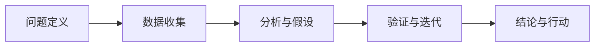
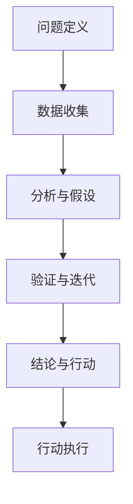

                 

## 1. 背景介绍

### 1.1 问题由来

在现代信息爆炸的时代，人们面对复杂多变的任务和问题，需要高效、系统的思维方式来快速组织、分析和解决问题。传统线性思维模式往往难以应对多维度、非线性的问题，而结构化思维则通过明确的步骤、条理清晰的逻辑链条，有效帮助人们理清思路，提升解决问题的效率。本文将深入探讨结构化思维的原理、操作流程及其应用，助力读者提升思维能力，从而在复杂环境中游刃有余。

### 1.2 问题核心关键点

结构化思维的核心在于通过明确的步骤和条理清晰的逻辑链条，将复杂问题分解为可管理、可执行的小部分，逐步解决。其核心关键点包括：
1. **问题定义**：明确问题性质和范围，避免过度泛化。
2. **数据收集**：系统收集与问题相关的信息和数据，构建数据模型。
3. **分析与假设**：根据数据模型，提出假设和理论模型。
4. **验证与迭代**：通过实验或逻辑推理验证假设，必要时进行迭代改进。
5. **结论与行动**：总结结论，制定可执行的行动方案。

### 1.3 问题研究意义

掌握结构化思维，有助于个人在面对复杂问题时，能够迅速理清思路，制定合理的解决方案，提升工作效率。对于企业而言，结构化思维在项目管理、产品开发、市场分析等多个环节都能起到关键作用，有助于提升团队协作效率和决策质量。本文旨在深入解析结构化思维的方法论，并结合具体案例，帮助读者系统掌握结构化思维的应用技巧，从而提升思维和解决问题的能力。

## 2. 核心概念与联系

### 2.1 核心概念概述

为更好地理解结构化思维，我们需要先介绍几个关键概念：
1. **问题定义**：明确问题性质和范围的过程。
2. **数据收集**：系统收集与问题相关的信息和数据。
3. **分析与假设**：根据数据模型，提出假设和理论模型。
4. **验证与迭代**：通过实验或逻辑推理验证假设，必要时进行迭代改进。
5. **结论与行动**：总结结论，制定可执行的行动方案。

这些核心概念通过逻辑链条相互联系，构成了结构化思维的核心框架。

### 2.2 概念间的关系

这些核心概念之间的关系可以通过以下Mermaid流程图来展示：



这个流程图展示了大问题解决的核心步骤，从问题定义到最终行动的完整流程。

### 2.3 核心概念的整体架构

最后，我们用一个综合的流程图来展示这些核心概念在大问题解决过程中的整体架构：



这个综合流程图展示了从问题定义到最终行动的完整架构，每个步骤都是相互关联的。

## 3. 核心算法原理 & 具体操作步骤

### 3.1 算法原理概述

结构化思维的算法原理基于系统化、条理化的逻辑链条，将复杂问题分解为可管理、可执行的小部分，逐步解决。其核心在于：
1. **分解问题**：将大问题分解为若干小问题，逐一解决。
2. **逻辑推理**：基于数据和假设，进行逻辑推理和分析。
3. **实验验证**：通过实验或逻辑推理验证假设，确保结论的准确性。
4. **迭代优化**：在验证过程中，根据结果不断调整假设和推理过程，进行迭代优化。

### 3.2 算法步骤详解

结构化思维的具体操作步骤如下：
1. **问题定义**：明确问题性质和范围，定义问题边界。
2. **数据收集**：收集与问题相关的信息和数据，构建数据模型。
3. **分析与假设**：根据数据模型，提出假设和理论模型。
4. **验证与迭代**：通过实验或逻辑推理验证假设，必要时进行迭代改进。
5. **结论与行动**：总结结论，制定可执行的行动方案。

### 3.3 算法优缺点

结构化思维的优点包括：
1. **系统性**：通过分解问题，条理清晰地处理复杂任务，避免遗漏关键信息。
2. **可操作性**：每一步都有明确的步骤和目标，易于执行和验证。
3. **灵活性**：通过假设和迭代，适应不同的数据和情况。

缺点主要包括：
1. **时间成本**：分解和验证步骤可能耗时较长。
2. **资源需求**：需要系统收集和处理大量数据，可能面临资源限制。
3. **复杂性**：对于极端复杂的问题，步骤可能过于繁琐。

### 3.4 算法应用领域

结构化思维广泛应用于项目管理、产品开发、市场分析、数据分析、决策制定等多个领域。例如：
- **项目管理**：通过分解任务、明确责任，提升项目执行效率和质量。
- **产品开发**：通过需求分析、市场调研、用户反馈，逐步迭代产品设计，提升用户体验。
- **市场分析**：通过数据收集、分析与假设，制定市场策略，提升企业竞争力。

## 4. 数学模型和公式 & 详细讲解  
### 4.1 数学模型构建

结构化思维的数学模型通常涉及数据收集、分析和推理等多个环节，以下以一个简单的数据分析为例：
- **问题定义**：研究某商品的市场需求。
- **数据收集**：收集历史销售数据、市场调查数据、竞争对手信息等。
- **分析与假设**：建立市场模型，假设市场需求与价格、促销活动等因素有关。
- **验证与迭代**：通过实验数据验证假设，必要时调整模型。
- **结论与行动**：总结市场规律，制定定价策略和促销方案。

### 4.2 公式推导过程

以线性回归模型为例，假设我们有以下数据点 $(x_1, y_1), (x_2, y_2), ..., (x_n, y_n)$，其中 $x_i$ 为自变量，$y_i$ 为因变量。线性回归模型的目标是最小化误差平方和 $\sum_{i=1}^n (y_i - \hat{y}_i)^2$，其中 $\hat{y}_i$ 为预测值。假设模型为 $\hat{y} = \theta_0 + \theta_1 x$，则线性回归的目标函数为：

$$
J(\theta) = \frac{1}{2n} \sum_{i=1}^n (y_i - \theta_0 - \theta_1 x_i)^2
$$

其中 $\theta_0, \theta_1$ 为模型参数，通过最小化目标函数，求解得：

$$
\hat{\theta} = \left( \frac{1}{n} \sum_{i=1}^n x_i^2 \right)^{-1} \left( \frac{1}{n} \sum_{i=1}^n x_i y_i - \frac{1}{n} \sum_{i=1}^n x_i \left( \frac{1}{n} \sum_{i=1}^n y_i \right) \right)
$$

这个推导过程展示了如何通过数学模型和最小化目标函数，求解线性回归模型参数。

### 4.3 案例分析与讲解

以下以预测某城市房价为例，展示结构化思维的应用过程：
1. **问题定义**：预测某城市房价。
2. **数据收集**：收集历史房价数据、房屋面积、地理位置等相关信息。
3. **分析与假设**：假设房价与房屋面积、地理位置等因素有关，建立线性回归模型。
4. **验证与迭代**：通过收集新数据，验证假设，必要时调整模型参数。
5. **结论与行动**：总结房价规律，指导开发商定价。

通过结构化思维，我们能够系统地处理复杂问题，提升决策的科学性和可操作性。

## 5. 项目实践：代码实例和详细解释说明
### 5.1 开发环境搭建

结构化思维的项目实践通常涉及数据分析和建模，以下以Python和Pandas库为例，展示开发环境搭建流程：
1. 安装Python和Pandas：
```bash
pip install python
pip install pandas
```
2. 创建虚拟环境：
```bash
python -m venv env
source env/bin/activate
```
3. 准备数据集：
```python
import pandas as pd
data = pd.read_csv('house_prices.csv')
```

### 5.2 源代码详细实现

以下是一个简单的线性回归模型实现，展示了结构化思维的具体步骤：
```python
import pandas as pd
import numpy as np
from sklearn.linear_model import LinearRegression

# 读取数据集
data = pd.read_csv('house_prices.csv')

# 数据预处理
X = data[['area', 'location']]
y = data['price']

# 训练模型
model = LinearRegression()
model.fit(X, y)

# 预测新房价
new_data = pd.DataFrame({'area': [500], 'location': [2]})
new_data['price'] = model.predict(new_data)
print(new_data)
```

### 5.3 代码解读与分析

以上代码实现了线性回归模型的预测功能，展示了结构化思维的各个步骤：
1. **问题定义**：预测某城市新房源价格。
2. **数据收集**：从CSV文件读取历史房价数据。
3. **分析与假设**：假设房价与房屋面积、地理位置有关，建立线性回归模型。
4. **验证与迭代**：训练模型并进行预测，必要时调整模型参数。
5. **结论与行动**：根据预测结果，指导开发商定价。

## 6. 实际应用场景
### 6.1 项目管理

结构化思维在项目管理中广泛应用，通过明确问题、任务分解、责任分配，提升项目执行效率。例如，某大型软件项目中，使用结构化思维进行任务分解，明确开发、测试、运维等各个环节的职责和目标，显著提高了项目进展速度和质量。

### 6.2 产品开发

在产品开发过程中，结构化思维通过需求分析、市场调研、用户反馈，逐步迭代产品设计，提升用户体验。例如，某电商企业通过系统化地收集用户反馈和市场数据，利用结构化思维进行分析和验证，不断优化产品功能，提升了用户满意度和市场竞争力。

### 6.3 数据分析

数据分析过程中，结构化思维通过数据收集、分析与假设，制定市场策略，提升企业竞争力。例如，某零售公司通过收集历史销售数据和市场调查数据，利用结构化思维进行分析和验证，制定了科学的定价策略，大幅提升了销售额。

### 6.4 未来应用展望

未来，结构化思维将在更多领域得到应用，例如：
- **决策支持**：通过系统化分析，支持企业高层决策，提高决策质量。
- **智能运维**：通过结构化思维进行问题诊断和优化，提升系统稳定性。
- **个性化推荐**：通过结构化思维分析用户行为，制定个性化推荐策略，提升用户体验。

## 7. 工具和资源推荐
### 7.1 学习资源推荐

掌握结构化思维，需要系统学习相关知识和工具。以下推荐一些优质的学习资源：
1. **《系统思维导论》**：系统地介绍了系统思维的基本原理和应用方法。
2. **Coursera《系统思维与复杂性》课程**：由麻省理工学院教授开设的课程，深入浅出地讲解了系统思维的基本概念和应用技巧。
3. **《结构化思维》书籍**：详细介绍了结构化思维的方法论和操作步骤。
4. **MindTools网站**：提供了大量的系统思维工具和案例分析，适合实战练习。

### 7.2 开发工具推荐

结构化思维的开发工具主要涉及数据分析和建模，以下推荐一些常用的工具：
1. **Python**：功能强大的编程语言，广泛应用于数据分析和机器学习领域。
2. **Pandas**：用于数据处理和分析的Python库，支持大规模数据集操作。
3. **NumPy**：用于科学计算的Python库，提供了高效的数组操作和数学函数。
4. **Scikit-learn**：用于机器学习和数据建模的Python库，支持多种算法和模型。
5. **Tableau**：用于数据可视化的工具，支持复杂的数据分析过程。

### 7.3 相关论文推荐

结构化思维的研究涉及多个学科，以下推荐几篇具有代表性的论文：
1. **《系统思维与复杂性》**：阐述了系统思维的基本原理和应用方法。
2. **《结构化思维在项目管理中的应用》**：介绍了结构化思维在项目管理中的具体应用。
3. **《结构化思维与数据分析》**：探讨了结构化思维在数据分析中的应用。

## 8. 总结：未来发展趋势与挑战
### 8.1 总结

本文系统介绍了结构化思维的基本原理和操作步骤，展示了其在项目管理、产品开发、数据分析等多个领域的应用。结构化思维通过分解问题、条理清晰地处理复杂任务，帮助人们在面对复杂问题时，能够迅速理清思路，制定合理的解决方案，提升工作效率。

### 8.2 未来发展趋势

未来，结构化思维将呈现以下几个发展趋势：
1. **智能化**：结合人工智能技术，提升问题分析和决策的准确性和效率。
2. **数据驱动**：通过大数据分析，指导结构化思维的各个环节，提升决策质量。
3. **跨领域应用**：结构化思维在更多领域得到应用，提升行业整体的决策水平。

### 8.3 面临的挑战

尽管结构化思维在多个领域取得了显著成效，但仍面临以下挑战：
1. **复杂性**：结构化思维的执行步骤繁琐，对复杂问题处理较为困难。
2. **资源需求**：系统化分析需要大量数据和计算资源，可能导致资源紧张。
3. **灵活性不足**：固定步骤和模型可能难以应对极端情况和突发事件。

### 8.4 研究展望

未来，结构化思维的研究需要在以下几个方面寻求新的突破：
1. **自动化**：结合自动化技术，简化结构化思维的执行步骤，提高效率。
2. **智能化**：引入人工智能算法，提升结构化思维的智能化水平，实现智能决策。
3. **跨领域应用**：探索结构化思维在更多领域的应用，提升跨领域决策能力。

总之，结构化思维通过系统化分析，帮助人们在复杂环境中理清思路，制定合理的解决方案，提升工作效率。未来，通过结合人工智能和自动化技术，结构化思维将进一步提升决策的科学性和可操作性，成为解决复杂问题的有力工具。

## 9. 附录：常见问题与解答

**Q1：如何提升结构化思维能力？**

A: 提升结构化思维能力，可以从以下几个方面入手：
1. **系统学习**：通过阅读相关书籍和课程，系统掌握结构化思维的方法论。
2. **实践练习**：在实际工作中应用结构化思维，逐步提升应用能力。
3. **反思总结**：定期反思和总结，总结经验教训，提升思维水平。

**Q2：结构化思维是否适用于所有领域？**

A: 结构化思维适用于需要系统化分析和决策的领域，如项目管理、产品开发、数据分析等。对于需要创意和创新的领域，结构化思维需要结合其他方法，才能发挥最佳效果。

**Q3：结构化思维与创新思维的区别是什么？**

A: 结构化思维侧重于系统化分析和决策，通过条理清晰的步骤和逻辑链条，提升决策质量和效率。而创新思维侧重于创造性思考和新颖想法的产生，主要通过发散性思维和灵活应用，突破现有框架，发现新的解决方案。

**Q4：结构化思维与传统线性思维的区别是什么？**

A: 结构化思维通过分解问题，条理清晰地处理复杂任务，避免遗漏关键信息。而传统线性思维则是按部就班地解决问题，容易导致思路局限，难以应对复杂多变的任务。

**Q5：结构化思维在复杂问题处理中的优势是什么？**

A: 结构化思维的优势在于能够系统化地处理复杂问题，避免思路混乱和遗漏关键信息。通过明确的步骤和逻辑链条，结构化思维能够逐步解决问题，提升决策的科学性和可操作性。

总之，结构化思维通过系统化分析，帮助人们在复杂环境中理清思路，制定合理的解决方案，提升工作效率。掌握结构化思维，将使人们在面对复杂问题时，能够迅速理清思路，制定科学的决策方案，提升决策质量。

