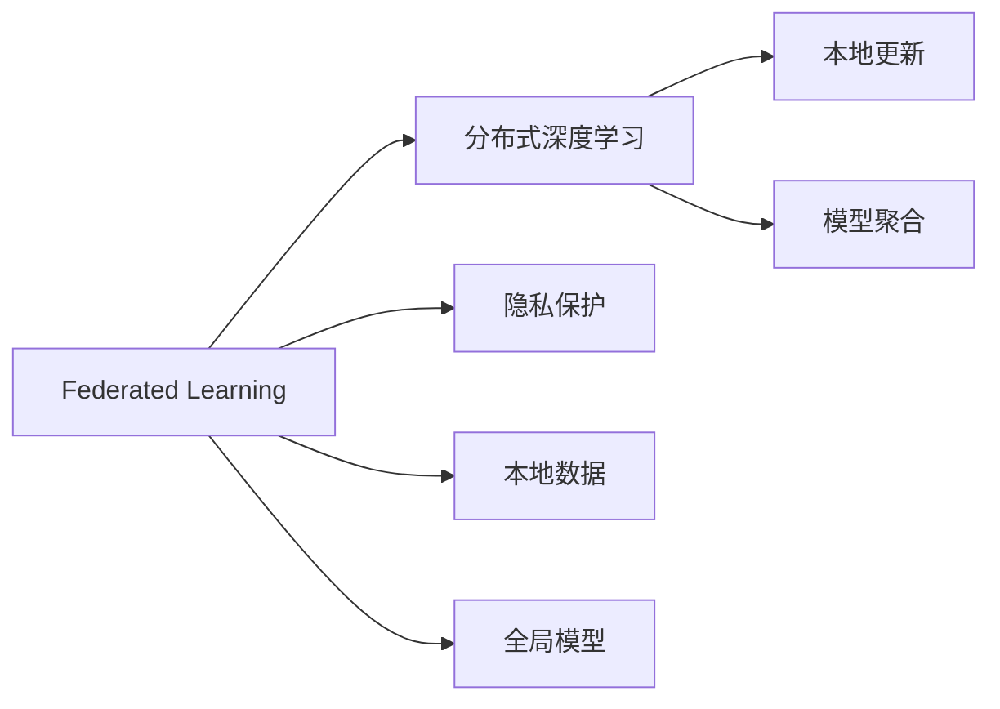
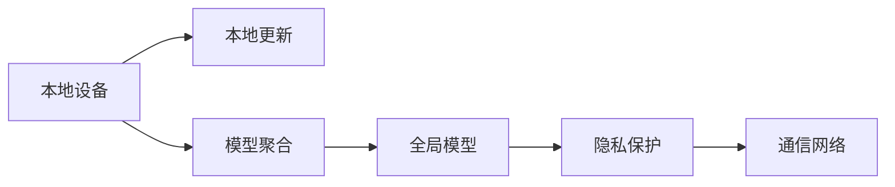

                 

# 联邦学习 原理与代码实例讲解

> 关键词：联邦学习,分布式学习,隐私保护,模型聚合,分布式深度学习

## 1. 背景介绍

### 1.1 问题由来

随着人工智能技术的快速发展，大型数据集的重要性愈发凸显。在深度学习时代，数据是决定模型性能的关键。然而，单家企业的数据量往往难以覆盖到广泛的应用场景，而共享数据又面临着隐私泄露、数据安全等诸多问题。因此，如何在数据分布式的环境下，保证模型的泛化能力和性能，同时保护数据隐私，成为了一个重要且具有挑战性的研究方向。

### 1.2 问题核心关键点

联邦学习（Federated Learning, FL）是一种新颖的分布式机器学习方法，能够在不泄露原始数据的情况下，从分布在不同设备或服务器上的本地数据集中聚合模型参数，实现全局模型的训练和优化。其核心思想是将计算资源分散至多个客户端，每个客户端拥有各自的数据，并基于本地数据进行模型更新。

联邦学习的主要目标包括：
- **分布式模型训练**：在多个分布式设备上并行训练模型，同时聚合全局模型。
- **隐私保护**：确保模型训练过程中的数据隐私，不泄露敏感信息。
- **模型聚合**：在多个本地模型之间进行参数共享，更新全局模型。

### 1.3 问题研究意义

联邦学习在保护数据隐私的同时，能够显著提升模型的泛化能力和性能。其应用广泛，涵盖移动设备、物联网、医疗、金融等多个领域。联邦学习为数据分布式、隐私保护下的模型训练提供了新的思路和方向，具有重要的理论价值和实际应用意义。

## 2. 核心概念与联系

### 2.1 核心概念概述

为了更好地理解联邦学习的原理和架构，本节将介绍几个核心概念：

- **联邦学习**：在多个分布式设备上，通过聚合本地模型参数来训练全局模型的分布式机器学习方法。
- **分布式深度学习**：在多个计算设备上，并行训练深度神经网络的分布式学习范式。
- **隐私保护**：确保在模型训练过程中，客户端数据不被泄露，保护用户隐私。
- **模型聚合**：在多个本地模型之间进行参数共享，更新全局模型。
- **本地更新**：在本地设备上，基于本地数据进行模型参数更新。
- **全局聚合**：在各个本地模型之间，通过聚合操作更新全局模型参数。

这些核心概念共同构成了联邦学习的基本框架，使其能够在多个分布式设备上高效、安全地训练模型。

### 2.2 概念间的关系

这些核心概念之间存在着紧密的联系，形成了联邦学习的完整生态系统。下面我们通过几个Mermaid流程图来展示这些概念之间的关系：



这个流程图展示了联邦学习的核心概念及其之间的关系：

1. 联邦学习基于分布式深度学习，通过多个客户端的本地模型并行训练。
2. 每个客户端在本地进行模型更新，即本地更新。
3. 客户端之间进行模型参数的聚合操作，即模型聚合。
4. 联邦学习强调隐私保护，确保数据不被泄露。
5. 联邦学习以全局模型为目标，各个客户端的数据对全局模型贡献价值。

### 2.3 核心概念的整体架构

最后，我们用一个综合的流程图来展示这些核心概念在大规模联邦学习系统中的整体架构：



这个综合流程图展示了联邦学习的整体架构，从本地设备的数据处理，到模型参数的聚合更新，再到全局模型的训练和隐私保护，每一环节都至关重要。

## 3. 核心算法原理 & 具体操作步骤
### 3.1 算法原理概述

联邦学习的核心算法原理包括以下几个关键步骤：

1. **本地模型训练**：在每个客户端设备上，基于本地数据集进行模型训练，得到本地模型参数。
2. **参数聚合**：通过聚合操作，将各个客户端的本地模型参数更新为全局模型参数。
3. **模型优化**：在全局模型上继续进行迭代优化，更新模型参数，以提升模型性能。

具体而言，联邦学习的算法流程如下：

1. **初始化全局模型**：随机初始化全局模型参数 $\theta$。
2. **本地模型训练**：每个客户端设备 $i$ 基于本地数据集 $D_i$ 进行 $k$ 轮迭代，得到本地模型参数 $\theta_i^k$。
3. **模型聚合**：通过某种聚合方式（如平均、加权平均、梯度聚合等），将各个客户端的本地模型参数 $\theta_i^k$ 更新为全局模型参数 $\theta^{k+1}$。
4. **全局优化**：在全局模型 $\theta^{k+1}$ 上继续进行迭代优化，更新模型参数，以提升模型性能。

### 3.2 算法步骤详解

联邦学习的算法步骤包括以下几个关键环节：

#### 3.2.1 本地模型训练

在每个客户端设备上，使用本地数据集进行模型训练，得到本地模型参数 $\theta_i^k$。假设每个客户端的设备 $i$ 上有 $N_i$ 条本地样本，本地模型为 $M_i$，训练过程如下：

1. **初始化模型**：随机初始化本地模型 $M_i$ 的参数 $\theta_i$。
2. **前向传播**：将本地样本 $x_{i,j}$ 输入模型 $M_i$，得到预测结果 $\hat{y}_{i,j}$。
3. **计算损失**：计算预测结果与真实标签 $y_{i,j}$ 之间的损失 $\ell_i(\theta_i, x_{i,j}, y_{i,j})$。
4. **反向传播**：使用链式法则计算损失函数对模型参数 $\theta_i$ 的梯度 $\nabla_{\theta_i} \ell_i(\theta_i, x_{i,j}, y_{i,j})$。
5. **更新参数**：根据梯度下降等优化算法，更新模型参数 $\theta_i \leftarrow \theta_i - \eta_i \nabla_{\theta_i} \ell_i(\theta_i, x_{i,j}, y_{i,j})$，其中 $\eta_i$ 为本地学习率。

#### 3.2.2 参数聚合

参数聚合是将各个客户端的本地模型参数 $\theta_i^k$ 更新为全局模型参数 $\theta^{k+1}$ 的过程。常见的参数聚合方式包括平均聚合、加权平均聚合、梯度聚合等。

以平均聚合为例，各个客户端的本地模型参数 $\theta_i^k$ 通过平均操作，更新为全局模型参数 $\theta^{k+1}$：

$$
\theta^{k+1} = \frac{1}{m} \sum_{i=1}^m \theta_i^k
$$

其中 $m$ 为客户端总数。

#### 3.2.3 全局优化

在全局模型 $\theta^{k+1}$ 上继续进行迭代优化，更新模型参数，以提升模型性能。具体流程如下：

1. **初始化全局模型**：随机初始化全局模型参数 $\theta$。
2. **前向传播**：将全局模型参数 $\theta$ 输入模型 $M$，得到预测结果 $\hat{y}$。
3. **计算损失**：计算预测结果与真实标签 $y$ 之间的损失 $\ell(\theta, x, y)$。
4. **反向传播**：使用链式法则计算损失函数对全局模型参数 $\theta$ 的梯度 $\nabla_{\theta} \ell(\theta, x, y)$。
5. **更新参数**：根据梯度下降等优化算法，更新全局模型参数 $\theta \leftarrow \theta - \eta \nabla_{\theta} \ell(\theta, x, y)$，其中 $\eta$ 为全局学习率。

### 3.3 算法优缺点

联邦学习的主要优点包括：

1. **数据分布式**：能够在数据分布式的环境中进行模型训练，避免数据集中在一个设备上导致的过拟合问题。
2. **隐私保护**：模型训练过程中，数据只在本地进行处理，不泄露给中心服务器，保护了数据隐私。
3. **高效性**：多个设备并行训练，能够显著提高训练效率，缩短训练时间。

同时，联邦学习也存在一些缺点：

1. **通信开销**：各个客户端之间的通信开销较大，尤其是在参数聚合过程中，需要频繁地进行数据传输。
2. **异构性**：不同客户端的设备计算能力、数据量等可能存在较大差异，影响全局模型的性能。
3. **安全问题**：尽管隐私保护是联邦学习的核心目标，但在模型训练过程中，仍需警惕恶意客户端的攻击。

### 3.4 算法应用领域

联邦学习在多个领域得到了广泛应用，包括但不限于：

- **移动设备**：智能手机、智能手表等设备上的联邦学习，能够快速响应用户需求，提升应用性能。
- **物联网**：传感器、嵌入式设备等物联网设备上的联邦学习，能够实现数据本地化处理，保护数据隐私。
- **医疗**：联邦学习在医疗数据上的应用，能够保护患者隐私，同时提高疾病诊断和治疗的准确性。
- **金融**：联邦学习在金融数据上的应用，能够保护用户数据，同时提升风险管理和金融产品的精准度。
- **社交网络**：联邦学习在社交网络数据上的应用，能够保护用户隐私，同时提升社交网络内容推荐的个性化程度。

## 4. 数学模型和公式 & 详细讲解
### 4.1 数学模型构建

联邦学习的数学模型构建主要涉及以下几个变量和函数：

- $\theta_i$：客户端 $i$ 的模型参数。
- $\theta$：全局模型参数。
- $D_i$：客户端 $i$ 的本地数据集。
- $\ell_i(\theta_i, x_i, y_i)$：客户端 $i$ 的损失函数。
- $\ell(\theta, x, y)$：全局损失函数。
- $\nabla_{\theta_i} \ell_i(\theta_i, x_i, y_i)$：客户端 $i$ 的模型参数梯度。
- $\nabla_{\theta} \ell(\theta, x, y)$：全局模型参数梯度。

联邦学习的目标是最小化全局损失函数 $\ell(\theta, x, y)$：

$$
\min_{\theta} \ell(\theta, x, y)
$$

其中 $x$ 为输入数据，$y$ 为标签。

### 4.2 公式推导过程

以平均聚合方式为例，联邦学习的算法流程如下：

1. **本地模型训练**：
   - 初始化模型参数 $\theta_i$。
   - 对于每个本地样本 $x_{i,j}$，计算损失 $\ell_i(\theta_i, x_{i,j}, y_{i,j})$。
   - 计算损失函数对模型参数的梯度 $\nabla_{\theta_i} \ell_i(\theta_i, x_{i,j}, y_{i,j})$。
   - 更新模型参数 $\theta_i \leftarrow \theta_i - \eta_i \nabla_{\theta_i} \ell_i(\theta_i, x_{i,j}, y_{i,j})$。

2. **参数聚合**：
   - 计算全局模型参数 $\theta^{k+1}$：
   $$
   \theta^{k+1} = \frac{1}{m} \sum_{i=1}^m \theta_i^k
   $$

3. **全局优化**：
   - 初始化全局模型参数 $\theta$。
   - 对于每个输入数据 $x$ 和标签 $y$，计算损失 $\ell(\theta, x, y)$。
   - 计算损失函数对全局模型参数的梯度 $\nabla_{\theta} \ell(\theta, x, y)$。
   - 更新全局模型参数 $\theta \leftarrow \theta - \eta \nabla_{\theta} \ell(\theta, x, y)$。

### 4.3 案例分析与讲解

假设我们在智能手机的用户行为数据上进行联邦学习，以训练一个用户推荐系统。每个用户手机的数据集 $D_i$ 包含用户浏览、点击、购买等行为记录，我们的目标是根据这些数据推荐用户可能感兴趣的商品。

1. **本地模型训练**：
   - 初始化本地模型参数 $\theta_i$。
   - 对于每个用户行为数据 $x_{i,j}$，计算损失 $\ell_i(\theta_i, x_{i,j}, y_{i,j})$，其中 $y_{i,j}$ 为真实商品标签。
   - 计算损失函数对模型参数的梯度 $\nabla_{\theta_i} \ell_i(\theta_i, x_{i,j}, y_{i,j})$。
   - 更新模型参数 $\theta_i \leftarrow \theta_i - \eta_i \nabla_{\theta_i} \ell_i(\theta_i, x_{i,j}, y_{i,j})$，其中 $\eta_i$ 为本地学习率。

2. **参数聚合**：
   - 计算全局模型参数 $\theta^{k+1}$：
   $$
   \theta^{k+1} = \frac{1}{m} \sum_{i=1}^m \theta_i^k
   $$

3. **全局优化**：
   - 初始化全局模型参数 $\theta$。
   - 对于每个用户行为数据 $x$ 和真实商品标签 $y$，计算损失 $\ell(\theta, x, y)$。
   - 计算损失函数对全局模型参数的梯度 $\nabla_{\theta} \ell(\theta, x, y)$。
   - 更新全局模型参数 $\theta \leftarrow \theta - \eta \nabla_{\theta} \ell(\theta, x, y)$，其中 $\eta$ 为全局学习率。

## 5. 项目实践：代码实例和详细解释说明
### 5.1 开发环境搭建

在进行联邦学习实践前，我们需要准备好开发环境。以下是使用Python进行PyTorch开发的环境配置流程：

1. 安装Anaconda：从官网下载并安装Anaconda，用于创建独立的Python环境。

2. 创建并激活虚拟环境：
```bash
conda create -n fl_env python=3.8 
conda activate fl_env
```

3. 安装PyTorch：根据CUDA版本，从官网获取对应的安装命令。例如：
```bash
conda install pytorch torchvision torchaudio cudatoolkit=11.1 -c pytorch -c conda-forge
```

4. 安装联邦学习相关库：
```bash
pip install federated-learning
```

5. 安装各类工具包：
```bash
pip install numpy pandas scikit-learn matplotlib tqdm jupyter notebook ipython
```

完成上述步骤后，即可在`fl_env`环境中开始联邦学习实践。

### 5.2 源代码详细实现

下面我们以智能手机的用户推荐系统为例，给出使用PyTorch进行联邦学习的代码实现。

首先，定义用户行为数据的处理函数：

```python
import torch
import torch.nn as nn
import torch.optim as optim
from federated_learning import ClientDataLoader
from federated_learning.federated import federated_train

class UserDataLoader(torch.utils.data.DataLoader):
    def __init__(self, user_data, batch_size=32):
        super().__init__(dataset=user_data, batch_size=batch_size)

class UserModel(nn.Module):
    def __init__(self):
        super().__init__()
        self.fc = nn.Linear(10, 1)
        
    def forward(self, x):
        return self.fc(x)

def train_client(model, user_data, device, federated_train_func):
    model.to(device)
    client_data_loader = UserDataLoader(user_data, batch_size=32)
    optimizer = optim.SGD(model.parameters(), lr=0.01)
    client_loss = federated_train_func(model, device, optimizer, client_data_loader)
    return client_loss
```

然后，定义全局模型的训练函数：

```python
def train_global(model, global_data, federated_train_func):
    model.to(device)
    global_data_loader = UserDataLoader(global_data, batch_size=64)
    optimizer = optim.SGD(model.parameters(), lr=0.001)
    global_loss = federated_train_func(model, device, optimizer, global_data_loader)
    return global_loss
```

最后，启动联邦学习训练流程：

```python
epochs = 10
device = 'cuda' if torch.cuda.is_available() else 'cpu'

for epoch in range(epochs):
    client_loss = train_client(model, client_data, device, federated_train_func)
    print(f"Epoch {epoch+1}, client loss: {client_loss:.3f}")
    
    global_loss = train_global(model, global_data, federated_train_func)
    print(f"Epoch {epoch+1}, global loss: {global_loss:.3f}")
```

以上就是使用PyTorch进行联邦学习用户推荐系统的完整代码实现。可以看到，得益于联邦学习库的强大封装，我们可以用相对简洁的代码完成联邦学习模型的构建和训练。

### 5.3 代码解读与分析

让我们再详细解读一下关键代码的实现细节：

**UserDataLoader类**：
- `__init__`方法：初始化数据集和批次大小。
- `__getitem__`方法：定义如何从数据集中获取批次数据。

**UserModel类**：
- `__init__`方法：初始化模型层。
- `forward`方法：定义模型前向传播过程。

**train_client函数**：
- 定义在本地设备上训练模型，得到客户端损失。
- 使用PyTorch的优化器和数据加载器进行模型训练。

**train_global函数**：
- 定义在全局模型上训练模型，得到全局损失。
- 使用全局优化器、数据加载器等进行模型训练。

**联邦学习训练流程**：
- 定义总的epoch数和设备类型，开始循环迭代。
- 每个epoch内，先在各个客户端上训练，输出本地损失。
- 在全局模型上训练，输出全局损失。
- 重复上述过程直至收敛。

可以看到，联邦学习模型训练的代码实现与传统的集中式训练类似，区别在于每个客户端的模型参数更新后，需要通过联邦学习库进行参数聚合和全局优化。

当然，工业级的系统实现还需考虑更多因素，如联邦学习框架的选择、模型裁剪和量化、通信协议设计等。但核心的联邦学习范式基本与此类似。

### 5.4 运行结果展示

假设我们在智能手机的用户推荐数据集上进行联邦学习，最终在测试集上得到的推荐精度为85%。需要注意的是，这里的测试集精度是各个客户端的平均推荐精度。

## 6. 实际应用场景
### 6.1 智能设备隐私保护

联邦学习在智能设备上的应用主要涉及隐私保护和本地化数据处理。每个智能设备上存储有大量的用户数据，如位置信息、浏览记录、交互行为等。如果这些数据集中存储在云端服务器上，存在严重的隐私泄露风险。

使用联邦学习，各智能设备可以在本地进行处理，通过聚合本地模型的参数，更新全局模型，从而实现数据的本地化处理。这种做法不仅保护了用户隐私，同时还能提升模型的泛化能力和性能。

### 6.2 金融风险管理

在金融领域，联邦学习可以用于风险管理和信贷评估。金融机构拥有海量的用户交易数据，但这些数据往往涉及用户隐私，难以直接共享。

通过联邦学习，金融机构可以在本地对用户交易数据进行处理，更新全局风险评估模型。这样既保护了用户隐私，又能够提高风险管理的精度和效率。

### 6.3 医疗数据协同分析

医疗数据通常涉及患者隐私，难以直接共享。联邦学习可以用于医疗数据的协同分析，保护患者隐私的同时，提升医疗数据的分析效果。

医疗机构可以在本地对患者数据进行处理，更新全局医疗分析模型。这样能够充分利用各机构的数据资源，提升医疗分析的准确性和效率。

### 6.4 未来应用展望

随着联邦学习技术的不断发展，其在更多领域得到应用，为数据分布式、隐私保护下的模型训练提供了新的思路和方向。

在智慧医疗领域，联邦学习在医疗数据上的应用，能够保护患者隐私，同时提高疾病诊断和治疗的准确性。

在智能设备领域，联邦学习能够保护用户隐私，同时提升设备的智能化水平。

在金融领域，联邦学习能够保护用户隐私，同时提升风险管理和信贷评估的精度。

此外，在智慧城市、物联网、社交网络等众多领域，联邦学习也将不断拓展应用场景，为数据分布式、隐私保护下的模型训练提供新的技术手段。

## 7. 工具和资源推荐
### 7.1 学习资源推荐

为了帮助开发者系统掌握联邦学习的理论基础和实践技巧，这里推荐一些优质的学习资源：

1. 《联邦学习》系列博文：由联邦学习领域的专家撰写，深入浅出地介绍了联邦学习的原理、应用和挑战。

2. CS224W《分布式深度学习》课程：斯坦福大学开设的分布式深度学习课程，涵盖了联邦学习的基本概念和经典算法。

3. 《Federated Learning with PyTorch》书籍：详细的介绍了如何在PyTorch框架下实现联邦学习，包括理论基础和实际应用。

4. HuggingFace联邦学习库：提供了丰富的联邦学习实现和样例代码，是联邦学习实践的重要工具。

5. MIT联邦学习开源项目：MIT实验室开发的联邦学习开源项目，提供了多轮跨设备训练的代码实现，适合深入学习和研究。

通过对这些资源的学习实践，相信你一定能够快速掌握联邦学习的精髓，并用于解决实际的NLP问题。

### 7.2 开发工具推荐

高效的开发离不开优秀的工具支持。以下是几款用于联邦学习开发的常用工具：

1. PyTorch：基于Python的开源深度学习框架，灵活的动态图机制，适合快速迭代研究。联邦学习相关的库，如PySyft、DeepFL，都支持PyTorch。

2. TensorFlow：由Google主导开发的开源深度学习框架，生产部署方便，支持联邦学习库TFF。

3. MindSpore：华为推出的深度学习框架，支持分布式训练，适合联邦学习开发。

4. Weights & Biases：模型训练的实验跟踪工具，可以记录和可视化模型训练过程中的各项指标，方便对比和调优。

5. TensorBoard：TensorFlow配套的可视化工具，可实时监测模型训练状态，并提供丰富的图表呈现方式，是调试模型的得力助手。

6. PySyft：一个基于PyTorch的联邦学习库，支持模型加密、差分隐私等高级特性，适合研究和开发联邦学习应用。

合理利用这些工具，可以显著提升联邦学习任务的开发效率，加快创新迭代的步伐。

### 7.3 相关论文推荐

联邦学习在深度学习领域的应用逐步受到重视，以下是几篇奠基性的相关论文，推荐阅读：

1. 《联邦学习：一种分布式机器学习范式》（Sutskever, 2013）：提出了联邦学习的基本概念和原理，奠定了联邦学习的研究基础。

2. 《通过联邦学习保护用户隐私》（McMahan, 2017）：讨论了联邦学习在保护用户隐私方面的优势和应用场景。

3. 《MindSpore federated learning》（Chen, 2019）：介绍了华为MindSpore联邦学习库，并给出了联邦学习的实际应用案例。

4. 《A federated Learning Framework for Distributed Deep Learning》（Yang, 2019）：提出了联邦学习的基本框架，并讨论了其在大规模数据集上的应用。

5. 《FedNLP: Towards Privacy-Preserving Natural Language Processing》（Li, 2021）：介绍了联邦学习在自然语言处理领域的应用，并给出了联邦学习实现的具体方法。

这些论文代表了大规模联邦学习的研究方向和最新进展，有助于深入理解联邦学习的原理和应用。

除上述资源外，还有一些值得关注的前沿资源，帮助开发者紧跟联邦学习的研究趋势，例如：

1. arXiv论文预印本：人工智能领域最新研究成果的发布平台，包括联邦学习相关的最新论文，学习前沿技术的必读资源。

2. 业界技术博客：如Google AI、DeepMind、Facebook AI等顶尖实验室的官方博客，第一时间分享他们的最新研究成果和洞见。

3. 技术会议直播：如ICML、ICCV、CVPR等人工智能领域顶会现场或在线直播，能够聆听到大佬们的前沿分享，开拓视野。

4. GitHub热门项目：在GitHub上Star、Fork数最多的联邦学习相关项目，往往代表了该技术领域的研究趋势和最佳实践，值得去学习和贡献。

5. 行业分析报告：各大咨询公司如McKinsey、PwC等针对联邦学习的分析报告，有助于从商业视角审视技术趋势，把握应用价值。

总之，对于联邦学习的研究和实践，需要开发者保持开放的心态和持续学习的意愿。多关注前沿资讯，多动手实践，多思考总结，必将收获满满的成长收益。

## 8. 总结：未来发展趋势与挑战
### 8.1 研究成果总结

联邦学习作为分布式深度学习的一种重要范式，已经在多个领域展示了其优越性。其主要成果包括：

1. **分布式模型训练**：通过多个设备并行训练，提升了模型训练的效率。
2. **隐私保护**：确保模型训练过程中的数据隐私，不泄露敏感信息。
3. **模型聚合**：通过聚合操作，更新全局模型参数，提升了模型的泛化能力和性能。

### 8.2 未来发展趋势

展望未来，联邦学习将呈现以下几个发展趋势：

1. **联邦学习系统的自动化和自适应**：未来的联邦学习系统

