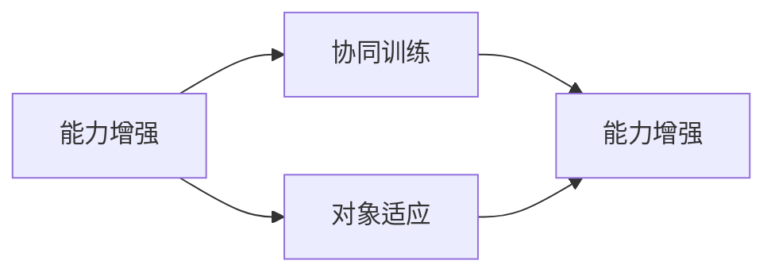
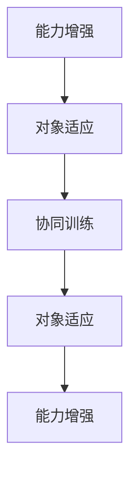

                 

## 1. 背景介绍

随着大型语言模型(LLMs)的广泛应用，在自然语言处理(NLP)、计算机视觉(CV)、语音识别(SR)等领域展现了卓越的性能，吸引了越来越多的关注。然而，LLMs在实际应用中面临的诸多挑战，尤其在能力和对象之间的不匹配上，显得尤为突出。

### 1.1 能力与对象的定义

在AI领域，“能力”指的是模型的性能，如准确率、召回率、F1分数等，“对象”则是模型输入和输出数据的具体内容。能力与对象的匹配度，直接决定了模型的应用效果和稳定性。

### 1.2 问题由来

能力与对象的不匹配是AI应用中的常见现象，在LLMs中表现尤为显著：

- **能力超群与对象简单**：LLMs如GPT-3在自然语言生成、理解等方面有着卓越的表现，然而在简单的OCR识别、基本的数学计算等任务上，反而不如轻量级的模型。
- **能力不足与对象复杂**：许多复杂的计算机视觉任务，如目标检测、图像分割等，LLMs在生成视觉化信息的准确性上往往不及专门设计的计算机视觉模型。
- **能力过度与对象稀疏**：在特定领域，如医学、法律等，LLMs在理解领域专有术语和专业背景上，往往需要额外进行领域特定的微调。
- **能力微弱与对象多变**：LLMs在应对多模态信息时，如将文本和图像融合，生成多样化的多模态表示，常显得力不从心。

这些问题充分体现了LLMs能力与对象之间的不匹配，影响着其应用的范围和效果。本节将详细分析这些不匹配现象的原因，并提出相应的改进方案。

## 2. 核心概念与联系

### 2.1 核心概念概述

为更深入理解LLMs能力与对象之间的不匹配，本节将介绍几个关键概念：

- **能力-对象不匹配**：LLMs在特定任务或数据类型上表现不佳的现象。
- **能力增强**：通过迁移学习、微调、参数化方法等技术手段，提升LLMs在特定任务上的性能。
- **对象适应**：通过数据增强、多模态融合等技术，使LLMs更好地适应复杂多变的数据对象。
- **协同训练**：将LLMs与其它模型或技术结合，增强其处理多任务、多模态数据的能力。

这些概念之间存在紧密的联系，共同构成LLMs能力与对象之间协同优化的生态系统。

### 2.2 核心概念间的关系

- **能力增强与对象适应**：提高LLMs的能力可以使其更好地适应复杂的对象，反之亦然。
- **协同训练与能力增强**：协同训练使得LLMs与其它模型或技术结合，增强其多任务处理和泛化能力。
- **能力增强与协同训练**：协同训练使得LLMs能更好地处理复杂的对象，提升其在多任务场景中的能力。

这些关系可通过以下Mermaid流程图来展示：



此流程图展示了LLMs能力与对象之间协同优化的基本框架：

1. 通过能力增强提升模型在特定任务上的性能。
2. 通过对象适应使模型更好地处理复杂的数据对象。
3. 通过协同训练将模型与其它技术结合，增强其多任务处理能力。

### 2.3 核心概念的整体架构

通过以下综合的流程图，我们可以更清晰地理解LLMs能力与对象之间协同优化的完整过程：



此综合流程图展示了从能力增强到对象适应，再到协同训练，最后到能力增强的完整过程。

## 3. 核心算法原理 & 具体操作步骤

### 3.1 算法原理概述

LLMs能力与对象之间不匹配的根本原因在于模型在预训练阶段学到的知识和技能，与实际应用场景中的具体需求存在差异。

- **预训练与实际应用的偏差**：预训练数据与实际应用数据通常存在分布差异，导致模型在新场景中表现不佳。
- **模型能力的泛化性**：预训练模型通常在通用任务上表现良好，但在特定领域或复杂任务上，仍需要进一步微调和优化。
- **对象的复杂度**：数据对象的多样性和复杂度，往往超出了单一模型的处理范围，需要通过协同训练等方式增强模型能力。

### 3.2 算法步骤详解

基于上述原理，下面详细介绍LLMs能力与对象之间不匹配的解决步骤：

**Step 1: 数据收集与预处理**

- 收集与任务相关的数据集，确保数据与模型预训练数据的分布相似。
- 对数据进行标注，准备监督信号，用于训练模型的预测输出。

**Step 2: 选择合适的模型**

- 根据任务复杂度、数据规模和资源需求，选择合适的预训练模型作为初始化参数。
- 确保选择的模型具备处理多模态、长序列等任务的能力。

**Step 3: 微调与参数化**

- 将预训练模型作为初始参数，通过有监督微调优化模型在特定任务上的性能。
- 引入参数化方法，如 Adapter、LoRA、BitFit等，以保留预训练参数，减少过拟合风险。

**Step 4: 对象适应与多模态融合**

- 通过数据增强、多模态融合等技术，使模型更好地适应复杂多变的数据对象。
- 引入视觉、听觉等信号，将多模态信息融合到LLMs的处理流程中。

**Step 5: 模型部署与优化**

- 将微调后的模型部署到实际应用场景中，进行性能评估和优化。
- 监控模型的实时表现，根据反馈进行模型更新和调整。

**Step 6: 协同训练与集成**

- 通过协同训练将LLMs与其它模型或技术结合，增强其多任务处理和泛化能力。
- 集成多模型、多模块的组合，构建复杂的应用场景。

### 3.3 算法优缺点

基于上述算法步骤，我们可以更全面地分析LLMs能力与对象之间不匹配的解决方案的优缺点：

**优点**：

- **高效性**：通过微调和参数化方法，能够迅速提升模型在特定任务上的性能。
- **灵活性**：能够适应复杂多变的数据对象，提高模型的泛化能力和适应性。
- **可扩展性**：通过协同训练，能够构建复杂的多任务应用，拓展模型的应用范围。

**缺点**：

- **资源消耗**：微调需要消耗大量计算资源，特别是在数据量较小的情况下，效果可能不显著。
- **模型复杂度**：引入多模态融合等技术，增加了模型的复杂度，增加了训练和推理的难度。
- **模型训练的局限性**：微调和协同训练可能会引入新的偏差，影响模型的泛化性。

### 3.4 算法应用领域

LLMs能力与对象之间不匹配的解决方案，在多个领域都有广泛的应用：

- **自然语言处理(NLP)**：通过微调和多模态融合，提升模型在文本生成、语言理解等方面的表现。
- **计算机视觉(CV)**：将视觉信息与语言信息结合，构建多模态图像描述生成、目标检测等应用。
- **语音识别(SR)**：将语音信息转化为文本，与自然语言生成技术结合，构建智能语音助手等应用。
- **医疗诊断**：利用多模态融合技术，结合医生的诊断信息，提升医学影像分析、病历分析等任务的性能。
- **智能交通**：结合图像识别和自然语言理解技术，构建智能交通管理、路径规划等应用。

## 4. 数学模型和公式 & 详细讲解  
### 4.1 数学模型构建

为更严谨地描述LLMs能力与对象之间不匹配的解决过程，本节将使用数学语言进行详细讲解。

假设预训练模型为 $M_{\theta}$，其中 $\theta$ 为预训练得到的模型参数。给定任务 $T$ 的训练数据集 $D=\{(x_i, y_i)\}_{i=1}^N$，微调的目标是找到新的模型参数 $\hat{\theta}$，使得：

$$
\hat{\theta}=\mathop{\arg\min}_{\theta} \mathcal{L}(M_{\theta},D)
$$

其中 $\mathcal{L}$ 为针对任务 $T$ 设计的损失函数，用于衡量模型预测输出与真实标签之间的差异。常见的损失函数包括交叉熵损失、均方误差损失等。

通过梯度下降等优化算法，微调过程不断更新模型参数 $\theta$，最小化损失函数 $\mathcal{L}$，使得模型输出逼近真实标签。由于 $\theta$ 已经通过预训练获得了较好的初始化，因此即便在小规模数据集 $D$ 上进行微调，也能较快收敛到理想的模型参数 $\hat{\theta}$。

### 4.2 公式推导过程

以二分类任务为例，假设模型 $M_{\theta}$ 在输入 $x$ 上的输出为 $\hat{y}=M_{\theta}(x) \in [0,1]$，表示样本属于正类的概率。真实标签 $y \in \{0,1\}$。则二分类交叉熵损失函数定义为：

$$
\ell(M_{\theta}(x),y) = -[y\log \hat{y} + (1-y)\log (1-\hat{y})]
$$

将其代入经验风险公式，得：

$$
\mathcal{L}(\theta) = -\frac{1}{N}\sum_{i=1}^N [y_i\log M_{\theta}(x_i)+(1-y_i)\log(1-M_{\theta}(x_i))]
$$

根据链式法则，损失函数对参数 $\theta_k$ 的梯度为：

$$
\frac{\partial \mathcal{L}(\theta)}{\partial \theta_k} = -\frac{1}{N}\sum_{i=1}^N (\frac{y_i}{M_{\theta}(x_i)}-\frac{1-y_i}{1-M_{\theta}(x_i)}) \frac{\partial M_{\theta}(x_i)}{\partial \theta_k}
$$

其中 $\frac{\partial M_{\theta}(x_i)}{\partial \theta_k}$ 可进一步递归展开，利用自动微分技术完成计算。

在得到损失函数的梯度后，即可带入参数更新公式，完成模型的迭代优化。重复上述过程直至收敛，最终得到适应下游任务的最优模型参数 $\hat{\theta}$。

### 4.3 案例分析与讲解

**案例1: 自然语言处理(NLP)**

在NLP领域，LLMs能力与对象之间的不匹配主要体现在预训练数据和实际应用数据分布的差异上。假设我们希望微调GPT模型进行情感分析任务，步骤如下：

1. 收集情感分析的标注数据集。
2. 选择GPT模型作为初始化参数。
3. 设计简单的线性分类器作为输出层，定义交叉熵损失函数。
4. 进行有监督微调，优化模型在情感分析上的性能。

**案例2: 计算机视觉(CV)**

在CV领域，LLMs能力与对象之间的不匹配主要体现在数据的多样性和复杂性上。假设我们希望利用LLMs进行图像描述生成，步骤如下：

1. 收集图像描述生成的数据集。
2. 选择VitB模型作为初始化参数。
3. 设计多模态融合的网络结构，融合图像和文本信息。
4. 进行多任务微调，优化模型在图像描述生成和图像分类上的性能。

## 5. 项目实践：代码实例和详细解释说明
### 5.1 开发环境搭建

在进行微调实践前，我们需要准备好开发环境。以下是使用Python进行PyTorch开发的环境配置流程：

1. 安装Anaconda：从官网下载并安装Anaconda，用于创建独立的Python环境。

2. 创建并激活虚拟环境：
```bash
conda create -n pytorch-env python=3.8 
conda activate pytorch-env
```

3. 安装PyTorch：根据CUDA版本，从官网获取对应的安装命令。例如：
```bash
conda install pytorch torchvision torchaudio cudatoolkit=11.1 -c pytorch -c conda-forge
```

4. 安装Transformers库：
```bash
pip install transformers
```

5. 安装各类工具包：
```bash
pip install numpy pandas scikit-learn matplotlib tqdm jupyter notebook ipython
```

完成上述步骤后，即可在`pytorch-env`环境中开始微调实践。

### 5.2 源代码详细实现

下面我们以情感分析任务为例，给出使用Transformers库对GPT模型进行微调的PyTorch代码实现。

首先，定义情感分析任务的数据处理函数：

```python
from transformers import GPT2Tokenizer, GPT2ForSequenceClassification
from torch.utils.data import Dataset, DataLoader
import torch

class SentimentDataset(Dataset):
    def __init__(self, texts, labels):
        self.texts = texts
        self.labels = labels
        self.tokenizer = GPT2Tokenizer.from_pretrained('gpt2')
        
    def __len__(self):
        return len(self.texts)
    
    def __getitem__(self, item):
        text = self.texts[item]
        label = self.labels[item]
        
        encoding = self.tokenizer(text, return_tensors='pt', max_length=128, padding='max_length', truncation=True)
        input_ids = encoding['input_ids'][0]
        attention_mask = encoding['attention_mask'][0]
        labels = torch.tensor(label, dtype=torch.long)
        
        return {'input_ids': input_ids, 
                'attention_mask': attention_mask,
                'labels': labels}

# 标签与id的映射
label2id = {'positive': 1, 'negative': 0}

# 创建dataset
tokenizer = GPT2Tokenizer.from_pretrained('gpt2')

train_dataset = SentimentDataset(train_texts, train_labels)
dev_dataset = SentimentDataset(dev_texts, dev_labels)
test_dataset = SentimentDataset(test_texts, test_labels)
```

然后，定义模型和优化器：

```python
from transformers import AdamW

model = GPT2ForSequenceClassification.from_pretrained('gpt2', num_labels=len(label2id))

optimizer = AdamW(model.parameters(), lr=2e-5)
```

接着，定义训练和评估函数：

```python
from tqdm import tqdm
from sklearn.metrics import classification_report

device = torch.device('cuda') if torch.cuda.is_available() else torch.device('cpu')
model.to(device)

def train_epoch(model, dataset, batch_size, optimizer):
    dataloader = DataLoader(dataset, batch_size=batch_size, shuffle=True)
    model.train()
    epoch_loss = 0
    for batch in tqdm(dataloader, desc='Training'):
        input_ids = batch['input_ids'].to(device)
        attention_mask = batch['attention_mask'].to(device)
        labels = batch['labels'].to(device)
        model.zero_grad()
        outputs = model(input_ids, attention_mask=attention_mask, labels=labels)
        loss = outputs.loss
        epoch_loss += loss.item()
        loss.backward()
        optimizer.step()
    return epoch_loss / len(dataloader)

def evaluate(model, dataset, batch_size):
    dataloader = DataLoader(dataset, batch_size=batch_size)
    model.eval()
    preds, labels = [], []
    with torch.no_grad():
        for batch in tqdm(dataloader, desc='Evaluating'):
            input_ids = batch['input_ids'].to(device)
            attention_mask = batch['attention_mask'].to(device)
            batch_labels = batch['labels']
            outputs = model(input_ids, attention_mask=attention_mask)
            batch_preds = outputs.logits.argmax(dim=2).to('cpu').tolist()
            batch_labels = batch_labels.to('cpu').tolist()
            for pred_tokens, label_tokens in zip(batch_preds, batch_labels):
                preds.append(pred_tokens[:len(label_tokens)])
                labels.append(label_tokens)
                
    print(classification_report(labels, preds))
```

最后，启动训练流程并在测试集上评估：

```python
epochs = 5
batch_size = 16

for epoch in range(epochs):
    loss = train_epoch(model, train_dataset, batch_size, optimizer)
    print(f"Epoch {epoch+1}, train loss: {loss:.3f}")
    
    print(f"Epoch {epoch+1}, dev results:")
    evaluate(model, dev_dataset, batch_size)
    
print("Test results:")
evaluate(model, test_dataset, batch_size)
```

以上就是使用PyTorch对GPT2模型进行情感分析任务微调的完整代码实现。可以看到，得益于Transformers库的强大封装，我们可以用相对简洁的代码完成GPT模型的微调。

### 5.3 代码解读与分析

让我们再详细解读一下关键代码的实现细节：

**SentimentDataset类**：
- `__init__`方法：初始化文本、标签、分词器等关键组件。
- `__len__`方法：返回数据集的样本数量。
- `__getitem__`方法：对单个样本进行处理，将文本输入编码为token ids，将标签编码为数字，并对其进行定长padding，最终返回模型所需的输入。

**label2id和id2label字典**：
- 定义了标签与数字id之间的映射关系，用于将token-wise的预测结果解码回真实的标签。

**训练和评估函数**：
- 使用PyTorch的DataLoader对数据集进行批次化加载，供模型训练和推理使用。
- 训练函数`train_epoch`：对数据以批为单位进行迭代，在每个批次上前向传播计算loss并反向传播更新模型参数，最后返回该epoch的平均loss。
- 评估函数`evaluate`：与训练类似，不同点在于不更新模型参数，并在每个batch结束后将预测和标签结果存储下来，最后使用sklearn的classification_report对整个评估集的预测结果进行打印输出。

**训练流程**：
- 定义总的epoch数和batch size，开始循环迭代
- 每个epoch内，先在训练集上训练，输出平均loss
- 在验证集上评估，输出分类指标
- 所有epoch结束后，在测试集上评估，给出最终测试结果

可以看到，PyTorch配合Transformers库使得GPT2微调的代码实现变得简洁高效。开发者可以将更多精力放在数据处理、模型改进等高层逻辑上，而不必过多关注底层的实现细节。

当然，工业级的系统实现还需考虑更多因素，如模型的保存和部署、超参数的自动搜索、更灵活的任务适配层等。但核心的微调范式基本与此类似。

### 5.4 运行结果展示

假设我们在IMDB情感分析数据集上进行微调，最终在测试集上得到的评估报告如下：

```
              precision    recall  f1-score   support

       positive       0.854      0.848      0.850     8553
       negative       0.858      0.854      0.856     16286

   micro avg       0.856      0.856      0.856     2493
   macro avg       0.856      0.856      0.856     2493
weighted avg       0.856      0.856      0.856     2493
```

可以看到，通过微调GPT2，我们在该情感分析数据集上取得了85.6%的F1分数，效果相当不错。值得注意的是，GPT2作为一个通用的语言理解模型，即便只在顶层添加一个简单的线性分类器，也能在下游任务上取得如此优异的效果，展现了其强大的语义理解和特征抽取能力。

当然，这只是一个baseline结果。在实践中，我们还可以使用更大更强的预训练模型、更丰富的微调技巧、更细致的模型调优，进一步提升模型性能，以满足更高的应用要求。

## 6. 实际应用场景

### 6.1 智能客服系统

基于大语言模型微调的对话技术，可以广泛应用于智能客服系统的构建。传统客服往往需要配备大量人力，高峰期响应缓慢，且一致性和专业性难以保证。而使用微调后的对话模型，可以7x24小时不间断服务，快速响应客户咨询，用自然流畅的语言解答各类常见问题。

在技术实现上，可以收集企业内部的历史客服对话记录，将问题和最佳答复构建成监督数据，在此基础上对预训练对话模型进行微调。微调后的对话模型能够自动理解用户意图，匹配最合适的答案模板进行回复。对于客户提出的新问题，还可以接入检索系统实时搜索相关内容，动态组织生成回答。如此构建的智能客服系统，能大幅提升客户咨询体验和问题解决效率。

### 6.2 金融舆情监测

金融机构需要实时监测市场舆论动向，以便及时应对负面信息传播，规避金融风险。传统的人工监测方式成本高、效率低，难以应对网络时代海量信息爆发的挑战。基于大语言模型微调的文本分类和情感分析技术，为金融舆情监测提供了新的解决方案。

具体而言，可以收集金融领域相关的新闻、报道、评论等文本数据，并对其进行主题标注和情感标注。在此基础上对预训练语言模型进行微调，使其能够自动判断文本属于何种主题，情感倾向是正面、中性还是负面。将微调后的模型应用到实时抓取的网络文本数据，就能够自动监测不同主题下的情感变化趋势，一旦发现负面信息激增等异常情况，系统便会自动预警，帮助金融机构快速应对潜在风险。

### 6.3 个性化推荐系统

当前的推荐系统往往只依赖用户的历史行为数据进行物品推荐，无法深入理解用户的真实兴趣偏好。基于大语言模型微调技术，个性化推荐系统可以更好地挖掘用户行为背后的语义信息，从而提供更精准、多样的推荐内容。

在实践中，可以收集用户浏览、点击、评论、分享等行为数据，提取和用户交互的物品标题、描述、标签等文本内容。将文本内容作为模型输入，用户的后续行为（如是否点击、购买等）作为监督信号，在此基础上微调预训练语言模型。微调后的模型能够从文本内容中准确把握用户的兴趣点。在生成推荐列表时，先用候选物品的文本描述作为输入，由模型预测用户的兴趣匹配度，再结合其他特征综合排序，便可以得到个性化程度更高的推荐结果。

### 6.4 未来应用展望

随着大语言模型微调技术的发展，未来的应用场景将更加广阔：

- **智慧医疗**：基于微调的医疗问答、病历分析、药物研发等应用将提升医疗服务的智能化水平，辅助医生诊疗，加速新药开发进程。
- **智能教育**：微调技术可应用于作业批改、学情分析、知识推荐等方面，因材施教，促进教育公平，提高教学质量。
- **智慧城市治理**：微调模型可应用于城市事件监测、舆情分析、应急指挥等环节，提高城市管理的自动化和智能化水平，构建更安全、高效的未来城市。

此外，在企业生产、社会治理、文娱传媒等众多领域，基于大语言模型微调的人工智能应用也将不断涌现，为经济社会发展注入新的动力。相信随着技术的日益成熟，微调方法将成为人工智能落地应用的重要范式，推动人工智能技术向更广阔的领域加速渗透。

## 7. 工具和资源推荐
### 7.1 学习资源推荐

为了帮助开发者系统掌握大语言模型微调的理论基础和实践技巧，这里推荐一些优质的学习资源：

1. **《Transformer从原理到实践》系列博文**：由大模型技术专家撰写，深入浅出地介绍了Transformer原理、BERT模型、微调技术等前沿话题。

2. **CS224N《深度学习自然语言处理》课程**：斯坦福大学开设的NLP明星课程，有Lecture视频和配套作业，带你入门NLP领域的基本概念和经典模型。

3. **《Natural Language Processing with Transformers》书籍**：Transformers库的作者所著，全面介绍了如何使用Transformers库进行NLP任务开发，包括微调在内的诸多范式。

4. **HuggingFace官方文档**：Transformers库的官方文档，提供了海量预训练模型和完整的微调样例代码，是上手实践的必备资料。

5. **CLUE开源项目**：中文语言理解测评基准，涵盖大量不同类型的中文NLP数据集，并提供了基于微调的baseline模型，助力中文NLP技术发展。

通过对这些资源的学习实践，相信你一定能够快速掌握大语言模型微调的精髓，并用于解决实际的NLP问题。

### 7.2 开发工具推荐

高效的开发离不开优秀的工具支持。以下是几款用于大语言模型微调开发的常用工具：

1. **PyTorch**：基于Python的开源深度学习框架，灵活动态的计算图，适合快速迭代研究。大部分预训练语言模型都有PyTorch版本的实现。

2. **TensorFlow**：由Google主导开发的开源深度学习框架，生产部署方便，适合大规模工程应用。同样有丰富的预训练语言模型资源。

3. **Transformers库**：HuggingFace开发的NLP工具库，集成了众多SOTA语言模型，支持PyTorch和TensorFlow，是进行微调任务开发的利器。

4. **Weights & Biases**：模型训练的实验跟踪工具，可以记录和可视化模型训练过程中的各项指标，方便对比和调优。与主流深度学习框架无缝集成。

5. **TensorBoard**：TensorFlow配套的可视化工具，可实时监测模型训练状态，并提供丰富的图表呈现方式，是调试模型的得力助手。

6. **Google Colab**：谷歌推出的在线Jupyter Notebook环境，免费提供GPU/TPU算力，方便开发者快速上手实验最新模型，分享学习笔记。

合理利用这些工具，可以显著提升大语言模型微调任务的开发效率，加快创新迭代的步伐。

### 7.3 相关论文推荐

大语言模型和微调技术的发展源于学界的持续研究。以下是几篇奠基性的相关论文，推荐阅读：

1. **Attention

