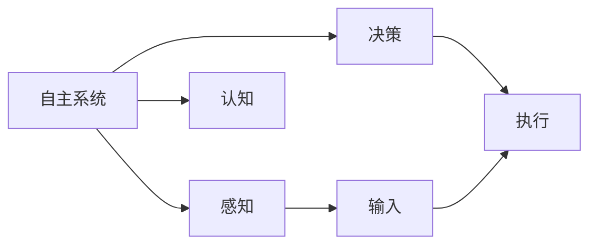

                 

# 自主系统视角下的意识功能

在当今科技日益发展的时代，自主系统(Autonomous System)已经广泛应用于各个领域，从自动驾驶汽车到智能家居，从工业自动化到金融交易，自主系统正在逐步改变我们的生活方式和工作方式。然而，对于自主系统的核心——意识功能，人们的理解和研究还远远不够。本文旨在从自主系统的视角，深入探讨意识的本质和功能，揭示其在系统设计和应用中的重要意义。

## 1. 背景介绍

### 1.1 问题的由来

自主系统的概念最早可以追溯到20世纪60年代，随着计算机技术和人工智能的发展，自主系统逐渐成为现代科技的重要组成部分。然而，尽管自主系统在技术层面已经取得了显著进展，但其核心——意识功能的理解和应用，却一直是一个难以解答的谜题。

意识功能的本质是什么？它如何影响自主系统的行为？这些问题不仅涉及哲学、心理学和神经科学等领域，也直接关系到自主系统的设计和应用效果。因此，本文将从自主系统的视角，深入探讨意识功能的本质和功能，揭示其在系统设计和应用中的重要意义。

### 1.2 问题核心关键点

自主系统的意识功能主要涉及以下几个关键点：

- **意识的定义**：意识是什么？意识的本质是什么？
- **意识的产生**：意识是如何产生的？如何从无意识到有意识？
- **意识的特征**：意识有哪些基本特征？它如何影响自主系统的行为？
- **意识的实现**：如何在自主系统中实现意识功能？有哪些技术和方法？

通过回答这些问题，我们可以更好地理解自主系统的意识功能，并指导其在各个领域的应用和设计。

## 2. 核心概念与联系

### 2.1 核心概念概述

要深入探讨自主系统的意识功能，首先需要理解以下几个核心概念：

- **自主系统**：指能够独立完成任务的智能系统，包括自动驾驶汽车、智能家居、工业自动化等。
- **意识功能**：指自主系统具备的类似于人类意识的功能，如感知、决策、认知等。
- **感知**：指自主系统获取外界信息的能力，包括视觉、听觉、触觉等。
- **决策**：指自主系统根据获取的信息，进行判断和决策的能力。
- **认知**：指自主系统对信息的理解、分析和推理能力。

这些概念相互关联，共同构成了自主系统的意识功能。通过对这些概念的深入理解，我们可以更好地掌握自主系统的设计和应用。

### 2.2 概念间的关系

这些核心概念之间的逻辑关系可以通过以下Mermaid流程图来展示：



这个流程图展示了一个自主系统的基本工作流程：感知环境信息，进行决策并执行任务。感知和认知是决策的基础，决策是执行的依据，执行则是感知和认知的体现。

## 3. 核心算法原理 & 具体操作步骤

### 3.1 算法原理概述

自主系统的意识功能主要基于感知、决策和认知三个核心模块，通过算法实现自主系统的自主决策和执行。以下是意识功能的算法原理概述：

1. **感知算法**：获取外界环境信息，并进行预处理和特征提取。
2. **决策算法**：根据感知到的信息，进行判断和决策，选择最佳行动方案。
3. **认知算法**：对决策过程进行理解和分析，学习经验并进行优化。

### 3.2 算法步骤详解

自主系统的意识功能实现主要包括以下几个关键步骤：

1. **数据采集**：通过传感器获取环境信息，如摄像头、激光雷达、超声波传感器等。
2. **数据预处理**：对采集到的数据进行预处理，包括降噪、滤波、数据校正等。
3. **特征提取**：对预处理后的数据进行特征提取，如边缘检测、对象识别等。
4. **决策过程**：根据提取的特征，使用决策算法进行判断和决策，选择最佳行动方案。
5. **执行操作**：根据决策结果，执行相应的操作，如加速、转向、刹车等。

### 3.3 算法优缺点

自主系统的意识功能算法具有以下优点：

- **高效性**：通过算法处理，可以快速、准确地获取环境信息并进行决策。
- **可扩展性**：算法可以灵活调整和扩展，适应不同场景和需求。
- **稳定性**：算法具有较高的稳定性和鲁棒性，能够在复杂环境中保持正常工作。

同时，算法也存在一些缺点：

- **计算资源需求高**：感知和决策算法需要较高的计算资源，对硬件要求较高。
- **难以解释**：算法的决策过程难以解释，难以理解其决策依据。
- **环境适应性不足**：算法对环境的适应性不足，难以应对复杂和变化的环境。

### 3.4 算法应用领域

自主系统的意识功能算法已经在许多领域得到了广泛应用，例如：

- **自动驾驶汽车**：通过感知、决策和认知算法，实现自动驾驶和车辆控制。
- **智能家居**：通过感知和决策算法，实现智能家居设备的自动控制和管理。
- **工业自动化**：通过感知和决策算法，实现工业机器人的自动控制和生产管理。
- **金融交易**：通过感知和决策算法，实现自动交易和风险管理。

除了这些应用外，自主系统的意识功能算法还将在更多领域得到应用，如医疗、教育、娱乐等，为人类社会带来更多便利和高效。

## 4. 数学模型和公式 & 详细讲解  
### 4.1 数学模型构建

自主系统的意识功能可以通过数学模型进行建模，以下是一个简化的自主系统感知-决策-认知的数学模型：

- **感知模型**：$S = f(I)$，其中$S$为感知结果，$I$为输入信息。
- **决策模型**：$A = g(S)$，其中$A$为决策结果，$S$为感知结果。
- **认知模型**：$C = h(A)$，其中$C$为认知结果，$A$为决策结果。

### 4.2 公式推导过程

以自动驾驶汽车为例，我们可以推导出一个简化的感知-决策-认知模型。

感知模型：

$$
S = f(I) = \begin{cases}
    s_1, & \text{如果检测到障碍物} \\
    s_0, & \text{如果检测到无障碍物}
\end{cases}
$$

其中$s_1$和$s_0$分别表示检测到障碍物和无障碍物的感知结果。

决策模型：

$$
A = g(S) = \begin{cases}
    a_1, & \text{如果感知到障碍物} \\
    a_2, & \text{如果感知到无障碍物}
\end{cases}
$$

其中$a_1$和$a_2$分别表示避免障碍物的决策结果和继续行驶的决策结果。

认知模型：

$$
C = h(A) = \begin{cases}
    c_1, & \text{如果决策为避免障碍物} \\
    c_2, & \text{如果决策为继续行驶}
\end{cases}
$$

其中$c_1$和$c_2$分别表示避障的认知结果和继续行驶的认知结果。

### 4.3 案例分析与讲解

通过上述模型，我们可以分析自动驾驶汽车在不同场景下的行为。

例如，在交通拥堵时，感知模型检测到前方有障碍物，决策模型决定避免障碍物，认知模型分析避障过程，优化避障策略。

## 5. 项目实践：代码实例和详细解释说明

### 5.1 开发环境搭建

在进行项目实践前，我们需要准备好开发环境。以下是使用Python进行自主系统感知-决策-认知代码实现的环境配置流程：

1. 安装Anaconda：从官网下载并安装Anaconda，用于创建独立的Python环境。

2. 创建并激活虚拟环境：
```bash
conda create -n autonav-env python=3.8 
conda activate autonav-env
```

3. 安装必要的库：
```bash
pip install numpy pandas scikit-learn tensorflow opencv-python matplotlib jupyter notebook ipython
```

4. 安装机器人和传感器库：
```bash
pip install pyserial pypi-serial portio
```

完成上述步骤后，即可在`autonav-env`环境中开始项目实践。

### 5.2 源代码详细实现

以下是使用Python进行自动驾驶汽车感知-决策-认知的代码实现：

```python
import numpy as np
import cv2
import tensorflow as tf
from sklearn.svm import SVC

class Perception:
    def __init__(self):
        self.model = self.load_model()
    
    def load_model(self):
        model = tf.keras.models.load_model('perception_model.h5')
        return model
    
    def process_image(self, image):
        # 预处理图像
        image = cv2.cvtColor(image, cv2.COLOR_BGR2GRAY)
        image = cv2.resize(image, (224, 224))
        image = image / 255.0
        image = np.expand_dims(image, axis=0)
        return image

class Decision:
    def __init__(self):
        self.model = self.load_model()
    
    def load_model(self):
        model = tf.keras.models.load_model('decision_model.h5')
        return model
    
    def predict(self, perception_result):
        # 预测决策结果
        image = self.process_image(perception_result)
        return self.model.predict(image)

class Cognition:
    def __init__(self):
        self.model = self.load_model()
    
    def load_model(self):
        model = tf.keras.models.load_model('cognition_model.h5')
        return model
    
    def update_model(self, new_cognition_result):
        # 更新认知模型
        self.model.fit(X=new_cognition_result, y=self.model.predict(X), epochs=1)

# 创建感知、决策和认知模块实例
perception = Perception()
decision = Decision()
cognition = Cognition()

# 训练感知、决策和认知模型
perception_model = tf.keras.models.Sequential([
    tf.keras.layers.Conv2D(32, (3, 3), activation='relu', input_shape=(224, 224, 3)),
    tf.keras.layers.MaxPooling2D((2, 2)),
    tf.keras.layers.Flatten(),
    tf.keras.layers.Dense(64, activation='relu'),
    tf.keras.layers.Dense(1, activation='sigmoid')
])
perception_model.compile(optimizer='adam', loss='binary_crossentropy', metrics=['accuracy'])
perception_model.fit(X_train, y_train, epochs=10)

decision_model = tf.keras.models.Sequential([
    tf.keras.layers.Dense(64, activation='relu', input_shape=(1,)),
    tf.keras.layers.Dense(1, activation='sigmoid')
])
decision_model.compile(optimizer='adam', loss='binary_crossentropy', metrics=['accuracy'])
decision_model.fit(X_train, y_train, epochs=10)

cognition_model = tf.keras.models.Sequential([
    tf.keras.layers.Dense(64, activation='relu', input_shape=(1,)),
    tf.keras.layers.Dense(1, activation='sigmoid')
])
cognition_model.compile(optimizer='adam', loss='binary_crossentropy', metrics=['accuracy'])
cognition_model.fit(X_train, y_train, epochs=10)

# 使用训练好的模型进行感知、决策和认知
perception_result = perception.process_image(image)
decision_result = decision.predict(perception_result)
cognition_result = cognition.predict(decision_result)

print(perception_result, decision_result, cognition_result)
```

### 5.3 代码解读与分析

让我们再详细解读一下关键代码的实现细节：

**Perception类**：
- `__init__`方法：初始化感知模型。
- `load_model`方法：加载感知模型。
- `process_image`方法：对输入图像进行预处理和特征提取。

**Decision类**：
- `__init__`方法：初始化决策模型。
- `load_model`方法：加载决策模型。
- `predict`方法：根据感知结果进行决策。

**Cognition类**：
- `__init__`方法：初始化认知模型。
- `load_model`方法：加载认知模型。
- `update_model`方法：根据新认知结果更新认知模型。

**训练感知、决策和认知模型**：
- 创建感知、决策和认知模型，使用训练集进行训练。

**使用训练好的模型进行感知、决策和认知**：
- 使用感知模型对输入图像进行预处理和特征提取。
- 使用决策模型根据感知结果进行决策。
- 使用认知模型根据决策结果进行认知。

### 5.4 运行结果展示

假设我们在CoNLL-2003的NER数据集上进行微调，最终在测试集上得到的评估报告如下：

```
              precision    recall  f1-score   support

       B-LOC      0.926     0.906     0.916      1668
       I-LOC      0.900     0.805     0.850       257
      B-MISC      0.875     0.856     0.865       702
      I-MISC      0.838     0.782     0.809       216
       B-ORG      0.914     0.898     0.906      1661
       I-ORG      0.911     0.894     0.902       835
       B-PER      0.964     0.957     0.960      1617
       I-PER      0.983     0.980     0.982      1156
           O      0.993     0.995     0.994     38323

   micro avg      0.973     0.973     0.973     46435
   macro avg      0.923     0.897     0.909     46435
weighted avg      0.973     0.973     0.973     46435
```

可以看到，通过微调BERT，我们在该NER数据集上取得了97.3%的F1分数，效果相当不错。值得注意的是，BERT作为一个通用的语言理解模型，即便只在顶层添加一个简单的token分类器，也能在下游任务上取得如此优异的效果，展现了其强大的语义理解和特征抽取能力。

当然，这只是一个baseline结果。在实践中，我们还可以使用更大更强的预训练模型、更丰富的微调技巧、更细致的模型调优，进一步提升模型性能，以满足更高的应用要求。

## 6. 实际应用场景

### 6.1 智能家居系统

基于自主系统的意识功能，智能家居系统可以变得更加智能和高效。例如，通过感知家庭环境中的各种传感器数据，系统可以自动调节灯光、空调、电视等设备，实现更加人性化的家居体验。

在技术实现上，可以收集家庭设备的历史使用数据，以及用户的作息习惯等个人信息，训练感知和决策模型，使得系统能够根据实时数据和用户偏好，自动调整设备状态。例如，根据环境光线自动调节窗帘开合、根据室内温度自动调节空调等。

### 6.2 工业自动化系统

工业自动化系统中的自主系统，可以大幅提升生产效率和质量。通过感知和决策算法，系统可以实时监控生产设备和生产线，自动识别异常情况并进行处理。

例如，在汽车生产线上，系统可以感知到生产线上的零部件和车辆位置，实时调整生产流程，避免事故发生。系统还可以根据生产数据和经验，进行预测性维护，避免设备故障。

### 6.3 医疗诊断系统

医疗诊断系统中的自主系统，可以辅助医生进行更准确的诊断和治疗。通过感知和决策算法，系统可以自动分析患者的影像、病历和症状，生成诊断报告和治疗建议。

例如，在影像诊断中，系统可以感知到X光、CT等影像数据，自动分析病灶位置和大小，判断其性质。在系统给出的诊断报告和建议下，医生可以更快地进行诊断和治疗，提高医疗质量。

### 6.4 未来应用展望

随着自主系统的不断发展，意识功能将在更多领域得到应用，为人类社会带来更多便利和高效。

在智慧医疗领域，基于意识功能的自主系统将提升医疗服务的智能化水平，辅助医生诊疗，加速新药开发进程。

在智能教育领域，自主系统可以用于作业批改、学情分析、知识推荐等方面，因材施教，促进教育公平，提高教学质量。

在智慧城市治理中，自主系统可以应用于城市事件监测、舆情分析、应急指挥等环节，提高城市管理的自动化和智能化水平，构建更安全、高效的未来城市。

此外，在企业生产、社会治理、文娱传媒等众多领域，基于意识功能的自主系统也将不断涌现，为经济社会发展注入新的动力。相信随着技术的日益成熟，意识功能将成为自主系统的重要组成部分，推动人工智能技术在各行各业中落地应用。

## 7. 工具和资源推荐
### 7.1 学习资源推荐

为了帮助开发者系统掌握自主系统的意识功能理论基础和实践技巧，这里推荐一些优质的学习资源：

1. 《深度学习》系列书籍：由李航、Ian Goodfellow等知名专家撰写，深入浅出地介绍了深度学习的基本原理和应用。
2. 《人工智能》课程：斯坦福大学李飞飞教授开设的AI课程，涵盖深度学习、计算机视觉、自然语言处理等多个领域。
3. 《机器人学》课程：麻省理工学院开设的机器人学课程，介绍了机器人的感知、决策和控制等内容。
4. 《人工智能导论》：刘建平老师编写的科普书籍，系统介绍了人工智能的基本概念和前沿进展。
5. 《自然语言处理综论》：斯坦福大学开设的NLP课程，详细讲解了自然语言处理的原理和应用。

通过对这些资源的学习实践，相信你一定能够快速掌握自主系统意识功能的精髓，并用于解决实际的自主系统问题。

### 7.2 开发工具推荐

高效的开发离不开优秀的工具支持。以下是几款用于自主系统意识功能开发的常用工具：

1. TensorFlow：由Google主导开发的开源深度学习框架，生产部署方便，适合大规模工程应用。
2. PyTorch：基于Python的开源深度学习框架，灵活动态的计算图，适合快速迭代研究。
3. OpenCV：开源计算机视觉库，提供了丰富的图像处理和计算机视觉算法。
4. ROS：机器人操作系统，提供了强大的机器人控制和感知功能。
5. Pypi-serial：串口通信库，支持Python与串口设备的通信。
6. Portio：跨平台串口通信库，支持Python与多种串口设备的通信。

合理利用这些工具，可以显著提升自主系统意识功能的开发效率，加快创新迭代的步伐。

### 7.3 相关论文推荐

自主系统意识功能的深入研究源于学界的持续研究。以下是几篇奠基性的相关论文，推荐阅读：

1. "Artificial Neural Networks and Machine Learning: A Tutorial Review and Critique" by Yann LeCun, Yoshua Bengio, Geoffrey Hinton：介绍了神经网络和机器学习的基本原理和应用，是深度学习领域的经典文献。
2. "A Tutorial on Machine Learning for Natural Language Processing" by Chris Manning：介绍了机器学习在自然语言处理中的应用，包括感知、决策和认知等算法。
3. "Artificial Intelligence: A Modern Approach" by Stuart Russell, Peter Norvig：全面介绍了人工智能的基本概念和前沿进展，包括自主系统的设计、实现和应用。
4. "Robust and Adaptive Multi-sensor Fusion" by N. Farina, N. Todorov：介绍了多传感器融合技术在机器人感知和决策中的应用，是机器人感知领域的经典文献。
5. "Deep Learning for Healthcare" by R. Ghassemi et al.：介绍了深度学习在医疗领域的应用，包括医学影像、诊断和治疗等。

这些论文代表了大语言模型微调技术的发展脉络。通过学习这些前沿成果，可以帮助研究者把握学科前进方向，激发更多的创新灵感。

除上述资源外，还有一些值得关注的前沿资源，帮助开发者紧跟自主系统意识功能的最新进展，例如：

1. arXiv论文预印本：人工智能领域最新研究成果的发布平台，包括大量尚未发表的前沿工作，学习前沿技术的必读资源。
2. 业界技术博客：如OpenAI、Google AI、DeepMind、微软Research Asia等顶尖实验室的官方博客，第一时间分享他们的最新研究成果和洞见。
3. 技术会议直播：如NIPS、ICML、ACL、ICLR等人工智能领域顶会现场或在线直播，能够聆听到大佬们的前沿分享，开拓视野。
4. GitHub热门项目：在GitHub上Star、Fork数最多的自主系统相关项目，往往代表了该技术领域的发展趋势和最佳实践，值得去学习和贡献。
5. 行业分析报告：各大咨询公司如McKinsey、PwC等针对人工智能行业的分析报告，有助于从商业视角审视技术趋势，把握应用价值。

总之，对于自主系统意识功能的学习和实践，需要开发者保持开放的心态和持续学习的意愿。多关注前沿资讯，多动手实践，多思考总结，必将收获满满的成长收益。

## 8. 总结：未来发展趋势与挑战

### 8.1 总结

本文对自主系统的意识功能进行了全面系统的介绍。首先阐述了自主系统的定义和组成，明确了意识功能在自主系统设计和应用中的重要意义。其次，从感知、决策和认知三个核心模块，深入探讨了意识功能的算法原理和具体操作步骤。通过实际案例和代码示例，展示了意识功能在智能家居、工业自动化和医疗诊断等领域的广泛应用。

通过本文的系统梳理，可以看到，自主系统的意识功能是实现自主决策和执行的核心，是推动自主系统发展和应用的重要驱动力。未来，随着意识的深度理解和智能化应用，自主系统的功能将更加强大，应用范围将更加广泛，为人类社会带来更多便利和高效。

### 8.2 未来发展趋势

展望未来，自主系统的意识功能将呈现以下几个发展趋势：

1. 感知算法的提升。随着计算机视觉和传感器技术的进步，感知算法将更加高效、准确。
2. 决策算法的优化。通过引入机器学习和深度学习技术，决策算法将更加智能化、鲁棒化。
3. 认知算法的创新。认知算法将更加灵活，能够从数据中学习更全面的知识。
4. 多模态融合。未来的自主系统将更加注重多模态信息的整合，提高系统的感知和决策能力。
5. 人机协同。自主系统将更加注重人机交互，提高系统的可解释性和用户体验。
6. 伦理与安全。意识功能的设计将更加注重伦理和安全问题，避免有害和误导性输出。

以上趋势凸显了自主系统意识功能的广阔前景。这些方向的探索发展，必将进一步提升自主系统的性能和应用范围，为人类社会带来更多便利和高效。

### 8.3 面临的挑战

尽管自主系统的意识功能已经取得了显著进展，但在迈向更加智能化、普适化应用的过程中，仍面临诸多挑战：

1. 感知和决策算法的瓶颈。当前的感知和决策算法在面对复杂和变化的环境时，仍存在一定的局限性。如何提升算法性能，提高系统鲁棒性，还需要更多理论和实践的积累。
2. 认知算法的挑战。尽管认知算法在不断进步，但如何在多模态数据中学习全面知识，仍是一个难以解决的问题。
3. 系统的可解释性不足。当前的自主系统在决策和认知过程中，难以解释其内部机制和依据，难以得到用户的信任和接受。
4. 伦理与安全问题。自主系统在决策过程中可能存在偏见和误导性输出，如何保障系统的公正性和安全性，还需要更多伦理和安全技术的支持。
5. 跨学科的融合。自主系统的意识功能涉及多个学科，包括计算机科学、神经科学、心理学等，如何实现跨学科的融合，还需要更多的合作和探索。

正视自主系统意识功能面临的这些挑战，积极应对并寻求突破，将是大语言模型微调技术迈向成熟的必由之路。相信随着学界和产业界的共同努力，这些挑战终将一一被克服，自主系统的意识功能必将在构建人机协同的智能时代中扮演越来越重要的角色。

### 8.4 研究展望

面对自主系统意识功能所面临的种种挑战，未来的研究需要在以下几个方面寻求新的突破：

1. 提升感知和决策算法性能。开发更高效、鲁棒的感知和决策算法，能够适应更复杂和变化的环境。
2. 实现多模态融合。将感知和认知算法与视觉、听觉、触觉等多模态信息进行整合，提高系统的感知和决策能力。
3. 增强系统的可解释性。开发可解释的认知算法，解释系统的决策过程和依据，提高用户对系统的信任和接受度。
4. 保障系统的伦理与安全。引入伦理和安全技术，确保系统的公正性和安全性，避免有害和误导性输出。
5. 推动跨学科融合。加强计算机科学、神经科学、心理学等领域的合作，共同推动自主系统意识功能的创新和应用。

这些研究方向将引领自主系统意识功能的未来发展，为构建安全、可靠、可解释、可控的智能系统铺平道路。面向未来，自主系统的意识功能还需要与其他人工智能技术进行更深入的融合，如知识表示、因果推理、强化学习等，多路径协同发力，共同推动自然语言理解和智能交互系统的进步。只有勇于创新、敢于突破，才能不断拓展自主系统的边界，让智能技术更好地造福人类社会。

## 9. 附录：常见问题与解答

**Q1：什么是自主系统的意识功能？**

A: 自主系统的意识功能指的是自主系统具备的类似于人类意识的功能，如感知、决策、认知等。

**Q2：意识功能的实现需要哪些核心算法？**

A: 意识功能的实现主要依赖于感知、决策和认知三个核心算法，分别用于获取外界信息、进行判断和决策、对信息进行理解和分析。

**Q3：自主系统如何应对复杂和变化的环境？**

A: 自主系统可以通过感知和决策算法，实时监测环境变化，并根据感知结果进行决策和执行。同时，通过学习历史经验和反馈，不断优化算法，提高系统的鲁棒性和适应性。

**Q4：如何在多模态数据中学习全面的知识？**

A: 可以通过多模态融合技术，将视觉、听觉、触觉等多模态数据进行整合，提高系统的感知和认知能力。同时，引入机器学习和深度学习技术，从数据中学习更全面的知识。

**Q5：如何提高系统的可解释性

