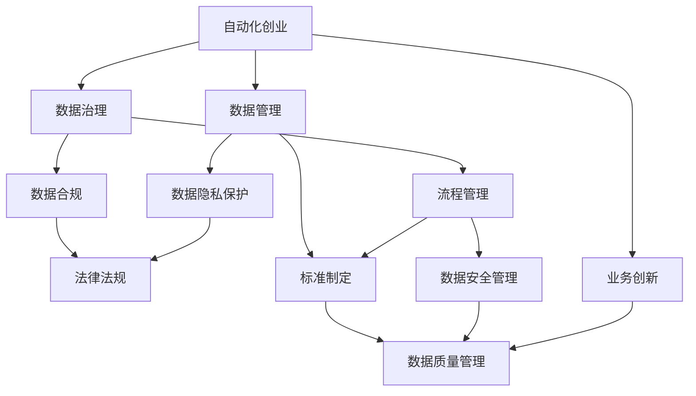

                 

# 自动化创业中的数据治理与管理

> 关键词：自动化创业, 数据治理, 数据管理, 数据合规, 隐私保护

## 1. 背景介绍

### 1.1 问题由来

随着科技的飞速发展，自动化技术逐渐成为创业企业的主力军。从智能制造、智慧零售、无人驾驶到智能客服，自动化技术无所不在。然而，随着自动化技术的普及，数据治理和管理问题也愈发凸显。数据治理能力不足，数据管理混乱，数据合规风险高，这些问题严重制约了企业的发展速度和市场竞争力。

### 1.2 问题核心关键点

自动化创业中的数据治理与管理，旨在通过有效的数据管理策略、数据治理机制和数据合规手段，保证企业自动化系统运行的稳定性和安全性，提升业务效率和客户满意度。具体来说，数据治理与管理包括以下几个核心点：

- **数据管理策略**：制定统一的数据治理标准和规范，确保数据的采集、存储、传输和使用的标准化和规范化。
- **数据治理机制**：建立数据管理组织和流程，明确数据管理职责和权限，确保数据的持续性和完整性。
- **数据合规**：遵守国家和行业的法律法规，保障数据隐私和安全性，避免数据泄露和滥用。
- **隐私保护**：保护用户隐私，避免个人数据被滥用，建立用户信任。

### 1.3 问题研究意义

解决自动化创业中的数据治理与管理问题，对于企业来说，具有以下重要意义：

1. **提升业务效率**：良好的数据治理机制能够提高数据使用效率，降低数据冗余，提升自动化系统的性能和效率。
2. **保障数据安全**：有效的数据治理能够减少数据泄露和滥用的风险，保护企业关键业务数据的安全。
3. **增强用户信任**：严格的数据合规和隐私保护措施，能够增强用户对企业的信任，提高用户粘性和忠诚度。
4. **规避法律风险**：遵守数据法律法规，避免因数据合规问题引发的法律风险和经济损失。
5. **推动业务创新**：数据是企业创新的重要资源，良好的数据治理能够为企业的业务创新提供坚实的数据基础。

## 2. 核心概念与联系

### 2.1 核心概念概述

为更好地理解自动化创业中的数据治理与管理，本节将介绍几个密切相关的核心概念：

- **自动化创业**：指利用自动化技术，如机器学习、自然语言处理、计算机视觉等，实现业务自动化和智能化的创业模式。
- **数据治理**：指通过制定数据管理策略、流程和标准，实现数据的规范化管理和持续改进。
- **数据管理**：包括数据的采集、存储、传输、使用和销毁等全生命周期的管理。
- **数据合规**：指企业必须遵守的数据法律法规，包括但不限于GDPR、CCPA等。
- **隐私保护**：指在数据处理过程中，保护个人隐私和数据安全的技术和管理措施。

### 2.2 概念间的关系

这些核心概念之间存在着紧密的联系，构成了自动化创业中的数据治理与管理的完整体系。下面我们通过几个Mermaid流程图来展示这些概念之间的关系。



这个流程图展示了大数据治理与管理各个环节之间的关系：

1. 自动化创业是数据治理与管理的基础。
2. 数据治理是数据管理的核心，包含数据质量、流程和标准。
3. 数据管理包括数据采集、存储、传输、使用和销毁等全生命周期管理。
4. 数据合规是企业必须遵守的法律法规，确保数据处理的合法性。
5. 隐私保护是数据管理的重点，确保数据处理过程中的个人隐私保护。

这些概念共同构成了自动化创业中数据治理与管理的完整生态系统。通过理解这些核心概念，我们可以更好地把握数据治理与管理的逻辑关系和实施路径。

## 3. 核心算法原理 & 具体操作步骤
### 3.1 算法原理概述

自动化创业中的数据治理与管理，本质上是一个系统的数据管理和治理过程。其核心思想是通过系统的规划和控制，确保数据的高效利用和合规使用。

形式化地，假设企业自动化系统中的数据为 $D$，数据治理目标为 $T$，治理过程为 $P$。则数据治理的目标可以表示为：

$$
\min_{P} \text{Cost}(P) \text{subject to} T(P)
$$

其中，$\text{Cost}(P)$ 表示数据治理的成本，$T(P)$ 表示数据治理的目标，如数据质量、数据隐私等。通过优化治理过程 $P$，使得数据治理成本最小，同时满足数据治理目标 $T$。

### 3.2 算法步骤详解

自动化创业中的数据治理与管理，主要包括以下几个关键步骤：

**Step 1: 制定数据治理标准**

- 根据企业业务需求和法律法规，制定数据治理标准和规范，明确数据收集、存储、使用和销毁等全生命周期的管理要求。
- 建立数据治理委员会，负责数据治理标准的制定和监督执行。

**Step 2: 实施数据管理流程**

- 建立数据管理组织和流程，明确各岗位的数据管理职责和权限。
- 引入数据管理系统，实现数据的自动化采集、存储、传输和使用。
- 定期审计数据管理流程，确保流程的持续改进和优化。

**Step 3: 确保数据合规**

- 定期审核数据管理流程，确保其符合国家和行业的法律法规要求。
- 引入数据合规管理系统，自动监测和报警数据合规问题。
- 建立数据合规审计和处罚机制，保障数据合规的强制执行。

**Step 4: 加强隐私保护**

- 引入隐私保护技术，如数据脱敏、加密和访问控制等。
- 建立隐私保护流程，明确隐私保护的职责和权限。
- 定期进行隐私保护审计，确保隐私保护措施的有效性和持续性。

**Step 5: 持续改进**

- 定期评估数据治理效果，分析数据治理过程中的问题和改进空间。
- 引入持续改进机制，不断优化数据治理流程和标准。

### 3.3 算法优缺点

自动化创业中的数据治理与管理，具有以下优点：

1. **提升业务效率**：通过系统化、规范化的数据管理，提高数据使用效率，减少数据冗余，提升自动化系统的性能和效率。
2. **保障数据安全**：有效的数据治理能够减少数据泄露和滥用的风险，保护企业关键业务数据的安全。
3. **增强用户信任**：严格的数据合规和隐私保护措施，能够增强用户对企业的信任，提高用户粘性和忠诚度。
4. **规避法律风险**：遵守数据法律法规，避免因数据合规问题引发的法律风险和经济损失。
5. **推动业务创新**：数据是企业创新的重要资源，良好的数据治理能够为企业的业务创新提供坚实的数据基础。

但该方法也存在一定的局限性：

1. **实施成本高**：数据治理和管理的实施需要投入大量的人力和物力，初期成本较高。
2. **流程复杂**：数据治理流程复杂，需要协调多个部门和岗位，执行难度较大。
3. **更新周期长**：数据治理标准的制定和流程的优化需要时间和实践经验的积累，更新周期较长。

### 3.4 算法应用领域

自动化创业中的数据治理与管理，适用于以下领域：

- **智能制造**：通过系统化的数据治理，提升设备运行状态监测和预测维护的准确性和效率。
- **智慧零售**：实现商品库存、销售数据和客户行为的精准分析，提升供应链和营销效率。
- **无人驾驶**：通过数据治理和管理，保障传感器数据的可靠性和安全性，提升自动驾驶系统的稳定性和安全性。
- **智能客服**：实现客户信息的规范化和标准化，提升客户服务的质量和满意度。
- **金融科技**：通过数据治理和管理，保护客户隐私，保障金融数据的安全性和合规性。

## 4. 数学模型和公式 & 详细讲解 & 举例说明
### 4.1 数学模型构建

本节将使用数学语言对自动化创业中的数据治理与管理过程进行更加严格的刻画。

记自动化创业中的数据治理目标为 $T$，治理过程为 $P$，数据成本为 $C$，则数据治理的目标可以表示为：

$$
\min_{P} \text{Cost}(P) \text{subject to} T(P)
$$

其中，$\text{Cost}(P)$ 表示数据治理的成本，$T(P)$ 表示数据治理的目标。假设 $C$ 和 $T$ 的关系为线性，则优化问题可以表示为：

$$
\min_{P} \alpha \times C(P) + \beta \times T(P)
$$

其中，$\alpha$ 和 $\beta$ 为权重系数，表示成本和目标的重要性。

### 4.2 公式推导过程

以下我们以数据隐私保护为例，推导隐私保护目标函数及其梯度的计算公式。

假设企业自动化系统中涉及敏感数据 $D_s$ 和普通数据 $D_n$，隐私保护的目标是使得敏感数据 $D_s$ 的隐私泄露风险最小化，同时保证系统的正常运行。设隐私保护的目标函数为：

$$
f(P) = \lambda \times \sum_{i=1}^{m} \sum_{j=1}^{n} p_{ij} \times f_{ij}(P) + \sum_{k=1}^{m} \sum_{j=1}^{n} p_{kj} \times g_{kj}(P)
$$

其中，$p_{ij}$ 和 $p_{kj}$ 为数据 $D_s$ 和 $D_n$ 的概率分布，$f_{ij}(P)$ 和 $g_{kj}(P)$ 分别为数据 $D_s$ 和 $D_n$ 的隐私保护成本和隐私泄露风险。

将上述目标函数代入优化问题，得：

$$
\min_{P} \alpha \times \left( \lambda \times \sum_{i=1}^{m} \sum_{j=1}^{n} p_{ij} \times f_{ij}(P) + \sum_{k=1}^{m} \sum_{j=1}^{n} p_{kj} \times g_{kj}(P) \right)
$$

根据链式法则，目标函数对参数 $P$ 的梯度为：

$$
\nabla_{P} f(P) = \left( \lambda \times \nabla_{P} \sum_{i=1}^{m} \sum_{j=1}^{n} p_{ij} \times f_{ij}(P) \right) + \nabla_{P} \sum_{k=1}^{m} \sum_{j=1}^{n} p_{kj} \times g_{kj}(P)
$$

在得到目标函数的梯度后，即可带入优化算法，完成模型的迭代优化。

### 4.3 案例分析与讲解

假设某智能制造企业在自动化系统中采集了工人的生物识别数据和行为数据，需要通过隐私保护措施来保护这些敏感数据的隐私。设隐私保护的成本函数为 $f_{ij}(P)$，隐私泄露风险函数为 $g_{kj}(P)$，隐私保护的目标函数为：

$$
f(P) = \lambda \times \sum_{i=1}^{m} \sum_{j=1}^{n} p_{ij} \times f_{ij}(P) + \sum_{k=1}^{m} \sum_{j=1}^{n} p_{kj} \times g_{kj}(P)
$$

其中，$p_{ij}$ 和 $p_{kj}$ 分别为工人的生物识别数据和行为数据在自动化系统中的分布概率，$\lambda$ 为隐私保护成本的权重系数。

将上述目标函数带入优化问题，得：

$$
\min_{P} \alpha \times \left( \lambda \times \sum_{i=1}^{m} \sum_{j=1}^{n} p_{ij} \times f_{ij}(P) + \sum_{k=1}^{m} \sum_{j=1}^{n} p_{kj} \times g_{kj}(P) \right)
$$

通过求解上述优化问题，可以找到最优的隐私保护参数 $P$，使得隐私保护成本最小，同时隐私泄露风险被控制在合理范围内。

## 5. 项目实践：代码实例和详细解释说明
### 5.1 开发环境搭建

在进行数据治理与管理实践前，我们需要准备好开发环境。以下是使用Python进行Kubernetes开发的环境配置流程：

1. 安装Anaconda：从官网下载并安装Anaconda，用于创建独立的Python环境。

2. 创建并激活虚拟环境：
```bash
conda create -n kubernetes-env python=3.8 
conda activate kubernetes-env
```

3. 安装Kubernetes相关工具：
```bash
pip install kubernetes
```

4. 安装相关库：
```bash
pip install numpy pandas scikit-learn matplotlib
```

完成上述步骤后，即可在`kubernetes-env`环境中开始数据治理与管理的项目实践。

### 5.2 源代码详细实现

这里我们以一个简化的数据治理管理系统的实现为例，展示如何使用Python实现数据治理与管理的功能。

首先，定义数据治理标准的API接口：

```python
from flask import Flask, jsonify

app = Flask(__name__)

@app.route('/data_governance', methods=['GET'])
def get_data_governance():
    data_governance = {
        'standards': [
            '数据收集标准',
            '数据存储标准',
            '数据传输标准',
            '数据使用标准',
            '数据销毁标准'
        ],
        'responsibilities': [
            '数据管理员',
            'IT运维人员',
            '合规审计人员',
            '数据保护人员'
        ]
    }
    return jsonify(data_governance)

if __name__ == '__main__':
    app.run(debug=True)
```

然后，定义数据管理的API接口：

```python
from flask import Flask, jsonify

app = Flask(__name__)

@app.route('/data_management', methods=['GET'])
def get_data_management():
    data_management = {
        'processes': [
            '数据采集流程',
            '数据存储流程',
            '数据传输流程',
            '数据使用流程',
            '数据销毁流程'
        ],
        'instruments': [
            '数据管理系统',
            '数据质量监控工具',
            '数据安全审计工具'
        ]
    }
    return jsonify(data_management)

if __name__ == '__main__':
    app.run(debug=True)
```

最后，定义隐私保护的API接口：

```python
from flask import Flask, jsonify

app = Flask(__name__)

@app.route('/data_privacy', methods=['GET'])
def get_data_privacy():
    data_privacy = {
        'protocols': [
            '数据脱敏协议',
            '数据加密协议',
            '数据访问控制协议'
        ],
        'measures': [
            '数据匿名化措施',
            '数据加密措施',
            '数据访问控制措施'
        ]
    }
    return jsonify(data_privacy)

if __name__ == '__main__':
    app.run(debug=True)
```

运行以上代码，访问对应接口即可获取数据治理、管理和隐私保护的标准和措施。

### 5.3 代码解读与分析

这里我们以数据治理管理系统的代码实现为例，进行详细解读和分析。

**Flask框架**：
- Flask是一个轻量级的Python Web框架，适合快速搭建API接口。
- 通过定义路由和处理函数，可以方便地实现数据的获取和处理。

**数据治理标准的API接口**：
- 定义了数据治理标准的API接口，返回数据治理标准的列表。
- 标准包括数据收集、存储、传输、使用和销毁等全生命周期的管理要求。

**数据管理的API接口**：
- 定义了数据管理的API接口，返回数据管理的流程和工具。
- 流程包括数据采集、存储、传输、使用和销毁等全生命周期的管理过程。

**隐私保护的API接口**：
- 定义了隐私保护的API接口，返回隐私保护的协议和措施。
- 协议包括数据脱敏、加密和访问控制等隐私保护措施。

**运行结果展示**：
- 通过运行以上代码，可以访问API接口获取数据治理、管理和隐私保护的标准和措施。
- 具体结果可以通过访问相应API接口得到，例如：

```
GET /data_governance
{
  "standards": [
    "数据收集标准",
    "数据存储标准",
    "数据传输标准",
    "数据使用标准",
    "数据销毁标准"
  ],
  "responsibilities": [
    "数据管理员",
    "IT运维人员",
    "合规审计人员",
    "数据保护人员"
  ]
}

GET /data_management
{
  "processes": [
    "数据采集流程",
    "数据存储流程",
    "数据传输流程",
    "数据使用流程",
    "数据销毁流程"
  ],
  "instruments": [
    "数据管理系统",
    "数据质量监控工具",
    "数据安全审计工具"
  ]
}

GET /data_privacy
{
  "protocols": [
    "数据脱敏协议",
    "数据加密协议",
    "数据访问控制协议"
  ],
  "measures": [
    "数据匿名化措施",
    "数据加密措施",
    "数据访问控制措施"
  ]
}
```

以上结果展示了数据治理、管理和隐私保护的标准和措施。在实际应用中，开发者可以根据具体业务需求，扩展和优化这些接口，实现更复杂的数据治理和管理功能。

## 6. 实际应用场景
### 6.1 智能制造

在智能制造领域，数据治理与管理对于保障设备运行稳定性和生产效率具有重要意义。通过系统化的数据管理，可以实现设备运行状态的精准监测和预测维护，提高生产效率，降低生产成本。

具体而言，智能制造企业可以采用以下数据治理与管理策略：

- **数据标准化**：建立统一的数据标准和规范，确保数据采集、存储和使用的标准化。
- **数据质量监控**：引入数据质量监控工具，实时监测数据质量，确保数据的准确性和完整性。
- **数据安全保护**：引入数据安全保护措施，保障设备数据的安全性和隐私。

通过上述措施，智能制造企业可以实现设备运行状态的精准监测和预测维护，提高生产效率，降低生产成本。

### 6.2 智慧零售

在智慧零售领域，数据治理与管理对于提升客户体验和运营效率具有重要意义。通过系统化的数据管理，可以实现客户行为的精准分析和个性化推荐，提升客户满意度和销售额。

具体而言，智慧零售企业可以采用以下数据治理与管理策略：

- **客户行为分析**：通过数据分析工具，实现客户行为的精准分析和挖掘，提升客户满意度。
- **个性化推荐**：通过推荐系统，实现个性化推荐，提升客户粘性和销售额。
- **数据质量监控**：引入数据质量监控工具，实时监测数据质量，确保数据的准确性和完整性。

通过上述措施，智慧零售企业可以实现客户行为的精准分析和个性化推荐，提升客户满意度和销售额，降低运营成本。

### 6.3 无人驾驶

在无人驾驶领域，数据治理与管理对于保障车辆运行安全性和稳定性具有重要意义。通过系统化的数据管理，可以实现传感器数据的精准分析和实时处理，保障车辆的安全运行。

具体而言，无人驾驶企业可以采用以下数据治理与管理策略：

- **传感器数据管理**：通过数据管理系统，实现传感器数据的规范化管理和持续改进。
- **数据质量监控**：引入数据质量监控工具，实时监测数据质量，确保数据的准确性和完整性。
- **数据安全保护**：引入数据安全保护措施，保障车辆数据的安全性和隐私。

通过上述措施，无人驾驶企业可以实现传感器数据的精准分析和实时处理，保障车辆的安全运行，提高无人驾驶系统的稳定性和可靠性。

### 6.4 未来应用展望

展望未来，数据治理与管理技术将呈现以下几个发展趋势：

1. **智能化程度提升**：未来的数据治理与管理将引入更多的智能化技术，如机器学习、自然语言处理等，实现数据的自动化分析和决策。
2. **自动化水平提高**：通过引入自动化技术，如自动配置、自动监控等，实现数据治理与管理的自动化，减少人工干预。
3. **全生命周期管理**：未来的数据治理与管理将实现数据的全生命周期管理，涵盖数据采集、存储、使用和销毁等全过程。
4. **跨部门协同**：未来的数据治理与管理将实现跨部门协同，打破数据孤岛，实现数据的共享和互通。
5. **合规性保障**：未来的数据治理与管理将加强数据合规性保障，确保数据处理的合法性和安全性。

## 7. 工具和资源推荐
### 7.1 学习资源推荐

为了帮助开发者系统掌握数据治理与管理的理论基础和实践技巧，这里推荐一些优质的学习资源：

1. **《数据治理与管理系统化构建》**：介绍数据治理与管理的理论基础、标准规范、工具和技术，适合数据治理与管理的初学者。
2. **《数据治理与管理的最佳实践》**：分享全球领先企业的数据治理与管理经验，涵盖数据质量、数据合规、数据安全等方面的最佳实践。
3. **《数据治理与管理的未来发展趋势》**：探讨数据治理与管理的最新技术进展和未来发展趋势，适合有经验的开发者和数据管理从业者。
4. **《数据治理与管理技术手册》**：详细介绍数据治理与管理技术的实现细节和应用场景，适合深入了解数据治理与管理技术。
5. **《数据治理与管理的案例分析》**：分享数据治理与管理在不同领域的应用案例和经验教训，适合实际项目中的借鉴和参考。

通过对这些资源的学习实践，相信你一定能够快速掌握数据治理与管理的精髓，并用于解决实际的业务问题。

### 7.2 开发工具推荐

高效的开发离不开优秀的工具支持。以下是几款用于数据治理与管理开发的常用工具：

1. **Kubernetes**：开源容器编排平台，支持大规模自动化部署和管理。
2. **Flask**：轻量级的Python Web框架，适合快速搭建API接口。
3. **TensorFlow**：开源机器学习框架，支持分布式训练和推理。
4. **Kubeflow**：Kubernetes上的机器学习平台，支持数据治理与管理工具的部署和调度。
5. **Prometheus**：开源监控系统，支持数据治理与管理系统的性能监控和告警。
6. **ELK Stack**：日志和监控系统，支持数据治理与管理系统的日志收集和分析。

合理利用这些工具，可以显著提升数据治理与管理任务的开发效率，加快创新迭代的步伐。

### 7.3 相关论文推荐

数据治理与管理技术的发展源于学界的持续研究。以下是几篇奠基性的相关论文，推荐阅读：

1. **《数据治理的实践指南》**：介绍数据治理与管理的基本理论和实践方法，适合数据治理与管理的初学者。
2. **《数据治理框架与方法》**：探讨数据治理的框架和体系结构，适合有经验的开发者和数据管理从业者。
3. **《数据治理与合规性管理》**：分享数据治理与合规性管理的研究进展和最新技术，适合学术和工业界的从业者。
4. **《数据治理与智能技术融合》**：探讨数据治理与智能技术的融合应用，适合有志于数据治理与智能应用的开发者。
5. **《数据治理的未来趋势与挑战》**：探讨数据治理与管理的未来趋势和面临的挑战，适合数据治理与管理领域的从业者。

这些论文代表了大数据治理与管理的发展脉络。通过学习这些前沿成果，可以帮助研究者把握学科前进方向，激发更多的创新灵感。

除上述资源外，还有一些值得关注的前沿资源，帮助开发者紧跟数据治理与管理的最新进展，例如：

1. **arXiv论文预印本**：人工智能领域最新研究成果的发布平台，包括大量尚未发表的前沿工作，学习前沿技术的必读资源。
2. **Google AI博客**：Google AI团队的官方博客，分享最新的技术进展和应用案例，适合学术和工业界的从业者。
3. **ACL、ICML、ICLR等会议直播**：全球顶级人工智能会议的现场或在线直播，能够聆听到大佬们的前沿分享，开拓视野。
4. **GitHub热门项目**：在GitHub上Star、Fork数最多的数据治理与管理相关项目，往往代表了该技术领域的发展趋势和最佳实践，值得去学习和贡献。
5. **Kaggle数据集和竞赛**：Kaggle上的数据集和竞赛，可以获取实际应用中的数据治理与管理案例和经验，适合动手实践。

总之，对于数据治理与管理的系统学习和实践，需要开发者保持开放的心态和持续学习的意愿。多关注前沿资讯，多动手实践，多思考总结，必将收获满满的成长收益。

## 8. 总结：未来发展趋势与挑战
### 8.1 研究成果总结

本文对自动化创业中的数据治理与管理方法进行了全面系统的介绍。首先阐述了数据治理与管理的重要性和作用，明确了数据治理与管理的核心任务和目标。其次，从原理到实践，详细讲解了数据治理与管理的基本算法和操作步骤，给出了数据治理与管理系统的代码实现示例。同时，本文还探讨了数据治理与管理在智能制造、智慧零售、无人驾驶等实际应用场景中的具体应用，展示了数据治理与管理的巨大潜力。最后，本文精选了数据治理与管理的各类学习资源，力求为读者提供全方位的技术指引。

通过本文的系统梳理，可以看到，数据治理与管理在自动化创业中具有重要的地位，通过系统化的数据管理策略、数据治理机制和数据合规手段，可以保障企业自动化系统运行的稳定性和安全性，提升业务效率和客户满意度。数据治理与管理技术的发展，必将引领自动化创业向更加智能化、普适化方向发展，为企业的数字化转型提供坚实的数据基础。

### 8.2 未来发展趋势

展望未来，数据治理与管理技术将呈现以下几个发展趋势：

1. **智能化程度提升**：未来的数据治理与管理将引入更多的智能化技术，如机器学习、自然语言处理等，

