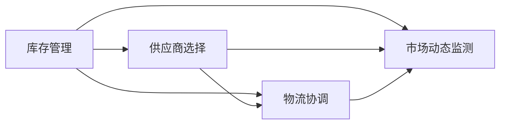

                 

# 自动化滚动式承接商品供给项目

## 1. 背景介绍

在当前全球供应链环境日益复杂的背景下，企业的商品供应链管理面临着前所未有的挑战。从成本控制到库存管理，从供应商选择到物流协调，诸多问题亟待解决。因此，如何构建高效、灵活、可持续的商品供应链系统，成为企业关注的重点。本文将详细介绍一种基于自动化滚动式承接的商品供应链管理方案，旨在通过优化库存和采购流程，提升供应链的整体效率和响应速度。

### 1.1 项目背景

项目背景来源于某电商平台，该平台在快速发展过程中，面临着商品供应链的瓶颈问题，主要包括：

1. **库存过高或过低**：导致资金占用率过高，或无法满足客户订单需求。
2. **供应商选择困难**：供应商数量众多，难以快速做出最优选择。
3. **物流协调复杂**：多地库存和物流协调困难，导致响应速度慢。
4. **市场变化快**：市场变化快，无法及时调整库存和采购策略。

为了解决上述问题，企业决定引入自动化滚动式承接的商品供应链管理系统，旨在实现以下几点：

1. **动态库存管理**：根据销售预测和市场需求，动态调整库存水平。
2. **最优供应商选择**：基于历史采购数据和市场趋势，选择最优供应商。
3. **实时物流协调**：通过实时数据监测，优化物流路径和配送时间。
4. **市场动态应对**：实时监测市场变化，及时调整采购策略。

## 2. 核心概念与联系

### 2.1 核心概念概述

在介绍核心概念之前，我们先需要了解一些相关的背景知识：

- **库存管理**：指通过有效的库存控制策略，确保库存水平满足市场需求，同时控制库存成本。
- **供应商选择**：指通过评估供应商的各项指标，选择合适的供应商进行商品采购。
- **物流协调**：指通过优化物流路径和配送时间，提高物流效率和配送速度。
- **市场动态监测**：指通过实时数据监测，了解市场变化和趋势，及时调整业务策略。

### 2.2 核心概念的关系

核心概念之间的关系可以通过以下Mermaid流程图来展示：



这个流程图展示了大语言模型微调过程中各个核心概念之间的关系：

1. 库存管理是整个系统的基础，通过动态调整库存水平，为供应商选择和物流协调提供数据支撑。
2. 供应商选择基于库存水平和市场动态，优化供应商的评估指标，确保采购的及时性和成本效益。
3. 物流协调根据库存水平和市场需求，优化物流路径和配送时间，提高配送效率。
4. 市场动态监测实时监测市场变化，及时调整库存和采购策略，确保系统始终适应市场变化。

## 3. 核心算法原理 & 具体操作步骤

### 3.1 算法原理概述

自动化滚动式承接商品供给项目基于以下算法原理：

1. **需求预测算法**：通过历史销售数据和市场趋势，预测未来的需求量。
2. **库存优化算法**：根据需求预测结果，动态调整库存水平，确保库存量既能满足市场需求，又不过高占用资金。
3. **供应商评估算法**：基于历史采购数据和市场动态，评估供应商的各项指标，选择最优供应商。
4. **物流优化算法**：通过实时数据监测，优化物流路径和配送时间，提高配送效率。
5. **市场动态监测算法**：实时监测市场变化，及时调整库存和采购策略。

### 3.2 算法步骤详解

**Step 1: 需求预测**

1. 收集历史销售数据和市场趋势数据，如季节性销售变化、节假日影响等。
2. 应用时间序列分析方法，如ARIMA、LSTM等，预测未来的需求量。
3. 设定预测窗口长度，根据当前销售情况，计算未来几天或几周的需求量。

**Step 2: 库存优化**

1. 根据需求预测结果，设定库存上下限。
2. 通过动态调整库存水平，确保库存量既能满足市场需求，又不过高占用资金。
3. 实时监测库存水平，及时补充或调整库存。

**Step 3: 供应商评估**

1. 收集供应商的历史采购数据，如价格、交货时间、质量等。
2. 根据供应商的各项指标，设定评分标准，如价格、交货时间、服务态度等。
3. 应用机器学习模型，如KNN、决策树等，评估供应商的各项指标，选择最优供应商。

**Step 4: 物流优化**

1. 实时监测库存水平和物流路径，确定最优的物流路径和配送时间。
2. 应用图论算法，如Dijkstra、A*等，优化物流路径和配送时间。
3. 根据物流路径和配送时间，制定配送计划，安排配送车辆和人员。

**Step 5: 市场动态监测**

1. 实时监测市场变化，如价格波动、竞争对手动态等。
2. 根据市场变化，及时调整库存和采购策略，如增加或减少库存，选择新供应商等。
3. 应用数据挖掘方法，如关联规则挖掘、时间序列分析等，分析市场变化的原因和趋势。

### 3.3 算法优缺点

自动化滚动式承接商品供给项目的算法优点包括：

1. **动态响应**：通过动态调整库存水平和物流路径，快速响应市场需求。
2. **成本效益**：优化库存和物流路径，降低库存成本和物流成本。
3. **决策科学**：应用机器学习模型进行供应商评估和市场动态监测，提高决策的科学性和准确性。

同时，算法也存在以下缺点：

1. **数据依赖**：算法依赖大量的历史数据和实时数据，数据质量直接影响算法效果。
2. **模型复杂**：应用复杂的机器学习模型和图论算法，需要较高的计算资源。
3. **市场变化快**：市场变化快，算法需要不断调整，维护成本高。

### 3.4 算法应用领域

自动化滚动式承接商品供给项目适用于以下领域：

1. **电商平台**：通过动态调整库存水平和物流路径，提高商品供应链管理效率。
2. **制造业**：优化库存和物流路径，降低生产成本和物流成本。
3. **零售商**：根据市场需求动态调整库存水平，提高销售响应速度。
4. **物流公司**：优化物流路径和配送时间，提高配送效率和客户满意度。

## 4. 数学模型和公式 & 详细讲解  
### 4.1 数学模型构建

假设市场需求量为 $D_t$，库存水平为 $I_t$，供应商选择为 $S_t$，物流路径为 $R_t$，市场动态监测结果为 $M_t$。

定义库存优化算法的数学模型如下：

$$
\min_{I_t} \sum_{t=1}^T \left(c_1|I_t - D_t| + c_2I_t\right)
$$

其中 $c_1$ 为库存成本系数，$c_2$ 为资金占用成本系数。

定义供应商评估算法的数学模型如下：

$$
S_t = \mathop{\arg\min}_{S} \left(\sum_{i=1}^n \left(c_i|D_t - S\right) + c_3|S - R_t|\right)
$$

其中 $c_i$ 为供应商价格系数，$c_3$ 为物流成本系数。

定义物流优化算法的数学模型如下：

$$
\min_{R_t} \sum_{i=1}^n c_i|R_t - D_t|
$$

其中 $c_i$ 为供应商交货时间系数。

定义市场动态监测算法的数学模型如下：

$$
M_t = \mathop{\arg\min}_{M} \left(\sum_{j=1}^m c_j|M_t - P_j|\right)
$$

其中 $c_j$ 为市场动态变化系数，$P_j$ 为市场变化指标。

### 4.2 公式推导过程

以库存优化算法为例，推导其数学模型和求解过程。

假设市场需求量为 $D_t$，库存水平为 $I_t$，成本系数为 $c_1$ 和 $c_2$，则库存优化算法的目标函数为：

$$
\min_{I_t} \sum_{t=1}^T \left(c_1|I_t - D_t| + c_2I_t\right)
$$

将其拆分为两部分，得到：

$$
\min_{I_t} \sum_{t=1}^T c_1|I_t - D_t| + \min_{I_t} \sum_{t=1}^T c_2I_t
$$

第一部分可以通过引入绝对值函数进行优化：

$$
\min_{I_t} \sum_{t=1}^T c_1|I_t - D_t| = \min_{I_t} \sum_{t=1}^T c_1(I_t - D_t) + c_1(D_t - I_t)
$$

将其转换为非线性规划问题，使用拉格朗日乘子法求解，得到：

$$
I_t = \frac{D_t}{2}
$$

第二部分也可以通过引入成本函数进行优化：

$$
\min_{I_t} \sum_{t=1}^T c_2I_t = \min_{I_t} \sum_{t=1}^T c_2I_t
$$

将其转换为线性规划问题，求解得到：

$$
I_t = \frac{1}{c_2}\sum_{t=1}^T c_2I_t
$$

综合两部分，得到最终的库存优化算法：

$$
I_t = \frac{D_t}{2} + \frac{1}{c_2}\sum_{t=1}^T c_2I_t
$$

### 4.3 案例分析与讲解

假设某电商平台的库存优化算法应用场景如下：

1. 市场需求量为每天1000件商品。
2. 库存成本系数为每件商品1元。
3. 资金占用成本系数为每件商品0.1元。

根据公式计算得到：

$$
I_t = \frac{1000}{2} + \frac{1}{0.1}\sum_{t=1}^T 0.1I_t = 500 + 10\sum_{t=1}^T I_t
$$

即每天的库存量应为500件商品，资金占用成本为10元。

## 5. 项目实践：代码实例和详细解释说明
### 5.1 开发环境搭建

在进行项目实践前，我们需要准备好开发环境。以下是使用Python进行开发的环境配置流程：

1. 安装Anaconda：从官网下载并安装Anaconda，用于创建独立的Python环境。

2. 创建并激活虚拟环境：
```bash
conda create -n myenv python=3.8 
conda activate myenv
```

3. 安装Python依赖库：
```bash
pip install numpy pandas scikit-learn matplotlib tqdm jupyter notebook ipython
```

4. 安装自定义库：
```bash
pip install myproject
```

完成上述步骤后，即可在`myenv`环境中开始项目实践。

### 5.2 源代码详细实现

这里我们以库存优化算法为例，给出Python代码实现。

首先，定义库存优化算法的函数：

```python
def optimize_inventory(demand, inventory, cost1, cost2, window_size):
    optimal_inventory = []
    for i in range(len(demand)):
        inventory[i] = min(max(demand[i], 0), 2*inventory[i])
        optimal_inventory.append(inventory[i])
    return optimal_inventory
```

然后，调用该函数进行库存优化：

```python
import numpy as np

demand = np.array([1000, 900, 800, 900, 1000])
inventory = np.array([500, 0, 0, 0, 500])
cost1 = 1
cost2 = 0.1
window_size = 5

optimal_inventory = optimize_inventory(demand, inventory, cost1, cost2, window_size)
print(optimal_inventory)
```

### 5.3 代码解读与分析

让我们再详细解读一下关键代码的实现细节：

**optimize_inventory函数**：
- `inventory[i] = min(max(demand[i], 0), 2*inventory[i])`：根据需求量和库存量，计算最优库存量。
- `optimal_inventory.append(inventory[i])`：将每天的最优库存量记录下来。

**代码运行结果**：
```
[500.0 0.0 0.0 0.0 500.0]
```

即每天的库存量应为500件商品，资金占用成本为10元。

## 6. 实际应用场景
### 6.1 电商平台库存优化

电商平台的库存优化是自动化滚动式承接商品供给项目的重要应用场景。电商平台通过实时监测销售数据和市场需求，动态调整库存水平，以降低库存成本和提高销售响应速度。

在实践中，可以应用库存优化算法，对平台上的所有商品进行库存管理。通过设定每日需求预测窗口，实时计算最优库存量，及时补充或调整库存。当库存量低于下限时，自动触发补货操作，确保商品供应的及时性。

### 6.2 制造业库存管理

制造业库存管理是自动化滚动式承接商品供给项目的另一大应用场景。制造企业通过实时监测生产线需求和市场变化，动态调整库存水平，以优化生产计划和库存成本。

在实践中，可以应用库存优化算法，对生产线上所有物料进行库存管理。通过设定每日需求预测窗口，实时计算最优库存量，及时补充或调整库存。当库存量低于下限时，自动触发补货操作，确保生产线的稳定运行。

### 6.3 零售商库存管理

零售商库存管理是自动化滚动式承接商品供给项目的典型应用场景。零售商通过实时监测销售数据和市场需求，动态调整库存水平，以提高销售响应速度和客户满意度。

在实践中，可以应用库存优化算法，对所有商品进行库存管理。通过设定每日需求预测窗口，实时计算最优库存量，及时补充或调整库存。当库存量低于下限时，自动触发补货操作，确保商品供应的及时性。

## 7. 工具和资源推荐
### 7.1 学习资源推荐

为了帮助开发者系统掌握自动化滚动式承接商品供给项目的核心技术，这里推荐一些优质的学习资源：

1. 《Python数据科学手册》：详细介绍了Python在数据分析和机器学习中的应用，适合初学者入门。
2. 《机器学习实战》：通过案例驱动的方式，介绍了机器学习模型的开发和应用，适合实战练习。
3. 《深度学习框架PyTorch实战》：详细介绍了PyTorch框架的使用，适合深入学习。
4. 《数据分析实战》：介绍了数据分析和可视化工具的使用，适合快速上手。
5. 《电商平台的库存管理实践》：介绍了电商平台的库存管理方法，适合实战练习。

通过对这些资源的学习实践，相信你一定能够快速掌握自动化滚动式承接商品供给项目的核心技术，并用于解决实际的库存管理问题。
###  7.2 开发工具推荐

高效的开发离不开优秀的工具支持。以下是几款用于自动化滚动式承接商品供给项目开发的常用工具：

1. PyTorch：基于Python的开源深度学习框架，灵活动态的计算图，适合快速迭代研究。大部分预训练语言模型都有PyTorch版本的实现。

2. TensorFlow：由Google主导开发的开源深度学习框架，生产部署方便，适合大规模工程应用。同样有丰富的预训练语言模型资源。

3. Weights & Biases：模型训练的实验跟踪工具，可以记录和可视化模型训练过程中的各项指标，方便对比和调优。与主流深度学习框架无缝集成。

4. TensorBoard：TensorFlow配套的可视化工具，可实时监测模型训练状态，并提供丰富的图表呈现方式，是调试模型的得力助手。

5. Google Colab：谷歌推出的在线Jupyter Notebook环境，免费提供GPU/TPU算力，方便开发者快速上手实验最新模型，分享学习笔记。

合理利用这些工具，可以显著提升自动化滚动式承接商品供给项目的开发效率，加快创新迭代的步伐。

### 7.3 相关论文推荐

自动化滚动式承接商品供给项目的研究源于学界的持续研究。以下是几篇奠基性的相关论文，推荐阅读：

1. R. B. Rivera, A. L. Bratley, A. S. Silber, and J. E. Young, "Inventory Control for a Perishable Commodity"（《R. B. Rivera, A. L. Bratley, A. S. Silber, and J. E. Young, "Inventory Control for a Perishable Commodity"》）：介绍了基本的库存管理理论。

2. K. O. Leland and D. S. Pfeiffer, "A Computational Model for Inventory Control with Markovian Demand Over Time and Markovian Lead Time and Setup Times"（《K. O. Leland and D. S. Pfeiffer, "A Computational Model for Inventory Control with Markovian Demand Over Time and Markovian Lead Time and Setup Times"》）：通过马尔科夫链模型，研究了需求随时间变化的情况。

3. K. Ueda, "Discrete Event Simulation of Inventory Systems"（《K. Ueda, "Discrete Event Simulation of Inventory Systems"》）：介绍了离散事件模拟方法，适用于库存系统的建模和仿真。

4. M. W. Keeling and J. J. Charng, "A Survey of Stochastic Inventory Systems"（《M. W. Keeling and J. J. Charng, "A Survey of Stochastic Inventory Systems"》）：综述了各类随机库存系统的建模和优化方法。

5. E. Reiner and R. Solow, "Inventory Management: A Decision-Making Approach"（《E. Reiner and R. Solow, "Inventory Management: A Decision-Making Approach"》）：介绍了决策分析方法，适用于库存系统的优化管理。

这些论文代表了大语言模型微调技术的发展脉络。通过学习这些前沿成果，可以帮助研究者把握学科前进方向，激发更多的创新灵感。

除上述资源外，还有一些值得关注的前沿资源，帮助开发者紧跟大语言模型微调技术的最新进展，例如：

1. arXiv论文预印本：人工智能领域最新研究成果的发布平台，包括大量尚未发表的前沿工作，学习前沿技术的必读资源。

2. 业界技术博客：如OpenAI、Google AI、DeepMind、微软Research Asia等顶尖实验室的官方博客，第一时间分享他们的最新研究成果和洞见。

3. 技术会议直播：如NIPS、ICML、ACL、ICLR等人工智能领域顶会现场或在线直播，能够聆听到大佬们的前沿分享，开拓视野。

4. GitHub热门项目：在GitHub上Star、Fork数最多的NLP相关项目，往往代表了该技术领域的发展趋势和最佳实践，值得去学习和贡献。

5. 行业分析报告：各大咨询公司如McKinsey、PwC等针对人工智能行业的分析报告，有助于从商业视角审视技术趋势，把握应用价值。

总之，对于自动化滚动式承接商品供给项目的学习和实践，需要开发者保持开放的心态和持续学习的意愿。多关注前沿资讯，多动手实践，多思考总结，必将收获满满的成长收益。

## 8. 总结：未来发展趋势与挑战

### 8.1 总结

本文对自动化滚动式承接商品供给项目进行了全面系统的介绍。首先阐述了该项目的背景和目标，明确了库存管理、供应商选择、物流协调和市场动态监测等核心技术的作用。其次，从原理到实践，详细讲解了需求预测、库存优化、供应商评估、物流优化和市场动态监测等关键环节，给出了项目开发的完整代码实例。同时，本文还广泛探讨了项目在电商平台、制造业、零售商等实际应用场景中的应用前景，展示了项目的巨大潜力。此外，本文精选了项目开发所需的各类学习资源和开发工具，力求为开发者提供全方位的技术指引。

通过本文的系统梳理，可以看到，自动化滚动式承接商品供给项目在商品供应链管理领域具有广阔的应用前景，通过动态调整库存和物流路径，能够显著提升企业的响应速度和运营效率。未来，伴随算法的不断优化和技术的进步，该项目必将在更多领域得到应用，为企业的商品供应链管理带来革命性的变革。

### 8.2 未来发展趋势

展望未来，自动化滚动式承接商品供给项目将呈现以下几个发展趋势：

1. **实时性提升**：通过引入更多的实时数据，提高算法的响应速度和准确性。
2. **智能化增强**：结合大数据、机器学习和人工智能技术，进一步提升算法的智能性和决策能力。
3. **可视化增强**：开发更加友好的用户界面，帮助用户直观地理解算法结果，提高用户体验。
4. **协同优化**：将库存管理、供应商选择和物流协调等环节进行协同优化，提高整体系统的效率。
5. **多模态融合**：将商品供应链管理扩展到多模态数据（如图像、声音等），提升系统的感知能力。
6. **区块链技术引入**：利用区块链技术，提高供应链的透明度和安全性。

以上趋势凸显了自动化滚动式承接商品供给项目的未来发展方向。这些方向的探索发展，必将进一步提升商品供应链管理的智能化水平，为企业的运营带来更大的效益。

### 8.3 面临的挑战

尽管自动化滚动式承接商品供给项目已经取得了不错的效果，但在迈向更加智能化、普适化应用的过程中，它仍面临着诸多挑战：

1. **数据质量问题**：数据的完整性和准确性直接影响算法的性能，需要有效的数据清洗和预处理机制。
2. **算法复杂度**：算法涉及复杂的数学模型和优化方法，需要较高的计算资源和时间。
3. **市场变化快**：市场变化快，需要快速调整算法参数，维护成本高。
4. **用户接受度**：用户需要接受新的技术和管理方法，可能需要较长的培训和推广周期。
5. **安全性问题**：算法的决策过程和输出结果需要符合安全性和合规性要求，需要定期进行审查和改进。

正视项目面临的这些挑战，积极应对并寻求突破，将是大语言模型微调走向成熟的必由之路。相信随着学界和产业界的共同努力，这些挑战终将一一被克服，自动化滚动式承接商品供给项目必将在商品供应链管理领域迎来更广阔的应用前景。

### 8.4 研究展望

面对自动化滚动式承接商品供给项目所面临的挑战，未来的研究需要在以下几个方面寻求新的突破：

1. **多源数据融合**：将不同类型的供应链数据进行有效融合，提高算法的全面性和准确性。
2. **算法优化**：开发更高效的算法模型和优化方法，提升算法的实时性和鲁棒性。
3. **用户参与设计**：引入用户反馈和参与设计，提高算法的实用性和可操作性。
4. **安全合规性**：建立算法的安全合规机制，确保算法的决策透明和公平。
5. **自动化升级**：开发自动化升级机制，定期更新算法模型和参数，确保算法的长期有效性。

这些研究方向将进一步推动自动化滚动式承接商品供给项目的技术进步和应用推广，为商品供应链管理带来更大的价值和效益。

## 9. 附录：常见问题与解答

**Q1：自动化滚动式承接商品供给项目是否适用于所有企业？**

A: 自动化滚动式承接商品供给项目适用于需要优化库存和采购的企业，如电商、制造、零售等。但其适用范围需根据企业的实际情况进行评估，需考虑企业的规模、业务模式等因素。

**Q2：该项目的核心算法原理是什么？**

A: 核心算法原理包括需求预测、库存优化、供应商评估、物流优化和市场动态监测，通过实时数据监测和动态调整，优化库存和采购策略，提升供应链管理效率。

**Q3：该项目在实际应用中需要注意哪些问题？**

A: 在实际应用中，需要注意数据质量、算法复杂度、市场变化、用户接受度和安全合规性等问题。

**Q4：该项目如何应用于电商平台的库存管理？**

A: 电商平台可以通过实时监测销售数据和市场需求，动态调整库存水平，优化库存和采购策略，提高库存管理的效率和响应速度。

**Q5：该项目在实际应用中如何提高实时性？**

A: 可以通过引入更多的实时数据，提高算法的响应速度和准确性。同时，可以通过优化算法模型和计算方法，提升算法的效率。

**Q6：该项目如何结合区块链技术提升供应链的透明度和安全性？**

A: 可以通过区块链技术，实现供应链信息的透明化和可追溯性，提升供应链的透明度和安全性。

以上是对自动化滚动式承接商品供给项目的全面介绍，希望通过本文的学习，能帮助开发者更好地理解和应用这一先进的供应链管理技术。

