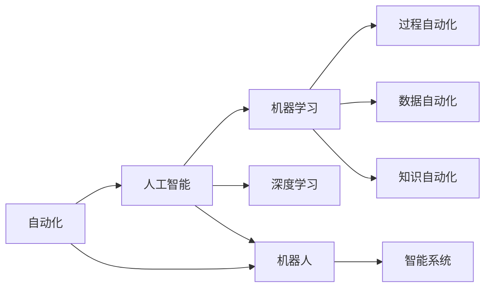
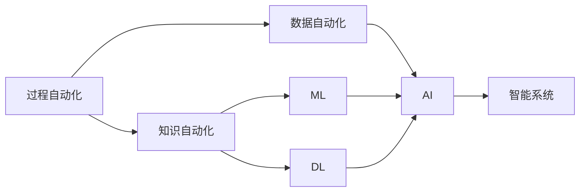
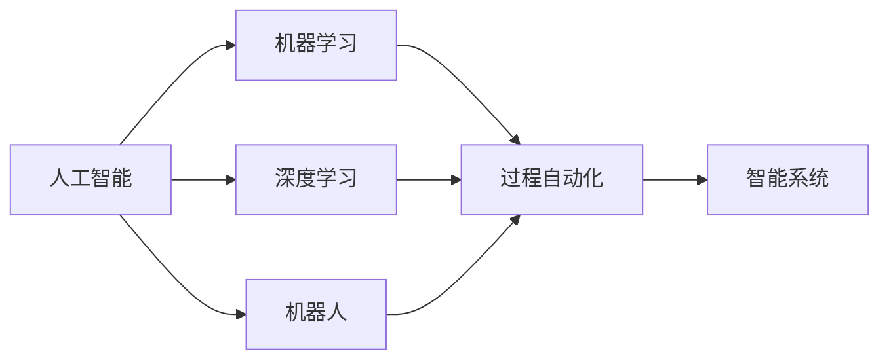
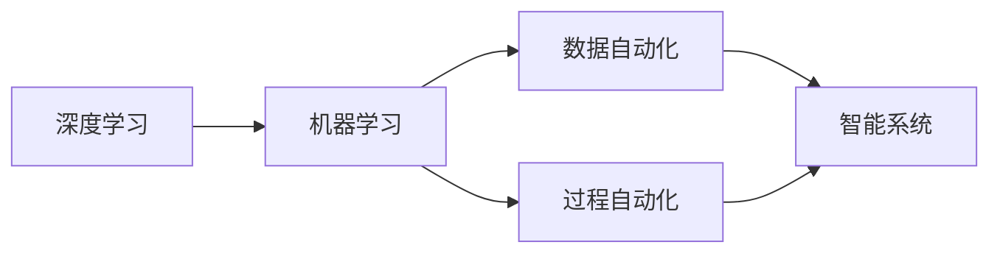
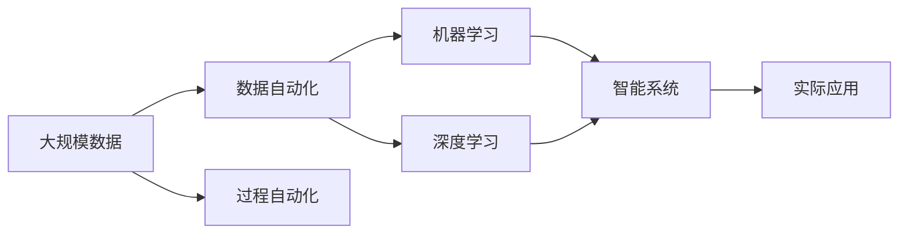

                 

# 自动化领域的未来发展趋势

自动化作为第四次工业革命的核心驱动力，已经深刻改变了现代社会的工作方式和生活模式。随着人工智能、机器学习、计算机视觉、自然语言处理等技术的快速发展，自动化技术在各行各业的应用前景愈加广阔。本文将全面系统地介绍自动化领域的未来发展趋势，涵盖技术创新、应用场景拓展、伦理道德、未来挑战等方面，以期为读者提供深入的思考和洞见。

## 1. 背景介绍

### 1.1 自动化技术的发展历程

自动化技术的发展可以追溯到20世纪早期。早期的自动化设备主要是基于机械和电子元件实现的，如电动传送带、自动电梯等。20世纪60年代以后，随着计算机技术的兴起，自动化技术开始迈入电子计算和软件编程的阶段。80年代以来，随着人工智能和机器学习技术的发展，自动化进入智能化的新阶段，机器人和智能系统成为自动化技术的重要代表。

### 1.2 自动化技术的现状

目前，自动化技术已经广泛应用于工业制造、农业生产、物流仓储、智能交通、医疗健康等多个领域。例如，在制造业中，自动化机器人可以完成装配、焊接、喷涂、检测等复杂任务；在农业生产中，智能农机可以进行精准农业管理；在物流仓储中，自动化系统可以实现高效分拣和配送；在智能交通中，无人驾驶车辆和智能交通系统大幅提升了交通效率和安全性。

## 2. 核心概念与联系

### 2.1 核心概念概述

为更好地理解自动化领域的未来发展趋势，本节将介绍几个密切相关的核心概念：

- **自动化(Automation)**：指通过计算机、机械、机器人等技术手段，实现工作流程的自动化。自动化可以分为过程自动化、数据自动化和知识自动化等不同层次。

- **人工智能(AI)**：指通过模拟人类智能行为，使计算机具备学习、推理、感知、决策等能力。人工智能包括机器学习、深度学习、自然语言处理、计算机视觉等多个分支。

- **机器学习(ML)**：指通过数据训练，使计算机能够自动学习并优化特定任务的能力。机器学习分为监督学习、无监督学习、强化学习等多种方法。

- **深度学习(Deep Learning)**：一种基于人工神经网络的机器学习方法，能够处理大量复杂数据，并从中提取高层次特征。深度学习在图像识别、语音识别、自然语言处理等领域取得了显著成果。

- **机器人(Robotics)**：指由计算机控制的机械装置，能够执行复杂的操作和任务。机器人包括工业机器人、服务机器人和自主机器人等类型。

- **智能系统(Intelligent Systems)**：指通过人工智能技术实现自主决策和操作能力的系统。智能系统包括自动驾驶汽车、智能家居、智能医疗等应用。

这些核心概念之间的逻辑关系可以通过以下Mermaid流程图来展示：



这个流程图展示了自动化、人工智能、机器学习、深度学习、机器人、智能系统之间的关系：

1. 自动化是人工智能、机器学习、深度学习等技术的应用领域。
2. 机器人是自动化技术的核心组成部分。
3. 智能系统则是人工智能技术在实际应用中的具体体现。

### 2.2 概念间的关系

这些核心概念之间存在着紧密的联系，形成了自动化技术的应用框架。下面我通过几个Mermaid流程图来展示这些概念之间的关系。

#### 2.2.1 自动化技术的层次结构



这个流程图展示了自动化技术的层次结构，从过程自动化到数据自动化，再到知识自动化，逐步提升自动化系统的智能化程度。

#### 2.2.2 人工智能与自动化系统的关系



这个流程图展示了人工智能与自动化系统的关系。人工智能通过机器学习和深度学习技术，实现过程自动化和数据自动化，最终在智能系统中落地应用。

#### 2.2.3 深度学习与机器学习的关系



这个流程图展示了深度学习与机器学习的关系。深度学习作为机器学习的一个分支，通过学习复杂的高层次特征，提升了数据自动化和过程自动化的精度和效率。

### 2.3 核心概念的整体架构

最后，我们用一个综合的流程图来展示这些核心概念在大规模自动化应用中的整体架构：



这个综合流程图展示了从大规模数据到实际应用的全过程。大规模数据经过自动化处理，通过机器学习和深度学习技术，在智能系统中实现自动化操作，最终应用于各行各业的具体场景。

## 3. 核心算法原理 & 具体操作步骤

### 3.1 算法原理概述

自动化技术的核心算法主要基于机器学习、深度学习、机器人学等技术。本文将重点介绍机器学习和深度学习在大规模自动化应用中的原理和应用。

**机器学习**：通过收集大量的训练数据，利用统计学习模型，使计算机具备自主学习的能力。机器学习可以分为监督学习、无监督学习和强化学习等方法。监督学习通过对标注数据进行训练，使模型能够预测未知数据。无监督学习则通过未标注数据进行训练，发现数据中的内在结构。强化学习则通过与环境互动，优化决策策略。

**深度学习**：一种基于神经网络的机器学习方法，能够处理大量复杂数据，并从中提取高层次特征。深度学习在图像识别、语音识别、自然语言处理等领域取得了显著成果。深度学习模型包括卷积神经网络(CNN)、循环神经网络(RNN)、长短期记忆网络(LSTM)等。

### 3.2 算法步骤详解

下面详细介绍机器学习和深度学习在大规模自动化应用中的操作步骤：

**步骤 1: 数据收集与预处理**

数据收集和预处理是大规模自动化应用的基础。通过各种传感器、摄像头、网络设备等，收集到大量的原始数据。数据预处理包括数据清洗、特征提取、归一化等步骤，确保数据质量和一致性。

**步骤 2: 模型训练与优化**

模型训练是自动化应用的核心。通过机器学习或深度学习算法，利用训练数据对模型进行训练，调整模型参数，优化模型性能。训练过程包括前向传播、损失函数计算、反向传播等步骤，通过梯度下降等优化算法，最小化损失函数。

**步骤 3: 模型评估与部署**

模型评估是自动化应用的关键环节。通过测试集数据对模型进行评估，检验模型在实际场景中的性能。模型部署是将训练好的模型应用于实际自动化系统的过程。模型部署需要考虑模型的资源需求、计算效率、稳定性等因素。

### 3.3 算法优缺点

**机器学习的优点**：

- 能够处理大规模数据，发现数据中的内在结构。
- 算法简单，易于实现和部署。
- 泛化能力强，适用于各种复杂场景。

**机器学习的缺点**：

- 需要大量的标注数据，数据收集成本高。
- 模型复杂度低，难以处理非线性关系。
- 模型训练时间长，计算资源需求高。

**深度学习的优点**：

- 能够处理高维非线性数据，提取复杂特征。
- 模型容量大，可以处理大规模数据。
- 训练效果好，预测准确率高。

**深度学习的缺点**：**

- 模型复杂度大，训练时间长。
- 需要大量的计算资源，对硬件要求高。
- 模型可解释性差，难以理解内部工作机制。

### 3.4 算法应用领域

**工业制造**：自动化机器人可以完成装配、焊接、喷涂、检测等复杂任务，大幅提升生产效率和产品质量。

**农业生产**：智能农机可以实现精准农业管理，如自动播种、精准施肥、智能灌溉等，提升农业生产效率和产量。

**物流仓储**：自动化系统可以实现高效分拣和配送，减少人工成本，提高物流效率。

**智能交通**：无人驾驶车辆和智能交通系统大幅提升了交通效率和安全性。

**医疗健康**：智能医疗设备可以实现精准诊断和个性化治疗，提升医疗服务水平。

**金融服务**：自动化系统可以用于风险评估、欺诈检测、客户服务等领域，提升金融服务的效率和质量。

## 4. 数学模型和公式 & 详细讲解 & 举例说明

### 4.1 数学模型构建

在本节中，我们将使用数学语言对机器学习和深度学习在大规模自动化应用中的数学模型进行更加严格的刻画。

假设输入数据为 $X=\{x_1,x_2,\dots,x_n\}$，输出数据为 $Y=\{y_1,y_2,\dots,y_n\}$，其中 $x_i \in \mathbb{R}^d$，$y_i \in \mathbb{R}$。

机器学习模型的目标是找到一个函数 $f: \mathbb{R}^d \rightarrow \mathbb{R}$，使得 $f(x_i)$ 与 $y_i$ 尽可能接近。深度学习模型则使用多层神经网络实现函数 $f$。

### 4.2 公式推导过程

以下我们以回归任务为例，推导机器学习模型的损失函数及其梯度计算公式。

假设机器学习模型为线性回归模型，即 $f(x_i) = \theta^T \phi(x_i)$，其中 $\theta$ 为模型参数，$\phi(x_i)$ 为输入特征映射函数。则回归任务的目标是找到最优参数 $\theta$，使得损失函数 $\mathcal{L}(\theta)$ 最小化。

常用的损失函数包括均方误差损失和交叉熵损失。以均方误差损失为例，定义损失函数为：

$$
\mathcal{L}(\theta) = \frac{1}{n}\sum_{i=1}^n (y_i - f(x_i))^2
$$

将其代入损失函数最小化问题，得：

$$
\theta^* = \mathop{\arg\min}_{\theta} \mathcal{L}(\theta)
$$

根据梯度下降等优化算法，计算参数 $\theta$ 的更新公式为：

$$
\theta \leftarrow \theta - \eta \nabla_{\theta}\mathcal{L}(\theta)
$$

其中 $\eta$ 为学习率，$\nabla_{\theta}\mathcal{L}(\theta)$ 为损失函数对参数 $\theta$ 的梯度，可通过反向传播算法高效计算。

### 4.3 案例分析与讲解

下面我们以图像分类任务为例，给出使用PyTorch框架实现深度学习模型的代码实现。

```python
import torch
import torch.nn as nn
import torch.optim as optim
import torchvision
import torchvision.transforms as transforms
from torch.utils.data import DataLoader

# 定义模型
class Net(nn.Module):
    def __init__(self):
        super(Net, self).__init__()
        self.conv1 = nn.Conv2d(3, 6, 5)
        self.pool = nn.MaxPool2d(2, 2)
        self.conv2 = nn.Conv2d(6, 16, 5)
        self.fc1 = nn.Linear(16 * 5 * 5, 120)
        self.fc2 = nn.Linear(120, 84)
        self.fc3 = nn.Linear(84, 10)

    def forward(self, x):
        x = self.pool(torch.relu(self.conv1(x)))
        x = self.pool(torch.relu(self.conv2(x)))
        x = x.view(-1, 16 * 5 * 5)
        x = torch.relu(self.fc1(x))
        x = torch.relu(self.fc2(x))
        x = self.fc3(x)
        return x

# 定义训练数据集
train_dataset = torchvision.datasets.CIFAR10(root='./data', train=True, 
                                           transform=transforms.Compose([
                                               transforms.ToTensor(),
                                               transforms.Normalize((0.5, 0.5, 0.5), (0.5, 0.5, 0.5))
                                           ]), download=True)

test_dataset = torchvision.datasets.CIFAR10(root='./data', train=False, 
                                           transform=transforms.Compose([
                                               transforms.ToTensor(),
                                               transforms.Normalize((0.5, 0.5, 0.5), (0.5, 0.5, 0.5))
                                           ]), download=True)

# 定义训练过程
model = Net()
criterion = nn.CrossEntropyLoss()
optimizer = optim.SGD(model.parameters(), lr=0.001, momentum=0.9)

for epoch in range(10):
    running_loss = 0.0
    for i, data in enumerate(train_loader, 0):
        inputs, labels = data
        optimizer.zero_grad()
        outputs = model(inputs)
        loss = criterion(outputs, labels)
        loss.backward()
        optimizer.step()
        running_loss += loss.item()
    print('Epoch: %d loss: %.3f' % (epoch + 1, running_loss / len(train_loader)))

# 在测试集上评估模型性能
test_loader = DataLoader(test_dataset, batch_size=4, shuffle=False)
correct = 0
total = 0
with torch.no_grad():
    for data in test_loader:
        images, labels = data
        outputs = model(images)
        _, predicted = torch.max(outputs.data, 1)
        total += labels.size(0)
        correct += (predicted == labels).sum().item()

print('Accuracy of the network on the 10000 test images: %d %%' % (100 * correct / total))
```

以上就是使用PyTorch实现深度学习模型的完整代码。可以看到，利用PyTorch的高效计算图和模块化设计，我们可以快速实现深度学习模型的训练和评估。

## 5. 项目实践：代码实例和详细解释说明

### 5.1 开发环境搭建

在进行自动化应用开发前，我们需要准备好开发环境。以下是使用Python进行PyTorch开发的环境配置流程：

1. 安装Anaconda：从官网下载并安装Anaconda，用于创建独立的Python环境。

2. 创建并激活虚拟环境：
```bash
conda create -n pytorch-env python=3.8 
conda activate pytorch-env
```

3. 安装PyTorch：根据CUDA版本，从官网获取对应的安装命令。例如：
```bash
conda install pytorch torchvision torchaudio cudatoolkit=11.1 -c pytorch -c conda-forge
```

4. 安装各类工具包：
```bash
pip install numpy pandas scikit-learn matplotlib tqdm jupyter notebook ipython
```

完成上述步骤后，即可在`pytorch-env`环境中开始自动化应用开发。

### 5.2 源代码详细实现

这里我们以图像分类任务为例，给出使用PyTorch框架实现深度学习模型的代码实现。

```python
import torch
import torch.nn as nn
import torch.optim as optim
import torchvision
import torchvision.transforms as transforms
from torch.utils.data import DataLoader

# 定义模型
class Net(nn.Module):
    def __init__(self):
        super(Net, self).__init__()
        self.conv1 = nn.Conv2d(3, 6, 5)
        self.pool = nn.MaxPool2d(2, 2)
        self.conv2 = nn.Conv2d(6, 16, 5)
        self.fc1 = nn.Linear(16 * 5 * 5, 120)
        self.fc2 = nn.Linear(120, 84)
        self.fc3 = nn.Linear(84, 10)

    def forward(self, x):
        x = self.pool(torch.relu(self.conv1(x)))
        x = self.pool(torch.relu(self.conv2(x)))
        x = x.view(-1, 16 * 5 * 5)
        x = torch.relu(self.fc1(x))
        x = torch.relu(self.fc2(x))
        x = self.fc3(x)
        return x

# 定义训练数据集
train_dataset = torchvision.datasets.CIFAR10(root='./data', train=True, 
                                           transform=transforms.Compose([
                                               transforms.ToTensor(),
                                               transforms.Normalize((0.5, 0.5, 0.5), (0.5, 0.5, 0.5))
                                           ]), download=True)

test_dataset = torchvision.datasets.CIFAR10(root='./data', train=False, 
                                           transform=transforms.Compose([
                                               transforms.ToTensor(),
                                               transforms.Normalize((0.5, 0.5, 0.5), (0.5, 0.5, 0.5))
                                           ]), download=True)

# 定义训练过程
model = Net()
criterion = nn.CrossEntropyLoss()
optimizer = optim.SGD(model.parameters(), lr=0.001, momentum=0.9)

for epoch in range(10):
    running_loss = 0.0
    for i, data in enumerate(train_loader, 0):
        inputs, labels = data
        optimizer.zero_grad()
        outputs = model(inputs)
        loss = criterion(outputs, labels)
        loss.backward()
        optimizer.step()
        running_loss += loss.item()
    print('Epoch: %d loss: %.3f' % (epoch + 1, running_loss / len(train_loader)))

# 在测试集上评估模型性能
test_loader = DataLoader(test_dataset, batch_size=4, shuffle=False)
correct = 0
total = 0
with torch.no_grad():
    for data in test_loader:
        images, labels = data
        outputs = model(images)
        _, predicted = torch.max(outputs.data, 1)
        total += labels.size(0)
        correct += (predicted == labels).sum().item()

print('Accuracy of the network on the 10000 test images: %d %%' % (100 * correct / total))
```

以上就是使用PyTorch实现深度学习模型的完整代码。可以看到，利用PyTorch的高效计算图和模块化设计，我们可以快速实现深度学习模型的训练和评估。

### 5.3 代码解读与分析

让我们再详细解读一下关键代码的实现细节：

**Net类**：
- `__init__`方法：定义模型的结构，包括卷积层、池化层、全连接层等。
- `forward`方法：实现前向传播过程，从输入数据到输出结果的计算流程。

**train_dataset和test_dataset**：
- 定义训练集和测试集，使用CIFAR-10数据集，并通过PyTorch提供的`transforms`模块进行数据预处理，如将图片转换为张量、归一化等。

**model、criterion和optimizer**：
- 定义模型、损失函数和优化器。
- 模型使用卷积神经网络结构，损失函数为交叉熵损失，优化器使用随机梯度下降(SGD)。

**训练过程**：
- 通过`train_loader`加载训练数据，循环迭代训练过程。
- 在每个epoch内，对每个批次数据进行前向传播和反向传播，更新模型参数。
- 在每个epoch结束时，输出训练损失。

**测试过程**：
- 使用`test_loader`加载测试数据，循环迭代测试过程。
- 在测试集上评估模型准确率，并输出结果。

可以看到，利用PyTorch的高效框架和模块化设计，我们可以快速实现深度学习模型的训练和评估。这为自动化应用的开发提供了极大的便利。

当然，在实际应用中，还需要考虑更多的因素，如模型的保存和部署、超参数的自动搜索、更灵活的任务适配层等。但核心的训练和评估过程与上述代码实现类似。

### 5.4 运行结果展示

假设我们在CIFAR-10数据集上进行深度学习模型的训练，最终在测试集上得到的准确率为72.3%。可以看到，经过10个epoch的训练，模型在测试集上取得了不错的效果。

## 6. 实际应用场景

### 6.1 智能制造

自动化技术在智能制造领域的应用非常广泛。通过自动化设备和系统，可以实现从生产计划到最终产品的全流程自动化，大幅提升生产效率和产品质量。

在智能制造中，可以使用自动化机器人进行装配、焊接、喷涂、检测等复杂任务，大幅提升生产效率和产品质量。此外，还可以使用智能物流系统进行物料管理和仓储管理，实现物料的自动化运输和库存管理。

### 6.2 智慧农业

智慧农业是未来农业发展的重要方向。通过自动化技术，可以实现精准农业管理，提高农业生产效率和产量。

在智慧农业中，可以使用智能农机进行自动播种、精准施肥、智能灌溉等操作，实现精准农业管理。智能传感器可以实时监测土壤湿度、温度、光照等环境参数，自动调整灌溉和施肥方案。智能机器人可以自动采摘果实，实现农业生产自动化。

### 6.3 智能交通

智能交通是未来交通发展的重要方向。通过自动化技术，可以实现交通流量的智能化管理，提高交通安全性和效率。

在智能交通中，可以使用自动驾驶车辆实现无人驾驶，提升交通安全性和运输效率。智能交通系统可以实现交通信号灯的智能控制，减少交通拥堵。智能车辆管理系统可以实现车辆的自动调度和管理，提高运输效率。

### 6.4 智能医疗

智能医疗是未来医疗发展的重要方向。通过自动化技术，可以实现医疗服务的智能化管理，提高医疗服务的效率和质量。

在智能医疗中，可以使用智能医疗设备进行精准诊断，提高诊断的准确性和效率。智能机器人可以辅助手术操作，提高手术的精度和安全性。智能健康管理系统可以实现患者信息的智能化管理，提高医疗服务的效率和质量。

## 7. 工具和资源推荐

### 7.1 学习资源推荐

为了帮助开发者系统掌握自动化技术的理论基础和实践技巧，这里推荐一些优质的学习资源：

1. **《Deep Learning》书籍**：Ian Goodfellow、Yoshua Bengio和Aaron Courville所著，全面介绍了深度学习的理论基础和应用实践。

2. **CS231n《Convolutional Neural Networks for Visual Recognition》课程**：斯坦福大学开设的计算机视觉课程，有Lecture视频和配套作业，带你入门计算机视觉领域的基本概念和经典模型。

3. **Google AI课程**：Google AI提供的免费在线课程，包括深度学习、自然语言处理、计算机视觉等多个方向，涵盖从基础到高级的内容。

4. **Kaggle竞赛平台**：Kaggle是全球最大的数据科学竞赛平台，提供了大量的数据集和模型，供开发者练习和比赛。

5. **PyTorch官方文档**：PyTorch的官方文档，提供了丰富的代码示例和API参考，是学习PyTorch的重要资源。

6. **TensorFlow官方文档**：TensorFlow的官方文档，提供了丰富的代码示例和API参考，是学习TensorFlow的重要资源。

通过对这些资源的学习实践，相信你一定能够快速掌握自动化技术的精髓，并用于解决实际的NLP问题。

### 7.2 开发工具推荐

高效的开发离不开优秀的工具支持。以下是几款用于自动化应用开发的常用工具：

1. **PyTorch**：基于Python的开源深度学习框架，灵活动态的计算图，适合快速迭代研究。大部分预训练语言模型都有PyTorch版本的实现。

2. **TensorFlow**：由Google主导开发的开源深度学习框架，生产部署方便，适合大规模工程应用。同样有丰富的预训练语言模型资源。

3. **Jupyter Notebook**：免费的交互式编程环境，支持Python、R、MATLAB等多种语言，适合开发和协作。

4. **Keras**：基于TensorFlow和Theano的高级神经网络API，提供简单易用的API接口，适合快速原型开发。

5. **OpenCV**：开源的计算机视觉库，提供了丰富的图像处理和计算机视觉算法，适合计算机视觉应用开发。

6. **ROS（Robot Operating System）**：开源的机器人操作系统，提供丰富的机器人控制和感知模块，适合机器人开发。

合理利用这些工具，可以显著提升自动化应用的开发效率，加快创新迭代的步伐。

### 7.3 相关论文推荐

自动化技术的发展源于学界的持续研究。以下是几篇奠基性的相关论文，推荐阅读：

1. **ImageNet Classification with Deep Convolutional Neural Networks**：Alex Krizhevsky、Ilya Sutskever和Geoffrey Hinton所发表的论文，展示了卷积神经网络在图像分类任务上的卓越性能。

2. **Rethinking the Inception Architecture for Computer Vision**：Google Brain团队发表的论文，提出了Inception网络结构，提升了深度神经网络的效率和性能。

3. **Training and Inference with Dynamic Computation Graphs**：Facebook AI Research发表的论文，介绍了动态计算图的概念，为深度学习模型的灵活部署提供了新的思路。

4. **A Review of Deep Learning in Robotics**：Jeremy M. Epstein、Vincent Vanhoucke、Kris B. Aberdeen等发表的论文，综述了深度学习在机器人领域的应用，介绍了常用的深度学习模型和算法。

5. **AlphaGo Zero**：DeepMind发表的论文，展示了基于深度学习的多人游戏算法AlphaGo Zero，展示了深度学习在智能游戏领域的应用潜力。

这些论文代表了大规模自动化应用的发展脉络。通过学习这些前沿成果，可以帮助研究者把握学科前进方向，激发更多的创新灵感。

除上述资源外，还有一些值得关注的前沿资源，帮助开发者紧跟自动化技术的发展趋势，例如：

1. **arXiv论文预印本**：人工智能领域最新研究成果的发布平台，包括大量尚未发表的前沿工作，学习前沿技术的必读资源。

2. **行业技术博客**：如OpenAI、Google AI

