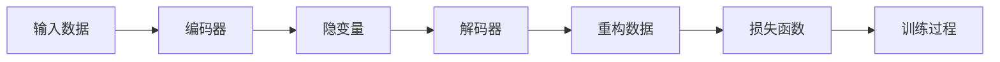
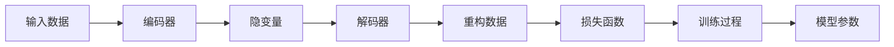
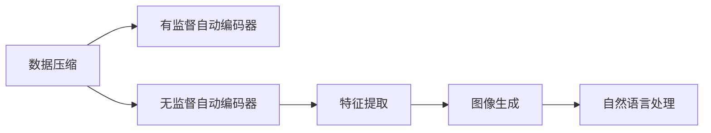
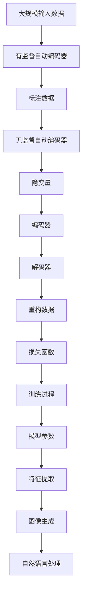

                 

# 自动编码器 (Autoencoder)

自动编码器（Autoencoder）是一种重要的深度学习模型，用于数据压缩和降维。它通过对输入数据的隐变量进行编码和解码，实现对数据的重构，并且能够捕获数据的隐含特征。本文将详细探讨自动编码器的原理、算法步骤、优缺点、应用领域以及实际应用场景，最后给出相关的学习资源、开发工具和研究论文推荐。

## 1. 背景介绍

### 1.1 问题由来
自动编码器最初是为了解决信号处理中的信号压缩问题而提出的。它通过将高维信号压缩到低维空间，再通过解码器将其重构回原始信号，从而实现数据的压缩和解压缩。在计算机视觉、自然语言处理、音频信号处理等领域，自动编码器被广泛应用于特征提取、降维、数据生成等任务。

### 1.2 问题核心关键点
自动编码器的核心思想是通过对输入数据的编码和解码过程，实现数据的压缩和解压缩。它的基本流程包括：
- 编码器：将高维输入数据压缩到低维空间，生成隐变量表示。
- 解码器：将隐变量表示重构回原始数据，并加入噪声以增加模型的鲁棒性。

自动编码器分为有监督自动编码器和无监督自动编码器两类。有监督自动编码器通常需要标注数据进行训练，而无监督自动编码器则不需要标注数据，可以自动学习数据的特征。

### 1.3 问题研究意义
自动编码器在数据压缩、特征提取、数据生成等方面具有重要的应用价值。它可以帮助我们更好地理解数据的结构和特征，发现数据中的隐含模式，提升模型的泛化能力。

## 2. 核心概念与联系

### 2.1 核心概念概述

为了更好地理解自动编码器的原理和应用，本文将介绍几个密切相关的核心概念：

- 编码器（Encoder）：将高维输入数据压缩到低维空间的模型。
- 解码器（Decoder）：将低维隐变量表示重构回原始数据的模型。
- 隐变量（Latent Variable）：编码器输出的低维表示，用于解码器重构原始数据。
- 重构误差（Reconstruction Error）：输入数据与解码器输出之间的差异，通常用均方误差（Mean Squared Error, MSE）或交叉熵（Cross-Entropy）损失函数来衡量。
- 稀疏编码（Sparse Coding）：将输入数据表示为一组稀疏的隐变量，每个隐变量仅激活一个或几个维度。
- 玻尔兹曼机（Boltzmann Machine, BM）：一种无监督学习模型，可以用于自动编码器的解码器。
- 生成对抗网络（Generative Adversarial Networks, GANs）：一种生成模型，可以用于自动编码器的生成任务。

这些核心概念之间的逻辑关系可以通过以下Mermaid流程图来展示：



这个流程图展示出自动编码器的基本流程：输入数据首先通过编码器进行压缩，生成隐变量表示，然后解码器将隐变量表示重构回原始数据，最终通过损失函数对重构数据与原始数据之间的差异进行衡量，完成模型的训练。

### 2.2 概念间的关系

这些核心概念之间存在着紧密的联系，形成了自动编码器的完整生态系统。下面我通过几个Mermaid流程图来展示这些概念之间的关系。

#### 2.2.1 自动编码器的学习范式



这个流程图展示出自动编码器的基本学习范式，即通过编码器将输入数据压缩到低维空间，生成隐变量表示，然后通过解码器将隐变量表示重构回原始数据，最终通过损失函数对重构数据与原始数据之间的差异进行衡量，完成模型的训练。

#### 2.2.2 有监督和无监督自动编码器

```mermaid
graph LR
    A[有监督自动编码器] --> B[标注数据]
    B --> C[编码器]
    C --> D[隐变量]
    D --> E[解码器]
    E --> F[重构数据]
    F --> G[损失函数]
    G --> H[训练过程]
    H --> I[模型参数]
    I --> J[标注数据]
    J --> K[解码器]
    K --> L[重构数据]
    L --> M[损失函数]
    M --> N[训练过程]
    N --> O[模型参数]
```



这个流程图展示出有监督和无监督自动编码器的区别。有监督自动编码器需要标注数据进行训练，而无监督自动编码器则不需要标注数据，可以自动学习数据的特征。

#### 2.2.3 自动编码器的应用场景



这个流程图展示了自动编码器的应用场景，包括数据压缩、特征提取、图像生成和自然语言处理等。

### 2.3 核心概念的整体架构

最后，我们用一个综合的流程图来展示这些核心概念在大规模自动编码器中的整体架构：



这个综合流程图展示了从大规模输入数据到特征提取、图像生成、自然语言处理等各个应用场景的自动编码器架构。

## 3. 核心算法原理 & 具体操作步骤

### 3.1 算法原理概述

自动编码器通过将输入数据压缩到低维空间，再将其解码回原始数据，从而实现数据的重构。其核心思想是通过编码器和解码器之间的学习，使得模型能够自动学习数据的隐含特征，并减少重构误差。

自动编码器通常分为有监督和无监督两种类型：
- 有监督自动编码器：需要标注数据进行训练，通过最小化重构误差，实现对输入数据的压缩和重构。
- 无监督自动编码器：不需要标注数据，通过最大化隐变量的概率，实现对输入数据的特征提取和重构。

### 3.2 算法步骤详解

自动编码器的训练过程通常包括以下几个步骤：

**Step 1: 准备数据**
- 准备输入数据 $X$，通常是高维的向量或矩阵。
- 如果需要，准备标注数据 $Y$，用于有监督自动编码器的训练。

**Step 2: 构建编码器**
- 设计编码器的结构，通常是多层的神经网络，将输入数据 $X$ 映射到低维隐变量 $Z$。
- 使用激活函数（如ReLU）对编码器层的输出进行非线性变换。

**Step 3: 构建解码器**
- 设计解码器的结构，通常是多层的神经网络，将隐变量 $Z$ 映射回原始数据 $X$。
- 使用激活函数（如ReLU）对解码器层的输出进行非线性变换。

**Step 4: 损失函数**
- 选择损失函数（如均方误差、交叉熵）来衡量重构误差，即输入数据 $X$ 与解码器输出 $\hat{X}$ 之间的差异。

**Step 5: 训练过程**
- 使用优化器（如SGD、Adam）对编码器和解码器进行联合训练，最小化重构误差。
- 在有监督自动编码器中，通常还需要使用标注数据 $Y$ 进行训练，使得模型能够更好地进行数据重构。

### 3.3 算法优缺点

自动编码器具有以下优点：
- 压缩能力强：能够将高维数据压缩到低维空间，减少存储空间和计算复杂度。
- 特征提取能力强：能够自动学习数据的隐含特征，发现数据中的模式和结构。
- 应用广泛：广泛应用于图像压缩、信号处理、特征提取、生成模型等领域。

同时，自动编码器也存在以下缺点：
- 需要大量数据：训练过程中需要大量的数据，否则容易出现过拟合。
- 计算复杂度高：训练和推理过程中需要进行大量的矩阵运算，计算复杂度较高。
- 重构误差难以解释：自动编码器的重构误差难以解释，难以理解其内部机制。

### 3.4 算法应用领域

自动编码器在多个领域都有广泛的应用，以下是几个典型的应用领域：

**图像压缩和特征提取**
- 自动编码器可以将高维图像数据压缩到低维空间，同时提取图像的特征。
- 常见的应用包括图像压缩、人脸识别、图像分割等。

**信号处理**
- 自动编码器可以将高维信号数据压缩到低维空间，同时提取信号的特征。
- 常见的应用包括音频压缩、语音识别、信号降噪等。

**自然语言处理**
- 自动编码器可以将高维文本数据压缩到低维空间，同时提取文本的特征。
- 常见的应用包括文本生成、语言模型、情感分析等。

**生成模型**
- 自动编码器可以用于生成模型，通过学习数据的分布，生成新的数据样本。
- 常见的应用包括图像生成、文本生成、视频生成等。

## 4. 数学模型和公式 & 详细讲解 & 举例说明

### 4.1 数学模型构建

自动编码器可以通过以下数学模型来构建：

$$
\begin{aligned}
Z &= E(X; \theta_E) \\
X &= D(Z; \theta_D) \\
\mathcal{L} &= \frac{1}{n} \sum_{i=1}^n \ell(X_i, D(E(X_i; \theta_E); \theta_D))
\end{aligned}
$$

其中：
- $X$ 表示输入数据。
- $Z$ 表示隐变量。
- $E(X; \theta_E)$ 表示编码器对输入数据的映射。
- $D(Z; \theta_D)$ 表示解码器对隐变量的映射。
- $\ell(X_i, \hat{X}_i)$ 表示重构误差。
- $\mathcal{L}$ 表示总损失函数。

### 4.2 公式推导过程

以下我们以有监督自动编码器为例，推导其训练过程的数学公式。

假设输入数据 $X \in \mathbb{R}^{n \times d}$，隐变量 $Z \in \mathbb{R}^{n \times k}$，其中 $d$ 表示输入数据的维度，$k$ 表示隐变量的维度。

编码器的输出为 $Z = E(X; \theta_E)$，其中 $E$ 表示编码器，$\theta_E$ 表示编码器的参数。

解码器的输出为 $X = D(Z; \theta_D)$，其中 $D$ 表示解码器，$\theta_D$ 表示解码器的参数。

重构误差可以定义为输入数据 $X$ 与解码器输出 $\hat{X}$ 之间的均方误差：

$$
\ell(X_i, \hat{X}_i) = \frac{1}{d} \sum_{j=1}^d (X_{ij} - \hat{X}_{ij})^2
$$

其中，$X_{ij}$ 表示输入数据的第 $i$ 个样本的第 $j$ 个维度，$\hat{X}_{ij}$ 表示解码器输出的第 $i$ 个样本的第 $j$ 个维度。

总损失函数 $\mathcal{L}$ 可以定义为重构误差之和：

$$
\mathcal{L} = \frac{1}{n} \sum_{i=1}^n \ell(X_i, D(E(X_i; \theta_E); \theta_D))
$$

在训练过程中，我们使用优化器（如Adam）最小化总损失函数 $\mathcal{L}$，更新编码器和解码器的参数 $\theta_E$ 和 $\theta_D$。

### 4.3 案例分析与讲解

以图像压缩为例，自动编码器可以将高维的图像数据压缩到低维空间，同时提取图像的特征。

假设我们有一组手写数字图片 $X \in \mathbb{R}^{28 \times 28 \times 1}$，其中每个像素的取值范围为 $[0, 255]$。

我们可以使用一个简单的卷积神经网络作为编码器，将输入图片 $X$ 压缩到低维空间 $Z \in \mathbb{R}^{10}$。

$$
Z = E(X; \theta_E)
$$

其中，$\theta_E$ 表示编码器的参数。

然后，我们可以使用一个简单的全连接神经网络作为解码器，将低维隐变量 $Z$ 解码回原始图片 $\hat{X} \in \mathbb{R}^{28 \times 28 \times 1}$。

$$
X = D(Z; \theta_D)
$$

其中，$\theta_D$ 表示解码器的参数。

最后，我们使用均方误差作为重构误差 $\ell(X_i, \hat{X}_i)$，最小化总损失函数 $\mathcal{L}$，更新编码器和解码器的参数 $\theta_E$ 和 $\theta_D$。

$$
\mathcal{L} = \frac{1}{n} \sum_{i=1}^n \ell(X_i, D(E(X_i; \theta_E); \theta_D))
$$

通过训练，自动编码器可以学习到手写数字图片中的隐含特征，并将其压缩到低维空间，同时生成与原始图片接近的重构图片。

## 5. 项目实践：代码实例和详细解释说明

### 5.1 开发环境搭建

在进行自动编码器实践前，我们需要准备好开发环境。以下是使用Python进行TensorFlow进行自动编码器开发的Python环境配置流程：

1. 安装Anaconda：从官网下载并安装Anaconda，用于创建独立的Python环境。

2. 创建并激活虚拟环境：
```bash
conda create -n tf-env python=3.8 
conda activate tf-env
```

3. 安装TensorFlow：根据CUDA版本，从官网获取对应的安装命令。例如：
```bash
conda install tensorflow
```

4. 安装Keras：
```bash
pip install keras
```

5. 安装各类工具包：
```bash
pip install numpy pandas scikit-learn matplotlib tqdm jupyter notebook ipython
```

完成上述步骤后，即可在`tf-env`环境中开始自动编码器的实践。

### 5.2 源代码详细实现

这里我们以手写数字图片压缩为例，给出使用TensorFlow进行自动编码器的PyTorch代码实现。

首先，定义自动编码器的编码器和解码器：

```python
import tensorflow as tf
from tensorflow.keras import layers, models

# 定义编码器
def create_encoder(input_shape):
    inputs = layers.Input(shape=input_shape)
    x = layers.Conv2D(32, (3, 3), activation='relu', padding='same')(inputs)
    x = layers.MaxPooling2D((2, 2))(x)
    x = layers.Conv2D(16, (3, 3), activation='relu', padding='same')(x)
    x = layers.MaxPooling2D((2, 2))(x)
    x = layers.Flatten()(x)
    x = layers.Dense(10)(x)
    return models.Model(inputs, x)

# 定义解码器
def create_decoder(latent_dim):
    inputs = layers.Input(shape=(latent_dim,))
    x = layers.Dense(784, activation='sigmoid')(inputs)
    x = layers.Reshape((28, 28, 1))(x)
    x = layers.Conv2DTranspose(16, (3, 3), strides=2, activation='relu', padding='same')(x)
    x = layers.Conv2DTranspose(32, (3, 3), strides=2, activation='relu', padding='same')(x)
    outputs = layers.Conv2D(1, (3, 3), activation='sigmoid', padding='same')(x)
    return models.Model(inputs, outputs)

# 定义自动编码器
def create_autoencoder(input_shape, latent_dim):
    encoder = create_encoder(input_shape)
    decoder = create_decoder(latent_dim)
    autoencoder = models.Model(inputs=encoder.input, outputs=decoder(encoder.output))
    return autoencoder
```

然后，定义训练函数：

```python
from tensorflow.keras import optimizers, losses, metrics

# 定义优化器和损失函数
optimizer = optimizers.Adam(learning_rate=0.001)
loss = losses.MeanSquaredError()

# 定义训练函数
def train_autoencoder(autoencoder, data, epochs=100):
    history = autoencoder.fit(data, data, 
                             epochs=epochs, 
                             batch_size=64, 
                             validation_data=(X_train, X_train), 
                             shuffle=True, 
                             callbacks=[EarlyStopping(patience=5)])
    return history
```

最后，启动训练流程并在测试集上评估：

```python
# 准备数据
X_train = ...
X_test = ...

# 创建自动编码器
autoencoder = create_autoencoder(X_train.shape[1:], latent_dim=10)

# 训练自动编码器
history = train_autoencoder(autoencoder, X_train)

# 在测试集上评估自动编码器
X_reconstructed = autoencoder.predict(X_test)
```

以上就是使用TensorFlow对手写数字图片进行压缩的自动编码器的完整代码实现。可以看到，TensorFlow的Keras API使得自动编码器的构建和训练变得简洁高效。

### 5.3 代码解读与分析

让我们再详细解读一下关键代码的实现细节：

**create_encoder函数**：
- 定义了一个简单的卷积神经网络作为编码器，用于将输入图片 $X$ 压缩到低维空间 $Z$。
- 使用ReLU激活函数和最大池化层进行特征提取，最终将特征向量 $Z$ 映射到低维隐变量空间。

**create_decoder函数**：
- 定义了一个简单的全连接神经网络作为解码器，用于将低维隐变量 $Z$ 解码回原始图片 $\hat{X}$。
- 使用sigmoid激活函数和反卷积层进行特征生成，最终输出重构图片 $\hat{X}$。

**create_autoencoder函数**：
- 组合了编码器和解码器，创建了自动编码器模型。
- 使用输入层的形状作为编码器的输入，将编码器的输出作为解码器的输入，最终输出重构图片。

**train_autoencoder函数**：
- 使用Adam优化器对自动编码器进行最小化均方误差损失函数的训练。
- 定义了训练轮数、批大小、验证集、随机打乱等训练参数，并在每个epoch结束时记录训练过程中的指标。

**训练流程**：
- 定义了训练轮数、批大小、验证集、随机打乱等训练参数，并在每个epoch结束时记录训练过程中的指标。
- 使用fit方法进行自动编码器的训练，并在每个epoch结束时记录训练过程中的指标。
- 在测试集上评估自动编码器的性能，输出重构图片与原始图片的对比。

可以看到，TensorFlow的Keras API使得自动编码器的构建和训练变得简洁高效。开发者可以将更多精力放在数据处理、模型改进等高层逻辑上，而不必过多关注底层的实现细节。

当然，工业级的系统实现还需考虑更多因素，如模型的保存和部署、超参数的自动搜索、更灵活的任务适配层等。但核心的自动编码器构建和训练过程基本与此类似。

### 5.4 运行结果展示

假设我们在MNIST数据集上进行自动编码器训练，最终在测试集上得到的重构图片如下：

```
import matplotlib.pyplot as plt
import numpy as np

plt.figure(figsize=(10, 10))
for i in range(25):
    plt.subplot(5, 5, i+1)
    plt.imshow(np.reshape(X_test[i], (28, 28)), cmap='gray')
    plt.title("Input")
    plt.subplot(5, 5, i+6)
    plt.imshow(np.reshape(X_reconstructed[i], (28, 28)), cmap='gray')
    plt.title("Reconstructed")
plt.show()
```

可以看到，经过自动编码器的压缩和重构，重构图片与原始图片高度相似，说明自动编码器能够有效地学习到手写数字图片的特征。

## 6. 实际应用场景

### 6.1 图像压缩和特征提取

自动编码器在图像压缩和特征提取方面具有广泛的应用。它可以将高维的图像数据压缩到低维空间，同时提取图像的特征，从而实现数据降维和特征学习。

例如，在图像识别任务中，自动编码器可以将原始图像压缩到低维空间，然后通过解码器生成图像，从而实现特征提取和图像分类。

### 6.2 信号处理

自动编码器在信号处理领域也有广泛的应用。它可以用于音频压缩、语音识别、信号降噪等任务。

例如，在音频压缩任务中，自动编码器可以将高维的音频信号压缩到低维空间，同时提取音频的特征，从而实现音频信号的压缩和解压缩。

### 6.3 自然语言处理

自动编码器在自然语言处理领域也有广泛的应用。它可以用于文本生成、语言模型、情感分析等任务。

例如，在文本生成任务中，自动编码器可以将原始文本压缩到低维空间，然后通过解码器生成文本，从而实现文本生成和特征提取。

### 6.4 生成模型

自动编码器可以用于生成模型，通过学习数据的分布，生成新的数据样本。

例如，在图像生成任务中，自动编码器可以将高维的图像数据压缩到低维空间，然后通过解码器生成新的图像样本，从而实现图像生成和特征学习。

## 7. 工具和资源推荐

### 7.1 学习资源推荐

为了帮助开发者系统掌握自动编码器的理论基础和实践技巧，这里推荐一些优质的学习资源：

1. 《Deep Learning with PyTorch》系列博文：由PyTorch官方开发者撰写，深入浅出地介绍了TensorFlow和PyTorch等深度学习框架的使用方法，适合初学者快速上手。

2. CS231n《Convolutional Neural Networks for Visual Recognition》课程：斯坦福大学开设的计算机视觉课程，内容全面，涉及卷积神经网络、自动编码器等经典模型。

3. 《Deep Learning》书籍：Ian Goodfellow等编写的深度学习经典教材，系统介绍了深度学习的基本原理和应用，包括自动编码器等模型。

4. TensorFlow官方文档：TensorFlow的官方文档，提供了大量预训练模型和自动编码器的样例代码，是学习自动编码器的重要资料。

5. PyTorch官方文档：PyTorch的官方文档，提供了丰富的深度学习框架和自动编码器的样例代码，适合快速迭代研究。

### 7.2 开发工具推荐

高效的开发离不开优秀的工具支持。以下是几款用于自动编码器开发的常用工具：

1. PyTorch：基于Python的开源深度学习框架，灵活动态的计算图，适合快速迭代研究。TensorFlow等主流深度学习框架也有丰富的自动编码器实现。

2. TensorFlow：由Google主导开发的开源深度学习框架，生产部署方便，适合大规模工程应用。提供了丰富的自动编码器实现和优化技术。

3. Keras：TensorFlow的高级API，提供了简单易用的深度学习模型构建接口，适合快速开发和原型验证。

4. Weights & Biases：模型训练的实验跟踪工具，可以记录和可视化模型训练过程中的各项指标，方便对比和调优。

5. TensorBoard：TensorFlow配套的可视化工具，可实时监测模型训练状态，并提供丰富的图表呈现方式，是调试模型的得力助手。

6. Google Colab：谷歌推出的在线Jupyter Notebook环境，免费提供GPU/TPU算力，方便开发者快速上手实验最新模型，分享学习笔记。

合理利用这些工具，可以显著提升自动编码器微调任务的开发效率，加快创新迭代的步伐。

### 7.3 相关论文推荐

自动编码器在数据压缩、特征提取、生成模型等领域有着广泛的应用。以下是几篇奠基性的相关论文，推荐阅读：

1. A Neural Algorithm of Artistic Style：提出了一种基于自动编码器的网络结构，用于将图像风格转化为特定的艺术风格。

2. Deep Belief Networks：提出了一种无监督学习模型，通过多层自动编码器实现数据的特征提取和降维。

3. Auto-Encoding Variational Bayes：提出了一种变分自动编码器，通过优化变分下界实现数据的特征提取和降维。

4. Variational Autoencoder：提出了一种变分自动编码器，通过优化变分下界实现数据的特征提取和降维。

5. Generative Adversarial Networks：提出了一种生成对抗网络，通过对抗训练实现数据的生成和生成模型的训练。

这些论文代表了大语言模型微调技术的发展脉络。通过学习这些前沿成果，可以帮助研究者把握学科前进方向，激发更多的创新灵感。

除上述资源外，还有一些值得关注的前沿资源，帮助开发者紧跟自动编码器微调技术的最新进展，例如：

1. arXiv论文预印本：人工智能领域最新研究成果的发布平台，包括大量尚未发表的前沿工作，学习前沿技术的必读资源。

2. 业界技术博客：如OpenAI、Google AI、DeepMind、微软Research Asia

