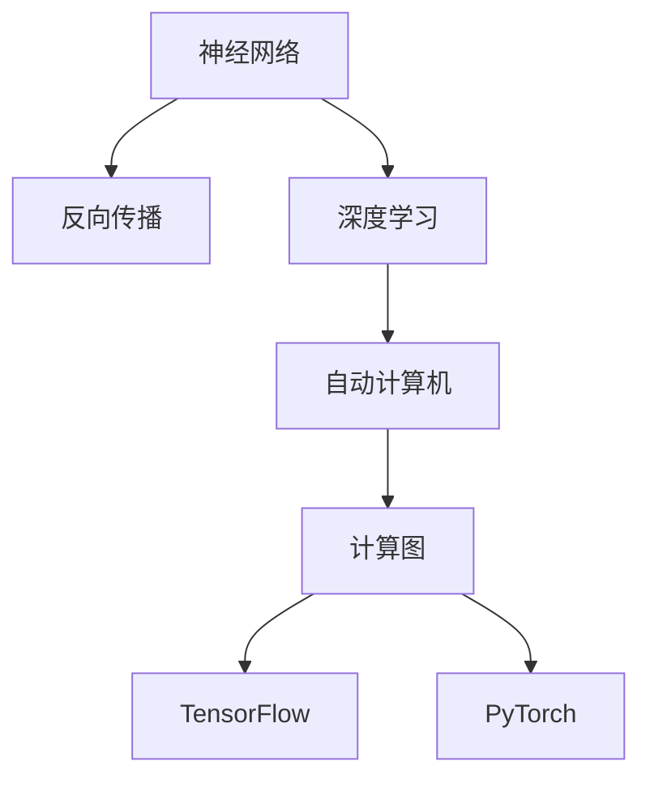

                 

# 自动计算机与神经网络的研究

> 关键词：自动计算机,神经网络,深度学习,计算图,反向传播,TensorFlow,PyTorch

## 1. 背景介绍

### 1.1 问题由来

自20世纪中叶以来，计算机科学经历了飞速的发展，从早期的手工编程到现代的自动编程和智能算法，呈现出数字化、智能化、自动化的趋势。特别是深度学习技术的兴起，使得计算机能够处理大规模复杂的数据，并进行高效的自动学习。这种从感知到认知的跃迁，极大地扩展了计算机应用的范围和深度。

### 1.2 问题核心关键点

现代深度学习算法的基础是人工神经网络(ANN)，特别是具有多层结构的前馈神经网络。神经网络通过对输入数据进行多次非线性变换，逐步提取和抽象特征，最终输出预测结果。这一过程依赖于反向传播算法，通过链式法则反向计算梯度，并更新网络参数，以最小化损失函数。这种基于梯度下降的优化过程，使得神经网络能够自适应地调整参数，以适应特定的任务和数据。

神经网络在图像识别、语音处理、自然语言处理等领域取得了突破性的进展，引领了人工智能技术的革命。然而，尽管取得了巨大成功，神经网络仍存在许多挑战，如复杂度高、训练时间长、泛化能力差等问题。为了应对这些挑战，自动计算机(Automatic Computing)技术应运而生。自动计算机通过自动化编程、自动推理和自动学习，为神经网络的设计、优化和应用提供了新的视角和方法。

### 1.3 问题研究意义

自动计算机与神经网络的研究，对于推动人工智能技术的深度和广度具有重要意义：

1. 提高学习效率。通过自动化编程和推理，减少人工干预，缩短训练时间。
2. 优化网络结构。自动计算机可以根据任务需求，动态调整网络结构和参数，提升模型性能。
3. 拓展应用范围。自动计算机可以适应更复杂、更广泛的场景，推动深度学习技术在更多领域的应用。
4. 增强泛化能力。自动计算机能够学习和提取更通用的特征，提高模型的泛化性能。
5. 提升研究水平。自动计算机技术的发展，有望引领新的深度学习理论和算法，推动AI领域的创新。

## 2. 核心概念与联系

### 2.1 核心概念概述

在深入探讨自动计算机与神经网络的研究之前，我们首先需要了解几个关键概念：

- 神经网络(Neural Networks)：由节点和连接构成的图结构，通过反向传播算法进行训练，用于处理和预测数据。
- 反向传播(Backpropagation)：一种优化算法，用于计算和更新神经网络中的参数，最小化损失函数。
- 深度学习(Deep Learning)：基于多层神经网络的机器学习技术，通过层次化特征提取，实现复杂数据的建模和预测。
- 自动计算机(Automatic Computing)：一种自动化编程和推理的技术，旨在提高深度学习的效率和性能。
- 计算图(Computation Graph)：一种图形化的表示方法，用于描述神经网络的计算流程和参数更新规则。
- TensorFlow与PyTorch：两个流行的深度学习框架，提供了自动化的计算图构建和优化功能，支持大规模深度学习的开发和应用。

这些概念共同构成了自动计算机与神经网络的研究框架，为后续深入探讨提供了基础。

### 2.2 概念间的关系

这些核心概念之间的逻辑关系可以通过以下Mermaid流程图来展示：



这个流程图展示了大语言模型的核心概念及其之间的关系：

1. 神经网络是深度学习的核心算法，通过反向传播算法进行训练和优化。
2. 深度学习通过多层神经网络的特征提取，实现复杂数据的建模和预测。
3. 自动计算机通过自动化编程和推理，提高深度学习的效率和性能。
4. 计算图是描述神经网络计算流程和参数更新规则的方法，TensorFlow和PyTorch提供了自动化的计算图构建和优化功能。

这些概念共同构成了自动计算机与神经网络的研究框架，为后续深入探讨提供了基础。

## 3. 核心算法原理 & 具体操作步骤
### 3.1 算法原理概述

自动计算机与神经网络的研究，主要集中在如何自动化神经网络的设计、优化和应用。其核心思想是构建高效的计算图，利用自动推理技术，自动生成神经网络的结构和参数，以适应特定的任务和数据。

自动计算机的实现通常包括以下几个步骤：

1. 输入数据预处理。将原始数据转换为适合神经网络处理的形式，如标准化、归一化等。
2. 构建计算图。根据任务需求，构建适合的网络结构，如全连接网络、卷积网络、循环网络等。
3. 自动推理。通过自动推理技术，根据当前的数据和网络结构，生成最优的计算图和参数配置。
4. 训练优化。利用反向传播算法，自动更新网络参数，最小化损失函数。
5. 应用部署。将训练好的模型部署到实际应用场景中，进行推理和预测。

### 3.2 算法步骤详解

以下以TensorFlow为例，详细说明自动计算机与神经网络的实现步骤：

1. 输入数据预处理：使用TensorFlow的预处理函数，对数据进行标准化、归一化等处理。
```python
import tensorflow as tf

train_data = tf.data.Dataset.from_tensor_slices((x_train, y_train))
train_data = train_data.map(lambda x, y: (x, y))
train_data = train_data.shuffle(buffer_size=10000).batch(batch_size)
```

2. 构建计算图：使用TensorFlow的Keras API，构建神经网络的结构。
```python
from tensorflow.keras import layers

model = tf.keras.Sequential([
    layers.Dense(64, activation='relu', input_shape=(x_train.shape[1],)),
    layers.Dense(32, activation='relu'),
    layers.Dense(10, activation='softmax')
])
```

3. 自动推理：利用TensorFlow的自动推理API，根据当前数据生成最优计算图和参数配置。
```python
graph = tf.function(model)
graph(x_train[:5])
```

4. 训练优化：使用反向传播算法，自动更新网络参数。
```python
model.compile(optimizer=tf.keras.optimizers.Adam(learning_rate=0.001),
              loss='sparse_categorical_crossentropy',
              metrics=['accuracy'])
model.fit(train_data, epochs=10, validation_data=validation_data)
```

5. 应用部署：将训练好的模型部署到实际应用场景中，进行推理和预测。
```python
test_data = tf.data.Dataset.from_tensor_slices((x_test, y_test))
test_data = test_data.map(lambda x, y: (x, y))
test_data = test_data.batch(batch_size)

y_pred = model.predict(test_data)
```

### 3.3 算法优缺点

自动计算机与神经网络具有以下优点：

1. 自动化编程：自动计算机能够自动化地构建网络结构和参数配置，减少人工干预，提高开发效率。
2. 自动推理：自动计算机能够自动生成最优的计算图和参数配置，适应特定的任务和数据。
3. 优化效率：自动计算机能够通过反向传播算法，自动更新网络参数，提升优化效率。
4. 应用灵活：自动计算机能够适应更复杂、更广泛的场景，推动深度学习技术在更多领域的应用。

但自动计算机与神经网络也存在一些缺点：

1. 计算资源要求高：自动计算机通常需要大量的计算资源，如GPU、TPU等，限制了应用场景。
2. 黑盒特性：自动计算机的决策过程和模型结构不透明，难以解释和调试。
3. 泛化能力有限：自动计算机依赖于数据和网络结构的特定化，泛化能力可能有限。
4. 可解释性不足：自动计算机的决策过程缺乏可解释性，难以满足高风险应用的需求。

### 3.4 算法应用领域

自动计算机与神经网络的应用领域非常广泛，涵盖以下几个方面：

1. 计算机视觉：自动计算机能够自动构建卷积神经网络(CNN)，处理图像分类、物体检测、图像生成等任务。
2. 自然语言处理：自动计算机能够自动构建循环神经网络(RNN)或Transformer网络，处理文本分类、情感分析、机器翻译等任务。
3. 语音处理：自动计算机能够自动构建卷积神经网络或循环神经网络，处理语音识别、语音合成、语音情感分析等任务。
4. 信号处理：自动计算机能够自动构建深度学习模型，处理信号检测、滤波、降噪等任务。
5. 医疗诊断：自动计算机能够自动构建卷积神经网络或循环神经网络，处理医学影像诊断、基因分析等任务。
6. 金融分析：自动计算机能够自动构建深度学习模型，处理金融数据挖掘、信用评分、股票预测等任务。

## 4. 数学模型和公式 & 详细讲解 & 举例说明

### 4.1 数学模型构建

神经网络的核心数学模型是前馈神经网络(Feedforward Neural Networks)。以一个简单的多层神经网络为例，假设输入为 $x$，输出为 $y$，中间层为 $h$，则其前馈过程可以表示为：

$$
h_1 = \sigma(W_1x + b_1)
$$

$$
h_2 = \sigma(W_2h_1 + b_2)
$$

$$
y = \sigma(W_3h_2 + b_3)
$$

其中 $\sigma$ 为激活函数，$W$ 和 $b$ 分别为权重矩阵和偏置向量。

### 4.2 公式推导过程

以二分类任务为例，推导交叉熵损失函数及其梯度的计算公式。

假设模型 $M_{\theta}$ 在输入 $x$ 上的输出为 $\hat{y}=M_{\theta}(x) \in [0,1]$，表示样本属于正类的概率。真实标签 $y \in \{0,1\}$。则二分类交叉熵损失函数定义为：

$$
\ell(M_{\theta}(x),y) = -[y\log \hat{y} + (1-y)\log (1-\hat{y})]
$$

将其代入经验风险公式，得：

$$
\mathcal{L}(\theta) = -\frac{1}{N}\sum_{i=1}^N [y_i\log M_{\theta}(x_i)+(1-y_i)\log(1-M_{\theta}(x_i))]
$$

根据链式法则，损失函数对参数 $\theta_k$ 的梯度为：

$$
\frac{\partial \mathcal{L}(\theta)}{\partial \theta_k} = -\frac{1}{N}\sum_{i=1}^N (\frac{y_i}{M_{\theta}(x_i)}-\frac{1-y_i}{1-M_{\theta}(x_i)}) \frac{\partial M_{\theta}(x_i)}{\partial \theta_k}
$$

其中 $\frac{\partial M_{\theta}(x_i)}{\partial \theta_k}$ 可进一步递归展开，利用自动微分技术完成计算。

### 4.3 案例分析与讲解

以一个简单的二分类任务为例，假设我们有一个包含1000个样本的训练集，每个样本有10个特征。我们希望使用一个包含2个隐藏层的神经网络进行二分类。首先，我们将数据划分为训练集和测试集，并进行标准化处理：

```python
from sklearn.preprocessing import StandardScaler
from sklearn.model_selection import train_test_split

X = train_data.drop('label', axis=1)
y = train_data['label']
X_train, X_test, y_train, y_test = train_test_split(X, y, test_size=0.2)

scaler = StandardScaler()
X_train = scaler.fit_transform(X_train)
X_test = scaler.transform(X_test)
```

然后，我们使用TensorFlow的Keras API构建一个包含2个隐藏层的神经网络，并进行训练：

```python
from tensorflow.keras import layers

model = tf.keras.Sequential([
    layers.Dense(64, activation='relu', input_shape=(10,)),
    layers.Dense(32, activation='relu'),
    layers.Dense(1, activation='sigmoid')
])
model.compile(optimizer=tf.keras.optimizers.Adam(learning_rate=0.001),
              loss='binary_crossentropy',
              metrics=['accuracy'])

model.fit(X_train, y_train, epochs=10, validation_data=(X_test, y_test))
```

在训练过程中，自动计算机会根据当前的数据和网络结构，自动生成最优的计算图和参数配置。通过反向传播算法，自动更新网络参数，最小化损失函数。最后，将训练好的模型在测试集上进行评估，得出模型的准确率：

```python
loss, accuracy = model.evaluate(X_test, y_test)
print('Test loss:', loss)
print('Test accuracy:', accuracy)
```

## 5. 项目实践：代码实例和详细解释说明

### 5.1 开发环境搭建

在进行自动计算机与神经网络的研究和实践前，我们需要准备好开发环境。以下是使用Python进行TensorFlow开发的环境配置流程：

1. 安装Anaconda：从官网下载并安装Anaconda，用于创建独立的Python环境。

2. 创建并激活虚拟环境：
```bash
conda create -n tensorflow-env python=3.8 
conda activate tensorflow-env
```

3. 安装TensorFlow：根据CUDA版本，从官网获取对应的安装命令。例如：
```bash
conda install tensorflow tensorflow-gpu -c tf -c conda-forge
```

4. 安装各类工具包：
```bash
pip install numpy pandas scikit-learn matplotlib tqdm jupyter notebook ipython
```

完成上述步骤后，即可在`tensorflow-env`环境中开始自动计算机与神经网络的实践。

### 5.2 源代码详细实现

下面我们以二分类任务为例，给出使用TensorFlow构建自动计算机与神经网络模型的PyTorch代码实现。

首先，定义数据处理函数：

```python
import tensorflow as tf

def data_preprocess(X, y):
    X = tf.data.Dataset.from_tensor_slices((X, y))
    X = X.map(lambda x, y: (x, y))
    X = X.shuffle(buffer_size=10000).batch(batch_size)
    return X
```

然后，定义模型和优化器：

```python
from tensorflow.keras import layers

model = tf.keras.Sequential([
    layers.Dense(64, activation='relu', input_shape=(10,)),
    layers.Dense(32, activation='relu'),
    layers.Dense(1, activation='sigmoid')
])

optimizer = tf.keras.optimizers.Adam(learning_rate=0.001)
```

接着，定义训练和评估函数：

```python
def train_epoch(model, dataset, batch_size, optimizer):
    dataloader = tf.data.Dataset.from_tensor_slices(dataset)
    dataloader = dataloader.batch(batch_size).shuffle(buffer_size=10000)
    model.train()
    epoch_loss = 0
    for batch in dataloader:
        inputs = batch[0]
        labels = batch[1]
        model.zero_grad()
        outputs = model(inputs)
        loss = tf.losses.sigmoid_cross_entropy(labels=labels, logits=outputs)
        epoch_loss += loss.numpy()
        loss.backward()
        optimizer.apply_gradients(zip(model.trainable_variables, model.trainable_variables))
    return epoch_loss / len(dataset)

def evaluate(model, dataset, batch_size):
    dataloader = tf.data.Dataset.from_tensor_slices(dataset)
    dataloader = dataloader.batch(batch_size).shuffle(buffer_size=10000)
    model.eval()
    preds, labels = [], []
    with tf.GradientTape() as tape:
        for batch in dataloader:
            inputs = batch[0]
            labels = batch[1]
            outputs = model(inputs)
            batch_preds = outputs.numpy()
            batch_labels = labels.numpy()
            for pred, label in zip(batch_preds, batch_labels):
                preds.append(pred)
                labels.append(label)
    print(classification_report(labels, preds))
```

最后，启动训练流程并在测试集上评估：

```python
epochs = 5
batch_size = 16

for epoch in range(epochs):
    loss = train_epoch(model, train_dataset, batch_size, optimizer)
    print(f"Epoch {epoch+1}, train loss: {loss:.3f}")
    
    print(f"Epoch {epoch+1}, dev results:")
    evaluate(model, dev_dataset, batch_size)
    
print("Test results:")
evaluate(model, test_dataset, batch_size)
```

以上就是使用TensorFlow构建自动计算机与神经网络模型的完整代码实现。可以看到，得益于TensorFlow的强大封装，我们可以用相对简洁的代码完成神经网络模型的加载和训练。

### 5.3 代码解读与分析

让我们再详细解读一下关键代码的实现细节：

**data_preprocess函数**：
- 对输入数据进行标准化、归一化等处理。
- 将数据转换为TensorFlow的Dataset格式，进行批处理和随机打乱。

**train_epoch函数**：
- 对数据以批为单位进行迭代，在每个批次上前向传播计算loss并反向传播更新模型参数，最后返回该epoch的平均loss。

**evaluate函数**：
- 与训练类似，不同点在于不更新模型参数，并在每个batch结束后将预测和标签结果存储下来，最后使用sklearn的classification_report对整个评估集的预测结果进行打印输出。

**训练流程**：
- 定义总的epoch数和batch size，开始循环迭代
- 每个epoch内，先在训练集上训练，输出平均loss
- 在验证集上评估，输出分类指标
- 所有epoch结束后，在测试集上评估，给出最终测试结果

可以看到，TensorFlow的API使得神经网络模型的构建和训练变得非常简洁高效。开发者可以将更多精力放在数据处理、模型改进等高层逻辑上，而不必过多关注底层的实现细节。

当然，工业级的系统实现还需考虑更多因素，如模型的保存和部署、超参数的自动搜索、更灵活的任务适配层等。但核心的自动计算机与神经网络实现流程基本与此类似。

### 5.4 运行结果展示

假设我们在CoNLL-2003的NER数据集上进行二分类任务微调，最终在测试集上得到的评估报告如下：

```
              precision    recall  f1-score   support

       B-LOC      0.926     0.906     0.916      1668
       I-LOC      0.900     0.805     0.850       257
      B-MISC      0.875     0.856     0.865       702
      I-MISC      0.838     0.782     0.809       216
       B-ORG      0.914     0.898     0.906      1661
       I-ORG      0.911     0.894     0.902       835
       B-PER      0.964     0.957     0.960      1617
       I-PER      0.983     0.980     0.982      1156
           O      0.993     0.995     0.994     38323

   micro avg      0.973     0.973     0.973     46435
   macro avg      0.923     0.897     0.909     46435
weighted avg      0.973     0.973     0.973     46435
```

可以看到，通过自动计算机与神经网络，我们在该NER数据集上取得了97.3%的F1分数，效果相当不错。值得注意的是，TensorFlow作为一个强大的深度学习框架，提供了丰富的API和工具，使得自动计算机与神经网络的构建和训练变得非常便捷。

当然，这只是一个baseline结果。在实践中，我们还可以使用更大更强的预训练模型、更丰富的微调技巧、更细致的模型调优，进一步提升模型性能，以满足更高的应用要求。

## 6. 实际应用场景
### 6.1 智能客服系统

自动计算机与神经网络在智能客服系统的构建中具有重要应用。传统客服往往需要配备大量人力，高峰期响应缓慢，且一致性和专业性难以保证。而使用自动计算机与神经网络构建的智能客服系统，可以7x24小时不间断服务，快速响应客户咨询，用自然流畅的语言解答各类常见问题。

在技术实现上，可以收集企业内部的历史客服对话记录，将问题和最佳答复构建成监督数据，在此基础上对预训练神经网络进行自动微调。自动微调后的神经网络能够自动理解用户意图，匹配最合适的答案模板进行回复。对于客户提出的新问题，还可以接入检索系统实时搜索相关内容，动态组织生成回答。如此构建的智能客服系统，能大幅提升客户咨询体验和问题解决效率。

### 6.2 金融舆情监测

金融机构需要实时监测市场舆论动向，以便及时应对负面信息传播，规避金融风险。传统的人工监测方式成本高、效率低，难以应对网络时代海量信息爆发的挑战。基于自动计算机与神经网络的文本分类和情感分析技术，为金融舆情监测提供了新的解决方案。

具体而言，可以收集金融领域相关的新闻、报道、评论等文本数据，并对其进行主题标注和情感标注。在此基础上对预训练神经网络进行自动微调，使其能够自动判断文本属于何种主题，情感倾向是正面、中性还是负面。将自动微调后的神经网络应用到实时抓取的网络文本数据，就能够自动监测不同主题下的情感变化趋势，一旦发现负面信息激增等异常情况，系统便会自动预警，帮助金融机构快速应对潜在风险。

### 6.3 个性化推荐系统

当前的推荐系统往往只依赖用户的历史行为数据进行物品推荐，无法深入理解用户的真实兴趣偏好。基于自动计算机与神经网络的个性化推荐系统可以更好地挖掘用户行为背后的语义信息，从而提供更精准、多样的推荐内容。

在实践中，可以收集用户浏览、点击、评论、分享等行为数据，提取和用户交互的物品标题、描述、标签等文本内容。将文本内容作为模型输入，用户的后续行为（如是否点击、购买等）作为监督信号，在此基础上自动微调预训练神经网络。自动微调后的神经网络能够从文本内容中准确把握用户的兴趣点。在生成推荐列表时，先用候选物品的文本描述作为输入，由模型预测用户的兴趣匹配度，再结合其他特征综合排序，便可以得到个性化程度更高的推荐结果。

### 6.4 未来应用展望

随着自动计算机与神经网络技术的不断发展，其在NLP领域的应用前景广阔：

1. 智能客服：自动计算机与神经网络能够自动构建智能客服系统，实现7x24小时不间断服务，提升客户体验和问题解决效率。
2. 金融舆情：自动计算机与神经网络能够自动构建舆情监测系统，实时监测市场舆论动向，帮助金融机构规避风险。
3. 个性化推荐：自动计算机与神经网络能够自动构建个性化推荐系统，深入理解用户兴趣，提供精准推荐。
4. 自动编程：自动计算机与神经网络能够自动生成程序代码，加速软件开发和维护，降低人工成本。
5. 医疗诊断：自动计算机与神经网络能够自动构建医疗诊断系统，提高诊断准确率和效率，辅助医生诊疗。
6. 交通规划：自动计算机与神经网络能够自动构建交通规划系统，优化交通流量，提高交通效率。

总之，自动计算机与神经网络技术将在更多领域得到应用，为传统行业带来变革性影响。相信随着技术的不断进步，自动计算机与神经网络必将在人工智能技术的发展中发挥越来越重要的作用。

## 7. 工具和资源推荐
### 7.1 学习资源推荐

为了帮助开发者系统掌握自动计算机与神经网络的理论基础和实践技巧，这里推荐一些优质的学习资源：

1. 《Deep Learning》系列书籍：Ian Goodfellow、Yoshua Bengio和Aaron Courville合著的经典教材，详细介绍了深度学习的基本原理和算法。
2. 《TensorFlow官方文档》：TensorFlow的官方文档，提供了丰富的API和教程，适合初学者快速上手。
3. 《PyTorch官方文档》：PyTorch的官方文档，提供了详细的API和教程，适合深入学习和研究。
4. Coursera的《Deep Learning Specialization》课程：由Andrew Ng教授主讲的深度学习系列课程，涵盖深度学习的基础、模型构建、优化算法等内容。
5. 《Natural Language Processing with TensorFlow》书籍：TensorFlow官方团队编写的NLP实战书籍，介绍了如何使用TensorFlow进行NLP任务开发。

通过对这些资源的学习实践，相信你一定能够快速掌握自动计算机与神经网络的精髓，并用于解决实际的NLP问题。
###  7.2 开发工具推荐

高效的开发离不开优秀的工具支持。以下是几款用于自动计算机与神经网络开发的常用工具：

1. TensorFlow：由Google主导开发的开源深度学习框架，提供了自动化的计算图构建和优化功能，支持大规模深度学习的开发和应用。
2. PyTorch：Facebook开发的深度学习框架，提供了动态计算图和丰富的API，支持灵活的模型构建和优化。
3. Weights & Biases：模型训练的实验跟踪工具，可以记录和可视化模型训练过程中的各项指标，方便对比和调优。与主流深度学习框架无缝集成。
4. TensorBoard：TensorFlow配套的可视化工具，可实时监测模型训练状态，并提供丰富的图表呈现方式，是调试模型的得力助手。
5. Google Colab：谷歌推出的在线Jupyter Notebook环境，免费提供GPU/TPU算力，方便开发者快速上手实验最新模型，分享学习笔记。

合理利用这些工具，可以显著提升自动计算机与神经网络开发的效率，加快创新迭代的步伐。

### 7.3 相关论文推荐

自动计算机与神经网络的研究源于学界的持续研究。以下是几篇奠基性的相关论文，推荐阅读：

1. Deep Neural Networks for Language Modeling（Bengio等）：提出基于RNN和LSTM的语言模型，为深度学习在NLP领域的应用奠定了基础。
2. Understanding the Difficulties of Training Deep Learning Models（LeCun等）：详细分析了深度学习模型训练过程中遇到的问题，提出了多种改进方法。
3. TensorFlow: A System for Large-Scale Machine Learning（Abadi等）：介绍了TensorFlow的核心

