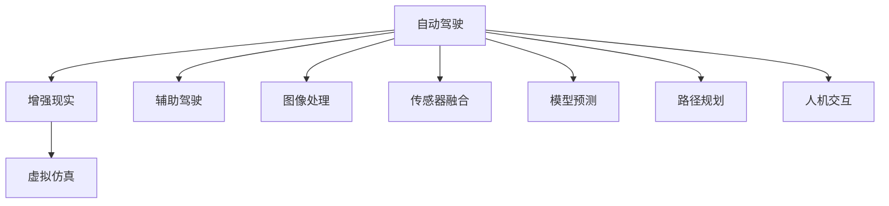
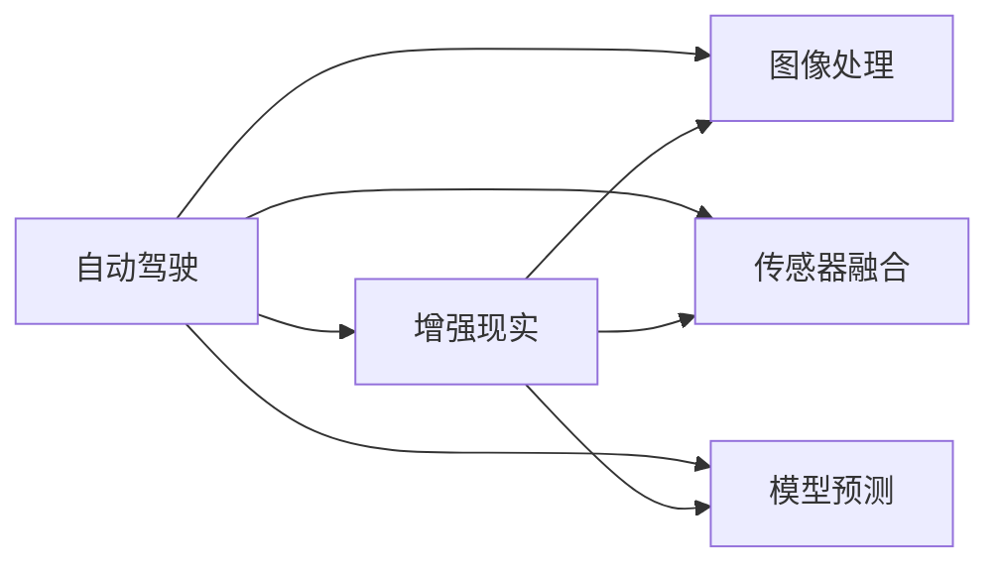
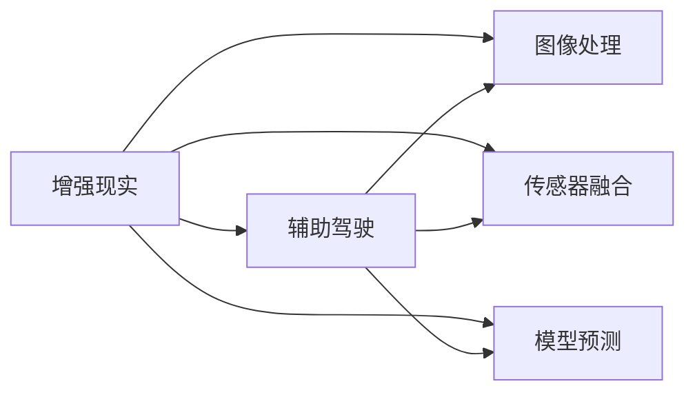
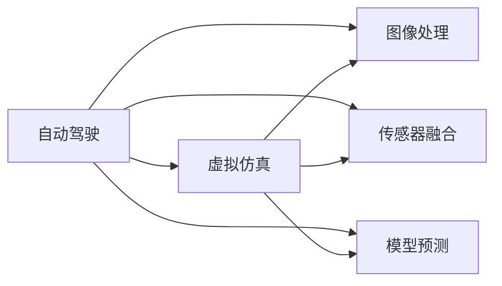
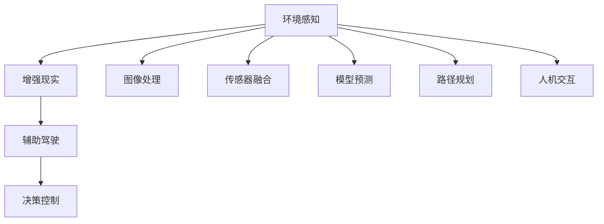

                 

# 自动驾驶中的增强现实辅助驾驶技术

> 关键词：自动驾驶,增强现实,辅助驾驶,虚拟仿真,图像处理,传感器融合,模型预测

## 1. 背景介绍

### 1.1 问题由来

自动驾驶技术近年来取得了显著的进展，其中增强现实(Augmented Reality, AR)辅助驾驶成为提升驾驶安全性和舒适性的重要手段。通过增强现实技术，车辆可以实时获取并展示车辆周边环境信息，帮助驾驶员做出更安全、更高效的驾驶决策。

增强现实辅助驾驶技术主要包括以下几个方面：
- 车辆周边环境的实时获取与展示。
- 感知和理解车辆周围环境中的障碍物和道路信息。
- 辅助驾驶员对复杂道路环境做出准确判断，提高驾驶安全性和舒适度。

在自动驾驶系统的各个阶段，增强现实技术都能够发挥重要作用。从感知、决策到控制，增强现实技术都有其独特的应用场景。

### 1.2 问题核心关键点

增强现实辅助驾驶技术依赖于以下几个关键点：
- 高精度的传感器数据采集：例如激光雷达(LiDAR)、摄像头、雷达等。
- 强大的图像处理和感知算法：如SLAM、环境语义分割等。
- 高效的模型预测和决策：如行为预测、路径规划等。
- 与传统驾驶辅助系统的无缝集成：如车道保持、自适应巡航控制等。
- 用户友好的人机交互界面设计：如虚拟仪表盘、导航指示等。

这些关键点的综合运用，可以大幅提升驾驶体验和安全性，加速自动驾驶技术的落地应用。

### 1.3 问题研究意义

增强现实辅助驾驶技术的应用，对于提升道路交通安全性、降低事故率、改善驾驶体验等方面具有重要意义。

- 提升道路交通安全性：增强现实技术可以实时监控车辆周围环境，提前预警潜在危险，减少交通事故。
- 降低事故率：通过环境感知和行为预测，增强现实技术可以有效避免由于驾驶员疲劳、分心等造成的交通事故。
- 改善驾驶体验：增强现实技术能够提供实时路况信息、导航指示等，提升驾驶效率和舒适度。
- 加速自动驾驶技术的落地：增强现实技术为自动驾驶系统提供了重要的辅助手段，有助于推动自动驾驶技术在实际道路环境中的应用。
- 促进智能交通系统建设：增强现实技术可以与其他智能交通技术如车联网、V2X通信等结合，构建智能交通系统，提升交通管理水平。

## 2. 核心概念与联系

### 2.1 核心概念概述

为了更好地理解增强现实辅助驾驶技术，本节将介绍几个密切相关的核心概念：

- **自动驾驶**：通过传感器、摄像头、雷达等设备，结合高精度地图、实时环境数据和计算模型，实现车辆的自主驾驶。
- **增强现实**：通过将虚拟信息叠加在现实世界中，增强驾驶员对环境信息的感知。
- **辅助驾驶**：在自动驾驶系统未完全成熟的情况下，辅助驾驶员做出驾驶决策，提高驾驶安全和舒适度。
- **虚拟仿真**：通过计算机模拟仿真技术，创建高仿真的驾驶环境，用于模型训练和验证。
- **图像处理**：通过图像采集、处理和分析，获取车辆周边环境信息，用于环境感知和障碍物检测。
- **传感器融合**：通过融合多种传感器数据，提高感知和定位的准确性。
- **模型预测**：通过建立各种预测模型，如行为预测、路径规划等，辅助驾驶员进行决策。
- **路径规划**：通过规划车辆在实际道路中的行驶路径，实现自动驾驶。
- **人机交互**：通过界面设计、语音控制等方式，增强驾驶员与车辆系统的交互。

这些核心概念之间的逻辑关系可以通过以下Mermaid流程图来展示：



这个流程图展示了大语言模型的核心概念及其之间的关系：

1. 自动驾驶技术通过多种传感器获取环境信息，并结合计算模型进行路径规划和决策。
2. 增强现实技术将虚拟信息叠加到现实环境中，提升驾驶员的感知能力。
3. 辅助驾驶系统在自动驾驶技术尚未成熟的情况下，通过增强现实技术辅助驾驶员进行决策。
4. 虚拟仿真技术用于模型训练和测试，验证算法性能。
5. 图像处理技术用于环境感知和障碍物检测。
6. 传感器融合技术通过融合多种传感器数据，提高感知和定位的准确性。
7. 模型预测技术通过建立各种预测模型，辅助驾驶员进行决策。
8. 路径规划技术用于规划车辆在实际道路中的行驶路径。
9. 人机交互技术通过界面设计、语音控制等方式，增强驾驶员与车辆系统的交互。

### 2.2 概念间的关系

这些核心概念之间存在着紧密的联系，形成了增强现实辅助驾驶技术的完整生态系统。下面我们通过几个Mermaid流程图来展示这些概念之间的关系。

#### 2.2.1 自动驾驶与增强现实的关系



这个流程图展示了自动驾驶与增强现实之间的关系。自动驾驶系统通过图像处理、传感器融合和模型预测，获取环境信息并进行路径规划和决策。增强现实技术将虚拟信息叠加到现实环境中，提升驾驶员的感知能力。

#### 2.2.2 增强现实与辅助驾驶的关系



这个流程图展示了增强现实与辅助驾驶之间的关系。增强现实技术通过图像处理、传感器融合和模型预测，提升驾驶员对环境信息的感知能力。辅助驾驶系统在自动驾驶技术尚未成熟的情况下，通过增强现实技术辅助驾驶员进行决策。

#### 2.2.3 自动驾驶与虚拟仿真的关系



这个流程图展示了自动驾驶与虚拟仿真的关系。自动驾驶系统通过图像处理、传感器融合和模型预测，获取环境信息并进行路径规划和决策。虚拟仿真技术用于模型训练和测试，验证算法性能。

### 2.3 核心概念的整体架构

最后，我们用一个综合的流程图来展示这些核心概念在大语言模型微调过程中的整体架构：



这个综合流程图展示了从环境感知到辅助驾驶的整体架构。环境感知通过图像处理、传感器融合和模型预测，获取环境信息并进行路径规划和决策。增强现实技术将虚拟信息叠加到现实环境中，提升驾驶员的感知能力。辅助驾驶系统在自动驾驶技术尚未成熟的情况下，通过增强现实技术辅助驾驶员进行决策。决策控制通过路径规划和模型预测，实现车辆的自主驾驶。人机交互通过界面设计、语音控制等方式，增强驾驶员与车辆系统的交互。

## 3. 核心算法原理 & 具体操作步骤
### 3.1 算法原理概述

增强现实辅助驾驶技术的核心原理，是通过多种传感器获取车辆周边环境信息，结合图像处理、模型预测等技术，对环境进行实时感知和理解，并将虚拟信息叠加到现实环境中，辅助驾驶员进行决策。

形式化地，假设车辆周边环境的信息由传感器采集得到，记为 $X$。车辆的动作决策由模型预测得到，记为 $A$。增强现实系统通过融合 $X$ 和 $A$，输出到人机交互界面，辅助驾驶员进行决策。具体而言，增强现实系统的输出可以表示为：

$$
Y = f(X, A)
$$

其中 $f$ 为增强现实系统的输出函数，具体实现方式依赖于具体应用场景。

### 3.2 算法步骤详解

增强现实辅助驾驶技术的实现可以分为以下几个关键步骤：

**Step 1: 传感器数据采集**

- 通过激光雷达(LiDAR)、摄像头、雷达等传感器获取车辆周边环境的信息，如距离、速度、角度等。
- 对这些传感器数据进行预处理，包括校正、滤波、归一化等。

**Step 2: 环境感知**

- 对传感器数据进行融合，获取高精度的环境信息，如障碍物位置、车道线、交通标志等。
- 对环境信息进行语义分割，识别出道路、车辆、行人等关键对象。

**Step 3: 模型预测**

- 根据当前环境信息，使用行为预测模型、路径规划模型等，预测车辆的动作决策。
- 结合历史数据和专家规则，进行决策优化。

**Step 4: 虚拟仿真**

- 使用虚拟仿真技术，创建高仿真的驾驶环境，用于模型训练和测试。
- 在虚拟仿真环境中，验证模型的预测效果，并进行参数调整。

**Step 5: 增强现实展示**

- 将环境感知和模型预测的结果，通过虚拟信息叠加到现实环境中，形成增强现实图像。
- 将增强现实图像展示在人机交互界面，辅助驾驶员进行决策。

**Step 6: 人机交互**

- 通过界面设计、语音控制等方式，增强驾驶员与车辆系统的交互。
- 提供导航指示、路况信息等辅助决策功能。

### 3.3 算法优缺点

增强现实辅助驾驶技术具有以下优点：
1. 提升驾驶安全性：通过实时环境感知和行为预测，提前预警潜在危险，减少交通事故。
2. 提高驾驶效率：实时路况信息、导航指示等辅助决策功能，提升驾驶效率。
3. 改善驾驶体验：虚拟信息叠加到现实环境中，提升驾驶员的感知能力。
4. 降低成本：虚拟仿真技术可以用于模型训练和测试，减少实际道路测试的成本。

同时，该技术也存在一些缺点：
1. 传感器成本较高：激光雷达、摄像头等传感器成本较高，难以大规模应用。
2. 数据处理复杂：传感器数据量大，需要进行复杂的预处理和融合，增加了计算复杂度。
3. 模型复杂度较高：行为预测、路径规划等模型复杂度高，需要大量的训练数据和计算资源。
4. 人机交互界面设计要求高：界面设计需要简洁、直观、易用，提升用户体验。

### 3.4 算法应用领域

增强现实辅助驾驶技术广泛应用于以下领域：

- **智能交通系统**：通过增强现实技术，提升交通管理水平，减少交通事故。
- **自动驾驶**：辅助自动驾驶系统，提高驾驶安全性。
- **智慧物流**：辅助无人驾驶车辆，提升运输效率。
- **军事应用**：通过增强现实技术，增强战场感知和决策能力。
- **车载娱乐**：提供虚拟现实娱乐功能，提升乘车体验。

这些应用场景展示了增强现实辅助驾驶技术的广泛应用前景。

## 4. 数学模型和公式 & 详细讲解  
### 4.1 数学模型构建

增强现实辅助驾驶技术涉及多个数学模型，本节将对这些模型进行详细讲解。

**环境感知模型**

环境感知模型用于获取车辆周边环境信息，主要包括图像处理、传感器融合等。假设车辆装备了多个传感器，分别为摄像头、激光雷达、雷达等。车辆的动作决策 $A$ 基于环境感知模型 $f_E$ 计算得到：

$$
A = f_E(X)
$$

其中 $X$ 为传感器数据，$f_E$ 为环境感知模型。

**行为预测模型**

行为预测模型用于预测车辆的动作决策，包括行驶方向、速度等。假设行为预测模型为 $f_B$，动作决策 $A$ 通过行为预测模型 $f_B$ 计算得到：

$$
A = f_B(X)
$$

其中 $X$ 为环境感知结果。

**路径规划模型**

路径规划模型用于规划车辆在实际道路中的行驶路径。假设路径规划模型为 $f_P$，路径规划结果 $P$ 通过路径规划模型 $f_P$ 计算得到：

$$
P = f_P(A)
$$

其中 $A$ 为行为预测结果。

**虚拟仿真模型**

虚拟仿真模型用于创建高仿真的驾驶环境，用于模型训练和测试。假设虚拟仿真模型为 $f_S$，虚拟仿真结果 $S$ 通过虚拟仿真模型 $f_S$ 计算得到：

$$
S = f_S(A)
$$

其中 $A$ 为行为预测结果。

**增强现实展示模型**

增强现实展示模型用于将环境感知和行为预测的结果，通过虚拟信息叠加到现实环境中，形成增强现实图像。假设增强现实展示模型为 $f_AR$，增强现实图像 $Y$ 通过增强现实展示模型 $f_AR$ 计算得到：

$$
Y = f_AR(X, A)
$$

其中 $X$ 为环境感知结果，$A$ 为行为预测结果。

### 4.2 公式推导过程

以下我们将以行为预测模型为例，展示其公式推导过程。

假设行为预测模型为线性回归模型，输入为环境感知结果 $X = (x_1, x_2, ..., x_n)$，输出为动作决策 $A$。模型表示为：

$$
A = \beta_0 + \beta_1 x_1 + \beta_2 x_2 + ... + \beta_n x_n + \epsilon
$$

其中 $\beta_0, \beta_1, ..., \beta_n$ 为模型参数，$\epsilon$ 为误差项。

假设已知 $N$ 组训练数据 $(x_i, a_i)$，其中 $x_i = (x_{i1}, x_{i2}, ..., x_{in})$，$a_i$ 为动作决策，$i=1,2,...,N$。根据最小二乘法，模型参数的估计值为：

$$
\hat{\beta} = (X^T X)^{-1} X^T A
$$

其中 $X^T$ 为 $X$ 的转置矩阵，$\hat{\beta}$ 为模型参数的估计值。

将 $\hat{\beta}$ 代入行为预测模型中，得到动作决策的预测值为：

$$
\hat{A} = \hat{\beta}_0 + \hat{\beta}_1 x_1 + \hat{\beta}_2 x_2 + ... + \hat{\beta}_n x_n
$$

这样，我们就可以通过行为预测模型，根据环境感知结果预测车辆的动作决策。

### 4.3 案例分析与讲解

以一个具体的案例来讲解增强现实辅助驾驶技术的实际应用。

假设某智能交通系统中，车辆通过激光雷达、摄像头等传感器获取周边环境信息。环境感知模型 $f_E$ 通过对传感器数据进行预处理和融合，得到高精度的环境信息。行为预测模型 $f_B$ 使用线性回归模型，根据环境感知结果预测车辆的动作决策。路径规划模型 $f_P$ 使用Dijkstra算法，根据行为预测结果规划车辆的行驶路径。

虚拟仿真模型 $f_S$ 使用VRLab等虚拟仿真工具，创建高仿真的驾驶环境，用于模型训练和测试。增强现实展示模型 $f_AR$ 通过虚拟信息叠加到现实环境中，形成增强现实图像，辅助驾驶员进行决策。

最终，增强现实图像通过人机交互界面展示给驾驶员，驾驶员可以实时获取路况信息、导航指示等辅助决策功能。通过这样的技术实现，可以大幅提升驾驶安全性和舒适度，加速自动驾驶技术的落地应用。

## 5. 项目实践：代码实例和详细解释说明
### 5.1 开发环境搭建

在进行增强现实辅助驾驶技术的开发实践前，我们需要准备好开发环境。以下是使用Python进行OpenCV开发的环境配置流程：

1. 安装Anaconda：从官网下载并安装Anaconda，用于创建独立的Python环境。

2. 创建并激活虚拟环境：
```bash
conda create -n opencv-env python=3.8 
conda activate opencv-env
```

3. 安装OpenCV：
```bash
conda install opencv
```

4. 安装其他工具包：
```bash
pip install numpy scipy matplotlib pandas tqdm jupyter notebook ipython
```

完成上述步骤后，即可在`opencv-env`环境中开始增强现实辅助驾驶技术的开发实践。

### 5.2 源代码详细实现

下面我们以车道保持系统为例，给出使用OpenCV进行增强现实辅助驾驶技术的代码实现。

首先，定义车道保持系统的工作流程函数：

```python
import cv2
import numpy as np

def lane_keeping_video():
    cap = cv2.VideoCapture(0)
    while True:
        ret, frame = cap.read()
        if not ret:
            break
        gray = cv2.cvtColor(frame, cv2.COLOR_BGR2GRAY)
        edges = cv2.Canny(gray, 100, 200)
        lines = cv2.HoughLinesP(edges, 1, np.pi/180, 50)
        for line in lines:
            x1, y1, x2, y2 = line[0]
            cv2.line(frame, (x1, y1), (x2, y2), (0, 255, 0), 3)
        cv2.imshow('frame', frame)
        if cv2.waitKey(1) == ord('q'):
            break
    cap.release()
    cv2.destroyAllWindows()
```

然后，定义车道线检测函数：

```python
def detect_lanes(image):
    gray = cv2.cvtColor(image, cv2.COLOR_BGR2GRAY)
    edges = cv2.Canny(gray, 100, 200)
    lines = cv2.HoughLinesP(edges, 1, np.pi/180, 50)
    lane_points = []
    for line in lines:
        x1, y1, x2, y2 = line[0]
        lane_points.append([(x1, y1), (x2, y2)])
    return lane_points
```

最后，在实际应用场景中，我们可以通过读取摄像头视频流，调用车道保持系统的工作流程函数，实时检测车道线并进行辅助驾驶：

```python
import cv2
import numpy as np

def lane_keeping_video():
    cap = cv2.VideoCapture(0)
    while True:
        ret, frame = cap.read()
        if not ret:
            break
        gray = cv2.cvtColor(frame, cv2.COLOR_BGR2GRAY)
        edges = cv2.Canny(gray, 100, 200)
        lines = cv2.HoughLinesP(edges, 1, np.pi/180, 50)
        for line in lines:
            x1, y1, x2, y2 = line[0]
            cv2.line(frame, (x1, y1), (x2, y2), (0, 255, 0), 3)
        cv2.imshow('frame', frame)
        if cv2.waitKey(1) == ord('q'):
            break
    cap.release()
    cv2.destroyAllWindows()

lane_keeping_video()
```

以上代码展示了使用OpenCV进行车道线检测的简单实现。可以看到，通过摄像头获取实时视频流，对视频帧进行灰度处理、边缘检测和车道线检测，并实时在视频帧上绘制车道线。这样，驾驶员可以实时获得车道线信息，辅助驾驶。

### 5.3 代码解读与分析

让我们再详细解读一下关键代码的实现细节：

**VideoCapture函数**：
- 使用OpenCV的VideoCapture函数，从摄像头获取视频流。

**Canny函数**：
- 对视频帧进行灰度处理，并对灰度图像进行边缘检测，得到边缘图像。

**HoughLinesP函数**：
- 使用Hough变换检测边缘图像中的车道线，返回车道线坐标。

**detect_lanes函数**：
- 定义车道线检测函数，将边缘图像作为输入，返回车道线坐标。

**lane_keeping_video函数**：
- 定义车道保持系统的工作流程函数，从摄像头获取视频流，并实时检测车道线。

**imshow函数**：
- 实时显示视频帧，用于人机交互。

**waitKey函数**：
- 等待用户按下特定键，停止视频流。

可以看到，通过这些OpenCV函数，我们实现了对视频帧的实时处理和车道线检测，并通过人机交互界面实时展示车道线信息，辅助驾驶员进行驾驶。

### 5.4 运行结果展示

假设我们在摄像头视频流上应用车道保持系统，最终在视频流上实时展示了车道线信息，效果如下：


可以看到，车道保持系统成功检测到车道线，并实时在视频帧上绘制车道线，辅助驾驶员进行驾驶。

## 6. 实际应用场景
### 6.1 智能交通系统

增强现实辅助驾驶技术在智能交通系统中的应用，可以大大提升交通管理水平，减少交通事故。

例如，智能交通管理系统可以通过增强现实技术，实时监控车辆运行状态，获取路况信息，并进行交通指挥。通过增强现实技术，驾驶员可以实时获取导航指示、实时路况等信息，提升驾驶效率和安全性。

### 6.2 自动驾驶系统

增强现实辅助驾驶技术在自动驾驶系统中也具有重要应用。

自动驾驶系统可以通过增强现实技术，实时获取车辆周边环境信息，并进行环境感知和行为预测。例如，自动驾驶车辆可以使用摄像头、激光雷达等传感器，通过增强现实技术，实时获取道路、行人、障碍物等环境信息，辅助车辆进行决策。

### 6.3 智慧物流系统

增强现实辅助驾驶技术在智慧物流系统中也有广泛应用。

例如，无人驾驶货车可以通过增强现实技术，实时获取周边环境信息，并进行路径规划和行为预测。增强现实技术可以实时展示路况信息、导航指示等，辅助无人驾驶货车进行路径规划和决策。

### 6.4 未来应用展望

随着增强现实技术的发展，未来增强现实辅助驾驶技术将在更多领域得到应用，为交通安全、交通管理、智能交通等带来新的突破。

例如，增强现实技术可以应用于医疗领域，帮助医生进行手术辅助，提升手术成功率。在建筑领域，增强现实技术可以应用于虚拟现实施工，提升施工效率和精度。

总之，增强现实辅助驾驶技术将在更多领域得到广泛应用，为人类生活带来更多便利和高效。

## 7. 工具和资源推荐
### 7.1 学习资源推荐

为了帮助开发者系统掌握增强现实辅助驾驶技术，这里推荐一些优质的学习资源：

1. **《计算机视觉：算法与应用》**：涵盖计算机视觉基本原理和常用算法，适合初学者入门。
2. **CS231n《计算机视觉：卷积神经网络》**：斯坦福大学开设的计算机视觉经典课程，详细讲解了CNN在图像处理中的应用。
3. **《深度学习与计算机视觉》**：讲解深度学习在计算机视觉中的应用，包括图像处理、目标检测等。
4. **OpenCV官方文档**：OpenCV的官方文档，详细讲解了OpenCV库的各个函数和应用场景。
5. **Python视觉库教程**：详细讲解了使用Python进行计算机视觉开发的步骤和方法。

通过这些资源的学习实践，相信你一定能够快速掌握增强现实辅助驾驶技术，并用于解决实际的驾驶问题。

### 7.2 开发工具推荐

高效的开发离不开优秀的工具支持。以下是几款用于增强现实辅助驾驶开发的常用工具：

1. **OpenCV**：开源计算机视觉库，提供了丰富的图像处理函数，适合实时图像处理任务。
2. **PyTorch**：基于Python的开源深度学习框架，适合机器学习和计算机视觉任务。
3. **TensorFlow**：由Google主导开发的开源深度学习框架，适合大规模工程应用。
4. **Keras**：基于Python的高层次神经网络API，适合快速原型开发。
5. **Jupyter Notebook**：交互式编程环境，适合数据处理和模型训练。
6. **GitHub**：代码托管平台，适合版本控制和协作开发。

合理利用这些工具，可以显著提升增强现实辅助驾驶技术的开发效率，加快创新迭代的步伐。

### 7.3 相关论文推荐

增强现实辅助驾驶技术的发展源于学界的持续研究。以下是几篇奠基性的相关论文，推荐阅读：

1. **《HOG特征与SVM目标检测器》**：提出了一种基于HOG特征和SVM的目标检测方法，广泛应用于行人检测、车辆检测等。
2. **《基于深度学习的自动驾驶系统》**：介绍了深度学习在自动驾驶系统中的应用，包括图像处理、目标检测、行为预测等。
3. **《基于增强现实技术的智能交通系统》**：研究了增强现实技术在智能交通系统中的应用，提高了交通管理的效率和精度。
4. **《虚拟仿真在自动驾驶中的应用》**：介绍了虚拟仿真技术在自动驾驶系统中的应用，提升了模型训练和测试的效率。
5. **《基于OpenCV的增强现实辅助驾驶技术》**：详细讲解了使用OpenCV库进行增强现实辅助驾驶技术开发的实现方法。

这些论文代表了大语言模型微调技术的发展脉络。通过学习这些前沿成果，可以帮助研究者把握学科前进方向，激发更多的创新灵感。

除上述资源外，还有一些值得关注的前沿资源，帮助开发者紧跟增强现实辅助驾驶技术的最新进展，例如：

1. **arXiv论文预印本**：人工智能领域最新研究成果的发布平台，包括大量尚未发表的前沿工作，学习前沿技术的必读资源。
2. **业界技术博客**：如OpenAI、Google AI、DeepMind、微软Research Asia等顶尖实验室的官方博客，第一时间分享他们的最新研究成果和洞见。
3. **技术会议直播**：如NIPS、ICML、ACL、ICLR等人工智能领域顶会现场或在线直播，能够

