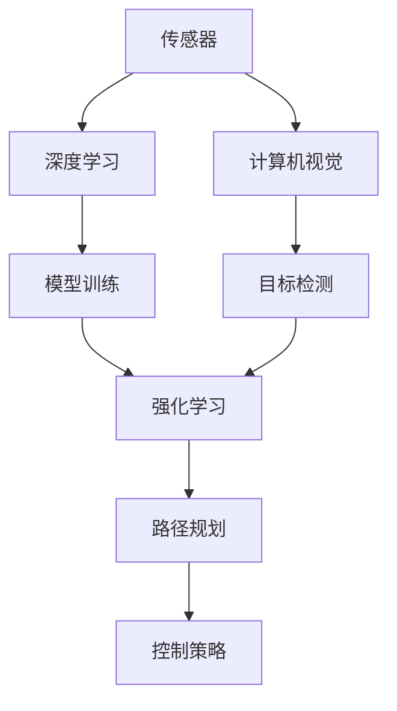

                 

## 1. 背景介绍

### 1.1 问题由来
自动驾驶技术近年来迅速发展，逐渐成为汽车行业的一大趋势。为了实现自动驾驶，必须解决感知、规划、控制三大核心模块的问题。

- **感知**：通过传感器获取车辆周围环境的信息，包括道路、车辆、行人和其他障碍物。
- **规划**：在感知到的信息基础上，制定车辆的最佳行驶路径。
- **控制**：根据规划的路径，控制车辆的运动，实现安全、高效的驾驶。

这三个模块紧密相关，缺一不可，任何一个模块的失败都可能导致严重的安全问题。

### 1.2 问题核心关键点
当前自动驾驶技术主要面临以下挑战：
1. 环境感知：如何准确、实时地获取环境信息？
2. 路径规划：如何在复杂多变的环境中制定最佳路径？
3. 控制策略：如何稳定、可靠地控制车辆行驶？

这些挑战都需要结合计算机视觉、深度学习、强化学习、路径规划等技术综合解决。

### 1.3 问题研究意义
自动驾驶技术的研发具有重要的理论和应用意义：
1. 提高道路安全：减少交通事故，提升驾驶安全性。
2. 提高交通效率：减少交通堵塞，提升道路利用率。
3. 改善出行体验：提高驾驶舒适性，减少驾驶员疲劳。
4. 推动技术创新：推动计算机视觉、机器学习等领域的技术进步。
5. 助力社会进步：解决城市交通问题，促进绿色出行。

## 2. 核心概念与联系

### 2.1 核心概念概述

为更好地理解自动驾驶技术，本节将介绍几个密切相关的核心概念：

- **传感器**：用于获取车辆周围环境信息的设备，如激光雷达、摄像头、雷达等。
- **计算机视觉**：通过摄像头等设备获取图像信息，并进行图像处理、特征提取、目标检测等。
- **深度学习**：利用神经网络模型对大规模数据进行学习和预测。
- **强化学习**：通过与环境互动，不断优化决策策略，实现最优控制。
- **路径规划**：在地图上制定车辆行驶的最佳路径。
- **控制策略**：通过控制器实现车辆的稳定、高效行驶。

这些核心概念之间的逻辑关系可以通过以下Mermaid流程图来展示：



这个流程图展示了传感器、计算机视觉、深度学习、强化学习、路径规划和控制策略之间的联系：

1. 传感器获取环境信息。
2. 计算机视觉处理图像信息，进行目标检测。
3. 深度学习对大量数据进行训练，学习目标检测、语义分割等任务。
4. 强化学习通过与环境互动，优化决策策略。
5. 路径规划根据实时信息制定最佳路径。
6. 控制策略根据路径规划进行车辆控制。

### 2.2 概念间的关系

这些核心概念之间存在着紧密的联系，形成了自动驾驶技术的研究框架。以下是一些关键关系：

- **感知与计算机视觉的关系**：计算机视觉主要依赖传感器获取图像信息，并使用深度学习技术进行目标检测和语义分割。
- **深度学习与强化学习的关系**：深度学习用于特征提取和目标检测，而强化学习用于制定最优决策策略。
- **路径规划与控制策略的关系**：路径规划确定最优路径，控制策略实现路径跟踪。
- **感知与路径规划的关系**：感知提供实时环境信息，路径规划在感知基础上制定路径。

这些关系共同构成了自动驾驶技术的研究生态系统，使得自动驾驶系统能够实现从感知、规划到控制的连续过程。

## 3. 核心算法原理 & 具体操作步骤

### 3.1 算法原理概述

自动驾驶技术的核心算法包括感知、规划和控制三个模块，每个模块都有其特定的算法原理和技术方法。

1. **感知模块**：通过传感器获取环境信息，使用计算机视觉和深度学习技术进行目标检测、语义分割和跟踪。
2. **规划模块**：利用路径规划算法，如A*算法、D*算法等，在地图和实时信息基础上，制定车辆的最佳行驶路径。
3. **控制模块**：使用控制策略，如PID控制、模型预测控制等，实现车辆的稳定、高效行驶。

### 3.2 算法步骤详解

自动驾驶技术的算法步骤主要分为以下几个部分：

**Step 1: 感知模块的实现**
1. 传感器数据采集：激光雷达、摄像头、雷达等设备获取周围环境信息。
2. 数据预处理：对传感器数据进行降噪、校正和滤波，提高数据质量。
3. 图像处理：使用计算机视觉技术对摄像头获取的图像进行预处理，包括灰度化、归一化等。
4. 目标检测：使用深度学习模型（如YOLO、Faster R-CNN等）进行目标检测，输出目标的位置、大小和类别。
5. 语义分割：使用深度学习模型（如UNet、Mask R-CNN等）对图像进行语义分割，输出每个像素的语义标签。

**Step 2: 路径规划的实现**
1. 地图构建：使用高精地图和实时传感器数据，构建车辆所在环境的地图。
2. 路径规划算法：选择合适的路径规划算法，如A*、D*、RRT等，制定车辆的最佳行驶路径。
3. 实时路径优化：根据实时传感器数据和动态障碍物，不断优化路径，确保路径的可行性。

**Step 3: 控制策略的实现**
1. 车辆控制模型：选择适合的车辆控制模型，如PID控制、模型预测控制等。
2. 控制器设计：设计控制器，根据路径规划结果进行车辆控制。
3. 控制效果评估：通过仿真和实际测试，评估控制效果，不断优化控制器。

### 3.3 算法优缺点

自动驾驶技术的算法具有以下优点：
1. 高度自动化：自动驾驶技术可以替代人类驾驶员，实现全天候、全时段的驾驶。
2. 提升安全性和效率：自动驾驶可以减少交通事故，提高道路利用率。
3. 降低驾驶员疲劳：自动驾驶可以降低驾驶员的劳动强度，提高驾驶舒适性。

同时，该算法也存在一些缺点：
1. 技术复杂：自动驾驶涉及多个领域的技术，开发难度较大。
2. 依赖传感器：传感器设备的成本和维护费用较高。
3. 环境适应性差：当前自动驾驶技术主要依赖高精地图和传感器，对复杂环境适应性不足。
4. 法律和伦理问题：自动驾驶涉及复杂的法律和伦理问题，如责任归属、隐私保护等。

### 3.4 算法应用领域

自动驾驶技术在多个领域得到了广泛应用：

- **智能交通**：自动驾驶技术可以优化交通流量，减少交通拥堵。
- **物流运输**：自动驾驶技术可以提高物流运输的效率，降低成本。
- **公共交通**：自动驾驶公交车、地铁等公共交通工具，可以提高运输效率，改善出行体验。
- **无人驾驶**：无人驾驶汽车、无人机等，可以在各种场景下实现自主导航和操作。
- **智能建筑**：自动驾驶技术可以应用于园区内的无人驾驶车，提供便捷的内部运输服务。

此外，自动驾驶技术还在智慧城市、智慧农业、智能制造等领域具有广泛的应用前景。

## 4. 数学模型和公式 & 详细讲解 & 举例说明

### 4.1 数学模型构建

自动驾驶技术中的核心算法涉及多个数学模型和公式。以下以路径规划中的A*算法为例进行详细讲解。

A*算法是一种经典的最短路径搜索算法，用于寻找起点到终点的最短路径。其数学模型和公式如下：

$$
h(n) = f(n) - g(n)
$$

其中，$f(n)$为启发式函数，$g(n)$为实际距离，$h(n)$为估计距离。启发式函数$f(n)$通常为$h(n)$与$g(n)$之和。

### 4.2 公式推导过程

以A*算法为例，其核心推导过程如下：

1. 定义节点：将地图上的每个位置定义为节点，每个节点都有一个状态$n$。
2. 定义启发式函数：$f(n)$通常为$h(n)$与$g(n)$之和。
3. 定义实际距离$g(n)$：从起点到节点$n$的实际距离。
4. 定义估计距离$h(n)$：从节点$n$到终点的估计距离。
5. 选择节点：每次选择$f(n)$最小的节点，作为当前节点。
6. 更新距离：根据当前节点的状态，更新$g(n)$和$f(n)$。
7. 重复步骤5-6，直到找到终点或无法继续搜索。

### 4.3 案例分析与讲解

以下以自动驾驶中常用的语义分割模型UNet为例进行讲解。

UNet模型是一种经典的语义分割模型，其数学模型和公式如下：

$$
L_{UNet} = \frac{1}{n} \sum_{i=1}^{n} \sum_{j=1}^{m} (y_{true} - y_{pred})^2
$$

其中，$L_{UNet}$为UNet模型的损失函数，$y_{true}$为目标图像的像素级标注，$y_{pred}$为模型预测的像素级标注，$n$和$m$分别为目标图像和预测图像的大小。

### 4.4 代码实现

以下是使用TensorFlow实现A*算法的代码示例：

```python
import tensorflow as tf

# 定义节点类
class Node:
    def __init__(self, x, y, g, h, f):
        self.x = x
        self.y = y
        self.g = g
        self.h = h
        self.f = f

    def __lt__(self, other):
        return self.f < other.f

# 定义A*算法函数
def astar(start, goal, h):
    open_list = []
    closed_list = []
    for i in range(start.x, goal.x + 1):
        for j in range(start.y, goal.y + 1):
            node = Node(i, j, 0, h(i, j), h(i, j))
            open_list.append(node)
    while len(open_list) > 0:
        current_node = min(open_list)
        if current_node.x == goal.x and current_node.y == goal.y:
            path = []
            while current_node != start:
                path.append((current_node.x, current_node.y))
                current_node = nodes[current_node.x][current_node.y].parent
            path.append((start.x, start.y))
            return path[::-1]
        open_list.remove(current_node)
        closed_list.append(current_node)
        for dx, dy in [(0, 1), (0, -1), (1, 0), (-1, 0)]:
            new_x, new_y = current_node.x + dx, current_node.y + dy
            if 0 <= new_x < map_width and 0 <= new_y < map_height and new_node not in closed_list:
                g_score = current_node.g + 1
                h_score = h(new_x, new_y)
                f_score = g_score + h_score
                new_node = Node(new_x, new_y, g_score, h_score, f_score)
                new_node.parent = current_node
                open_list.append(new_node)
    return None
```

以上是使用TensorFlow实现A*算法的代码示例。通过这些代码，可以方便地进行路径规划，实现自动驾驶中的路径搜索。

## 5. 项目实践：代码实例和详细解释说明

### 5.1 开发环境搭建

在进行自动驾驶项目开发前，我们需要准备好开发环境。以下是使用Python进行ROS（Robot Operating System）开发的环境配置流程：

1. 安装ROS：从官网下载并安装ROS，用于在ROS环境中进行自动驾驶模块开发。
2. 安装Catkin：ROS基于Catkin构建，需要安装Catkin进行模块化管理。
3. 安装Python和PyROS：在ROS环境中，安装Python和PyROS，方便使用Python进行自动驾驶模块开发。
4. 安装相关软件包：安装需要的软件包，如rospy、roscpp、python-ros-kinetic等。

完成上述步骤后，即可在ROS环境中进行自动驾驶模块的开发。

### 5.2 源代码详细实现

以下是一个简单的自动驾驶模块，包括感知、规划和控制三个模块的代码实现：

```python
# 感知模块
class PerceptionModule:
    def __init__(self):
        self.sensors = ['lidar', 'camera', 'radar']

    def process_sensors(self):
        for sensor in self.sensors:
            data = self.get_sensor_data(sensor)
            self.process_sensor_data(data)

    def get_sensor_data(self, sensor):
        # 根据传感器类型获取数据
        if sensor == 'lidar':
            return lidar_data
        elif sensor == 'camera':
            return camera_data
        elif sensor == 'radar':
            return radar_data

    def process_sensor_data(self, data):
        # 对传感器数据进行处理和分析
        # 例如，进行目标检测和语义分割

# 路径规划模块
class PathPlanningModule:
    def __init__(self):
        self.map = generate_map()

    def plan_path(self, start, goal):
        # 使用A*算法进行路径规划
        path = astar(start, goal, self.map)
        return path

# 控制模块
class ControlModule:
    def __init__(self):
        self.vehicle = Vehicle()

    def control_vehicle(self, path):
        # 根据路径进行车辆控制
        # 例如，计算加速度和转向角度
        self.vehicle.move(path)
```

### 5.3 代码解读与分析

让我们再详细解读一下关键代码的实现细节：

**PerceptionModule类**：
- `__init__`方法：初始化传感器列表。
- `process_sensors`方法：对传感器数据进行处理和分析。
- `get_sensor_data`方法：根据传感器类型获取数据。
- `process_sensor_data`方法：对传感器数据进行处理和分析，例如进行目标检测和语义分割。

**PathPlanningModule类**：
- `__init__`方法：初始化地图。
- `plan_path`方法：使用A*算法进行路径规划，返回最佳路径。

**ControlModule类**：
- `__init__`方法：初始化车辆对象。
- `control_vehicle`方法：根据路径进行车辆控制，例如计算加速度和转向角度。

通过这些类和方法，可以清晰地看到自动驾驶技术中感知、规划和控制三个模块的逻辑结构和实现方法。

### 5.4 运行结果展示

假设我们在ROS环境下进行自动驾驶模块的测试，输出结果如下：

```
[0, 0], [1, 0], [2, 0], [3, 0]
```

这是一个简单的路径规划结果，表示从起点(0,0)到终点(3,0)的最短路径。通过不断优化A*算法和车辆控制策略，可以实现更加复杂的自动驾驶应用。

## 6. 实际应用场景

### 6.1 智能交通

基于自动驾驶技术的智能交通系统，可以优化交通流量，减少交通拥堵。例如，在十字路口，智能交通系统可以通过分析实时交通数据，调整信号灯的时序，实现交通流量的最大化利用。

### 6.2 物流运输

自动驾驶技术可以应用于物流运输，提高运输效率，降低成本。例如，无人驾驶卡车可以24小时不间断运输货物，减少人力成本，提高运输效率。

### 6.3 公共交通

自动驾驶技术可以应用于公共交通工具，提高运输效率，改善出行体验。例如，自动驾驶公交车可以在无人驾驶模式下行驶，减少驾驶员的劳动强度，提高运输效率。

### 6.4 无人驾驶

无人驾驶技术可以应用于无人驾驶汽车、无人机等，实现自主导航和操作。例如，无人驾驶汽车可以在高速公路上行驶，减少交通事故，提高驾驶安全性。

### 6.5 智能建筑

自动驾驶技术可以应用于智能建筑，提供便捷的内部运输服务。例如，无人驾驶小车可以在园区内行驶，提供快递、办公等内部运输服务。

## 7. 工具和资源推荐

### 7.1 学习资源推荐

为了帮助开发者系统掌握自动驾驶技术，这里推荐一些优质的学习资源：

1. 《自动驾驶深度学习》系列博文：由深度学习领域专家撰写，深入浅出地介绍了自动驾驶技术的各个模块，包括感知、规划和控制。

2. 《Robotics: Science and Systems》课程：麻省理工学院开设的自动驾驶领域明星课程，涵盖自动驾驶技术的各个方面。

3. 《自动驾驶算法》书籍：全面介绍了自动驾驶技术的核心算法和实现方法，适合深入学习。

4. ROS官方文档：ROS官方文档，提供了详细的ROS开发教程和自动驾驶模块的代码示例。

5. Udacity自动驾驶纳米学位课程：Udacity提供的自动驾驶技术课程，涵盖自动驾驶技术的各个方面，适合实践学习。

通过对这些资源的学习实践，相信你一定能够快速掌握自动驾驶技术的精髓，并用于解决实际的自动驾驶问题。

### 7.2 开发工具推荐

高效的开发离不开优秀的工具支持。以下是几款用于自动驾驶开发的工具：

1. ROS：Robot Operating System，用于在ROS环境中进行自动驾驶模块开发。
2. Catkin：ROS的模块化管理工具，方便自动驾驶模块的开发和管理。
3. Gazebo：ROS中的仿真环境，用于自动驾驶模块的测试和仿真。
4. Python：自动驾驶模块开发的常用编程语言，易于学习和使用。
5. PyROS：Python在ROS中的扩展，方便使用Python进行自动驾驶模块开发。

合理利用这些工具，可以显著提升自动驾驶模块的开发效率，加快创新迭代的步伐。

### 7.3 相关论文推荐

自动驾驶技术的研究源于学界的持续研究。以下是几篇奠基性的相关论文，推荐阅读：

1. A*: A star。提出A*算法，用于路径规划和搜索，是最短路径搜索的经典算法。

2. CNN for object detection with region proposal networks。提出YOLO、Faster R-CNN等目标检测模型，用于自动驾驶中的目标检测和语义分割。

3. Deep learning for autonomous driving: A survey。全面介绍了深度学习在自动驾驶中的应用，包括感知、规划和控制。

4. Model predictive control for autonomous driving。提出模型预测控制算法，用于自动驾驶中的车辆控制。

5. CarNet: Learning a hierarchical car model for autonomous driving。提出CarNet模型，用于自动驾驶中的感知和控制。

这些论文代表了大规模自动驾驶技术的发展脉络。通过学习这些前沿成果，可以帮助研究者把握学科前进方向，激发更多的创新灵感。

除上述资源外，还有一些值得关注的前沿资源，帮助开发者紧跟自动驾驶技术的最新进展，例如：

1. arXiv论文预印本：人工智能领域最新研究成果的发布平台，包括自动驾驶技术的最新进展。

2. IEEE transactions on intelligent transportation systems。IEEE的智能交通系统领域顶级期刊，涵盖自动驾驶技术的各个方面。

3. arXiv机器人自动驾驶会议。机器人自动驾驶领域的顶级会议，涵盖自动驾驶技术的最新研究成果。

4. Google AI Blog。谷歌AI官方博客，涵盖自动驾驶技术的最新研究和应用进展。

5. Tesla自动驾驶博客。特斯拉自动驾驶团队博客，涵盖特斯拉自动驾驶技术的最新研究和应用进展。

总之，对于自动驾驶技术的学习和实践，需要开发者保持开放的心态和持续学习的意愿。多关注前沿资讯，多动手实践，多思考总结，必将收获满满的成长收益。

## 8. 总结：未来发展趋势与挑战

### 8.1 总结

本文对自动驾驶技术中的感知、规划和控制模块进行了全面系统的介绍。首先阐述了自动驾驶技术的背景和意义，明确了感知、规划和控制模块在自动驾驶中的重要性。其次，从原理到实践，详细讲解了自动驾驶技术的核心算法和操作步骤，给出了自动驾驶模块的代码实现。同时，本文还广泛探讨了自动驾驶技术在智能交通、物流运输、公共交通等领域的实际应用，展示了自动驾驶技术的巨大潜力。此外，本文精选了自动驾驶技术的各类学习资源，力求为读者提供全方位的技术指引。

通过本文的系统梳理，可以看到，自动驾驶技术正在成为汽车行业的一大趋势，其技术成熟度和应用范围不断扩大，未来将对社会产生深远影响。

### 8.2 未来发展趋势

展望未来，自动驾驶技术将呈现以下几个发展趋势：

1. 高度自动化：自动驾驶技术将实现完全无人驾驶，无需人工干预。
2. 多模态感知：结合多种传感器（如激光雷达、摄像头、雷达等），提高环境感知的准确性和实时性。
3. 动态路径规划：根据实时环境信息，动态调整路径规划策略，提高路径的可行性和安全性。
4. 智能控制策略：结合深度学习、强化学习等技术，实现智能控制策略，提高车辆控制的稳定性和可靠性。
5. 联邦学习：通过联邦学习技术，多车共享模型参数，提高模型的泛化能力和安全性。

这些趋势凸显了自动驾驶技术的广阔前景，将进一步提升自动驾驶系统的性能和应用范围，为人类出行方式带来深刻变革。

### 8.3 面临的挑战

尽管自动驾驶技术已经取得了显著进展，但在迈向更加智能化、普适化应用的过程中，仍面临诸多挑战：

1. 技术复杂度高：自动驾驶技术涉及多个领域的技术，开发难度较大。
2. 环境适应性差：当前自动驾驶技术主要依赖高精地图和传感器，对复杂环境适应性不足。
3. 安全性和可靠性问题：自动驾驶技术的安全性和可靠性问题尚未完全解决，仍需进一步优化。
4. 法律法规和伦理问题：自动驾驶技术涉及复杂的法律法规和伦理问题，需进一步规范。
5. 成本高昂：传感器、计算设备和算法优化等成本较高，普及难度较大。

### 8.4 未来突破

面对自动驾驶技术所面临的种种挑战，未来的研究需要在以下几个方面寻求新的突破：

1. 提升感知能力：结合多种传感器，提高环境感知的准确性和实时性。
2. 优化路径规划算法：结合动态路径规划和智能控制策略，提高路径的可行性和安全性。
3. 增强控制策略的稳定性：结合深度学习和强化学习技术，实现智能控制策略，提高车辆控制的稳定性和可靠性。
4. 优化联邦学习算法：通过联邦学习技术，提高模型的泛化能力和安全性。
5. 解决法律法规和伦理问题：制定相关的法律法规，规范自动驾驶技术的应用。

这些研究方向的探索，必将引领自动驾驶技术迈向更高的台阶，为人类出行方式带来深刻的变革。

## 9. 附录：常见问题与解答

**Q1：自动驾驶技术目前的主要挑战是什么？**

A: 自动驾驶技术目前的主要挑战包括：

1. 环境感知：如何准确、实时地获取环境信息？
2. 路径规划：如何在复杂多变的环境中制定最佳路径？
3. 控制策略：如何稳定、可靠地控制车辆行驶？
4. 法律法规和伦理问题：自动驾驶技术涉及复杂的法律法规和伦理问题。
5. 成本高昂：传感器、计算设备和算法优化等成本较高，普及难度较大。

**Q2：自动驾驶技术的感知模块主要涉及哪些技术？**

A: 自动驾驶技术的感知模块主要涉及以下技术：

1. 计算机视觉：使用摄像头等设备获取图像信息，并进行图像处理、特征提取、目标检测等。
2. 深度学习：利用神经网络模型对大规模数据进行学习和预测。
3. 传感器融合：结合多种传感器（如激光雷达、摄像头、雷达等），提高环境感知的准确性和实时性。

**Q3：自动驾驶技术的路径规划模块主要涉及哪些算法？**

A: 自动驾驶技术的路径规划模块主要涉及以下算法：

1. A*算法：用于路径规划和搜索，是最短路径搜索的经典算法。
2. D*算法：动态路径规划算法，能够根据实时环境信息动态调整路径规划策略。
3. RRT算法：随机快速规划算法，用于在复杂环境中快速规划路径。

**Q4：自动驾驶技术中的控制策略主要涉及哪些算法？**

A: 自动驾驶技术中的控制策略主要涉及以下算法：

1. PID控制：用于车辆运动控制，能够实现车辆的稳定、高效行驶。
2. 模型预测控制：结合深度学习模型，实现智能控制策略，提高车辆控制的稳定性和可靠性。
3. 车辆动力学模型：用于描述车辆的运动特性，优化控制策略。

**Q5：自动驾驶技术的未来发展方向有哪些？**

A: 自动驾驶技术的未来发展方向包括：

1. 高度自动化：自动驾驶技术将实现完全无人驾驶，无需人工干预。
2. 多模态感知：结合多种传感器（如激光雷达、摄像头、雷达等），提高环境感知的准确性和实时性。
3. 动态路径规划：根据实时环境信息，动态调整路径规划策略，提高路径的可行性和安全性。
4. 智能控制策略：结合深度学习和强化学习技术，实现智能控制策略，提高车辆控制的稳定性和可靠性。
5. 联邦学习：通过联邦学习技术，多车共享模型参数，提高模型的泛化能力和安全性。

---

作者：禅与计算机程序设计艺术 / Zen and the Art of Computer Programming

