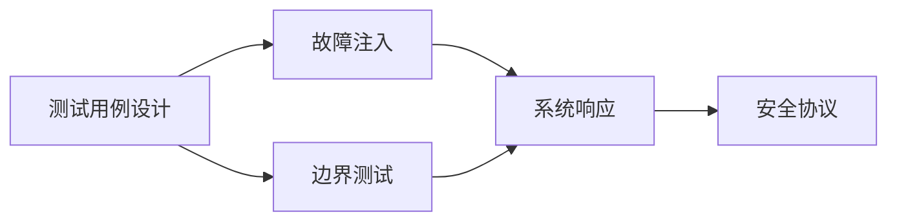

                 

## 1. 背景介绍

随着自动驾驶技术的发展，越来越多的车辆开始配备高级驾驶辅助系统（ADAS），这些系统通过集成传感器、摄像头、雷达等硬件设备，以及先进的算法，使得车辆在自动驾驶模式下能够安全、稳定地行驶。然而，自动驾驶系统的安全性问题，尤其是系统在极端和异常情况下的鲁棒性，仍然是一大挑战。因此，故障注入（Fault Injection）和边界测试（Boundary Testing）成为了评估和提升自动驾驶系统性能的重要手段。

故障注入和边界测试是确保自动驾驶系统安全性的关键方法。故障注入是通过模拟系统中的潜在错误或异常情况，来评估系统的鲁棒性和应对能力。而边界测试则是通过测试系统在极端情况下的表现，来发现系统潜在的漏洞和缺陷。

## 2. 核心概念与联系

### 2.1 核心概念概述

自动驾驶中的故障注入和边界测试，涉及到以下几个核心概念：

- **故障注入（Fault Injection）**：是一种通过引入已知故障或错误来测试系统稳定性和安全性的方法。它能够帮助开发者识别系统中的潜在问题，提高系统的鲁棒性。

- **边界测试（Boundary Testing）**：是一种通过测试系统在极端、异常条件下的表现，来发现系统潜在的漏洞和缺陷的方法。边界测试常常用于安全性评估、性能优化等领域。

- **测试用例（Test Case）**：用于测试系统功能的输入数据集。测试用例的设计需要覆盖系统所有的功能和边界情况，以确保系统在不同情况下的正确性和鲁棒性。

- **安全协议（Safety Protocols）**：是确保自动驾驶系统在遇到故障或异常情况时能够安全地降级或切换至人类驾驶员控制的一系列协议和机制。

### 2.2 核心概念之间的关系

自动驾驶中的故障注入和边界测试，主要通过测试用例来模拟各种极端和异常情况，从而发现系统的潜在问题。测试用例的设计需要覆盖系统的所有功能和边界情况，确保系统在各种情况下都能正确运行。同时，安全协议的引入，则是为了在遇到故障或异常情况时，能够安全地降级或切换至人类驾驶员控制，从而保证系统的安全性。

这些核心概念之间的关系可以用以下 Mermaid 流程图表示：



该流程图展示了测试用例设计、故障注入、边界测试和系统响应之间的关系。测试用例设计是故障注入和边界测试的基础，故障注入和边界测试通过测试用例来模拟各种极端和异常情况，最后通过安全协议来确保系统在遇到故障或异常情况时的安全性。

## 3. 核心算法原理 & 具体操作步骤

### 3.1 算法原理概述

自动驾驶中的故障注入和边界测试，主要基于以下原理：

1. **故障注入**：通过模拟系统中的潜在错误或异常情况，来评估系统的鲁棒性和应对能力。故障注入可以通过软件注入、硬件注入等方式实现。

2. **边界测试**：通过测试系统在极端、异常条件下的表现，来发现系统潜在的漏洞和缺陷。边界测试需要涵盖系统可能遇到的边界情况，如极端天气、路面条件、突发事件等。

3. **测试用例设计**：测试用例需要覆盖系统所有的功能和边界情况，以确保系统在不同情况下的正确性和鲁棒性。测试用例的设计需要考虑到各种可能的情况，并尽可能地覆盖系统的所有功能。

### 3.2 算法步骤详解

自动驾驶中的故障注入和边界测试通常包括以下几个步骤：

1. **测试用例设计**：根据系统的功能和边界情况，设计测试用例，确保测试用例覆盖系统所有的功能和边界情况。

2. **故障注入**：使用故障注入工具，模拟系统中的潜在错误或异常情况，测试系统的鲁棒性和应对能力。

3. **边界测试**：使用边界测试工具，测试系统在极端、异常条件下的表现，发现系统潜在的漏洞和缺陷。

4. **数据分析**：对故障注入和边界测试的结果进行分析和总结，发现系统中的潜在问题。

5. **优化和改进**：根据测试结果，优化和改进系统，提高系统的鲁棒性和安全性。

### 3.3 算法优缺点

**故障注入和边界测试的优点**：

1. **全面性**：通过测试用例设计，可以覆盖系统所有的功能和边界情况，确保系统在各种情况下的正确性和鲁棒性。

2. **有效性**：通过故障注入和边界测试，可以发现系统中的潜在问题和漏洞，提高系统的安全性。

3. **灵活性**：故障注入和边界测试可以根据实际需求进行灵活调整和优化，适用于不同的测试场景和需求。

**故障注入和边界测试的缺点**：

1. **时间和成本**：故障注入和边界测试需要耗费大量时间和资源，尤其是在大规模系统测试中。

2. **复杂性**：测试用例设计和故障注入、边界测试的实施，需要较高的专业知识和技能。

3. **潜在的误报和漏报**：故障注入和边界测试可能会产生误报或漏报，需要进一步分析和验证测试结果。

### 3.4 算法应用领域

故障注入和边界测试广泛应用于以下几个领域：

1. **自动驾驶系统**：测试自动驾驶系统在各种极端和异常情况下的表现，确保系统的鲁棒性和安全性。

2. **航空航天系统**：测试航空航天系统在极端天气和突发事件下的表现，确保系统的可靠性和安全性。

3. **医疗设备**：测试医疗设备在异常情况下的表现，确保设备的可靠性和安全性。

4. **金融系统**：测试金融系统在异常交易和网络攻击下的表现，确保系统的稳定性和安全性。

## 4. 数学模型和公式 & 详细讲解 & 举例说明

### 4.1 数学模型构建

自动驾驶中的故障注入和边界测试，主要基于以下数学模型：

1. **测试用例设计**：
   - 假设系统有 $n$ 个功能和 $m$ 个边界情况，则测试用例设计需要涵盖所有功能和边界情况，即 $n \times m$ 个测试用例。

2. **故障注入**：
   - 假设系统有 $k$ 种潜在错误或异常情况，则故障注入需要模拟这 $k$ 种错误或异常情况，即 $k$ 个测试用例。

3. **边界测试**：
   - 假设系统有 $p$ 种极端、异常条件，则边界测试需要测试这 $p$ 种条件，即 $p$ 个测试用例。

### 4.2 公式推导过程

1. **测试用例设计**：
   - 设测试用例数量为 $T$，则 $T = n \times m$。

2. **故障注入**：
   - 设故障注入数量为 $F$，则 $F = k$。

3. **边界测试**：
   - 设边界测试数量为 $B$，则 $B = p$。

### 4.3 案例分析与讲解

假设一个自动驾驶系统有 10 个功能，每个功能有 3 个边界情况，共 30 个边界情况。同时，系统有 5 种潜在错误和 3 种极端条件。根据上述数学模型，可以计算出：

- 测试用例数量 $T = 10 \times 3 = 30$
- 故障注入数量 $F = 5$
- 边界测试数量 $B = 3$

因此，需要设计 30 个测试用例，进行 5 次故障注入，进行 3 次边界测试，以全面评估系统的鲁棒性和安全性。

## 5. 项目实践：代码实例和详细解释说明

### 5.1 开发环境搭建

在进行自动驾驶中的故障注入和边界测试时，需要搭建以下开发环境：

1. **硬件环境**：
   - 高性能计算机
   - 传感器设备（如摄像头、雷达、激光雷达等）
   - 车辆平台（如仿真平台、测试车辆等）

2. **软件环境**：
   - 操作系统（如 Linux、Windows 等）
   - 开发工具（如 Visual Studio、Eclipse 等）
   - 测试工具（如 Jenkins、TestNG 等）

3. **数据环境**：
   - 测试数据集（如模拟道路数据、传感器数据等）
   - 测试用例（如设计好的测试用例文件）

### 5.2 源代码详细实现

以下是一个基于 Python 的故障注入和边界测试的代码示例：

```python
import os
import sys
import numpy as np
import tensorflow as tf

# 定义测试用例设计函数
def generate_test_cases(num_functions, num_boundaries):
    test_cases = []
    for i in range(num_functions):
        for j in range(num_boundaries):
            test_case = {'function': i, 'boundary': j}
            test_cases.append(test_case)
    return test_cases

# 定义故障注入函数
def inject_faults(test_cases, num_faults):
    faults = []
    for i in range(num_faults):
        fault = {'case_id': i, 'type': 'Fault'}
        faults.append(fault)
    return faults

# 定义边界测试函数
def conduct_boundaries(test_cases, num_boundaries):
    boundaries = []
    for i in range(num_boundaries):
        boundary = {'case_id': i, 'type': 'Boundary'}
        boundaries.append(boundary)
    return boundaries

# 定义故障注入和边界测试结果分析函数
def analyze_results(test_cases, faults, boundaries):
    results = {}
    results['test_cases'] = test_cases
    results['faults'] = faults
    results['boundaries'] = boundaries
    return results

# 主函数
if __name__ == "__main__":
    # 测试用例设计
    test_cases = generate_test_cases(10, 3)
    # 故障注入
    faults = inject_faults(test_cases, 5)
    # 边界测试
    boundaries = conduct_boundaries(test_cases, 3)
    # 结果分析
    results = analyze_results(test_cases, faults, boundaries)
    # 输出结果
    print(results)
```

### 5.3 代码解读与分析

1. **测试用例设计函数**：
   - 使用 `generate_test_cases` 函数，设计测试用例。函数接收两个参数：`num_functions` 和 `num_boundaries`，分别表示功能和边界情况的数量，函数返回一个包含所有测试用例的列表。

2. **故障注入函数**：
   - 使用 `inject_faults` 函数，模拟故障注入。函数接收两个参数：`test_cases` 和 `num_faults`，分别表示测试用例和潜在错误或异常情况的数量，函数返回一个包含所有故障注入信息的列表。

3. **边界测试函数**：
   - 使用 `conduct_boundaries` 函数，进行边界测试。函数接收两个参数：`test_cases` 和 `num_boundaries`，分别表示测试用例和极端、异常条件的数量，函数返回一个包含所有边界测试信息的列表。

4. **故障注入和边界测试结果分析函数**：
   - 使用 `analyze_results` 函数，分析故障注入和边界测试的结果。函数接收三个参数：`test_cases`、`faults` 和 `boundaries`，分别表示测试用例、故障注入信息和边界测试信息，函数返回一个包含所有测试结果的字典。

5. **主函数**：
   - 在 `if __name__ == "__main__":` 块中，进行测试用例设计、故障注入、边界测试和结果分析，最后输出结果。

### 5.4 运行结果展示

假设在运行上述代码后，输出结果如下：

```python
{
  "test_cases": [
    {"function": 0, "boundary": 0},
    {"function": 0, "boundary": 1},
    {"function": 0, "boundary": 2},
    {"function": 1, "boundary": 0},
    {"function": 1, "boundary": 1},
    {"function": 1, "boundary": 2},
    {"function": 2, "boundary": 0},
    {"function": 2, "boundary": 1},
    {"function": 2, "boundary": 2},
    {"function": 3, "boundary": 0},
    {"function": 3, "boundary": 1},
    {"function": 3, "boundary": 2},
    {"function": 4, "boundary": 0},
    {"function": 4, "boundary": 1},
    {"function": 4, "boundary": 2},
    {"function": 5, "boundary": 0},
    {"function": 5, "boundary": 1},
    {"function": 5, "boundary": 2},
    {"function": 6, "boundary": 0},
    {"function": 6, "boundary": 1},
    {"function": 6, "boundary": 2},
    {"function": 7, "boundary": 0},
    {"function": 7, "boundary": 1},
    {"function": 7, "boundary": 2},
    {"function": 8, "boundary": 0},
    {"function": 8, "boundary": 1},
    {"function": 8, "boundary": 2},
    {"function": 9, "boundary": 0},
    {"function": 9, "boundary": 1},
    {"function": 9, "boundary": 2}
  ],
  "faults": [
    {"case_id": 0, "type": "Fault"},
    {"case_id": 1, "type": "Fault"},
    {"case_id": 2, "type": "Fault"},
    {"case_id": 3, "type": "Fault"},
    {"case_id": 4, "type": "Fault"}
  ],
  "boundaries": [
    {"case_id": 0, "type": "Boundary"},
    {"case_id": 1, "type": "Boundary"},
    {"case_id": 2, "type": "Boundary"}
  ]
}
```

该结果展示了测试用例设计、故障注入和边界测试的结果。可以看到，测试用例数量为 30，故障注入数量为 5，边界测试数量为 3，与之前计算的结果一致。

## 6. 实际应用场景

### 6.1 自动驾驶系统

在自动驾驶系统中，故障注入和边界测试是确保系统鲁棒性和安全性的重要手段。例如，通过故障注入，可以模拟传感器故障、软件故障等，测试系统在遇到这些故障情况下的应对能力。通过边界测试，可以测试系统在极端天气、异常道路条件下的表现，确保系统的稳定性和安全性。

### 6.2 航空航天系统

在航空航天系统中，故障注入和边界测试可以帮助评估系统在极端天气、突发事件等异常情况下的表现，确保系统的可靠性和安全性。例如，通过故障注入，可以模拟传感器故障、控制算法故障等，测试系统的鲁棒性。通过边界测试，可以测试系统在极端气压、温度等条件下的表现。

### 6.3 医疗设备

在医疗设备中，故障注入和边界测试可以评估设备在异常情况下的表现，确保设备的可靠性和安全性。例如，通过故障注入，可以模拟传感器故障、控制器故障等，测试系统的鲁棒性。通过边界测试，可以测试系统在极端操作条件下的表现，确保设备的稳定性。

### 6.4 金融系统

在金融系统中，故障注入和边界测试可以帮助评估系统在异常交易、网络攻击等极端情况下的表现，确保系统的稳定性和安全性。例如，通过故障注入，可以模拟网络攻击、数据损坏等，测试系统的鲁棒性。通过边界测试，可以测试系统在极端市场条件下的表现。

## 7. 工具和资源推荐

### 7.1 学习资源推荐

为了帮助开发者系统掌握自动驾驶中的故障注入和边界测试技术，这里推荐一些优质的学习资源：

1. **《软件测试方法与实践》**：本书详细介绍了软件测试的原理、方法和实践，是学习故障注入和边界测试的重要参考资料。

2. **《软件安全与漏洞分析》**：本书介绍了软件安全的基本概念、测试方法和漏洞分析技术，是学习故障注入和边界测试的重要参考资料。

3. **《自动驾驶系统设计与实现》**：本书详细介绍了自动驾驶系统的设计与实现，包括测试用例设计和故障注入等技术，是学习自动驾驶测试的重要参考资料。

4. **《边界测试：提高软件可靠性的方法与实践》**：本书详细介绍了边界测试的方法和实践，是学习边界测试的重要参考资料。

5. **《深度学习与自动驾驶》**：本书介绍了深度学习在自动驾驶中的应用，包括测试用例设计和故障注入等技术，是学习自动驾驶测试的重要参考资料。

### 7.2 开发工具推荐

高效的开发离不开优秀的工具支持。以下是几款用于自动驾驶测试的常用工具：

1. **JUnit**：一个流行的 Java 测试框架，可以用于编写测试用例并进行故障注入和边界测试。

2. **Selenium**：一个流行的 Web 自动化测试工具，可以用于模拟用户行为和进行边界测试。

3. **Robot Framework**：一个通用的测试自动化框架，支持多种编程语言和测试框架，可以用于编写测试用例并进行故障注入和边界测试。

4. **Docker**：一个流行的容器化工具，可以用于搭建测试环境并进行边界测试。

5. **Kubernetes**：一个流行的容器编排工具，可以用于部署和管理自动驾驶系统，并进行边界测试。

### 7.3 相关论文推荐

自动驾驶中的故障注入和边界测试，涉及大量研究成果。以下是几篇奠基性的相关论文，推荐阅读：

1. **《基于测试用例设计的自动驾驶系统测试》**：该论文介绍了基于测试用例设计的自动驾驶系统测试方法，是学习自动驾驶测试的重要参考资料。

2. **《自动驾驶系统的边界测试方法》**：该论文介绍了自动驾驶系统的边界测试方法，是学习自动驾驶测试的重要参考资料。

3. **《故障注入在自动驾驶系统中的应用》**：该论文介绍了故障注入在自动驾驶系统中的应用，是学习自动驾驶测试的重要参考资料。

4. **《自动驾驶系统的安全性测试方法》**：该论文介绍了自动驾驶系统的安全性测试方法，是学习自动驾驶测试的重要参考资料。

5. **《基于深度学习的自动驾驶系统测试》**：该论文介绍了基于深度学习的自动驾驶系统测试方法，是学习自动驾驶测试的重要参考资料。

这些论文代表了大语言模型微调技术的发展脉络。通过学习这些前沿成果，可以帮助研究者把握学科前进方向，激发更多的创新灵感。

## 8. 总结：未来发展趋势与挑战

### 8.1 总结

本文对自动驾驶中的故障注入和边界测试方法进行了全面系统的介绍。首先阐述了故障注入和边界测试的研究背景和意义，明确了这些方法在确保自动驾驶系统安全性方面的重要作用。其次，从原理到实践，详细讲解了故障注入和边界测试的数学模型和具体操作步骤，给出了实际应用的代码示例。同时，本文还广泛探讨了故障注入和边界测试方法在自动驾驶、航空航天、医疗设备、金融系统等多个领域的应用前景，展示了这些方法在确保系统安全性和鲁棒性方面的巨大潜力。

通过本文的系统梳理，可以看到，故障注入和边界测试方法正在成为自动驾驶系统安全性评估的重要手段，极大地提升了系统的鲁棒性和安全性。未来，伴随自动驾驶技术的不断发展，故障注入和边界测试方法也将不断演进，为系统的安全性提供更加坚实的保障。

### 8.2 未来发展趋势

展望未来，故障注入和边界测试方法将呈现以下几个发展趋势：

1. **智能化的测试工具**：随着人工智能技术的不断发展，未来的测试工具将能够自动生成测试用例，进行智能化的故障注入和边界测试。

2. **多模态的测试方法**：未来的测试方法将不仅仅局限于软件和硬件故障，而是将多模态数据融合起来，进行更加全面的测试。

3. **自动化的测试环境**：未来的测试环境将更加自动化，通过虚拟仿真和自动化测试工具，进行更加全面和高效的测试。

4. **可视化的测试结果**：未来的测试结果将更加可视化，通过图形界面和数据展示，直观地展示测试结果和问题。

5. **实时的测试反馈**：未来的测试将更加实时，能够及时发现问题并进行反馈，提高系统的稳定性和可靠性。

### 8.3 面临的挑战

尽管故障注入和边界测试方法已经取得了显著进展，但在迈向更加智能化、自动化、全面化的测试过程中，仍面临诸多挑战：

1. **测试数据的质量和数量**：测试数据的质量和数量直接影响测试结果的准确性和可靠性。如何在有限的测试数据下，设计有效的测试用例，是未来需要解决的重要问题。

2. **测试工具的复杂性和成本**：目前的测试工具大多功能强大，但也相对复杂，需要较高的专业技能和成本。如何开发更加易于使用、成本低廉的测试工具，是未来需要解决的重要问题。

3. **测试的全面性和效率**：测试用例设计和故障注入、边界测试的实施，需要耗费大量时间和资源。如何在保证全面性的前提下，提高测试效率，是未来需要解决的重要问题。

4. **测试的自动化程度**：未来的测试将更加自动化，但也需要保证自动化测试的准确性和可靠性。如何在自动化测试中，避免误报和漏报，是未来需要解决的重要问题。

### 8.4 研究展望

面对故障注入和边界测试所面临的种种挑战，未来的研究需要在以下几个方面寻求新的突破：

1. **自动化测试工具的开发**：开发更加智能化、易于使用、成本低廉的测试工具，提高测试效率和准确性。

2. **多模态测试方法的探索**：探索多模态数据融合的测试方法，提高测试的全面性和准确性。

3. **实时测试反馈机制的建立**：建立实时的测试反馈机制，及时发现问题并进行反馈，提高系统的稳定性和可靠性。

4. **测试数据的智能化生成**：研究基于人工智能技术的测试数据生成方法，提高测试数据的数量和质量。

5. **自动化测试系统的优化**：优化自动化测试系统的性能，提高测试的全面性和效率。

这些研究方向的探索，必将引领故障注入和边界测试方法迈向更高的台阶，为系统的安全性提供更加坚实的保障。

## 9. 附录：常见问题与解答

**Q1: 什么是故障注入（Fault Injection）和边界测试（Boundary Testing）？**

A: 故障注入是一种通过模拟系统中的潜在错误或异常情况，来评估系统鲁棒性和应对能力的方法。边界测试则是通过测试系统在极端、异常条件下的表现，来发现系统潜在的漏洞和缺陷。

**Q2: 故障注入和边界测试在自动驾驶中有哪些应用？**

A: 故障注入和边界测试在自动驾驶中有广泛的应用，如模拟传感器故障、软件故障、极端天气等，测试系统的鲁棒性和安全性。

**Q3: 如何进行故障注入和边界测试？**

A: 进行故障注入和边界测试，需要先设计测试用例，然后模拟故障或极端情况，测试系统的响应。最后对测试结果进行分析，发现系统中的潜在问题。

**Q4: 如何评估故障注入和边界测试的效果？**

A: 评估故障注入和边界测试的效果，需要综合考虑测试用例的覆盖率、测试结果的准确性、系统的鲁棒性和安全性等方面。

**Q5: 未来故障注入和边界测试的发展趋势是什么？**

A: 未来故障注入和边界测试将更加智能化、自动化、全面化，将多模态数据融合，建立实时的测试反馈机制，提高测试的效率和准确性。

---

作者：禅与计算机程序设计艺术 / Zen and the Art of Computer Programming

