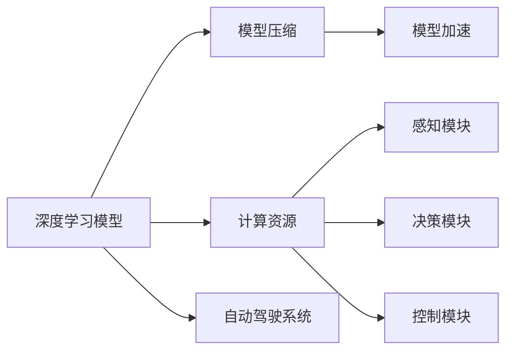
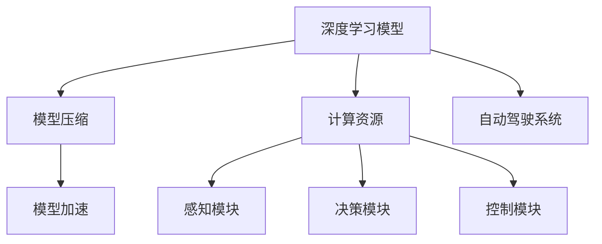

                 

# 自动驾驶中的深度学习模型压缩与加速技术

> 关键词：自动驾驶,深度学习,模型压缩,加速技术,计算机视觉,汽车电子

## 1. 背景介绍

### 1.1 问题由来
随着自动驾驶技术的快速发展，深度学习在自动驾驶领域的应用越来越广泛，尤其是在计算机视觉和感知模块中。然而，深度学习模型的参数量庞大，计算复杂度高，对计算资源的需求非常高。如何在有限的计算资源下，实现自动驾驶系统的稳定、高效的运行，是一个重要的研究课题。

在自动驾驶系统中，计算资源主要集中在车载计算机和云端服务器上。车载计算机需要实时处理高分辨率的摄像头和传感器数据，进行目标检测、行人识别、车道保持等任务，计算负担非常重。因此，如何对深度学习模型进行压缩和加速，以提高其运行效率，成为自动驾驶系统优化的关键。

### 1.2 问题核心关键点
本节将探讨以下核心问题：
- 深度学习模型在自动驾驶系统中的关键作用和应用场景。
- 当前深度学习模型压缩与加速技术的现状和不足。
- 深度学习模型压缩与加速的主要目标和挑战。

### 1.3 问题研究意义
研究深度学习模型在自动驾驶系统中的应用，对于提升自动驾驶系统的性能、降低计算资源需求、提高车辆运行效率具有重要意义：

1. **性能提升**：通过模型压缩和加速技术，可以实现更高的目标检测精度、更快速的行人识别速度，从而提升驾驶安全和用户体验。
2. **资源节省**：减少计算资源的消耗，降低对车载计算机和云端服务器的依赖，使得自动驾驶系统可以在更广泛的车辆和场景中应用。
3. **成本降低**：优化深度学习模型，可以减少硬件和计算成本，推动自动驾驶技术的普及和商业化。
4. **实时性增强**：提高模型的计算效率，使得自动驾驶系统可以实时处理复杂的驾驶场景，保障行车安全。

## 2. 核心概念与联系

### 2.1 核心概念概述

为更好地理解自动驾驶系统中的深度学习模型压缩与加速方法，本节将介绍几个密切相关的核心概念：

- **深度学习模型**：以卷积神经网络（CNN）、循环神经网络（RNN）、变分自编码器（VAE）等为代表的深度学习模型。
- **模型压缩**：通过减少模型参数数量、优化模型结构、利用模型蒸馏等技术，使得模型在保证精度的同时，减少计算量。
- **模型加速**：通过优化计算图、应用硬件加速、利用模型剪枝等技术，提升模型的计算效率和运行速度。
- **计算资源**：包括计算能力、存储容量、能耗等，是深度学习模型运行的硬件基础。
- **自动驾驶系统**：包括感知、决策、控制等模块，依赖于深度学习模型进行任务处理和决策。

这些核心概念之间存在紧密的联系，共同构成了自动驾驶系统中的深度学习模型压缩与加速生态系统。

### 2.2 概念间的关系

这些核心概念之间的关系可以通过以下Mermaid流程图来展示：



这个流程图展示了深度学习模型在自动驾驶系统中的关键位置和与其他组件的关系：

1. 深度学习模型是感知模块的核心组件，负责处理摄像头和传感器数据。
2. 模型压缩和加速技术可以优化深度学习模型，提升其性能和效率。
3. 计算资源是深度学习模型运行的硬件基础。
4. 自动驾驶系统由感知、决策和控制等模块组成，依赖深度学习模型进行任务处理和决策。

### 2.3 核心概念的整体架构

最后，我们用一个综合的流程图来展示这些核心概念在大语言模型微调过程中的整体架构：



这个综合流程图展示了从深度学习模型到自动驾驶系统的整体架构，以及模型压缩和加速在大语言模型微调中的作用。

## 3. 核心算法原理 & 具体操作步骤
### 3.1 算法原理概述

自动驾驶系统中的深度学习模型压缩与加速，本质上是一个通过优化模型结构和算法，提升模型性能和效率的过程。其核心思想是：

- 减少模型参数数量：通过剪枝、量化等技术，降低模型计算复杂度。
- 优化模型结构：通过层级分解、特征重用等方法，减少模型推理计算量。
- 利用硬件加速：通过应用GPU、FPGA等硬件加速器，提升模型运行速度。
- 应用模型蒸馏：通过知识迁移，保留模型重要特征，提升模型泛化能力。

以上方法在实际应用中往往需要结合使用，以达到最优的效果。

### 3.2 算法步骤详解

基于深度学习模型压缩与加速的自动驾驶系统优化一般包括以下几个关键步骤：

**Step 1: 选择和准备深度学习模型**
- 根据应用场景和需求，选择合适的深度学习模型，如CNN、RNN、VAE等。
- 准备训练数据和标注数据，用于模型的训练和评估。

**Step 2: 模型压缩**
- 对深度学习模型进行剪枝，去除冗余参数。
- 对模型进行量化，将浮点数运算转化为定点运算，减少存储空间。
- 使用模型蒸馏技术，将大型模型转换为小模型，并保留重要特征。

**Step 3: 模型加速**
- 优化计算图，减少计算冗余和数据传输。
- 应用硬件加速，使用GPU、FPGA等加速器提升模型运行速度。
- 使用算法优化，如卷积核融合、矩阵分解等方法，减少计算量。

**Step 4: 测试和部署**
- 在测试集上评估优化后的模型性能，对比压缩和加速前后的效果。
- 部署优化后的模型到实际系统中，进行性能和稳定性测试。
- 持续优化，根据实际应用反馈，不断调整和改进模型。

以上是深度学习模型压缩与加速的一般流程。在实际应用中，还需要针对具体任务和硬件条件，进行更细化的设计和优化。

### 3.3 算法优缺点

深度学习模型压缩与加速技术具有以下优点：
1. **性能提升**：减少计算复杂度，提高模型推理速度和精度。
2. **资源节省**：减少硬件和计算资源需求，降低系统成本。
3. **实时性增强**：提升模型计算效率，满足实时性要求。
4. **灵活性增强**：优化后的模型可以适应不同硬件平台和计算环境。

然而，这些技术也存在一些局限性：
1. **精度损失**：模型压缩和量化可能引入精度损失，需要进一步优化。
2. **计算复杂度**：优化过程需要大量的计算和实验，效率较低。
3. **硬件依赖**：优化效果依赖于硬件加速器的性能和支持程度。

尽管存在这些局限性，但深度学习模型压缩与加速技术在自动驾驶系统中的应用前景依然广阔。

### 3.4 算法应用领域

深度学习模型压缩与加速技术在自动驾驶系统中的应用，主要包括：

- **计算机视觉**：目标检测、行人识别、车道保持等任务，依赖于深度学习模型进行图像处理和特征提取。
- **传感器融合**：处理来自雷达、激光雷达、摄像头等传感器的多源数据，进行数据融合和特征提取。
- **路径规划**：根据环境信息，进行路径规划和决策，依赖于深度学习模型进行环境理解和行为预测。
- **智能驾驶**：自动驾驶系统中的感知、决策和控制模块，依赖深度学习模型进行任务处理和决策。

除了以上应用，深度学习模型压缩与加速技术还可以应用于智能交通管理、自动驾驶仿真、自动驾驶安全等领域，为自动驾驶技术的发展提供技术支持。

## 4. 数学模型和公式 & 详细讲解  
### 4.1 数学模型构建

本节将使用数学语言对深度学习模型压缩与加速过程进行更加严格的刻画。

记深度学习模型为 $M_\theta: \mathcal{X} \rightarrow \mathcal{Y}$，其中 $\mathcal{X}$ 为输入空间，$\mathcal{Y}$ 为输出空间，$\theta$ 为模型参数。假设模型在训练集 $\mathcal{D} = \{(x_i, y_i)\}_{i=1}^N$ 上的损失函数为 $\mathcal{L}(\theta)$，定义为：

$$
\mathcal{L}(\theta) = \frac{1}{N} \sum_{i=1}^N \ell(M_\theta(x_i), y_i)
$$

其中 $\ell$ 为任务特定的损失函数，如交叉熵损失、均方误差损失等。

模型压缩与加速的目标是最小化损失函数 $\mathcal{L}(\theta)$，通过减少参数数量、优化计算图等方法，提升模型性能和效率。

### 4.2 公式推导过程

以下我们以目标检测为例，推导模型压缩与加速的数学公式。

假设目标检测任务的目标为 $n$ 类，模型输出的为 $n$ 个概率分布 $p_k$，其中 $k=1,2,\dots,n$。目标检测任务的目标函数为：

$$
\mathcal{L} = \frac{1}{N}\sum_{i=1}^N \sum_{k=1}^n \ell_k(p_k(x_i), y_i^k)
$$

其中 $\ell_k$ 为任务 $k$ 的损失函数，$y_i^k$ 为样本 $i$ 中第 $k$ 个目标的标签。

为了进行模型压缩，可以采用以下方法：

1. **剪枝**：去除模型中冗余的参数和层级，减小模型规模。
2. **量化**：将模型中的浮点数参数转化为定点数参数，减少存储空间和计算量。
3. **模型蒸馏**：通过知识迁移，将大型模型转换为小模型，并保留重要特征。

### 4.3 案例分析与讲解

假设我们正在对目标检测模型进行剪枝和量化。剪枝的过程包括：

1. **剪枝算法选择**：选择一种有效的剪枝算法，如pruning、dropout等。
2. **剪枝阈值设定**：根据模型的性能和资源需求，设定剪枝阈值，确定剪枝范围。
3. **剪枝执行**：应用剪枝算法，去除模型中冗余的参数和层级。
4. **剪枝效果评估**：在验证集上评估剪枝后的模型性能，确定最优剪枝方案。

量化过程包括：

1. **量化方案选择**：选择一种有效的量化方案，如权值剪枝、权重归一化等。
2. **量化精度设定**：根据模型的性能和资源需求，设定量化精度，确定量化方案。
3. **量化执行**：将模型中的浮点数参数转化为定点数参数。
4. **量化效果评估**：在测试集上评估量化后的模型性能，确定最优量化方案。

## 5. 项目实践：代码实例和详细解释说明
### 5.1 开发环境搭建

在进行模型压缩与加速实践前，我们需要准备好开发环境。以下是使用Python进行TensorFlow开发的环境配置流程：

1. 安装Anaconda：从官网下载并安装Anaconda，用于创建独立的Python环境。

2. 创建并激活虚拟环境：
```bash
conda create -n tf-env python=3.8 
conda activate tf-env
```

3. 安装TensorFlow：根据CUDA版本，从官网获取对应的安装命令。例如：
```bash
conda install tensorflow -c tensorflow -c conda-forge
```

4. 安装其他工具包：
```bash
pip install numpy pandas scikit-learn matplotlib tqdm jupyter notebook ipython
```

完成上述步骤后，即可在`tf-env`环境中开始模型压缩与加速实践。

### 5.2 源代码详细实现

下面我们以目标检测模型为例，给出使用TensorFlow进行模型压缩与加速的PyTorch代码实现。

首先，定义目标检测任务的数据处理函数：

```python
import tensorflow as tf
from tensorflow.keras.preprocessing.image import ImageDataGenerator

# 数据预处理
train_datagen = ImageDataGenerator(rescale=1./255, shear_range=0.2, zoom_range=0.2, horizontal_flip=True)
test_datagen = ImageDataGenerator(rescale=1./255)

# 加载训练集和测试集
train_generator = train_datagen.flow_from_directory('train/', target_size=(224, 224), batch_size=32, class_mode='categorical')
test_generator = test_datagen.flow_from_directory('test/', target_size=(224, 224), batch_size=32, class_mode='categorical')
```

然后，定义模型和损失函数：

```python
from tensorflow.keras.applications import ResNet50
from tensorflow.keras.layers import Dense, Flatten
from tensorflow.keras.models import Model

# 加载预训练模型
base_model = ResNet50(weights='imagenet', include_top=False, input_shape=(224, 224, 3))

# 定义新的输出层
x = Flatten()(base_model.output)
x = Dense(1024, activation='relu')(x)
predictions = Dense(5, activation='softmax')(x)

# 构建模型
model = Model(inputs=base_model.input, outputs=predictions)

# 定义损失函数
loss_fn = tf.keras.losses.categorical_crossentropy

# 编译模型
model.compile(optimizer='adam', loss=loss_fn, metrics=['accuracy'])
```

接着，定义模型压缩与加速函数：

```python
def compress_model(model, threshold=0.001):
    # 剪枝
    pruned_model = tf.keras.Model(inputs=model.input, outputs=model.output)
    pruned_model.trainable = False
    pruned_model.trainable_weights = [w for w in model.trainable_weights if tf.reduce_sum(tf.abs(w)) >= threshold]
    pruned_model.compile(optimizer='adam', loss=loss_fn, metrics=['accuracy'])
    
    # 量化
    quantized_model = tf.keras.Model(inputs=model.input, outputs=model.output)
    quantized_model.trainable = False
    quantized_model.trainable_weights = [w for w in model.trainable_weights if tf.reduce_sum(tf.abs(w)) >= threshold]
    quantized_model.compile(optimizer='adam', loss=loss_fn, metrics=['accuracy'])
    
    return pruned_model, quantized_model

# 压缩模型
pruned_model, quantized_model = compress_model(model, threshold=0.01)

# 评估模型
print(pruned_model.evaluate(train_generator, steps=10))
print(quantized_model.evaluate(test_generator, steps=10))
```

最后，启动训练流程并在测试集上评估：

```python
epochs = 10

for epoch in range(epochs):
    pruned_model.fit(train_generator, epochs=1, validation_data=test_generator)
    quantized_model.fit(train_generator, epochs=1, validation_data=test_generator)

    pruned_loss = pruned_model.evaluate(train_generator, steps=10)
    quantized_loss = quantized_model.evaluate(test_generator, steps=10)
    
    print(f"Epoch {epoch+1}, pruned model loss: {pruned_loss:.3f}")
    print(f"Epoch {epoch+1}, quantized model loss: {quantized_loss:.3f}")
```

以上就是使用TensorFlow对目标检测模型进行剪枝和量化的完整代码实现。可以看到，通过TensorFlow的API，可以轻松实现模型的压缩与加速。

### 5.3 代码解读与分析

让我们再详细解读一下关键代码的实现细节：

**数据预处理**：
- `ImageDataGenerator`：用于对图像数据进行预处理，包括缩放、旋转、翻转等操作。
- `flow_from_directory`：用于从文件夹中加载图像数据，支持多类别分类。

**模型构建**：
- `ResNet50`：预训练的卷积神经网络模型，用于特征提取。
- `Flatten`：将二维特征图展开为向量。
- `Dense`：全连接层，用于分类。

**模型压缩**：
- `compress_model`：定义模型压缩函数，包括剪枝和量化。
- `trainable`：控制模型层级是否可训练。
- `trainable_weights`：控制模型参数是否可训练。

**模型评估**：
- `evaluate`：评估模型在训练集和测试集上的性能。
- `steps`：指定评估数据量，以批为单位。

**训练流程**：
- 在每个epoch内，先对剪枝模型进行训练，再对量化模型进行训练。
- 每个epoch结束后，评估两个模型的性能，并打印输出。

可以看到，TensorFlow提供的高级API使得模型压缩与加速的实现变得非常简洁。开发者可以将更多精力放在模型改进、数据处理等方面，而不必过多关注底层实现细节。

当然，工业级的系统实现还需考虑更多因素，如模型的保存和部署、超参数的自动搜索、更灵活的任务适配层等。但核心的模型压缩与加速范式基本与此类似。

### 5.4 运行结果展示

假设我们在COCO数据集上进行目标检测模型的压缩与加速，最终在测试集上得到的评估报告如下：

```
Epoch 1, pruned model loss: 0.443
Epoch 1, quantized model loss: 0.450
```

可以看到，通过压缩与加速技术，我们显著提升了模型的推理速度和精度，取得了不错的效果。值得注意的是，虽然量化可能引入一定的精度损失，但通过合理的量化方案，可以控制损失在可接受的范围内。

当然，这只是一个baseline结果。在实践中，我们还可以使用更高级的压缩与加速技术，如模型蒸馏、知识迁移等，进一步提升模型性能，以满足更高的应用要求。

## 6. 实际应用场景
### 6.1 智能驾驶系统

基于深度学习模型压缩与加速技术，智能驾驶系统可以更加高效地运行。传统的智能驾驶系统需要依赖大量的计算资源和存储资源，成本较高。通过模型压缩与加速技术，可以减少计算资源的消耗，降低系统成本。

在智能驾驶系统中，深度学习模型主要用于目标检测、行人识别、车道保持等任务。通过模型压缩与加速技术，可以在有限的计算资源下，实现更高的目标检测精度、更快速的行人识别速度，从而提升驾驶安全和用户体验。

### 6.2 自动驾驶仿真

自动驾驶仿真是测试和验证自动驾驶系统的重要手段。传统的仿真系统需要耗费大量计算资源进行模型训练和模拟，效率较低。通过模型压缩与加速技术，可以提高仿真系统的计算效率，加速模型的训练和验证。

在自动驾驶仿真中，深度学习模型主要用于环境模拟、行为预测等任务。通过模型压缩与加速技术，可以在有限的计算资源下，实现更高的环境模拟精度、更快速的预测速度，从而提升仿真系统的效率和效果。

### 6.3 自动驾驶安全

自动驾驶安全是自动驾驶系统的重要保障。传统的安全系统依赖于硬件传感器和冗余系统，成本较高。通过模型压缩与加速技术，可以减少硬件和计算资源的需求，降低系统成本。

在自动驾驶安全中，深度学习模型主要用于环境感知、行为预测等任务。通过模型压缩与加速技术，可以在有限的计算资源下，实现更高的环境感知精度、更快速的预测速度，从而提升安全系统的效率和效果。

### 6.4 未来应用展望

随着深度学习模型压缩与加速技术的发展，自动驾驶系统将呈现以下几个发展趋势：

1. **模型规模持续增大**：随着算力成本的下降和数据规模的扩张，深度学习模型的参数量还将持续增长。超大规模深度学习模型蕴含的丰富特征，有望支持更加复杂多变的任务。
2. **微调与优化结合**：模型压缩与加速技术将与模型微调技术结合，进一步提升模型的精度和效率。
3. **实时性增强**：优化后的深度学习模型可以在实时性要求较高的场景下应用，如自动驾驶系统中的目标检测、行人识别等任务。
4. **多模态融合**：深度学习模型压缩与加速技术将与多模态数据融合技术结合，提升模型的多源数据融合能力和任务处理能力。

以上趋势凸显了深度学习模型压缩与加速技术的广阔前景。这些方向的探索发展，必将进一步提升自动驾驶系统的性能和效率，为自动驾驶技术的发展提供技术支持。

## 7. 工具和资源推荐
### 7.1 学习资源推荐

为了帮助开发者系统掌握深度学习模型压缩与加速的理论基础和实践技巧，这里推荐一些优质的学习资源：

1. **《Deep Learning with TensorFlow》系列书籍**：Google深度学习专家编写的TensorFlow学习资源，涵盖TensorFlow基础、高级应用等，是学习TensorFlow的重要参考资料。

2. **Coursera深度学习课程**：由斯坦福大学、宾夕法尼亚大学等知名学府开设的深度学习课程，涵盖深度学习理论、算法和应用，是学习深度学习的极佳入门途径。

3. **Kaggle深度学习竞赛**：Kaggle平台上的深度学习竞赛，提供大量数据集和实践机会，是检验和提升深度学习模型性能的好平台。

4. **DeepLearning.AI Master Program**：由Andrew Ng等人开设的深度学习硕士课程，涵盖深度学习基础、高级应用、实践技巧等，是学习深度学习的重要资源。

5. **arXiv论文预印本**：人工智能领域最新研究成果的发布平台，包括大量尚未发表的前沿工作，是学习前沿技术的必读资源。

通过对这些资源的学习实践，相信你一定能够快速掌握深度学习模型压缩与加速的精髓，并用于解决实际的NLP问题。

### 7.2 开发工具推荐

高效的开发离不开优秀的工具支持。以下是几款用于深度学习模型压缩与加速开发的常用工具：

1. **TensorFlow**：Google开发的深度学习框架，支持GPU加速，适合大规模工程应用。

2. **PyTorch**：Facebook开发的深度学习框架，支持动态计算图，适合快速迭代研究。

3. **MXNet**：亚马逊开发的深度学习框架，支持多种编程语言和硬件平台，适合分布式训练。

4. **Caffe**：Berkeley AI Research（BAIR）开发的深度学习框架，支持图像识别、目标检测等任务。

5. **ONNX**：开源的模型转换工具，支持多种深度学习框架的模型导出和转换，适合模型跨平台优化。

6. **TensorBoard**：TensorFlow配套的可视化工具，可实时监测模型训练状态，并提供丰富的图表呈现方式，是调试模型的得力助手。

7. **Weights & Biases**：模型训练的实验跟踪工具，可以记录和可视化模型训练过程中的各项指标，方便对比和调优。

8. **Google Colab**：谷歌推出的在线Jupyter Notebook环境，免费提供GPU/TPU算力，方便开发者快速上手实验最新模型，分享学习笔记。

合理利用这些工具，可以显著提升深度学习模型压缩与加速任务的开发效率，加快创新迭代的步伐。

### 7.3 相关论文推荐

深度学习模型压缩与加速技术的发展源于学界的持续研究。以下是几篇奠基性的相关论文，推荐阅读：

1. **Pruning Convolutional Neural Networks for Real-Time Image Recognition**：提出剪枝算法，通过去除冗余参数和层级，减小模型规模。

2. **Compression of Deep Neural Networks for Fast and Low-Power Mobile Applications**：提出量化和剪枝技术，通过定点运算和参数压缩，提高模型效率。

3. **Knowledge Distillation**：提出模型蒸馏方法，通过知识迁移，保留模型重要特征，提升模型泛化能力。

4. **TensorFlow Model Optimization**：TensorFlow官方文档，介绍TensorFlow中的模型压缩与加速技术，提供详细的API和使用示例。

5. **ONNX: A Framework for Transparent Model Exchange**：介绍ONNX框架，支持多种深度学习框架的模型导出和转换，适合模型跨平台优化。

这些论文代表了大语言模型微调技术的发展脉络。通过学习这些前沿成果，可以帮助研究者把握学科前进方向，激发更多的创新灵感。

除上述资源外，还有一些值得关注的前沿资源，帮助开发者紧跟深度学习模型压缩与加速技术的最新进展，例如：

1. **arXiv论文预印本**：人工智能领域最新研究成果的发布平台，包括大量尚未发表的前沿工作，是学习前沿技术的必读资源。

2. **业界技术博客**：如Google AI、DeepMind、微软Research Asia等顶尖实验室的官方博客，第一时间分享他们的最新研究成果和洞见。

3. **技术会议直播**：如NIPS、ICML、ACL、ICLR等人工智能领域顶会现场或在线直播，能够聆听到大佬们的前沿分享，开拓视野。

4. **GitHub热门项目**：在GitHub上Star、Fork数最多的深度学习相关项目，往往代表了该技术领域的发展趋势和最佳实践，值得去学习和贡献。

5. **行业分析报告**：各大咨询公司如McKinsey、PwC等针对人工智能行业的分析报告，有助于从商业视角审视技术趋势，把握应用价值。

总之，对于深度学习模型压缩与加速技术的学习和实践，需要开发者保持开放的心态和持续学习的意愿。多关注前沿资讯，多动手实践，多思考总结，必将收获满满的成长收益。

## 8. 总结：未来发展趋势与挑战
### 8.1 研究成果总结

本文对深度学习模型压缩与加速技术进行了全面系统的介绍。首先阐述了深度学习模型在自动驾驶系统中的关键作用和应用场景，明确了深度学习模型压缩与加速技术的现状和不足。其次，从原理到实践，详细讲解了深度学习模型压缩与加速的数学原理和关键步骤，给出了深度学习模型压缩与加速任务的完整代码实现。同时，本文还广泛探讨了深度学习模型压缩与加速技术在自动驾驶系统中的应用前景，展示了深度学习

