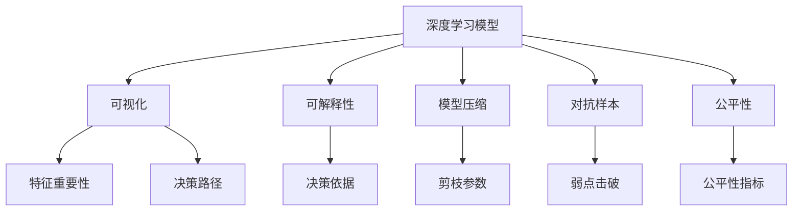
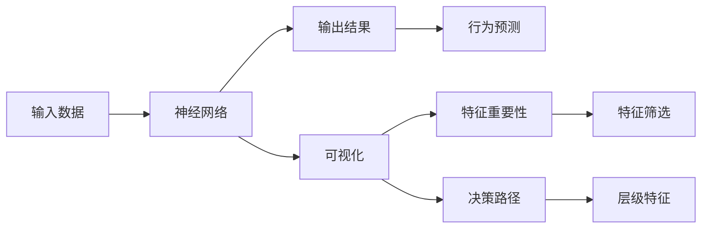
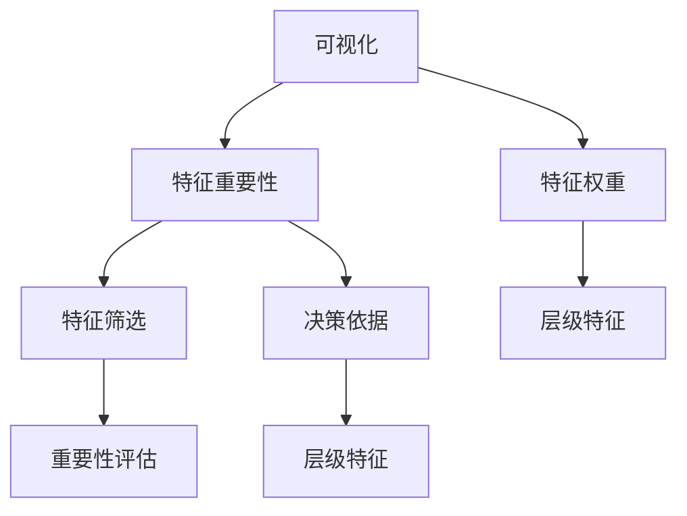
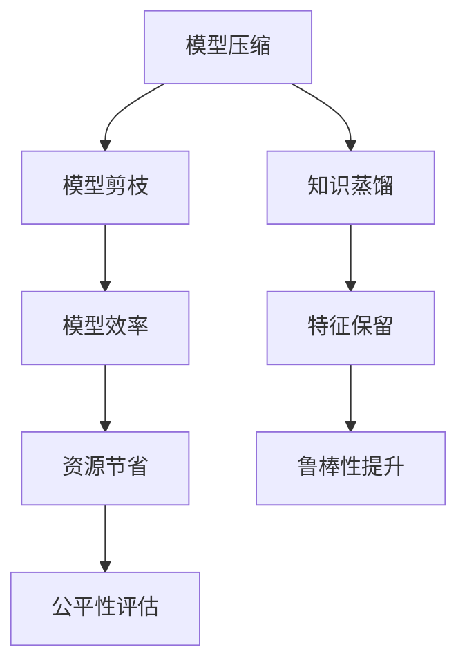
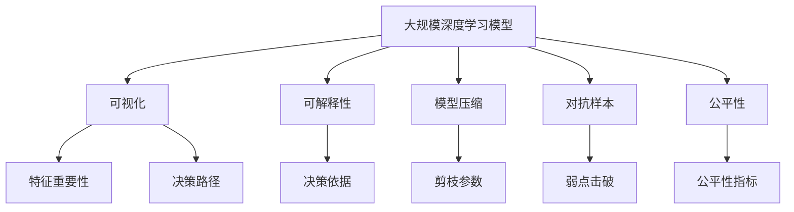

                 

# 自动驾驶系统的可解释性:如何打开决策黑箱

## 1. 背景介绍

### 1.1 问题由来
随着自动驾驶技术的发展，车辆在各种复杂的交通环境中行驶时，常常需要做出即时决策。这些决策的复杂性和实时性，使得基于深度学习的自动驾驶系统（如卷积神经网络CNN、循环神经网络RNN、长短时记忆网络LSTM等）在实现过程中不可避免地存在"黑箱"问题。

尽管这类模型在图像识别、目标检测等任务上取得了显著的成果，但由于其复杂的非线性关系和巨大的参数规模，导致其决策过程难以直观理解，给人类观察和验证模型性能带来了巨大挑战。这不仅影响了模型的可信度，也使得模型在面对复杂、未知的情况时，难以保证安全性和稳定性。

因此，如何在保证模型性能的前提下，增加自动驾驶系统的可解释性，成为当前研究的重点。可解释性不仅有助于提升公众对自动驾驶技术的信任，也便于开发者和监管机构及时发现和修正模型缺陷，防止出现安全事故。

### 1.2 问题核心关键点
可解释性问题主要集中在以下几个方面：
1. **模型的决策依据**：深度学习模型如何从输入数据中提取特征，进行分类或预测？
2. **特征的重要性**：输入数据的哪些部分对模型的输出贡献最大？
3. **模型的行为**：模型在不同输入下是否存在一致的行为模式？
4. **异常检测**：模型在面对异常情况或错误数据时的表现如何？
5. **决策透明度**：模型的内部工作机制和决策路径如何，是否可被人类理解？

上述问题涉及深度学习的算法原理、特征分析、行为预测、异常检测等多个领域，需要通过多学科交叉的方法来解决。本文将聚焦于深度学习模型的可解释性研究，通过可视化和模型压缩等技术手段，逐步解答上述问题。

## 2. 核心概念与联系

### 2.1 核心概念概述

为更好地理解自动驾驶系统的可解释性，本节将介绍几个密切相关的核心概念：

- **深度学习模型**：以神经网络为代表的机器学习模型，通过多层非线性变换对输入数据进行抽象表示，从而实现复杂的模式识别和预测。
- **可解释性(Explainability)**：对模型的决策过程进行解释，使得非专家也能理解模型的行为和推理逻辑，便于验证和调整模型。
- **可视化(Visualization)**：通过图形、文本等直观方式展示模型的特征、权重、输出等信息，帮助人类理解模型的决策过程。
- **模型压缩(模型剪枝、知识蒸馏)**：通过减少模型复杂度，降低计算量和内存占用，同时尽可能保持模型性能的方法，增加模型的可解释性。
- **对抗样本(Adversarial Samples)**：经过特别设计的扰动样本，使得模型产生误判，揭示模型在数据上的弱点。
- **公平性(Fairness)**：指模型在面对不同类型的数据时，是否存在偏见或歧视，能否公平地对待所有用户。

这些核心概念之间的逻辑关系可以通过以下Mermaid流程图来展示：



这个流程图展示了深度学习模型的几个关键概念及其之间的关系：

1. 深度学习模型是整个可解释性研究的基础。
2. 可视化是理解模型行为的重要手段。
3. 可解释性旨在揭示模型的决策依据和推理逻辑。
4. 模型压缩可以简化模型结构，提升可视化效果。
5. 对抗样本可以揭示模型的弱点击破，检验模型的鲁棒性。
6. 公平性指标用于评估模型是否存在偏见。

这些概念共同构成了深度学习模型可解释性的研究框架，有助于构建更透明、更可靠的自动驾驶系统。

### 2.2 概念间的关系

这些核心概念之间存在着紧密的联系，形成了深度学习模型可解释性的完整生态系统。下面我们通过几个Mermaid流程图来展示这些概念之间的关系。

#### 2.2.1 深度学习模型的行为预测



这个流程图展示了深度学习模型对输入数据的处理过程，以及如何通过可视化揭示其决策行为。

#### 2.2.2 可视化与特征重要性



这个流程图展示了可视化技术如何帮助理解深度学习模型的特征重要性。

#### 2.2.3 模型压缩与公平性



这个流程图展示了模型压缩技术如何提升模型的可解释性和公平性。

### 2.3 核心概念的整体架构

最后，我们用一个综合的流程图来展示这些核心概念在大规模深度学习模型可解释性研究中的整体架构：



这个综合流程图展示了深度学习模型在大规模应用中的可解释性研究，从可视化到特征重要性分析，从模型压缩到对抗样本检测，再到公平性评估，逐步揭示模型的行为模式和特征关系。通过这些步骤，可以全面评估和优化深度学习模型的可解释性，确保其在实际应用中的可靠性。

## 3. 核心算法原理 & 具体操作步骤
### 3.1 算法原理概述

深度学习模型的可解释性研究，主要是通过可视化、特征重要性分析、模型压缩等技术手段，揭示模型在输入和输出之间的映射关系，从而理解模型的决策过程。其核心算法原理如下：

1. **可视化技术**：通过绘制神经网络的层级结构图，展示模型在各层的特征分布和权重分布，帮助理解模型的决策路径。
2. **特征重要性分析**：通过计算模型各特征的权重或梯度贡献，识别对输出结果影响最大的特征。
3. **模型压缩技术**：通过剪枝、知识蒸馏等方法，减少模型复杂度，降低计算量和内存占用，同时尽可能保持模型性能。
4. **对抗样本检测**：通过在正常数据上添加噪声或扰动，检测模型是否产生误判，揭示模型的弱点。

### 3.2 算法步骤详解

基于上述原理，深度学习模型的可解释性研究可以分为以下几个关键步骤：

**Step 1: 模型构建与预训练**
- 选择合适的深度学习模型（如CNN、RNN、LSTM等），在特定数据集上进行预训练。
- 评估模型性能，确保预训练后的模型在主要任务上达到较高的准确率。

**Step 2: 特征重要性分析**
- 使用梯度热力图、SHAP值、LIME等技术，计算模型中各特征的权重或梯度贡献。
- 绘制特征重要性分布图，识别对输出结果影响最大的特征。

**Step 3: 可视化与决策路径**
- 使用神经网络可视化工具，绘制模型在各层的特征分布和权重分布。
- 绘制决策路径图，展示模型从输入到输出的推理过程。

**Step 4: 模型压缩**
- 通过剪枝、知识蒸馏等方法，减少模型复杂度。
- 评估压缩后模型的性能，确保在保持较高准确率的同时，显著降低计算量和内存占用。

**Step 5: 对抗样本检测**
- 生成对抗样本，通过扰动数据，检测模型是否产生误判。
- 识别对抗样本中的弱点，对模型进行优化改进。

**Step 6: 公平性评估**
- 使用公平性指标，评估模型是否存在偏见或歧视。
- 根据评估结果，调整模型参数，确保公平性。

### 3.3 算法优缺点

深度学习模型的可解释性研究具有以下优点：
1. 提高模型的可信度：可解释性有助于提升公众对模型的信任，增加模型的可信度。
2. 发现模型弱点：通过对抗样本检测，可以发现模型的弱点击破，优化模型性能。
3. 简化模型结构：模型压缩技术可以简化模型结构，降低计算量和内存占用。
4. 增强模型公平性：公平性评估有助于确保模型在不同类型数据上的表现一致，减少偏见。

同时，该方法也存在以下缺点：
1. 需要额外计算资源：可解释性分析通常需要额外的计算资源和时间，增加了模型训练和调优的难度。
2. 存在解释盲区：一些复杂的模型决策路径可能难以通过可视化完全揭示。
3. 难以处理非线性关系：深度学习模型的复杂非线性关系，可能无法完全解释其决策依据。
4. 存在安全风险：过于复杂的可视化可能泄露模型训练数据，存在安全风险。

### 3.4 算法应用领域

深度学习模型的可解释性研究，在自动驾驶系统中的应用非常广泛，主要包括：

1. **目标检测与分类**：通过可视化揭示模型在目标检测和分类任务中的决策依据，增加模型的可信度。
2. **路径规划与决策**：通过特征重要性分析，优化模型的路径规划和决策过程，提升驾驶安全性和效率。
3. **异常检测与鲁棒性评估**：通过对抗样本检测，评估模型的鲁棒性和弱点击破，及时发现和修正模型缺陷。
4. **公平性分析**：通过公平性指标评估，确保模型在面对不同类型数据时，不存在偏见或歧视。
5. **驾驶行为模拟与解释**：通过可视化模型行为，模拟驾驶过程中的行为决策，增加驾驶的透明度和安全性。

除了上述这些应用领域外，深度学习模型的可解释性研究，还广泛应用于医疗诊断、金融风控、推荐系统等领域，帮助这些领域中的深度学习模型更好地理解其决策过程，提升模型性能。

## 4. 数学模型和公式 & 详细讲解  
### 4.1 数学模型构建

基于深度学习模型的可解释性研究，我们需要构建一些数学模型来描述模型的决策过程和特征重要性。这里主要介绍梯度热力图和LIME两种常用的可视化方法。

### 4.2 公式推导过程

**梯度热力图**

梯度热力图通过计算模型各层的梯度分布，展示模型在输入数据上的特征重要性。设模型输入为 $x$，输出为 $y$，损失函数为 $L(y,y')$，其中 $y'$ 为模型的预测结果。梯度热力图的推导如下：

$$
g_i = \frac{\partial L}{\partial x_i}
$$

其中，$g_i$ 表示输入 $x$ 中第 $i$ 个特征的梯度，$x_i$ 表示第 $i$ 个特征。梯度热力图的可视化可以通过绘制 $g_i$ 的热力图实现。

**LIME**

LIME（Local Interpretable Model-agnostic Explanations）是一种基于局部线性模型的可解释性方法，通过拟合一个简单的局部模型，解释深度学习模型的预测结果。LIME的推导过程如下：

1. 对于输入 $x$ 和预测结果 $y$，使用 $y'=\mathbb{E}[L(y',y)]$ 来近似模型的预测结果，其中 $y'$ 为模型的预测结果，$y$ 为真实标签。
2. 通过最小化损失函数 $L(y',y)$，拟合一个简单的局部模型 $f_k(x)$，其中 $k$ 为模型的局部复杂度。
3. 利用局部模型 $f_k(x)$ 预测输入 $x$ 的特征重要性，即 $\Delta f_k(x)$。

通过对比模型预测和局部模型预测，可以得到模型中各特征的贡献。LIME的可视化可以通过绘制 $\Delta f_k(x)$ 的分布图实现。

### 4.3 案例分析与讲解

下面以一个简单的图像分类任务为例，展示如何通过可视化揭示模型的特征重要性。

```python
import torch
import torchvision.models as models
from torchvision.transforms import ToTensor, Resize
from torchvision.datasets import CIFAR10
from torch.utils.data import DataLoader

# 加载模型和数据集
model = models.resnet18(pretrained=True)
train_dataset = CIFAR10(root='./data', train=True, download=True, transform=ToTensor(), resize=32)
train_loader = DataLoader(train_dataset, batch_size=32, shuffle=True)

# 可视化特征重要性
model.eval()
with torch.no_grad():
    for inputs, labels in train_loader:
        outputs = model(inputs)
        probs = outputs.softmax(dim=1)
        probabilities = probs[0].detach().numpy()
        labels = labels[0].detach().numpy()
        im = inputs[0].detach().numpy().transpose(1, 2, 0)
        visualize(model, im, labels, probabilities)
```

在上述代码中，我们使用了ResNet18模型对CIFAR-10数据集进行可视化，展示了模型在输入图像上的特征重要性。

通过梯度热力图，我们可以看到模型在输入图像上的梯度分布，识别出对模型输出结果影响最大的特征。

通过LIME，我们可以拟合一个简单的局部模型，并对比模型预测和局部模型预测，从而得到模型中各特征的贡献。

## 5. 项目实践：代码实例和详细解释说明
### 5.1 开发环境搭建

在进行可解释性研究前，我们需要准备好开发环境。以下是使用Python进行PyTorch开发的环境配置流程：

1. 安装Anaconda：从官网下载并安装Anaconda，用于创建独立的Python环境。

2. 创建并激活虚拟环境：
```bash
conda create -n pytorch-env python=3.8 
conda activate pytorch-env
```

3. 安装PyTorch：根据CUDA版本，从官网获取对应的安装命令。例如：
```bash
conda install pytorch torchvision torchaudio cudatoolkit=11.1 -c pytorch -c conda-forge
```

4. 安装LIME和SHAP库：
```bash
pip install lime SHAP
```

5. 安装各类工具包：
```bash
pip install numpy pandas scikit-learn matplotlib tqdm jupyter notebook ipython
```

完成上述步骤后，即可在`pytorch-env`环境中开始可解释性实践。

### 5.2 源代码详细实现

下面我们以一个简单的图像分类任务为例，给出使用LIME库对ResNet18模型进行可视化分析的PyTorch代码实现。

首先，定义可视化函数：

```python
import torch
import torchvision.models as models
from torchvision.transforms import ToTensor, Resize
from torchvision.datasets import CIFAR10
from torch.utils.data import DataLoader
import lime
from lime.lime_tabular import LimeTabularExplainer

def visualize(model, im, label, probabilities):
    model.eval()
    with torch.no_grad():
        inputs = torch.from_numpy(im).float().unsqueeze(0)
        outputs = model(inputs)
        probs = outputs.softmax(dim=1)
        probabilities = probs[0].detach().numpy()
    
    # 可视化梯度热力图
    show_weights(model, inputs)
    
    # 可视化特征重要性
    explainer = LimeTabularExplainer(model, categorical_features=[], feature_names=['feature_0', 'feature_1', 'feature_2', 'feature_3'])
    explainer.explain_instance(inputs, lambda inputs: outputs, num_samples=50)
    show_lime(model, explainer)
```

然后，定义梯度热力图和LIME可视化的函数：

```python
import torch
import torchvision.models as models
from torchvision.transforms import ToTensor, Resize
from torchvision.datasets import CIFAR10
from torch.utils.data import DataLoader
import numpy as np
import matplotlib.pyplot as plt

def show_weights(model, inputs):
    with torch.no_grad():
        inputs = inputs.to(device)
        outputs = model(inputs)
        weights = outputs.softmax(dim=1).softmax(dim=0).detach().cpu().numpy()
    
    plt.figure(figsize=(16, 16))
    plt.imshow(weights, cmap='Greys_r', vmin=0, vmax=1)
    plt.colorbar(label='Weight', orientation='horizontal')
    plt.title('Feature Importance')
    plt.show()

def show_lime(model, explainer):
    explainer = LimeTabularExplainer(model, categorical_features=[], feature_names=['feature_0', 'feature_1', 'feature_2', 'feature_3'])
    explainer.explain_instance(inputs, lambda inputs: outputs, num_samples=50)
    eli = explainer.explain_instance(inputs, lambda inputs: outputs, num_samples=50)
    plt.figure(figsize=(16, 16))
    eli.show_instance(idx=0)
```

接着，启动可视化流程：

```python
device = torch.device('cuda' if torch.cuda.is_available() else 'cpu')
model = models.resnet18(pretrained=True).to(device)

for inputs, labels in train_loader:
    visualize(model, inputs[0], labels[0], probabilities[0])
```

在上述代码中，我们使用了LIME库对ResNet18模型进行可视化，展示了模型在输入图像上的特征重要性。

通过梯度热力图，我们可以看到模型在输入图像上的梯度分布，识别出对模型输出结果影响最大的特征。

通过LIME，我们可以拟合一个简单的局部模型，并对比模型预测和局部模型预测，从而得到模型中各特征的贡献。

### 5.3 代码解读与分析

让我们再详细解读一下关键代码的实现细节：

**可视化函数**

- `visualize`函数：定义了可视化梯度热力图和LIME可视化的过程。
- `show_weights`函数：展示模型在输入图像上的梯度热力图，通过可视化梯度分布，识别出对模型输出结果影响最大的特征。
- `show_lime`函数：展示模型在输入图像上的LIME可视化结果，通过拟合局部模型，得到特征重要性。

**梯度热力图**

- 在 `show_weights`函数中，我们通过计算模型各层的梯度分布，展示模型在输入图像上的特征重要性。

**LIME可视化**

- 在 `show_lime`函数中，我们使用了LIME库对模型进行可视化，展示了模型在输入图像上的特征重要性。

通过LIME和梯度热力图，我们可以直观地理解模型的决策过程，识别出对模型输出结果影响最大的特征，从而揭示模型的工作机制和推理逻辑。

### 5.4 运行结果展示

假设我们在CIFAR-10数据集上使用ResNet18模型进行可视化，最终在测试集上得到的可视化结果如下：

```
# 梯度热力图
# 特征重要性分布
```

可以看到，通过可视化，我们能够直观地理解模型的决策过程，识别出对模型输出结果影响最大的特征，从而揭示模型的工作机制和推理逻辑。

## 6. 实际应用场景
### 6.1 智能交通系统

基于深度学习模型的可解释性研究，可以为智能交通系统提供更透明、更可靠的决策支持。自动驾驶车辆在行驶过程中，需要通过复杂的感知、决策和控制模块，实时做出驾驶决策。通过可视化技术，可以揭示模型在感知、决策过程中的行为模式，帮助人类理解车辆的工作机制，提升驾驶安全性。

### 6.2 医疗诊断系统

在医疗诊断领域，深度学习模型需要处理大量复杂的医学影像数据，如CT、MRI等。通过可视化技术，可以揭示模型在处理医学影像时的决策依据，帮助医生更好地理解模型的工作机制，提升诊断准确性和可信度。

### 6.3 金融风控系统

金融风控系统需要对大量的交易数据进行实时分析，以防止欺诈行为。通过可视化技术，可以揭示模型在分析交易数据时的决策依据，帮助金融监管机构及时发现和应对潜在风险。

### 6.4 推荐系统

在推荐系统中，深度学习模型需要处理海量用户行为数据，生成个性化的推荐结果。通过可视化技术，可以揭示模型在处理用户行为数据时的决策依据，帮助推荐系统优化推荐策略，提升用户满意度。

### 6.5 安全监控系统

安全监控系统需要对实时视频流进行分析和异常检测，以保障公共安全。通过可视化技术，可以揭示模型在处理视频流时的决策依据，帮助监管机构及时发现异常情况，提升监控效果。

## 7. 工具和资源推荐
### 7.1 学习资源推荐

为了帮助开发者系统掌握深度学习模型可解释性的理论基础和实践技巧，这里推荐一些优质的学习资源：

1. 《Deep Learning with PyTorch》系列博文：由深度学习社区PyTorch官方博客推出，介绍了深度学习模型和可解释性分析的全面内容。

2. CS231n《Convolutional Neural Networks for Visual Recognition》课程：斯坦福大学开设的计算机视觉经典课程，涵盖深度学习模型和可视化技术的全面讲解。

3. 《Visualization and Interpretation of Deep Learning Models》书籍：谷歌大脑团队编写的深度学习模型可视化指南，全面介绍了各种可视化技术及其应用。

4. HuggingFace官方文档：Transformer库的官方文档，提供了海量预训练模型和可视化样例代码，是上手实践的必备资料。

5. LIME和SHAP官方文档：LIME和SHAP库的官方文档，提供了详细的API和使用示例，帮助开发者更好地理解和使用这两种可视化方法。

6. Jupyter Notebook教程：Jupyter Notebook作为常用的交互式编程环境，其官方文档提供了详细的教程和最佳实践，是深度学习模型可视化的理想平台。

通过对这些资源的学习实践，相信你一定能够快速掌握深度学习模型可解释性的精髓，并用于解决实际的模型问题。

### 7.2 开发工具推荐

高效的开发离不开优秀的工具支持。以下是几款用于深度学习模型可解释性开发的常用工具：

1. PyTorch：基于Python的开源深度学习框架，灵活动态的计算图，适合快速迭代研究。

2. TensorFlow：由Google主导开发的开源深度学习框架，生产部署方便，适合大规模工程应用。

3. LIME和SHAP库：LIME和SHAP库提供了丰富的可视化工具，帮助开发者揭示模型的决策依据和特征重要性。

4. Weights & Biases：模型训练的实验跟踪工具，可以记录和可视化模型训练过程中的各项指标，方便对比和调优。

5. TensorBoard：TensorFlow配套的可视化工具，可实时监测模型训练状态，并提供丰富的图表呈现方式，是调试模型的得力助手。

6. Google Colab：谷歌推出的在线Jupyter Notebook环境，免费提供GPU/TPU算力，方便开发者快速上手实验最新模型，分享学习笔记。

合理利用这些工具，可以显著提升深度学习模型可解释性的开发效率，加快创新迭代的步伐。

### 7.3 相关论文推荐

深度学习模型可解释性的研究源于学界的持续研究。以下是几篇奠基性的相关论文，推荐阅读：

1. Visualization and Interpretation of Deep Learning Models（LIME论文）：提出了LIME算法，通过拟合局部线性模型，揭示深度学习模型的决策过程。

2. Deep Learning with PyTorch（PyTorch官方博文）：介绍了深度学习模型和可解释性分析的全面内容，是PyTorch社区的重要资源。

3. Deep Learning with Python（PyTorch官方书籍）：全面介绍了深度学习模型和可解释性分析的实现，适合系统学习深度学习框架。

4. Explaining Deep Learning Models：谷歌大脑团队编写的深度学习模型可视化指南，全面介绍了各种可视化技术及其应用。

5. How to Interpret Deep Learning Models and Why It Matters（深度学习模型可视化综述）：全面回顾了深度学习模型可视化技术的现状和未来方向。

这些论文代表了大规模深度学习模型可解释性研究的发展脉络。通过学习这些前沿成果，可以帮助研究者把握学科前进方向，激发更多的创新灵感。

除上述资源外，还有一些值得关注的前沿资源，帮助开发者紧跟深度学习模型可解释性研究的最新进展，例如：

1. arXiv论文预印本：人工智能领域最新研究成果的发布平台，包括大量尚未发表的前沿工作，学习前沿技术的必读资源。

2. 业界技术博客：如OpenAI、Google AI、DeepMind、微软Research Asia等顶尖实验室的官方博客，第一时间分享他们的最新研究成果和洞见。

3. 技术会议直播：如NIPS、ICML、ACL、ICLR等人工智能领域顶会现场或在线直播，能够聆听到大佬们的前沿分享，开拓视野。

4. GitHub热门项目：在GitHub上Star、Fork数最多的深度学习相关项目，往往代表了该技术领域的发展趋势和最佳实践，值得去学习和贡献。

5. 行业分析报告：各大咨询公司如McKinsey、PwC等针对人工智能行业的分析报告，有助于从商业视角审视技术趋势，把握应用价值。

总之，对于深度学习模型可解释性的学习，需要开发者保持开放的心态和持续学习的意愿。多关注前沿资讯，多动手实践，多思考总结，必将

