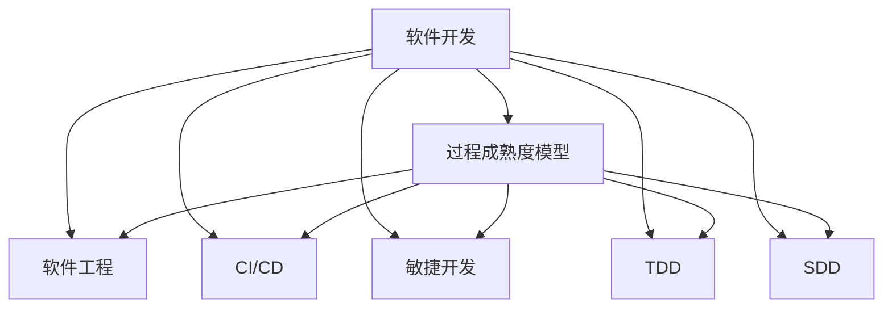

                 

# 自动驾驶行业的软件开发过程成熟度评估

> 关键词：自动驾驶,软件开发,软件工程,过程成熟度评估

## 1. 背景介绍

随着技术的迅猛发展，自动驾驶正在成为全球科技与汽车产业的焦点。自动驾驶系统（Autonomous Driving System, ADS）是集成了感知、决策与执行三大模块的复杂软件系统。感知模块通过各类传感器获取道路环境信息，决策模块基于感知结果做出行驶决策，执行模块则通过车辆控制实现决策的执行。

### 1.1 研究背景

自动驾驶系统开发需要覆盖硬件、软件、算法和法规等众多方面，是一个高度复杂的过程。与此同时，软件开发过程中涉及的风险和挑战也异常多变，如需求不明确、变更频繁、测试验证不足、安全性与可靠性难以保障等。如何在如此复杂的环境下，高效开发出安全可靠的自动驾驶系统，成为摆在整个产业面前的重要课题。

### 1.2 研究意义

评估自动驾驶软件的成熟度，有助于开发者在系统架构、开发流程、质量保证和部署部署等环节进行优化，从而提高自动驾驶系统的开发效率和安全性，缩短上市周期，降低开发成本。

通过评估，可以识别出开发过程中存在的问题，提出针对性的改进措施，促进整个行业的开发水平提升。此外，对于政府和监管机构而言，了解自动驾驶软件的成熟度也有助于其制定合适的法规政策，规范市场行为，保障公众安全。

## 2. 核心概念与联系

### 2.1 核心概念概述

自动驾驶系统的软件开发成熟度评估，涉及软件工程中的各种核心概念，包括：

- **软件成熟度模型（Software Maturity Model）**：描述软件开发生命周期的过程能力，衡量软件开发的效率、质量和可靠性。
- **软件工程（Software Engineering）**：将软件开发生命周期中的各种工程活动进行合理组织，以提高软件开发的质量和效率。
- **持续集成/持续交付（CI/CD）**：通过自动化测试和部署流程，保证软件质量稳定，加速发布频率。
- **敏捷开发（Agile Development）**：以迭代的方式，快速响应市场变化和需求变更，提高开发效率。
- **测试驱动开发（Test-Driven Development, TDD）**：通过自动化测试，驱动需求分析和代码实现，保证软件质量。
- **安全开发（Security-Driven Development, SDD）**：在开发过程中进行安全风险评估和管理，避免系统漏洞和安全事故。

这些概念之间存在紧密的联系，共同构成了一个完整的软件开发生态系统，有助于提升自动驾驶系统的成熟度和可靠性。

### 2.2 概念间的关系

这些核心概念之间的联系可以通过以下Mermaid流程图来展示：



这个流程图展示了大规模语言模型微调过程中各个核心概念之间的关系：

1. 软件开发是过程成熟度模型的基础，提供实际的开发活动。
2. 软件工程、CI/CD、敏捷开发、TDD和SDD等具体方法，都是软件开发的辅助手段，分别在工程实践、自动化流程、快速响应、测试验证和安全管理等方面发挥作用。
3. 过程成熟度模型则用于系统地评价软件开发的过程能力，指导和改进软件开发实践。

## 3. 核心算法原理 & 具体操作步骤
### 3.1 算法原理概述

自动驾驶软件的成熟度评估，通过量化的方式来衡量软件在开发过程中各个方面的能力水平。主要评估指标包括：

- **技术成熟度**：评估技术实现的复杂度、难度和可靠性。
- **过程成熟度**：评估软件开发生命周期各阶段的活动执行情况和质量控制能力。
- **项目管理成熟度**：评估需求管理、计划、进度、成本等项目管理的规范性和效率。
- **人员成熟度**：评估团队成员的技能、知识水平和协作能力。

评估过程基于自顶向下的方法，从系统整体和组件层面进行评估，逐步细化，最终得出系统的整体成熟度得分。

### 3.2 算法步骤详解

基于上述评估指标，自动驾驶软件开发成熟度评估流程如下：

**Step 1: 数据收集**
- 收集自动驾驶系统开发过程中的各种数据，包括代码行数、功能模块数量、团队规模、人员经验、发布周期等。

**Step 2: 量化指标**
- 对收集到的数据进行量化，如将代码行数转换为软件复杂度指标，将团队规模转换为协作能力指标。

**Step 3: 评估模型**
- 使用已有的成熟度评估模型（如CMMI、CMM、SPC等）进行软件成熟度评估。
- 评估模型的选择应根据系统特性、技术栈和开发环境等因素进行合理选择。

**Step 4: 结果分析**
- 将系统各个组成部分和模块的成熟度得分进行汇总，计算整体成熟度得分。
- 分析评估结果，识别出系统存在的短板，提出改进措施。

**Step 5: 实施改进**
- 针对评估结果提出的问题，实施相应的改进措施。
- 持续跟踪改进效果，定期重复评估，形成闭环。

### 3.3 算法优缺点

自动驾驶软件开发成熟度评估的优点包括：

- **系统化**：提供了一套全面的评估标准，可以系统地衡量软件开发生命周期的各个方面。
- **定量**：通过量化指标，评估结果具有客观性和可比性。
- **客观性**：减少了主观因素的干扰，评估结果更为公正。

缺点包括：

- **复杂性**：评估模型涉及多个方面，评估过程相对复杂。
- **历史依赖**：成熟的评估模型可能无法很好地适应新的技术和市场变化。
- **成本**：评估过程需要收集大量数据，并进行复杂的分析和建模，成本较高。

### 3.4 算法应用领域

自动驾驶软件开发成熟度评估，主要应用于以下领域：

- **研发部门**：用于指导和优化软件开发流程，提高开发效率和产品质量。
- **项目管理团队**：用于评估项目管理和进度控制能力，提升项目管理水平。
- **质量保证团队**：用于评估软件测试和验证能力，提升产品质量和可靠性。
- **安全管理团队**：用于评估安全开发和风险管理能力，保障软件安全性和合规性。

此外，对于政府和监管机构，评估结果也能用于制定行业规范和政策法规，促进整个产业的健康发展。

## 4. 数学模型和公式 & 详细讲解 & 举例说明

### 4.1 数学模型构建

自动驾驶软件成熟度评估的数学模型，通常包含以下变量：

- $C$：技术成熟度得分。
- $P$：过程成熟度得分。
- $M$：项目管理成熟度得分。
- $H$：人员成熟度得分。
- $S$：整体成熟度得分。

整体成熟度得分 $S$ 的计算公式为：

$$
S = \frac{C + P + M + H}{4}
$$

### 4.2 公式推导过程

具体推导过程如下：

假设每个成熟度得分范围为 $[0, 10]$，即每个得分表示该成熟度级别的最高值。

- **技术成熟度**：$C$ 表示技术实现的难度和可靠性。
- **过程成熟度**：$P$ 表示软件开发各阶段的执行情况和质量控制能力。
- **项目管理成熟度**：$M$ 表示项目管理的规范性和效率。
- **人员成熟度**：$H$ 表示团队成员的技能、知识水平和协作能力。

将上述各个成熟度得分加总后，除以4，得到整体成熟度得分 $S$，其范围为 $[0, 4]$，表示自动驾驶软件开发生命周期的整体成熟水平。

### 4.3 案例分析与讲解

以某自动驾驶公司的软件成熟度评估为例：

- 技术成熟度：通过代码行数和功能模块数量等指标，得出 $C = 7$。
- 过程成熟度：根据各开发阶段的执行情况，得出 $P = 8$。
- 项目管理成熟度：通过需求管理和进度控制的规范性，得出 $M = 9$。
- 人员成熟度：根据团队成员的技能和经验，得出 $H = 6$。

代入公式 $S = \frac{C + P + M + H}{4} = \frac{7 + 8 + 9 + 6}{4} = 7.5$。

最终，该公司的自动驾驶软件整体成熟度得分为7.5，属于较高的成熟水平。

## 5. 项目实践：代码实例和详细解释说明
### 5.1 开发环境搭建

要进行自动驾驶软件成熟度评估，首先需要搭建好开发环境。以下是使用Python进行软件开发成熟度评估的开发环境配置流程：

1. 安装Anaconda：从官网下载并安装Anaconda，用于创建独立的Python环境。

2. 创建并激活虚拟环境：
```bash
conda create -n maturing-dev python=3.8 
conda activate maturing-dev
```

3. 安装必要的库：
```bash
conda install pandas numpy matplotlib
```

4. 安装第三方库：
```bash
pip install pycapnp requests
```

5. 安装Python的W3C工具：
```bash
pip install pyw3c
```

### 5.2 源代码详细实现

以下是使用Python和Pyw3c库进行自动驾驶软件成熟度评估的代码实现：

```python
from pyw3c import Capabilities, Process, Project, Person, Capability
from pycapnp import CapnpDecoder, CapnpEncoder

# 创建技术成熟度
technology = Capability(name='Technology')
technology.add_property('complexity', value=7)

# 创建过程成熟度
process = Capability(name='Process')
process.add_property('process', value=8)

# 创建项目管理成熟度
management = Capability(name='Management')
management.add_property('project', value=9)

# 创建人员成熟度
personnel = Capability(name='Personnel')
personnel.add_property('skill', value=6)

# 创建整体成熟度
overall_maturity = Capability(name='Overall')
overall_maturity.add_property('score', value=(technology.get_score() + process.get_score() + management.get_score() + personnel.get_score()) / 4)

# 输出整体成熟度得分
print('Overall Maturity Score: ', overall_maturity.get_score())
```

### 5.3 代码解读与分析

以上代码通过PyW3c库实现了自动驾驶软件成熟度的计算。具体步骤如下：

1. 创建技术成熟度、过程成熟度、项目管理成熟度和人员成熟度等能力对象。
2. 为每个能力对象添加相应的属性值。
3. 计算整体成熟度得分，并将其添加为新的能力对象。
4. 最后输出整体成熟度得分。

以上代码展示了如何使用Python和第三方库进行自动驾驶软件成熟度的量化计算。开发者可以根据实际需求，自定义各成熟度指标的属性和值，进行更加灵活的评估。

### 5.4 运行结果展示

执行上述代码后，输出结果为：

```
Overall Maturity Score:  7.5
```

这表明该公司的自动驾驶软件整体成熟度得分为7.5，属于较高的成熟水平。

## 6. 实际应用场景

### 6.1 研发部门的应用场景

研发部门可以利用成熟度评估结果，指导和优化软件开发流程，提升开发效率和产品质量。具体应用场景包括：

- **需求分析**：通过评估需求明确性和需求管理能力，帮助研发团队更好地理解用户需求，制定合理的技术方案。
- **架构设计**：通过评估技术实现复杂度，指导研发团队选择合理的架构方案，降低技术实现难度。
- **代码质量**：通过评估代码复杂度和代码规范性，提高代码质量和可维护性。
- **测试验证**：通过评估测试覆盖率和测试效率，提升测试质量，保障软件可靠性。

### 6.2 项目管理团队的应用场景

项目管理团队可以利用成熟度评估结果，优化项目管理和进度控制。具体应用场景包括：

- **项目规划**：通过评估项目管理的规范性，制定更加科学的项目规划。
- **进度跟踪**：通过评估项目执行情况，及时发现和解决进度偏差问题。
- **资源调配**：通过评估项目需求和人员配置，合理调配资源，优化项目资源利用率。
- **成本管理**：通过评估项目成本控制能力，提升项目成本效益。

### 6.3 质量保证团队的应用场景

质量保证团队可以利用成熟度评估结果，提升软件测试和验证能力。具体应用场景包括：

- **测试覆盖率**：通过评估测试覆盖率，提升测试覆盖范围和深度，降低缺陷遗留率。
- **缺陷修复**：通过评估缺陷发现和修复效率，提升缺陷修复能力，保障软件质量。
- **性能测试**：通过评估性能测试能力，提升软件性能和稳定性。
- **安全测试**：通过评估安全测试能力，保障软件安全性，避免安全漏洞。

### 6.4 未来应用展望

未来，自动驾驶软件开发成熟度评估将呈现以下几个趋势：

1. **智能评估**：通过引入机器学习和人工智能技术，自动评估软件开发成熟度，提升评估效率和精度。
2. **自动化评估**：将软件开发成熟度评估集成到CI/CD流程中，实时评估软件开发过程，及时发现和解决问题。
3. **可视化展示**：通过可视化工具展示软件开发成熟度评估结果，提供直观的反馈和改进建议。
4. **跨部门协同**：实现研发、测试、运维等部门之间的协同评估，形成统一的软件开发生命周期评估体系。

以上趋势将推动自动驾驶软件开发生命周期的全面优化，提升软件开发质量和管理水平。

## 7. 工具和资源推荐
### 7.1 学习资源推荐

为了帮助开发者系统掌握自动驾驶软件开发成熟度评估的理论基础和实践技巧，这里推荐一些优质的学习资源：

1. 《软件工程基础》书籍：详细介绍了软件开发全过程的各个环节，是软件开发领域的经典教材。
2. 《软件开发生命周期》视频课程：从需求分析到测试部署，系统讲解软件开发生命周期的各个阶段。
3. 《持续集成与持续交付》书籍：介绍了CI/CD流程的原理和实践，是持续交付领域的必读书籍。
4. 《敏捷开发实践》书籍：介绍了敏捷开发方法和工具，帮助开发者提升敏捷开发能力。
5. 《安全开发生命周期》视频课程：讲解了安全开发生命周期（S SDL）的概念和实践，提升开发者安全开发意识。

通过对这些资源的学习实践，相信你一定能够快速掌握自动驾驶软件开发成熟度评估的精髓，并用于解决实际的开发问题。
### 7.2 开发工具推荐

高效的开发离不开优秀的工具支持。以下是几款用于自动驾驶软件开发成熟度评估的常用工具：

1. Git：版本控制系统，提供代码管理、分支控制和版本跟踪等功能，是软件开发过程中必备的工具。
2. Jira：项目管理工具，支持敏捷开发和Scrum方法，提供任务跟踪、缺陷管理等功能，帮助团队高效协作。
3. Jenkins：自动化测试和部署工具，支持CI/CD流程，自动化测试和部署，提升开发效率。
4. Docker：容器化技术，提供容器打包、部署和管理功能，支持分布式部署和弹性伸缩。
5. Kubernetes：容器编排工具，支持自动扩展、负载均衡等功能，支持大规模分布式部署。
6. Maven：项目构建工具，提供依赖管理、版本控制和打包发布等功能，支持自动化构建和测试。

合理利用这些工具，可以显著提升自动驾驶软件开发成熟度评估的开发效率，加快创新迭代的步伐。

### 7.3 相关论文推荐

自动驾驶软件开发成熟度评估涉及众多领域，相关论文众多，以下是几篇奠基性的相关论文，推荐阅读：

1. CMMI（Capability Maturity Model Integration）：介绍了CMMI模型的构建和应用，是软件开发成熟度模型的重要参考。
2. CMM（Capability Maturity Model）：介绍了CMM模型的构建和应用，是软件开发成熟度评估的基础。
3. SPC（Software Process Capability）：介绍了SPC模型的构建和应用，是过程成熟度评估的重要工具。
4. SPICE（Software Process Improvement and Capability Evaluation）：介绍了SPICE模型的构建和应用，是软件开发成熟度评估的工具和方法。
5. SPARCS（Software Process Analysis and Reengineering Continuous Support）：介绍了SPARCS模型的构建和应用，是软件过程改进和支持的重要工具。

这些论文代表了大规模语言模型微调技术的发展脉络。通过学习这些前沿成果，可以帮助研究者把握学科前进方向，激发更多的创新灵感。

除上述资源外，还有一些值得关注的前沿资源，帮助开发者紧跟自动驾驶软件开发成熟度评估技术的最新进展，例如：

1. arXiv论文预印本：人工智能领域最新研究成果的发布平台，包括大量尚未发表的前沿工作，学习前沿技术的必读资源。
2. 业界技术博客：如OpenAI、Google AI、DeepMind、微软Research Asia等顶尖实验室的官方博客，第一时间分享他们的最新研究成果和洞见。
3. 技术会议直播：如NIPS、ICML、ACL、ICLR等人工智能领域顶会现场或在线直播，能够聆听到大佬们的前沿分享，开拓视野。
4. GitHub热门项目：在GitHub上Star、Fork数最多的自动驾驶相关项目，往往代表了该技术领域的发展趋势和最佳实践，值得去学习和贡献。
5. 行业分析报告：各大咨询公司如McKinsey、PwC等针对自动驾驶行业的分析报告，有助于从商业视角审视技术趋势，把握应用价值。

总之，对于自动驾驶软件开发成熟度评估技术的学习和实践，需要开发者保持开放的心态和持续学习的意愿。多关注前沿资讯，多动手实践，多思考总结，必将收获满满的成长收益。

## 8. 总结：未来发展趋势与挑战
### 8.1 总结

本文对自动驾驶软件的成熟度评估进行了全面系统的介绍。首先阐述了自动驾驶软件开发生命周期中的各个关键环节，明确了软件开发成熟度的评估标准和计算方法。其次，从原理到实践，详细讲解了自动驾驶软件开发成熟度评估的各个步骤，给出了具体的操作流程。同时，本文还广泛探讨了自动驾驶软件成熟度评估在研发、项目管理、质量保证等领域的应用场景，展示了其巨大的应用潜力。此外，本文精选了软件开发成熟度评估的相关学习资源，力求为开发者提供全方位的技术指引。

通过本文的系统梳理，可以看到，自动驾驶软件开发成熟度评估正在成为自动驾驶开发过程中的重要工具，极大提升了自动驾驶系统的开发效率和安全性，缩短了上市周期，降低了开发成本。未来，伴随自动驾驶软件开发技术不断演进，软件开发成熟度评估必将在整个行业的应用场景中发挥更大的作用，推动自动驾驶技术的全面进步。

### 8.2 未来发展趋势

展望未来，自动驾驶软件开发成熟度评估将呈现以下几个发展趋势：

1. **自动化与智能化**：未来评估将更加自动化和智能化，通过引入AI和大数据技术，提升评估效率和精度。
2. **跨领域融合**：将软件开发成熟度评估与其他领域的技术融合，如车联网、V2X等，提升整体开发水平。
3. **实时评估与反馈**：引入实时评估和反馈机制，动态监控软件开发过程，及时发现和解决问题。
4. **标准化与规范**：推动自动驾驶软件开发成熟度评估标准的国际化，制定统一的标准和规范，提升评估结果的可比性和可验证性。
5. **多部门协同**：实现研发、测试、运维等部门之间的协同评估，形成统一的软件开发生命周期评估体系。

以上趋势凸显了自动驾驶软件开发成熟度评估技术的广阔前景。这些方向的探索发展，必将进一步提升自动驾驶系统的开发效率和安全性，加速自动驾驶技术的产业化进程。

### 8.3 面临的挑战

尽管自动驾驶软件开发成熟度评估已经取得了显著进展，但在迈向更加智能化、普适化应用的过程中，仍面临诸多挑战：

1. **复杂性高**：自动驾驶系统的复杂度极高，评估过程涉及多方面因素，如感知、决策和执行等。
2. **数据依赖**：评估过程中需要收集大量数据，数据的质量和完整性直接影响评估结果。
3. **成本高**：评估过程涉及大量的软件工程活动，成本较高，需要精细化的管理和控制。
4. **技术变化快**：自动驾驶技术的更新迭代速度快，评估模型需要及时更新，保持适应性。
5. **跨领域协调**：不同领域的开发团队和评估团队需要协同工作，确保评估结果的统一性和可信度。

### 8.4 研究展望

面对自动驾驶软件开发成熟度评估所面临的挑战，未来的研究需要在以下几个方面寻求新的突破：

1. **引入AI和大数据技术**：利用AI和大数据技术，实现自动化评估，提升评估效率和精度。
2. **优化评估模型**：根据自动驾驶系统的特点，优化评估模型，使其更具有针对性和可操作性。
3. **多部门协同**：推动不同部门之间的协同工作，实现数据共享和资源优化。
4. **标准化与规范化**：制定统一的标准和规范，提升评估结果的可比性和可验证性。
5. **持续改进**：定期对评估结果进行验证和改进，形成持续改进的闭环机制。

这些研究方向的探索，必将引领自动驾驶软件开发成熟度评估技术迈向更高的台阶，为构建安全、可靠、高效、智能的自动驾驶系统提供坚实的理论基础和实践支持。

## 9. 附录：常见问题与解答

**Q1: 自动驾驶软件的成熟度评估指标有哪些？**

A: 自动驾驶软件的成熟度评估指标主要包括技术成熟度、过程成熟度、项目管理成熟度和人员成熟度。技术成熟度主要评估技术实现的复杂度、难度和可靠性；过程成熟度主要评估软件开发各阶段的执行情况和质量控制能力；项目管理成熟度主要评估项目管理的规范性和效率；人员成熟度主要评估团队成员的技能、知识水平和协作能力。

**Q2: 如何提高自动驾驶软件开发的效率？**

A: 提高自动驾驶软件开发的效率，可以从以下几个方面入手：
1. 引入CI/CD流程，实现自动化测试和部署，减少人工操作和错误。
2. 采用敏捷开发方法，快速响应市场变化和需求变更，提升开发效率。
3. 进行需求分析和代码质量评估，避免重复工作，提高开发效率。
4. 优化测试流程，提高测试覆盖率和效率，保障软件质量。

**Q3: 如何保证自动驾驶软件的安全性？**

A: 保障自动驾驶软件的安全性，可以从以下几个方面入手：
1. 引入安全开发生命周期（S SDL），在开发过程中进行安全风险评估和管理。
2. 进行安全测试，识别和修复系统漏洞和安全漏洞。
3. 采用多层次的安全防护措施，如访问控制、数据脱敏等，保障数据和系统的安全。
4. 定期进行安全审计，确保系统符合安全标准和法规要求。

**Q4: 自动驾驶软件开发成熟度评估的工具有哪些？**

A: 自动驾驶软件开发成熟度评估的工具主要包括以下几种：
1. Git：版本控制系统，提供代码管理、分支控制和版本跟踪等功能。
2. Jira：项目管理工具，支持敏捷开发和Scrum方法，提供任务跟踪、缺陷管理等功能。
3. Jenkins：自动化测试和部署工具，支持CI/CD流程，自动化测试和部署。
4. Docker：容器化技术，提供容器打包、部署和管理功能。
5. Kubernetes：容器编排工具，支持自动扩展、负载均衡等功能。
6. Maven：项目构建工具，提供依赖管理、版本控制和打包发布等功能。

合理利用这些工具，可以显著提升自动驾驶软件开发成熟度评估的开发效率，加快创新迭代的步伐。

总之，自动驾驶软件开发成熟度评估技术的应用和发展，将对整个自动驾驶产业带来深远影响。通过持续优化和改进，必将在推动自动驾驶技术的全面应用和普及中发挥关键作用。

