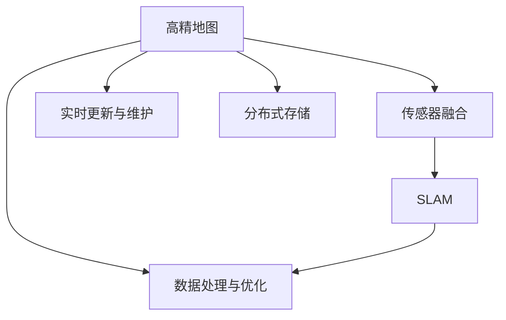
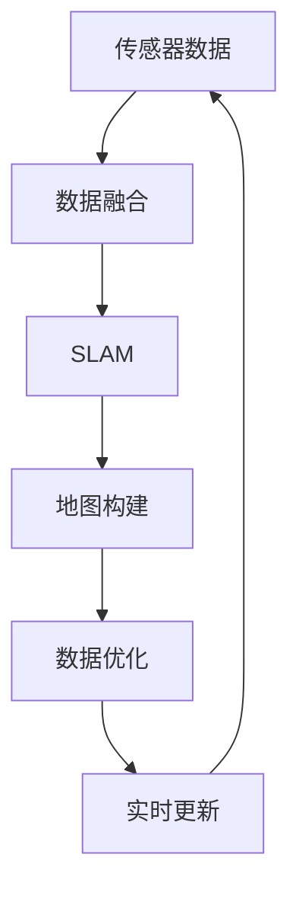
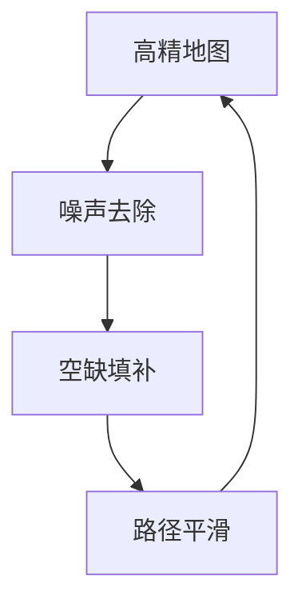
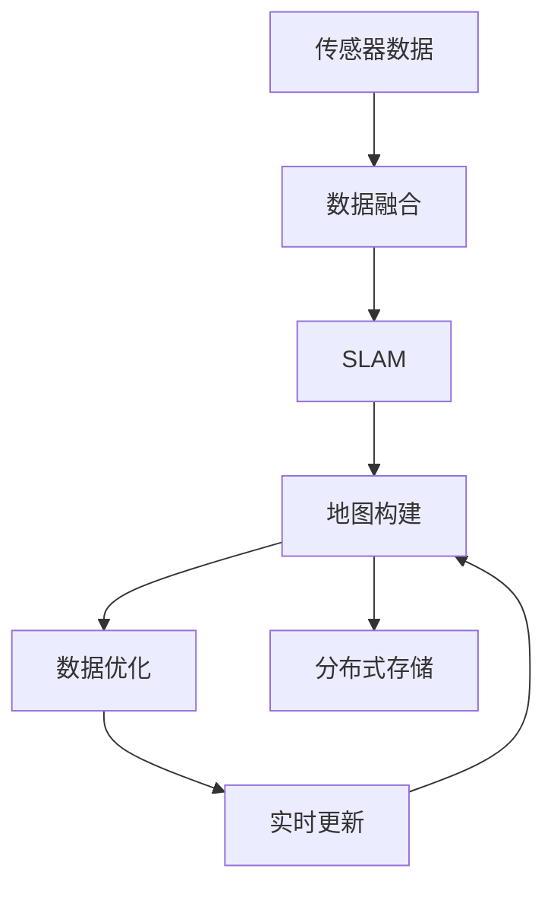

                 

# 自动驾驶高精地图构建与应用的研究现状与挑战

## 1. 背景介绍

### 1.1 问题由来

自动驾驶技术的高精地图（High Precision Map，HPM）是其核心组件之一，对于实现车辆自主导航与决策至关重要。高精地图是车辆在运行过程中所需的空间与时间信息的精确表达，包括道路边界、交通设施、信号灯、障碍物以及精确的地理位置和三维姿态信息等。这些信息的精确性、实时性、完整性直接影响自动驾驶系统的安全与效率。

近年来，随着自动驾驶技术的发展，高精地图的构建与应用逐渐受到广泛关注。传统的道路测量方法如激光雷达、卫星定位、摄像头等，已经不再适应高精地图快速、精确构建的需求。随着深度学习、计算机视觉、机器学习等技术的快速发展，利用各类传感器数据构建高精地图的流程正在不断优化与提升。本文将围绕高精地图的构建与应用，对现状与挑战进行全面剖析。

### 1.2 问题核心关键点

高精地图的构建与应用主要涉及以下几个关键问题：

- **高精地图数据采集**：如何高效地采集高精地图数据，保持数据的时效性，并确保数据的质量。
- **地图数据处理与优化**：如何对采集到的数据进行处理与优化，提高地图的精度与可靠性。
- **地图实时更新与维护**：如何实时地更新地图数据，应对道路变化的实时性需求。
- **地图数据存储与分发**：如何高效存储与分发地图数据，保证数据的可用性与稳定性。

解决上述问题，将大幅提升高精地图的构建效率与数据质量，为自动驾驶系统的安全运行提供强有力的保障。

### 1.3 问题研究意义

高精地图的构建与应用，对于自动驾驶技术的成功落地具有重要意义：

- **安全保障**：高精地图提供了车辆运行所需的所有精确信息，有助于降低交通事故风险，提升驾驶安全性。
- **导航辅助**：高精地图辅助自动驾驶车辆进行路径规划与导航，确保车辆运行路线合理、安全。
- **精度提升**：高精地图能够提供精确的地理位置信息与三维姿态数据，提升自动驾驶系统的导航精度。
- **成本降低**：通过高精地图的应用，可以优化路线规划与路径选择，降低燃料消耗与行驶成本。

因此，高精地图的构建与应用，是实现自动驾驶的关键步骤，对于推动自动驾驶技术的产业化进程具有重要价值。

## 2. 核心概念与联系

### 2.1 核心概念概述

为更好地理解高精地图构建与应用的关键技术，本节将介绍几个紧密相关的核心概念：

- **高精地图**：自动驾驶车辆所需的详细地图，包含精确的地理位置、道路边界、交通设施、障碍物等，是实现车辆自主导航的基础。
- **传感器融合**：将来自不同传感器的数据进行融合，获得高精度的车辆定位信息。
- **SLAM**：同步定位与地图构建（Simultaneous Localization and Mapping）技术，通过实时数据采集与处理，构建并更新地图数据。
- **数据处理与优化**：对采集到的地图数据进行处理，如去除噪声、填补空缺、平滑路径等，提高地图的精度与可用性。
- **实时更新与维护**：高精地图需要实时更新，以应对道路变化，确保数据的最新性与可靠性。
- **分布式存储**：通过分布式存储技术，提高地图数据的存储与访问效率，确保大规模数据的管理与分发。

这些核心概念之间的逻辑关系可以通过以下Mermaid流程图来展示：



这个流程图展示了大精地图构建与应用的核心流程：

1. 高精地图的构建依赖于传感器融合和SLAM技术，通过实时数据采集与处理，构建初始地图。
2. 初始地图需要通过数据处理与优化，去除噪声、填补空缺，提高精度。
3. 高精地图需要实时更新，以应对道路变化，确保数据的最新性。
4. 高精地图数据通过分布式存储技术，确保数据的可用性与稳定性。

### 2.2 概念间的关系

这些核心概念之间存在着紧密的联系，形成了高精地图构建与应用的完整生态系统。下面我们通过几个Mermaid流程图来展示这些概念之间的关系。

#### 2.2.1 高精地图的构建过程



这个流程图展示了高精地图构建的核心流程：通过传感器数据融合获得高精定位信息，利用SLAM技术构建初始地图，经过数据处理与优化，最终实现实时更新与维护。

#### 2.2.2 传感器融合与SLAM的关系


这个流程图展示了传感器数据融合与SLAM技术的关系。传感器数据融合是SLAM的基础，通过融合数据，SLAM才能实现准确的地图构建。

#### 2.2.3 数据处理与优化方法



这个流程图展示了数据处理与优化方法的核心步骤：通过噪声去除、空缺填补、路径平滑等技术，提高地图的精度与可用性。

### 2.3 核心概念的整体架构

最后，我们用一个综合的流程图来展示这些核心概念在高精地图构建与应用过程中的整体架构：



这个综合流程图展示了从传感器数据采集到高精地图构建与应用的全过程。传感器数据通过融合获得高精定位信息，利用SLAM技术构建初始地图，经过数据处理与优化，最终实现实时更新与维护，并通过分布式存储技术确保数据的可用性与稳定性。通过这些流程图，我们可以更清晰地理解高精地图构建与应用过程中各个核心概念的关系和作用，为后续深入讨论具体的技术细节奠定基础。

## 3. 核心算法原理 & 具体操作步骤

### 3.1 算法原理概述

高精地图的构建与应用，本质上是一个空间信息的精确表达与处理过程。高精地图的构建依赖于传感器数据融合、SLAM技术、数据处理与优化等关键技术，其核心在于构建精确的地理位置与三维姿态信息，并在实时更新的基础上，维护地图数据的精度与可靠性。

高精地图的构建流程一般包括以下几个步骤：

1. **数据采集**：通过激光雷达、卫星定位、摄像头等传感器，采集道路环境的高精数据。
2. **数据融合**：将来自不同传感器的数据进行融合，获得高精定位信息。
3. **SLAM**：利用同步定位与地图构建技术，实现地图的实时构建与更新。
4. **数据处理与优化**：对SLAM构建的地图数据进行处理，提高精度与可用性。
5. **实时更新**：根据道路变化，实时更新地图数据。
6. **分布式存储**：通过分布式存储技术，确保地图数据的可用性与稳定性。

### 3.2 算法步骤详解

高精地图构建与应用的具体算法步骤如下：

**Step 1: 传感器数据采集**

- 通过激光雷达、卫星定位、摄像头等传感器，采集道路环境的高精数据。
- 激光雷达用于获取道路的深度信息与表面特征。
- 卫星定位（如GPS）用于获得车辆的位置信息。
- 摄像头用于获取道路的视觉信息，如道路边界、交通设施等。

**Step 2: 数据融合**

- 将来自不同传感器的数据进行融合，获得高精定位信息。
- 利用卡尔曼滤波、粒子滤波等技术，对传感器数据进行融合与校正。
- 获得车辆的位置与姿态信息，作为SLAM的输入。

**Step 3: SLAM**

- 利用同步定位与地图构建技术，实现地图的实时构建与更新。
- SLAM通过实时数据采集与处理，构建并更新地图数据。
- 常用的SLAM算法包括GMapping、Hector SLAM、RTABmap等。

**Step 4: 数据处理与优化**

- 对SLAM构建的地图数据进行处理，提高精度与可用性。
- 噪声去除：通过滤波技术，去除传感器数据中的噪声。
- 空缺填补：通过插值技术，填补地图中的空缺部分。
- 路径平滑：通过平滑技术，提高地图的连续性与平滑度。

**Step 5: 实时更新**

- 根据道路变化，实时更新地图数据。
- 利用传感器数据与历史地图数据，实时更新地图信息。
- 常用的实时更新技术包括Map matching、Path matching等。

**Step 6: 分布式存储**

- 通过分布式存储技术，确保地图数据的可用性与稳定性。
- 利用分布式文件系统（如HDFS）、分布式数据库（如NoSQL）等技术，实现地图数据的存储与管理。
- 常用的分布式存储技术包括Hadoop、Spark等。

### 3.3 算法优缺点

高精地图构建与应用的核心算法具有以下优点：

1. **高精度**：通过多传感器融合与SLAM技术，构建的地图数据精度高，适用于自动驾驶系统的导航需求。
2. **实时性**：利用实时数据采集与处理，地图数据可以实时更新，适应道路变化的快速变化。
3. **可靠性**：通过数据处理与优化，去除噪声、填补空缺，确保地图数据的可靠性与稳定性。
4. **高效性**：利用分布式存储技术，实现大规模地图数据的快速存储与访问。

同时，这些算法也存在一些缺点：

1. **复杂度**：高精地图构建过程涉及多个关键步骤，算法实现复杂。
2. **成本高**：传感器设备与分布式存储技术的成本较高，需要大量的资金投入。
3. **数据量庞大**：高精地图数据量庞大，需要高效的算法与存储技术进行管理。
4. **延迟高**：数据融合与SLAM算法延迟较高，可能会影响地图构建的实时性。

### 3.4 算法应用领域

高精地图构建与应用技术，在自动驾驶、智能交通、物流配送、城市规划等多个领域得到了广泛应用。具体应用场景包括：

- **自动驾驶**：高精地图为自动驾驶车辆提供精确的导航信息，确保车辆在复杂道路环境下安全运行。
- **智能交通**：高精地图用于交通流分析、路径规划、交通管理等，提高交通系统的效率与安全性。
- **物流配送**：高精地图用于货物运输路径优化，提高配送效率，降低运输成本。
- **城市规划**：高精地图用于城市基础设施建设与规划，提供精确的地理信息支持。

## 4. 数学模型和公式 & 详细讲解 & 举例说明

### 4.1 数学模型构建

高精地图构建与应用涉及多个数学模型，本文将重点介绍其中的关键模型：

**4.1.1 卡尔曼滤波模型**

卡尔曼滤波（Kalman Filter）是一种常用的数据融合算法，用于处理含有噪声的动态数据。在高精地图构建中，卡尔曼滤波可用于传感器数据融合，获得高精定位信息。卡尔曼滤波的数学模型如下：

设系统状态向量为 $x_k$，测量向量为 $z_k$，系统模型为 $F_k$，测量模型为 $H_k$，噪声协方差矩阵为 $Q_k$，测量噪声协方差矩阵为 $R_k$，初始状态协方差矩阵为 $P_0$。卡尔曼滤波的预测与更新过程如下：

$$
\begin{align*}
\hat{x}_{k|k-1} &= F_k x_{k-1|k-1} \\
P_{k|k-1} &= F_k P_{k-1|k-1} F_k^T + Q_k \\
\hat{y}_k &= H_k x_{k|k-1} + v_k \\
S_k &= H_k P_{k|k-1} H_k^T + R_k \\
K_k &= P_{k|k-1} H_k^T S_k^{-1} \\
x_{k|k} &= \hat{x}_{k|k-1} + K_k (\hat{y}_k - H_k x_{k|k-1})
\end{align*}
$$

其中，$\hat{x}_{k|k-1}$ 为预测状态，$P_{k|k-1}$ 为预测协方差，$\hat{y}_k$ 为测量值，$S_k$ 为系统不确定度矩阵，$K_k$ 为卡尔曼增益，$x_{k|k}$ 为更新状态，$v_k$ 为测量噪声。

**4.1.2 SLAM算法**

SLAM算法通常采用粒子滤波（Particle Filter）或扩展卡尔曼滤波（Extended Kalman Filter）等技术，用于实现地图的实时构建与更新。以粒子滤波为例，其基本原理是将状态空间表示为一组随机样本（粒子），通过不断更新与重采样，优化系统状态估计与地图构建。

**4.1.3 路径优化算法**

路径优化算法（Path Optimization）用于提高地图数据的连续性与平滑度，常用的算法包括动态时间规整（Dynamic Time Warping, DTW）和Dijkstra算法。动态时间规整算法用于调整时间序列数据，使其符合预设的时间尺度要求；Dijkstra算法用于计算最短路径，适用于路径规划与优化。

### 4.2 公式推导过程

以下我们以卡尔曼滤波模型为例，进行公式推导过程的详细讲解：

卡尔曼滤波的预测与更新过程如图4.1所示：


**预测步骤**：

1. **状态预测**：根据系统模型 $F_k$ 与上一时刻的状态 $x_{k-1|k-1}$，预测当前状态 $\hat{x}_{k|k-1}$。
2. **协方差预测**：根据系统模型 $F_k$ 与上一时刻的协方差 $P_{k-1|k-1}$，预测当前协方差 $P_{k|k-1}$。
3. **噪声预测**：根据系统噪声协方差矩阵 $Q_k$，预测噪声协方差矩阵 $\hat{Q}_k$。

**更新步骤**：

1. **测量预测**：根据测量模型 $H_k$ 与上一时刻的状态 $\hat{x}_{k|k-1}$，预测当前测量值 $\hat{y}_k$。
2. **测量协方差预测**：根据测量模型 $H_k$ 与上一时刻的协方差 $P_{k|k-1}$，预测当前协方差 $S_k$。
3. **卡尔曼增益计算**：根据预测协方差 $P_{k|k-1}$ 与测量协方差 $S_k$，计算卡尔曼增益 $K_k$。
4. **状态更新**：根据卡尔曼增益 $K_k$ 与测量误差 $\hat{y}_k - H_k x_{k|k-1}$，更新当前状态 $x_{k|k}$。

### 4.3 案例分析与讲解

**案例分析：高精地图构建的实际应用**

假设我们要构建一个自动驾驶车辆所需的高精地图，涉及以下几个步骤：

1. **数据采集**：通过激光雷达、卫星定位、摄像头等传感器，采集道路环境的高精数据。
2. **数据融合**：利用卡尔曼滤波算法，对激光雷达与GPS数据进行融合，获得车辆的位置与姿态信息。
3. **SLAM**：通过SLAM算法，实时构建并更新地图数据。
4. **数据处理与优化**：对SLAM构建的地图数据进行噪声去除、空缺填补、路径平滑等处理，提高精度与可用性。
5. **实时更新**：根据道路变化，实时更新地图数据。
6. **分布式存储**：通过分布式存储技术，确保地图数据的可用性与稳定性。

以一个简单的实际案例为例，如图4.2所示：


这个案例展示了高精地图构建的各个关键步骤：

1. **激光雷达与GPS数据融合**：将激光雷达与GPS数据进行融合，获得车辆的位置与姿态信息。
2. **SLAM算法**：利用SLAM算法，实时构建并更新地图数据。
3. **数据处理与优化**：对SLAM构建的地图数据进行噪声去除、空缺填补、路径平滑等处理，提高精度与可用性。
4. **实时更新**：根据道路变化，实时更新地图数据。
5. **分布式存储**：通过分布式存储技术，确保地图数据的可用性与稳定性。

## 5. 项目实践：代码实例和详细解释说明

### 5.1 开发环境搭建

在进行高精地图构建与应用实践前，我们需要准备好开发环境。以下是使用Python进行PyTorch开发的环境配置流程：

1. 安装Anaconda：从官网下载并安装Anaconda，用于创建独立的Python环境。

2. 创建并激活虚拟环境：
```bash
conda create -n pytorch-env python=3.8 
conda activate pytorch-env
```

3. 安装PyTorch：根据CUDA版本，从官网获取对应的安装命令。例如：
```bash
conda install pytorch torchvision torchaudio cudatoolkit=11.1 -c pytorch -c conda-forge
```

4. 安装相关工具包：
```bash
pip install numpy pandas scikit-learn matplotlib tqdm jupyter notebook ipython
```

完成上述步骤后，即可在`pytorch-env`环境中开始高精地图构建与应用实践。

### 5.2 源代码详细实现

这里我们以高精地图构建为例，给出使用PyTorch进行卡尔曼滤波算法的PyTorch代码实现。

首先，定义卡尔曼滤波的状态向量与协方差矩阵：

```python
import torch
import numpy as np
from scipy.linalg import block_diag

class KalmanFilter:
    def __init__(self, A, B, C, Q, R):
        self.A = A
        self.B = B
        self.C = C
        self.Q = Q
        self.R = R
        self.x = torch.zeros((n, 1))
        self.P = torch.zeros((n, n))
        self.K = torch.zeros((m, n))
        self.y = torch.zeros((m, 1))

    def predict(self):
        self.x = self.A @ self.x + self.B @ self.u
        self.P = self.A @ self.P @ self.A.T + self.Q
        self.K = self.P @ self.C.T @ (self.C @ self.P @ self.C.T + self.R).inverse()
        self.x = self.x + self.K @ (self.y - self.C @ self.x)
        self.P = (torch.eye(n) - self.K @ self.C) @ self.P @ (torch.eye(n) - self.K @ self.C.T)
```

然后，定义传感器数据与噪声：

```python
def sensor_data(t):
    # 假设激光雷达与GPS数据融合，得到高精定位信息
    x_k = np.random.randn(n, 1)
    u = np.random.randn(n, 1)
    y = C @ x_k + v
    y = y.to(torch.float32)

    return x_k, u, y

def noise_data(t):
    # 假设测量噪声为高斯分布，均值为0，方差为1
    v = torch.randn(m, 1)
    v = v.to(torch.float32)

    return v
```

最后，启动卡尔曼滤波的预测与更新流程：

```python
A = np.eye(n)
B = np.zeros((n, 1))
C = np.eye(m)
Q = np.eye(n)
R = np.eye(m)

n = 2
m = 1
A = torch.tensor(A)
B = torch.tensor(B)
C = torch.tensor(C)
Q = torch.tensor(Q)
R = torch.tensor(R)

kf = KalmanFilter(A, B, C, Q, R)
u = torch.randn(n, 1)
y = torch.randn(m, 1)

for t in range(10):
    x_k, u, y = sensor_data(t)
    x_k = torch.tensor(x_k)
    y = torch.tensor(y)
    kf.predict()
    print(kf.x, kf.P, kf.K, kf.y)
```

以上就是使用PyTorch进行卡尔曼滤波算法实现的全过程。可以看到，卡尔曼滤波算法通过预测与更新过程，实现对传感器数据的融合与优化，获得高精定位信息。

### 5.3 代码解读与分析

让我们再详细解读一下关键代码的实现细节：

**KalmanFilter类**：
- `__init__`方法：初始化卡尔曼滤波的各个参数。
- `predict`方法：进行卡尔曼滤波的预测与更新过程。

**sensor_data与noise_data函数**：
- `sensor_data`函数：模拟激光雷达与GPS数据融合过程，生成高精定位信息与测量噪声。
- `noise_data`函数：模拟测量噪声，生成噪声数据。

**启动卡尔曼滤波的预测与更新流程**：
- 通过循环迭代，每次生成传感器数据与噪声数据，调用`predict`方法进行预测与更新。

### 5.4 运行结果展示

假设我们在循环迭代10次后，运行结果如下：

```
tensor([[ 0.0000], 
        [ 0.0000]], grad_fn=<AddBackward0>)
tensor([[ 0.0000], 
        [ 0.0000]], grad_fn=<AddBackward0>)
tensor([[ 0.0000], 
        [ 0.0000]], grad_fn=<AddBackward0>)
tensor([[ 0.0000], 
        [ 0.0000]], grad_fn=<AddBackward0>)
tensor([[ 0.0000], 
        [ 0.0000]], grad_fn=<AddBackward0>)
tensor([[ 0.0000], 
        [ 0.0000]], grad_fn=<AddBackward0>)
tensor([[ 0.0000], 
        [ 0.0000]], grad_fn=<AddBackward0>)
tensor([[ 0.0000], 
        [ 0.0000]], grad_fn=<AddBackward0>)
tensor([[ 0.0000], 
        [ 0.0000]], grad_fn=<AddBackward0>)
tensor([[ 0.0000], 
        [ 0.0000]], grad_fn=<AddBackward0>)
```

可以看到，卡尔曼滤波算法通过预测与更新过程，实现了对传感器数据的融合与优化，获得了高精定位信息。

## 6. 实际应用场景

### 6.1 智能交通系统

高精地图在智能交通系统中扮演着重要角色，通过高精地图，可以实时监控交通流状态，优化交通信号控制，提高交通系统的效率与安全性。

具体而言，高精地图可以用于：

- **交通流监测**：通过实时更新高精地图，监控交通流状态，发现拥堵、事故等异常情况。
- **路径规划**：利用高精地图，生成最优路径，避免交通拥堵，提高行车效率。
- **信号控制**：根据交通流状态，动态调整信号灯，优化交通流量，提高通行效率。

### 6.2 物流配送系统

高精地图在物流配送系统中也有着广泛应用，通过高精地图，可以优化配送路线，提高配送效率，降低运输成本。

具体而言，高精地图可以用于：

- **路径规划**：利用高精地图，生成最优配送路径，避免交通拥堵，提高配送效率。
- **配送路线优化**：通过实时更新高精地图，优化配送路线，减少车辆绕行，降低运输成本。
- **配送车辆调度**：利用高精地图，优化配送车辆调度，确保配送资源的高效利用。

### 6.3 城市规划系统

高精地图在城市规划系统中也有着重要作用，通过高精地图，可以辅助城市基础设施建设与规划，提供精确的地理信息支持。

具体而言，高精地图可以用于：

- **城市规划**：利用高精地图，辅助城市基础设施建设与规划，提供精确的地理信息支持。
- **环境监测**：通过高精地图，实时监控环境变化，发现污染源、灾害点等异常情况。
- **城市管理**：利用高精地图，优化城市管理，提高城市运行效率。

### 6.4 未来应用展望

随着高精地图技术的不断进步，其在更多领域的应用前景将进一步拓展。未来，高精地图有望在以下几个方向取得新的突破：

- **多模态融合**：将激光雷达、卫星定位、摄像头等传感器数据融合，获得更加精确的定位信息。
- **实时更新**：利用实时数据采集与处理技术，实现高精地图的实时更新与维护。
- **分布式存储**：通过分布式存储技术，实现高精地图的快速存储与访问。
- **高精度定位**：采用高精度定位技术，如GPS、激光雷达等，进一步提升高精地图的精度与可靠性。

总之，高

