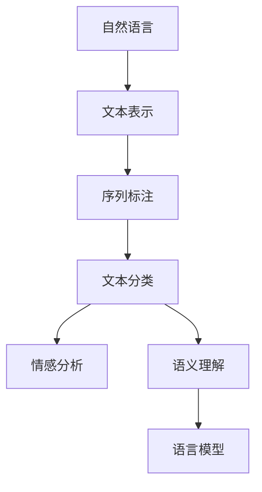

                 

# 自然语言处理(Natural Language Processing) - 原理与代码实例讲解

> 关键词：
- 自然语言处理
- 算法原理
- 代码实例
- 深度学习
- 神经网络
- 文本分类
- 序列标注
- 对话系统
- 情感分析
- 语义分析

## 1. 背景介绍

自然语言处理(Natural Language Processing, NLP)是人工智能领域的重要分支，旨在使计算机能够理解和处理人类语言。随着深度学习技术的发展，NLP技术已经从早期的基于规则和模板的浅层模型，发展到今天以神经网络为核心技术的深层模型。本文将从原理和代码实例两个角度，全面讲解自然语言处理技术的基本概念、核心算法和具体实现方法，帮助读者深入理解NLP技术的原理与应用。

## 2. 核心概念与联系

### 2.1 核心概念概述

NLP中的核心概念主要包括自然语言、语言模型、文本表示、序列标注、文本分类、情感分析、语义理解等。

- **自然语言**：人类用于交流和表达思想的符号系统，包括语音、文字、图像等形式。
- **语言模型**：用于描述自然语言的概率模型，如n-gram模型、LSTM、GRU等。
- **文本表示**：将自然语言文本转化为机器可理解的形式，如词向量、子词向量、句子嵌入等。
- **序列标注**：将自然语言文本中的标签序列标注出来，如命名实体识别、词性标注、依存关系分析等。
- **文本分类**：将自然语言文本划分为预定义的类别，如新闻分类、情感分析、主题分类等。
- **情感分析**：判断文本中的情感倾向，如正向、负向、中性等。
- **语义理解**：理解文本的深层含义，如关系抽取、语义相似度计算等。

这些概念之间通过深度学习框架和算法相连接，构成了一个完整的自然语言处理系统。以下是一个简单的示意图：

### 2.2 概念间的关系

NLP中的核心概念之间有着紧密的联系，共同构成了自然语言处理的生态系统。具体来说：

- **文本表示**是NLP的基础，通过各种词向量、子词向量、句子嵌入等技术将自然语言转化为机器可理解的形式，为后续的序列标注、分类、情感分析等任务提供支持。
- **序列标注**通过对文本进行标签序列的标注，实现对文本中实体的识别、词性的标注等。
- **文本分类**通过将文本划分为预定义的类别，实现对文本内容的分类和判断。
- **情感分析**通过对文本进行情感倾向的判断，实现对文本情感的自动识别。
- **语义理解**通过理解文本的深层含义，实现对文本的深度分析和理解，如关系抽取、语义相似度计算等。
- **语言模型**通过对文本的概率建模，实现对文本生成、语言理解等任务的预测和推断。

这些概念相互支持、相互促进，共同推动了NLP技术的发展。

## 3. 核心算法原理 & 具体操作步骤

### 3.1 算法原理概述

NLP中的核心算法主要包括词向量表示、序列标注算法、文本分类算法、情感分析算法、语义理解算法等。以下将分别介绍这些算法的原理和具体操作步骤。

### 3.2 算法步骤详解

#### 3.2.1 词向量表示

词向量是NLP中最基础的技术之一，用于将自然语言中的词汇转化为机器可理解的形式。常用的词向量表示方法包括：

- **One-hot编码**：将词汇映射到一个独热向量，只有一个元素为1，其余为0。这种方法简单直观，但缺乏语义信息。
- **词袋模型**：将文本中所有词汇组成的向量，忽略词汇之间的顺序和关系。这种方法简单高效，但缺乏上下文信息。
- **TF-IDF**：通过统计词汇在文本中的出现频率和重要性，生成词向量。这种方法能够反映词汇的重要性，但缺乏语义信息。
- **Word2Vec**：通过神经网络训练生成词向量，能够捕捉词汇之间的语义关系。这种方法效果好，但计算复杂度高。
- **GloVe**：通过矩阵分解和共现矩阵训练生成词向量，能够捕捉词汇之间的语义关系。这种方法效果好，但计算复杂度高。
- **BERT、GPT等预训练模型**：通过大规模语料预训练生成词向量，能够捕捉词汇之间的复杂语义关系。这种方法效果好，但需要大量的计算资源。

#### 3.2.2 序列标注算法

序列标注算法用于对文本进行标签序列的标注，常用的算法包括：

- **隐马尔可夫模型(HMM)**：通过建立状态转移矩阵和发射概率矩阵，对文本序列进行标注。这种方法简单高效，但无法捕捉复杂的上下文关系。
- **条件随机场(CRF)**：通过建立标注状态的转移概率，对文本序列进行标注。这种方法能够捕捉复杂的上下文关系，但计算复杂度高。
- **神经网络**：通过建立循环神经网络(RNN)或长短时记忆网络(LSTM)，对文本序列进行标注。这种方法效果好，但计算复杂度高。
- **Transformer**：通过建立自注意力机制，对文本序列进行标注。这种方法效果好，但计算复杂度高。

#### 3.2.3 文本分类算法

文本分类算法用于将文本划分为预定义的类别，常用的算法包括：

- **朴素贝叶斯(Naive Bayes)**：通过计算文本特征在各个类别中的概率，对文本进行分类。这种方法简单高效，但无法捕捉复杂的特征关系。
- **支持向量机(SVM)**：通过寻找最优超平面，对文本进行分类。这种方法效果好，但计算复杂度高。
- **随机森林(Random Forest)**：通过建立决策树，对文本进行分类。这种方法效果好，但计算复杂度高。
- **神经网络**：通过建立卷积神经网络(CNN)或循环神经网络(RNN)，对文本进行分类。这种方法效果好，但计算复杂度高。

#### 3.2.4 情感分析算法

情感分析算法用于判断文本中的情感倾向，常用的算法包括：

- **情感词典**：通过统计文本中情感词典中的情感词，对文本进行情感分析。这种方法简单高效，但无法捕捉复杂的情感关系。
- **基于规则的情感分析**：通过建立情感分析规则，对文本进行情感分析。这种方法简单高效，但无法捕捉复杂的情感关系。
- **情感分类器**：通过建立情感分类器，对文本进行情感分析。这种方法效果好，但计算复杂度高。
- **深度学习情感分析**：通过建立卷积神经网络(CNN)或循环神经网络(RNN)，对文本进行情感分析。这种方法效果好，但计算复杂度高。

#### 3.2.5 语义理解算法

语义理解算法用于理解文本的深层含义，常用的算法包括：

- **关系抽取**：通过建立关系抽取模型，对文本中的实体关系进行抽取。这种方法效果好，但计算复杂度高。
- **语义相似度计算**：通过计算文本之间的语义相似度，实现文本的相似度匹配。这种方法效果好，但计算复杂度高。
- **语义角色标注**：通过建立语义角色标注模型，对文本中的语义角色进行标注。这种方法效果好，但计算复杂度高。

### 3.3 算法优缺点

#### 3.3.1 词向量表示

- **优点**：
  - 能够捕捉词汇之间的语义关系。
  - 能够捕捉词汇之间的上下文关系。
  - 能够捕捉词汇之间的复杂语义关系。
- **缺点**：
  - 计算复杂度高。
  - 需要大量的计算资源。

#### 3.3.2 序列标注算法

- **优点**：
  - 能够捕捉复杂的上下文关系。
  - 能够捕捉复杂的情感关系。
  - 能够捕捉复杂的语义关系。
- **缺点**：
  - 计算复杂度高。
  - 训练复杂度高。

#### 3.3.3 文本分类算法

- **优点**：
  - 效果好。
  - 能够捕捉复杂的特征关系。
- **缺点**：
  - 计算复杂度高。
  - 训练复杂度高。

#### 3.3.4 情感分析算法

- **优点**：
  - 效果好。
  - 能够捕捉复杂的情感关系。
- **缺点**：
  - 计算复杂度高。
  - 训练复杂度高。

#### 3.3.5 语义理解算法

- **优点**：
  - 效果好。
  - 能够捕捉复杂的语义关系。
- **缺点**：
  - 计算复杂度高。
  - 训练复杂度高。

### 3.4 算法应用领域

NLP技术在多个领域得到了广泛应用，例如：

- **文本分类**：用于对文本进行分类，如新闻分类、情感分析、主题分类等。
- **序列标注**：用于对文本进行标签序列的标注，如命名实体识别、词性标注、依存关系分析等。
- **情感分析**：用于判断文本中的情感倾向，如产品评价、客户反馈等。
- **语义理解**：用于理解文本的深层含义，如问答系统、机器翻译等。
- **信息抽取**：用于从文本中抽取结构化信息，如关系抽取、事件抽取等。
- **自动摘要**：用于生成文本摘要，如新闻摘要、技术文档摘要等。
- **对话系统**：用于实现人机对话，如智能客服、智能助手等。

## 4. 数学模型和公式 & 详细讲解 & 举例说明

### 4.1 数学模型构建

#### 4.1.1 词向量表示

- **One-hot编码**：
  $$
  \vec{x} = \begin{bmatrix} x_1 \\ 0 \\ 0 \end{bmatrix}
  $$
  其中 $x_1$ 为1，其余元素为0。

- **词袋模型**：
  $$
  \vec{x} = \begin{bmatrix} x_1 \\ x_2 \\ x_3 \end{bmatrix}
  $$
  其中 $x_1, x_2, x_3$ 分别为三个词汇的出现次数。

- **TF-IDF**：
  $$
  \vec{x} = \begin{bmatrix} x_1 \\ x_2 \\ x_3 \end{bmatrix}
  $$
  其中 $x_1, x_2, x_3$ 分别为三个词汇的TF-IDF值。

- **Word2Vec**：
  $$
  \vec{x} = \begin{bmatrix} x_1 \\ x_2 \\ x_3 \end{bmatrix}
  $$
  其中 $x_1, x_2, x_3$ 分别为三个词汇的向量表示。

- **GloVe**：
  $$
  \vec{x} = \begin{bmatrix} x_1 \\ x_2 \\ x_3 \end{bmatrix}
  $$
  其中 $x_1, x_2, x_3$ 分别为三个词汇的向量表示。

- **BERT**：
  $$
  \vec{x} = \begin{bmatrix} x_1 \\ x_2 \\ x_3 \end{bmatrix}
  $$
  其中 $x_1, x_2, x_3$ 分别为三个词汇的向量表示。

#### 4.1.2 序列标注算法

- **隐马尔可夫模型(HMM)**：
  $$
  P(x_t | x_{t-1}, \theta) = \sum_{i=1}^{n} \alpha_{t-1,i} \beta_{t,i}^{s_t}
  $$
  其中 $x_t$ 为文本中的第 $t$ 个词汇，$s_t$ 为标注结果，$\alpha_{t-1,i}$ 和 $\beta_{t,i}^{s_t}$ 分别为状态转移概率和发射概率。

- **条件随机场(CRF)**：
  $$
  P(x_t | x_{t-1}, \theta) = \frac{P(x_t | x_{t-1}, \theta) P(x_t, \theta)}{\sum_{s_t} P(x_t | x_{t-1}, \theta) P(s_t)}
  $$
  其中 $x_t$ 为文本中的第 $t$ 个词汇，$s_t$ 为标注结果，$\theta$ 为模型参数。

- **神经网络**：
  $$
  P(x_t | x_{t-1}, \theta) = \text{softmax}(\vec{W} \vec{x}_{t-1} + \vec{b})
  $$
  其中 $\vec{W}$ 和 $\vec{b}$ 分别为神经网络的权重和偏置，$\vec{x}_{t-1}$ 为文本中第 $t-1$ 个词汇的向量表示。

- **Transformer**：
  $$
  P(x_t | x_{t-1}, \theta) = \text{softmax}(\vec{W} \vec{x}_{t-1} + \vec{b})
  $$
  其中 $\vec{W}$ 和 $\vec{b}$ 分别为神经网络的权重和偏置，$\vec{x}_{t-1}$ 为文本中第 $t-1$ 个词汇的向量表示。

#### 4.1.3 文本分类算法

- **朴素贝叶斯(Naive Bayes)**：
  $$
  P(y | \vec{x}) = \frac{P(y) \prod_{i=1}^{n} P(x_i | y)}{\sum_{y \in Y} P(y) \prod_{i=1}^{n} P(x_i | y)}
  $$
  其中 $y$ 为文本类别，$\vec{x}$ 为文本的特征向量。

- **支持向量机(SVM)**：
  $$
  P(y | \vec{x}) = \text{sgn}(\vec{w} \cdot \vec{x} + b)
  $$
  其中 $\vec{w}$ 和 $b$ 分别为支持向量机的权重和偏置，$\vec{x}$ 为文本的特征向量。

- **随机森林(Random Forest)**：
  $$
  P(y | \vec{x}) = \sum_{t=1}^{T} P(y_t | \vec{x}, \theta)
  $$
  其中 $T$ 为决策树的个数，$P(y_t | \vec{x}, \theta)$ 为第 $t$ 个决策树的输出。

- **神经网络**：
  $$
  P(y | \vec{x}) = \text{softmax}(\vec{W} \vec{x} + \vec{b})
  $$
  其中 $\vec{W}$ 和 $\vec{b}$ 分别为神经网络的权重和偏置，$\vec{x}$ 为文本的特征向量。

#### 4.1.4 情感分析算法

- **情感词典**：
  $$
  P(y | \vec{x}) = \sum_{i=1}^{n} w_i \cdot P(y, w_i | \vec{x})
  $$
  其中 $w_i$ 为情感词，$y$ 为情感类别，$\vec{x}$ 为文本的特征向量。

- **基于规则的情感分析**：
  $$
  P(y | \vec{x}) = \text{softmax}(\vec{W} \vec{x} + \vec{b})
  $$
  其中 $\vec{W}$ 和 $\vec{b}$ 分别为神经网络的权重和偏置，$\vec{x}$ 为文本的特征向量。

- **情感分类器**：
  $$
  P(y | \vec{x}) = \sum_{i=1}^{n} P(y_i | \vec{x})
  $$
  其中 $y_i$ 为情感类别，$\vec{x}$ 为文本的特征向量。

- **深度学习情感分析**：
  $$
  P(y | \vec{x}) = \text{softmax}(\vec{W} \vec{x} + \vec{b})
  $$
  其中 $\vec{W}$ 和 $\vec{b}$ 分别为神经网络的权重和偏置，$\vec{x}$ 为文本的特征向量。

#### 4.1.5 语义理解算法

- **关系抽取**：
  $$
  P(y | \vec{x}) = \text{softmax}(\vec{W} \vec{x} + \vec{b})
  $$
  其中 $\vec{W}$ 和 $\vec{b}$ 分别为神经网络的权重和偏置，$\vec{x}$ 为文本的特征向量。

- **语义相似度计算**：
  $$
  \cos(\vec{x}_1, \vec{x}_2) = \frac{\vec{x}_1 \cdot \vec{x}_2}{\|\vec{x}_1\| \|\vec{x}_2\|}
  $$
  其中 $\vec{x}_1$ 和 $\vec{x}_2$ 分别为两个文本的向量表示。

- **语义角色标注**：
  $$
  P(y | \vec{x}) = \text{softmax}(\vec{W} \vec{x} + \vec{b})
  $$
  其中 $\vec{W}$ 和 $\vec{b}$ 分别为神经网络的权重和偏置，$\vec{x}$ 为文本的特征向量。

### 4.2 公式推导过程

#### 4.2.1 词向量表示

- **One-hot编码**：
  $$
  \vec{x} = \begin{bmatrix} x_1 \\ 0 \\ 0 \end{bmatrix}
  $$
  其中 $x_1$ 为1，其余元素为0。

- **词袋模型**：
  $$
  \vec{x} = \begin{bmatrix} x_1 \\ x_2 \\ x_3 \end{bmatrix}
  $$
  其中 $x_1, x_2, x_3$ 分别为三个词汇的出现次数。

- **TF-IDF**：
  $$
  \vec{x} = \begin{bmatrix} x_1 \\ x_2 \\ x_3 \end{bmatrix}
  $$
  其中 $x_1, x_2, x_3$ 分别为三个词汇的TF-IDF值。

- **Word2Vec**：
  $$
  \vec{x} = \begin{bmatrix} x_1 \\ x_2 \\ x_3 \end{bmatrix}
  $$
  其中 $x_1, x_2, x_3$ 分别为三个词汇的向量表示。

- **GloVe**：
  $$
  \vec{x} = \begin{bmatrix} x_1 \\ x_2 \\ x_3 \end{bmatrix}
  $$
  其中 $x_1, x_2, x_3$ 分别为三个词汇的向量表示。

- **BERT**：
  $$
  \vec{x} = \begin{bmatrix} x_1 \\ x_2 \\ x_3 \end{bmatrix}
  $$
  其中 $x_1, x_2, x_3$ 分别为三个词汇的向量表示。

#### 4.2.2 序列标注算法

- **隐马尔可夫模型(HMM)**：
  $$
  P(x_t | x_{t-1}, \theta) = \sum_{i=1}^{n} \alpha_{t-1,i} \beta_{t,i}^{s_t}
  $$
  其中 $x_t$ 为文本中的第 $t$ 个词汇，$s_t$ 为标注结果，$\alpha_{t-1,i}$ 和 $\beta_{t,i}^{s_t}$ 分别为状态转移概率和发射概率。

- **条件随机场(CRF)**：
  $$
  P(x_t | x_{t-1}, \theta) = \frac{P(x_t | x_{t-1}, \theta) P(x_t, \theta)}{\sum_{s_t} P(x_t | x_{t-1}, \theta) P(s_t)}
  $$
  其中 $x_t$ 为文本中的第 $t$ 个词汇，$s_t$ 为标注结果，$\theta$ 为模型参数。

- **神经网络**：
  $$
  P(x_t | x_{t-1}, \theta) = \text{softmax}(\vec{W} \vec{x}_{t-1} + \vec{b})
  $$
  其中 $\vec{W}$ 和 $\vec{b}$ 分别为神经网络的权重和偏置，$\vec{x}_{t-1}$ 为文本中第 $t-1$ 个词汇的向量表示。

- **Transformer**：
  $$
  P(x_t | x_{t-1}, \theta) = \text{softmax}(\vec{W} \vec{x}_{t-1} + \vec{b})
  $$
  其中 $\vec{W}$ 和 $\vec{b}$ 分别为神经网络的权重和偏置，$\vec{x}_{t-1}$ 为文本中第 $t-1$ 个词汇的向量表示。

#### 4.2.3 文本分类算法

- **朴素贝叶斯(Naive Bayes)**：
  $$
  P(y | \vec{x}) = \frac{P(y) \prod_{i=1}^{n} P(x_i | y)}{\sum_{y \in Y} P(y) \prod_{i=1}^{n} P(x_i | y)}
  $$
  其中 $y$ 为文本类别，$\vec{x}$ 为文本的特征向量。

- **支持向量机(SVM)**：
  $$
  P(y | \vec{x}) = \text{sgn}(\vec{w} \cdot \vec{x} + b)
  $$
  其中 $\vec{w}$ 和 $b$ 分别为支持向量机的权重和偏置，$\vec{x}$ 为文本的特征向量。

- **随机森林(Random Forest)**：
  $$
  P(y | \vec{x}) = \sum_{t=1}^{T} P(y_t | \vec{x}, \theta)
  $$
  其中 $T$ 为决策树的个数，$P(y_t | \vec{x}, \theta)$ 为第 $t$ 个决策树的输出。

- **神经网络**：
  $$
  P(y | \vec{x}) = \text{softmax}(\vec{W} \vec{x} + \vec{b})
  $$
  其中 $\vec{W}$ 和 $\vec{b}$ 分别为神经网络的权重和偏置，$\vec{x}$ 为文本的特征向量。

#### 4.2.4 情感分析算法

- **情感词典**：
  $$
  P(y | \vec{x}) = \sum_{i=1}^{n} w_i \cdot P(y, w_i | \vec{x})
  $$
  其中 $w_i$ 为情感词，$y$ 为情感类别，$\vec{x}$ 为文本的特征向量。

- **基于规则的情感分析**：
  $$
  P(y | \vec{x}) = \text{softmax}(\vec{W} \vec{x} + \vec{b})
  $$
  其中 $\vec{W}$ 和 $\vec{b}$ 分别为神经网络的权重和偏置，$\vec{x}$ 为文本的特征向量。

- **情感分类器**：
  $$
  P(y | \vec{x}) = \sum_{i=1}^{n} P(y_i | \vec{x})
  $$
  其中 $y_i$ 为情感类别，$\vec{x}$ 为文本的特征向量。

- **深度学习情感分析**：
  $$
  P(y | \vec{x}) = \text{softmax}(\vec{W} \vec{x} + \vec{b})
  $$
  其中 $\vec{W}$ 和 $\vec{b}$ 分别为神经网络的权重和偏置，$\vec{x}$ 为文本的特征向量。

#### 4.2.5 语义理解算法

- **关系抽取**：
  $$
  P(y | \vec{x}) = \text{softmax}(\vec{W} \vec{x} + \vec{b})
  $$
  其中 $\vec{W}$ 和 $\vec{b}$ 分别为神经网络的权重和偏置，$\vec{x}$ 为文本的特征向量。

- **语义相似度计算**：
  $$
  \cos(\vec{x}_1, \vec{x}_2) = \frac{\vec{x}_1 \cdot \vec{x}_2}{\|\vec{x}_1\| \|\vec{x}_2\|}
  $$
  其中 $\vec{x}_1$ 和 $\vec{x}_2$ 分别为两个文本的向量表示。

- **语义角色标注**：
  $$
  P(y | \vec{x}) = \text{softmax}(\vec{W} \vec{x} + \vec{b})
  $$
  其中 $\vec{W}$ 和 $\vec{b}$ 分别为神经网络的权重和偏置，$\vec{x}$ 为文本的特征向量。

### 4.3 案例分析与讲解

