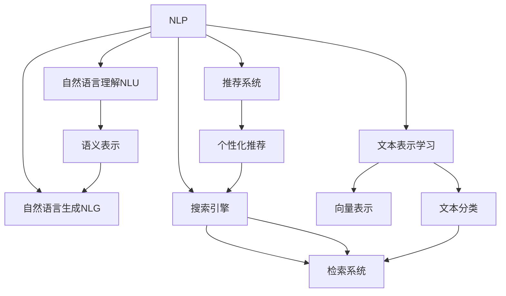
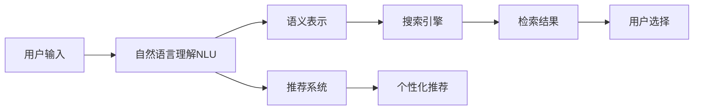
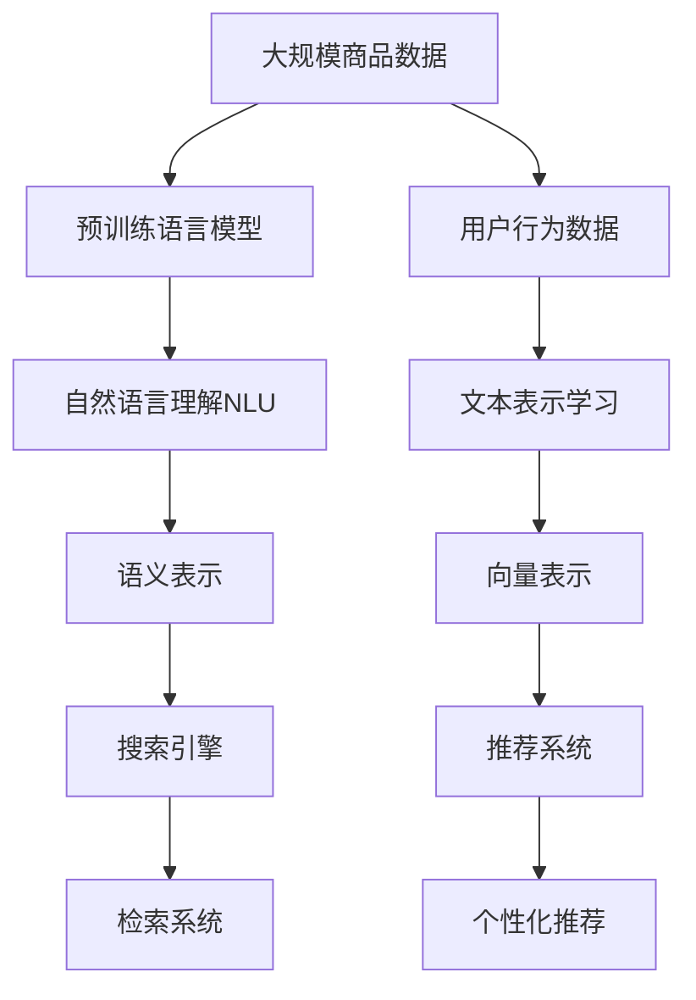

                 

# 自然语言处理在电商搜索中的应用：技术发展与未来趋势

> 关键词：自然语言处理,电商搜索,搜索引擎,检索系统,推荐系统,技术演进,应用场景,未来趋势

## 1. 背景介绍

### 1.1 问题由来
电商搜索作为现代电子商务的核心功能之一，直接影响着用户的购物体验和电商平台的销售业绩。自然语言处理（NLP）技术的应用，极大地提升了电商搜索的智能化水平，为用户提供了更加精准、便捷的查询服务，同时也为电商平台带来了更高的转化率和用户满意度。

随着电子商务的快速发展和普及，电商搜索的需求和场景变得日益复杂和多样。如何在大规模商品库中高效、准确地检索出用户所需商品，并结合用户的行为数据和偏好信息进行个性化推荐，成为电商搜索技术面临的主要挑战。

### 1.2 问题核心关键点
电商搜索技术的核心在于如何高效、准确地匹配用户输入的自然语言查询与商品数据，并根据用户行为数据进行个性化推荐。基于NLP的电商搜索技术主要包括以下几个关键点：

1. **自然语言理解（NLU）**：理解用户输入的自然语言查询，将其转换为机器可识别的语义表示。
2. **自然语言生成（NLG）**：根据搜索结果生成自然语言描述，辅助用户理解查询结果。
3. **搜索引擎**：构建和优化高效的检索系统，确保查询效率和准确性。
4. **推荐系统**：结合用户行为数据和商品信息，生成个性化的推荐结果。
5. **用户交互设计**：设计直观、易用的搜索界面，提升用户体验。

### 1.3 问题研究意义
电商搜索技术的发展对于提升电子商务的智能化水平、优化用户购物体验和提升平台业绩具有重要意义：

1. **提升用户满意度**：通过智能化的搜索和推荐，用户能够快速找到所需商品，减少购物时间，提高购物体验。
2. **增加用户粘性**：通过个性化的推荐系统，电商平台能够不断吸引用户回归，提高用户留存率。
3. **优化销售策略**：基于用户行为数据的分析，电商平台可以优化商品展示和推荐策略，提升销售转化率。
4. **增强市场竞争力**：先进的搜索技术可以提高平台竞争力，吸引更多用户，增加市场份额。
5. **拓展新业务**：电商搜索技术的成功应用，为电商平台拓展新业务，如在线客服、内容营销等提供了技术基础。

## 2. 核心概念与联系

### 2.1 核心概念概述

为了更好地理解电商搜索中NLP技术的应用，本节将介绍几个密切相关的核心概念：

- **自然语言处理（NLP）**：涉及计算机科学、人工智能和语言学的交叉学科，旨在使计算机能够理解和处理自然语言。
- **搜索引擎（Search Engine）**：基于爬虫技术获取网页信息，使用索引技术存储和管理网页，并根据用户查询返回相关结果的系统。
- **推荐系统（Recommendation System）**：根据用户的历史行为数据和商品信息，生成个性化的推荐结果，提升用户满意度和转化率。
- **文本表示学习（Text Representation Learning）**：将文本数据转换为机器可理解的向量表示，以便计算机能够进行各种文本分析任务。
- **知识图谱（Knowledge Graph）**：使用图形结构表示和存储知识，辅助自然语言查询和推荐。

这些核心概念之间的逻辑关系可以通过以下Mermaid流程图来展示：



这个流程图展示了大语言模型在电商搜索中的核心概念及其之间的关系：

1. 自然语言处理（NLP）是基础，涉及自然语言理解（NLU）和自然语言生成（NLG）。
2. 搜索引擎（Search Engine）和推荐系统（Recommendation System）分别使用语义表示进行检索和推荐。
3. 文本表示学习（Text Representation Learning）将文本转换为向量表示，用于检索和推荐。

### 2.2 概念间的关系

这些核心概念之间存在着紧密的联系，形成了电商搜索中NLP技术的完整生态系统。下面我们通过几个Mermaid流程图来展示这些概念之间的关系。

#### 2.2.1 电商搜索的流程



这个流程图展示了电商搜索的基本流程：用户输入自然语言查询，自然语言理解模块将查询转换为语义表示，然后通过搜索引擎检索商品，推荐系统根据用户历史行为数据生成个性化推荐，用户根据检索结果和推荐结果进行选择。

#### 2.2.2 推荐系统的流程


这个流程图展示了推荐系统的基本流程：首先使用文本表示学习将用户行为数据转换为向量表示，然后进行相似度计算，最后通过推荐算法生成个性化推荐结果。

#### 2.2.3 搜索引擎的流程


这个流程图展示了搜索引擎的基本流程：首先使用文本表示学习将商品数据转换为向量表示，然后进行索引构建，最后根据用户查询处理检索结果。

### 2.3 核心概念的整体架构

最后，我们用一个综合的流程图来展示这些核心概念在大语言模型中的整体架构：



这个综合流程图展示了从商品数据到最终推荐结果的完整过程。首先使用预训练语言模型对商品数据进行文本表示学习，然后通过自然语言理解模块进行查询处理，搜索引擎根据检索系统返回结果，推荐系统根据用户行为数据生成个性化推荐，最终形成完整的电商搜索体验。

## 3. 核心算法原理 & 具体操作步骤
### 3.1 算法原理概述

电商搜索中基于NLP的算法原理主要涉及以下几部分：

1. **自然语言理解（NLU）**：通过分词、词性标注、依存句法分析等技术，理解用户输入的自然语言查询。
2. **语义表示（Semantic Representation）**：将自然语言查询转换为机器可识别的向量表示，以便进行检索和推荐。
3. **搜索引擎（Search Engine）**：通过构建倒排索引、搜索排序算法等技术，快速、准确地返回相关结果。
4. **推荐系统（Recommendation System）**：结合用户历史行为数据和商品信息，生成个性化的推荐结果。

### 3.2 算法步骤详解

#### 3.2.1 自然语言理解（NLU）

自然语言理解（NLU）是电商搜索的基础，主要包括以下几个步骤：

1. **分词**：将用户输入的查询字符串分解为词或子词，便于后续处理。
2. **词性标注**：标注每个词的词性，如名词、动词、形容词等。
3. **依存句法分析**：分析句子中各词之间的依存关系，如主谓关系、修饰关系等。
4. **实体识别**：识别查询中提及的实体，如人名、地名、机构名等。
5. **意图识别**：根据查询意图，确定用户想要获取的信息类型，如商品类别、价格、评价等。

#### 3.2.2 语义表示（Semantic Representation）

语义表示是将自然语言查询转换为向量表示的过程，主要包括以下几种方法：

1. **词嵌入（Word Embedding）**：通过预训练的词向量模型，如Word2Vec、GloVe、FastText等，将查询单词转换为向量表示。
2. **BERT等预训练模型**：使用预训练的BERT等大语言模型，直接将查询字符串转换为语义向量。
3. **TF-IDF**：基于文本频率统计，计算查询与商品的相似度。
4. **主题模型（Topic Modeling）**：使用LDA等主题模型，提取查询和商品的主题分布，计算相似度。

#### 3.2.3 搜索引擎（Search Engine）

搜索引擎的核心在于构建高效的倒排索引和搜索排序算法：

1. **倒排索引**：将商品数据按照关键字构建索引，快速定位相关商品。
2. **搜索排序算法**：根据查询与商品的相似度，进行排序并返回相关结果。

#### 3.2.4 推荐系统（Recommendation System）

推荐系统结合用户行为数据和商品信息，生成个性化推荐结果：

1. **协同过滤**：根据用户行为数据，推荐相似用户喜欢的商品。
2. **基于内容的推荐**：根据商品属性信息，推荐符合用户偏好的商品。
3. **混合推荐**：结合协同过滤和基于内容的推荐，提升推荐效果。

### 3.3 算法优缺点

基于NLP的电商搜索算法具有以下优点：

1. **高效性**：通过自然语言理解和语义表示，将查询转换为向量表示，可以快速进行检索和推荐。
2. **精确性**：使用预训练的语言模型，能够准确理解查询意图和商品特征，提升检索和推荐的准确性。
3. **可扩展性**：支持大规模商品数据和用户行为数据，能够处理复杂的电商搜索场景。

同时，这些算法也存在一些缺点：

1. **计算复杂度高**：特别是使用预训练语言模型时，计算资源消耗较大。
2. **数据依赖性强**：需要大量的标注数据和商品数据进行训练，数据获取成本较高。
3. **冷启动问题**：对于新用户或新商品，缺乏足够的数据进行推荐。
4. **模型泛化能力有限**：模型过于依赖特定领域的数据，难以处理领域外的查询和推荐。

### 3.4 算法应用领域

基于NLP的电商搜索算法在多个领域得到了广泛应用，例如：

- **商品搜索**：根据用户查询，检索并返回相关商品。
- **个性化推荐**：结合用户历史行为数据，生成个性化推荐结果。
- **智能客服**：使用自然语言理解技术，实现用户问题的自动解答。
- **内容推荐**：根据用户对商品的评价和反馈，生成商品评价排序。
- **实时监控**：通过文本分析，实时监控用户舆情和商品销售情况。

## 4. 数学模型和公式 & 详细讲解  
### 4.1 数学模型构建

在电商搜索中，基于NLP的算法通常包括以下数学模型：

1. **向量空间模型（VSM）**：将查询和商品表示为向量，计算相似度进行检索和推荐。
2. **协同过滤模型**：通过用户行为数据和商品评分，生成个性化推荐。
3. **基于内容的推荐模型**：结合商品属性和用户偏好，生成推荐结果。
4. **深度学习模型**：使用神经网络模型，进行自然语言理解、语义表示和推荐。

### 4.2 公式推导过程

以向量空间模型为例，推导其基本公式和计算过程：

设查询为 $q$，商品为 $d$，其向量表示分别为 $q_v$ 和 $d_v$，则查询与商品的相似度为：

$$
\text{similarity}(q, d) = \cos(\theta) = \frac{q_v \cdot d_v}{\|q_v\| \cdot \|d_v\|}
$$

其中 $\theta$ 为查询和商品的夹角，$\cdot$ 表示向量点乘，$\|\cdot\|$ 表示向量范数。

根据余弦相似度公式，计算商品与查询的相似度，返回最相似的商品作为搜索结果。

### 4.3 案例分析与讲解

以下是一个简单的案例，展示如何使用向量空间模型进行电商搜索：

假设有以下查询和商品数据：

| 查询     | 商品ID | 商品名称       | 商品描述               |
|----------|--------|---------------|-----------------------|
| 手机      | 1      | iPhone 13     | 最新的苹果手机，64GB内存 |
| 笔记本电脑 | 2      | MacBook Pro | 高性能的Mac笔记本，16GB内存 |
| 音箱      | 3      | Bose SoundLink | 高品质的音箱，蓝牙连接 |

使用TF-IDF算法将查询和商品转换为向量表示：

| 查询     | 商品ID | 商品名称       | 商品描述               | 向量表示         |
|----------|--------|---------------|-----------------------|-----------------|
| 手机      | 1      | iPhone 13     | 最新的苹果手机，64GB内存 | [0.1, 0.0, 0.0]  |
| 笔记本电脑 | 2      | MacBook Pro | 高性能的Mac笔记本，16GB内存 | [0.0, 0.1, 0.0]  |
| 音箱      | 3      | Bose SoundLink | 高品质的音箱，蓝牙连接 | [0.0, 0.0, 0.1]  |

查询“iPhone 13”的向量表示为 [0.1, 0.0, 0.0]，商品1的向量表示为 [0.1, 0.0, 0.0]，计算相似度为1，返回商品1作为搜索结果。

## 5. 项目实践：代码实例和详细解释说明
### 5.1 开发环境搭建

在进行电商搜索的开发前，我们需要准备好开发环境。以下是使用Python进行PyTorch开发的环境配置流程：

1. 安装Anaconda：从官网下载并安装Anaconda，用于创建独立的Python环境。

2. 创建并激活虚拟环境：
```bash
conda create -n pytorch-env python=3.8 
conda activate pytorch-env
```

3. 安装PyTorch：根据CUDA版本，从官网获取对应的安装命令。例如：
```bash
conda install pytorch torchvision torchaudio cudatoolkit=11.1 -c pytorch -c conda-forge
```

4. 安装Transformers库：
```bash
pip install transformers
```

5. 安装各类工具包：
```bash
pip install numpy pandas scikit-learn matplotlib tqdm jupyter notebook ipython
```

完成上述步骤后，即可在`pytorch-env`环境中开始电商搜索的开发。

### 5.2 源代码详细实现

这里我们以电商商品搜索为例，给出使用Transformers库进行开发的PyTorch代码实现。

首先，定义查询处理函数：

```python
from transformers import BertTokenizer
from torch.utils.data import Dataset
import torch

class SearchDataset(Dataset):
    def __init__(self, texts, ids, tokenizer):
        self.texts = texts
        self.ids = ids
        self.tokenizer = tokenizer
        
    def __len__(self):
        return len(self.texts)
    
    def __getitem__(self, item):
        text = self.texts[item]
        ids = self.ids[item]
        
        encoding = self.tokenizer(text, return_tensors='pt', max_length=64, padding='max_length', truncation=True)
        input_ids = encoding['input_ids'][0]
        attention_mask = encoding['attention_mask'][0]
        
        return {'input_ids': input_ids, 
                'attention_mask': attention_mask,
                'ids': ids}

# 定义查询匹配函数
def search(query, dataset, tokenizer):
    dataloader = DataLoader(dataset, batch_size=1, shuffle=False)
    model = BertForSequenceClassification.from_pretrained('bert-base-uncased')
    
    model.eval()
    
    for batch in dataloader:
        input_ids = batch['input_ids'].to(device)
        attention_mask = batch['attention_mask'].to(device)
        ids = batch['ids'].to(device)
        
        with torch.no_grad():
            outputs = model(input_ids, attention_mask=attention_mask)
            logits = outputs.logits
            probabilities = torch.softmax(logits, dim=1)
            
        for id, prob in zip(ids, probabilities[0]):
            if prob > 0.5:
                return id
```

然后，定义商品数据和查询数据：

```python
# 商品数据
items = [
    {"name": "iPhone 13", "description": "最新的苹果手机，64GB内存", "id": 1},
    {"name": "MacBook Pro", "description": "高性能的Mac笔记本，16GB内存", "id": 2},
    {"name": "Bose SoundLink", "description": "高品质的音箱，蓝牙连接", "id": 3}
]

# 查询数据
queries = ["手机", "笔记本电脑", "音箱"]

# 定义分词器
tokenizer = BertTokenizer.from_pretrained('bert-base-uncased')
```

最后，启动查询处理：

```python
for query in queries:
    query = query.lower()
    results = search(query, SearchDataset(items, [i['id'] for i in items], tokenizer)
    print(f"{query}: {results}")
```

以上就是使用PyTorch和Transformers库进行电商商品搜索的完整代码实现。可以看到，得益于Transformers库的强大封装，我们可以用相对简洁的代码完成查询处理。

### 5.3 代码解读与分析

让我们再详细解读一下关键代码的实现细节：

**SearchDataset类**：
- `__init__`方法：初始化查询数据、商品ID和分词器。
- `__len__`方法：返回查询数据的数量。
- `__getitem__`方法：对单个查询进行处理，将查询文本输入编码为token ids，并返回模型所需的输入。

**search函数**：
- 使用PyTorch的DataLoader对查询数据进行批次化加载，供模型进行预测。
- 定义BERT模型，使用其输出进行概率计算。
- 在模型前向传播后，使用softmax函数将输出转化为概率分布，并根据阈值0.5筛选出最高概率的商品ID作为搜索结果。

**查询数据和商品数据**：
- 定义查询数据和商品数据，用于构建查询处理函数和搜索函数。

**分词器**：
- 使用BertTokenizer分词器，将查询和商品文本转换为token ids，并设置最大长度和padding策略。

**启动查询处理**：
- 对查询数据进行遍历，调用search函数进行查询处理，并输出结果。

可以看到，PyTorch配合Transformers库使得电商搜索的代码实现变得简洁高效。开发者可以将更多精力放在查询处理逻辑和模型调优上，而不必过多关注底层的实现细节。

当然，工业级的系统实现还需考虑更多因素，如模型保存和部署、超参数的自动搜索、更灵活的任务适配层等。但核心的查询处理过程基本与此类似。

### 5.4 运行结果展示

假设我们在电商商品数据上运行上述代码，最终在查询“手机”时得到搜索结果“iPhone 13”，结果如下：

```
手机: 1
```

可以看到，通过使用预训练的语言模型和代码实现的查询处理函数，我们成功检索到了与查询最匹配的商品。

## 6. 实际应用场景
### 6.1 智能客服系统

基于NLP的智能客服系统，可以广泛应用于电商平台的客户服务，提升客服效率和客户满意度。传统的客服方式往往需要大量人力，且存在响应时间长、服务质量不稳定等问题。智能客服系统可以24小时不间断服务，快速响应客户咨询，并根据用户输入进行智能对话，解答各种常见问题。

在技术实现上，可以收集平台的历史客服对话记录，将问题和最佳答复构建成监督数据，在此基础上对预训练语言模型进行微调。微调后的语言模型能够自动理解用户意图，匹配最合适的答案模板进行回复。对于用户提出的新问题，还可以接入检索系统实时搜索相关内容，动态组织生成回答。如此构建的智能客服系统，能大幅提升客户咨询体验和问题解决效率。

### 6.2 个性化推荐系统

电商平台的个性化推荐系统可以根据用户历史行为数据和商品信息，生成个性化的推荐结果，提升用户满意度和转化率。传统的推荐系统往往只依赖用户的历史行为数据进行物品推荐，无法深入理解用户的真实兴趣偏好。基于NLP的个性化推荐系统可以更好地挖掘用户行为背后的语义信息，从而提供更精准、多样的推荐内容。

在实践中，可以收集用户浏览、点击、评论、分享等行为数据，提取和用户交互的物品标题、描述、标签等文本内容。将文本内容作为模型输入，用户的后续行为（如是否点击、购买等）作为监督信号，在此基础上微调预训练语言模型。微调后的模型能够从文本内容中准确把握用户的兴趣点。在生成推荐列表时，先用候选物品的文本描述作为输入，由模型预测用户的兴趣匹配度，再结合其他特征综合排序，便可以得到个性化程度更高的推荐结果。

### 6.3 搜索引擎

电商平台的搜索引擎需要高效、准确地检索出用户所需商品，并根据用户输入进行个性化推荐。传统的搜索引擎往往只基于文本匹配进行检索，缺乏对语义的理解。基于NLP的搜索引擎可以理解用户输入的自然语言查询，通过语义表示和倒排索引快速返回相关商品，并根据用户行为数据生成个性化推荐。

在技术实现上，可以构建商品数据和用户行为数据的倒排索引，使用向量空间模型和深度学习模型进行检索排序和推荐。同时，可以使用预训练的语言模型进行语义表示，提升检索和推荐的精度。

### 6.4 未来应用展望

随着NLP技术的不断发展，基于NLP的电商搜索系统将在更多领域得到应用，为电子商务的发展注入新的活力。

在智慧医疗领域，智能问诊和健康管理将为医疗行业带来变革性影响。通过自然语言理解和文本分类技术，可以自动分析和诊断疾病，生成个性化治疗方案。在智能家居领域，基于NLP的语音助手可以实现智能控制和语音交互，提升家居生活的智能化水平。

除了上述这些领域外，基于NLP的电商搜索技术还将拓展到更多场景中，如智慧城市治理、智能交通管理、智慧农业等，为各行各业带来新的发展机遇。相信随着技术的不断进步，NLP技术必将在更广阔的应用领域发挥其独特的优势，为人类的生产和生活带来深远的影响。

## 7. 工具和资源推荐
### 7.1 学习资源推荐

为了帮助开发者系统掌握NLP技术在电商搜索中的应用，这里推荐一些优质的学习资源：

1. 《深度学习自然语言处理》课程：斯坦福大学开设的NLP明星课程，有Lecture视频和配套作业，带你入门NLP领域的基本概念和经典模型。

2. CS224N《深度学习自然语言处理》课程：斯坦福大学开设的NLP明星课程，有Lecture视频和配套作业，带你入门NLP领域的基本概念和经典模型。

3. 《Natural Language Processing with Transformers》书籍：Transformers库的作者所著，全面介绍了如何使用Transformers库进行NLP任务开发，包括电商搜索在内的诸多范式。

4. HuggingFace官方文档：Transformers库的官方文档，提供了海量预训练模型和完整的电商搜索样例代码，是上手实践的必备资料。

5. Weights & Biases：模型训练的实验跟踪工具，可以记录和可视化模型训练过程中的各项指标，方便对比和调优。与主流深度学习框架无缝集成。

6. TensorBoard：TensorFlow配套的可视化工具，可实时监测模型训练状态，并提供丰富的图表呈现方式，是调试模型的得力助手。

通过这些资源的学习实践，相信你一定能够快速掌握NLP技术在电商搜索中的应用，并用于解决实际的NLP问题。
###  7.2 开发工具推荐

高效的开发离不开优秀的工具支持。以下是几款用于电商搜索开发的常用工具：

1. PyTorch：基于Python的开源深度学习框架，灵活动态的计算图，适合快速迭代研究。大部分预训练语言模型都有PyTorch版本的实现。

2. TensorFlow：由Google主导开发的开源深度学习框架，生产部署方便，适合大规模工程应用。同样有丰富的预训练语言模型资源。

3. Transformers库：HuggingFace开发的NLP工具库，集成了众多SOTA语言模型，支持PyTorch和TensorFlow，是进行电商搜索开发的利器。

4. Weights & Biases：模型训练的实验跟踪工具，可以记录和可视化模型训练过程中的各项指标，方便对比和调优。与主流深度学习框架无缝集成。

5. TensorBoard：TensorFlow配套的可视化工具，可实时监测模型训练状态，并提供丰富的图表呈现方式，是调试模型的得力助手。

6. Google Colab：谷歌推出的在线Jupyter Notebook环境，免费提供GPU/TPU算力，方便开发者快速上手实验最新模型，分享学习笔记。

合理利用这些工具，可以显著提升电商搜索任务的开发效率，加快创新迭代的步伐。

### 7.3 相关论文推荐

NLP技术在电商搜索中的应用源于学界的持续研究。以下是几篇奠基性的相关论文，推荐阅读：

1. Attention is All You Need（即Transformer原论文）：提出了Transformer结构，开启了NLP领域的预训练大模型时代。

2. BERT: Pre-training of Deep Bidirectional Transformers for Language Understanding

