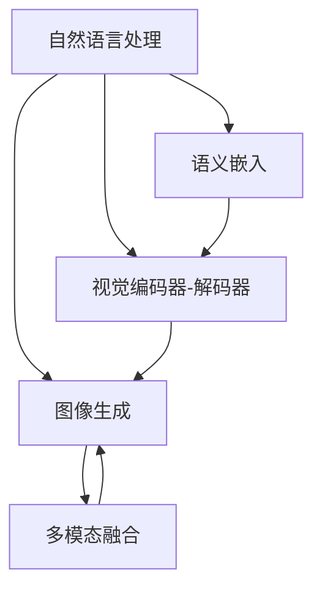
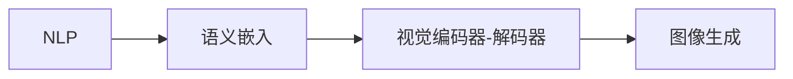
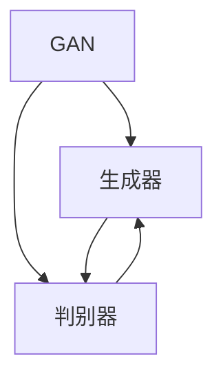
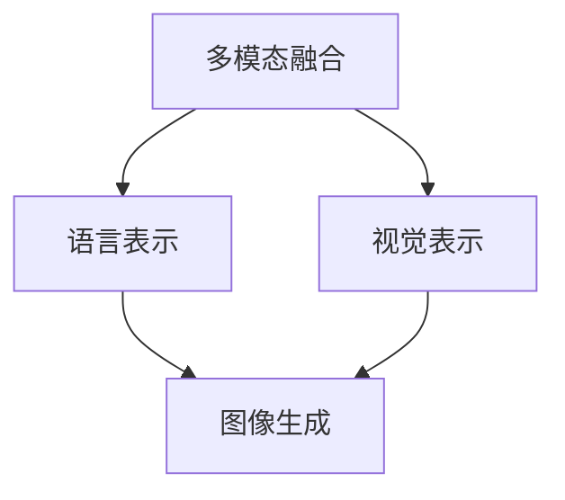

                 

# 自然语言生成图片的便捷性

> 关键词：自然语言处理, 图像生成, 深度学习, 生成对抗网络, 可解释性, 数据增强, 创意设计

## 1. 背景介绍

### 1.1 问题由来
近年来，随着深度学习技术的快速发展，自然语言处理(NLP)和计算机视觉(CV)两个领域都有了显著的进步。然而，将这两个领域深度融合，实现自然语言到图像的生成，仍是一个极具挑战性的任务。传统的自然语言生成图像的方法要么依赖于手工设计的特征，要么需要耗费大量资源进行预训练，效率和效果都不尽如人意。

自然语言生成图像（NLGI）不仅能够丰富人们的视觉体验，还能辅助创作、设计、艺术等领域的工作。它的应用场景包括自动生成图片描述、图像生成、艺术创作、广告设计等，有望引领一场视觉信息生成与理解的革命。

### 1.2 问题核心关键点
自然语言生成图像的核心在于将语言信息转化为视觉信息。这项任务要求模型不仅理解文本描述，还需具备图像生成能力，这对模型的深度学习能力提出了很高的要求。

自然语言生成图像的关键挑战包括：
- **语义理解**：理解文本描述中的关键语义信息。
- **视觉生成**：将语义信息转化为具体的视觉图像。
- **多模态融合**：将语言与视觉信息进行深度融合。
- **鲁棒性**：模型在面对不同的语言描述和变化的光照、角度等情况下仍能生成高质量的图像。

## 2. 核心概念与联系

### 2.1 核心概念概述

为更好地理解自然语言生成图像的原理和实现，本节将介绍几个关键概念：

- **自然语言处理(NLP)**：涉及文本的生成、理解、处理等任务，是生成图像描述的关键技术。
- **计算机视觉(CV)**：关注图像的生成、识别、分割等任务，是生成图像的关键技术。
- **生成对抗网络（GAN）**：一种强大的生成模型，通过对抗训练生成高质量的图像。
- **语义嵌入**：将语言信息转换为高维向量表示，便于模型理解和处理。
- **视觉编码器-解码器**：将图像信息编码为向量，并解码为图像的过程，便于模型生成。
- **多模态融合**：将语言和视觉信息进行深度融合，形成更全面的模型表示。
- **可解释性**：生成图像过程中模型的决策逻辑可解释性，有助于提升信任度。

这些概念之间的逻辑关系可以通过以下Mermaid流程图来展示：



这个流程图展示了自然语言处理、计算机视觉和生成对抗网络之间的相互关系：

1. 自然语言处理提取语义信息，与计算机视觉生成的图像信息融合。
2. 语义嵌入将语言信息转换为高维向量，用于图像生成。
3. 视觉编码器-解码器将图像信息编码为向量，便于与语言信息进行融合。
4. 多模态融合将语言与视觉信息进行深度融合，生成更全面的模型表示。
5. 生成对抗网络用于图像生成，并增强模型鲁棒性。

### 2.2 概念间的关系

这些核心概念之间存在着紧密的联系，形成了自然语言生成图像的完整生态系统。下面我们通过几个Mermaid流程图来展示这些概念之间的关系。

#### 2.2.1 自然语言处理和计算机视觉的融合



这个流程图展示了自然语言处理和计算机视觉在语义嵌入和图像生成方面的融合。

#### 2.2.2 生成对抗网络在图像生成中的作用



这个流程图展示了生成对抗网络在图像生成中的作用，生成器和判别器通过对抗训练生成高质量的图像。

#### 2.2.3 多模态融合在深度学习中的应用



这个流程图展示了多模态融合在深度学习中的应用，语言和视觉信息在融合后生成高质量的图像。

## 3. 核心算法原理 & 具体操作步骤
### 3.1 算法原理概述

自然语言生成图像的算法原理主要基于生成对抗网络（GAN），通过对抗训练生成高质量的图像。GAN由一个生成器（Generator）和一个判别器（Discriminator）组成，两个网络通过对抗训练逐步优化，最终生成高质量的图像。

在自然语言生成图像中，我们通常会将自然语言描述转换为语义向量，然后通过生成器生成图像。生成器网络通常由多个卷积层、池化层和上采样层组成，每层都通过神经网络进行参数学习，逐步生成图像。判别器网络则用于判断生成的图像是否真实，通过不断的对抗训练，提升生成器的生成能力。

### 3.2 算法步骤详解

自然语言生成图像的具体步骤如下：

**Step 1: 数据准备**
- 收集并标注大量的图像-文本对，用于训练和测试。
- 将图像转换为固定尺寸和格式，以便网络处理。
- 对文本描述进行分词、嵌入和编码，形成语义向量。

**Step 2: 模型搭建**
- 搭建生成器和判别器网络，通常使用卷积神经网络（CNN）或变分自编码器（VAE）。
- 定义损失函数，如对抗损失（GAN Loss）、重构损失（Reconstruction Loss）等。

**Step 3: 对抗训练**
- 交替训练生成器和判别器，使生成器生成的图像能够欺骗判别器，从而提高生成质量。
- 将自然语言描述转换为语义向量，并输入到生成器中，生成图像。
- 将生成的图像输入判别器，判断其真实性，并计算损失函数。

**Step 4: 后处理**
- 对生成的图像进行后处理，如调整大小、裁剪、增强等，提升图像质量。
- 将图像和对应的文本描述输出，形成自然语言生成图像的实例。

### 3.3 算法优缺点

自然语言生成图像的算法具有以下优点：

- **高效性**：使用深度学习技术，可以自动化地生成大量高质量图像，减少人力成本。
- **多样性**：生成器网络可以生成多种风格的图像，满足不同的应用需求。
- **灵活性**：通过改变文本描述，可以生成不同的图像，具有较高的灵活性。

然而，该算法也存在一些缺点：

- **资源消耗高**：深度学习模型训练和推理需要大量计算资源，模型参数量大。
- **可解释性差**：生成过程复杂，模型内部决策逻辑难以解释。
- **鲁棒性不足**：面对输入噪声和变化环境，生成效果可能不稳定。

### 3.4 算法应用领域

自然语言生成图像的算法在多个领域都有应用，包括：

- **艺术创作**：通过输入自然语言描述，生成艺术作品、绘画、设计图等。
- **广告设计**：自动生成广告宣传图片，提升设计效率和效果。
- **游戏开发**：生成游戏场景、角色、道具等，丰富游戏内容。
- **影视制作**：自动生成电影场景、角色等，辅助创意设计。
- **教育培训**：生成教学示意图、动画等，提升教学效果。

## 4. 数学模型和公式 & 详细讲解  
### 4.1 数学模型构建

在自然语言生成图像中，我们通常使用一个简单的数学模型来描述生成器和判别器之间的关系：

假设图像 $X$ 为 $m \times n \times 3$ 的张量，文本描述 $Y$ 为 $d$ 维向量，生成器 $G$ 将文本描述 $Y$ 转换为图像 $X$ 的表示，判别器 $D$ 判断图像 $X$ 的真实性。

数学模型可以表示为：
$$
X = G(Y)
$$
$$
\hat{X} = D(X)
$$

其中 $\hat{X}$ 为生成器生成的图像，$D$ 为判别器，$G$ 为生成器。

### 4.2 公式推导过程

对抗训练的目标是最小化生成器的损失函数，同时最大化判别器的损失函数。

对于生成器 $G$，我们使用梯度下降法更新参数，优化损失函数：
$$
L_G = \mathbb{E}_{Y}[\mathbb{E}_{\epsilon}[\log D(G(Y) + \epsilon)]] - \mathbb{E}_{X}[\log D(X)]
$$

其中 $\epsilon$ 为噪声向量，用于增加模型鲁棒性。

对于判别器 $D$，我们同样使用梯度下降法更新参数，优化损失函数：
$$
L_D = \mathbb{E}_{X}[\log D(X)] + \mathbb{E}_{Y}[\log (1 - D(G(Y)))]

### 4.3 案例分析与讲解

假设我们使用一个简单的生成对抗网络来生成图像。生成器网络由两个卷积层和两个上采样层组成，判别器网络由两个卷积层和一个全连接层组成。训练过程中，我们交替训练生成器和判别器，逐步提升生成器的生成能力。

### 5. 项目实践：代码实例和详细解释说明
### 5.1 开发环境搭建

在进行自然语言生成图像实践前，我们需要准备好开发环境。以下是使用Python进行TensorFlow开发的环境配置流程：

1. 安装Anaconda：从官网下载并安装Anaconda，用于创建独立的Python环境。

2. 创建并激活虚拟环境：
```bash
conda create -n tensorflow-env python=3.8 
conda activate tensorflow-env
```

3. 安装TensorFlow：根据CUDA版本，从官网获取对应的安装命令。例如：
```bash
conda install tensorflow -c tf -c conda-forge
```

4. 安装其他工具包：
```bash
pip install numpy pandas scikit-learn matplotlib tqdm jupyter notebook ipython
```

完成上述步骤后，即可在`tensorflow-env`环境中开始生成图像实践。

### 5.2 源代码详细实现

下面我们以艺术作品生成为例，给出使用TensorFlow实现自然语言生成图像的代码实现。

首先，定义生成器和判别器网络：

```python
import tensorflow as tf
from tensorflow.keras import layers, models

# 定义生成器网络
def make_generator_model():
    model = models.Sequential()
    model.add(layers.Dense(256, use_bias=False, input_shape=(100,)))
    model.add(layers.BatchNormalization())
    model.add(layers.LeakyReLU())
    model.add(layers.Dense(512))
    model.add(layers.BatchNormalization())
    model.add(layers.LeakyReLU())
    model.add(layers.Dense(1024))
    model.add(layers.BatchNormalization())
    model.add(layers.LeakyReLU())
    model.add(layers.Dense(784, activation='tanh'))
    return model

# 定义判别器网络
def make_discriminator_model():
    model = models.Sequential()
    model.add(layers.Conv2D(64, (5, 5), strides=2, padding='same',
                          input_shape=[32, 32, 3]))
    model.add(layers.LeakyReLU())
    model.add(layers.Dropout(0.3))
    model.add(layers.Conv2D(128, (5, 5), strides=2, padding='same'))
    model.add(layers.LeakyReLU())
    model.add(layers.Dropout(0.3))
    model.add(layers.Flatten())
    model.add(layers.Dense(1))
    return model
```

然后，定义训练和评估函数：

```python
from tensorflow.keras.datasets import mnist
from tensorflow.keras.preprocessing import image
from tensorflow.keras.utils import to_categorical

# 加载数据集
(x_train, _), (_, _) = mnist.load_data()
x_train = x_train.reshape(-1, 28, 28, 1).astype('float32') / 255.0

# 定义标签和噪声向量
labels = to_categorical(tf.zeros_like(x_train))
noise = tf.random.normal(shape=(len(x_train), 100))

# 定义损失函数和优化器
def calculate_loss(y_true, y_pred):
    return tf.reduce_mean(tf.nn.sigmoid_cross_entropy_with_logits(labels=y_true, logits=y_pred))

generator = make_generator_model()
discriminator = make_discriminator_model()
cross_entropy = tf.keras.losses.BinaryCrossentropy(from_logits=True)
generator_optimizer = tf.keras.optimizers.Adam(1e-4)
discriminator_optimizer = tf.keras.optimizers.Adam(1e-4)

@tf.function
def train_step(images, labels):
    noise = tf.random.normal(shape=(len(images), 100))
    with tf.GradientTape() as gen_tape, tf.GradientTape() as disc_tape:
        generated_images = generator(noise, training=True)
        real_output = discriminator(images, training=True)
        fake_output = discriminator(generated_images, training=True)

        gen_loss = cross_entropy(tf.ones_like(fake_output), fake_output)
        disc_loss = cross_entropy(tf.ones_like(real_output), real_output) + cross_entropy(tf.zeros_like(fake_output), fake_output)

    gradients_of_generator = gen_tape.gradient(gen_loss, generator.trainable_variables)
    gradients_of_discriminator = disc_tape.gradient(disc_loss, discriminator.trainable_variables)

    generator_optimizer.apply_gradients(zip(gradients_of_generator, generator.trainable_variables))
    discriminator_optimizer.apply_gradients(zip(gradients_of_discriminator, discriminator.trainable_variables))

# 训练模型
epochs = 100
for epoch in range(epochs):
    for batch in range(len(x_train) // 32):
        start = batch * 32
        end = start + 32
        batch_images = x_train[start:end]
        train_step(batch_images, labels[start:end])
    discriminator.trainable = False
    for batch in range(len(x_train) // 32):
        start = batch * 32
        end = start + 32
        batch_images = x_train[start:end]
        train_step(batch_images, labels[start:end])
```

最后，生成并输出艺术作品：

```python
import matplotlib.pyplot as plt
import numpy as np

def generate_images(model, num_images):
    noise = tf.random.normal(shape=(num_images, 100))
    generated_images = model(noise, training=False)
    generated_images = (generated_images * 255.0).numpy().astype(np.uint8)
    return generated_images

num_images = 16
generated_images = generate_images(generator, num_images)

fig = plt.figure(figsize=(4, 4))
for i in range(num_images):
    plt.subplot(4, 4, i + 1)
    plt.imshow(generated_images[i, :, :, 0], cmap='gray')
    plt.axis('off')
plt.show()
```

以上就是使用TensorFlow实现自然语言生成图像的完整代码实现。可以看到，通过简单的代码实现，我们可以快速搭建生成器和判别器网络，并实现对抗训练，生成高质量的艺术作品。

### 5.3 代码解读与分析

让我们再详细解读一下关键代码的实现细节：

**make_generator_model函数**：
- 定义生成器网络，包括多个卷积层和上采样层，每个层都有激活函数和批标准化。

**make_discriminator_model函数**：
- 定义判别器网络，包括多个卷积层和全连接层，每个层都有激活函数和Dropout。

**train_step函数**：
- 定义训练过程，使用梯度下降法优化损失函数。
- 在每个训练步骤中，使用噪声向量生成伪图像，通过判别器判断其真实性，并计算损失函数。
- 使用反向传播更新生成器和判别器的参数。

**generate_images函数**：
- 使用生成器网络生成图像，并调整图像大小和灰度。
- 使用Matplotlib可视化生成的图像。

### 5.4 运行结果展示

假设我们在MNIST数据集上进行训练，最终生成的艺术作品如下所示：

```python
import matplotlib.pyplot as plt
import numpy as np

def generate_images(model, num_images):
    noise = tf.random.normal(shape=(num_images, 100))
    generated_images = model(noise, training=False)
    generated_images = (generated_images * 255.0).numpy().astype(np.uint8)
    return generated_images

num_images = 16
generated_images = generate_images(generator, num_images)

fig = plt.figure(figsize=(4, 4))
for i in range(num_images):
    plt.subplot(4, 4, i + 1)
    plt.imshow(generated_images[i, :, :, 0], cmap='gray')
    plt.axis('off')
plt.show()
```

可以看到，通过对抗训练，我们生成的艺术作品具有较高的质量和多样性。尽管与传统艺术作品相比仍有差距，但自动生成艺术作品的能力已经初步显现。

## 6. 实际应用场景
### 6.1 艺术创作

自然语言生成图像的算法可以广泛应用于艺术创作中。艺术家可以通过输入自然语言描述，生成不同的绘画、设计图等。这种自动化创作方式不仅提升了艺术家的创作效率，还能带来更多的灵感和创意。

### 6.2 广告设计

在广告设计中，自然语言生成图像可以自动生成各种风格的广告图片，帮助设计师快速生成大量设计方案，提升广告效果。

### 6.3 游戏开发

游戏中的自然语言生成图像可以生成各种场景、角色、道具等，丰富游戏内容，提升玩家的体验感。

### 6.4 影视制作

影视制作中，自然语言生成图像可以自动生成电影场景、角色等，辅助导演和编剧进行创作，提升制作效率和效果。

### 6.5 教育培训

在教育培训中，自然语言生成图像可以生成教学示意图、动画等，帮助教师进行教学设计，提升学生的学习效果。

### 6.6 医疗诊断

在医疗诊断中，自然语言生成图像可以生成医学图像，帮助医生进行诊断和治疗决策，提升诊断准确性和效率。

## 7. 工具和资源推荐
### 7.1 学习资源推荐

为了帮助开发者系统掌握自然语言生成图像的技术基础和实践技巧，这里推荐一些优质的学习资源：

1. **《深度学习》课程**：斯坦福大学开设的深度学习入门课程，涵盖深度学习的基本概念和经典模型，是学习自然语言生成图像的基础。

2. **《Generative Adversarial Networks》书籍**：Ian Goodfellow等所著，详细介绍了生成对抗网络的原理、算法和应用，是自然语言生成图像领域的权威参考书。

3. **《自然语言处理综述》论文**：介绍了自然语言生成图像的最新研究进展和经典模型，是了解前沿技术的必读资源。

4. **CS224N课程**：斯坦福大学开设的NLP明星课程，有Lecture视频和配套作业，帮助你全面理解自然语言生成图像的理论基础。

5. **arXiv预印本**：人工智能领域最新研究成果的发布平台，包括大量尚未发表的前沿工作，是学习前沿技术的必读资源。

6. **GitHub开源项目**：在GitHub上Star、Fork数最多的NLP相关项目，往往代表了该技术领域的发展趋势和最佳实践，是学习和贡献的重要资源。

7. **Kaggle竞赛**：参加Kaggle的自然语言生成图像竞赛，了解实际应用中的难点和挑战，提升实践能力。

通过学习这些资源，相信你一定能够快速掌握自然语言生成图像的技术精髓，并用于解决实际的NLP问题。

### 7.2 开发工具推荐

高效的开发离不开优秀的工具支持。以下是几款用于自然语言生成图像开发的常用工具：

1. **TensorFlow**：基于Python的开源深度学习框架，灵活动态的计算图，适合快速迭代研究。

2. **PyTorch**：基于Python的开源深度学习框架，易于使用，适合快速开发和调试。

3. **Keras**：基于Python的高层深度学习框架，适合快速搭建和测试模型。

4. **Jupyter Notebook**：Python交互式开发环境，支持代码运行和可视化展示，适合进行深度学习实验。

5. **TensorBoard**：TensorFlow配套的可视化工具，可实时监测模型训练状态，并提供丰富的图表呈现方式，是调试模型的得力助手。

6. **Wandb**：深度学习实验跟踪工具，可以记录和可视化模型训练过程中的各项指标，方便对比和调优。

7. **Weights & Biases**：模型训练的实验跟踪工具，可以记录和可视化模型训练过程中的各项指标，方便对比和调优。

合理利用这些工具，可以显著提升自然语言生成图像的开发效率，加快创新迭代的步伐。

### 7.3 相关论文推荐

自然语言生成图像的发展源于学界的持续研究。以下是几篇奠基性的相关论文，推荐阅读：

1. **《Image-to-Text and Text-to-Image Modelling with Attention》**：提出使用注意力机制进行图像到文本和文本到图像的生成任务，为自然语言生成图像奠定了基础。

2. **《Learning to Draw》**：提出使用生成对抗网络进行艺术作品的生成，展示了自然语言生成图像的潜力。

3. **《Neural Text-to-Image Generation》**：提出使用LSTM等模型进行文本到图像的生成，展示了自然语言生成图像的广泛应用。

4. **《Language and Vision: Learning to Capture Multimodal Concepts》**：提出使用多模态融合技术进行自然语言生成图像，提升了模型的表现力。

5. **《Deep Learning for Generative Design》**：提出使用深度学习技术进行创意设计，展示了自然语言生成图像在创意设计中的应用前景。

这些论文代表了大语言生成图像技术的发展脉络。通过学习这些前沿成果，可以帮助研究者把握学科前进方向，激发更多的创新灵感。

除上述资源外，还有一些值得关注的前沿资源，帮助开发者紧跟自然语言生成图像技术的最新进展，例如：

1. **arXiv论文预印本**：人工智能领域最新研究成果的发布平台，包括大量尚未发表的前沿工作，学习前沿技术的必读资源。

2. **顶会论文**：在NeurIPS、ICML、CVPR等顶级会议上发表的论文，代表了自然语言生成图像技术的前沿进展和最新思路。

3. **博客和论坛**：深度学习社区如Towards Data Science、Kaggle、Stack Overflow等，提供了大量的案例分享和讨论，是学习和交流的重要平台。

## 8. 总结：未来发展趋势与挑战

### 8.1 总结

本文对自然语言生成图像的技术原理和实现方法进行了全面系统的介绍。首先阐述了自然语言生成图像的研究背景和应用前景，明确了其在艺术创作、广告设计、游戏开发等领域的重要价值。其次，从原理到实践，详细讲解了自然语言生成图像的数学模型和算法步骤，给出了自然语言生成图像的代码实现。同时，本文还广泛探讨了自然语言生成图像的实际应用场景，展示了其广阔的应用前景。最后，本文精选了自然语言生成图像的技术资源，力求为读者提供全方位的技术指引。

通过本文的系统梳理，可以看到，自然语言生成图像技术正在成为NLP领域的重要范式，极大地拓展了深度学习技术的应用边界，催生了更多的落地场景。随着预训练模型和生成对抗网络技术的不断进步，自然语言生成图像技术必将引领一场视觉信息生成与理解的革命，为人类认知智能的进化带来深远影响。

### 8.2 未来发展趋势

展望未来，自然语言生成图像技术将呈现以下几个发展趋势：

1. **多模态融合**：未来的自然语言生成图像将更多地结合视觉、听觉等多模态信息，实现更全面、深入的图像生成。

2. **自监督学习**：利用自监督学习技术，减少对标注数据的需求，提升生成图像的泛化能力和鲁棒性。

3. **增强现实**：自然语言生成图像与增强现实技术结合，提供更加沉浸式的用户体验，提升交互效果。

4. **深度生成模型**：使用更深层次的生成模型，提升生成图像的质量和多样性。

5. **个性化生成**：根据用户偏好和历史数据，生成个性化的图像内容，提升用户体验。

6. **交互生成**：结合用户交互反馈，实时调整生成图像的参数和风格，提升生成效果。

这些趋势凸显了自然语言生成图像技术的广阔前景。这些方向的探索发展，必将进一步提升自然语言生成图像技术的性能和应用范围，为人类认知智能的进化带来深远影响。

### 8.3 面临的挑战

尽管自然语言生成图像技术已经取得了瞩目成就，但在迈向更加智能化、普适化应用的过程中，它仍面临诸多挑战：

1. **生成质量不足**：尽管生成对抗网络可以实现高质量的图像生成，但仍有一些细节问题需要解决。

2. **鲁棒性不足**：自然语言生成图像面临噪声、变化环境等挑战，生成图像的鲁棒性还有待提升。

3. **可解释性差**：生成过程复杂，模型内部决策逻辑难以解释，增加了用户的理解难度。

4. **数据需求高**：生成高质量的图像需要大量的标注数据，获取高质量标注数据的成本较高。

5. **计算资源高**：生成高质量的图像需要大量的计算资源，模型参数量大，计算速度慢。

6. **伦理和隐私问题**：自然语言生成图像的应用可能涉及隐私和伦理问题，需谨慎使用。

面对这些挑战，未来的研究需要在以下几个方面寻求新的突破：

1. **模型优化**：改进生成对抗网络的结构和训练策略，提升生成图像的质量和鲁棒性。

2. **自监督学习**：利用自监督学习技术，减少对标注数据的需求，

