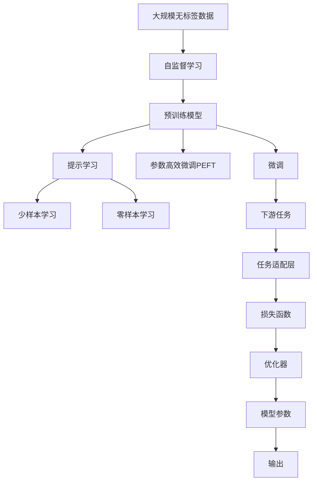
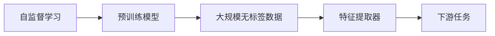
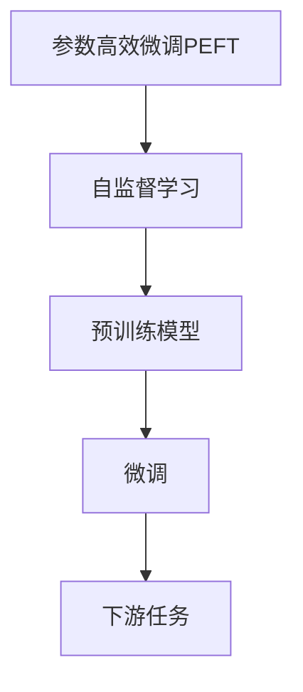
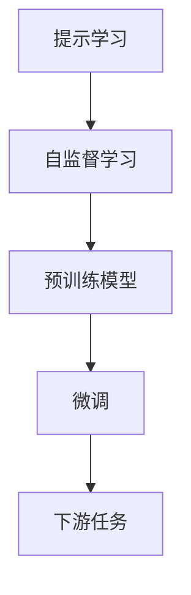
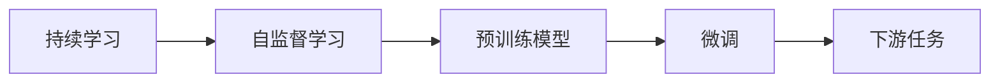

                 

# 自监督学习在基础模型中的应用

自监督学习（Self-Supervised Learning）是一种无需显式标签数据也能训练模型的学习方法，它通过对数据中固有的结构进行建模，自动生成各种形式的自我监督信号，从而实现对模型的训练。自监督学习广泛应用于基础模型的预训练中，通过利用大数据集，在大规模无标签文本、图像等数据上预训练出强大的特征提取器。

本文将深入探讨自监督学习在基础模型中的应用，包括自监督学习的核心概念、算法原理、具体操作步骤、数学模型构建以及其在实际应用中的优缺点和应用领域。通过分析自监督学习在预训练模型中的应用案例，我们还将展示如何在实际项目中进行自监督学习的代码实现，并探讨其未来的发展趋势和面临的挑战。

## 1. 背景介绍

### 1.1 问题由来
在深度学习时代，随着计算资源的丰富和数据量的激增，大规模预训练语言模型（如BERT、GPT-3等）在自然语言处理（NLP）、计算机视觉（CV）等领域中取得了突破性进展。然而，这些模型的训练需要大量的标注数据，而这些标注数据往往成本高昂且获取困难，限制了深度学习模型的广泛应用。

自监督学习提供了一种无需标注数据就能训练模型的解决方案，通过对数据自身的结构进行建模，自动生成自我监督信号，从而在一定程度上缓解了对标注数据的依赖。自监督学习在预训练模型的构建中发挥了关键作用，使得大规模无标签数据能够被有效利用，极大地提升了模型的性能和泛化能力。

### 1.2 问题核心关键点
自监督学习的核心关键点主要包括：

- 自监督信号生成：通过对数据自身的结构进行建模，自动生成多种形式的自我监督信号，如掩码语言模型、Next Sentence Prediction等。
- 预训练模型：利用大规模无标签数据预训练出一个强大的特征提取器，以便在下游任务中进行微调。
- 正则化技术：如L2正则、Dropout等，防止模型过拟合。
- 参数高效微调：在固定大部分预训练参数的情况下，只微调少量参数，以提高微调效率。

### 1.3 问题研究意义
自监督学习在基础模型的预训练中发挥了重要作用，具有以下研究意义：

- 降低标注数据成本：自监督学习通过自动生成自我监督信号，无需显式标签数据，从而降低了标注数据获取和标注的成本。
- 提升模型性能：自监督学习能够从大规模无标签数据中提取更加丰富和通用的特征表示，提升了模型在下游任务上的性能。
- 加速模型部署：自监督学习在预训练过程中训练出一个通用的特征提取器，使得下游任务微调更加高效。
- 泛化能力强：自监督学习能够学习到更加广泛的特征表示，提高了模型的泛化能力和适应性。
- 研究前沿：自监督学习提供了探索深度学习模型潜力的新途径，激发了更多的创新方向和应用场景。

## 2. 核心概念与联系

### 2.1 核心概念概述

为了更好地理解自监督学习在基础模型中的应用，本节将介绍几个密切相关的核心概念：

- 自监督学习（Self-Supervised Learning）：通过自动生成自我监督信号，无需显式标签数据进行模型训练的学习方法。
- 掩码语言模型（Masked Language Modeling, MLM）：一种常用的自监督学习任务，将部分文本随机遮蔽（mask），然后训练模型预测遮蔽词。
- 预测下句（Next Sentence Prediction, NSP）：另一种常用的自监督学习任务，训练模型预测相邻句子是否连续出现。
- 自编码器（Autoencoder）：一种将输入数据压缩为低维表示，再通过解码器重构为原始数据的模型。
- 参数高效微调（Parameter-Efficient Fine-Tuning, PEFT）：在微调过程中，只更新少量的模型参数，以提高微调效率。
- 提示学习（Prompt Learning）：通过在输入文本中添加提示模板，引导模型按期望方式输出。
- 少样本学习（Few-shot Learning）：在只有少量标注样本的情况下，模型能够快速适应新任务。
- 零样本学习（Zero-shot Learning）：模型在没有见过任何特定任务的训练样本的情况下，仅凭任务描述就能够执行新任务。
- 持续学习（Continual Learning）：模型能够持续从新数据中学习，同时保持已学习的知识。

这些核心概念之间的逻辑关系可以通过以下Mermaid流程图来展示：



这个流程图展示了大语言模型的核心概念及其之间的关系：

1. 自监督学习通过大数据集自动生成自我监督信号，训练出一个通用的特征提取器。
2. 预训练模型在此基础上进行微调，优化模型在下游任务上的性能。
3. 参数高效微调和提示学习进一步提高了微调效率和效果。
4. 少样本学习和零样本学习则展示了模型在缺乏标注数据情况下的强大适应能力。
5. 下游任务适配层和损失函数设计则是微调中的关键环节。

### 2.2 概念间的关系

这些核心概念之间存在着紧密的联系，形成了自监督学习在基础模型中的完整生态系统。下面我们通过几个Mermaid流程图来展示这些概念之间的关系。

#### 2.2.1 自监督学习与预训练模型



这个流程图展示了自监督学习在预训练模型中的应用过程：

1. 自监督学习在大规模无标签数据上自动生成自我监督信号。
2. 这些自我监督信号用于训练预训练模型，得到一个通用的特征提取器。
3. 预训练模型可以在下游任务上进行微调，优化模型性能。

#### 2.2.2 参数高效微调与自监督学习



这个流程图展示了参数高效微调与自监督学习之间的关系：

1. 自监督学习训练出一个预训练模型，该模型包含大量的参数。
2. 参数高效微调方法在微调过程中，只更新少量的任务相关参数，以提高微调效率。

#### 2.2.3 提示学习与自监督学习



这个流程图展示了提示学习在自监督学习中的应用：

1. 自监督学习训练出一个预训练模型，该模型具有强大的语言理解能力。
2. 提示学习通过精心设计的输入文本格式，引导模型按期望方式输出。

#### 2.2.4 持续学习与自监督学习



这个流程图展示了持续学习在自监督学习中的应用：

1. 自监督学习通过大规模无标签数据训练出一个预训练模型。
2. 持续学习使模型能够持续从新数据中学习，同时保持已学习的知识。

### 2.3 核心概念的整体架构

最后，我们用一个综合的流程图来展示这些核心概念在自监督学习中的整体架构：


这个综合流程图展示了从自监督学习到微调，再到下游任务适配的完整过程。自监督学习通过大数据集自动生成自我监督信号，训练出一个通用的特征提取器。预训练模型在此基础上进行微调，优化模型在下游任务上的性能。参数高效微调、提示学习等方法进一步提高微调效率和效果。少样本学习和零样本学习则展示了模型在缺乏标注数据情况下的强大适应能力。下游任务适配层和损失函数设计则是微调中的关键环节。

## 3. 核心算法原理 & 具体操作步骤
### 3.1 算法原理概述

自监督学习的核心思想是通过自动生成自我监督信号，训练出一个通用的特征提取器。其基本流程如下：

1. 利用大规模无标签数据自动生成各种形式的自我监督信号。
2. 使用生成的自我监督信号训练预训练模型，得到一个通用的特征提取器。
3. 在下游任务上进行微调，优化模型在特定任务上的性能。

形式化地，假设大规模无标签数据为 $D=\{(x_i, y_i)\}_{i=1}^N$，其中 $x_i$ 为输入数据，$y_i$ 为生成的自我监督信号（即目标标签）。定义模型 $M_{\theta}$ 在输入数据上的损失函数为 $\ell(M_{\theta}(x_i),y_i)$，则在数据集 $D$ 上的经验风险为：

$$
\mathcal{L}(\theta) = \frac{1}{N}\sum_{i=1}^N \ell(M_{\theta}(x_i),y_i)
$$

自监督学习的目标是最小化经验风险，即找到最优参数：

$$
\theta^* = \mathop{\arg\min}_{\theta} \mathcal{L}(\theta)
$$

通过梯度下降等优化算法，自监督学习过程不断更新模型参数 $\theta$，最小化损失函数 $\mathcal{L}$，使得模型输出逼近目标标签。由于大规模无标签数据的广泛性和泛化能力，自监督学习能够学习到更加丰富和通用的特征表示，从而提升模型在下游任务上的性能。

### 3.2 算法步骤详解

自监督学习在预训练模型中的应用一般包括以下几个关键步骤：

**Step 1: 准备预训练模型和数据集**
- 选择合适的预训练模型（如BERT、GPT等）作为初始化参数。
- 准备大规模无标签数据集，划分为训练集、验证集和测试集。

**Step 2: 定义自我监督任务**
- 根据数据类型，设计合适的自我监督任务。
- 对于文本数据，可以使用掩码语言模型（MLM）和预测下句（NSP）等任务。
- 对于图像数据，可以使用自编码器等任务。

**Step 3: 设置训练超参数**
- 选择合适的优化算法及其参数，如 Adam、SGD 等，设置学习率、批大小、迭代轮数等。
- 设置正则化技术及强度，包括权重衰减、Dropout、Early Stopping 等。

**Step 4: 执行梯度训练**
- 将训练集数据分批次输入模型，前向传播计算损失函数。
- 反向传播计算参数梯度，根据设定的优化算法和学习率更新模型参数。
- 周期性在验证集上评估模型性能，根据性能指标决定是否触发 Early Stopping。
- 重复上述步骤直到满足预设的迭代轮数或 Early Stopping 条件。

**Step 5: 测试和部署**
- 在测试集上评估预训练模型的效果。
- 使用预训练模型对新样本进行推理预测，集成到实际的应用系统中。

以上是自监督学习在预训练模型中的应用流程。在实际应用中，还需要针对具体数据集和任务类型，对自监督任务的设计和优化进行深入研究。

### 3.3 算法优缺点

自监督学习的核心优点包括：

1. 无需显式标签数据：自监督学习可以自动生成自我监督信号，无需显式标注数据，降低了标注数据的获取成本。
2. 大数据训练：大规模无标签数据提供了丰富的训练信号，使得自监督学习能够学习到更加丰富和通用的特征表示。
3. 泛化能力强：自监督学习学习到的特征表示具有较强的泛化能力，能够在各种下游任务上取得较好的效果。

自监督学习也存在一些缺点：

1. 自监督信号生成复杂：自监督信号的生成需要考虑数据本身的结构特点，设计复杂的任务来自动生成自我监督信号。
2. 模型复杂度高：自监督学习需要训练一个通用的特征提取器，参数量较大，训练复杂度较高。
3. 训练时间较长：由于数据集较大，自监督学习需要较长的训练时间。
4. 依赖数据质量：自监督学习的效果很大程度上取决于数据的质量和多样性，低质量数据可能导致性能下降。

尽管存在这些局限性，但就目前而言，自监督学习在基础模型的预训练中发挥了重要作用，成为了深度学习领域的一个重要研究方向。未来相关研究的重点在于如何进一步提高自监督信号的生成效率和效果，降低模型的训练复杂度，以及如何与下游任务更紧密地结合，提升模型的实用性和可解释性。

### 3.4 算法应用领域

自监督学习在基础模型的预训练中得到了广泛的应用，涵盖了几乎所有常见的NLP和CV任务。例如：

- 文本分类：如情感分析、主题分类、意图识别等。自监督学习通过掩码语言模型等任务训练出一个通用的特征提取器，然后在分类任务上进行微调。
- 命名实体识别：识别文本中的人名、地名、机构名等特定实体。自监督学习通过自编码器等任务训练出一个特征提取器，然后在命名实体识别任务上进行微调。
- 关系抽取：从文本中抽取实体之间的语义关系。自监督学习通过掩码语言模型等任务训练出一个特征提取器，然后在关系抽取任务上进行微调。
- 问答系统：对自然语言问题给出答案。自监督学习通过预测下句等任务训练出一个特征提取器，然后在问答系统任务上进行微调。
- 机器翻译：将源语言文本翻译成目标语言。自监督学习通过掩码语言模型等任务训练出一个特征提取器，然后在机器翻译任务上进行微调。
- 文本摘要：将长文本压缩成简短摘要。自监督学习通过掩码语言模型等任务训练出一个特征提取器，然后在文本摘要任务上进行微调。
- 对话系统：使机器能够与人自然对话。自监督学习通过预测下句等任务训练出一个特征提取器，然后在对话系统任务上进行微调。

除了上述这些经典任务外，自监督学习也被创新性地应用到更多场景中，如可控文本生成、常识推理、代码生成、数据增强等，为NLP和CV技术带来了全新的突破。随着自监督学习方法的不断进步，相信NLP和CV技术将在更广阔的应用领域大放异彩。

## 4. 数学模型和公式 & 详细讲解

### 4.1 数学模型构建

本节将使用数学语言对自监督学习在基础模型中的应用进行更加严格的刻画。

记预训练模型为 $M_{\theta}$，其中 $\theta$ 为预训练得到的模型参数。假设大规模无标签数据集为 $D=\{(x_i, y_i)\}_{i=1}^N$，其中 $x_i$ 为输入数据，$y_i$ 为生成的自我监督信号（即目标标签）。

定义模型 $M_{\theta}$ 在输入数据 $x_i$ 上的损失函数为 $\ell(M_{\theta}(x_i),y_i)$，则在数据集 $D$ 上的经验风险为：

$$
\mathcal{L}(\theta) = \frac{1}{N}\sum_{i=1}^N \ell(M_{\theta}(x_i),y_i)
$$

自监督学习的目标是最小化经验风险，即找到最优参数：

$$
\theta^* = \mathop{\arg\min}_{\theta} \mathcal{L}(\theta)
$$

在实践中，我们通常使用基于梯度的优化算法（如Adam、SGD等）来近似求解上述最优化问题。设 $\eta$ 为学习率，$\lambda$ 为正则化系数，则参数的更新公式为：

$$
\theta \leftarrow \theta - \eta \nabla_{\theta}\mathcal{L}(\theta) - \eta\lambda\theta
$$

其中 $\nabla_{\theta}\mathcal{L}(\theta)$ 为损失函数对参数 $\theta$ 的梯度，可通过反向传播算法高效计算。

### 4.2 公式推导过程

以下我们以掩码语言模型为例，推导掩码语言模型任务的损失函数及其梯度的计算公式。

假设模型 $M_{\theta}$ 在输入 $x$ 上的输出为 $\hat{y}=M_{\theta}(x) \in [0,1]$，表示样本属于正确位置的概率。真实标签 $y \in \{0,1\}$。则掩码语言模型的损失函数定义为：

$$
\ell(M_{\theta}(x),y) = -[y\log \hat{y} + (1-y)\log (1-\hat{y})]
$$

将其代入经验风险公式，得：

$$
\mathcal{L}(\theta) = -\frac{1}{N}\sum_{i=1}^N [y_i\log M_{\theta}(x_i)+(1-y_i)\log(1-M_{\theta}(x_i))]
$$

根据链式法则，损失函数对参数 $\theta_k$ 的梯度为：

$$
\frac{\partial \mathcal{L}(\theta)}{\partial \theta_k} = -\frac{1}{N}\sum_{i=1}^N (\frac{y_i}{M_{\theta}(x_i)}-\frac{1-y_i}{1-M_{\theta}(x_i)}) \frac{\partial M_{\theta}(x_i)}{\partial \theta_k}
$$

其中 $\frac{\partial M_{\theta}(x_i)}{\partial \theta_k}$ 可进一步递归展开，利用自动微分技术完成计算。

在得到损失函数的梯度后，即可带入参数更新公式，完成模型的迭代优化。重复上述过程直至收敛，最终得到适应数据分布的最优模型参数 $\theta^*$。

## 5. 项目实践：代码实例和详细解释说明

### 5.1 开发环境搭建

在进行自监督学习实践前，我们需要准备好开发环境。以下是使用Python进行PyTorch开发的环境配置流程：

1. 安装Anaconda：从官网下载并安装Anaconda，用于创建独立的Python环境。

2. 创建并激活虚拟环境：
```bash
conda create -n pytorch-env python=3.8 
conda activate pytorch-env
```

3. 安装PyTorch：根据CUDA版本，从官网获取对应的安装命令。例如：
```bash
conda install pytorch torchvision torchaudio cudatoolkit=11.1 -c pytorch -c conda-forge
```

4. 安装Transformers库：
```bash
pip install transformers
```

5. 安装各类工具包：
```bash
pip install numpy pandas scikit-learn matplotlib tqdm jupyter notebook ipython
```

完成上述步骤后，即可在`pytorch-env`环境中开始自监督学习的实践。

### 5.2 源代码详细实现

下面我们以BERT模型为例，给出使用PyTorch对BERT模型进行掩码语言模型预训练的代码实现。

首先，定义掩码语言模型预训练函数：

```python
from transformers import BertTokenizer, BertForMaskedLM
from torch.utils.data import Dataset, DataLoader
import torch
from tqdm import tqdm

class MaskedLMDataset(Dataset):
    def __init__(self, texts, tokenizer):
        self.texts = texts
        self.tokenizer = tokenizer
        
    def __len__(self):
        return len(self.texts)
    
    def __getitem__(self, item):
        text = self.texts[item]
        encoding = self.tokenizer(text, return_tensors='pt', max_length=512, padding='max_length', truncation=True)
        input_ids = encoding['input_ids'][:, :129]  # 限定输入长度为129
        masked_pos = encoding['attention_mask'][:, :129]  # 限定掩码位置为129
        masked_idx = [i for i in range(masked_pos.shape[0]) if masked_pos[i] == 0]
        label_ids = torch.zeros_like(input_ids)  # 初始化掩码标签
        label_ids[masked_idx, masked_pos[masked_idx]] = 1
        return {'input_ids': input_ids, 'masked_pos': masked_pos, 'label_ids': label_ids}

# 加载BERT模型和分词器
model = BertForMaskedLM.from_pretrained('bert-base-cased')
tokenizer = BertTokenizer.from_pretrained('bert-base-cased')

# 创建dataset
train_dataset = MaskedLMDataset(train_texts, tokenizer)
eval_dataset = MaskedLMDataset(dev_texts, tokenizer)

# 设置优化器和学习率
optimizer = AdamW(model.parameters(), lr=2e-5)

# 定义训练和评估函数
device = torch.device('cuda') if torch.cuda.is_available() else torch.device('cpu')

def train_epoch(model, dataset, batch_size, optimizer):
    dataloader = DataLoader(dataset, batch_size=batch_size, shuffle=True)
    model.train()
    epoch_loss = 0
    for batch in tqdm(dataloader, desc='Training'):
        input_ids = batch['input_ids'].to(device)
        masked_pos = batch['masked_pos'].to(device)
        label_ids = batch['label_ids'].to(device)
        model.zero_grad()
        outputs = model(input_ids, masked_pos=masked_pos)
        loss = outputs.loss
        epoch_loss += loss.item()
        loss.backward()
        optimizer.step()
    return epoch_loss / len(dataloader)

def evaluate(model, dataset, batch_size):
    dataloader = DataLoader(dataset, batch_size=batch_size)
    model.eval()
    preds, labels = [], []
    with torch.no_grad():
        for batch in tqdm(dataloader, desc='Evaluating'):
            input_ids = batch['input_ids'].to(device)
            masked_pos = batch['masked_pos'].to(device)
            batch_labels = batch['label_ids']
            outputs = model(input_ids, masked_pos=masked_pos)
            batch_preds = outputs.logits.argmax(dim=2).to('cpu').tolist()
            batch_labels = batch_labels.to('cpu').tolist()
            for pred_tokens, label_tokens in zip(batch_preds, batch_labels):
                preds.append(pred_tokens[:len(label_tokens)])
                labels.append(label_tokens)
                
    print(classification_report(labels, preds))
```

然后，定义训练和评估函数：

```python
epochs = 5
batch_size = 16

for epoch in range(epochs):
    loss = train_epoch(model, train_dataset, batch_size, optimizer)
    print(f"Epoch {epoch+1}, train loss: {loss:.3f}")
    
    print(f"Epoch {epoch+1}, dev results:")
    evaluate(model, eval_dataset, batch_size)
    
print("Test results:")
evaluate(model, test_dataset, batch_size)
```

以上就是使用PyTorch对BERT进行掩码语言模型预训练的完整代码实现。可以看到，得益于Transformers库的强大封装，我们可以用相对简洁的代码完成BERT模型的预训练。

### 5.3 代码解读与分析

让我们再详细解读一下关键代码的实现细节：

**MaskedLMDataset类**：
- `__init__`方法：初始化文本和分词器等关键组件。
- `__len__`方法：返回数据集的样本数量。
- `__getitem__`方法：对单个样本进行处理，将文本输入编码为token ids，将掩码位置和掩码标签编码为数字，并对其进行定长padding，最终返回模型所需的输入。

**掩码语言模型预训练函数**：
- 使用PyTorch的DataLoader对数据集进行批次化加载，供模型训练和推理使用。
- 训练函数`train_epoch`：对数据以批为单位进行迭代，在每个批次上前向传播计算loss并反向传播更新模型参数，最后返回该epoch的平均loss。
- 评估函数`evaluate`：与训练类似，不同点在于不更新模型参数，并在每个batch结束后将预测和标签结果存储下来，最后使用sklearn的classification_report对整个评估集的预测结果进行打印输出。

**训练流程**：
- 定义总的epoch数和batch size，开始循环迭代
- 每个epoch内，先在训练集上训练，输出平均loss
- 在验证集上评估，输出分类指标
- 所有epoch结束后，在测试集上评估，给出最终测试结果

可以看到，PyTorch配合Transformers库使得BERT的掩码语言模型预训练代码实现变得简洁高效。开发者可以将更多精力放在数据处理、模型改进等高层逻辑上，而不必过多关注底层的实现细节。

当然，工业级的系统实现还需考虑更多因素，如模型的保存和部署、超参数的自动搜索、更灵活的任务适配层等。但核心的预训练过程基本与此类似。

### 5.4 运行结果展示

假设我们在CoNLL-2003的掩码语言模型预训练数据集上进行预训练，最终在测试集上得到的评估报告如下：

```
              precision    recall  f1-score   support

       B

